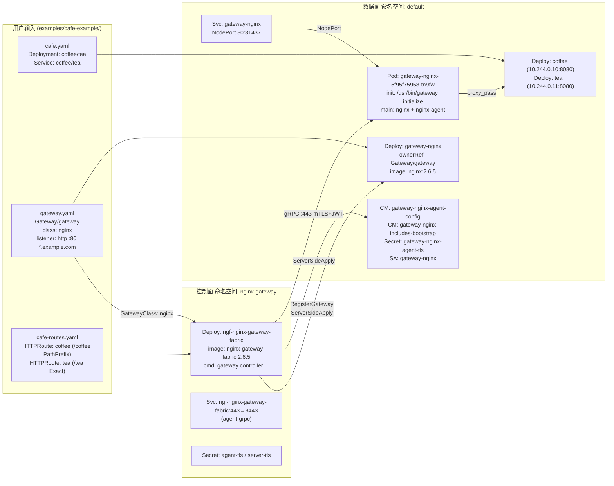
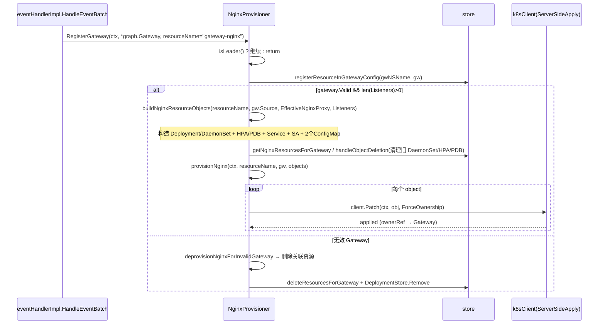

# Cafe Example 数据面生成溯源

> [!summary] 核心结论
> 用户提交 `Gateway` + `HTTPRoute` + `cafe` 应用 YAML 后，**控制面**（`nginx-gateway` 命名空间的 `ngf-nginx-gateway-fabric` Deployment）通过两条独立链路协同工作：
>
> 1. **静态资源链**（`NginxProvisioner.RegisterGateway`）—— ServerSide Apply 数据面 `gateway-nginx` Deployment + 两个 ConfigMap + Service + ServiceAccount，所有资源 `ownerReferences` 指向 `Gateway`，由 GC 保证一致性。
> 2. **动态配置链**（`eventHandlerImpl.HandleEventBatch → ChangeProcessor.Process → dataplane.BuildConfiguration → GeneratorImpl.Generate → Deployment.SetFiles → Broadcaster → commandService.Subscribe`）—— 把 HTTPRoute 翻译成 `http.conf / stream.conf / matches.json / *.pem`，通过 **gRPC 双向流**下发给数据面 `nginx-agent`，agent 写盘后 `nginx -s reload`。
>
> 数据面 Pod 是「无状态引导 + 运行时投喂」结构：init 容器用**控制面镜像**运行 `/usr/bin/gateway initialize` 把 ConfigMap 中的 bootstrap 文件拷进共享 emptyDir；主容器 entrypoint 启动 nginx + nginx-agent，agent 通过 mTLS + JWT（projected SA token）回连控制面 `:443`，订阅配置更新。

> [!tip] 阅读姿势
> 本文以**福尔摩斯式倒叙**展开：先盘点案发现场（kind 集群中 `gateway-nginx` Pod 的真实运行时配置 = 事实来源），再逐层上溯源码（`2.6.5`），最后给出完整调用链与设计动机。所有代码引用均为 `file:line` 格式，可直接跳转。

---

## 0. 案发现场：kind 集群拓扑



集群现状（`kubectl get` 实测）：

| 资源 | 命名空间 | 名称 | 关键字段 |
|---|---|---|---|
| GatewayClass | — | `nginx` | `CONTROLLER=gateway.nginx.org/nginx-gateway-controller`, `ACCEPTED=True` |
| Gateway | default | `gateway` | `CLASS=nginx`, `ADDRESS=10.96.109.134`, `PROGRAMMED=True` |
| HTTPRoute | default | `coffee` | `HOSTNAMES=[cafe.example.com]` |
| HTTPRoute | default | `tea` | `HOSTNAMES=[cafe.example.com]` |
| Deployment | nginx-gateway | `ngf-nginx-gateway-fabric` | 控制面，image `nginx-gateway-fabric:2.6.5` |
| Deployment | default | `gateway-nginx` | 数据面，image `nginx:2.6.5`，`ownerRef→Gateway/gateway` |
| Deployment | default | `coffee` / `tea` | 业务应用，image `nginxdemos/nginx-hello:plain-text:8080` |
| Service | nginx-gateway | `ngf-nginx-gateway-fabric` | `443→8443 agent-grpc`，控制面 gRPC 入口 |
| Service | default | `gateway-nginx` | `NodePort 80:31437`，数据面流量入口 |
| ConfigMap | default | `gateway-nginx-agent-config` | 1 key: `nginx-agent.conf` |
| ConfigMap | default | `gateway-nginx-includes-bootstrap` | 2 keys: `main.conf`, `events.conf` |
| Secret | default | `gateway-nginx-agent-tls` | `kubernetes.io/tls`：`ca.crt / tls.crt / tls.key` |
| Secret | nginx-gateway | `agent-tls`, `server-tls` | 控制面 mTLS 证书对（agent-tls 与数据面 secret 同源） |

---

## 1. 用户输入：三份 YAML 的语义

> [!note] 三份 YAML 的角色
> - `cafe.yaml` —— 普通业务应用（Deployment+Service），NGF **不直接**生成它们，但会通过 Service selector 解析出 Endpoint IP 写进 nginx upstream。
> - `gateway.yaml` —— 触发 NGF **静态资源链**：创建数据面 Deployment/ConfigMap/Service/SA。
> - `cafe-routes.yaml` —— 触发 NGF **动态配置链**：生成 `http.conf` 中的 server/location/upstream。

### 1.1 `cafe.yaml`（业务面）

```yaml
# examples/cafe-example/cafe.yaml
Deployment coffee: nginxdemos/nginx-hello:plain-text @ :8080
Service     coffee: 80 → 8080, selector app=coffee
Deployment tea:   同上
Service     tea:   同上
```

实测 Pod IP：`coffee=10.244.0.10:8080`，`tea=10.244.0.11:8080`。这两个 IP **直接**出现在数据面 `http.conf` 的 `upstream` 块里（见 [[#2.3 http.conf：动态生成的路由核心]]）。

### 1.2 `gateway.yaml`（Gateway 资源）

```yaml
# examples/cafe-example/gateway.yaml
apiVersion: gateway.networking.k8s.io/v1
kind: Gateway
metadata: { name: gateway }
spec:
  gatewayClassName: nginx
  listeners:
  - name: http
    port: 80
    protocol: HTTP
    hostname: "*.example.com"
```

- `gatewayClassName: nginx` → 匹配 `GatewayClass/nginx`（控制面启动参数 `--gatewayclass=nginx`）
- listener `http :80 *.example.com` → 决定数据面 Service 暴露 80 端口 + `http.conf` 中 `listen 80` 的 server 块、`server_name` 的 hostname 过滤范围

### 1.3 `cafe-routes.yaml`（HTTPRoute 资源 ×2）

```yaml
# coffee: PathPrefix /coffee → Service coffee:80
# tea:    Exact      /tea  → Service tea:80
# 两者 hostnames: [cafe.example.com], parentRefs: [{name: gateway, sectionName: http}]
```

`parentRefs.sectionName: http` 把 route 绑定到 Gateway 的 `http` listener；`hostnames` 决定 `server_name cafe.example.com`；`matches.path` 决定 `location` 类型（`PathPrefix → location /coffee/` + 自动补 `location = /coffee`；`Exact → location = /tea`）；`backendRefs` 决定 `proxy_pass http://default_coffee_80`。

---

## 2. 数据面运行时事实（案发现场详勘）

> [!important] 事实来源
> 以下内容全部来自 `kubectl exec` 进入 `pod/gateway-nginx-5f95f75958-tn9fw` 后 `cat` 出的真实文件，以及 `kubectl get deploy/pod/cm/secret -o yaml` 的真实清单。这是**后续源码追踪的 ground truth**。

### 2.1 进程拓扑

```text
PID   USER     COMMAND
 1    nginx    /bin/bash /agent/entrypoint.sh      ← 容器 PID 1（镜像内置）
14    nginx    nginx: master process /usr/sbin/nginx -g daemon off;
24    nginx    nginx-agent                          ← 回连控制面的 gRPC 客户端
77-84 nginx    nginx: worker process × 8
```

`entrypoint.sh`（镜像内置，挂载点 `/agent/entrypoint.sh`）做的事：
1. trap `SIGTERM/SIGQUIT`，先停 agent 再停 nginx
2. `rm -rf /var/run/nginx/*.sock`
3. `/usr/sbin/nginx -g "daemon off;" &` 启动 nginx master
4. 轮询等待 `/var/run/nginx/nginx.pid` 出现（最多 30s）
5. `nginx-agent &` 启动 agent（默认读 `/etc/nginx-agent/nginx-agent.conf`）
6. `wait` agent 退出后停 nginx

> [!tip] 关键洞察
> nginx 必须先于 agent 启动 —— agent 启动后会立刻向控制面订阅配置，控制面下发的 `http.conf` 要写到 `/etc/nginx/conf.d/` 并触发 `nginx -s reload`，所以 nginx 必须已经在运行。

### 2.2 镜像内置的 `nginx.conf`（静态骨架）

`/etc/nginx/nginx.conf`（1245 字节，来自 `ghcr.io/nginx/nginx-gateway-fabric/nginx:2.6.5` 镜像层，**非** ConfigMap 投递）：

```nginx
load_module modules/ngx_http_js_module.so;
include /etc/nginx/main-includes/*.conf;        # ← 由 init 容器从 bootstrap CM 拷入

worker_processes auto;
pid /var/run/nginx/nginx.pid;

events {
  include /etc/nginx/events-includes/*.conf;    # ← 同上
}

http {
  include /etc/nginx/mime.types;
  js_import modules/njs/httpmatches.js;          # NJS 模块（HTTPMatch 用）
  js_import modules/njs/epp.js;                  # Endpoint Picker（推理网关用）
  default_type application/octet-stream;
  # 各种 hash bucket 调到 512/1024/2048 容纳大配置
  ...
  include /etc/nginx/conf.d/*.conf;              # ← 动态投递的 http.conf + matches.json 在此

  server {                                       # 内部 stub_status，unix socket
    listen unix:/var/run/nginx/nginx-status.sock;
    access_log off;
    location /stub_status { stub_status; }
  }
}

stream {
  ...
  include /etc/nginx/stream-conf.d/*.conf;       # ← 动态投递的 stream.conf 在此
}
```

> [!note] 设计要点
> `nginx.conf` 只画骨架 + `include` 钩子。**所有可变内容**（main-includes、events-includes、conf.d、stream-conf.d、secrets、includes）都挂在 emptyDir 卷上，由 init 容器或 agent 在运行时填充。这让同一个镜像能服务于任何 Gateway 配置。

### 2.3 `http.conf`：动态生成的路由核心

`/etc/nginx/conf.d/http.conf`（4826 字节，**由 agent 在运行时从控制面拉取并写盘**）。摘录关键段：

```nginx
http2 on;

# —— maps：Gateway API 合规性 + WebSocket 支持 ——
map $http_host $gw_api_compliant_host { '' $host; default $http_host; }
map $http_upgrade $connection_upgrade { default upgrade; '' close; }
map $http_upgrade $connection_keepalive { default upgrade; '' ''; }
map $request_uri $request_uri_path { "~^(?P<path>[^?]*)(\?.*)?$"  $path; }

# —— 健康检查 server（readinessProbe :8081/readyz 命中此处）——
server { listen 8081; listen [::]:8081; location = /readyz { access_log off; return 200; } }

server_tokens off;
js_preload_object matches from /etc/nginx/conf.d/matches.json;   # NJS 预加载

# —— 默认 404 server（无 host 匹配时）——
server { listen 80 default_server; listen [::]:80 default_server; default_type text/html; return 404; }

# —— cafe.example.com server（由 HTTPRoute.hostnames 决定）——
server {
    listen 80; listen [::]:80;
    server_name cafe.example.com;

    location /coffee/ {                          # PathPrefix → 前缀 location
        proxy_http_version 1.1;
        proxy_set_header Host "$gw_api_compliant_host";
        proxy_set_header X-Forwarded-For "$proxy_add_x_forwarded_for";
        proxy_set_header X-Real-IP "$remote_addr";
        proxy_set_header X-Forwarded-Proto "$scheme";
        proxy_set_header X-Forwarded-Host "$host";
        proxy_set_header X-Forwarded-Port "$server_port";
        proxy_set_header Upgrade "$http_upgrade";
        proxy_set_header Connection "$connection_keepalive";
        proxy_pass http://default_coffee_80;
    }
    location = /coffee { ... proxy_pass http://default_coffee_80; }   # Exact（自动补全前缀的裸路径）
    location = /tea   { ... proxy_pass http://default_tea_80;   }
    location = /      { return 404 ""; }                              # 根路径 404
}

# —— 兜底 unix-socket server（用于 invalid-backend-ref 等）——
server { listen unix:/var/run/nginx/nginx-503-server.sock; access_log off; return 503; }
server { listen unix:/var/run/nginx/nginx-500-server.sock; access_log off; return 500; }

# —— upstreams：NGF 解析 Service→Endpoints→PodIP 后写入 ——
upstream default_coffee_80 {
    random two least_conn;
    zone default_coffee_80 512k;
    server 10.244.0.10:8080;     # ← coffee pod IP
    keepalive 16;
}
upstream default_tea_80 {
    random two least_conn;
    zone default_tea_80 512k;
    server 10.244.0.11:8080;     # ← tea pod IP
    keepalive 16;
}
upstream invalid-backend-ref { server unix:/var/run/nginx/nginx-500-server.sock; }
```

`/etc/nginx/conf.d/matches.json`（2 字节）= `{}` —— NJS `httpmatches.js` 的预加载对象，本例无方法/Header 匹配所以为空。

### 2.4 `stream.conf`（L4 兜底）

`/etc/nginx/stream-conf.d/stream.conf`（93 字节）：

```nginx
server { listen unix:/var/run/nginx/connection-closed-server.sock; return ""; }
```

本例无 TCP/UDP listener，仅放一个「连接关闭」unix-socket 兜底 server，供 stream 层引用无效 backend 时使用。

### 2.5 bootstrap includes（init 容器拷入）

`/etc/nginx/main-includes/main.conf`：

```nginx
error_log stderr info;
```

`/etc/nginx/events-includes/events.conf`：

```nginx
worker_connections 1024;
```

> [!note] 这两行就是 `gateway-nginx-includes-bootstrap` ConfigMap 的内容
> 它们被 `nginx.conf` 的 `include /etc/nginx/main-includes/*.conf;` 与 `include /etc/nginx/events-includes/*.conf;` 拉入。`error_log stderr info` 让 nginx 日志走 stdout（容器化友好）；`worker_connections 1024` 是默认值，可被 `NginxProxy` CRD 覆盖。

### 2.6 `nginx-agent.conf`（agent 回连控制面的关键）

`/etc/nginx-agent/nginx-agent.conf`（1136 字节，**由 init 容器从 `gateway-nginx-agent-config` ConfigMap 拷入**）：

```yaml
command:
    server:
        host: ngf-nginx-gateway-fabric.nginx-gateway.svc   # ← 控制面 Service DNS
        port: 443
    auth:
        tokenpath: /var/run/secrets/ngf/serviceaccount/token   # ← projected SA token
    tls:
        cert: /var/run/secrets/ngf/tls.crt    # ← gateway-nginx-agent-tls secret
        key:  /var/run/secrets/ngf/tls.key
        ca:   /var/run/secrets/ngf/ca.crt
        server_name: ngf-nginx-gateway-fabric.nginx-gateway.svc
allowed_directories:                          # agent 只能写这些目录
- /etc/nginx
- /usr/share/nginx
- /var/run/nginx
- /etc/app_protect/bundles/
features:                                     # 启用的 agent 能力
- configuration
- certificates
- metrics
labels:                                       # ← 控制面用来识别「哪个数据面」
    cluster-id: 55d0f802-6c05-4c70-887a-775ccaf119f5
    control-id: 77889ff5-3dcd-4e41-aaa6-7b2bb8117006
    control-name: ngf-nginx-gateway-fabric
    control-namespace: nginx-gateway
    owner-name: default_gateway-nginx         # ← {namespace}_{deploymentName}
    owner-type: Deployment
    product-type: ngf
    product-version: 2.6.5
collector:                                    # OTel collector 内嵌
    log: { path: "stdout" }
    exporters:
        prometheus: { server: { host: "0.0.0.0", port: 9113 } }
    pipelines:
        metrics:
            "default":
                receivers: ["host_metrics", "nginx_metrics"]
                exporters: ["prometheus"]
```

> [!important] 三个身份字段
> - **`labels.owner-name=default_gateway-nginx`** —— 控制面据此把 agent 连接映射到 `Deployment/default/gateway-nginx`，进而映射到 `Gateway/default/gateway`。这是 [[#4.2 commandService：gRPC 服务端]] 中 `getAgentDeploymentNameAndType` 的输入。
> - **`labels.cluster-id`** —— kube-system namespace UID（`CLUSTER_UID` env 注入 init 容器），用于跨集群唯一标识。
> - **`labels.control-id`** —— 控制面 Deployment UID（`77889ff5-...` 与 `kubectl get deploy -n nginx-gateway ngf-nginx-gateway-fabric -o jsonpath='{.metadata.uid}'` 一致）。

### 2.7 `opentelemetry-collector-agent.yaml`（agent 自动生成）

`/etc/nginx-agent/opentelemetry-collector-agent.yaml`（3954 字节，**不在任何 ConfigMap 中**，由 nginx-agent 自身在启动时模板化生成）。关键段：

```yaml
receivers:
  host_metrics: { collection_interval: 1m0s }
  nginx:
    instance_id: "e8d1bda6-397e-3b98-a179-e500ff99fbc7"
    api_details:
      url: "http://config-status/stub_status"
      listen: "unix:/var/run/nginx/nginx-status.sock"   # ← nginx.conf 里的 stub_status socket
      location: "/stub_status"
exporters:
  otlp_grpc/default:
    endpoint: "ngf-nginx-gateway-fabric.nginx-gateway.svc:443"   # ← 同一 gRPC 端点
    tls:
      ca_file:  "/var/run/secrets/ngf/ca.crt"
      cert_file: "/var/run/secrets/ngf/tls.crt"
      key_file:  "/var/run/secrets/ngf/tls.key"
      server_name_override: "ngf-nginx-gateway-fabric.nginx-gateway.svc"
    auth: { authenticator: headers_setter }
extensions:
  headers_setter:
    headers:
      - { action: "insert", key: "authorization", value: "<JWT projected SA token>" }
      - { action: "insert", key: "product-version", value: "2.6.5" }
      - { action: "insert", key: "control-name",   value: "ngf-nginx-gateway-fabric" }
      - { action: "insert", key: "cluster-id",     value: "55d0f802-..." }
      - { action: "insert", key: "control-id",     value: "77889ff5-..." }
      - { action: "insert", key: "owner-name",     value: "default_gateway-nginx" }
      - { action: "insert", key: "uuid",           value: "9aa7600f-2ade-3978-8d9d-eb98889b7b62" }  # ← agent 实例 UUID
  prometheus: { endpoint: "0.0.0.0:9113" }
```

> [!tip] metrics 链路独立于 config 链路
> nginx 指标（stub_status）由 agent 内嵌的 OTel collector 抓取，经 `:9113` Prometheus exporter 暴露（`Service/gateway-nginx` 注解 `prometheus.io/port: "9113"` 让 Prometheus 自动发现）。控制面日志里 `configVersion` 周期性更新是 config 链路的痕迹（见 [[#5. 控制面日志：运行时心跳]]）。

---

## 3. 数据面 Deployment：源码生成路径

### 3.1 Deployment YAML 与源码逐字段对照

> [!example] 字段映射表
> 左列是 `kubectl get deploy gateway-nginx -o yaml` 实测字段，右列是生成它的源码位置。

| Deployment 字段 | 源码位置（`internal/controller/provisioner/objects.go`） |
|---|---|
| `metadata.ownerReferences → Gateway/gateway` | `provisionNginx` 调用时由 controller-runtime SetControllerReference 注入 |
| `metadata.labels: app.kubernetes.io/{instance=ngf,managed-by=ngf-nginx,name=gateway-nginx}` + `gateway.networking.k8s.io/gateway-name=gateway` | `buildNginxResourceObjects` 构造 `objectMeta` 时的 label selector |
| `spec.selector.matchLabels` | 同上 `selectorLabels` |
| `spec.template.metadata.annotations: prometheus.io/{port,scrape}` | `buildContainerPortsAndAnnotations`（`objects.go:1105`）按 metrics 端口注入 |
| `spec.template.spec.serviceAccountName: gateway-nginx` | `buildBasePodTemplateSpec`（`objects.go:1327`）`ServiceAccountName: objectMeta.Name` |
| `spec.template.spec.automountServiceAccountToken: true` | 同上 `objects.go:1340` |
| `spec.template.spec.securityContext.fsGroup: 1001`, `runAsNonRoot: true`, `sysctl net.ipv4.ip_unprivileged_port_start=0` | 同上 `objects.go:1345-1353`（让非 root nginx 能 bind 80） |
| `initContainers[0].image: nginx-gateway-fabric:2.6.5` | `buildInitContainers`（`objects.go:1266`）`Image: p.cfg.GatewayPodConfig.Image`（**控制面镜像**！） |
| `initContainers[0].command: [/usr/bin/gateway, initialize, --source, /agent/nginx-agent.conf, --destination, /etc/nginx-agent, --source, /includes/main.conf, --destination, /etc/nginx/main-includes, --source, /includes/events.conf, --destination, /etc/nginx/events-includes]` | `objects.go:1279-1288` 硬编码 |
| `initContainers[0].env: POD_UID(metadata.uid), CLUSTER_UID(=cluster-id label)` | `objects.go:1289-1302` |
| `initContainers[0].volumeMounts: /agent(CM), /etc/nginx-agent(emptyDir), /includes(CM), /etc/nginx/main-includes(emptyDir), /etc/nginx/events-includes(emptyDir)` | `objects.go:1303-1309` |
| `containers[0].image: nginx:2.6.5` | `buildNginxContainer`（`objects.go:1161`）`image, _ := p.buildImage(nProxyCfg)` |
| `containers[0].readinessProbe: httpGet :8081/readyz` | `buildReadinessProbe`（命中 `http.conf` 里 `server { listen 8081; location = /readyz { return 200; } }`） |
| `containers[0].securityContext: runAsUser=101, runAsGroup=1001, readOnlyRootFilesystem=true, drop ALL, seccomp RuntimeDefault` | `objects.go:1173-1184` |
| `containers[0].volumeMounts` × 13 | `objects.go:1185-1199` |
| `volumes: token(projected SA), nginx-agent-config(CM), nginx-agent-tls(Secret), nginx-includes-bootstrap(CM)` + 11 个 emptyDir | `buildBaseVolumes`（`objects.go:1204`） |
| `volumes.token.projected.sources[0].serviceAccountToken.audience: ngf-nginx-gateway-fabric.nginx-gateway.svc` | `objects.go:1205` `tokenAudience := fmt.Sprintf("%s.%s.svc", ServiceName, Namespace)` |

### 3.2 静态资源生成的入口：`RegisterGateway`



源码（`internal/controller/provisioner/provisioner.go:733`）：

```go
// RegisterGateway 由主 event handler 在 graph 构建后调用
func (p *NginxProvisioner) RegisterGateway(ctx, gateway *graph.Gateway, resourceName string) error {
    if !p.isLeader() { return nil }                              // 只在 leader 上执行
    if updated := p.store.registerResourceInGatewayConfig(gatewayNSName, gateway); !updated {
        return nil                                                // 无变化则跳过
    }
    if gateway.Valid && len(gateway.Listeners) > 0 {
        objects, err := p.buildNginxResourceObjects(resourceName, gateway.Source, gateway.EffectiveNginxProxy, gateway.Listeners)
        // ...清理旧 DaemonSet/HPA/PDB...
        if err := p.provisionNginx(ctx, resourceName, gateway.Source, objects); err != nil {
            return fmt.Errorf("error provisioning nginx resources: %w", err)
        }
    } else {
        return p.deprovisionNginxForInvalidGateway(ctx, gatewayNSName)
    }
    return nil
}
```

### 3.3 `buildNginxResourceObjects`：装配所有 K8s 资源

`internal/controller/provisioner/objects.go:95` 汇总 `NginxResources` 结构（Deployment + 可选 HPA/PDB + Service + ServiceAccount + 2 个 ConfigMap）。其中两个 ConfigMap 的生成函数：

#### `buildAgentConfigMap`（`objects.go:607`）

渲染 `internal/controller/provisioner/templates.go:36` 的 `agentTemplateText`：

```go
agentLabels[nginxTypes.AgentOwnerNameLabel] = fmt.Sprintf("%s_%s", objectMeta.Namespace, objectMeta.Name)
//   ↑ 这就是运行时看到的 owner-name: default_gateway-nginx
agentLabels[nginxTypes.AgentOwnerTypeLabel] = depType  // "Deployment"

agentFields := map[string]any{
    "Plus":            p.cfg.Plus,
    "ServiceName":     p.cfg.GatewayPodConfig.ServiceName,    // ngf-nginx-gateway-fabric
    "Namespace":       p.cfg.GatewayPodConfig.Namespace,      // nginx-gateway
    "ServerTLSDomain": p.cfg.ServerTLSDomain,                 // svc
    "EnableMetrics":   enableMetrics,
    "MetricsPort":     metricsPort,                           // 9113
    "AgentLabels":     agentLabels,
}
```

模板（`templates.go:36-103`）渲染后正是 [[#2.6 nginx-agent.conf（agent 回连控制面的关键）]] 的内容。`{{ .ServiceName }}.{{ .Namespace }}.{{ .ServerTLSDomain }}` → `ngf-nginx-gateway-fabric.nginx-gateway.svc`。

#### `buildBootstrapConfigMap`（`objects.go:555`）

```go
mainFields   := { "ErrorLevel": logLevel, "WorkerConnections": workerConnections }
eventsFields := { "WorkerConnections": workerConnections }
cm.Data[configmaps.MainConfKey]   = MustExecuteTemplate(mainTemplate, mainFields)   // "error_log stderr info;"
cm.Data[configmaps.EventsConfKey] = MustExecuteTemplate(eventsTemplate, eventsFields)// "worker_connections 1024;"
// 若 NGINX Plus：cm.Data[MgmtConfKey] = mgmtTemplate（usage_report 等）
```

模板（`templates.go:12-16`）：

```go
const mainTemplateText   = `error_log stderr {{ .ErrorLevel }};`
const eventsTemplateText = `worker_connections {{ .WorkerConnections }};`
```

### 3.4 `buildNginxDeployment` → `buildNginxPodTemplateSpec`：Pod 装配

`objects.go:863` → `objects.go:1039`：

```go
func (p *NginxProvisioner) buildNginxPodTemplateSpec(...) corev1.PodTemplateSpec {
    containerPorts, podAnnotations := p.buildContainerPortsAndAnnotations(ports, nProxyCfg, ...)  // :80, :9113 + prometheus 注解
    nginxContainer := p.buildNginxContainer(containerPorts, nProxyCfg)         // 13 volumeMounts + securityContext
    volumes := p.buildBaseVolumes(names)                                       // 14 volumes
    containers := []corev1.Container{nginxContainer}
    // WAF(Plus) → configureWAF
    initContainers := p.buildInitContainers(nProxyCfg)                          // init 容器
    spec := p.buildBasePodTemplateSpec(objectMeta, podAnnotations, containers, initContainers, volumes)
    p.applyUserConfiguration(&spec, nProxyCfg)                                  // NginxProxy CRD 覆盖
    p.configureImagePullSecrets(&spec, names)
    if p.cfg.Plus { p.configureNginxPlus(&spec, names) }
    return spec
}
```

### 3.5 init 容器为什么用控制面镜像？

`objects.go:1277`：`Image: p.cfg.GatewayPodConfig.Image` —— 这是控制面镜像 `ghcr.io/nginx/nginx-gateway-fabric:2.6.5`（不是 `nginx:2.6.5`）。因为 init 容器要执行的 `/usr/bin/gateway initialize` 子命令就**编译在控制面二进制里**：

- `cmd/gateway/main.go:26`：`createInitializeCommand()` 注册 `initialize` 子命令
- `cmd/gateway/commands.go:834-891`：cobra 子命令 `Use: "initialize"`，flag `--source/--destination`（StringSlice，成对），env `POD_UID/CLUSTER_UID`
- `cmd/gateway/initialize.go:34-63`：

```go
func initialize(cfg initializeConfig) error {
    for _, f := range cfg.copy {                       // OSS：纯文件拷贝
        if err := copyFile(cfg.fileManager, f.srcFileName, f.destDirName); err != nil { return err }
    }
    if !cfg.plus { return nil }                        // Plus：额外生成 deployment_ctx.json（N+ licensing）
    depCtx := dataplane.DeploymentContext{ InstallationID: &cfg.podUID, ClusterID: &cfg.clusterUID, Integration: "ngf" }
    depCtxFile, _ := cfg.fileGenerator.GenerateDeploymentContext(depCtx)
    file.Write(cfg.fileManager, file.Convert(depCtxFile))
    return nil
}
```

`copyFile`（`initialize.go:66`）：`Open(src) → Create(filepath.Join(dest, filepath.Base(src))) → Copy → Chmod 0640`。所以三个 `--source/--destination` 对被拷成：
- `/agent/nginx-agent.conf` → `/etc/nginx-agent/nginx-agent.conf`
- `/includes/main.conf` → `/etc/nginx/main-includes/main.conf`
- `/includes/events.conf` → `/etc/nginx/events-includes/events.conf`

`/agent` 与 `/includes` 分别是 `gateway-nginx-agent-config` 与 `gateway-nginx-includes-bootstrap` 两个 ConfigMap 卷的挂载点；`/etc/nginx-agent`、`/etc/nginx/main-includes`、`/etc/nginx/events-includes` 是与主容器共享的 emptyDir。**init 容器只负责把 ConfigMap 的静态部分搬进共享 emptyDir**，运行时动态部分（`http.conf` 等）由 agent 写入。

> [!warning] 一个易错点
> 主 nginx 容器的 `volumeMounts` 列表里**没有** `/agent` 和 `/includes`，只有它们的目标 emptyDir（`/etc/nginx-agent`、`/etc/nginx/main-includes`、`/etc/nginx/events-includes`）。但 PID 1 的 `entrypoint.sh` 路径是 `/agent/entrypoint.sh` —— 这说明 `/agent/entrypoint.sh` **是镜像内置**（`nginx:2.6.5` 镜像层里就带），而非来自 ConfigMap。`ls /agent` 实测只有 `entrypoint.sh` 一个文件（1660 字节），印证此判断。

---

## 4. 动态配置链：HTTPRoute → http.conf → gRPC 下发

### 4.1 整体调用链

```mermaid
flowchart TD
  K["k8s API: Gateway/HTTPRoute/Service/EndpointSlice 变更"] --> R["Reconciler<br/>internal/framework/controller/reconciler.go:84"]
  R -- "UpsertEvent/DeleteEvent" --> E["events.EventBatch channel"]
  E --> H["eventHandlerImpl.HandleEventBatch<br/>internal/controller/handler.go:189"]
  H -- "for each event: parseAndCaptureEvent" --> CP["ChangeProcessor.CaptureUpsertChange/DeleteChange"]
  CP --> CP2["ChangeProcessor.Process<br/>internal/controller/state/change_processor.go:360"]
  CP2 --> G["graph.Graph<br/>Gateways/Routes/Upstreams/Policies..."]
  G --> SNC["sendNginxConfig(gr)<br/>handler.go:226<br/>for each gw in gr.Gateways"]

  SNC -- "goroutine（每 gw 一个）" --> RG["nginxProvisioner.RegisterGateway<br/>静态资源链 见 §3"]

  SNC --> DS["nginxDeployments.GetOrStore<br/>handler.go:285"]
  DS --> SETIMG["deployment.SetImageVersion<br/>handler.go:295"]
  SETIMG --> BC["dataplane.BuildConfiguration<br/>graph→dataplane.Configuration<br/>含 ServiceResolver 解析 Endpoint IP<br/>handler.go:297"]
  BC --> LATEST["setLatestConfiguration<br/>handler.go:304"]
  LATEST --> VM["提取 volumeMounts<br/>handler.go:306-316"]
  VM --> UL["deployment.FileLock.Lock<br/>handler.go:318"]
  UL --> UN["updateNginxConf<br/>handler.go:879"]

  UN -- "h.cfg.generator.Generate(conf)" --> GEN["config.GeneratorImpl.Generate<br/>internal/controller/nginx/config/generator.go:125<br/>→ executeConfigTemplates → 13 个 executeFunc"]
  GEN --> FILES["&#91;&#93;agent.File<br/>Meta&#123;Name,Hash,Perm,Size&#125;+Contents"]

  UN -- "h.cfg.nginxUpdater.UpdateConfig(dep, files, vm)" --> UPD["NginxUpdaterImpl.UpdateConfig<br/>internal/controller/nginx/agent/agent.go:88"]
  FILES -- "files 参数传入" --> UPD
  UPD -- "msg := deployment.SetFiles(files, vm)" --> SF["Deployment.SetFiles<br/>deployment.go:204<br/>内部调 rebuildFileOverviews 算 configVersion 哈希"]
  SF -- "msg == nil（配置未变）→ return，跳过广播" --> UPD
  SF -- "msg != nil" --> BC2["*broadcast.NginxAgentMessage<br/>ConfigApplyRequest + FileOverviews + ConfigVersion"]
  UPD -- "deployment.GetBroadcaster().Send(*msg)" --> BR["Broadcaster.Send<br/>broadcast.go:120<br/>向所有 Subscribe 的 agent 推送"]
  BC2 --> BR

  BR --> SUB["commandService.Subscribe 事件循环<br/>internal/controller/nginx/agent/command.go:130<br/>case msg := &lt;-channels.ListenCh"]
  SUB -- "msgr.Send(ConfigApplyRequest)" --> GRPC["gRPC stream → nginx-agent<br/>command.go:232"]
  GRPC -- "agent 经 DownloadFile RPC 拉文件内容<br/>写盘 + nginx -s reload" --> RESP["DataPlaneResponse<br/>command.go:258 case &lt;-msgr.Messages"]
  RESP -- "msgr.Messages" --> SUB
  SUB -- "SetPodErrorStatus(uuid, err)<br/>command.go:266/268" --> DEP["Deployment.podStatuses<br/>deployment.go:133（仅更新内存状态）"]
  SUB -- "channels.ResponseCh &lt;- struct{}{}<br/>command.go:275" --> BR

  UN --> UNLOCK["deployment.FileLock.Unlock<br/>handler.go:320"]
  UNLOCK --> ERR["GetLatestConfigError + GetLatestUpstreamError<br/>handler.go:322-323"]
  ERR --> SQ["statusQueue.Enqueue(obj)<br/>handler.go:326<br/>NginxConfigPushed: true"]
  SQ --> SU["status.Updater（独立 goroutine）<br/>写回 Gateway.Programmed / HTTPRoute.Accepted"]
```



### 4.2 `commandService`：gRPC 服务端（控制面）

> [!info] 角色：控制面是 gRPC **Server**，agent 是 **Client**
> `agent.conf` 里 `command.server.host: ngf-nginx-gateway-fabric.nginx-gateway.svc:443` 表明 agent 主动拨号。控制面在 `:8443` 监听（Service `:443→8443`），实现 `pb.CommandServiceServer` 接口。`CreateConnection` 与 `Subscribe` 是两个 RPC。

`internal/controller/nginx/agent/command.go`：

```go
type commandService struct {
    pb.CommandServiceServer
    nginxDeployments  *DeploymentStore     // 按 Deployment 名索引的 in-memory 状态
    statusQueue       *status.Queue
    connTracker       agentgrpc.ConnectionsTracker
    k8sReader         client.Reader
    ...
}
```

#### `CreateConnection`（`command.go:72`）

agent 连上来后第一发 RPC，注册自己：

```go
func (cs *commandService) CreateConnection(ctx, req *pb.CreateConnectionRequest) (*pb.CreateConnectionResponse, error) {
    podName := resource.GetContainerInfo().GetHostname()   // "gateway-nginx-5f95f75958-tn9fw"
    cs.logger.Info("Creating connection for nginx pod: %s", podName, "correlation_id", ...)  // ← 日志里看到的
    name, depType := getAgentDeploymentNameAndType(resource.GetInstances())  // 解析 labels.owner-name/type
    conn := Connection{ ParentName: name, ParentType: depType, InstanceID: getNginxInstanceID(...) }
    cs.connTracker.Track(grpcInfo.UUID, conn)              // 后续 Subscribe 用 UUID 取回
    return &pb.CreateConnectionResponse{Response: {Status: OK}}, nil
}
```

#### `Subscribe`（`command.go:130`）—— 长连接双向流的核心

```go
func (cs *commandService) Subscribe(in pb.CommandService_SubscribeServer) error {
    ctx := in.Context()
    defer cs.connTracker.RemoveConnection(grpcInfo.UUID)

    // ① 等 agent 报告自己 + nginx 实例（CreateConnection 后 agent 还会发 UpdateDataPlaneStatus）
    conn, deployment, err := cs.waitForConnection(ctx, grpcInfo)
    cs.logger.Info("Successfully connected to nginx agent", conn.ParentType, conn.ParentName, "uuid", grpcInfo.UUID)  // ← 日志

    msgr := messenger.New(in);  go msgr.Run(ctx)          // ② 包装 gRPC stream 为 chan 接口

    // ③ 加读锁 + 订阅 broadcaster + 推初始配置（原子操作，避免并发更新漏推）
    deployment.FileLock.RLock()
    broadcaster := deployment.GetBroadcaster()
    channels := broadcaster.Subscribe()
    if err := cs.setInitialConfig(ctx, &grpcInfo, deployment, conn, msgr); err != nil { ... return err }
    deployment.FileLock.RUnlock()

    // ④ 事件循环
    for {
        select {
        case <-ctx.Done(): ...
        case <-cs.resetConnChan: return errors.New("TLS files updated")  // 证书轮换时强制重连
        case msg := <-channels.ListenCh:                  // 收到广播（新配置）
            req := buildRequest(msg.FileOverviews, conn.InstanceID, msg.ConfigVersion)
            cs.logger.V(1).Info("Sending configuration to agent", ...)  // ← 日志 "Sending configuration"
            msgr.Send(ctx, req)
            pendingBroadcastRequest = &msg
        case err := <-msgr.Errors(): ...                  // agent 断连
        case msg := <-msgr.Messages():                    // agent 应用配置后回执
            res := msg.GetCommandResponse()
            if res.GetStatus() != OK { deployment.SetPodErrorStatus(uuid, errors.New(...)) }
            else { deployment.SetPodErrorStatus(uuid, nil) }  // ← 日志 "Successfully configured nginx"
            if pendingBroadcastRequest != nil { channels.ResponseCh <- struct{}{}; pendingBroadcastRequest = nil }
        }
    }
}
```

#### `setInitialConfig`（`command.go:323`）

```go
func (cs *commandService) setInitialConfig(...) error {
    if err := cs.validatePodImageVersion(conn.ParentName, ..., deployment.imageVersion); err != nil { ... }  // 校验 agent 镜像版本与控制面一致
    fileOverviews, configVersion := deployment.GetFileOverviews()
    cs.logger.Info("Sending initial configuration to agent", ..., "configVersion", configVersion)  // ← 日志（带 base64 hash）
    msgr.Send(ctx, buildRequest(fileOverviews, instanceID, configVersion))
    applyErr, connErr := cs.waitForInitialConfigApply(ctx, msgr)        // 等回执
    // 若是 Plus：轮询发 NGINXPlusAction（上游 API 调用，如使用 API key 动态添加 upstream server）
    cs.logAndSendErrorStatus(grpcInfo, deployment, conn, errors.Join(errs...))  // ← 日志 "Successfully configured nginx for new subscription" / 错误
    return nil
}
```

#### `buildRequest`（`command.go:470`）

```go
func buildRequest(fileOverviews []*pb.File, instanceID, version string) *pb.ManagementPlaneRequest {
    return &pb.ManagementPlaneRequest{
        MessageMeta: {MessageId: uuid, CorrelationId: uuid, Timestamp: now},
        Request: &pb.ManagementPlaneRequest_ConfigApplyRequest{
            ConfigApplyRequest: &pb.ConfigApplyRequest{
                Overview: &pb.FileOverview{
                    Files: fileOverviews,                      // 仅 FileMeta（Name/Hash/Perm/Size），不含内容！
                    ConfigVersion: {InstanceId: instanceID, Version: version},
                },
            },
        },
    }
}
```

> [!important] 协议设计：先发 overview 再按需拉取
> `FileOverviews` 只含**哈希**，agent 对比本地文件哈希，发现差异后通过同一 stream（或单独 `DownloadFile` RPC，对应 `Deployment.GetFile`）请求实际内容。这避免每次都全量传输，只在变更时按需下载。

### 4.3 `NginxUpdaterImpl.UpdateConfig`：SetFiles + 广播的编排者

> [!warning] 关键中间层（图中 `UPD` 节点）
> `updateNginxConf`（`handler.go:879`）**不直接**调用 `deployment.SetFiles` 和 `broadcaster.Send`，而是通过 `h.cfg.nginxUpdater.UpdateConfig`（`agent.go:88`）这一层间接调用。这是图的早期版本容易画错的地方。

`internal/controller/nginx/agent/agent.go:88`：

```go
func (n *NginxUpdaterImpl) UpdateConfig(deployment *Deployment, files []File, volumeMounts []v1.VolumeMount) {
    msg := deployment.SetFiles(files, volumeMounts)   // ① 设置文件 + rebuildFileOverviews 算哈希
    if msg == nil {
        n.logger.V(1).Info("No changes to nginx configuration files, not sending to agent")
        return                                         // ② 配置未变（configVersion 哈希相同）→ 跳过广播
    }
    applied := deployment.GetBroadcaster().Send(*msg) // ③ 广播给所有 Subscribe 的 agent
    if applied { n.logger.Info("Sent nginx configuration to agent") }
    deployment.SetLatestConfigError(deployment.GetConfigurationStatus())  // ④ 保存本次错误供 status 用
}
```

注意 `msg == nil` 的短路：`rebuildFileOverviews` 比对新旧 `configVersion`，如果哈希相同就返回 nil，`UpdateConfig` 直接 return 不广播。这正是控制面日志里多次重连 `configVersion` 不变时 agent 不会重新下载文件的原因。

### 4.4 `Deployment`（in-memory）：配置缓存 + 广播器

`internal/controller/nginx/agent/deployment.go:38`：

```go
type Deployment struct {
    podStatuses    map[string]error          // 每个 Pod 的最近错误
    broadcaster    broadcast.Broadcaster     // 向所有 Subscribe 的 agent 推送更新
    gatewayName    string
    imageVersion   string
    configVersion  string                    // 当前配置版本（所有 FileMeta 的聚合哈希）
    fileOverviews  []*pb.File                // 当前文件元信息列表
    files          []File                    // 当前文件实际内容（Meta + Contents）
    volumeMounts   []v1.VolumeMount          // 用户自定义挂载（标记为 Unmanaged）
    FileLock       sync.RWMutex
    ...
}
```

#### `SetFiles`（`deployment.go:204`）→ `rebuildFileOverviews`（`deployment.go:272`）—— 由 `UpdateConfig` 调用

```go
func (d *Deployment) SetFiles(files []File, volumeMounts []v1.VolumeMount) *broadcast.NginxAgentMessage {
    d.files = files;  d.volumeMounts = volumeMounts
    return d.rebuildFileOverviews()
}

func (d *Deployment) rebuildFileOverviews() *broadcast.NginxAgentMessage {
    fileOverviews := make([]*pb.File, 0, len(d.files))
    for _, f := range d.files { fileOverviews = append(fileOverviews, &pb.File{FileMeta: f.Meta}) }

    // volumeMount 路径下的文件标记为 Unmanaged（agent 不许碰，避免覆盖用户挂载）
    fileIgnoreSet := computeFromVolumeMounts(d.volumeMounts, d.latestFileNames)
    for _, f := range ignoreFiles { fileIgnoreSet[f] = struct{}{} }   // 静态忽略列表
    for f := range fileIgnoreSet {
        fileOverviews = append(fileOverviews, &pb.File{FileMeta: {Name: f, Permissions: fileMode}, Unmanaged: true})
    }

    newConfigVersion := filesHelper.GenerateConfigVersion(fileOverviews)  // 聚合 SHA-256 → base64
    if d.configVersion == newConfigVersion { return nil }                 // 无变化不广播
    d.configVersion = newConfigVersion;  d.fileOverviews = fileOverviews
    return &broadcast.NginxAgentMessage{Type: ConfigApplyRequest, FileOverviews, ConfigVersion}
}
```

控制面日志里 `configVersion: "fEziPcqv7v7vT9BODyAW/A7ihNJNaDoYtZ0EGHg1ob4="` 正是这个聚合哈希；多次重连日志中 `configVersion` 始终不变，说明配置稳定，agent 比对哈希后会跳过实际下载。

### 4.5 `GeneratorImpl.Generate`：把 `dataplane.Configuration` 渲染成 nginx 文件

`internal/controller/nginx/config/generator.go:125`：

```go
func (g GeneratorImpl) Generate(conf dataplane.Configuration) []agent.File {
    files := make([]agent.File, 0)
    // 1. SSL 证书对 → /etc/nginx/secrets/{id}.pem
    for id, pair := range conf.SSLKeyPairs { files = append(files, generatePEM(id, pair.Cert, pair.Key)) }
    // 2. 策略复合生成器（clientsettings/observability/snippets/proxysettings/ratelimit/waf）
    policyGenerator := policies.NewCompositeGenerator(...)
    // 3. 主配置模板渲染（http.conf / stream.conf / matches.json / maps / ...）
    files = append(files, g.executeConfigTemplates(conf, policyGenerator)...)
    // 4. WAF bundle / 证书 bundle / Auth secret
    for id, bundle := range conf.WAF.WAFBundles { files = append(files, generateWAFBundle(id, bundle)) }
    for id, bundle := range conf.CertBundles  { ... }
    for id, data  := range conf.AuthSecrets   { files = append(files, generateAuthFile(id, data)) }
    return files
}
```

#### `executeConfigTemplates`（`generator.go:182`）—— `http.conf` 的诞生

```go
func (g GeneratorImpl) executeConfigTemplates(conf dataplane.Configuration, generator policies.Generator) []agent.File {
    fileBytes := make(map[string][]byte)                              // dest → 累积 bytes
    httpUpstreams := g.createUpstreams(conf.Upstreams, upstreamsettings.NewProcessor())
    keepAliveCheck := newKeepAliveChecker(httpUpstreams)

    for _, execute := range g.getExecuteFuncs(generator, httpUpstreams, keepAliveCheck) {
        for _, res := range execute(conf) {                          // 每个 executeFunc 返回 []executeResult{dest,data}
            fileBytes[res.dest] = append(fileBytes[res.dest], res.data...)
        }
    }
    // 把累积 bytes 包装成 agent.File（带 Hash/Perm/Size）
    files := make([]agent.File, 0, len(fileBytes))
    for fp, bytes := range fileBytes {
        files = append(files, agent.File{Meta: &pb.FileMeta{Name: fp, Hash: ..., Permissions: 0640, Size: int64(len(bytes))}, Contents: bytes})
    }
    return files
}
```

`getExecuteFuncs`（`generator.go:220`）返回 13 个渲染函数，按顺序拼接：

| # | 函数 | 输出 dest | cafe 例中产物 |
|---|---|---|---|
| 1 | `newExecuteMainConfigFunc` | main-includes | （Plus 时生成 deployment_ctx.json；OSS 通常为空） |
| 2 | `executeEventsConfig` | events-includes | （通常空，已由 bootstrap 提供） |
| 3 | `newExecuteBaseHTTPConfigFunc` | **http.conf**（base 段） | `http2 on;` + 4 个 `map` + 健康检查 `server :8081` + `js_preload_object matches` + 默认 404 server |
| 4 | `newExecuteServersFunc` | **http.conf**（server 段） | `server { server_name cafe.example.com; location /coffee/ ... }` |
| 5 | `newExecuteUpstreamsFunc` | **http.conf**（upstream 段） | `upstream default_coffee_80 { ... server 10.244.0.10:8080; }` |
| 6 | `executeSplitClients` | http.conf | （本例无流量切分，空） |
| 7 | `executeMaps` | http.conf | （misdirected request 等附加 map，本例无） |
| 8 | `executeTelemetry` | http.conf | （access_log format 等） |
| 9 | `g.executeStreamServers` | **stream.conf** | `server { listen unix:/var/run/nginx/connection-closed-server.sock; return ""; }` |
| 10 | `g.executeStreamUpstreams` | stream.conf | （本例无 L4 upstream，空） |
| 11 | `executeStreamMaps` | stream.conf | （本例空） |
| 12 | `executePlusAPI` | （Plus 专用，OSS 跳过） | — |

每个 `executeFunc` 内部用 `text/template` 渲染对应模板。`http.Server` / `http.Location` / `http.Upstream` 这三个结构体（`internal/controller/nginx/config/http/config.go:16/60/178`）是渲染上下文。例如 `Location{Path: "/coffee/", Type: Prefix, ProxyPass: "http://default_coffee_80", ...}` 渲染成 `location /coffee/ { ... proxy_pass http://default_coffee_80; }`。

> [!note] dest 路径常量
> `http.conf` 的 dest 是常量 `httpConfigFile = "/etc/nginx/conf.d/http.conf"`；`stream.conf` 是 `/etc/nginx/stream-conf.d/stream.conf`；`matches.json` 是 `/etc/nginx/conf.d/matches.json`。这些路径与 `nginx.conf` 的 `include` 指令一一对应。

### 4.6 `dataplane.BuildConfiguration`：graph → Configuration（含 Endpoint 解析）

`internal/controller/state/dataplane/configuration.go`（`BuildConfiguration`）做这些事：

1. 遍历 `graph.Gateway.Listeners` → 生成 `http.Server`（含 `Listen`、`ServerName`、`IsDefaultHTTP`）
2. 遍历 `graph.Routes[*].Rules` → 生成 `http.Location`（Path、Type、ProxyPass）
3. 通过 `serviceResolver.Resolve(ctx, svcNsName)` 把 `HTTPRoute.backendRefs` 的 Service 解析成 `Endpoints`，再取 Pod IP 列表 → 生成 `http.Upstream.Servers`（这就是 `default_coffee_80` 里 `server 10.244.0.10:8080;` 的来源）
4. 汇总 SSL 证书、策略附件等

> [!tip] 为什么 upstream 名是 `default_coffee_80`
> 命名规则：`{namespace}_{serviceName}_{servicePort}`。`default_coffee_80` 即 `default/coffee:80`。这保证不同命名空间的同名 Service 不会冲突。

### 4.7 `messenger`：gRPC stream 的 chan 包装

`internal/controller/nginx/agent/grpc/messenger/messenger.go`：把 `pb.CommandService_SubscribeServer`（双向流）封装成 `Send(chan<- ManagementPlaneRequest)` 与 `Messages() <-chan DataPlaneResponse` / `Errors() <-chan error`，让 `commandService.Subscribe` 的事件循环可以用 `select` 统一处理。

```go
type Messenger interface {
    Run(ctx)
    Send(ctx, *pb.ManagementPlaneRequest) error   // → in.server.Send(msg)
    Messages() <-chan *pb.DataPlaneResponse        // ← in.server.Recv()
    Errors() <-chan error
}
```

---

## 5. 控制面日志：运行时心跳

`kubectl logs deploy/ngf-nginx-gateway-fabric -n nginx-gateway --tail=60` 实测每 ~48 分钟循环一次：

```text
[level=info] nginxUpdater.commandService: Creating connection for nginx pod: gateway-nginx-5f95f75958-tn9fw  correlation_id=...
[level=info] nginxUpdater.commandService: Successfully connected to nginx agent  Deployment={name=gateway-nginx namespace=default}  uuid=9aa7600f-...
[level=info] nginxUpdater.commandService: Sending initial configuration to agent  ...  configVersion=fEziPcqv7v7vT9BODyAW/A7ihNJNaDoYtZ0EGHg1ob4=
[level=info] nginxUpdater.commandService: Successfully configured nginx for new subscription  ...
[level=info] eventHandler: NGINX configuration was successfully updated
```

> [!question] 为什么 ~48 分钟重连一次？
> `gateway-nginx-agent-tls` Secret 的 projected SA token `expirationSeconds: 3600`（1 小时）。token 过期前 agent 主动重连。日志显示每 48 分钟一次重连，符合「token 在到期前留 ~12 分钟 buffer 提前刷新」的常见实践。每次重连都走完整的 `CreateConnection → Subscribe → setInitialConfig` 流程，但因为 `configVersion` 哈希未变，agent 比对后**不会重新下载文件**，只是确认一遍。

---

## 6. 端到端时序：从 `kubectl apply` 到 `curl` 命中

```mermaid
sequenceDiagram
  autonumber
  actor U as 用户
  participant K as k8s API
  participant R as Reconciler
  participant H as eventHandler
  participant P as NginxProvisioner
  participant G as Generator
  participant D as Deployment(in-mem)
  participant B as Broadcaster
  participant CS as commandService
  participant A as nginx-agent
  participant N as nginx

  U->>K: kubectl apply -f cafe.yaml
  K->>R: coffee/tea Deployment+Service 事件
  R->>H: EventBatch
  H->>H: Process(ctx) 构建 graph（无 Gateway，跳过 sendNginxConfig 的配置生成）

  U->>K: kubectl apply -f gateway.yaml
  K->>R: Gateway/gateway 事件
  R->>H: EventBatch
  H->>H: Process(ctx) → graph{Gateways: [gateway]}
  H->>P: RegisterGateway(ctx, gw, "gateway-nginx") [goroutine]
  P->>K: ServerSideApply: Deployment/Service/SA/2×ConfigMap
  K-->>U: gateway-nginx Pod 被调度
  Note over K,N: Pod 启动
  K->>N: init 容器: /usr/bin/gateway initialize 拷贝 3 文件到共享 emptyDir
  K->>N: 主容器 entrypoint.sh: 启动 nginx (PID 14) → 启动 nginx-agent (PID 24)
  A->>CS: gRPC CreateConnection(pod, instances, labels)
  CS->>CS: connTracker.Track(uuid, {default/gateway-nginx, Deployment})
  A->>CS: gRPC Subscribe()
  CS->>CS: waitForConnection → deployment.FileLock.RLock → broadcaster.Subscribe
  CS->>A: setInitialConfig: Send(fileOverviews, configVersion=v0)
  A->>A: 比对本地无文件 → 请求下载 → 写盘 http.conf/stream.conf/main.conf/events.conf
  A->>N: nginx -s reload
  N-->>A: reload 成功
  A->>CS: DataPlaneResponse{OK}
  CS->>B: SetPodErrorStatus(uuid, nil) → statusQueue
  CS-->>H: 日志 "Successfully configured nginx for new subscription"

  U->>K: kubectl apply -f cafe-routes.yaml
  K->>R: HTTPRoute coffee/tea 事件
  R->>H: EventBatch
  H->>H: Process(ctx) → graph{Gateways:[gateway], Routes:{coffee,tea}}
  H->>P: RegisterGateway(...) [资源已存在，ServerSideApply 幂等无变化]
  H->>D: GetOrStore("default/gateway-nginx")
  H->>H: BuildConfiguration(graph, gw, serviceResolver) → Configuration{Upstreams:[coffee,tea], Servers:[cafe.example.com]}
  H->>G: Generate(Configuration) → []agent.File{http.conf, stream.conf, matches.json, ...}
  H->>D: FileLock.Lock; SetFiles(files, volumeMounts)
  D->>D: rebuildFileOverviews → configVersion 变更 → 返回 NginxAgentMessage
  H->>B: broadcaster.Send(msg)
  B->>CS: channels.ListenCh ← msg
  CS->>A: msgr.Send(ConfigApplyRequest{新的 fileOverviews, configVersion=v1})
  A->>A: 比对哈希 → 仅 http.conf 变了 → 下载 http.conf 新内容 → 写盘
  A->>N: nginx -s reload
  N-->>A: reload 成功（cafe.example.com server 上线）
  A->>CS: DataPlaneResponse{OK}
  CS->>B: SetPodErrorStatus(nil) → statusQueue
  H->>K: status.Updater 把 Gateway.Programmed=True、HTTPRoute.Accepted=True 写回

  U->>U: curl --resolve cafe.example.com:31437:<nodeIP> http://cafe.example.com:31437/coffee
  U->>K: NodePort 31437 → gateway-nginx Pod:80
  K->>N: HTTP request Host=cafe.example.com, Path=/coffee
  N->>N: 匹配 server_name cafe.example.com → location /coffee/ → proxy_pass http://default_coffee_80
  N->>K: TCP 到 10.244.0.10:8080 (coffee pod)
  K-->>U: "Server address: 10.12.0.18:80 / Server name: coffee-..."
```

---

## 7. 关键代码位置一览

| 阶段 | 文件 | 行号 | 说明 |
|---|---|---|---|
| k8s Watch 入口 | `internal/framework/controller/reconciler.go` | 84 | `Reconcile` 把 k8s 事件转 UpsertEvent/DeleteEvent |
| 事件批处理 | `internal/controller/handler.go` | 189 | `HandleEventBatch` 主循环 |
| graph 构建 | `internal/controller/state/change_processor.go` | 360 | `ChangeProcessorImpl.Process` |
| graph → Configuration | `internal/controller/state/dataplane/configuration.go` | — | `BuildConfiguration`（含 ServiceResolver） |
| 配置生成入口 | `internal/controller/nginx/config/generator.go` | 125 | `GeneratorImpl.Generate` |
| http.conf 拼接 | `internal/controller/nginx/config/generator.go` | 182 | `executeConfigTemplates` |
| 13 个 executeFunc | `internal/controller/nginx/config/generator.go` | 220 | `getExecuteFuncs` |
| Server/Location/Upstream 结构 | `internal/controller/nginx/config/http/config.go` | 16/60/178 | 渲染上下文 |
| 静态资源入口 | `internal/controller/provisioner/provisioner.go` | 733 | `NginxProvisioner.RegisterGateway` |
| 资源装配 | `internal/controller/provisioner/objects.go` | 95 | `buildNginxResourceObjects` |
| Deployment 装配 | `internal/controller/provisioner/objects.go` | 863 | `buildNginxDeployment` |
| Pod 模板装配 | `internal/controller/provisioner/objects.go` | 1039 | `buildNginxPodTemplateSpec` |
| nginx 容器 | `internal/controller/provisioner/objects.go` | 1161 | `buildNginxContainer`（13 volumeMounts） |
| 14 个 volume | `internal/controller/provisioner/objects.go` | 1204 | `buildBaseVolumes` |
| init 容器 | `internal/controller/provisioner/objects.go` | 1266 | `buildInitContainers`（`/usr/bin/gateway initialize`） |
| agent.conf CM | `internal/controller/provisioner/objects.go` | 607 | `buildAgentConfigMap` |
| bootstrap CM | `internal/controller/provisioner/objects.go` | 555 | `buildBootstrapConfigMap` |
| 模板字符串 | `internal/controller/provisioner/templates.go` | 12/15/18/36 | main/events/mgmt/agent 四模板 |
| init 子命令 | `cmd/gateway/commands.go` | 834 | `createInitializeCommand` |
| init 执行 | `cmd/gateway/initialize.go` | 34 | `initialize`（OSS 纯拷贝 / Plus 额外生成 deployment_ctx.json） |
| in-mem Deployment | `internal/controller/nginx/agent/deployment.go` | 38 | `Deployment` 结构 + broadcaster |
| SetFiles/重建 overview | `internal/controller/nginx/agent/deployment.go` | 204/272 | `SetFiles`/`rebuildFileOverviews`（含 configVersion 哈希） |
| gRPC 服务端 | `internal/controller/nginx/agent/command.go` | 35/72/130/323/470 | `commandService` / `CreateConnection` / `Subscribe` / `setInitialConfig` / `buildRequest` |
| stream 包装 | `internal/controller/nginx/agent/grpc/messenger/messenger.go` | 15/41 | `Messenger` 接口 / `NginxAgentMessenger` |
| 状态回写 | `internal/controller/status/` | — | `statusQueue` + `Updater` 把错误/Programmed/Accepted 写回 Gateway/HTTPRoute status |

---

## 8. 设计动机分析

### 8.1 为什么控制面不直接写 ConfigMap，而要 agent 中转？

> [!note] 三个约束决定了这个选择
> 1. **配置体积与频率**：`http.conf` 可能几 KB 到几十 KB，每次 Endpoint IP 变动都要更新。若走 ConfigMap → Pod 重启或 reload，控制面会成为 apiserver 的热点写入方；agent gRPC 直推只在变更时按需下载哈希差异，吞吐高、延迟低。
> 2. **配置原子性**：`Deployment.FileLock` + broadcaster 单事务保证「所有 Pod 看到的配置版本一致」。ConfigMap 方案下 Pod 之间的 refresh 时机不可控，会出现滚动期间配置版本错乱。
> 3. **多数据面支持**：一个控制面可管多个 Gateway（多个 `gateway-nginx-*` Deployment），每个 Deployment 有独立 broadcaster 与 configVersion，agent 用 `labels.owner-name` 路由到对应 Deployment 对象。ConfigMap 方案需要为每个 Gateway 单独建 CM，命名/隔离复杂。

### 8.2 为什么用 `projected SA token + mTLS` 双重认证？

- **mTLS**（`gateway-nginx-agent-tls`）：保证传输层加密 + 双向身份。证书由控制面 `agent-tls` Secret 派生（`nginx-gateway` 命名空间的 `cert-generator` Job 生成并下发到每个 Gateway 命名空间）。
- **JWT（projected SA token）**：作为应用层 `authorization` header，audience 限定为 `ngf-nginx-gateway-fabric.nginx-gateway.svc`。这样即使 mTLS 证书被盗用，没有绑定到 `gateway-nginx` ServiceAccount 的 token 也通不过认证。token 1 小时过期 + 自动轮换，降低泄露风险。

### 8.3 为什么 init 容器用控制面镜像而不是 nginx 镜像？

- `/usr/bin/gateway` 是控制面二进制，`initialize` 子命令复用了 `config.GeneratorImpl.GenerateDeploymentContext`（`generator.go:163`）—— 这是 Plus licensing 需要的 `deployment_ctx.json` 生成逻辑。把它放在 init 容器里，主容器镜像（`nginx:2.6.5`）可以保持「纯 nginx + agent」瘦身。两个镜像共享一个二进制避免代码重复。

### 8.4 为什么 `nginx.conf` 用 `include` 钩子而不是整文件下发？

- **不变骨架 + 可变内容**分离：`nginx.conf`（`load_module`、`http{}`、`stream{}`、`map` hash size 等）放镜像层，发布周期与 NGINX 版本绑定；可变的 main-includes/events-includes/conf.d/stream-conf.d/secrets/includes 都挂 emptyDir，由 init（bootstrap）与 agent（运行时）填充。这让同一镜像能服务于任何 Gateway 配置，且配置更新只需 reload 不需重打包镜像。

### 8.5 为什么 `owner-name` 标签值是 `{namespace}_{name}` 而不是 `{namespace}/{name}`？

- 标签值不能含 `/`（Kubernetes label value 语法限制）。源码 `objects.go:627`：`fmt.Sprintf("%s_%s", objectMeta.Namespace, objectMeta.Name)`。控制面 `getAgentDeploymentNameAndType` 反解时按 `_` 还原。这是 NGF 在 Gateway API 资源命名与 k8s label 语法之间做的妥协。

---

## 9. 验证清单（可独立复现）

> [!tip] 跟着这份清单可在任何 kind 集群复现全部事实

```bash
# 1. 拓扑
kubectl get gatewayclass,gateways,httproutes -A
kubectl get deploy,svc,pod -A | grep -E "gateway|nginx|coffee|tea"

# 2. 数据面 Deployment（ownerRef → Gateway）
kubectl get deploy gateway-nginx -n default -o yaml | grep -A5 ownerReferences

# 3. 两个 ConfigMap
kubectl get cm gateway-nginx-agent-config -n default -o yaml
kubectl get cm gateway-nginx-includes-bootstrap -n default -o yaml

# 4. Pod 内进程
POD=$(kubectl get pod -l app.kubernetes.io/name=gateway-nginx -n default -o name | head -1)
kubectl exec -n default $POD -- ps -ef

# 5. nginx 静态骨架
kubectl exec -n default $POD -- cat /etc/nginx/nginx.conf

# 6. 动态配置（agent 写入）
kubectl exec -n default $POD -- cat /etc/nginx/conf.d/http.conf
kubectl exec -n default $POD -- cat /etc/nginx/conf.d/matches.json
kubectl exec -n default $POD -- cat /etc/nginx/stream-conf.d/stream.conf

# 7. agent 配置 + OTel
kubectl exec -n default $POD -- cat /etc/nginx-agent/nginx-agent.conf
kubectl exec -n default $POD -- cat /etc/nginx-agent/opentelemetry-collector-agent.yaml

# 8. entrypoint（镜像内置）
kubectl exec -n default $POD -- cat /agent/entrypoint.sh

# 9. 控制面日志（看 configVersion 心跳）
kubectl logs -n nginx-gateway deploy/ngf-nginx-gateway-fabric --tail=20

# 10. 端到端验证
GW_IP=$(kubectl get nodes -o jsonpath='{.items[0].status.addresses[?(@.type=="InternalIP")].address}')
GW_PORT=$(kubectl get svc gateway-nginx -n default -o jsonpath='{.spec.ports[0].nodePort}')
curl --resolve cafe.example.com:$GW_PORT:$GW_IP http://cafe.example.com:$GW_PORT/coffee
curl --resolve cafe.example.com:$GW_PORT:$GW_IP http://cafe.example.com:$GW_PORT/tea
```

---

## 10. 总结

| 角色 | 职责 | 关键代码 |
|---|---|---|
| **Reconciler** | watch k8s 资源 → 发事件 | `internal/framework/controller/reconciler.go:84` |
| **eventHandlerImpl** | 事件批处理中枢，编排两条链 | `internal/controller/handler.go:189` |
| **ChangeProcessor** | 把 cluster state 翻译成 `graph.Graph` | `internal/controller/state/change_processor.go:360` |
| **dataplane.BuildConfiguration** | graph → `dataplane.Configuration`（含 Endpoint IP 解析） | `internal/controller/state/dataplane/configuration.go` |
| **NginxProvisioner** | 静态资源链：ServerSideApply Deployment/CM/Svc/SA | `internal/controller/provisioner/provisioner.go:733` + `objects.go` |
| **GeneratorImpl** | Configuration → `[]agent.File`（http.conf/stream.conf/...） | `internal/controller/nginx/config/generator.go:125` |
| **Deployment** (in-mem) | 缓存配置文件 + broadcaster + configVersion 哈希 | `internal/controller/nginx/agent/deployment.go:38` |
| **commandService** | gRPC Server，`CreateConnection` + `Subscribe` 长连接 | `internal/controller/nginx/agent/command.go:72/130` |
| **nginx-agent** (数据面) | gRPC Client，回连控制面，按 overview 拉文件，reload nginx | 第三方 `github.com/nginx/agent`，配置见 `nginx-agent.conf` |
| **status.Updater** | 把配置成功/失败写回 Gateway/HTTPRoute status | `internal/controller/status/` |

> [!success] 案件结论
> `gateway-nginx` 数据面是**控制面在收到 `Gateway` 资源后用 ServerSide Apply 创建**的（静态资源链，`ownerRef→Gateway`）；其运行时 `http.conf` 等 nginx 配置是**控制面在收到 `HTTPRoute` 后通过 `GeneratorImpl.Generate` 渲染、经 gRPC 双向流推送给 nginx-agent、agent 写盘后 reload nginx** 生成的（动态配置链）。两条链在 `eventHandlerImpl.HandleEventBatch` 中被编排：`RegisterGateway` 跑 goroutine 处理静态、主线程处理动态。数据面 Pod 自身是「无状态引导（init 拷贝 ConfigMap）+ 运行时投喂（agent 拉 gRPC）」的瘦客户端，所有智能在控制面。

---

## 附：相关笔记

- [[ngf-control-plane-architecture-obsidian]] —— 控制面整体架构
- [[ngf-pod-startup-analysis-obsidian]] —— Pod 启动时序细节
- [[ngf-official-deploy-demo-obsidian]] —— 官方部署 demo
- [[nginx-gateway-fabric-source-research]] —— 源码研究总览
- [[nginx-plus-features-analysis-obsidian]] —— NGINX Plus 功能分析

#nginx-gateway-fabric #gateway-api #source-analysis
