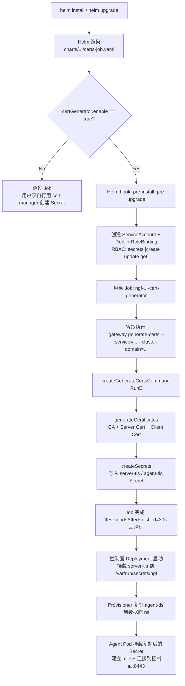
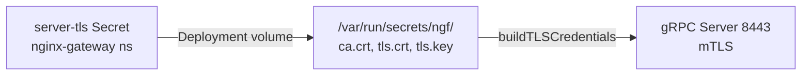
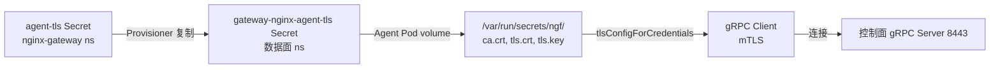
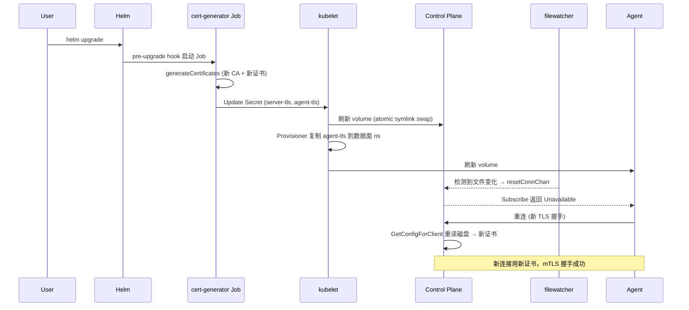
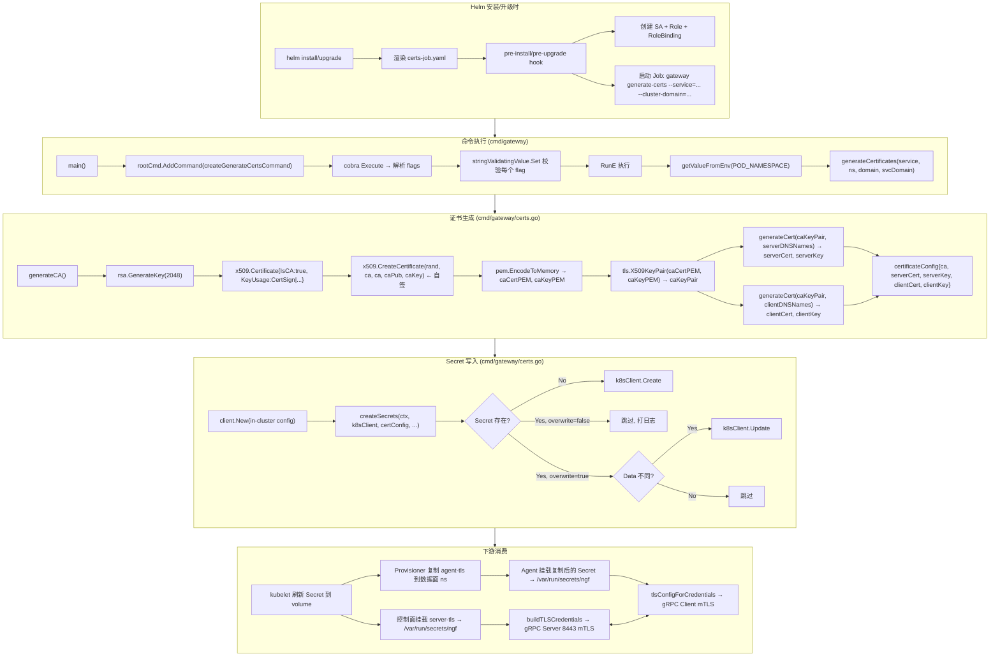

---
tags:
  - tls
  - security
  - nginx-gateway-fabric
  - helm
  - cert-generator
  - cobra
  - kubernetes
  - obsidian
  - source-analysis
aliases:
  - generate-certs 命令分析
  - cert-generator 工作原理
  - NGF 证书生成命令
created: 2026-07-06
updated: 2026-07-06
source-project: nginx-gateway-fabric@v2.6.5
related-docs:
  - "[[tls-analysis-obsidian]]"
  - "[[ngf-control-plane-architecture-obsidian]]"
  - "[[ngf-agent-grpc-auth-analysis]]"
---

# `createGenerateCertsCommand` 命令工作原理深度分析

> [!abstract] 核心结论
> **`createGenerateCertsCommand` 是 NGINX Gateway Fabric (NGF) 控制面 ↔ 数据面 Agent mTLS 通道的"密钥工厂"入口**。它是一个 Cobra 子命令（`gateway generate-certs`），在 Helm `pre-install`/`pre-upgrade` hook 中以 Job 形式运行，通过 Go 标准库 `crypto/x509` 自签一个 RSA 2048 CA，再用同一 CA 签发**服务器证书**（SAN = 控制面 Service DNS）和**客户端证书**（SAN = `*.cluster.local` 通配），最终写入两个 `kubernetes.io/tls` Secret（`server-tls` + `agent-tls`）。两个 Secret 共享同一份 `ca.crt`——这是 mTLS 对称性的支点。整个命令的设计哲学是：**零外部依赖、开箱即用、SAN 精确匹配、支持证书轮换**。

相关文档：[[tls-analysis-obsidian]]（三个 TLS 域全景）、[[ngf-control-plane-architecture-obsidian]]、[[ngf-agent-grpc-auth-analysis]]

---

## 1. 命令的定位与触发链路

`createGenerateCertsCommand` 不是控制面运行时常驻命令，而是一个**一次性引导命令**，仅在 Helm 安装/升级时被 Job 调用。理解它的位置需要先看它在整个 TLS 体系中的坐标。

### 1.1 在三大 TLS 域中的位置

依据 [[tls-analysis-obsidian]] 的分析，NGF 有三个独立的 TLS 域：

| 域 | 握手角色 | 密钥来源 | 本命令是否参与 |
|----|---------|---------|--------------|
| ① 控制面 ↔ Agent | mTLS（双向） | **cert-generator 自签 CA** | ✅ **本命令就是该域的密钥工厂** |
| ② 前端 TLS 终止 | 单向 | 用户 Secret（`tls.certificateRefs`） | ❌ |
| ③ 后端 TLS 验证 | 单向 | BackendTLSPolicy CA | ❌ |

> [!important] 命令的边界
> 本命令**只服务于域①**。域②的证书由用户提供，域③的 CA 由用户在 BackendTLSPolicy 中指定。这种隔离是安全工程的基本原则——一个域的密钥泄露不应影响其他域。

### 1.2 完整触发链路



---

## 2. 命令注册：Cobra 子命令装配

### 2.1 main.go 中的注册

**文件**：`cmd/gateway/main.go:20-34`

```go
func main() {
    rootCmd := createRootCommand()
    rootCmd.AddCommand(
        createControllerCommand(),      // 主控制器（常驻）
        createGenerateCertsCommand(),  // ← 本命令
        createInitializeCommand(),     // 数据面 init 容器用
        createSleepCommand(),          // preStop hook 用
        createEndpointPickerCommand(), // AI 推理扩展
    )
    if err := rootCmd.Execute(); err != nil {
        _, _ = fmt.Fprintln(os.Stderr, err)
        os.Exit(1)
    }
}
```

> [!note] 单一二进制多命令模式
> NGF 把控制面、cert-generator、init、sleep、endpoint-picker 都编译进**同一个 `gateway` 二进制**，通过 Cobra 子命令区分行为。这样做的优势：①只需维护一个 Docker 镜像；②所有子命令共享版本号和构建参数；③减少镜像拉取次数。cert-generator Job 用的镜像与控制面 Deployment 完全相同（`certs-job.yaml:142` 引用 `nginxGateway.image.repository`）。

### 2.2 命令定义骨架

**文件**：`cmd/gateway/commands.go:719-832`

```go
func createGenerateCertsCommand() *cobra.Command {
    // ① flag 名定义
    const (
        serverTLSSecretFlag = "server-tls-secret"
        agentTLSSecretFlag  = "agent-tls-secret"
        serviceFlag         = "service"
        clusterDomainFlag   = "cluster-domain"
        overwriteFlag       = "overwrite"
        serverTLSDomainFlag = "server-tls-domain"
    )

    // ② flag 值容器（带校验器）
    var (
        serverTLSSecretName = stringValidatingValue{
            validator: validateResourceName,
            value:     serverTLSSecret,  // 默认 "server-tls"
        }
        agentTLSSecretName = stringValidatingValue{
            validator: validateResourceName,
            value:     agentTLSSecret,   // 默认 "agent-tls"
        }
        serviceName = stringValidatingValue{
            validator: validateResourceName,
            // 无默认值——必须由 Helm 通过 --service 传入
        }
        clusterDomain = stringValidatingValue{
            validator: validateQualifiedName,
            value:     defaultDomain,     // "cluster.local"
        }
        serverTLSDomain = stringValidatingValue{
            validator: validateResourceName,
            value:     "svc",
        }
        overwrite bool
    )

    // ③ Cobra Command 主体
    cmd := &cobra.Command{
        Use:   "generate-certs",
        Short: "Generate self-signed certificates for securing control plane to data plane communication",
        RunE: func(cmd *cobra.Command, _ []string) error {
            // ... 见下文 §3
        },
    }

    // ④ flag 绑定
    cmd.Flags().Var(&serverTLSSecretName, serverTLSSecretFlag, `...`)
    cmd.Flags().Var(&agentTLSSecretName, agentTLSSecretFlag, `...`)
    cmd.Flags().Var(&serviceName, serviceFlag, `...`)
    cmd.Flags().Var(&clusterDomain, clusterDomainFlag, `...`)
    cmd.Flags().Var(&serverTLSDomain, serverTLSDomainFlag, `...`)
    cmd.Flags().BoolVar(&overwrite, overwriteFlag, false, "Overwrite existing certificates.")

    return cmd
}
```

> [!tip] 设计亮点：默认值与包级常量
> `serverTLSSecret` 和 `agentTLSSecret` 是包级常量（`commands.go:39-40`），作为 flag 默认值。这样即使用户不传 flag，也能用默认名 `server-tls`/`agent-tls`。控制面 Deployment 的 `--agent-tls-secret=agent-tls` 参数（见 §7.2）也引用同一常量，保证双向命名一致。

---

## 3. RunE：命令执行主流程

**文件**：`cmd/gateway/commands.go:757-786`

```go
RunE: func(cmd *cobra.Command, _ []string) error {
    // ① 从环境变量获取 namespace（Job 所在 ns = 控制面 ns）
    namespace, err := getValueFromEnv("POD_NAMESPACE")
    if err != nil {
        return fmt.Errorf("POD_NAMESPACE must be specified in the ENV")
    }

    // ② 生成 CA + 服务器证书 + 客户端证书（见 §4）
    certConfig, err := generateCertificates(
        serviceName.value, namespace, clusterDomain.value, serverTLSDomain.value,
    )
    if err != nil {
        return fmt.Errorf("error generating certificates: %w", err)
    }

    // ③ 创建 Kubernetes 客户端（用 in-cluster config）
    k8sClient, err := client.New(k8sConfig.GetConfigOrDie(), client.Options{})
    if err != nil {
        return fmt.Errorf("error creating k8s client: %w", err)
    }

    // ④ 写入两个 Secret（见 §6）
    if err := createSecrets(
        cmd.Context(), k8sClient, certConfig,
        serverTLSSecretName.value, agentTLSSecretName.value,
        namespace, overwrite,
    ); err != nil {
        return fmt.Errorf("error creating secrets: %w", err)
    }

    return nil
},
```

### 3.1 步骤①：`getValueFromEnv("POD_NAMESPACE")`

**文件**：`cmd/gateway/commands.go:1074-1081`

```go
func getValueFromEnv(key string) (string, error) {
    val := os.Getenv(key)
    if val == "" {
        return "", fmt.Errorf("environment variable %s not set", key)
    }
    return val, nil
}
```

这是一个极简的环境变量读取器。`POD_NAMESPACE` 由 Kubernetes downward API 注入：

**Helm chart 中的注入**（`certs-job.yaml:137-141`）：

```yaml
env:
- name: POD_NAMESPACE
  valueFrom:
    fieldRef:
      fieldPath: metadata.namespace
```

> [!note] 为什么用环境变量而非 flag？
> Namespace 是运行时上下文（取决于 Job 被调度到哪个 ns），而非配置参数。Helm 模板渲染时 `Release.Namespace` 是已知的，但用 downward API 让 Pod 自己发现 ns 更健壮——即使 Helm 渲染与实际调度 ns 不一致也能工作。同一个 `getValueFromEnv` 也被 `createInitializeCommand` 和 `createGatewayPodConfig` 复用。

### 3.2 步骤③：`k8sConfig.GetConfigOrDie()`

`k8sConfig` 是包级变量，通过 controller-runtime 的 `ctrl.GetConfigOrDie()` 初始化。在 Job 容器内，它读取 `ServiceAccount` 自动挂载的 token 和 CA，生成 in-cluster config。Job 的 RBAC 见 §5。

---

## 4. `generateCertificates`：密码学核心

**文件**：`cmd/gateway/certs.go:48-76`

### 4.1 整体结构

```go
// generateCertificates creates a CA, server, and client certificates and keys.
func generateCertificates(service, namespace, clientDNSDomain, serverTLSDomain string) (*certificateConfig, error) {
    caCertPEM, caKeyPEM, err := generateCA()                    // ① 自签 CA
    if err != nil { return nil, fmt.Errorf("error generating CA: %w", err) }

    caKeyPair, err := tls.X509KeyPair(caCertPEM, caKeyPEM)      // ② 把 CA 证书+私钥装成 tls.Certificate
    if err != nil { return nil, err }

    serverCert, serverKey, err := generateCert(                 // ③ 用 CA 签发服务器证书
        caKeyPair,
        serverDNSNames(service, namespace, serverTLSDomain),    //    SAN: <service>.<ns>.<domain>
    )
    if err != nil { return nil, fmt.Errorf("error generating server cert: %w", err) }

    clientCert, clientKey, err := generateCert(                 // ④ 用同一 CA 签发客户端证书
        caKeyPair,
        clientDNSNames(clientDNSDomain),                        //    SAN: *.<clientDNSDomain>
    )
    if err != nil { return nil, fmt.Errorf("error generating client cert: %w", err) }

    return &certificateConfig{
        caCertificate:     caCertPEM,
        serverCertificate: serverCert,
        serverKey:         serverKey,
        clientCertificate: clientCert,
        clientKey:         clientKey,
    }, nil
}
```

### 4.2 返回类型 `certificateConfig`

**文件**：`cmd/gateway/certs.go:39-45`

```go
type certificateConfig struct {
    caCertificate     []byte   // CA 证书 PEM
    serverCertificate []byte   // 服务器证书 PEM
    serverKey         []byte   // 服务器私钥 PEM
    clientCertificate []byte   // 客户端证书 PEM
    clientKey         []byte   // 客户端私钥 PEM
}
```

> [!important] CA 私钥的去向
> 注意：`certificateConfig` **不保存 CA 私钥**（`caKeyPEM`）。CA 私钥只存在于 `generateCertificates` 函数栈帧中，函数返回后即被 GC。这是安全设计——即使 Job 容器被攻破，也无法从内存中恢复 CA 私钥来签发新证书。CA 私钥的唯一"载体"是 Job 运行期间的进程内存。

### 4.3 ① `generateCA`：自签 CA

**文件**：`cmd/gateway/certs.go:78-110`

```go
func generateCA() ([]byte, []byte, error) {
    caKey, err := rsa.GenerateKey(rand.Reader, 2048)            // RSA 2048 私钥
    if err != nil { return nil, nil, err }

    ca := &x509.Certificate{
        Subject:               subject,                          // O=F5, OU=NGINX, CN=nginx-gateway, C=US, L=SEA
        NotBefore:             time.Now(),
        NotAfter:              time.Now().Add(expiry),           // 3 年（365*3*24h）
        SubjectKeyId:          subjectKeyID(caKey.N),            // 见 §4.6
        KeyUsage:              x509.KeyUsageCertSign |           // ← 关键：允许签发证书
                              x509.KeyUsageDigitalSignature |
                              x509.KeyUsageKeyEncipherment,
        IsCA:                  true,                             // ← 标记为 CA
        BasicConstraintsValid: true,                             // ← CA 约束生效
    }

    // 自签：签发者 = 被签发者 = ca，私钥 = caKey
    caCertBytes, err := x509.CreateCertificate(rand.Reader, ca, ca, &caKey.PublicKey, caKey)
    if err != nil { return nil, nil, err }

    caCertPEM := pem.EncodeToMemory(&pem.Block{Type: "CERTIFICATE", Bytes: caCertBytes})
    caKeyPEM := pem.EncodeToMemory(&pem.Block{Type: "RSA PRIVATE KEY", Bytes: x509.MarshalPKCS1PrivateKey(caKey)})

    return caCertPEM, caKeyPEM, nil
}
```

**Subject 常量**（`certs.go:31-37`）：

```go
var subject = pkix.Name{
    CommonName:         "nginx-gateway",
    Country:            []string{"US"},
    Locality:           []string{"SEA"},
    Organization:       []string{"F5"},
    OrganizationalUnit: []string{"NGINX"},
}
```

> [!example] kind 环境实证（CA 证书）
> ```bash
> $ kubectl get secret -n nginx-gateway server-tls -o jsonpath='{.data.ca\.crt}' | base64 -d | openssl x509 -text -noout
>     Subject: C=US, L=SEA, O=F5, OU=NGINX, CN=nginx-gateway
>     Not Before: Jun 24 02:39:54 2026 GMT
>     Not After : Jun 23 02:39:54 2029 GMT
>     X509v3 Key Usage: critical
>         Digital Signature, Key Encipherment, Certificate Sign
>     X509v3 Basic Constraints: critical
>         CA:TRUE
> ```
> 完全匹配源码：`IsCA: true` → `CA:TRUE`；`KeyUsage` 三项一致；有效期 3 年。

#### 4.3.1 KeyUsage 设计

| KeyUsage | 含义 | 为什么 CA 需要 |
|----------|------|---------------|
| `KeyUsageCertSign` | 签发证书 | CA 的核心职能——签发服务器/客户端证书 |
| `KeyUsageDigitalSignature` | 数字签名 | 签名 CRL、OCSP 响应 |
| `KeyUsageKeyEncipherment` | 密钥加密 | 历史兼容（RSA key exchange 时代用，TLS 1.3 已废弃但保留无害） |

### 4.4 ③/④ `generateCert`：签发叶子证书

**文件**：`cmd/gateway/certs.go:112-148`

```go
func generateCert(caKeyPair tls.Certificate, dnsNames []string) ([]byte, []byte, error) {
    key, err := rsa.GenerateKey(rand.Reader, 2048)              // 叶子证书自己的私钥

    cert := &x509.Certificate{
        Subject:      subject,                                   // 与 CA 同 Subject
        NotBefore:    time.Now(),
        NotAfter:     time.Now().Add(expiry),                    // 3 年
        SubjectKeyId: subjectKeyID(key.N),
        KeyUsage:     x509.KeyUsageDigitalSignature | x509.KeyUsageKeyEncipherment,
        DNSNames:     dnsNames,                                  // ← SAN，由调用方决定
    }

    caCert, err := x509.ParseCertificate(caKeyPair.Certificate[0])   // 解析 CA 证书

    // 用 CA 私钥签发叶子证书
    // 参数：(rand, 模板, 父证书, 叶子公钥, 父私钥)
    certBytes, err := x509.CreateCertificate(rand.Reader, cert, caCert, &key.PublicKey, caKeyPair.PrivateKey)

    certPEM := pem.EncodeToMemory(&pem.Block{Type: "CERTIFICATE", Bytes: certBytes})
    keyPEM := pem.EncodeToMemory(&pem.Block{Type: "RSA PRIVATE KEY", Bytes: x509.MarshalPKCS1PrivateKey(key)})

    return certPEM, keyPEM, nil
}
```

> [!note] 叶子证书的 KeyUsage 不含 `KeyUsageCertSign`
> 服务器/客户端证书不能签发其他证书——这是 PKI 的基本约束。`generateCert` 的 `KeyUsage` 只有 `DigitalSignature | KeyEncipherment`，没有 `CertSign`。如果叶子证书能签发，攻击者拿到一张叶子证书就能签发任意中间证书，破坏信任链。

### 4.5 SAN 设计：`serverDNSNames` 与 `clientDNSNames`

**文件**：`cmd/gateway/certs.go:157-167`

```go
func serverDNSNames(service, namespace, serverTLSDomain string) []string {
    return []string{
        fmt.Sprintf("%s.%s.%s", service, namespace, serverTLSDomain),
    }
}

func clientDNSNames(dnsDomain string) []string {
    return []string{
        fmt.Sprintf("*.%s", dnsDomain),
    }
}
```

#### 4.5.1 服务器 SAN 的精妙

服务器 SAN = `<service>.<namespace>.<serverTLSDomain>`，在 kind 环境中：

| 参数 | 值 | 来源 |
|------|----|----|
| `service` | `ngf-nginx-gateway-fabric` | Helm `--service={{ include "nginx-gateway.fullname" . }}` |
| `namespace` | `nginx-gateway` | `POD_NAMESPACE` 环境变量 |
| `serverTLSDomain` | `svc` | Helm `--server-tls-domain={{ .Values.serverTLSDomain }}` |

合成 SAN = `ngf-nginx-gateway-fabric.nginx-gateway.svc`

这是控制面 Service 的集群内 DNS 名。Agent 连这个名，Go 的 `tls.Config.ServerName` 用它做主机名校验。

> [!example] kind 环境实证（服务器证书 SAN）
> ```bash
> $ kubectl get secret -n nginx-gateway server-tls -o jsonpath='{.data.tls\.crt}' | base64 -d | openssl x509 -text -noout | grep -A1 "Subject Alternative Name"
>     X509v3 Subject Alternative Name: 
>         DNS:ngf-nginx-gateway-fabric.nginx-gateway.svc
> ```
> SAN 与 Agent 配置 `nginx-agent.conf` 的 `server.host: ngf-nginx-gateway-fabric.nginx-gateway.svc` **完全一致** → TLS 主机名校验通过。

#### 4.5.2 客户端 SAN 的通配设计

客户端 SAN = `*.<clientDNSDomain>`，默认 = `*.cluster.local`。

**为什么用通配？** Agent Pod 名是动态的（如 `gateway-nginx-7d8f9c6b4a-x2k4m`），无法预先写入证书。

**为什么这安全？** 因为 Go 的 `tls.Config` 在**服务器端验证客户端证书时默认不校验客户端主机名**——只校验 CA 签名链。控制面 `grpc.go:184` 的 `ClientAuth: RequireAndVerifyClientCert` + `ClientCAs: certPool` 只检查"这张客户端证书是否由我信任的 CA 签发"，不检查"客户端主机名是否匹配 SAN"。所以通配 SAN 只是为了满足 x509 证书必须有 SAN 的要求，实际不参与校验。

> [!example] kind 环境实证（客户端证书 SAN）
> ```bash
> $ kubectl get secret -n nginx-gateway agent-tls -o jsonpath='{.data.tls\.crt}' | base64 -d | openssl x509 -text -noout | grep -A1 "Subject Alternative Name"
>     X509v3 Subject Alternative Name: 
>         DNS:*.cluster.local
> ```

#### 4.5.3 SAN 设计的对照表

| 维度 | 服务器证书 | 客户端证书 |
|------|-----------|-----------|
| SAN 值 | `ngf-nginx-gateway-fabric.nginx-gateway.svc`（精确） | `*.cluster.local`（通配） |
| 被谁校验 | Agent 端 `tls.Config.ServerName` | 控制面端（不校验主机名，只校验 CA 签名） |
| 主机名校验 | ✅ 必须匹配 | ❌ 不校验 |
| 签发 CA | cert-generator 自签 CA | 同一 CA |

### 4.6 `subjectKeyID`：用 SHA1 哈希模数

**文件**：`cmd/gateway/certs.go:151-155`

```go
// subjectKeyID generates the SubjectKeyID using the modulus of the private key.
func subjectKeyID(n *big.Int) []byte {
    h := sha1.New() //nolint:gosec // using sha1 in this case is fine
    h.Write(n.Bytes())
    return h.Sum(nil)
}
```

> [!note] 为什么用 SHA1 但安全？
> `//nolint:gosec` 注释说明：这里用 SHA1 不是为了密码学安全，而是为了生成一个**唯一标识符**（SubjectKeyID）。RFC 5280 §4.2.1.2 规定 SubjectKeyID 通常是公钥的哈希，用于证书链构建时的快速匹配。SHA1 碰撞在此场景不构成威胁——攻击者即使伪造相同 SubjectKeyID 也无法伪造 CA 签名。

### 4.7 `expiry` 常量

**文件**：`cmd/gateway/certs.go:27-29`

```go
const (
    expiry        = 365 * 3 * 24 * time.Hour // 3 years
    defaultDomain = "cluster.local"
)
```

> [!warning] 3 年有效期的运维含义
> 证书 3 年过期。如果用户**不执行 `helm upgrade`**，3 年后证书会过期，mTLS 握手失败，控制面 ↔ Agent 通道断裂。`pre-upgrade` hook 是轮换的唯一触发点——用户必须有计划地 `helm upgrade`。文档应在升级指南中强调这一点。

---

## 5. `createSecrets`：Secret 写入逻辑

**文件**：`cmd/gateway/certs.go:169-232`

### 5.1 Secret 结构

```go
serverSecret := corev1.Secret{
    ObjectMeta: metav1.ObjectMeta{
        Name:      serverSecretName,    // "server-tls"
        Namespace: namespace,           // "nginx-gateway"
    },
    Type: corev1.SecretTypeTLS,         // kubernetes.io/tls
    Data: map[string][]byte{
        secrets.CAKey:      certConfig.caCertificate,      // "ca.crt"
        secrets.TLSCertKey: certConfig.serverCertificate,  // "tls.crt"
        secrets.TLSKeyKey:  certConfig.serverKey,          // "tls.key"
    },
}

clientSecret := corev1.Secret{
    ObjectMeta: metav1.ObjectMeta{
        Name:      clientSecretName,    // "agent-tls"
        Namespace: namespace,
    },
    Type: corev1.SecretTypeTLS,
    Data: map[string][]byte{
        secrets.CAKey:      certConfig.caCertificate,      // 同一 CA
        secrets.TLSCertKey: certConfig.clientCertificate,  // 客户端证书
        secrets.TLSKeyKey:  certConfig.clientKey,          // 客户端私钥
    },
}
```

> [!important] 两个 Secret 的 `ca.crt` 是同一份字节
> `serverSecret.Data[CAKey]` 和 `clientSecret.Data[CAKey]` 都指向 `certConfig.caCertificate`——同一个 byte slice。这是 mTLS 对称性的支点：
> - 控制面用 `server-tls` 的 `ca.crt` 作为 `ClientCAs` 池验证 Agent 证书
> - Agent 用 `agent-tls` 的 `ca.crt` 作为 `RootCAs` 池验证控制面证书
> - 双方信任同一 CA → 握手成功

**Secret key 常量**（`internal/controller/state/graph/shared/secrets/secrets.go:33-50`）：

```go
const (
    CAKey      = "ca.crt"
    TLSCertKey = corev1.TLSCertKey     // "tls.crt"
    TLSKeyKey  = corev1.TLSPrivateKeyKey // "tls.key"
)
```

### 5.2 创建/更新逻辑

```go
for _, secret := range []corev1.Secret{serverSecret, clientSecret} {
    key := client.ObjectKeyFromObject(&secret)
    currentSecret := &corev1.Secret{}

    if err := k8sClient.Get(ctx, key, currentSecret); err != nil {
        if apierrors.IsNotFound(err) {
            // 不存在 → Create
            if err := k8sClient.Create(ctx, &secret); err != nil {
                return fmt.Errorf("error creating secret %v: %w", key, err)
            }
        } else {
            return fmt.Errorf("error getting secret %v: %w", key, err)
        }
    } else {
        // 已存在
        if !overwrite {
            // overwrite=false → 跳过，只打日志
            logger.Info("Skipping updating Secret. Must be updated manually or by another source.", "name", key)
            continue
        }
        // overwrite=true 且 data 不同 → Update
        if !reflect.DeepEqual(secret.Data, currentSecret.Data) {
            if err := k8sClient.Update(ctx, &secret); err != nil {
                return fmt.Errorf("error updating secret %v: %w", key, err)
            }
        }
    }
}
```

### 5.3 `overwrite` 标志的三种场景

| 场景 | `overwrite` | 行为 | 用例 |
|------|------------|------|------|
| 全新安装 | false（默认） | Secret 不存在 → Create | `helm install` |
| 升级且未传 `--overwrite` | false | Secret 已存在 → 跳过，保留旧证书 | 用户想手动管理证书轮换 |
| 升级且传 `--overwrite` | true | Secret 已存在 → Update（仅当 data 变化） | `helm upgrade` 自动轮换证书 |

> [!tip] `reflect.DeepEqual` 的优化
> 只有 `secret.Data` 与 `currentSecret.Data` **不同**才 Update。这避免了无意义的 API 调用——如果 cert-generator 生成的证书与现有完全一致（理论上不可能，因为 RSA 密钥每次随机生成，但代码层面仍是正确防御），就不会触发 Update，也就不会触发控制面 filewatcher 的重载逻辑。

---

## 6. Flag 校验机制：`stringValidatingValue`

### 6.1 类型定义

**文件**：`cmd/gateway/validating_types.go:13-32`

```go
// stringValidatingValue is a string flag value with custom validation logic.
// it implements the pflag.Value interface.
type stringValidatingValue struct {
    validator func(v string) error
    value     string
}

func (v *stringValidatingValue) String() string { return v.value }

func (v *stringValidatingValue) Set(param string) error {
    if err := v.validator(param); err != nil {
        return err
    }
    v.value = param
    return nil
}

func (v *stringValidatingValue) Type() string { return "string" }
```

实现了 `pflag.Value` 接口，因此可以传给 `cmd.Flags().Var()`。`Set` 在解析 flag 时被调用，先校验再赋值——**校验失败则 flag 不会被设置，命令直接报错退出**。

### 6.2 校验器

**文件**：`cmd/gateway/validation.go:43-95`

```go
func validateResourceName(value string) error {
    if len(value) == 0 { return errors.New("must be set") }
    messages := validation.IsDNS1123Subdomain(value)   // Kubernetes 资源名校验
    if len(messages) > 0 {
        return fmt.Errorf("invalid format: %s", strings.Join(messages, "; "))
    }
    return nil
}

func validateQualifiedName(name string) error {
    if len(name) == 0 { return errors.New("must be set") }
    messages := validation.IsQualifiedName(name)
    if len(messages) > 0 { return fmt.Errorf("invalid format: %s", strings.Join(messages, "; ")) }
    return nil
}
```

### 6.3 各 flag 的校验器映射

| Flag | 校验器 | 默认值 | 含义 |
|------|--------|--------|------|
| `--server-tls-secret` | `validateResourceName` | `server-tls` | 必须是合法 K8s 资源名（DNS1123 子域） |
| `--agent-tls-secret` | `validateResourceName` | `agent-tls` | 同上 |
| `--service` | `validateResourceName` | 无（必填） | 控制面 Service 名 |
| `--cluster-domain` | `validateQualifiedName` | `cluster.local` | 集群域名 |
| `--server-tls-domain` | `validateResourceName` | `svc` | 服务器证书 SAN 后缀 |
| `--overwrite` | —（bool） | `false` | 是否覆盖已存在 Secret |

> [!note] `--service` 无默认值的设计
> `serviceName` 是 `stringValidatingValue` 但没设 `value`，意味着默认为空字符串。如果用户不传 `--service`，`Set` 不会被调用，`value` 保持空，后续 `generateCertificates` 用空 `service` 拼出的 SAN 会是 `.<namespace>.svc`——非法。但 Helm chart 总是传 `--service={{ include "nginx-gateway.fullname" . }}`，所以实际不会触发。如果想更健壮，应加 `cmd.MarkFlagRequired("service")`，但当前实现依赖 Helm 模板保证。

---

## 7. Helm Chart 装配

### 7.1 Job 模板全貌

**文件**：`charts/nginx-gateway-fabric/templates/certs-job.yaml`（185 行）

整个文件被 `{{- if .Values.certGenerator.enable }}` 包裹。如果用户设 `certGenerator.enable: false`，整个 Job 及其 RBAC 都不会创建——此时用户必须用 cert-manager 自行管理 `server-tls`/`agent-tls` Secret。

#### 7.1.1 资源清单

Job 模板渲染出**最多 5 个**资源（OpenShift 环境多一个 SCC）：

| 资源 | Helm hook | 用途 |
|------|----------|------|
| ServiceAccount | `pre-install` | Job 运行身份 |
| Role | `pre-install` | 授权 `secrets [create update get]` |
| RoleBinding | `pre-install` | 绑定 SA 和 Role |
| SecurityContextConstraints（仅 OpenShift） | `pre-install` (hook-weight=-1) | OpenShift 安全约束 |
| **Job** | `pre-install, pre-upgrade` | 执行 `generate-certs` 命令 |

> [!important] Hook 的差异
> - SA/Role/RoleBinding 只在 `pre-install`——首次安装时创建，后续升级保留
> - Job 在 `pre-install, pre-upgrade`——每次安装和升级都运行，实现证书轮换

#### 7.1.2 Job 的关键参数

```yaml
spec:
  template:
    spec:
      automountServiceAccountToken: {{ .Values.certGenerator.automountServiceAccountToken }}
      containers:
      - args:
        - generate-certs
        - --service={{ include "nginx-gateway.fullname" . }}
        - --cluster-domain={{ .Values.clusterDomain }}
        - --server-tls-domain={{ .Values.serverTLSDomain }}
        - --server-tls-secret={{ .Values.certGenerator.serverTLSSecretName }}
        - --agent-tls-secret={{ .Values.certGenerator.agentTLSSecretName }}
        {{- if .Values.certGenerator.overwrite }}
        - --overwrite
        {{- end }}
        env:
        - name: POD_NAMESPACE
          valueFrom:
            fieldRef:
              fieldPath: metadata.namespace
        image: {{ .Values.nginxGateway.image.repository }}:{{ default .Chart.AppVersion .Values.nginxGateway.image.tag }}
        imagePullPolicy: {{ .Values.nginxGateway.image.pullPolicy }}
        name: cert-generator
        securityContext:
          seccompProfile: { type: RuntimeDefault }
          capabilities: { drop: [ALL] }
          allowPrivilegeEscalation: false
          readOnlyRootFilesystem: true
          runAsUser: 101
          runAsGroup: 1001
      restartPolicy: Never
      serviceAccountName: {{ include "nginx-gateway.fullname" . }}-cert-generator
      securityContext:
        fsGroup: 1001
        runAsNonRoot: true
      ttlSecondsAfterFinished: {{ .Values.certGenerator.ttlSecondsAfterFinished }}
```

#### 7.1.3 参数到源码的映射

| Helm 参数 | 命令 flag | 源码接收方 | 默认值（values.yaml） |
|-----------|----------|-----------|---------------------|
| `.Values.clusterDomain` | `--cluster-domain` | `clusterDomain.value` | `cluster.local` |
| `.Values.serverTLSDomain` | `--server-tls-domain` | `serverTLSDomain.value` | `svc` |
| `.Values.certGenerator.serverTLSSecretName` | `--server-tls-secret` | `serverTLSSecretName.value` | `server-tls` |
| `.Values.certGenerator.agentTLSSecretName` | `--agent-tls-secret` | `agentTLSSecretName.value` | `agent-tls` |
| `.Values.certGenerator.overwrite` | `--overwrite`（条件） | `overwrite` | `false` |
| `include "nginx-gateway.fullname" .` | `--service` | `serviceName.value` | 释放名前缀 |
| downward API `metadata.namespace` → `POD_NAMESPACE` env | env | `getValueFromEnv("POD_NAMESPACE")` | Job 所在 ns |

#### 7.1.4 安全上下文

```yaml
securityContext:
  readOnlyRootFilesystem: true      # 只读根文件系统
  runAsUser: 101                    # 非 root
  runAsGroup: 1001
  allowPrivilegeEscalation: false
  capabilities:
    drop: [ALL]                     # 丢弃所有 Linux capabilities
  seccompProfile:
    type: RuntimeDefault            # 默认 seccomp 配置
```

> [!tip] 为什么 `readOnlyRootFilesystem: true` 对 cert-generator 重要？
> cert-generator 不需要写本地文件——所有输出都通过 Kubernetes API 写入 Secret。只读根文件系统限制了即使容器被攻破，攻击者也无法在容器内持久化恶意代码。

### 7.2 RBAC 权限

```yaml
rules:
- apiGroups: [""]
  resources: [secrets]
  verbs: [create, update, get]
```

Job 只需要在自己 namespace 内对 `secrets` 做 `create`/`update`/`get`。最小权限原则——不给 `list`/`watch`/`delete`，更不给跨 ns 权限。

### 7.3 Values.yaml 的 certGenerator 配置

**文件**：`charts/nginx-gateway-fabric/values.yaml:878-923`

```yaml
certGenerator:
  enable: true                          # 总开关
  annotations: {}                       # Job 注解
  serverTLSSecretName: server-tls       # 服务器 Secret 名
  agentTLSSecretName: agent-tls         # 客户端 Secret 名
  overwrite: false                      # 默认不覆盖
  ttlSecondsAfterFinished: 30           # Job 完成后 30 秒清理
  tolerations: []
  nodeSelector: {}
  affinity: {}
  topologySpreadConstraints: []
  automountServiceAccountToken: true
  extraVolumes: []
  extraVolumeMounts: []
```

### 7.4 禁用 cert-generator 的替代方案

设 `certGenerator.enable: false` 后，用户须自行创建 `server-tls` 和 `agent-tls` Secret。推荐用 cert-manager：

```yaml
# 示例：用 cert-manager Issuer 签发
apiVersion: cert-manager.io/v1
kind: Certificate
metadata:
  name: ngf-server-tls
  namespace: nginx-gateway
spec:
  secretName: server-tls       # 必须匹配 nginxGateway 配置
  duration: 2160h              # 90 天
  renewBefore: 360h
  issuerRef:
    name: selfsigned-issuer
    kind: ClusterIssuer
  dnsNames:
  - ngf-nginx-gateway-fabric.nginx-gateway.svc  # 必须匹配 Service DNS
```

> [!warning] cert-manager 替代时的 SAN 一致性
> 无论用什么方式生成证书，**服务器证书的 SAN 必须包含控制面 Service 的集群内 DNS 名**（`<release>-nginx-gateway-fabric.<ns>.svc`）。否则 Agent 连接时 `tls.Config.ServerName` 主机名校验失败，mTLS 握手在 `CertificateVerify` 阶段中断。

---

## 8. 产出 Secret 的下游消费链

`createGenerateCertsCommand` 产出的两个 Secret 不会孤立存在——它们被控制面、Provisioner、Agent 协同消费。完整链路见 [[tls-analysis-obsidian]] §3，这里聚焦与本命令的直接衔接。

### 8.1 `server-tls` → 控制面 gRPC 服务器



**控制面 Deployment 挂载**（kind 实证）：

```yaml
# kubectl get deploy -n nginx-gateway ngf-nginx-gateway-fabric -o yaml
spec:
  containers:
  - name: nginx-gateway
    args:
    - --agent-tls-secret=agent-tls    # 告诉 Provisioner 哪个是要复制的 Secret
    ports:
    - containerPort: 8443             # gRPC mTLS 端口
      name: agent-grpc
    volumeMounts:
    - mountPath: /var/run/secrets/ngf
      name: nginx-agent-tls
    env:
    - name: POD_NAMESPACE
      valueFrom: { fieldRef: { fieldPath: metadata.namespace } }
  volumes:
  - name: nginx-agent-tls
    secret:
      secretName: server-tls          # ← 本命令产出
```

控制面 gRPC 服务器读取这三个文件（`internal/controller/nginx/agent/grpc/grpc.go:30-32`）：

```go
const (
    caCertPath  = "/var/run/secrets/ngf/" + secrets.CAKey      // ca.crt
    tlsCertPath = "/var/run/secrets/ngf/" + secrets.TLSCertKey // tls.crt
    tlsKeyPath  = "/var/run/secrets/ngf/" + secrets.TLSKeyKey  // tls.key
)
```

`buildTLSCredentials` 用 `ca.crt` 作 `ClientCAs` 池验证 Agent 证书，用 `tls.crt`/`tls.key` 作服务器证书。详见 [[tls-analysis-obsidian]] §3.2。

### 8.2 `agent-tls` → Provisioner 复制 → Agent



Provisioner（`internal/controller/provisioner/objects.go:458`）把 `nginx-gateway/agent-tls` 复制为 `default/gateway-nginx-agent-tls`，ownerReference 指向 Gateway 资源。复制后的 Secret 的 `ca.crt` 与 `server-tls` 的 `ca.crt` **字节一致**——这是 mTLS 握手成功的必要条件。

> [!example] kind 环境实证：CA 一致性
> ```bash
> $ diff <(kubectl get secret -n nginx-gateway server-tls -o jsonpath='{.data.ca\.crt}' | base64 -d) \
>        <(kubectl get secret -n default gateway-nginx-agent-tls -o jsonpath='{.data.ca\.crt}' | base64 -d) \
>   && echo "CA_IDENTICAL"
> CA_IDENTICAL
> ```
> 三个 Secret（`server-tls`、`agent-tls`、`gateway-nginx-agent-tls`）的 `ca.crt` 完全相同，证明它们同源——都来自本命令的 `generateCA()`。

### 8.3 Agent 端的配置

Agent 的 `nginx-agent.conf`（由 Provisioner 渲染）指向复制后的 Secret：

```yaml
command:
  server:
    host: ngf-nginx-gateway-fabric.nginx-gateway.svc   # ← 与服务器证书 SAN 一致
    port: 443
  tls:
    cert: /var/run/secrets/ngf/tls.crt                 # 客户端证书
    key:  /var/run/secrets/ngf/tls.key                 # 客户端私钥
    ca:   /var/run/secrets/ngf/ca.crt                  # 验证服务器用的 CA
    server_name: ngf-nginx-gateway-fabric.nginx-gateway.svc  # SNI / 主机名校验
```

---

## 9. 证书热重载与本命令的协作

本命令在 `pre-upgrade` hook 重新签发证书后，控制面和 Agent 都能**不重启**地应用新证书。这是一个精妙的双向闭环：

### 9.1 控制面侧：filewatcher + GetConfigForClient

**文件**：`internal/controller/nginx/agent/grpc/grpc.go:96-102, 150-189`

```go
// 启动时校验文件可解析（fail-fast）
func buildTLSCredentials(caPath, certPath, keyPath string) (credentials.TransportCredentials, error) {
    if _, err := loadCACertPool(caPath); err != nil { return nil, err }
    if _, err := tls.LoadX509KeyPair(certPath, keyPath); err != nil { return nil, err }
    tlsConfig := &tls.Config{
        GetConfigForClient: buildConfigForClient(caPath, certPath, keyPath),  // 每次握手重读
        MinVersion:         tls.VersionTLS13,
    }
    return credentials.NewTLS(tlsConfig), nil
}

// filewatcher 监控文件变化
tlsFiles := []string{caCertPath, tlsCertPath, tlsKeyPath}
fileWatcher, err := filewatcher.NewFileWatcher(g.logger.WithName("fileWatcher"), tlsFiles, g.resetConnChan)
go fileWatcher.Watch(ctx)
```

**机制**：
1. kubelet 检测到 Secret 变化，把新内容刷到 volume（原子写入，通过 symlink 切换）
2. `filewatcher` 监控到文件变化，通过 `resetConnChan` 通知 `commandService.Subscribe` 返回 `codes.Unavailable`
3. Agent 收到 `Unavailable` 后重连
4. 重连时 `GetConfigForClient` 回调被触发，**从磁盘重读** CA 和服务器证书
5. 新连接使用新证书，旧连接已被主动断开

### 9.2 Agent 侧：credentials watcher

Agent 有独立的 `internal/watcher/credentials/credential_watcher_service.go`，用 fsnotify 监控同样的三个文件，变化时重建 `GrpcConnection`。

### 9.3 本命令在热重载中的角色



> [!tip] 本命令与 `--overwrite` 的配合
> 默认 `overwrite: false` 时，`pre-upgrade` hook 运行但 `createSecrets` 发现 Secret 已存在就跳过——**证书不轮换**。要实现自动轮换，必须在 values.yaml 设 `certGenerator.overwrite: true` 或在 `helm upgrade` 时传 `--set certGenerator.overwrite=true`。这是运维中容易踩的坑。

---

## 10. kind 环境完整实证汇总

基于当前 kind 集群（nginx-gateway-fabric@v2.6.5）的运行时证据：

### 10.1 产出的 Secret

```
NAMESPACE       SECRET                      TYPE                DATA  AGE
nginx-gateway   server-tls                  kubernetes.io/tls   3     12d   ← 本命令产出
nginx-gateway   agent-tls                   kubernetes.io/tls   3     12d   ← 本命令产出
default         gateway-nginx-agent-tls     kubernetes.io/tls   3     12d   ← Provisioner 复制
```

### 10.2 Secret 内容验证

| Secret | key | 内容验证 |
|--------|-----|---------|
| `server-tls` | `ca.crt` | CA 证书，Subject: `C=US, L=SEA, O=F5, OU=NGINX, CN=nginx-gateway`，`CA:TRUE` |
| `server-tls` | `tls.crt` | 服务器证书，SAN: `DNS:ngf-nginx-gateway-fabric.nginx-gateway.svc`，Issuer = CA |
| `server-tls` | `tls.key` | 服务器私钥（RSA 2048） |
| `agent-tls` | `ca.crt` | 与 `server-tls.ca.crt` **字节一致**（`diff` 验证 `CA_IDENTICAL`） |
| `agent-tls` | `tls.crt` | 客户端证书，SAN: `DNS:*.cluster.local`，Issuer = 同一 CA |
| `agent-tls` | `tls.key` | 客户端私钥（RSA 2048） |

### 10.3 证书属性对照源码

| 属性 | 源码常量 | kind 实证 | 匹配 |
|------|---------|-----------|------|
| 算法 | `rsa.GenerateKey(rand.Reader, 2048)` | `Public-Key: (2048 bit)` | ✅ |
| 签名算法 | （由 `x509.CreateCertificate` 自动选择） | `sha256WithRSAEncryption` | ✅ |
| Subject | `pkix.Name{CN:"nginx-gateway", O:"F5", OU:"NGINX", C:"US", L:"SEA"}` | `C=US, L=SEA, O=F5, OU=NGINX, CN=nginx-gateway` | ✅ |
| 有效期 | `expiry = 365*3*24h` (3 年) | `Not Before: Jun 24 2026` → `Not After: Jun 23 2029` | ✅ |
| CA:TRUE | `IsCA: true, BasicConstraintsValid: true` | `CA:TRUE (critical)` | ✅ |
| CA KeyUsage | `CertSign \| DigitalSignature \| KeyEncipherment` | `Digital Signature, Key Encipherment, Certificate Sign` | ✅ |
| 服务器 SAN | `serverDNSNames("ngf-...-fabric", "nginx-gateway", "svc")` | `DNS:ngf-nginx-gateway-fabric.nginx-gateway.svc` | ✅ |
| 客户端 SAN | `clientDNSNames("cluster.local")` | `DNS:*.cluster.local` | ✅ |

### 10.4 下游 Deployment 引用

```yaml
# kubectl get deploy -n nginx-gateway ngf-nginx-gateway-fabric -o yaml
spec:
  containers:
  - name: nginx-gateway
    args:
    - --agent-tls-secret=agent-tls          # 告诉 Provisioner 复制 agent-tls
    ports:
    - containerPort: 8443                   # gRPC mTLS 端口
    volumeMounts:
    - mountPath: /var/run/secrets/ngf       # server-tls 挂载点
      name: nginx-agent-tls
    env:
    - name: POD_NAMESPACE                   # 与 Job 同一注入方式
      valueFrom: { fieldRef: { fieldPath: metadata.namespace } }
  volumes:
  - name: nginx-agent-tls
    secret: { secretName: server-tls }      # ← 本命令产出
```

---

## 11. 设计原因分析

### 11.1 为什么用 Cobra 子命令而非独立二进制？

**约束**：cert-generator 需要与控制面共享版本号、镜像、依赖。

**选择**：单一 `gateway` 二进制 + Cobra 子命令。

**原因**：
- ✅ 一个镜像覆盖所有角色（控制面、Job、init、sleep），减少镜像维护成本
- ✅ 版本号一致（`Chart.AppVersion` 同时用于控制面和 Job 的 image tag）
- ✅ 共享 `cmd/gateway/` 包内的工具函数（`getValueFromEnv`、`validateResourceName`）
- ⚠️ 镜像体积稍大（包含控制面不需要的 Job 代码），但 Go 静态编译差异可忽略

### 11.2 为什么用自签 CA 而非 cert-manager？

**约束**：NGF 必须在**没有 cert-manager 的集群**开箱即用；这条通道是内部通道，不面向公网，无需公网信任的 CA。

**选择**：Helm pre-install Job 用 Go 标准库 `crypto/x509` 自签 CA。

**优缺点**：
- ✅ 零外部依赖——只需 Go 标准库 `crypto/x509`、`crypto/rsa`、`crypto/tls`
- ✅ CA 私钥只存在于 Job 内存中，Job 结束即销毁（`certificateConfig` 不保存 `caKeyPEM`）
- ✅ SAN 精确匹配 Service DNS，无通配证书风险
- ✅ 支持通过 `certGenerator.enable: false` 切换到 cert-manager
- ⚠️ 轮换依赖 `pre-upgrade` hook + `--overwrite`，用户必须 `helm upgrade`
- ⚠️ CA 信任根不自动分发到集群外（但本通道纯集群内，无需）

### 11.3 为什么用 RSA 2048 而非 ECDSA？

**约束**：兼容性优先；NGF 不控制 Agent 端的 TLS 实现。

**选择**：RSA 2048。

**对比**：
| 维度 | RSA 2048 | ECDSA P-256 |
|------|----------|-------------|
| 密钥大小 | 2048 bit | 256 bit |
| 签名速度 | 慢（签名 ~1ms） | 快（签名 ~0.1ms） |
| 验证速度 | 快 | 慢 |
| 兼容性 | 极广（所有 TLS 实现） | 广（TLS 1.3 必须支持） |
| 前向安全 | 由 ECDHE 保证（与密钥类型无关） | 同左 |

**原因**：RSA 2048 是最保守的选择，兼容性最广。NGF 强制 TLS 1.3（`MinVersion: tls.VersionTLS13`），前向安全由 ECDHE 保证，与证书密钥类型无关。签名性能差异在 mTLS 低频握手场景可忽略。

### 11.4 为什么服务器 SAN 用精确 Service DNS 而非通配？

**约束**：Agent 必须能通过 `tls.Config.ServerName` 主机名校验。

**选择**：精确 SAN = `<service>.<namespace>.<domain>`。

**对比**：
- 精确 SAN：只信任这一个 DNS 名，即使 DNS 劫持到其他 IP，主机名校验仍基于 SNI
- 通配 SAN（如 `*.nginx-gateway.svc`）：任何该域下的名都能通过，扩大攻击面

**原因**：控制面 Service 名在 Helm 安装时确定，无需通配。精确 SAN 遵循**最小权限原则**——证书只为其声明的身份背书。

### 11.5 为什么客户端 SAN 用通配 `*.cluster.local`？

**约束**：Agent Pod 名是动态的（`gateway-nginx-<rand>-<rand>`），无法预先写入证书。

**选择**：通配 SAN `*.<clientDNSDomain>`。

**安全性论证**：
1. Go 的 `tls.Config` 在服务器端验证客户端证书时**默认不校验客户端主机名**——只校验 CA 签名链
2. 控制面 `ClientAuth: RequireAndVerifyClientCert` + `ClientCAs: certPool` 只检查"是否由信任的 CA 签发"
3. 因此通配 SAN 实际上**不参与校验**，只是为了满足 x509 证书格式要求（必须有 SAN）
4. 真正的身份验证由 CA 签名链保证——只有持有本 CA 签发的客户端证书的 Pod 才能完成握手

### 11.6 为什么 CA 和叶子证书用同一 Subject？

**约束**：无特殊约束，但需要可追溯。

**选择**：`subject` 包级变量同时用于 CA 和叶子证书。

**原因**：
- 简化代码——一个 `subject` 常量覆盖所有证书
- Subject 不参与 TLS 校验（SAN 才是校验依据），所以相同 Subject 无安全影响
- 便于运维通过 `openssl x509 -text` 快速识别"这些证书都来自 NGF cert-generator"

### 11.7 为什么 `overwrite` 默认 false？

**约束**：避免意外覆盖用户手动管理的证书。

**选择**：默认 `false`，需显式 `--overwrite` 或 `certGenerator.overwrite: true` 才覆盖。

**场景**：
- 用户用 cert-manager 管理证书，误开 cert-generator → 不会覆盖 cert-manager 的产出
- 用户想自动轮换 → 必须显式设 `overwrite: true`，明确意图

### 11.8 为什么有效期 3 年？

**约束**：平衡安全性与运维负担。

**选择**：`expiry = 365 * 3 * 24 * time.Hour`（3 年）。

**对比**：
- 1 年：更安全（泄露窗口短），但运维负担重（必须每年升级）
- 3 年：适中——给用户充足时间规划升级，同时不至于太长
- 10 年：太长，不符合安全最佳实践

**协同**：3 年有效期 + `pre-upgrade` hook 自动轮换 = 用户只需在 3 年内至少 `helm upgrade` 一次即可。配合 `filewatcher` 热重载，轮换无需重启。

---

## 12. 关键代码位置速查表

| 阶段 | 文件 | 行号 | 说明 |
|------|------|------|------|
| 命令注册 | `cmd/gateway/main.go` | 23-29 | `rootCmd.AddCommand(createGenerateCertsCommand())` |
| 命令定义 | `cmd/gateway/commands.go` | 719-832 | `createGenerateCertsCommand` |
| RunE 主流程 | `cmd/gateway/commands.go` | 757-786 | 读取 env → 生成证书 → 写入 Secret |
| `getValueFromEnv` | `cmd/gateway/commands.go` | 1074-1081 | 从 `POD_NAMESPACE` 读 ns |
| `stringValidatingValue` | `cmd/gateway/validating_types.go` | 13-32 | 带校验的 flag 值类型 |
| `validateResourceName` | `cmd/gateway/validation.go` | 43-56 | K8s 资源名校验 |
| `validateQualifiedName` | `cmd/gateway/validation.go` | 83-95 | K8s 限定名校验 |
| 包级常量 | `cmd/gateway/commands.go` | 39-40 | `serverTLSSecret`、`agentTLSSecret` |
| **证书生成核心** | | | |
| `generateCertificates` | `cmd/gateway/certs.go` | 48-76 | CA + 服务器 + 客户端 |
| `generateCA` | `cmd/gateway/certs.go` | 78-110 | RSA 2048 自签 CA |
| `generateCert` | `cmd/gateway/certs.go` | 112-148 | 用 CA 签发叶子证书 |
| `serverDNSNames` | `cmd/gateway/certs.go` | 157-161 | 服务器 SAN：`<svc>.<ns>.<domain>` |
| `clientDNSNames` | `cmd/gateway/certs.go` | 163-167 | 客户端 SAN：`*.<domain>` |
| `subjectKeyID` | `cmd/gateway/certs.go` | 151-155 | SHA1 哈希模数 |
| `subject` 常量 | `cmd/gateway/certs.go` | 31-37 | `pkix.Name` |
| `expiry` 常量 | `cmd/gateway/certs.go` | 27 | 3 年 |
| `certificateConfig` | `cmd/gateway/certs.go` | 39-45 | 返回类型 |
| **Secret 写入** | | | |
| `createSecrets` | `cmd/gateway/certs.go` | 169-232 | Create/Update 两个 Secret |
| Secret key 常量 | `internal/controller/state/graph/shared/secrets/secrets.go` | 37-50 | `CAKey`、`TLSCertKey`、`TLSKeyKey` |
| **Helm Chart** | | | |
| Job 模板 | `charts/nginx-gateway-fabric/templates/certs-job.yaml` | 1-185 | pre-install, pre-upgrade hook |
| Values | `charts/nginx-gateway-fabric/values.yaml` | 878-923 | `certGenerator` 配置块 |
| `clusterDomain` 默认值 | `charts/nginx-gateway-fabric/values.yaml` | 4 | `cluster.local` |
| `serverTLSDomain` 默认值 | `charts/nginx-gateway-fabric/values.yaml` | 7 | `svc` |
| **下游消费** | | | |
| 控制面挂载 server-tls | `internal/controller/nginx/agent/grpc/grpc.go` | 30-32 | 路径常量 |
| 控制面 mTLS 配置 | `internal/controller/nginx/agent/grpc/grpc.go` | 150-189 | `buildTLSCredentials` |
| Provisioner 复制 agent-tls | `internal/controller/provisioner/objects.go` | 458 | `addSecret(agentTLS)` |
| 数据面 volume 挂载 | `internal/controller/provisioner/objects.go` | 1187, 1235-1238 | mountPath + secretName |

---

## 13. 完整调用链（端到端）



---

## 14. 总结

### 14.1 角色职责矩阵

| 角色 | 职责 |
|------|------|
| **Helm** | 渲染 Job 模板，触发 pre-install/pre-upgrade hook，注入参数 |
| **Cobra (main.go)** | 注册 `generate-certs` 子命令，解析 flags |
| **stringValidatingValue** | flag 值容器，Set 时校验 |
| **getValueFromEnv** | 从 `POD_NAMESPACE` 读 namespace |
| **generateCA** | RSA 2048 自签 CA，3 年有效 |
| **generateCert** | 用 CA 签发服务器/客户端证书，SAN 由调用方决定 |
| **serverDNSNames / clientDNSNames** | 生成精确/通配 SAN |
| **createSecrets** | Create 或 Update 两个 `kubernetes.io/tls` Secret |
| **kubelet** | 把 Secret 刷到 volume |
| **Provisioner** | 复制 `agent-tls` 到数据面 ns |
| **控制面 gRPC Server** | 挂载 `server-tls`，做 mTLS 服务器 |
| **Agent gRPC Client** | 挂载复制后的 `agent-tls`，做 mTLS 客户端 |
| **filewatcher（控制面）** | 监控 TLS 文件变化，触发连接重置 |
| **credentials watcher（Agent）** | 监控 TLS 文件变化，重建连接 |

### 14.2 一句话总结

> [!quote]
> `createGenerateCertsCommand` 是 NGF 控制面 ↔ Agent mTLS 通道的密钥工厂：它在 Helm hook 中以 Cobra 子命令形式运行，用 Go 标准库自签一个 RSA 2048 CA，再用同一 CA 签发服务器证书（精确 Service DNS SAN）和客户端证书（通配 cluster.local SAN），写入两个共享 `ca.crt` 的 `kubernetes.io/tls` Secret。这两个 Secret 一个被控制面挂载做 mTLS 服务器，一个被 Provisioner 复制到数据面 ns 给 Agent 做 mTLS 客户端——同一 CA 作为对称性支点，让双向握手成功。整个设计零外部依赖、开箱即用、支持热重载轮换，是 NGF 安全底座的基石。

---

## 附录 A：术语表

| 术语 | 含义 |
|------|------|
| Cobra | Go 的 CLI 框架，支持子命令 |
| pflag | POSIX 风格的 flag 库，Cobra 底层使用 |
| `stringValidatingValue` | NGF 自定义的 pflag.Value 实现，带校验器 |
| cert-generator | Helm Job，运行 `gateway generate-certs` |
| `certificateConfig` | `generateCertificates` 的返回类型，含 CA + 服务器 + 客户端证书 |
| SAN | Subject Alternative Name，证书主题备用名 |
| `kubernetes.io/tls` | K8s Secret 类型，标准格式含 `tls.crt` + `tls.key` |
| downward API | K8s 把 Pod 元信息注入为环境变量的机制 |
| `pre-install` / `pre-upgrade` | Helm hook，在安装/升级前运行 |
| filewatcher | 控制面监控 TLS 文件变化的组件 |
| Provisioner | NGF 控制面组件，为每个 Gateway 创建数据面 Deployment 及相关 Secret |

## 附录 B：调试与验证命令

```bash
# 查看 cert-generator Job 历史（已完成，30s 后清理）
kubectl get jobs -n nginx-gateway

# 查看 Job 日志（如果还在 ttl 期内）
kubectl logs -n nginx-gateway job/$(kubectl get jobs -n nginx-gateway -o name | head -1)

# 查看产出的 Secret
kubectl get secret -n nginx-gateway server-tls agent-tls -o yaml

# 解码服务器证书并查看 SAN
kubectl get secret -n nginx-gateway server-tls -o jsonpath='{.data.tls\.crt}' | base64 -d | openssl x509 -text -noout | grep -A1 "Subject Alternative Name"

# 解码 CA 证书并验证 IsCA
kubectl get secret -n nginx-gateway server-tls -o jsonpath='{.data.ca\.crt}' | base64 -d | openssl x509 -text -noout | grep -A1 "CA:TRUE\|Key Usage"

# 验证 server-tls 和 gateway-nginx-agent-tls 的 CA 一致性
diff <(kubectl get secret -n nginx-gateway server-tls -o jsonpath='{.data.ca\.crt}' | base64 -d) \
     <(kubectl get secret -n default gateway-nginx-agent-tls -o jsonpath='{.data.ca\.crt}' | base64 -d) \
  && echo "CA_IDENTICAL"

# 验证客户端证书 SAN（应为 *.cluster.local）
kubectl get secret -n nginx-gateway agent-tls -o jsonpath='{.data.tls\.crt}' | base64 -d | openssl x509 -text -noout | grep -A1 "Subject Alternative Name"

# 查看控制面 Deployment 如何引用 Secret
kubectl get deploy -n nginx-gateway ngf-nginx-gateway-fabric -o yaml | grep -A3 "secretName\|mountPath.*ngf\|agent-tls\|server-tls"

# 手动触发证书轮换（覆盖现有证书）
helm upgrade ngf oci://ghcr.io/nginx/charts/nginx-gateway-fabric -n nginx-gateway --set certGenerator.overwrite=true

# 查看证书有效期
kubectl get secret -n nginx-gateway server-tls -o jsonpath='{.data.tls\.crt}' | base64 -d | openssl x509 -text -noout | grep -A2 "Validity"
```

## 附录 C：本地手动测试

```bash
# 在本地构建 gateway 二进制
make build

# 手动运行 generate-certs（需要 kubeconfig 指向 kind 集群）
./build/out/gateway generate-certs \
  --service=ngf-nginx-gateway-fabric \
  --cluster-domain=cluster.local \
  --server-tls-domain=svc \
  --server-tls-secret=server-tls \
  --agent-tls-secret=agent-tls \
  --overwrite

# 前提：POD_NAMESPACE 环境变量必须设置
export POD_NAMESPACE=nginx-gateway
./build/out/gateway generate-certs --service=ngf-nginx-gateway-fabric --overwrite
```

---

*本文档基于 nginx-gateway-fabric@v2.6.5 源码分析，结合 kind 部署环境实证（2026-07-06 采集）。所有代码引用均来自当前仓库，可按 文件:行号 定位。与 [[tls-analysis-obsidian]] 互补——后者覆盖三个 TLS 域全景，本文聚焦密钥工厂本身的内部机制。*
