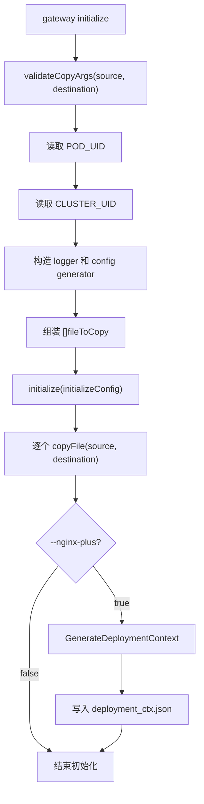

# createInitializeCommand 工作原理分析

> [!info] 事实来源
> 本文结合两类事实：NGF 源码中的 `createInitializeCommand`、`initialize`、provisioner 对象生成逻辑；以及当前 Kubernetes context `kind-ngf-demo` 中实际运行的 `gateway-nginx` 数据面 Deployment。当前环境没有 `kind` CLI，但 `kubectl config current-context` 返回 `kind-ngf-demo`，节点名为 `ngf-demo-control-plane`，因此运行时观测来自该 kind 集群。

## 结论

`createInitializeCommand` 创建的是 `/usr/bin/gateway initialize` 子命令，主要服务于数据面 Pod 的 init container。它不是控制面启动命令，而是在 NGINX 主容器启动前完成一次性初始化：

- 将只读 ConfigMap 中的 bootstrap 文件复制到 NGINX 主容器可写的 `emptyDir` 目录。
- 初始化 NGINX Agent 配置目录，使主容器可以通过 Agent 连接控制面。
- 在 NGINX Plus 模式下额外生成 `/etc/nginx/main-includes/deployment_ctx.json`，用于 Plus licensing 的 `mgmt` 上下文。
- 初始化失败会阻止 Pod 进入主容器阶段，因为它运行在 Kubernetes init container 中。

## 源码入口

`createInitializeCommand` 位于 `cmd/gateway/commands.go`，注册了 `initialize` 子命令：

- `Use: "initialize"`
- `Short: "Write initial configuration files"`
- flags:
  - `--source`: 待复制源文件列表。
  - `--destination`: 与 `--source` 按索引对应的目标目录列表。
  - `--nginx-plus`: 是否按 NGINX Plus 模式初始化。

运行时流程如下：



## 参数校验

`validateCopyArgs` 位于 `cmd/gateway/validation.go`，规则很直接：

- `source` 和 `destination` 数量必须相同。
- `source` 不能为空。
- `destination` 不能为空。

这说明 `initialize` 的拷贝模型是“按索引配对”，不是把多个源文件复制到同一个目标目录。当前 kind 中实际命令重复使用了多组 `--source`/`--destination`，Cobra 的 `StringSliceVar` 会把它们解析成两个 slice。

## 文件复制行为

真正的复制函数是 `cmd/gateway/initialize.go` 中的 `copyFile`：

1. 打开源文件。
2. 在目标目录下创建同名文件：`filepath.Join(dest, filepath.Base(src))`。
3. 复制内容。
4. 将目标文件权限设置为 `file.RegularFileModeInt`。

因此 `--source /includes/main.conf --destination /etc/nginx/main-includes` 的最终结果是：

```text
/etc/nginx/main-includes/main.conf
```

它不会保留源路径中的父目录，只保留 `filepath.Base(src)`。

## Provisioner 如何使用它

数据面 Deployment 不是 Helm chart 中直接写死的 NGINX Pod，而是控制面 provisioner 根据 Gateway 构造的 Kubernetes 对象。关键路径如下：

- `StartManager` 创建并注册 `NginxProvisioner`。
- `buildNginxResourceObjects` 为 Gateway 生成 Secret、ConfigMap、ServiceAccount、Service、Deployment 等对象。
- `buildBaseVolumes` 创建两类关键卷：
  - ConfigMap 卷：`nginx-agent-config`、`nginx-includes-bootstrap`。
  - `emptyDir` 卷：`nginx-agent`、`nginx-main-includes`、`nginx-events-includes` 等。
- `buildInitContainers` 创建名为 `init` 的 init container，命令为 `/usr/bin/gateway initialize ...`。
- NGINX 主容器挂载同一批 `emptyDir` 目标目录，从而读取 init container 复制出的文件。

> [!note] 为什么需要复制
> ConfigMap 卷天然是由 Kubernetes 管理的只读投影，不适合作为 NGINX Agent 后续运行时写入目录。init container 把 bootstrap 文件复制到 `emptyDir` 后，主容器获得的是可写目录，同时还能保留 ConfigMap 提供的初始内容。

## kind 环境验证

当前 kind 集群中，NGF 控制面 Deployment 是：

```text
namespace: nginx-gateway
deployment: ngf-nginx-gateway-fabric
image: ghcr.io/nginx/nginx-gateway-fabric:2.6.5
```

控制面 Deployment 本身没有 init container；它运行 `controller` 子命令，并由 provisioner 创建默认命名空间中的数据面：

```text
namespace: default
deployment: gateway-nginx
owner: Gateway/default/gateway
nginx image: ghcr.io/nginx/nginx-gateway-fabric/nginx:2.6.5
init image: ghcr.io/nginx/nginx-gateway-fabric:2.6.5
```

`gateway-nginx` 的 init container 命令与源码生成逻辑一致：

```text
/usr/bin/gateway initialize
  --source /agent/nginx-agent.conf
  --destination /etc/nginx-agent
  --source /includes/main.conf
  --destination /etc/nginx/main-includes
  --source /includes/events.conf
  --destination /etc/nginx/events-includes
```

对应环境变量：

```text
POD_UID: fieldRef metadata.uid
CLUSTER_UID: 55d0f802-6c05-4c70-887a-775ccaf119f5
```

对应卷关系：

| 来源 | 类型 | init 挂载点 | 目标 |
| --- | --- | --- | --- |
| `gateway-nginx-agent-config` | ConfigMap | `/agent` | `/etc/nginx-agent` |
| `gateway-nginx-includes-bootstrap` | ConfigMap | `/includes` | `/etc/nginx/main-includes` |
| `gateway-nginx-includes-bootstrap` | ConfigMap | `/includes` | `/etc/nginx/events-includes` |
| `nginx-agent` | `emptyDir` | `/etc/nginx-agent` | NGINX 主容器同路径读取 |
| `nginx-main-includes` | `emptyDir` | `/etc/nginx/main-includes` | NGINX 主容器同路径读取 |
| `nginx-events-includes` | `emptyDir` | `/etc/nginx/events-includes` | NGINX 主容器同路径读取 |

init container 日志显示：

```json
{"msg":"Starting init container","source filenames to copy":["/agent/nginx-agent.conf","/includes/main.conf","/includes/events.conf"],"destination directories":["/etc/nginx-agent","/etc/nginx/main-includes","/etc/nginx/events-includes"],"nginx-plus":false}
{"msg":"Finished initializing configuration"}
```

主容器中观测到的初始化结果：

```text
/etc/nginx-agent/nginx-agent.conf
/etc/nginx/main-includes/main.conf
/etc/nginx/events-includes/events.conf
```

其中 `main.conf` 内容为：

```nginx
error_log stderr info;
```

`events.conf` 内容为：

```nginx
worker_connections 1024;
```

NGINX 主配置 `/etc/nginx/nginx.conf` 会显式 include 这些目录：

```nginx
include /etc/nginx/main-includes/*.conf;

events {
  include /etc/nginx/events-includes/*.conf;
}
```

这验证了 init container 复制出的文件会参与主容器 NGINX 启动配置。

## NGINX Plus 分支

源码中 `initialize` 的普通 OSS 分支只复制文件并退出。只有 `--nginx-plus=true` 时才会继续生成 deployment context：

```text
InstallationID = POD_UID
ClusterID      = CLUSTER_UID
Integration    = "ngf"
```

`GenerateDeploymentContext` 会把该结构 JSON 序列化成：

```text
/etc/nginx/main-includes/deployment_ctx.json
```

同时 provisioner 的 `configureNginxPlus` 会扩展 init command：

```text
--source /includes/mgmt.conf
--destination /etc/nginx/main-includes
--nginx-plus
```

因此 Plus 模式下 `/etc/nginx/main-includes` 至少会包含：

- `main.conf`
- `mgmt.conf`
- `deployment_ctx.json`

这些文件共同服务于 NGINX Plus 的 management/licensing 初始化。

## 与 NGINX Agent 的关系

`/etc/nginx-agent/nginx-agent.conf` 是 init container 从 ConfigMap 复制出的关键文件。当前 kind 中它包含：

- control plane 地址：`ngf-nginx-gateway-fabric.nginx-gateway.svc:443`
- Agent token 路径：`/var/run/secrets/ngf/serviceaccount/token`
- TLS 证书路径：`/var/run/secrets/ngf/{tls.crt,tls.key,ca.crt}`
- labels：`cluster-id`、`control-id`、`owner-name`、`product-version` 等
- metrics exporter：`0.0.0.0:9113`

这解释了为什么 init container 只需要做 bootstrap：后续动态 NGINX 配置由 NGINX Agent 连接控制面后持续下发，不依赖 init container 反复执行。

## 失败影响和排障点

> [!warning] init container 失败会阻塞数据面 Pod
> `initialize` 在 init container 中运行，任一源文件打不开、目标文件创建失败、复制失败或权限设置失败，都会导致 init container 失败，主容器不会启动。

常见检查点：

- `kubectl logs deploy/gateway-nginx -c init`
- `kubectl get deploy gateway-nginx -o yaml`
- `kubectl get configmap gateway-nginx-agent-config -o yaml`
- `kubectl get configmap gateway-nginx-includes-bootstrap -o yaml`
- `kubectl exec deploy/gateway-nginx -c nginx -- ls -l /etc/nginx-agent /etc/nginx/main-includes /etc/nginx/events-includes`

如果日志报 `source and destination must have the same number of elements`，说明 provisioner 或用户 patch 后的 init command 中 `--source` 与 `--destination` 数量不匹配。

如果日志报 `could not get pod UID` 或 `could not get cluster UID`，说明 init container 环境变量缺失。源码要求 `POD_UID` 和 `CLUSTER_UID` 都必须存在，即使 OSS 分支最终不会使用它们生成 `deployment_ctx.json`。

## 相关源码

- `cmd/gateway/commands.go`: `createInitializeCommand`
- `cmd/gateway/initialize.go`: `initialize`、`copyFile`
- `cmd/gateway/validation.go`: `validateCopyArgs`
- `internal/controller/provisioner/objects.go`: `buildNginxResourceObjects`、`buildBaseVolumes`、`buildInitContainers`、`configureNginxPlus`
- `internal/controller/nginx/config/generator.go`: `GenerateDeploymentContext`

## 相关概念

- [[NGINX Gateway Fabric]]
- [[Gateway API]]
- [[Kubernetes init container]]
- [[kind]]
- [[NGINX Agent]]
