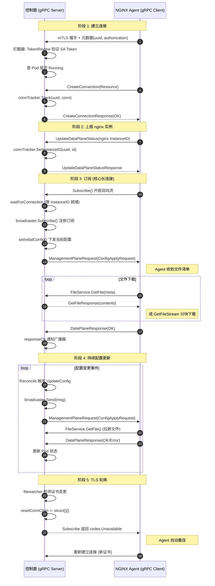

# gRPC 从入门到精通 — 基于 NGINX Gateway Fabric 实战

> [!abstract] 目标
> 读完本文后，你将能够：
> 1. 理解 gRPC 的核心概念（Protocol Buffers、HTTP/2、四种 RPC 类型）
> 2. 独立编写 `.proto` 文件并用 `buf` / `protoc` 生成 Go 代码
> 3. 实现一个完整的 gRPC 服务端与客户端（含 TLS/mTLS、拦截器、流式通信）
> 4. 理清 **NGF 控制面 ↔ NGINX Agent 数据面** 的完整 gRPC 交互细节
> 5. 把这些模式迁移到自己的项目里

> [!info] 项目背景
> **NGINX Gateway Fabric (NGF)** 是一个 Kubernetes Gateway API 控制器，用 NGINX 作为数据面。
> 控制面（NGF Pod）通过 **gRPC** 与数据面（NGINX Agent，每个 nginx Pod 里一个 sidecar）通信，
> 下发 nginx 配置文件、获取应用状态、执行 NGINX Plus API 动作。
> 这套 gRPC 协议叫 **MPI (Management Plane Interface)**，定义在 `github.com/nginx/agent/v3` 模块里。

---

## 目录

- [[#1. gRPC 核心概念（入门）]]
- [[#2. Protocol Buffers 语言指南（proto3）]]
- [[#3. 从 proto 生成 Go 代码]]
- [[#4. gRPC 服务端实现]]
- [[#5. gRPC 客户端实现]]
- [[#6. 流式通信深入解析]]
- [[#7. 进阶主题（拦截器 / 认证 / mTLS / 广播）]]
- [[#8. NGF 控制面 ↔ 数据面 Agent 交互全解]]
- [[#9. 动手实战：从零构建一个 gRPC 服务]]
- [[#附录 A：关键源码位置索引]]
- [[#附录 B：常用 gRPC 状态码速查]]

---

## 1. gRPC 核心概念（入门）

### 1.1 什么是 gRPC

gRPC 是 Google 开源的高性能 RPC 框架，核心三件事：

| 组件 | 作用 | 在 NGF 中的体现 |
|------|------|-----------------|
| **Protocol Buffers** | 接口定义语言 (IDL) + 序列化格式 | `agent/api/grpc/mpi/v1/*.proto` |
| **HTTP/2** | 传输层协议，支持多路复用、流、头部压缩 | gRPC 底层自动使用 |
| **Stub / Client** | 自动生成的强类型客户端代码 | `pb.CommandServiceClient` 等 |

> [!tip] 一句话理解
> gRPC = **用 Protobuf 定义接口** + **用 HTTP/2 传输** + **自动生成多语言 SDK**

### 1.2 为什么用 gRPC 而不是 REST

```
┌──────────────┬──────────────────────────┬──────────────────────────┐
│   特性       │  REST + JSON             │  gRPC + Protobuf         │
├──────────────┼──────────────────────────┼──────────────────────────┤
│ 序列化       │  文本 JSON (~大)         │  二进制 (~小 3-10x)      │
│ 传输         │  HTTP/1.1 (一请求一响应) │  HTTP/2 多路复用         │
│ 接口契约     │  OpenAPI (可选，易漂移)  │  .proto 强制 (编译期检查)│
│ 流式         │  需 WebSocket / SSE       │  原生四种流模式          │
│ 跨语言       │  手写客户端               │  自动生成多语言 Stub     │
│ 浏览器支持   │  ✅ 原生                 │  ❌ 需 gRPC-Web 网关     │
│ 适合场景     │  对外 API、浏览器         │  内部服务间通信 ✅ NGF   │
└──────────────┴──────────────────────────┴──────────────────────────┘
```

> [!note] NGF 为什么选 gRPC
> NGF 控制面和数据面都是内部组件，不需要浏览器直连。配置下发是 **大量文件 + 状态同步 + 双向流**，gRPC 的双向流 + Protobuf 二进制 + 强类型契约完美匹配。

### 1.3 四种 RPC 类型

```
┌─────────────────────┬────────────────────────────────────────┐
│ 类型                │  语法                                  │
├─────────────────────┼────────────────────────────────────────┤
│ Unary (一元)        │  rpc SayHello(Req) returns (Resp)      │
│ Server Streaming    │  rpc GetFileStream(Req) returns        │
│                     │      (stream Chunk)                    │
│ Client Streaming    │  rpc UpdateFileStream(stream Chunk)    │
│                     │      returns (Resp)                    │
│ Bidirectional       │  rpc Subscribe(stream DataPlaneResp)   │
│  Streaming          │      returns (stream MgmtPlaneReq)     │
└─────────────────────┴────────────────────────────────────────┘
```

> [!example] NGF 中的四种类型
> - **Unary**: `CreateConnection`、`UpdateDataPlaneStatus`、`GetFile` —— 请求-响应模式
> - **Server Streaming**: `GetFileStream` —— 控制面向 Agent 分块下发大文件
> - **Client Streaming**: `UpdateFileStream` —— Agent 向控制面上传文件分块
> - **Bidirectional**: `Subscribe` —— 控制面与 Agent 的长连接，双向消息流

### 1.4 gRPC 请求的生命周期

```
客户端                                     服务端
  │                                          │
  │── 1. 建立 HTTP/2 连接 (TLS 握手) ───────→│
  │                                          │
  │── 2. 发送 HEADERS 帧 (路径=/pkg.Svc/Method)│
  │   带元数据 metadata (uuid, authorization)│
  │                                          │
  │── 3. 发送 DATA 帧 (序列化的 protobuf) ──→│
  │                                          │── 4. 拦截器链 (interceptor)
  │                                          │── 5. 调用 handler 方法
  │                                          │── 6. 返回响应
  │←── 7. HEADERS 帧 (trailing: grpc-status)─│
  │←── 8. DATA 帧 (序列化的 protobuf) ───────│
  │                                          │
  │── 9. HTTP/2 流结束 ──────────────────────│
```

> [!important] 关键点
> - gRPC 路径格式：`/{package}.{Service}/{Method}`，例如 `/mpi.v1.CommandService/CreateConnection`
> - 元数据 (metadata) = HTTP/2 头，键全小写
> - `grpc-status` 在 trailing header 里返回，0 = OK

---

## 2. Protocol Buffers 语言指南（proto3）

### 2.1 基本结构

以 NGF 使用的 MPI 协议为例 — `agent/api/grpc/mpi/v1/common.proto`：

```protobuf
syntax = "proto3";           // 必须是第一行非注释
package mpi.v1;              // 包名，防止命名冲突

option go_package = "mpi/v1"; // 生成的 Go 包路径

import "google/protobuf/timestamp.proto";  // 导入标准类型

// 消息定义
message MessageMeta {
    string message_id = 1;      // 字段编号，1-15 占 1 字节
    string correlation_id = 2;   // 16-2047 占 2 字节
    google.protobuf.Timestamp timestamp = 3;  // 导入的类型
}
```

> [!tip] 字段编号规则
> - `1-15`：用 1 字节编码 → **高频字段放这里**
> - `16-2047`：用 2 字节
> - `19000-19999`：保留，不能用
> - **编号一旦发布就不能再改**（兼容性靠编号，不靠名字）

### 2.2 标量类型

| proto 类型 | Go 类型 | 说明 |
|-----------|---------|------|
| `string` | `string` | |
| `int32` / `int64` | `int32` / `int64` | |
| `uint32` / `uint64` | `uint32` / `uint64` | |
| `bool` | `bool` | |
| `bytes` | `[]byte` | 二进制，如文件内容 |
| `float` / `double` | `float32` / `float64` | |

### 2.3 复合类型

#### repeated（列表）

```protobuf
// files.proto
message FileOverview {
    repeated File files = 1;   // → Go: []*File
    ConfigVersion config_version = 2;
}
```

#### enum（枚举）

```protobuf
// command.proto
message InstanceMeta {
    enum InstanceType {
        INSTANCE_TYPE_UNSPECIFIED = 0;  // 第一个必须是 0
        INSTANCE_TYPE_AGENT = 1;
        INSTANCE_TYPE_NGINX = 2;
        INSTANCE_TYPE_NGINX_PLUS = 3;
    }
    InstanceType instance_type = 2;
}
```

> [!warning] proto3 枚举规则
> - **第一个值必须是 0**（作为默认值）
> - 建议用 `NAME_TYPE_VALUE` 前缀避免冲突

#### oneof（联合体 / 只能设置一个字段）

```protobuf
// command.proto - 核心设计：一个请求只携带一种操作
message ManagementPlaneRequest {
    mpi.v1.MessageMeta message_meta = 1;
    oneof request {
        StatusRequest status_request = 2;
        HealthRequest health_request = 3;
        ConfigApplyRequest config_apply_request = 5;
        ConfigUploadRequest config_upload_request = 6;
        APIActionRequest action_request = 7;
        // ...
    }
}
```

> [!important] oneof 是 NGF 协议的灵魂
> `ManagementPlaneRequest` 用 `oneof` 让一个双向流能承载多种操作类型（配置下发、API 动作、状态查询），设置一个会自动清零其他字段。Go 生成代码里会变成接口：
> ```go
> req.Request = &pb.ManagementPlaneRequest_ConfigApplyRequest{...}
> // 或
> req.Request = &pb.ManagementPlaneRequest_ActionRequest{...}
> ```

#### map（字典）

```protobuf
map<string, string> labels = 1;  // → Go: map[string]string
```

#### optional（显式存在性检查）

```protobuf
// files.proto
message File {
    optional ExternalDataSource external_data_source = 3;
}
// Go: *ExternalDataSource (指针，可区分 nil 和零值)
```

### 2.4 嵌套消息

proto3 允许消息嵌套：

```protobuf
// command.proto
message DataPlaneResponse {
    enum RequestType { ... }  // 嵌套枚举
    mpi.v1.MessageMeta message_meta = 1;
    mpi.v1.CommandResponse command_response = 2;
    RequestType request_type = 4;  // 引用嵌套枚举
}
```

### 2.5 service 定义

```protobuf
// command.proto - NGF 控制面实现的 gRPC 服务
service CommandService {
    // Unary: Agent 连接注册
    rpc CreateConnection(CreateConnectionRequest) returns (CreateConnectionResponse) {}

    // Unary: Agent 上报 nginx 实例状态
    rpc UpdateDataPlaneStatus(UpdateDataPlaneStatusRequest) returns (UpdateDataPlaneStatusResponse) {}

    // Unary: Agent 上报健康状态
    rpc UpdateDataPlaneHealth(UpdateDataPlaneHealthRequest) returns (UpdateDataPlaneHealthResponse) {}

    // Bidirectional Stream: 核心长连接
    rpc Subscribe(stream DataPlaneResponse) returns (stream ManagementPlaneRequest) {}
}

// files.proto - 文件传输服务
service FileService {
    rpc GetOverview(GetOverviewRequest) returns (GetOverviewResponse) {}
    rpc UpdateOverview(UpdateOverviewRequest) returns (UpdateOverviewResponse) {}
    rpc GetFile(GetFileRequest) returns (GetFileResponse) {}
    rpc UpdateFile(UpdateFileRequest) returns (UpdateFileResponse) {}
    rpc GetFileStream(GetFileRequest) returns (stream FileDataChunk) {}
    rpc UpdateFileStream(stream FileDataChunk) returns (UpdateFileResponse) {}
}
```

> [!note] 方向定义
> proto 注释里写 "All operations are written from a **client** perspective"。
> 在 NGF 架构里：**Agent 是 gRPC Client**，**NGF 控制面是 gRPC Server**。
> 所以 `CreateConnection` 是 Agent 主动调用控制面的方法。

### 2.6 注释与文档

proto 注释会变成生成代码的 Go 注释：

```protobuf
// The connection request is an initial handshake...
message CreateConnectionRequest {
    // Meta-information associated with a message
    mpi.v1.MessageMeta message_meta = 1;
}
```

### 2.7 buf 验证扩展

NGF 用了 [buf.validate](https://buf.build/bufbuild/validate) 做字段约束：

```protobuf
import "buf/validate/validate.proto";

message Resource {
    string resource_id = 1 [(buf.validate.field).string.uuid = true];  // 必须是 UUID
}

message ServerSettings {
    int32 port = 2 [(buf.validate.field).int32 = {gte: 1, lte: 65535}]; // 端口范围
}

message FileMeta {
    string name = 1 [(buf.validate.field).string.prefix = "/"];  // 必须以 / 开头
    string permissions = 4 [(buf.validate.field).string.pattern = "0[0-7]{3}"]; // 权限格式
}
```

> [!tip] 这是 protobuf 的 **FieldOptions 扩展**
> 生成代码时会带验证逻辑，调用 `Validate()` 即可校验。

### 2.8 兼容性规则

> [!warning] 修改 proto 的安全规则
> ✅ **安全**：
> - 新增字段（用新编号）
> - 新增 enum 值
> - 新增 service / method
> - 把 `string` 字段改为 `repeated string`（不安全，但某些情况下可接受）
>
> ❌ **危险**：
> - 改字段编号
> - 改字段类型
> - 删除字段（应该 `reserved`）
> - 改 `oneof` 里的字段编号

```protobuf
message Foo {
    reserved 3, 4;           // 保留编号
    reserved "old_field";     // 保留名字
}
```

---

## 3. 从 proto 生成 Go 代码

### 3.1 工具链

```
protoc (Protocol Buffers 编译器)
  + protoc-gen-go        (生成 .pb.go: 消息类型)
  + protoc-gen-go-grpc   (生成 _grpc.pb.go: 服务端/客户端 stub)
  + buf (现代替代品，配置化)  ← NGF 用这个
```

### 3.2 buf 配置（NGF 实践）

NGF 的 agent 模块用 `buf` 管理 proto。典型配置：

**`buf.yaml`**（模块定义）:
```yaml
version: v1
breaking:
  use:
    - FILE
lint:
  use:
    - DEFAULT
```

**`buf.gen.yaml`**（生成配置）:
```yaml
version: v1
plugins:
  - plugin: buf.build/community/google-protobuf-go
    out: api/grpc/mpi/v1
    opt: paths=source_relative
  - plugin: buf.build/community/grpc-go
    out: api/grpc/mpi/v1
    opt:
      - paths=source_relative
      - require_unimplemented_servers=false
```

### 3.3 生成命令

```bash
# 用 buf
buf generate

# 或用 protoc（手动）
protoc \
  --go_out=. --go_opt=paths=source_relative \
  --go-grpc_out=. --go-grpc_opt=paths=source_relative \
  api/grpc/mpi/v1/*.proto
```

### 3.4 生成的文件

```
api/grpc/mpi/v1/
├── command.proto
├── command.pb.go           # 消息类型: CreateConnectionRequest, ManagementPlaneRequest...
├── command_grpc.pb.go      # 服务端接口: CommandServiceServer, 客户端: CommandServiceClient
├── files.proto
├── files.pb.go
├── files_grpc.pb.go
├── common.proto
└── common.pb.go
```

### 3.5 生成代码的结构

> [!info] 了解生成代码结构对理解 gRPC 至关重要

**消息类型** (`command.pb.go`):
```go
// 自动生成的消息结构
type CreateConnectionRequest struct {
    MessageMeta *MessageMeta `protobuf:"bytes,1,opt,name=message_meta,json=messageMeta" json:"message_meta,omitempty"`
    Resource    *Resource    `protobuf:"bytes,2,opt,name=resource" json:"resource,omitempty"`
    // ... 自动实现 proto.Message 接口
}

// oneof 生成的接口
type isManagementPlaneRequest_Request interface{ isManagementPlaneRequest_Request() }
type ManagementPlaneRequest_ConfigApplyRequest struct {
    ConfigApplyRequest *ConfigApplyRequest
}
func (*ManagementPlaneRequest_ConfigApplyRequest) isManagementPlaneRequest_Request() {}
```

**服务端接口** (`command_grpc.pb.go`):
```go
// 服务端必须实现这个接口
type CommandServiceServer interface {
    CreateConnection(context.Context, *CreateConnectionRequest) (*CreateConnectionResponse, error)
    UpdateDataPlaneStatus(context.Context, *UpdateDataPlaneStatusRequest) (*UpdateDataPlaneStatusResponse, error)
    UpdateDataPlaneHealth(context.Context, *UpdateDataPlaneHealthRequest) (*UpdateDataPlaneHealthResponse, error)
    Subscribe(CommandService_SubscribeServer) error  // 双向流：参数是 stream 对象
}

// 服务端注册函数
func RegisterCommandServiceServer(s grpc.ServiceRegistrar, srv CommandServiceServer)

// stream 对象接口
type CommandService_SubscribeServer interface {
    Send(*ManagementPlaneRequest) error
    Recv() (*DataPlaneResponse, error)
    grpc.ServerStream
}
```

> [!tip] 流式方法的签名规律
> - **Server stream**: `Method(req *Req, stream XxxServer) error` — 一次接收请求，多次 `stream.Send()`
> - **Client stream**: `Method(stream XxxServer) (*Resp, error)` — 多次 `stream.Recv()`，返回一次
> - **Bidirectional**: `Method(stream XxxServer) error` — 循环 `Recv()` + `Send()`

---

## 4. gRPC 服务端实现

### 4.1 最小服务端

```go
package main

import (
    "log"
    "net"
    "google.golang.org/grpc"
    pb "yourpkg/v1"
)

type greeterServer struct {
    pb.UnimplementedGreeterServer  // 必须嵌入，保证向前兼容
}

func (s *greeterServer) SayHello(ctx context.Context, req *pb.HelloRequest) (*pb.HelloReply, error) {
    return &pb.HelloReply{Message: "Hello " + req.GetName()}, nil
}

func main() {
    lis, _ := net.Listen("tcp", ":50051")
    s := grpc.NewServer()
    pb.RegisterGreeterServer(s, &greeterServer{})
    log.Println("listening on :50051")
    s.Serve(lis)
}
```

### 4.2 NGF 的服务端：完整实战

NGF 的 gRPC Server 在 `internal/controller/nginx/agent/grpc/grpc.go`。我们逐段拆解：

#### 4.2.1 Server 结构体

```go
// 文件: internal/controller/nginx/agent/grpc/grpc.go:44
type Server struct {
    interceptor      Interceptor            // 拦截器
    logger           logr.Logger
    resetConnChan    chan<- struct{}        // TLS 文件变更时重置连接
    registerServices []func(*grpc.Server)   // 服务注册函数列表
    port             int                     // 监听端口
}
```

> [!note] 设计亮点：**服务注册函数列表**
> NGF 把"注册哪些服务"做成 `[]func(*grpc.Server)` 切片，实现了**控制反转**：
> ```go
> // manager.go:327
> registerSvcs := []func(*grpc.Server){
>     nginxUpdater.CommandService.Register,  // 注册 CommandService
>     nginxUpdater.FileService.Register,     // 注册 FileService
> }
> ```
> 每个 service 自己实现 `Register(server *grpc.Server)`，Server 只负责遍历调用。

#### 4.2.2 启动流程

```go
// 文件: internal/controller/nginx/agent/grpc/grpc.go:78
func (g *Server) Start(ctx context.Context) error {
    // 1. 监听 TCP
    var lc net.ListenConfig
    listener, err := lc.Listen(ctx, "tcp", fmt.Sprintf(":%d", g.port))
    if err != nil {
        return err
    }

    // 2. 加载 TLS 凭证 (mTLS)
    tlsCredentials, err := getTLSConfig()
    if err != nil {
        return err
    }

    // 3. 创建 gRPC Server（带各种选项）
    server := g.createServer(tlsCredentials)

    // 4. 注册所有服务
    for _, registerSvc := range g.registerServices {
        registerSvc(server)
    }

    // 5. 启动 TLS 文件监视器（证书轮换）
    fileWatcher, _ := filewatcher.NewFileWatcher(g.logger, tlsFiles, g.resetConnChan)
    go fileWatcher.Watch(ctx)

    // 6. 优雅关闭
    go func() {
        <-ctx.Done()
        server.Stop()  // 用 Stop 不用 GracefulStop（因为有长连接流）
    }()

    // 7. 开始服务
    return server.Serve(listener)
}
```

#### 4.2.3 创建 Server 的选项（重点）

```go
// 文件: internal/controller/nginx/agent/grpc/grpc.go:114
func (g *Server) createServer(tlsCredentials credentials.TransportCredentials) *grpc.Server {
    server := grpc.NewServer(
        // 1. Keepalive 参数：防止空闲连接被防火墙杀掉
        grpc.KeepaliveParams(keepalive.ServerParameters{
            Time:    15 * time.Second,  // 15s 后发 ping
            Timeout: 10 * time.Second,  // 10s 没收到 pong 则断开
        }),
        grpc.KeepaliveEnforcementPolicy(keepalive.EnforcementPolicy{
            MinTime:             15 * time.Second,
            PermitWithoutStream: true,  // 允许无流时也 ping
        }),

        // 2. 拦截器链
        grpc.ChainStreamInterceptor(g.interceptor.Stream(g.logger)),
        grpc.ChainUnaryInterceptor(g.interceptor.Unary(g.logger)),

        // 3. TLS 凭证
        grpc.Creds(tlsCredentials),

        // 4. 消息大小限制 (4MB，和 Agent 端对齐)
        grpc.MaxSendMsgSize(1024*1024*4),
        grpc.MaxRecvMsgSize(1024*1024*4),
    )
    return server
}
```

> [!important] 每个选项的作用
> | 选项 | 为什么需要 |
> |------|-----------|
> | `KeepaliveParams` | NGF 的 `Subscribe` 是**长连接流**，中间可能长时间无数据，防火墙/负载均衡会杀空闲连接。Keepalive ping 保活。 |
> | `ChainStreamInterceptor` | 流式调用的拦截器链，NGF 用来做**认证** |
> | `ChainUnaryInterceptor` | Unary 调用的拦截器链 |
> | `Creds` | mTLS 双向认证 |
> | `MaxSendMsgSize / MaxRecvMsgSize` | 默认 4MB，但 NGF 传输配置文件可能大，显式设 4MB 和 Agent 对齐 |

#### 4.2.4 服务注册模式

每个服务实现自己的 `Register` 方法：

```go
// 文件: internal/controller/nginx/agent/command.go:65
func (cs *commandService) Register(server *grpc.Server) {
    pb.RegisterCommandServiceServer(server, cs)
}

// 文件: internal/controller/nginx/agent/file.go:48
func (fs *fileService) Register(server *grpc.Server) {
    pb.RegisterFileServiceServer(server, fs)
}
```

> [!tip] 这是 Go gRPC 的标准模式
> `pb.RegisterXxxServer(server, impl)` 把实现注册到 gRPC Server。
> `cs` 必须实现 `pb.CommandServiceServer` 接口的所有方法。

#### 4.2.5 嵌入 Unimplemented 实现向前兼容

```go
// 文件: internal/controller/nginx/agent/command.go:36
type commandService struct {
    pb.CommandServiceServer  // 嵌入未实现的方法，保证新加 proto 方法不会编译报错
    // ...
}

// 文件: internal/controller/nginx/agent/file.go:30
type fileService struct {
    pb.FileServiceServer
    // ...
}
```

> [!warning] 为什么必须嵌入 `UnimplementedXxxServer`
> proto 文件新增方法后，生成的接口会多一个方法。如果你没实现，编译会报错。
> 嵌入 `pb.CommandServiceServer`（实际上是 `UnimplementedCommandServiceServer` 的别名），
> 未实现的方法会返回 `Unimplemented` 状态码，而不是编译错误。

### 4.3 实现一个 Unary RPC

以 `CreateConnection` 为例 — Agent 连接时调用：

```go
// 文件: internal/controller/nginx/agent/command.go:72
func (cs *commandService) CreateConnection(
    ctx context.Context,              // gRPC 自动注入的 context
    req *pb.CreateConnectionRequest,  // 请求消息
) (*pb.CreateConnectionResponse, error) {  // 响应 + 错误
    // 1. 参数校验
    if req == nil {
        return nil, errors.New("empty connection request")
    }

    // 2. 从 context 拿 gRPC 身份信息（拦截器注入的）
    grpcInfo, ok := grpcContext.FromContext(ctx)
    if !ok {
        return nil, agentgrpc.ErrStatusInvalidConnection
    }

    // 3. 业务逻辑
    resource := req.GetResource()
    name, depType := getAgentDeploymentNameAndType(resource.GetInstances())
    if name == (types.NamespacedName{}) {
        // 4. 返回业务错误（带 gRPC 状态码）
        return &pb.CreateConnectionResponse{
                Response: &pb.CommandResponse{
                    Status: pb.CommandResponse_COMMAND_STATUS_ERROR,
                    Message: "error getting pod owner",
                },
            },
            grpcStatus.Errorf(codes.InvalidArgument, "error getting pod owner: %s", err.Error())
    }

    // 5. 记录连接
    cs.connTracker.Track(grpcInfo.UUID, conn)

    // 6. 返回成功
    return &pb.CreateConnectionResponse{
        Response: &pb.CommandResponse{
            Status: pb.CommandResponse_COMMAND_STATUS_OK,
        },
    }, nil
}
```

> [!important] gRPC 错误处理规范
> ```go
> // ✅ 正确：用 status.Error 带 gRPC 状态码
> return nil, status.Errorf(codes.InvalidArgument, "invalid: %v", err)
>
> // ❌ 错误：用普通 errors.New，客户端无法区分错误类型
> return nil, errors.New("invalid")
> ```
> 客户端用 `status.Code(err)` 判断：
> ```go
> if st, ok := status.FromErr(err); ok && st.Code() == codes.InvalidArgument { ... }
> ```

### 4.4 实现一个 Server Streaming RPC

以 `GetFileStream` 为例 — 控制面向 Agent 分块发送文件：

```go
// 文件: internal/controller/nginx/agent/file.go:83
func (fs *fileService) GetFileStream(
    req *pb.GetFileRequest,
    server grpc.ServerStreamingServer[pb.FileDataChunk],  // 泛型流对象
) error {
    // 1. 校验 + 拿身份
    grpcInfo, ok := grpcContext.FromContext(server.Context())
    if !ok { return agentgrpc.ErrStatusInvalidConnection }

    // 2. 拿文件内容
    contents, err := fs.getFileContents(req, grpcInfo.UUID)
    if err != nil { return err }

    // 3. 分块发送
    if err := files.SendChunkedFile(
        req.GetMessageMeta(),
        pb.FileDataChunk_Header{
            Header: &pb.FileDataChunkHeader{
                ChunkSize: defaultChunkSize,  // 2MB
                Chunks:    calculateChunks(sizeUint32, defaultChunkSize),
                FileMeta:  ...,
            },
        },
        bytes.NewReader(contents),
        server,  // 传 stream 对象，helper 里循环调用 server.Send()
    ); err != nil {
        return status.Error(codes.Aborted, err.Error())
    }
    return nil
}
```

> [!note] Go 1.18+ 泛型流
> 新版 gRPC-Go 用泛型 `grpc.ServerStreamingServer[pb.FileDataChunk]`，
> 旧版是 `grpc.ServerStreamingServer` 然后类型断言。
> `server.Send(msg)` 每次发一个 chunk。

### 4.5 优雅关闭

```go
// 文件: internal/controller/nginx/agent/grpc/grpc.go:104
go func() {
    <-ctx.Done()
    g.logger.Info("Shutting down GRPC Server")
    // 因为用了长连接流，GracefulStop 会一直等流结束，所以用 Stop 强制断开
    server.Stop()
}()
```

> [!warning] GracefulStop vs Stop
> - `GracefulStop()`: 等所有正在处理的 RPC 完成，**长连接流会永远阻塞**
> - `Stop()`: 立即关闭所有连接，正在处理的 RPC 返回 `codes.Canceled`
>
> NGF 用 `Subscribe` 双向流（长连接），所以必须用 `Stop()`。

---

## 5. gRPC 客户端实现

> [!info] NGF 是服务端，Agent 是客户端
> NGF 代码里**没有 gRPC 客户端实现**（客户端在 nginx-agent 项目里）。
> 这一节我们讲解 gRPC 客户端通用写法，并用假设的 Agent 视角演示。

### 5.1 建立连接

```go
import (
    "google.golang.org/grpc"
    "google.golang.org/grpc/credentials"
)

// 1. 加载 TLS 凭证（mTLS：客户端也需要自己的证书）
creds, err := credentials.NewClientTLSFromFile(
    "ca.crt",          // CA 证书
    "server.example.com", // SNI
    // mTLS 还需要：
    // "client.crt", "client.key",
)
if err != nil { log.Fatal(err) }

// 2. 建立连接
conn, err := grpc.NewClient(
    "ngf-server:8443",
    grpc.WithTransportCredentials(creds),
    grpc.WithKeepaliveParams(keepalive.ClientParameters{
        Time:                15 * time.Second,
        Timeout:             10 * time.Second,
        PermitWithoutStream: true,
    }),
)
if err != nil { log.Fatal(err) }
defer conn.Close()

// 3. 创建 stub
client := pb.NewCommandServiceClient(conn)
```

> [!tip] `grpc.NewClient` vs `grpc.Dial`
> - `grpc.Dial`（旧）：默认阻塞连接，容易卡启动
> - `grpc.NewClient`（新，推荐）：默认非阻塞，懒连接
> NGF agent 端用类似 `grpc.NewClient` 的方式。

### 5.2 调用 Unary RPC

```go
// Agent 调用 CreateConnection
resp, err := client.CreateConnection(
    context.Background(),  // 也可以用 context.WithTimeout / WithCancel
    &pb.CreateConnectionRequest{
        MessageMeta: &pb.MessageMeta{
            MessageId:     uuid.NewString(),
            CorrelationId: uuid.NewString(),
            Timestamp:     timestamppb.Now(),
        },
        Resource: &pb.Resource{
            ContainerInfo: &pb.ContainerInfo{Hostname: "nginx-pod-1"},
            Instances:      []*pb.Instance{...},
        },
    },
)
if err != nil {
    if st, ok := status.FromError(err); ok {
        log.Printf("gRPC error: %s (%s)", st.Message(), st.Code())
    }
    return
}
log.Printf("connected: %s", resp.GetResponse().GetStatus())
```

### 5.3 发送元数据（认证头）

NGF 的 Agent 连接时必须带 `uuid` 和 `authorization` 元数据：

```go
import "google.golang.org/grpc/metadata"

// 方式 1：附加到 context
ctx := metadata.AppendToOutgoingContext(
    context.Background(),
    "uuid",          agentUUID,
    "authorization", serviceAccountToken,
)

// 方式 2：用 WithPerRPCCredentials（更规范）
// 实现 credentials.PerRPCCredentials 接口
type tokenAuth struct{ token string }
func (t tokenAuth) GetRequestMetadata(ctx context.Context, uri ...string) (map[string]string, error) {
    return map[string]string{"authorization": t.token, "uuid": agentUUID}, nil
}
func (tokenAuth) RequireTransportSecurity() bool { return true }

conn, _ := grpc.NewClient(addr,
    grpc.WithTransportCredentials(creds),
    grpc.WithPerRPCCredentials(tokenAuth{token: saToken}),
)
```

> [!important] 元数据 = HTTP/2 头
> - 键**全小写**（HTTP/2 要求）
> - 同一键可以有多个值
> - 服务端用 `metadata.FromIncomingContext(ctx)` 读取

### 5.4 调用双向流 RPC

Agent 调用 `Subscribe`（NGF 的核心长连接）：

```go
// 1. 发起双向流
stream, err := client.Subscribe(ctx)
if err != nil { log.Fatal(err) }

// 2. 启动接收协程
go func() {
    for {
        resp, err := stream.Recv()  // 阻塞等待控制面消息
        if err == io.EOF { return }
        if err != nil { log.Fatal(err) }

        // 处理控制面下发的请求
        switch req := resp.GetCommandResponse().(type) {
        case ...:
            // 根据请求类型执行操作
        }

        // 如果收到 ConfigApplyRequest，需要去调 GetFile 下载文件
        // → 单独用 FileServiceClient.GetFile() 下载
    }
}()

// 3. 发送消息
stream.Send(&pb.DataPlaneResponse{
    MessageMeta: ...,
    CommandResponse: &pb.CommandResponse{
        Status: pb.CommandResponse_COMMAND_STATUS_OK,
    },
})
```

> [!note] NGF 的 Subscribe 协议设计
> `Subscribe` 是**双向流**，但语义上：
> - **Agent → 控制面**：`DataPlaneResponse`（命令执行结果）
> - **控制面 → Agent**：`ManagementPlaneRequest`（命令请求）
> 控制面通过这个流**主动推送**配置下发指令，Agent 通过这个流**回报结果**。

---

## 6. 流式通信深入解析

### 6.1 流的本质：HTTP/2 流

gRPC 的"流"底层是 HTTP/2 的 stream：

```
一个 HTTP/2 连接 (TCP)
├── Stream 1: Unary RPC (请求-响应后关闭)
├── Stream 3: Subscribe 双向流 (长期存活)
├── Stream 5: GetFileStream 服务端流 (传完关闭)
└── ... 可以并发数百个
```

- 每个 stream 有独立的方向（双向可读可写）
- **多路复用**：多个 stream 共享一个 TCP 连接，无需队头阻塞

### 6.2 服务端流的实现模式

NGF `GetFileStream` 用了分块模式：

```
控制面                           Agent
  │                               │
  │←── GetFileRequest ────────────│
  │                               │
  │── FileDataChunk(Header) ─────→│  ← 先发 header: chunks数、chunkSize、文件元信息
  │── FileDataChunk(Content #0) ─→│
  │── FileDataChunk(Content #1) ─→│  ← 循环发送分块
  │── ...                         │
  │── FileDataChunk(Content #N) ─→│
  │                               │
  │── trailers (grpc-status: OK)─→│  ← 流结束
```

> [!tip] 为什么用流而不是 Unary
> 配置文件可能 >4MB（gRPC 默认上限）。分块流可以传任意大小文件。
> NGF 的 `defaultChunkSize = 2MB`，所以 100MB 文件 = 50 个 chunk。

### 6.3 双向流的核心：Messenger 模式

NGF 在 `Subscribe` 双向流上封装了一个 **Messenger** 模式 — **这是本项目最值得学习的 gRPC 设计**。

#### 问题

直接在 `Subscribe` handler 里 `Recv()` + `Send()` 会有问题：
- `Recv()` 阻塞等待 Agent 消息
- 同时需要 `Send()` 发消息给 Agent
- **单协程无法同时读写**

#### 解决：Messenger = 读写分离

```
                Subscribe handler (主协程)
                         │
            ┌────────────┼────────────┐
            ▼            ▼            ▼
       handleRecv    handleSend    主循环
       (收协程)      (发协程)    (select)
            │            │            │
            ▼            ▼            │
       outgoing chan  incoming chan   │
            │            │            │
            └─────┬──────┘            │
                  ▼                   │
            gRPC Stream              │
                                  select {
                                  case msg := <-outgoing:  // 收到 Agent 消息
                                  case msg := <-incoming:  // 要发给 Agent
                                  case err := <-errorCh:   // 连接错误
                                  }
```

> [!important] Messenger 源码解析

```go
// 文件: internal/controller/nginx/agent/grpc/messenger/messenger.go:23
type NginxAgentMessenger struct {
    incoming chan *pb.ManagementPlaneRequest  // 要发给 Agent 的消息
    outgoing chan *pb.DataPlaneResponse        // 从 Agent 收到的消息
    errorCh  chan error                        // 错误通道
    server   pb.CommandService_SubscribeServer // gRPC stream 对象
}

// New 创建 Messenger
func New(server pb.CommandService_SubscribeServer) Messenger {
    return &NginxAgentMessenger{
        incoming: make(chan *pb.ManagementPlaneRequest),
        outgoing: make(chan *pb.DataPlaneResponse),
        errorCh:  make(chan error),
        server:   server,
    }
}

// Run 启动读写协程
func (m *NginxAgentMessenger) Run(ctx context.Context) {
    go m.handleRecv(ctx)  // 收协程
    m.handleSend(ctx)     // 发协程（阻塞）
}

// Send 供外部调用，把消息塞进 incoming channel
func (m *NginxAgentMessenger) Send(ctx context.Context, msg *pb.ManagementPlaneRequest) error {
    select {
    case <-ctx.Done():
        return ctx.Err()
    case m.incoming <- msg:  // 塞进 channel，等 handleSend 取
    }
    return nil
}

// handleSend：从 incoming channel 取消息，调用 stream.Send()
func (m *NginxAgentMessenger) handleSend(ctx context.Context) {
    for {
        select {
        case <-ctx.Done(): return
        case msg := <-m.incoming:
            err := m.server.Send(msg)  // 实际通过 gRPC stream 发送
            if err != nil {
                m.errorCh <- err
                return
            }
        }
    }
}

// handleRecv：循环调用 stream.Recv()，结果塞进 outgoing 或 errorCh
func (m *NginxAgentMessenger) handleRecv(ctx context.Context) {
    for {
        msg, err := m.server.Recv()  // 阻塞等待 Agent 消息
        if err != nil {
            m.errorCh <- err
            return
        }
        if msg == nil {
            close(m.outgoing)
            return
        }
        m.outgoing <- msg  // 塞进 channel，等主循环取
    }
}

// Messages / Errors：暴露 channel 给主循环 select
func (m *NginxAgentMessenger) Messages() <-chan *pb.DataPlaneResponse { return m.outgoing }
func (m *NginxAgentMessenger) Errors() <-chan error { return m.errorCh }
```

#### 使用方式

```go
// 文件: internal/controller/nginx/agent/command.go:153
msgr := messenger.New(in)      // in 是 SubscribeServer stream
go msgr.Run(ctx)               // 启动读写协程

// 主循环用 select 处理三个事件源
for {
    select {
    case <-ctx.Done(): return ...
    case msg := <-channels.ListenCh:   // 来自广播器的配置更新
        req := buildRequest(...)
        msgr.Send(ctx, req)             // 通过 Messenger 发给 Agent
    case err := <-msgr.Errors():        // 连接错误
        return ...
    case msg := <-msgr.Messages():      // Agent 回复
        res := msg.GetCommandResponse()
        // 处理结果
    }
}
```

> [!tip] 为什么这个模式值得学
> 1. **读写解耦**：收和发在不同协程，互不阻塞
> 2. **channel 化**：gRPC stream 变成 Go channel，可以和其他 channel 一起 `select`
> 3. **错误集中**：所有错误走 `errorCh`，主循环统一处理
> 4. **可测试**：Messenger 是接口，可以 mock

---

## 7. 进阶主题（拦截器 / 认证 / mTLS / 广播）

### 7.1 拦截器（Interceptor）

拦截器 = gRPC 的中间件。分两类：

```
请求流：
  Client ──→ [Unary Interceptor] ──→ [Handler] ──→ [Unary Interceptor] ──→ Client
              (服务端叫 UnaryServerInterceptor)
```

#### 7.1.1 Unary 拦截器

```go
// 文件: internal/controller/nginx/agent/grpc/interceptor/interceptor.go:69
func (c ContextSetter) Unary(logger logr.Logger) grpc.UnaryServerInterceptor {
    return func(
        ctx context.Context,
        req any,
        info *grpc.UnaryServerInfo,    // 方法名等信息
        handler grpc.UnaryHandler,      // 实际的 handler
    ) (resp any, err error) {
        // 前置：认证
        if ctx, err = c.validateConnection(ctx); err != nil {
            logger.Error(err, "error validating connection")
            return nil, err
        }
        // 调用真正的 handler
        return handler(ctx, req)
    }
}
```

#### 7.1.2 Stream 拦截器

```go
// 文件: internal/controller/nginx/agent/grpc/interceptor/interceptor.go:50
func (c ContextSetter) Stream(logger logr.Logger) grpc.StreamServerInterceptor {
    return func(
        srv any,
        ss grpc.ServerStream,           // stream 对象
        info *grpc.StreamServerInfo,
        handler grpc.StreamHandler,
    ) error {
        // 前置：认证
        ctx, err := c.validateConnection(ss.Context())
        if err != nil { return err }

        // 包装 stream，替换 context
        return handler(srv, &streamHandler{
            ServerStream: ss,
            ctx:          ctx,  // 替换后的 context 带 GrpcInfo
        })
    }
}

// streamHandler 让 stream 返回我们注入的 context
type streamHandler struct {
    grpc.ServerStream
    ctx context.Context
}
func (sh *streamHandler) Context() context.Context { return sh.ctx }
```

> [!important] Stream 拦截器的 context 注入技巧
> Stream handler 里多次调用 `Recv()` / `Send()`，每次都会拿 `stream.Context()`。
> 拦截器要**包装 stream 对象**，让 `Context()` 返回注入了认证信息的新 context。
> 这就是 `streamHandler` 结构体的作用。

#### 7.1.3 拦截器链

```go
// 文件: internal/controller/nginx/agent/grpc/grpc.go:128
grpc.ChainStreamInterceptor(g.interceptor.Stream(g.logger)),
grpc.ChainUnaryInterceptor(g.interceptor.Unary(g.logger)),
```

`Chain*` 支持多个拦截器，按顺序执行：
```go
grpc.ChainUnaryInterceptor(
    loggingInterceptor,    // 1. 日志
    authInterceptor,       // 2. 认证
    metricsInterceptor,    // 3. 指标
)
// 执行顺序：logging → auth → metrics → handler → metrics → auth → logging
```

### 7.2 认证：基于 Kubernetes ServiceAccount Token

NGF 的认证流程非常巧妙 — **用 Kubernetes TokenReview 验证 Agent 身份**：

```go
// 文件: internal/controller/nginx/agent/grpc/interceptor/interceptor.go:86
func (c ContextSetter) validateConnection(ctx context.Context) (context.Context, error) {
    // 1. 从 gRPC 元数据拿 uuid 和 token
    grpcInfo, err := getGrpcInfo(ctx)
    if err != nil { return nil, err }

    // 2. 调 Kubernetes API 做 TokenReview
    tokenReview := &authv1.TokenReview{
        Spec: authv1.TokenReviewSpec{
            Audiences: []string{c.audience},  // 例如 "ngf-service.ngf-system.svc"
            Token:     grpcInfo.Token,
        },
    }
    createCtx, cancel := context.WithTimeout(ctx, 30*time.Second)
    defer cancel()
    if err := c.k8sClient.Create(createCtx, tokenReview); err != nil {
        return nil, status.Error(codes.Internal, ...)
    }

    // 3. 检查是否认证通过
    if !tokenReview.Status.Authenticated {
        return nil, status.Error(codes.Unauthenticated, "invalid authorization")
    }

    // 4. 解析 username: system:serviceaccount:NAMESPACE:NAME
    usernameItems := strings.Split(tokenReview.Status.User.Username, ":")
    if len(usernameItems) != 4 || usernameItems[0] != "system" || ... {
        return nil, status.Error(codes.Unauthenticated, "wrong format")
    }

    // 5. 检查对应 SA 的 Pod 是否在运行
    var podList corev1.PodList
    opts := &client.ListOptions{
        Namespace: usernameItems[2],  // namespace
        LabelSelector: labels.Set(map[string]string{
            controller.AppNameLabel: usernameItems[3],  // SA name
        }).AsSelector(),
    }
    c.k8sClient.List(getCtx, &podList, opts)
    // ... 检查 runningCount >= 1

    // 6. 注入 GrpcInfo 到 context，后续 handler 能拿到
    return grpcContext.NewGrpcContext(ctx, *grpcInfo), nil
}
```

> [!tip] 这套认证的设计
> 1. Agent 用 Pod 的 ServiceAccount Token 作为 gRPC `authorization` header
> 2. 控制面调 K8s TokenReview API 验证 token 真伪
> 3. 从 token 的 username 拿到 `namespace/sa-name`，反查 Pod 是否运行
> 4. 通过后把 `GrpcInfo{UUID, Token}` 注入 context，handler 用 `grpcContext.FromContext(ctx)` 取
>
> **好处**：不需要额外发 token，复用 K8s 原生身份体系；audience 限定只有 NGF 能用这个 token。

#### Context 传递模式

```go
// 文件: internal/controller/nginx/agent/grpc/context/context.go
type GrpcInfo struct {
    UUID  string
    Token string
}

type contextGRPCKey struct{}  // 空结构体做 key，避免冲突

func NewGrpcContext(ctx context.Context, r GrpcInfo) context.Context {
    return context.WithValue(ctx, contextGRPCKey{}, r)
}

func FromContext(ctx context.Context) (GrpcInfo, bool) {
    v, ok := ctx.Value(contextGRPCKey{}).(GrpcInfo)
    return v, ok
}
```

> [!important] Go context 传递认证信息的标准模式
> - 用**未导出的结构体类型**做 key（避免冲突）
> - 拦截器注入，handler 读取
> - 这是 `context.Context` 的核心用法之一

### 7.3 mTLS：双向 TLS 认证

NGF 用 mTLS（双向认证）— 不仅服务端有证书，客户端也有：

```go
// 文件: internal/controller/nginx/agent/grpc/grpc.go:150
func buildTLSCredentials(caPath, certPath, keyPath string) (credentials.TransportCredentials, error) {
    // 1. 启动时校验证书文件存在且可解析
    if _, err := loadCACertPool(caPath); err != nil { return nil, err }
    if _, err := tls.LoadX509KeyPair(certPath, keyPath); err != nil { return nil, err }

    tlsConfig := &tls.Config{
        // 2. 关键：每次新连接动态加载证书（支持证书轮换！）
        GetConfigForClient: buildConfigForClient(caPath, certPath, keyPath),
        MinVersion:         tls.VersionTLS13,  // 强制 TLS 1.3
    }
    return credentials.NewTLS(tlsConfig), nil
}

// 每个新连接都会调用这个回调 → 重新读证书 → 轮换后无需重启
func buildConfigForClient(caPath, certPath, keyPath string) func(*tls.ClientHelloInfo) (*tls.Config, error) {
    return func(_ *tls.ClientHelloInfo) (*tls.Config, error) {
        certPool, _ := loadCACertPool(caPath)  // 每次重新读 CA
        return &tls.Config{
            GetCertificate: func(_ *tls.ClientHelloInfo) (*tls.Certificate, error) {
                serverCert, _ := tls.LoadX509KeyPair(certPath, keyPath)  // 每次重新读服务端证书
                return &serverCert, nil
            },
            ClientAuth: tls.RequireAndVerifyClientCert,  // 强制验证客户端证书
            ClientCAs:  certPool,                          // 信任的 CA
            MinVersion: tls.VersionTLS13,
        }, nil
    }
}
```

> [!important] 证书热轮换设计
> 普通做法是启动时加载一次证书。NGF 用 `GetConfigForClient` 回调，**每个新连接都重新读证书文件**，
> 这样 cert-generator Job 轮换证书后，新连接自动用新证书，**无需重启控制面**。
>
> 配合 `filewatcher` 检测到证书变化后通过 `resetConnChan` 通知，让现有 `Subscribe` 流断开重连，新流用新证书。

#### 文件监视器

```go
// 文件: internal/controller/nginx/agent/grpc/filewatcher/filewatcher.go:50
func (w *FileWatcher) Watch(ctx context.Context) {
    ticker := time.NewTicker(5 * time.Second)  // 5s 检查一次
    for _, file := range w.filesToWatch { w.addWatcher(file) }

    for {
        select {
        case <-ctx.Done(): return
        case event := <-w.watcher.Events:  // fsnotify 事件
            w.handleEvent(event)            // 标记 filesChanged = true
        case <-ticker.C:
            w.checkForUpdates()             // 如果有变更，notifyCh <- struct{}{}
        }
    }
}
```

> [!note] 为什么用 fsnotify + 定时器
> - `fsnotify` 监听文件事件，但证书更新可能是原子替换（删旧建新），需要重新 `Add` watch
> - 定时器作为兜底，避免漏掉事件
> - 标记位 `atomic.Bool` 去重，5s 内多次变更只通知一次

### 7.4 连接追踪（ConnectionsTracker）

控制面需要知道哪些 Agent 连上来了：

```go
// 文件: internal/controller/nginx/agent/grpc/connections.go:15
type ConnectionsTracker interface {
    Track(key string, conn Connection)        // Agent 连接时调用
    GetConnection(key string) Connection       // 拿连接信息
    SetInstanceID(key, id string)              // Agent 上报 nginx 实例 ID
    RemoveConnection(key string)               // Agent 断开时调用
}

type Connection struct {
    InstanceID string                  // nginx 实例 ID（后续上报）
    ParentType string                  // "Deployment" 或 "DaemonSet"
    ParentName types.NamespacedName    // 所属 K8s Deployment/DaemonSet 名
}

// 实现用 map + sync.RWMutex
type AgentConnectionsTracker struct {
    connections map[string]Connection
    lock        sync.RWMutex
}
```

> [!tip] 连接生命周期
> ```
> Agent 连接 → CreateConnection() → Track(uuid, conn{InstanceID: ""})
>              ↓
> Agent 发现 nginx → UpdateDataPlaneStatus() → SetInstanceID(uuid, id)
>              ↓
> conn.Ready() == true  ← InstanceID != "" 才算就绪
>              ↓
> Agent 断开 → Subscribe 返回 → defer RemoveConnection(uuid)
> ```

### 7.5 广播器：一变多变

NGF 一个 Deployment 可能有多个 Pod（多个 Agent），配置更新要**同时发给所有 Pod**：

```go
// 文件: internal/controller/nginx/agent/broadcast/broadcast.go:48
type DeploymentBroadcaster struct {
    publishCh chan NginxAgentMessage         // 发布通道
    subCh     chan storedChannels            // 订阅通道
    unsubCh   chan string                     // 取消订阅通道
    listeners map[string]storedChannels      // 所有订阅者
    // ...
}

// 订阅：每个 Subscribe 流创建一个订阅
func (b *DeploymentBroadcaster) Subscribe() SubscriberChannels {
    listenCh := make(chan NginxAgentMessage)
    responseCh := make(chan struct{})
    id := string(uuid.NewUUID())
    // 通过 channel 异步注册
    b.subCh <- storedChannels{...}
    return SubscriberChannels{ListenCh: listenCh, ResponseCh: responseCh, ID: id}
}

// 发布：发给所有订阅者，等所有响应
func (b *DeploymentBroadcaster) Send(message NginxAgentMessage) bool {
    b.publishCh <- message                    // 触发 publisher
    <-b.doneCh                                // 等所有订阅者响应
    return len(b.listeners) > 0
}

// publisher 协程：并发发给所有订阅者
func (b *DeploymentBroadcaster) publisher() {
    for {
        select {
        case <-b.broadcasterCtx.Done(): return
        case msg := <-b.publishCh:
            var wg sync.WaitGroup
            for _, channels := range currentListeners {
                wg.Go(func() {
                    channels.listenCh <- msg     // 发给订阅者
                    <-channels.responseCh        // 等订阅者响应
                })
            }
            wg.Wait()
            b.doneCh <- struct{}{}               // 通知 Send 完成
        }
    }
}
```

> [!important] 广播器架构图
> ```
>                    Event Handler (配置变更)
>                            │
>                            ▼
>                   broadcaster.Send(msg)
>                            │
>                            ▼
>                      publishCh ──→ publisher goroutine
>                                       │
>                          ┌────────────┼────────────┐
>                          ▼            ▼            ▼
>                       Pod 1        Pod 2        Pod 3
>                       Agent        Agent        Agent
>                       (Subscribe)  (Subscribe)  (Subscribe)
>                          │            │            │
>                          └────────────┼────────────┘
>                                       ▼
>                                  等所有响应
>                                       │
>                                       ▼
>                                  doneCh → Send 返回
> ```
>
> **关键**：广播是**同步**的 — `Send` 会等所有 Pod 的 Agent 响应才返回。
> 这样事件 handler 能知道所有 Pod 都更新成功/失败。

---

## 8. NGF 控制面 ↔ 数据面 Agent 交互全解

### 8.1 架构总览

```
┌─────────────────────────────────────────────────────────────────┐
│                    Kubernetes Cluster                           │
│                                                                 │
│  ┌─────────────────────────────────────┐                        │
│  │  NGF Control Plane (1 个 Pod)      │                        │
│  │  ┌───────────────────────────────┐ │                        │
│  │  │  Gateway Controller           │ │                        │
│  │  │  (Reconcile Gateway/Route...) │ │                        │
│  │  └────────────┬──────────────────┘ │                        │
│  │               │ 生成 nginx 配置     │                        │
│  │               ▼                     │                        │
│  │  ┌───────────────────────────────┐ │                        │
│  │  │  NginxUpdater                 │ │                        │
│  │  │  ├─ CommandService            │ │  gRPC Server (:8443)   │
│  │  │  ├─ FileService               │ │  mTLS                  │
│  │  │  ├─ DeploymentStore           │ │                        │
│  │  │  └─ Broadcaster               │ │                        │
│  │  └───────────────┬───────────────┘ │                        │
│  └──────────────────┼──────────────────┘                        │
│                     │                                            │
│           gRPC mTLS │ Subscribe (双向流)                         │
│           + TokenReview 认证                                    │
│                     │                                            │
│  ┌──────────────────┼──────────────────────────────────────┐    │
│  │  Data Plane Pod 1│  ←─ 每个 nginx Pod 一个 Agent        │    │
│  │  ┌─────────────┐ │  ┌─────────────┐                     │    │
│  │  │ NGINX Agent │◄┼──┤  nginx      │                     │    │
│  │  │ (gRPC Clt)  │ │  │ (data plane)│                     │    │
│  │  └─────────────┘ │  └─────────────┘                     │    │
│  └──────────────────┴──────────────────────────────────────┘    │
│  ┌──────────────────────────────────────────────────────────┐   │
│  │  Data Plane Pod 2 (同上)                                 │   │
│  └──────────────────────────────────────────────────────────┘   │
└─────────────────────────────────────────────────────────────────┘
```

### 8.2 两个 gRPC 服务

| 服务 | 方向 | 职责 |
|------|------|------|
| `CommandService` | Agent → 控制面 (Server) | 连接管理、状态上报、**Subscribe 双向流** |
| `FileService` | Agent → 控制面 (Server) | 文件下载（Agent 拉配置文件） |

> [!note] 方向理解
> gRPC 里**谁是 Server**取决于谁**监听端口**。
> NGF 控制面监听 `:8443`，所以是 Server。
> Agent 主动连接控制面，所以是 Client。
> 但**业务逻辑上**：控制面是"命令下发者"，Agent 是"命令执行者"。
> 这种"客户端执行服务端指令"的倒置通过 `Subscribe` 双向流实现。

### 8.3 完整交互时序图



### 8.4 各阶段源码详解

#### 阶段 1: 建立连接

**Agent 侧**（概念代码）:
```go
// 1. 加载 SA Token
token, _ := os.ReadFile("/var/run/secrets/kubernetes.io/serviceaccount/token")

// 2. 带 metadata 建立连接
ctx := metadata.AppendToOutgoingContext(ctx,
    "uuid", podUUID,
    "authorization", string(token),
)
conn, _ := grpc.NewClient("ngf:8443",
    grpc.WithTransportCredentials(mTLSCreds),
)
client := pb.NewCommandServiceClient(conn)

// 3. 调用 CreateConnection
resp, _ := client.CreateConnection(ctx, &pb.CreateConnectionRequest{
    MessageMeta: &pb.MessageMeta{...},
    Resource: &pb.Resource{
        ContainerInfo: &pb.ContainerInfo{Hostname: podName},
        Instances: []*pb.Instance{
            {InstanceMeta: &pb.InstanceMeta{
                InstanceType: pb.InstanceMeta_INSTANCE_TYPE_AGENT,
                InstanceId:   agentUUID,
            }},
        },
    },
})
```

**控制面侧** — 拦截器认证 + CreateConnection:
```go
// 1. 拦截器: 从 metadata 拿 uuid + token
//    → TokenReview → 注入 GrpcInfo 到 context
//    （见 7.2 节）

// 2. CreateConnection handler
//    文件: internal/controller/nginx/agent/command.go:72
func (cs *commandService) CreateConnection(ctx context.Context, req *pb.CreateConnectionRequest) {
    grpcInfo, _ := grpcContext.FromContext(ctx)  // 拿拦截器注入的信息
    name, depType := getAgentDeploymentNameAndType(req.GetResource().GetInstances())
    // 从 Agent 上报的 labels 里解析出所属 Deployment/DaemonSet
    conn := agentgrpc.Connection{
        ParentName: name,
        ParentType: depType,
        InstanceID: "",  // 此时还没有 nginx InstanceID
    }
    cs.connTracker.Track(grpcInfo.UUID, conn)  // 记录连接
}
```

> [!note] `getAgentDeploymentNameAndType` 怎么知道 Agent 属于哪个 Deployment？
> Agent 上报的 `Instance.labels` 里有 K8s 标签：
> ```go
> // 文件: internal/controller/nginx/agent/command.go:607
> for _, label := range labels {
>     fields := label.GetFields()
>     if val, ok := fields[nginxTypes.AgentOwnerNameLabel]; ok {
>         fullName := val.GetStringValue()  // "namespace_deploymentname"
>         parts := strings.SplitN(fullName, "_", 2)
>         nsName = types.NamespacedName{Namespace: parts[0], Name: parts[1]}
>     }
>     if val, ok := fields[nginxTypes.AgentOwnerTypeLabel]; ok {
>         depType = val.GetStringValue()  // "Deployment" 或 "DaemonSet"
>     }
> }
> ```

#### 阶段 2: 上报 nginx 实例

```go
// 文件: internal/controller/nginx/agent/command.go:572
func (cs *commandService) UpdateDataPlaneStatus(
    ctx context.Context,
    req *pb.UpdateDataPlaneStatusRequest,
) (*pb.UpdateDataPlaneStatusResponse, error) {
    grpcInfo, _ := grpcContext.FromContext(ctx)
    instanceID := getNginxInstanceID(req.GetResource().GetInstances())
    // 从 instances 里找 INSTANCE_TYPE_NGINX 或 INSTANCE_TYPE_NGINX_PLUS 的 ID
    cs.connTracker.SetInstanceID(grpcInfo.UUID, instanceID)
    // 现在 conn.Ready() == true
    return &pb.UpdateDataPlaneStatusResponse{}, nil
}
```

> [!important] 为什么要分两步
> 1. `CreateConnection` 时 Agent 可能还没发现 nginx 进程，没有 InstanceID
> 2. `UpdateDataPlaneStatus` 时 Agent 已经探测到 nginx，上报 InstanceID
> 3. `Subscribe` 里 `waitForConnection` 会等 `conn.Ready()`（InstanceID != ""）

#### 阶段 3: 订阅 + 初始配置下发

这是最复杂的部分 — `Subscribe` handler：

```go
// 文件: internal/controller/nginx/agent/command.go:130
func (cs *commandService) Subscribe(in pb.CommandService_SubscribeServer) error {
    ctx := in.Context()
    grpcInfo, _ := grpcContext.FromContext(ctx)
    defer cs.connTracker.RemoveConnection(grpcInfo.UUID)  // 清理

    // 1. 等 Agent 上报 nginx 实例 + Deployment 入 store
    conn, deployment, err := cs.waitForConnection(ctx, grpcInfo)
    if err != nil { return err }
    defer deployment.RemovePodStatus(grpcInfo.UUID)

    // 2. 创建 Messenger (封装 stream 为 channel)
    msgr := messenger.New(in)
    go msgr.Run(ctx)

    // 3. 加锁 + 订阅广播器 + 设置初始配置 (原子操作!)
    //    锁防止: 新 Agent 在 setInitialConfig 时错过并发更新
    deployment.FileLock.RLock()
    broadcaster := deployment.GetBroadcaster()
    channels := broadcaster.Subscribe()  // 订阅广播

    if err := cs.setInitialConfig(ctx, &grpcInfo, deployment, conn, msgr); err != nil {
        broadcaster.CancelSubscription(channels.ID)
        deployment.FileLock.RUnlock()
        return err
    }
    deployment.FileLock.RUnlock()
    defer broadcaster.CancelSubscription(channels.ID)

    // 4. 主事件循环
    var pendingBroadcastRequest *broadcast.NginxAgentMessage
    for {
        select {
        case <-ctx.Done():
            return grpcStatus.Error(codes.Canceled, ...)

        case <-cs.resetConnChan:  // TLS 文件变更
            return grpcStatus.Error(codes.Unavailable, "TLS files updated")
            // → Agent 会收到 Unavailable，自动重连

        case msg := <-channels.ListenCh:  // 广播器发来更新
            req := buildRequest(msg.FileOverviews, conn.InstanceID, msg.ConfigVersion)
            msgr.Send(ctx, req)                          // 发给 Agent
            pendingBroadcastRequest = &msg               // 标记等响应

        case err := <-msgr.Errors():  // 连接错误
            deployment.SetPodErrorStatus(grpcInfo.UUID, err)
            return grpcStatus.Error(codes.Internal, ...)

        case msg := <-msgr.Messages():  // Agent 响应
            res := msg.GetCommandResponse()
            if res.GetStatus() != pb.CommandResponse_COMMAND_STATUS_OK {
                deployment.SetPodErrorStatus(grpcInfo.UUID, fmt.Errorf(...))
            } else {
                deployment.SetPodErrorStatus(grpcInfo.UUID, nil)
            }
            if pendingBroadcastRequest != nil {
                pendingBroadcastRequest = nil
                channels.ResponseCh <- struct{}{}  // 通知广播器: 这个 Pod 处理完了
            }
        }
    }
}
```

> [!important] 锁的顺序问题（核心设计）
> ```
> 事件 Handler:                    Subscribe (新 Agent):
>   1. deployment.FileLock.Lock()     1. deployment.FileLock.RLock()
>   2. SetFiles()                     2. broadcaster.Subscribe()
>   3. broadcaster.Send(msg)          3. setInitialConfig()
>      → 等 Pod 响应                     → 发当前配置给 Agent
>   4. deployment.FileLock.Unlock()   4. deployment.FileLock.RUnlock()
> ```
> 如果不用锁，竞态：
> - 新 Agent 在 setInitialConfig 拿到旧配置
> - 同时 handler 发了新配置更新
> - 新 Agent 订阅晚了一步，错过更新
>
> **加锁后**：要么新 Agent 拿到最新配置再订阅，要么等 handler 改完再 setInitialConfig。

#### 阶段 4: 配置更新流程

```go
// 文件: internal/controller/nginx/agent/agent.go:88
func (n *NginxUpdaterImpl) UpdateConfig(deployment *Deployment, files []File, ...) {
    // 1. 设置文件到 Deployment 对象，生成广播消息
    msg := deployment.SetFiles(files, volumeMounts)
    if msg == nil { return }  // 没变化

    // 2. 广播给所有订阅的 Agent
    applied := deployment.GetBroadcaster().Send(*msg)
    // Send 会阻塞到所有 Agent 响应

    // 3. 记录错误状态
    deployment.SetLatestConfigError(deployment.GetConfigurationStatus())
}
```

**Agent 收到 ConfigApplyRequest 后的动作**（根据 proto 定义）:
1. 解析 `FileOverview.files` — 文件元信息列表（名字、hash、大小）
2. 对比本地文件 hash，找出需要更新的文件
3. 对每个需要更新的文件，调 `FileService.GetFile()` 或 `GetFileStream()` 下载
4. 写入 nginx 配置目录
5. reload nginx
6. 通过 Subscribe 流回发 `DataPlaneResponse(OK/Error)`

> [!note] 文件下载是**拉模式**
> 控制面只发文件**元信息**（hash、大小），Agent 自己决定下不下载。
> 这比推模式好：Agent 可以做 hash 对比，只下载变化的文件，支持断点续传。

#### 阶段 5: TLS 证书轮换

```
1. cert-generator Job 生成新证书 → 覆盖 /var/run/secrets/ngf/ 下的文件
2. filewatcher 检测到变更 → resetConnChan <- struct{}{}
3. Subscribe 主循环 select 到 resetConnChan → 返回 codes.Unavailable
4. Agent 收到 Unavailable → 自动重连
5. 重连时 mTLS 握手 → GetConfigForClient 回调读新证书 → 用新证书
6. 新的 Subscribe 流建立
```

> [!tip] 为什么不用 GracefulStop 重启服务端
> 重启控制面 Pod 会断开**所有** Agent 连接，影响大。
> 用 `resetConnChan` 只断开当前订阅流，服务端不重启，Agent 重连即可。
> 新连接的 `GetConfigForClient` 回调自动用新证书。

### 8.5 文件传输细节

#### 文件元信息结构

```protobuf
// files.proto
message File {
    FileMeta file_meta = 1;  // 名字、hash、大小、权限
    bool unmanaged = 2;      // 是否不由 Agent 管理（用户挂载的文件）
    optional ExternalDataSource external_data_source = 3;  // 外部 URL
}

message FileMeta {
    string name = 1;          // 完整路径 /etc/nginx/conf.d/xxx.conf
    string hash = 2;          // sha256 hex
    google.protobuf.Timestamp modified_time = 3;
    string permissions = 4;   // "0644"
    int64 size = 5;
}
```

#### GetFile vs GetFileStream

```go
// 文件: internal/controller/nginx/agent/file.go:55
// 小文件: Unary 一次返回
func (fs *fileService) GetFile(ctx, req) (*pb.GetFileResponse, error) {
    contents, _ := fs.getFileContents(req, grpcInfo.UUID)
    return &pb.GetFileResponse{
        Contents: &pb.FileContents{Contents: contents},
    }, nil
}

// 文件: internal/controller/nginx/agent/file.go:83
// 大文件: Server Stream 分块
func (fs *fileService) GetFileStream(req, server) error {
    contents, _ := fs.getFileContents(req, grpcInfo.UUID)
    files.SendChunkedFile(
        ...,
        pb.FileDataChunk_Header{Header: &pb.FileDataChunkHeader{
            ChunkSize: 2 * 1024 * 1024,  // 2MB
            Chunks:    calculateChunks(...),
        }},
        bytes.NewReader(contents),
        server,
    )
}
```

> [!note] Agent 怎么选 GetFile 还是 GetFileStream
> 由 Agent 端决定，通常根据文件大小：
> - 小文件 (< 2MB): `GetFile` 一次搞定
> - 大文件 (≥ 2MB): `GetFileStream` 分块
> proto 注释："MP and agent should agree on size to use stream vs non-stream"

#### 文件存储与锁

```go
// 文件: internal/controller/nginx/agent/deployment.go:38
type Deployment struct {
    files        []File               // 当前配置文件内容
    fileOverviews []*pb.File          // 文件元信息（发给 Agent 的）
    FileLock     sync.RWMutex         // 保护文件读写
    // ...
}

// GetFile 时加读锁
func (d *Deployment) GetFile(name, hash string) ([]byte, string) {
    d.FileLock.RLock()
    defer d.FileLock.RUnlock()
    // 查找文件，对比 hash
}
```

### 8.6 NGINX Plus API 动作

NGF 还支持通过 NGINX Plus API 动态更新 upstream（无需 reload）：

```go
// 文件: internal/controller/nginx/agent/agent.go:109
func (n *NginxUpdaterImpl) UpdateUpstreamServers(deployment *Deployment, conf dataplane.Configuration) {
    for _, upstream := range conf.Upstreams {
        action := &pb.NGINXPlusAction{
            Action: &pb.NGINXPlusAction_UpdateHttpUpstreamServers{
                UpdateHttpUpstreamServers: &pb.UpdateHTTPUpstreamServers{
                    HttpUpstreamName: upstream.Name,
                    Servers: buildUpstreamServers(upstream),  // []*structpb.Struct
                },
            },
        }
        msg := broadcast.NginxAgentMessage{
            Type:            broadcast.APIRequest,
            NGINXPlusAction: action,
        }
        broadcaster.Send(msg)  // 通过 Subscribe 流发给 Agent
    }
}
```

> [!note] `google.protobuf.Struct` 的用法
> upstream server 的字段是动态的（server、weight、max_fails...），用 `Struct` 灵活表达：
> ```go
> server := &structpb.Struct{
>     Fields: map[string]*structpb.Value{
>         "server": structpb.NewStringValue("10.0.0.1:8080"),
>     },
> }
> ```

### 8.7 交互细节总结表

| 场景 | gRPC 方法 | 类型 | 触发方 | 数据流 |
|------|-----------|------|--------|--------|
| Agent 注册 | `CreateConnection` | Unary | Agent | Agent→Ctrl: 资源信息 |
| 上报 nginx 状态 | `UpdateDataPlaneStatus` | Unary | Agent | Agent→Ctrl: nginx InstanceID |
| 上报健康 | `UpdateDataPlaneHealth` | Unary | Agent | Agent→Ctrl: 健康状态 |
| 核心长连接 | `Subscribe` | BiDi Stream | Agent | 双向：命令下发 + 结果回报 |
| 下载文件 | `GetFile` | Unary | Agent | Ctrl→Agent: 文件内容 |
| 下载大文件 | `GetFileStream` | Server Stream | Agent | Ctrl→Agent: 分块 |
| 上报文件清单 | `UpdateOverview` | Unary | Agent | Agent→Ctrl: 本地文件列表 |
| 上传文件 | `UpdateFile` | Unary | Agent | Agent→Ctrl: 文件内容 |
| 上传大文件 | `UpdateFileStream` | Client Stream | Agent | Agent→Ctrl: 分块 |

---

## 9. 动手实战：从零构建一个 gRPC 服务

### 9.1 项目结构

```
my-grpc-app/
├── proto/
│   └── echo.proto
├── buf.yaml
├── buf.gen.yaml
├── server/
│   └── main.go
├── client/
│   └── main.go
└── go.mod
```

### 9.2 Step 1: 写 proto

```protobuf
// proto/echo.proto
syntax = "proto3";
package echo.v1;
option go_package = "github.com/you/my-grpc-app/proto/echov1;echov1";

import "google/protobuf/timestamp.proto";

service EchoService {
  // Unary
  rpc Echo(EchoRequest) returns (EchoResponse) {}

  // Server Streaming: 多次响应
  rpc EchoStream(EchoRequest) returns (stream EchoResponse) {}

  // Bidirectional: 聊天
  rpc Chat(stream ChatMessage) returns (stream ChatMessage) {}
}

message EchoRequest {
  string message = 1;
}

message EchoResponse {
  string message = 1;
  google.protobuf.Timestamp timestamp = 2;
}

message ChatMessage {
  string user = 1;
  string text = 2;
}
```

### 9.3 Step 2: 生成代码

```bash
# 安装 buf
go install github.com/bufbuild/buf/cmd/buf@latest

# 初始化
buf init

# 生成
buf generate
```

**`buf.gen.yaml`**:
```yaml
version: v1
plugins:
  - plugin: buf.build/community/protocolbuffers-go
    out: proto/echov1
    opt: paths=source_relative
  - plugin: buf.build/community/grpc-go
    out: proto/echov1
    opt: paths=source_relative
```

### 9.4 Step 3: 实现服务端

```go
// server/main.go
package main

import (
    "context"
    "crypto/tls"
    "crypto/x509"
    "fmt"
    "log"
    "net"
    "os"
    "time"

    "google.golang.org/grpc"
    "google.golang.org/grpc/credentials"
    "google.golang.org/grpc/keepalive"
    "google.golang.org/grpc/metadata"
    "google.golang.org/grpc/codes"
    "google.golang.org/grpc/status"
    "google.golang.org/protobuf/types/known/timestamppb"

    pb "github.com/you/my-grpc-app/proto/echov1"
)

// --- 拦截器: 日志 + 认证 ---

func loggingInterceptor(
    ctx context.Context,
    req any,
    info *grpc.UnaryServerInfo,
    handler grpc.UnaryHandler,
) (any, error) {
    start := time.Now()
    resp, err := handler(ctx, req)
    log.Printf("%s  %v  err=%v", info.FullMethod, time.Since(start), err)
    return resp, err
}

func authInterceptor(
    ctx context.Context,
    req any,
    info *grpc.UnaryServerInfo,
    handler grpc.UnaryHandler,
) (any, error) {
    md, ok := metadata.FromIncomingContext(ctx)
    if !ok {
        return nil, status.Error(codes.Unauthenticated, "no metadata")
    }
    tokens := md.Get("authorization")
    if len(tokens) == 0 || tokens[0] != "secret-token" {
        return nil, status.Error(codes.Unauthenticated, "invalid token")
    }
    return handler(ctx, req)
}

// --- 服务实现 ---

type echoServer struct {
    pb.UnimplementedEchoServiceServer
}

func (s *echoServer) Echo(ctx context.Context, req *pb.EchoRequest) (*pb.EchoResponse, error) {
    return &pb.EchoResponse{
        Message:   "echo: " + req.GetMessage(),
        Timestamp: timestamppb.Now(),
    }, nil
}

func (s *echoServer) EchoStream(req *pb.EchoRequest, stream pb.EchoService_EchoStreamServer) error {
    for i := 0; i < 5; i++ {
        if err := stream.Send(&pb.EchoResponse{
            Message:   fmt.Sprintf("[%d] %s", i+1, req.GetMessage()),
            Timestamp: timestamppb.Now(),
        }); err != nil {
            return err
        }
        time.Sleep(time.Second)
    }
    return nil
}

func (s *echoServer) Chat(stream pb.EchoService_ChatServer) error {
    // 读写分离模式（学自 NGF Messenger）
    done := make(chan error, 1)
    go func() {
        for {
            msg, err := stream.Recv()
            if err != nil { done <- err; return }
            log.Printf("recv: %s: %s", msg.GetUser(), msg.GetText())

            // 回一句
            if err := stream.Send(&pb.ChatMessage{
                User: "server",
                Text: "hi " + msg.GetUser(),
            }); err != nil { done <- err; return }
        }
    }()
    return <-done
}

// --- mTLS ---

func loadTLS() (credentials.TransportCredentials, error) {
    cert, err := tls.LoadX509KeyPair("certs/server.crt", "certs/server.key")
    if err != nil { return nil, err }

    caPem, _ := os.ReadFile("certs/ca.crt")
    pool := x509.NewCertPool()
    pool.AppendCertsFromPEM(caPem)

    return credentials.NewTLS(&tls.Config{
        Certificates: []tls.Certificate{cert},
        ClientAuth:   tls.RequireAndVerifyClientCert,
        ClientCAs:    pool,
        MinVersion:   tls.VersionTLS13,
    }), nil
}

// --- main ---

func main() {
    lis, err := net.Listen("tcp", ":8443")
    if err != nil { log.Fatal(err) }

    creds, err := loadTLS()
    if err != nil { log.Fatal(err) }

    s := grpc.NewServer(
        grpc.Creds(creds),
        grpc.ChainUnaryInterceptor(authInterceptor, loggingInterceptor),
        grpc.KeepaliveParams(keepalive.ServerParameters{
            Time:    15 * time.Second,
            Timeout: 10 * time.Second,
        }),
    )
    pb.RegisterEchoServiceServer(s, &echoServer{})

    log.Println("server listening on :8443")
    log.Fatal(s.Serve(lis))
}
```

### 9.5 Step 4: 实现客户端

```go
// client/main.go
package main

import (
    "context"
    "crypto/tls"
    "crypto/x509"
    "fmt"
    "io"
    "log"
    "os"
    "time"

    "google.golang.org/grpc"
    "google.golang.org/grpc/credentials"
    "google.golang.org/grpc/metadata"

    pb "github.com/you/my-grpc-app/proto/echov1"
)

func main() {
    // mTLS 凭证
    cert, _ := tls.LoadX509KeyPair("certs/client.crt", "certs/client.key")
    caPem, _ := os.ReadFile("certs/ca.crt")
    pool := x509.NewCertPool()
    pool.AppendCertsFromPEM(caPem)

    creds := credentials.NewTLS(&tls.Config{
        Certificates: []tls.Certificate{cert},
        RootCAs:      pool,
        ServerName:   "localhost",
        MinVersion:   tls.VersionTLS13,
    })

    conn, err := grpc.NewClient("localhost:8443",
        grpc.WithTransportCredentials(creds),
    )
    if err != nil { log.Fatal(err) }
    defer conn.Close()

    client := pb.NewEchoServiceClient(conn)

    // 带 auth metadata
    ctx := metadata.AppendToOutgoingContext(
        context.Background(),
        "authorization", "secret-token",
    )

    // 1. Unary
    resp, err := client.Echo(ctx, &pb.EchoRequest{Message: "hello"})
    if err != nil { log.Fatal(err) }
    fmt.Println("Unary:", resp.GetMessage())

    // 2. Server Stream
    stream, err := client.EchoStream(ctx, &pb.EchoRequest{Message: "stream"})
    if err != nil { log.Fatal(err) }
    for {
        resp, err := stream.Recv()
        if err == io.EOF { break }
        if err != nil { log.Fatal(err) }
        fmt.Println("Stream:", resp.GetMessage())
    }

    // 3. Bidirectional
    chatStream, err := client.Chat(ctx)
    if err != nil { log.Fatal(err) }

    go func() {
        for {
            msg, err := chatStream.Recv()
            if err == io.EOF { return }
            if err != nil { log.Fatal(err) }
            fmt.Printf("Chat recv: %s: %s\n", msg.GetUser(), msg.GetText())
        }
    }()

    for i := 0; i < 3; i++ {
        chatStream.Send(&pb.ChatMessage{
            User: "client",
            Text: fmt.Sprintf("msg %d", i+1),
        })
        time.Sleep(time.Second)
    }
    chatStream.CloseSend()
    time.Sleep(time.Second)
}
```

### 9.6 Step 5: 生成测试证书

```bash
# 生成 CA
openssl req -x509 -newkey rsa:4096 -keyout certs/ca.key -out certs/ca.crt \
  -days 365 -nodes -subj "/CN=Test CA"

# 服务端证书
openssl req -newkey rsa:2048 -keyout certs/server.key -out certs/server.csr \
  -nodes -subj "/CN=localhost"
openssl x509 -req -in certs/server.csr -CA certs/ca.crt -CAkey certs/ca.key \
  -CAcreateserial -out certs/server.crt -days 365

# 客户端证书
openssl req -newkey rsa:2048 -keyout certs/client.key -out certs/client.csr \
  -nodes -subj "/CN=client"
openssl x509 -req -in certs/client.csr -CA certs/ca.crt -CAkey certs/ca.key \
  -CAcreateserial -out certs/client.crt -days 365
```

### 9.7 运行

```bash
# 终端 1
go run server/main.go

# 终端 2
go run client/main.go
```

> [!success] 恭喜！你已实现了一个包含 mTLS、拦截器、三种 RPC 类型的完整 gRPC 服务
> 这个模板覆盖了 NGF 使用的所有核心 gRPC 特性，可以直接作为项目起点。

---

## 附录 A：关键源码位置索引

| 主题 | 文件 | 行号 | 说明 |
|------|------|------|------|
| gRPC Server 主体 | `internal/controller/nginx/agent/grpc/grpc.go` | 44-206 | Server 结构、Start、TLS |
| Keepalive 配置 | `internal/controller/nginx/agent/grpc/grpc.go` | 114-137 | createServer 选项 |
| mTLS 动态证书 | `internal/controller/nginx/agent/grpc/grpc.go` | 150-204 | GetConfigForClient 回调 |
| 文件监视器 | `internal/controller/nginx/agent/grpc/filewatcher/filewatcher.go` | 50-99 | TLS 证书轮换 |
| Command 服务 | `internal/controller/nginx/agent/command.go` | 36-642 | CreateConnection / Subscribe |
| Subscribe 主循环 | `internal/controller/nginx/agent/command.go` | 130-285 | 核心双向流处理 |
| 初始配置下发 | `internal/controller/nginx/agent/command.go` | 323-401 | setInitialConfig |
| File 服务 | `internal/controller/nginx/agent/file.go` | 29-241 | GetFile / GetFileStream |
| 拦截器 | `internal/controller/nginx/agent/grpc/interceptor/interceptor.go` | 50-172 | 认证 + context 注入 |
| Context 传递 | `internal/controller/nginx/agent/grpc/context/context.go` | 8-24 | GrpcInfo |
| Messenger | `internal/controller/nginx/agent/grpc/messenger/messenger.go` | 23-111 | 读写分离模式 |
| 连接追踪 | `internal/controller/nginx/agent/grpc/connections.go` | 15-83 | ConnectionsTracker |
| 广播器 | `internal/controller/nginx/agent/broadcast/broadcast.go` | 48-255 | 一变多发 |
| NginxUpdater | `internal/controller/nginx/agent/agent.go` | 38-180 | UpdateConfig / UpdateUpstream |
| Deployment 对象 | `internal/controller/nginx/agent/deployment.go` | 38-120 | 文件存储 + 锁 |
| 服务注册 | `internal/controller/manager.go` | 303-341 | createAgentServices |
| proto 定义 | `agent/api/grpc/mpi/v1/command.proto` | - | CommandService |
| proto 定义 | `agent/api/grpc/mpi/v1/files.proto` | - | FileService |
| proto 定义 | `agent/api/grpc/mpi/v1/common.proto` | - | MessageMeta / CommandResponse |

---

## 附录 B：常用 gRPC 状态码速查

| 状态码 | 常量 | 含义 | NGF 使用场景 |
|--------|------|------|--------------|
| 0 | `codes.OK` | 成功 | 正常响应 |
| 1 | `codes.Canceled` | 调用方取消 | `ctx.Done()` |
| 7 | `codes.PermissionDenied` | 无权限 | - |
| 13 | `codes.Internal` | 内部错误 | 发送失败、连接错误 |
| 14 | `codes.Unavailable` | 服务不可用 | TLS 文件更新、重连 |
| 16 | `codes.Unauthenticated` | 未认证 | Token 无效、无 metadata |
| 3 | `codes.InvalidArgument` | 参数错误 | 空请求、无 InstanceID |
| 5 | `codes.NotFound` | 未找到 | 连接/部署/文件不存在 |
| 9 | `codes.FailedPrecondition` | 前置条件不满足 | 镜像版本不匹配 |
| 10 | `codes.Aborted` | 中止 | `io.EOF` 流断开 |

---

## 附录 C：进一步学习路径

> [!tip] 推荐进阶
> 1. **gRPC-Go 源码**: `google.golang.org/grpc` 的 `server.go` / `stream.go`
> 2. **HTTP/2 协议**: 理解 stream、frame、多路复用
> 3. **buf 工具链**: `buf lint` / `buf breaking` 检测 API 兼容性
> 4. **gRPC 拦截器链**: 实现 metrics + tracing + auth 全链路
> 5. **gRPC 健康检查**: `grpc.health.v1.Health` 服务
> 6. **gRPC 反射**: `grpc.reflection.v1` 让 grpcurl 动态调用
> 7. **负载均衡**: `grpc.WithDefaultServiceConfig` round_robin 策略
> 8. **重试**: `grpc.WithDefaultServiceConfig` retry policy

> [!quote] NGF gRPC 设计的精髓
> "用双向流做命令通道，用单向 RPC 做文件传输，用广播器做扇出，用拦截器做认证，用 filewatcher 做证书热轮换，用 Messenger 做读写解耦" — 这就是生产级 gRPC 服务的样子。

---

**完。有问题随时回看源码，每个结论都有 `文件:行号` 支撑。**
