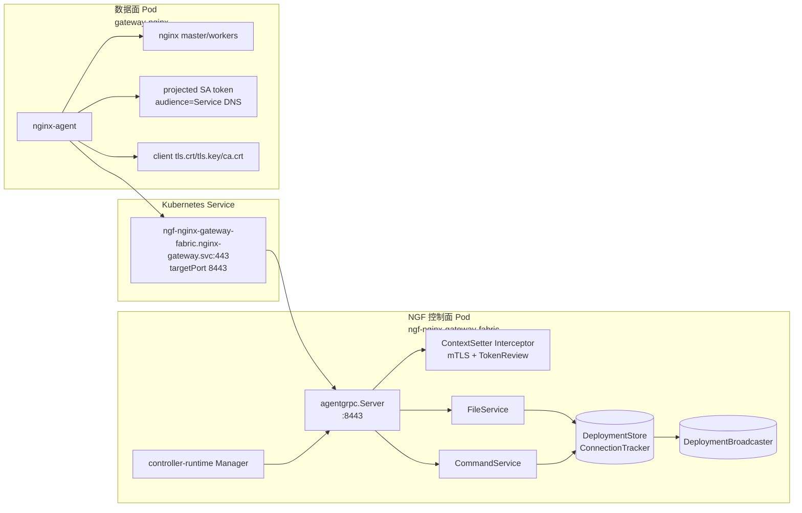
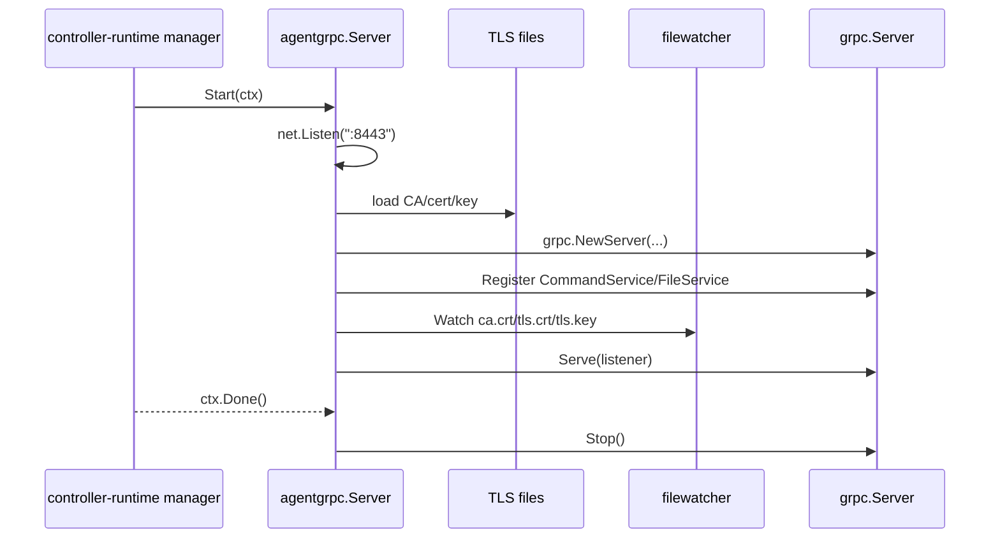
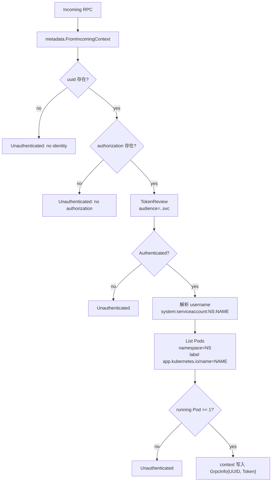
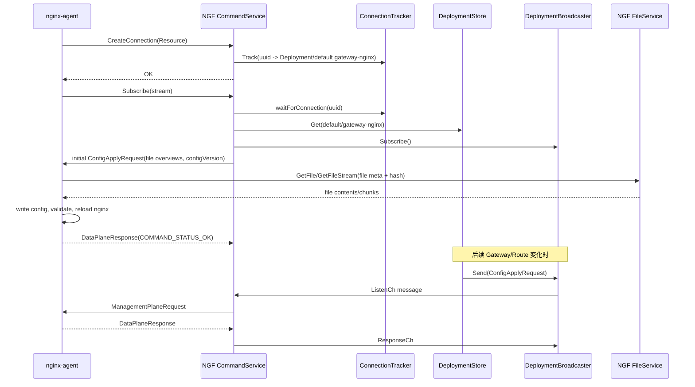
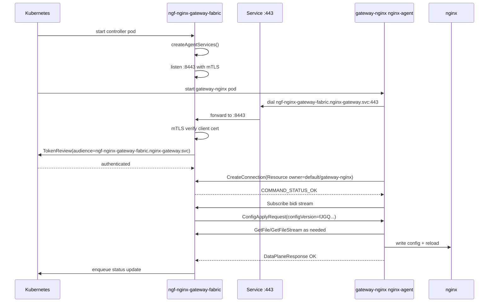

> [!abstract] 核心结论
> NGF 控制面内置了一个专门面向 nginx-agent 的 gRPC server。它监听容器端口 `8443`，由 Service `ngf-nginx-gateway-fabric.nginx-gateway.svc:443` 暴露给数据面。连接建立时先通过 mTLS 校验证书，再通过 gRPC metadata 中的 `authorization` token 调 Kubernetes `TokenReview` 校验数据面 ServiceAccount；业务上注册 `CommandService` 和 `FileService` 两个 MPI 服务：前者维护 agent 到控制面的长连接订阅并下发 `ConfigApplyRequest`，后者在 agent 按文件 hash 拉取配置内容时返回文件。

---

## 1. 环境事实依据

> [!info] 以下事实来自当前运行中的 kind 集群 `kind-ngf-demo`，不是单纯源码推断。

| 资源 | 当前值 |
| --- | --- |
| 控制面 namespace | `nginx-gateway` |
| 控制面 Deployment | `ngf-nginx-gateway-fabric` |
| 控制面镜像 | `ghcr.io/nginx/nginx-gateway-fabric:2.6.5` |
| 控制面容器端口 | `8443`，name=`agent-grpc` |
| 控制面 Service | `ngf-nginx-gateway-fabric`，ClusterIP `10.96.224.159` |
| Service 端口映射 | `443 -> targetPort 8443` |
| 控制面 TLS Secret | `nginx-gateway/server-tls` |
| 控制面 TLS 挂载 | `/var/run/secrets/ngf` |
| 数据面 Deployment | `default/gateway-nginx` |
| 数据面镜像 | `ghcr.io/nginx/nginx-gateway-fabric/nginx:2.6.5` |
| 数据面 agent config | `default/gateway-nginx-agent-config` |
| 数据面 agent TLS Secret | `default/gateway-nginx-agent-tls` |
| 数据面 token audience | `ngf-nginx-gateway-fabric.nginx-gateway.svc` |

当前控制面启动参数节选：

```text
controller
  --gateway-ctlr-name=gateway.nginx.org/nginx-gateway-controller
  --gatewayclass=nginx
  --config=ngf-config
  --service=ngf-nginx-gateway-fabric
  --agent-tls-secret=agent-tls
  --metrics-port=9113
  --health-port=8081
```

数据面 agent 的实际配置：

```yaml
command:
  server:
    host: ngf-nginx-gateway-fabric.nginx-gateway.svc
    port: 443
  auth:
    tokenpath: /var/run/secrets/ngf/serviceaccount/token
  tls:
    cert: /var/run/secrets/ngf/tls.crt
    key: /var/run/secrets/ngf/tls.key
    ca: /var/run/secrets/ngf/ca.crt
    server_name: ngf-nginx-gateway-fabric.nginx-gateway.svc
features:
  - configuration
  - certificates
  - metrics
labels:
  owner-name: default_gateway-nginx
  owner-type: Deployment
  product-type: ngf
  product-version: 2.6.5
```

控制面日志证明当前链路已经成功跑通：

```text
nginxUpdater.commandService: Creating connection for nginx pod: gateway-nginx-5f95f75958-tn9fw
nginxUpdater.commandService: Successfully connected to nginx agent
nginxUpdater.commandService: Sending initial configuration to agent
nginxUpdater.commandService: Successfully configured nginx for new subscription
```

---

## 2. 角色与拓扑



| 层次 | 源码位置 | 职责 |
| --- | --- | --- |
| gRPC server runtime | `internal/controller/nginx/agent/grpc/grpc.go` | 监听端口、加载 mTLS、注册服务、设置 keepalive/interceptor |
| manager wiring | `internal/controller/manager.go` | 创建 `NginxUpdater`，注册 `CommandService`/`FileService`，把 gRPC server 加入 manager |
| 连接鉴权 | `internal/controller/nginx/agent/grpc/interceptor/interceptor.go` | 读取 metadata，TokenReview 校验 token，检查 ServiceAccount 对应 running Pod |
| 连接上下文 | `internal/controller/nginx/agent/grpc/context/context.go` | 把 `uuid` 和 token 放入 RPC context |
| Command 服务 | `internal/controller/nginx/agent/command.go` | `CreateConnection`、`Subscribe`、状态更新、初始配置下发、广播配置变更 |
| File 服务 | `internal/controller/nginx/agent/file.go` | `GetFile`/`GetFileStream` 返回 agent 请求的具体配置文件 |
| 配置缓存 | `internal/controller/nginx/agent/deployment.go` | 每个 nginx Deployment 的文件、hash、configVersion、pod apply 状态 |
| 广播协调 | `internal/controller/nginx/agent/broadcast/broadcast.go` | 把配置/API 请求发送给订阅的 agent，并等待响应 |

---

## 3. Server 从哪里启动

`internal/controller/manager.go` 的 `createAgentServices` 是控制面 gRPC 的装配入口：

1. 创建 `resetConnChan`。
2. 调 `agent.NewNginxUpdater` 创建 `CommandService`、`FileService`、`DeploymentStore`、`ConnectionTracker`。
3. 根据 Gateway 数据面 Service 生成 token audience：`<service>.<namespace>.svc`。
4. 调 `agentgrpc.NewServer`，固定传入端口 `8443`。
5. 注册两个服务：`nginxUpdater.CommandService.Register` 和 `nginxUpdater.FileService.Register`。
6. 通过 `mgr.Add(&runnables.LeaderOrNonLeader{Runnable: grpcServer})` 交给 controller-runtime 生命周期管理。

关键代码事实：

```go
grpcServerPort = 8443

tokenAudience := fmt.Sprintf(
    "%s.%s.svc",
    cfg.GatewayPodConfig.ServiceName,
    cfg.GatewayPodConfig.Namespace,
)

grpcServer := agentgrpc.NewServer(
    cfg.Logger.WithName("agentGRPCServer"),
    grpcServerPort,
    []func(*grpc.Server){
        nginxUpdater.CommandService.Register,
        nginxUpdater.FileService.Register,
    },
    mgr.GetClient(),
    tokenAudience,
    resetConnChan,
)
```

> [!note] 当前环境对应关系
> 源码固定监听 `8443`，Deployment 也暴露 `containerPort: 8443`，Service 再把 `443` 转发到 `8443`。数据面 agent 配置里连的是 Service DNS 和 `443`，不是 Pod IP 或 `8443`。

---

## 4. gRPC Server 运行参数

`internal/controller/nginx/agent/grpc/grpc.go` 的 `Server.Start` 做了几件事：



核心参数：

| 参数 | 值/行为 |
| --- | --- |
| listen | `:8443` |
| TLS 文件路径 | `/var/run/secrets/ngf/ca.crt`、`tls.crt`、`tls.key` |
| TLS 版本 | `tls.VersionTLS13` |
| client cert | `tls.RequireAndVerifyClientCert` |
| CA/cert reload | 每次新 TLS handshake 通过 `GetConfigForClient` 重新读文件 |
| keepalive time | `15s` |
| keepalive timeout | `10s` |
| permit without stream | `true` |
| max send/recv message | `4MB` |
| shutdown | 因为存在长流，ctx 结束时直接 `server.Stop()` |

> [!important] 双重身份校验
> mTLS 只证明连接方持有由同一 CA 签发的客户端证书；业务 interceptor 还要求每个 RPC metadata 带 `uuid` 和 `authorization`，并通过 Kubernetes `TokenReview` 证明这个 token 属于一个实际存在且有 running Pod 的 ServiceAccount。

---

## 5. Interceptor 鉴权链路

所有 unary 和 stream RPC 都走同一套 `ContextSetter`：



当前环境中这条链路的落点是：

- agent metadata `authorization` 来自 `/var/run/secrets/ngf/serviceaccount/token`。
- 数据面 Deployment 的 projected token audience 是 `ngf-nginx-gateway-fabric.nginx-gateway.svc`。
- 控制面 `createAgentServices` 生成的 `tokenAudience` 也是 `ngf-nginx-gateway-fabric.nginx-gateway.svc`。
- 数据面 ServiceAccount 是 `default/gateway-nginx`，Deployment Pod label 包含 `app.kubernetes.io/name: gateway-nginx`，满足 interceptor 按 ServiceAccount 名称找 Pod 的逻辑。

---

## 6. CommandService：连接、订阅与配置下发

`CommandService` 是控制面最核心的 gRPC 服务。它的关键 RPC 可以分为两类：

| RPC | 方向 | 作用 |
| --- | --- | --- |
| `CreateConnection` | agent -> NGF | agent 注册自己所属的 nginx Deployment/DaemonSet 和 instanceID |
| `Subscribe` | agent <-> NGF | 建立双向长流，NGF 下发 `ManagementPlaneRequest`，agent 回 `DataPlaneResponse` |
| `UpdateDataPlaneStatus` | agent -> NGF | agent 发现 nginx instanceID 后补充更新 connection tracker |

### 6.1 CreateConnection

`CreateConnection` 从请求里的 `Resource` 读取 nginx-agent 上报的实例信息：

1. 从 RPC context 取出 interceptor 注入的 `GrpcInfo.UUID`。
2. 从 `resource.instances` 提取 owner：当前环境是 `default/gateway-nginx` 和 `Deployment`。
3. 提取 NGINX instanceID。
4. 写入 `ConnectionTracker`，key 是 `uuid`。
5. 返回 `COMMAND_STATUS_OK`。

当前日志中的事实：

```text
Creating connection for nginx pod: gateway-nginx-5f95f75958-tn9fw
Successfully connected to nginx agent
uuid="3f3ffa23-b871-3816-a2ac-f1235b9a788d"
```

### 6.2 Subscribe 长流

`Subscribe` 是 NGF server 端主动下发配置的核心。流程如下：



`Subscribe` 里有两个重要的并发设计：

- **连接等待**：`waitForConnection` 最多等 `30s`，要求 `CreateConnection` 已经把 `uuid` 写入 tracker，并且 `DeploymentStore` 中已经存在对应 Deployment。
- **配置一致性锁**：新订阅建立时，先对 `deployment.FileLock` 加 `RLock`，再订阅 broadcaster，再发送 initial config。注释明确说明这是为了避免“新 agent 初始配置”和“事件处理线程广播更新”之间产生配置漂移。

---

## 7. FileService：文件按需拉取

NGF 不在 `ConfigApplyRequest` 中直接塞完整文件内容，而是先下发文件 overview：

```go
ConfigApplyRequest{
  Overview: FileOverview{
    Files: []*pb.File{FileMeta{Name, Hash, Permissions, Size}},
    ConfigVersion: {InstanceId, Version},
  },
}
```

agent 收到 overview 后，再按文件 meta 调 `FileService.GetFile` 或 `GetFileStream`。

`FileService` 的处理逻辑：

1. 从 RPC context 获取 `GrpcInfo.UUID`。
2. 通过 `ConnectionTracker.GetConnection(uuid)` 找到该 agent 所属的 Deployment。
3. 通过 `DeploymentStore.Get(parentName)` 取内存里的文件集合。
4. 用 `filename + hash` 精确匹配 `Deployment.files`。
5. `GetFile` 一次性返回 bytes；`GetFileStream` 按 `2MB` chunk 调 agent 库的 `files.SendChunkedFile`。

> [!tip] 为什么用 hash
> hash 是控制面和 agent 之间的配置版本校验点。FileService 只有在文件名和 hash 都匹配时才返回内容；如果文件名存在但 hash 不匹配，会在 debug 日志里打印 wanted/found hash，并返回 `NotFound`。这避免 agent 拉到过期内容。

---

## 8. DeploymentStore 与 Broadcaster

`DeploymentStore` 是控制面 gRPC server 的内存状态核心。每个 nginx Deployment 对应一个 `Deployment` 对象：

| 字段 | 含义 |
| --- | --- |
| `files` | 控制面生成的完整 nginx 配置文件内容 |
| `fileOverviews` | 下发给 agent 的文件元数据 |
| `configVersion` | 由文件 overview 生成的配置版本 |
| `broadcaster` | 对当前 Deployment 下所有已订阅 agent 的广播器 |
| `podStatuses` | 每个 agent/pod 最近一次配置 apply 错误 |
| `FileLock` | 配置事务锁 |
| `latestFileNames` | agent 上报的当前文件列表，用于识别挂载文件和 unmanaged 文件 |

配置更新路径：

1. event handler 根据 Gateway/Route/Policy/Secret 等资源生成 nginx 文件。
2. 调 `NginxUpdaterImpl.UpdateConfig(deployment, files, volumeMounts)`。
3. `deployment.SetFiles` 更新内存文件和 overview，并重新计算 `configVersion`。
4. 若版本没变，直接返回，不广播。
5. 若版本变化，`deployment.GetBroadcaster().Send(msg)` 阻塞等待订阅者响应。
6. `CommandService.Subscribe` 从 `ListenCh` 收到 msg，转成 gRPC `ManagementPlaneRequest` 发给 agent。
7. agent apply 后回 `DataPlaneResponse`。
8. `Subscribe` 写入 `podStatuses`，然后往 `ResponseCh` 发信号，解除 broadcaster 阻塞。

> [!warning] 单 Pod 和多 Pod 行为
> 当前环境只有一个 `gateway-nginx` Pod，因此一次广播只等一个订阅者。多副本数据面时，同一个 Deployment 的每个 agent 都会订阅同一个 broadcaster，`Send` 会等待所有 listener 的 `ResponseCh`，因此任何一个 Pod 的 apply 错误都会进入 `podStatuses` 并影响状态汇总。

---

## 9. TLS 文件热更新与连接重建

控制面和 agent 侧都有 TLS/token 文件变化感知，但职责不同：

| 侧 | 行为 |
| --- | --- |
| NGF server | `buildTLSCredentials` 每次新 TLS handshake 重新读 CA/cert/key；`filewatcher` 监视 TLS 文件并向 `resetConnChan` 发送信号 |
| agent client | credential watcher 发现 token/cert 变化后关闭旧 gRPC connection，创建新 connection，并重建 `Subscribe` 流 |

NGF server 的 `Subscribe` select 中有专门分支：

```go
case <-cs.resetConnChan:
    return grpcStatus.Error(codes.Unavailable, "TLS files updated")
```

这会让旧长流退出，促使 agent 重新建立连接。当前数据面日志中可以看到大约每次 token 刷新时都会发生：

```text
Credential watcher has detected changes
Closing grpc connection
Command plugin received connection reset message
Connection created
Agent connected
Starting new subscribe stream after connection reset
Received management plane config apply request
Sending data plane response message ... COMMAND_STATUS_OK
```

> [!note] 当前环境的周期性重连
> 数据面 projected service account token 配置了 `expirationSeconds: 3600`。Kubernetes 会在 token 生命周期内提前轮换，agent credential watcher 看到文件变化后主动重连。因此日志中每隔一段时间出现一次 `CreateConnection`、`Sending initial configuration`、`Successfully configured nginx for new subscription` 是预期行为。

---

## 10. 当前环境的完整时序



---

## 11. 和 agent 侧视角的对照

| 主题 | agent 侧 | NGF server 侧 |
| --- | --- | --- |
| 连接对象 | `GrpcConnection` 持有 `grpc.ClientConn` | `agentgrpc.Server` 持有 `grpc.Server` |
| 鉴权材料 | tokenpath、client cert/key、CA、server_name | CA、server cert/key、TokenReview、running Pod 校验 |
| 长连接 | `CommandPlugin` 维护 `Subscribe` stream | `commandService.Subscribe` 包装 stream 为 messenger |
| 配置分发 | 收到 `ManagementPlaneRequest` 后写文件/reload | `NginxUpdater.UpdateConfig` 写入 DeploymentStore 并 broadcaster.Send |
| 文件下载 | `FileServiceOperator` 调 `GetFile`/`GetFileStream` | `fileService` 按 `uuid -> Deployment -> filename/hash` 返回内容 |
| 连接重建 | credential watcher 关闭旧 conn 并重建 | filewatcher 或 stream 错误让 `Subscribe` 返回，等待 agent 重连 |
| 状态回传 | `DataPlaneResponse` | `podStatuses` + `statusQueue.Enqueue` |

---

## 12. 关键代码位置速查

| 目标 | 文件 |
| --- | --- |
| gRPC server 类型和启动 | `internal/controller/nginx/agent/grpc/grpc.go` |
| mTLS 动态加载 | `internal/controller/nginx/agent/grpc/grpc.go` |
| server 装配入口 | `internal/controller/manager.go:createAgentServices` |
| token / metadata interceptor | `internal/controller/nginx/agent/grpc/interceptor/interceptor.go` |
| RPC context 中的 `GrpcInfo` | `internal/controller/nginx/agent/grpc/context/context.go` |
| NginxUpdater 创建 Command/File service | `internal/controller/nginx/agent/agent.go:NewNginxUpdater` |
| 配置更新广播入口 | `internal/controller/nginx/agent/agent.go:UpdateConfig` |
| `CreateConnection` | `internal/controller/nginx/agent/command.go` |
| `Subscribe` 长流 | `internal/controller/nginx/agent/command.go` |
| initial config 下发 | `internal/controller/nginx/agent/command.go:setInitialConfig` |
| `ConfigApplyRequest` 构造 | `internal/controller/nginx/agent/command.go:buildRequest` |
| 文件获取服务 | `internal/controller/nginx/agent/file.go` |
| Deployment 内存状态 | `internal/controller/nginx/agent/deployment.go` |
| broadcaster 协调 | `internal/controller/nginx/agent/broadcast/broadcast.go` |

---

## 13. 排障抓手

### 13.1 连接不上

优先验证四件事：

```bash
kubectl -n nginx-gateway get svc ngf-nginx-gateway-fabric -o yaml
kubectl -n nginx-gateway get deploy ngf-nginx-gateway-fabric -o yaml
kubectl -n default get cm gateway-nginx-agent-config -o yaml
kubectl -n default get deploy gateway-nginx -o yaml
```

检查点：

- agent 配置的 `command.server.host` 必须等于控制面 Service DNS。
- agent 配置的 `command.server.port` 当前应为 `443`。
- 数据面 projected token audience 必须与 server 端 `tokenAudience` 一致。
- 控制面 Secret `server-tls` 必须有 `ca.crt`、`tls.crt`、`tls.key`。
- 数据面 Secret `gateway-nginx-agent-tls` 必须有相同 CA 下签发的 client cert/key。

### 13.2 鉴权失败

看控制面日志中 interceptor 报错：

- `no metadata`：agent 没带 gRPC metadata。
- `no identity`：没有 `uuid`。
- `no authorization`：没有 bearer token。
- `invalid authorization`：TokenReview 不通过，常见原因是 audience 不匹配或 token 过期。
- `no running pods found for service account`：ServiceAccount 名称和 Pod label `app.kubernetes.io/name` 对不上，或数据面 Pod 未 running。

### 13.3 配置下发卡住

检查 `Subscribe` 和 broadcaster：

- agent 是否已经 `CreateConnection` 成功。
- 控制面是否有 `Successfully connected to nginx agent`。
- 是否有 `Sending initial configuration to agent`。
- agent 是否回了 `Sending data plane response message`。
- 多副本时是否某个 Pod 没有响应，导致 broadcaster 等待。

### 13.4 周期性重连

当前环境中周期性出现：

```text
Credential watcher has detected changes
Closing grpc connection
Connection created
Agent connected
```

结合 `expirationSeconds: 3600` 的 projected token，这是 token/cert 文件轮换触发的连接重建。只要后续能看到 `Successfully configured nginx for new subscription` 和 agent 的 `COMMAND_STATUS_OK`，通常不代表故障。

---

## 14. 一句话模型

> [!summary]
> NGF 的 gRPC server 是一个“以 Kubernetes 身份为根、以 Deployment 为状态边界、以长连接广播为配置事务”的管理面：agent 先用 mTLS + TokenReview 证明身份，再用 `CreateConnection` 把 `uuid` 绑定到 nginx Deployment，随后在 `Subscribe` 长流里接收配置版本和文件元数据，按需通过 `FileService` 拉文件，apply 结果再回写到控制面的 Deployment 状态与 Gateway status 队列。
