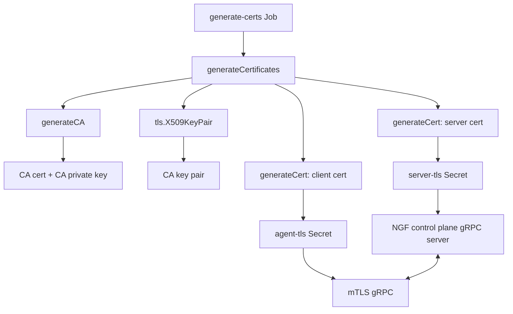
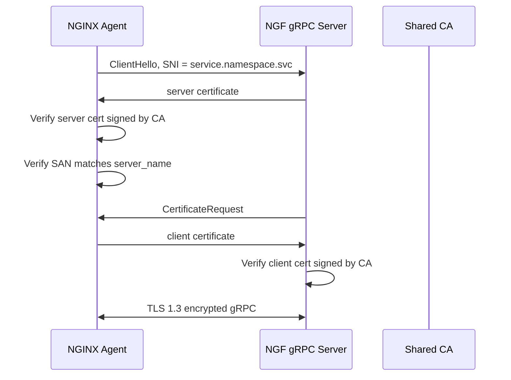

# NGF generateCertificates 函数深度解析

> [!summary]
> `cmd/gateway/certs.go` 里的 `generateCertificates` 用于生成 NGF 控制平面和 NGINX Agent 之间 gRPC/mTLS 通信所需的证书材料。它不是给用户业务流量的 Gateway Listener 签证书，而是给 NGF 自己的控制面到数据面通信签证书。

## 入口场景

Helm/部署清单会启动一个 `generate-certs` Job，执行类似：

```bash
gateway generate-certs \
  --service=<ngf-service> \
  --cluster-domain=cluster.local \
  --server-tls-domain=svc \
  --server-tls-secret=server-tls \
  --agent-tls-secret=agent-tls
```

入口在 `cmd/gateway/commands.go` 的 `createGenerateCertsCommand`：

```go
certConfig, err := generateCertificates(
    serviceName.value,
    namespace,
    clusterDomain.value,
    serverTLSDomain.value,
)
```

默认情况下：

- `service = <NGF Service 名称>`
- `namespace = POD_NAMESPACE`
- `clientDNSDomain = cluster.local`
- `serverTLSDomain = svc`

因此 server 证书默认 SAN 是：

```text
<service>.<namespace>.svc
```

client 证书默认 SAN 是：

```text
*.cluster.local
```

## 总体结构



## generateCertificates 做了什么

源码核心逻辑：

```go
func generateCertificates(service, namespace, clientDNSDomain, serverTLSDomain string) (*certificateConfig, error) {
    caCertPEM, caKeyPEM, err := generateCA()
    if err != nil {
        return nil, fmt.Errorf("error generating CA: %w", err)
    }

    caKeyPair, err := tls.X509KeyPair(caCertPEM, caKeyPEM)
    if err != nil {
        return nil, err
    }

    serverCert, serverKey, err := generateCert(caKeyPair, serverDNSNames(service, namespace, serverTLSDomain))
    if err != nil {
        return nil, fmt.Errorf("error generating server cert: %w", err)
    }

    clientCert, clientKey, err := generateCert(caKeyPair, clientDNSNames(clientDNSDomain))
    if err != nil {
        return nil, fmt.Errorf("error generating client cert: %w", err)
    }

    return &certificateConfig{
        caCertificate:     caCertPEM,
        serverCertificate: serverCert,
        serverKey:         serverKey,
        clientCertificate: clientCert,
        clientKey:         clientKey,
    }, nil
}
```

它按顺序做 4 件事：

1. 生成一个自签名 CA。
2. 把 CA 证书和 CA 私钥解析成 Go TLS 可用的 `tls.Certificate`。
3. 用这个 CA 签发 server 证书。
4. 用同一个 CA 签发 client 证书。

最终返回：

```go
type certificateConfig struct {
    caCertificate     []byte
    serverCertificate []byte
    serverKey         []byte
    clientCertificate []byte
    clientKey         []byte
}
```

## 第一步：generateCA

`generateCA` 先生成 CA 私钥：

```go
caKey, err := rsa.GenerateKey(rand.Reader, 2048)
```

含义：

- 使用 RSA。
- 密钥长度 2048 bit。
- 随机源是 `crypto/rand.Reader`，也就是密码学安全随机数。
- 这个私钥只用于签发后续 server/client 证书。

然后构造 CA 证书模板：

```go
ca := &x509.Certificate{
    Subject:               subject,
    NotBefore:             time.Now(),
    NotAfter:              time.Now().Add(expiry),
    SubjectKeyId:          subjectKeyID(caKey.N),
    KeyUsage:              x509.KeyUsageCertSign | x509.KeyUsageDigitalSignature | x509.KeyUsageKeyEncipherment,
    IsCA:                  true,
    BasicConstraintsValid: true,
}
```

关键字段解释：

- `Subject`：证书主体信息，固定为 `CN=nginx-gateway, O=F5, OU=NGINX` 等。
- `NotBefore`：证书从当前时间开始有效。
- `NotAfter`：证书 3 年后过期，`expiry = 365 * 3 * 24 * time.Hour`。
- `SubjectKeyId`：用 RSA modulus 做 SHA-1 得到的 key identifier。这里 SHA-1 不是用于签名安全性，而是用于证书里的 key id 标识。
- `KeyUsageCertSign`：表示这个证书可以签发其他证书，这是 CA 的核心能力。
- `IsCA: true`：声明这是 CA 证书。
- `BasicConstraintsValid: true`：声明 Basic Constraints 扩展有效，否则 `IsCA` 语义不完整。

然后创建自签名证书：

```go
caCertBytes, err := x509.CreateCertificate(
    rand.Reader,
    ca,
    ca,
    &caKey.PublicKey,
    caKey,
)
```

这里第二个参数和第三个参数都是 `ca`：

- `template = ca`：要生成的证书长什么样。
- `parent = ca`：由谁签发。
- 两者相同，表示自签名 CA。

最后转成 PEM：

```go
caCertPEM := pem.EncodeToMemory(&pem.Block{
    Type:  "CERTIFICATE",
    Bytes: caCertBytes,
})

caKeyPEM := pem.EncodeToMemory(&pem.Block{
    Type:  "RSA PRIVATE KEY",
    Bytes: x509.MarshalPKCS1PrivateKey(caKey),
})
```

> [!note]
> `x509.CreateCertificate` 返回的是 DER 二进制证书。Kubernetes Secret、`tls.X509KeyPair`、很多 CLI 工具更常用 PEM，所以这里用 `pem.EncodeToMemory` 包一层文本格式。

## 第二步：tls.X509KeyPair

```go
caKeyPair, err := tls.X509KeyPair(caCertPEM, caKeyPEM)
```

这一步把 PEM 格式的 CA 证书和 CA 私钥解析成 Go 的 `tls.Certificate`：

```go
type Certificate struct {
    Certificate [][]byte
    PrivateKey  crypto.PrivateKey
    ...
}
```

后面签发 leaf 证书时需要：

- `caKeyPair.Certificate[0]`：CA 证书 DER。
- `caKeyPair.PrivateKey`：CA 私钥。

也就是说，`generateCA` 返回的是存储友好的 PEM，`tls.X509KeyPair` 把它变成代码里可直接使用的签发材料。

## 第三步：serverDNSNames

```go
func serverDNSNames(service, namespace, serverTLSDomain string) []string {
    return []string{
        fmt.Sprintf("%s.%s.%s", service, namespace, serverTLSDomain),
    }
}
```

例如：

```text
service = nginx-gateway
namespace = nginx-gateway
serverTLSDomain = svc
```

生成：

```text
nginx-gateway.nginx-gateway.svc
```

这个值进入 server 证书的 `DNSNames`，也就是 SAN。

NGINX Agent 配置里也会使用同一个名字：

```yaml
command:
  server:
    host: <service>.<namespace>.<serverTLSDomain>
  tls:
    server_name: <service>.<namespace>.<serverTLSDomain>
```

这就是 TLS 服务端身份校验的闭环：

1. Agent 连接 `nginx-gateway.nginx-gateway.svc:443`。
2. 控制平面 gRPC server 出示 server 证书。
3. Agent 用 CA 校验证书链。
4. Agent 用 `server_name` 校验证书 SAN 是否匹配。

## 第四步：generateCert 生成 leaf 证书

server 证书和 client 证书都走同一个函数：

```go
func generateCert(caKeyPair tls.Certificate, dnsNames []string) ([]byte, []byte, error)
```

先生成 leaf 私钥：

```go
key, err := rsa.GenerateKey(rand.Reader, 2048)
```

注意：server 和 client 会分别生成自己的 RSA 私钥，不共用私钥。

然后构造 leaf 证书模板：

```go
cert := &x509.Certificate{
    Subject:      subject,
    NotBefore:    time.Now(),
    NotAfter:     time.Now().Add(expiry),
    SubjectKeyId: subjectKeyID(key.N),
    KeyUsage:     x509.KeyUsageDigitalSignature | x509.KeyUsageKeyEncipherment,
    DNSNames:     dnsNames,
}
```

和 CA 的区别：

- 没有 `IsCA: true`。
- 没有 `KeyUsageCertSign`。
- 有 `DNSNames`，用于 TLS 名称校验。
- 用途是 TLS 握手，不是签发其他证书。

然后解析 CA 证书：

```go
caCert, err := x509.ParseCertificate(caKeyPair.Certificate[0])
```

再用 CA 私钥签发 leaf 证书：

```go
certBytes, err := x509.CreateCertificate(
    rand.Reader,
    cert,
    caCert,
    &key.PublicKey,
    caKeyPair.PrivateKey,
)
```

参数含义：

- `template = cert`：要生成的 server/client 证书。
- `parent = caCert`：签发者是 CA。
- `publicKey = &key.PublicKey`：leaf 证书里的公钥。
- `priv = caKeyPair.PrivateKey`：用 CA 私钥签名。

这一步的结果是：

```text
leaf certificate
  public key: leaf public key
  issuer: CA subject
  signature: signed by CA private key
```

最后同样转 PEM：

```go
certPEM := pem.EncodeToMemory(&pem.Block{
    Type:  "CERTIFICATE",
    Bytes: certBytes,
})

keyPEM := pem.EncodeToMemory(&pem.Block{
    Type:  "RSA PRIVATE KEY",
    Bytes: x509.MarshalPKCS1PrivateKey(key),
})
```

## server 证书和 client 证书的区别

| 项 | server certificate | client certificate |
|---|---|---|
| 生成函数 | `generateCert` | `generateCert` |
| 签发者 | 同一个 CA | 同一个 CA |
| 私钥 | 独立 RSA key | 独立 RSA key |
| SAN 来源 | `serverDNSNames(...)` | `clientDNSNames(...)` |
| 默认 SAN | `<service>.<namespace>.svc` | `*.cluster.local` |
| 存入 Secret | `server-tls` | `agent-tls` |
| 使用者 | NGF control plane gRPC server | NGINX Agent |

`clientDNSNames`：

```go
func clientDNSNames(dnsDomain string) []string {
    return []string{
        fmt.Sprintf("*.%s", dnsDomain),
    }
}
```

> [!important]
> 当前 gRPC server 的 TLS 配置使用 `ClientAuth: tls.RequireAndVerifyClientCert` 和 `ClientCAs: certPool`。这表示服务端要求客户端提供证书，并验证该证书是否由信任的 CA 签发。代码中没有看到基于 client 证书 DNS SAN 做进一步授权的逻辑。Agent 的业务身份还会通过投射的 ServiceAccount token 进入 gRPC interceptor。

## Secret 写入结果

`createSecrets` 会把结果拆成两个 Kubernetes TLS Secret。

`server-tls`：

```yaml
type: kubernetes.io/tls
data:
  ca.crt:  <CA certificate>
  tls.crt: <server certificate>
  tls.key: <server private key>
```

`agent-tls`：

```yaml
type: kubernetes.io/tls
data:
  ca.crt:  <same CA certificate>
  tls.crt: <client certificate>
  tls.key: <client private key>
```

关键点：

- 两个 Secret 共享同一个 `ca.crt`。
- `server-tls` 的 `tls.crt/tls.key` 是服务端证书和私钥。
- `agent-tls` 的 `tls.crt/tls.key` 是客户端证书和私钥。

## 运行时如何使用

控制平面 Deployment 挂载 `server-tls`：

```yaml
volumes:
- name: nginx-agent-tls
  secret:
    secretName: server-tls

volumeMounts:
- name: nginx-agent-tls
  mountPath: /var/run/secrets/ngf
```

控制平面 gRPC server 读取：

```go
caCertPath  = "/var/run/secrets/ngf/ca.crt"
tlsCertPath = "/var/run/secrets/ngf/tls.crt"
tlsKeyPath  = "/var/run/secrets/ngf/tls.key"
```

然后构造 mTLS server：

```go
tls.Config{
    ClientAuth: tls.RequireAndVerifyClientCert,
    ClientCAs:  certPool,
    MinVersion: tls.VersionTLS13,
}
```

NGINX 数据面 Pod 挂载 `agent-tls`，Agent 配置中读取：

```yaml
tls:
  cert: /var/run/secrets/ngf/tls.crt
  key: /var/run/secrets/ngf/tls.key
  ca: /var/run/secrets/ngf/ca.crt
  server_name: <service>.<namespace>.<serverTLSDomain>
```

## mTLS 握手映射



## 代码里值得注意的细节

> [!tip]
> `generateCertificates` 每次运行都会生成新的 CA、新的 server key、新的 client key。因此如果 Job 带 `--overwrite` 更新 Secret，旧连接需要重新建立，双方都要使用同一批新 CA 和 leaf 证书。

细节清单：

- `expiry` 是 3 年，CA、server、client 都一样。
- 所有私钥都是 RSA 2048。
- 所有证书的 `Subject` 相同，区别主要靠 SAN 和密钥。
- leaf 证书没有显式设置 `ExtKeyUsage`。在 Go 的证书校验语义里，未设置 EKU 通常表示不限制用途。
- leaf 证书没有设置 IP SAN，只能按 DNS 名称校验。
- CA 私钥不会写入 Secret；Secret 里只有 CA 证书、leaf 证书、leaf 私钥。
- `subjectKeyID` 使用 SHA-1 只是生成证书标识，不是用 SHA-1 做 TLS 安全签名。
- `tls.X509KeyPair` 在这里不是发起 TLS，而是把 PEM 材料解析成签发函数方便使用的结构。

## 测试覆盖说明

`cmd/gateway/certs_test.go` 验证了：

- `generateCertificates("nginx", "default", "cluster.local", "svc")` 能生成 CA、server cert/key、client cert/key。
- CA 证书 `IsCA` 为 true。
- server 证书可以被同一个 CA 验证，DNSName 为 `nginx.default.svc`。
- 自定义 `serverTLSDomain = internal.mycompany.com` 时，server SAN 变为 `nginx.default.internal.mycompany.com`。
- `createSecrets` 会分别把 server/client 材料放入对应 Secret。
- `overwrite=false` 时不更新已有 Secret，`overwrite=true` 时更新。

可用下面的命令验证相关测试：

```bash
go test ./cmd/gateway -run 'TestGenerateCertificates|TestGenerateCertificatesWithCustomServerTLSDomain'
```
