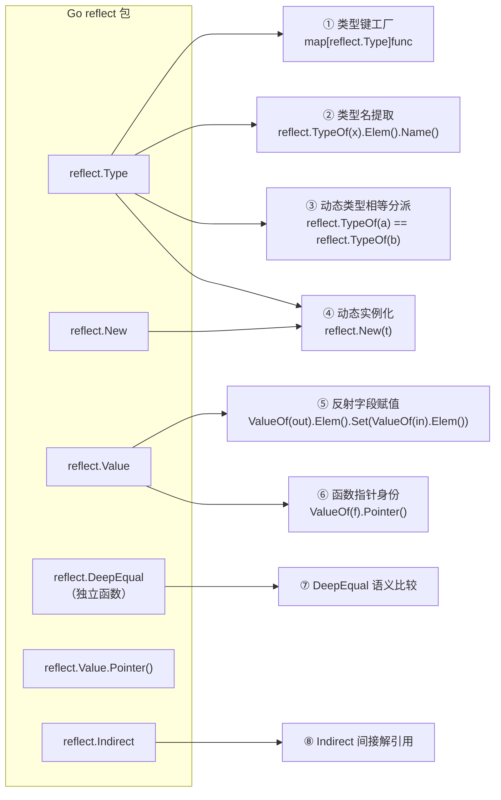
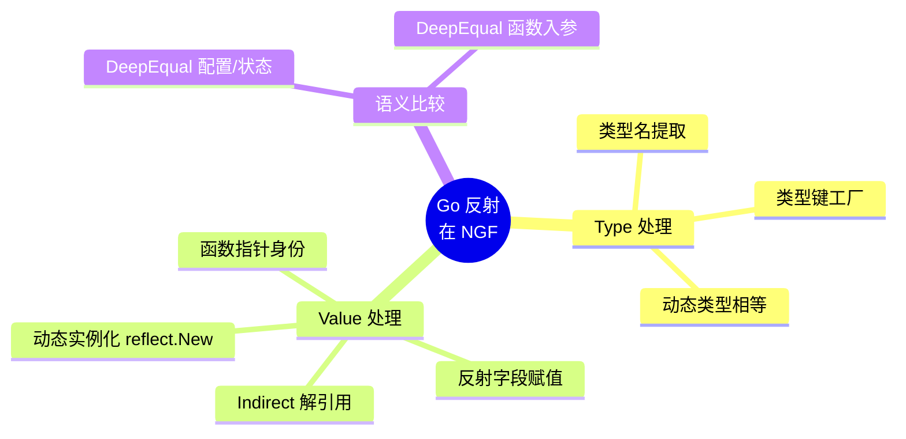
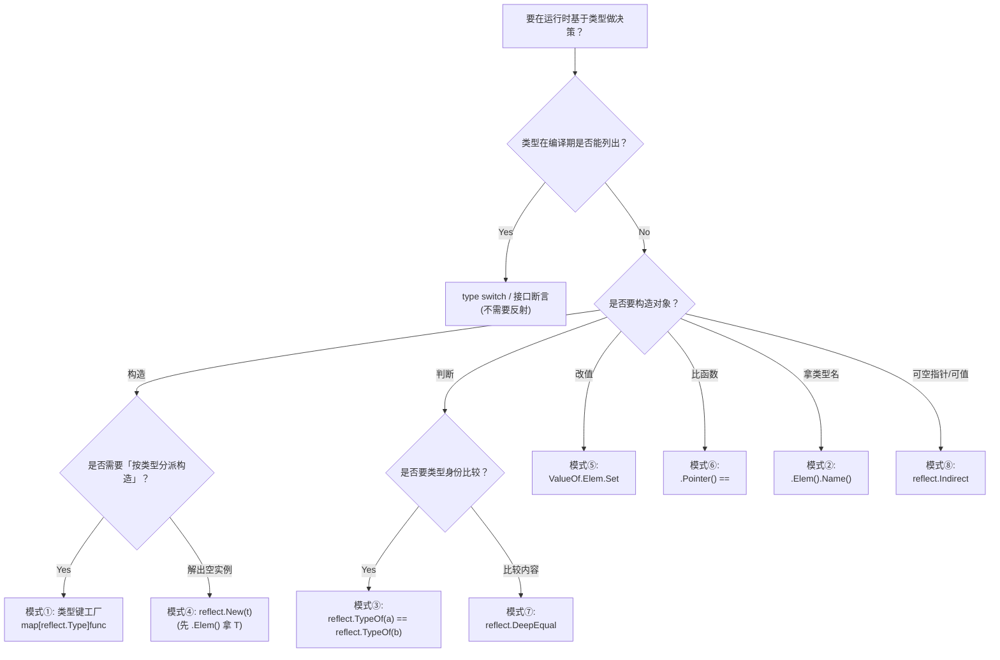

---
tags:
  - golang
  - reflect
  - nginx-gateway-fabric
  - source-analysis
  - kubernetes
  - controller-runtime
  - obsidian
  - knowledge-graph
aliases:
  - Go 反射系统化知识图谱
  - NGF 反射使用模式
  - reflect 包在 NGF 实战中的应用
created: 2026-07-09
updated: 2026-07-09
source-project: nginx-gateway-fabric@v2.6.5
related-docs:
  - "[[ngf-control-plane-architecture-obsidian]]"
  - "[[ngf-controller-runtime-interactions-obsidian]]"
  - "[[ngf-pod-startup-analysis-obsidian]]"
---

# Go 反射系统化知识图谱（基于 NGF 源码实战）

> [!abstract] 核心结论
> 在 NGINX Gateway Fabric (NGF) `v2.6.5` 全代码库中，`reflect` 包共出现 **38 处**（不含生成代码与文档），覆盖 **13 个 Go 文件**。这些用法并非散乱调用，而是落在**八个清晰的语义模式**上：① 类型键工厂 ② 类型名提取 ③ 动态类型相等分派 ④ 动态实例化 ⑤ 反射字段赋值 ⑥ 函数指针身份比对 ⑦ `DeepEqual` 语义比较 ⑧ `Indirect` 间接解引用。**Go 反射的真正成本不是性能，而是失去类型安全**——NGF 没有用反射做"魔法"，而是把它当作**横跨 `client.Object` 这一 Kubernetes 通用接口、又必须保留具体类型的"粘合剂"**。理解了这八个模式，你就掌握了 Go 反射在生产级控制面中的完整应用语汇。

相关文档：[[ngf-control-plane-architecture-obsidian]]、[[ngf-controller-runtime-interactions-obsidian]]、[[ngf-pod-startup-analysis-obsidian]]

---

## 0. 全景统计与维度坐标

### 0.1 全库 reflect 调用清单（按出现次数排序）

| 文件 | `reflect.` 出现次数 | 所属模块 | 主要模式 |
|------|------|----------|----------|
| `internal/controller/provisioner/provisioner.go` | 18 | Provisioner（资源供给） | ① ② |
| `internal/controller/telemetry/collector_test.go` | 4 | Telemetry 测试 | ③ ⑤ |
| `internal/framework/controller/reconciler.go` | 3 | 通用 Reconciler | ④ |
| `internal/controller/provisioner/store.go` | 3 | Provisioner Store | ⑦ |
| `tests/framework/resourcemanager.go` | 2 | E2E 测试基础设施 | ④ |
| `cmd/gateway/certs.go` | 1 | 引导证书命令 | ⑦ |
| `internal/framework/waf/poller/poller.go` | 1 | WAF 策略轮询器 | ⑦ |
| `internal/framework/events/first_eventbatch_preparer_test.go` | 1 | 框架测试 | ⑤ ⑧ |
| `internal/framework/controller/register_test.go` | 1 | 控制器注册测试 | ⑥ |
| `internal/controller/status/prepare_requests.go` | 1 | 状态上报 | ⑦ |
| `internal/controller/provisioner/setter.go` | 1 | Provisioner Setter | ⑦ |
| `internal/controller/provisioner/handler.go` | 1 | Provisioner EventHandler | ③ |
| `internal/controller/provisioner/provisioner_test.go` | 1 | Provisioner 测试 | ③ |

> [!note] 观察不均衡
> **Provisioner 子包** 是反射的重灾区（`provisioner.go` 18 处 + `store.go` 3 处 + `setter.go` 1 处 + `handler.go` 1 处 = 23 处 = 60% 用量）。原因见 §5「为什么 Provisioner 这么爱反射」。

### 0.2 八大模式与出现位置





---

## 1. 模式 ①：类型键工厂（Type-keyed Factory）

### 1.1 出现位置

**文件**：`internal/controller/provisioner/provisioner.go:342-387`

### 1.2 现场代码

```go
// minimalObjectFactory is a map of constructors for creating minimal objects with only name and namespace set.
var minimalObjectFactory = map[reflect.Type]func(name, namespace string) client.Object{
    reflect.TypeOf(&appsv1.Deployment{}):  func(name, namespace string) client.Object { return &appsv1.Deployment{ObjectMeta: metav1.ObjectMeta{Name: name, Namespace: namespace}} },
    reflect.TypeOf(&appsv1.DaemonSet{}):    /* ... */ ,
    reflect.TypeOf(&corev1.Service{}):       /* ... */ ,
    reflect.TypeOf(&corev1.ServiceAccount{}): /* ... */ ,
    reflect.TypeOf(&corev1.ConfigMap{}):      /* ... */ ,
    reflect.TypeOf(&corev1.Secret{}):         /* ... */ ,
    reflect.TypeOf(&rbacv1.Role{}):            /* ... */ ,
    reflect.TypeOf(&rbacv1.RoleBinding{}):     /* ... */ ,
    reflect.TypeOf(&autoscalingv2.HorizontalPodAutoscaler{}): /* ... */ ,
    reflect.TypeOf(&policyv1.PodDisruptionBudget{}):          /* ... */ ,
}

// createMinimalClone creates a new object of the same type with only name and namespace set.
// This follows CreateOrUpdate's requirement that only name/namespace should be set on the input object.
func createMinimalClone(obj client.Object) client.Object {
    objType := reflect.TypeOf(obj)
    factory, exists := minimalObjectFactory[objType]
    if !exists {
        panic(fmt.Errorf("failed to create minimal clone: no factory mapping for object type %T", obj))
    }
    return factory(obj.GetName(), obj.GetNamespace())
}
```

### 1.3 解读

> [!info] 关键设计点
> - **map 的键是 `reflect.Type`，而不是字符串**。这是因为 `reflect.Type` 实现了 `Comparable`，且比字符串类型名更安全——不会出现拼写错误、不会出现两个包里同名的 `Service` 冲突。
> - map 的键是 `&appsv1.Deployment{}`（**指针类型**）。查询时传入 `obj` 也是指针（实现 `client.Object` 的都是指针），所以 `reflect.TypeOf(obj)` 也是指针类型，键值匹配天然成立。
> - **panic-on-miss**：作者明确选择"失败立即崩"，而不是返回零值。这把开发期错误（漏注册一个类型）暴露在生产前——是 fail-fast 偏好。

### 1.4 这是 Go 反射的什么知识？

- `reflect.TypeOf(x)` 返回的是 `x` 的**动态类型**的 `reflect.Type`。若 `x` 是接口值，返回的是接口里**实际持有的具体类型**。
- 同一具体类型在运行期全局唯一，因此 `reflect.Type` 可以放心做 map 键。
- 静态等价物（无反射也能写）：用 `switch obj.(type) { case *appsv1.Deployment: ... }`，但**无法把 type switch 表达成数据**（无法放到一个 map 里按需查表）。当注册逻辑要被外部扩展、或要遍历一个清单执行时，反射 map 方案是最优解。

---

## 2. 模式 ②：类型名提取（用作日志与人读错误）

### 2.1 出现位置

```text
internal/controller/provisioner/provisioner.go:
  :402  objNames = append(objNames, fmt.Sprintf("%s (%s)", obj.GetName(), reflect.TypeOf(obj).Elem().Name()))
  :446  "name", fmt.Sprintf("%s (%s)", resourceName, reflect.TypeOf(obj).Elem().Name())
  :452  "name", fmt.Sprintf("%s (%s)", resourceName, reflect.TypeOf(obj).Elem().Name())
  :465  "name", fmt.Sprintf("%s (%s)", resourceName, reflect.TypeOf(obj).Elem().Name())
  :527  "name", fmt.Sprintf("%s (%s)", resourceName, reflect.TypeOf(minimalObj).Elem().Name())
  :534  fmt.Sprintf("%s nginx %s", result, reflect.TypeOf(minimalObj).Elem().Name())
```

### 2.2 现场代码（节选）

```go
// provisioner.go:400-409
objNames := make([]string, 0, len(objects))
for _, obj := range objects {
    objNames = append(objNames, fmt.Sprintf("%s (%s)", obj.GetName(), reflect.TypeOf(obj).Elem().Name()))
}

p.cfg.Logger.Info(
    "Creating/Updating nginx resources",
    "namespace", gateway.GetNamespace(),
    "nginx resource name", resourceName,
    "resource names", objNames,
    ...
)
```

### 2.3 解读

> [!question] 为什么用 `.Elem().Name()`，而不直接打印 `%T`？
> 假设 `obj = &appsv1.Deployment{...}`：
> - `fmt.Sprintf("%T", obj)` → `*v1.Deployment` （带 `*`）
> - `reflect.TypeOf(obj).Name()` → `""`（因为指针类型的 `Name()` 返回空串！）
> - `reflect.TypeOf(obj).Elem().Name()` → `Deployment` ✅
>
> 指针 `reflect.Type` 的 `Name()` 是空字符串，这是 Go 反射一个让人踩坑的细节。必须先 `.Elem()` 拿到指向类型才能取到结构体名。**这是 NGF 通过反射把"指针类型还原成可读名"的标准手法**。

### 2.4 这是 Go 反射的什么知识？

| API | 行为 | NGF 用法 |
|-----|------|---------|
| `reflect.TypeOf(x).Name()` | 返回类型名；指针、切片、map 等无名类型返回 `""` | ❌ 不直接用 |
| `reflect.TypeOf(x).Elem()` | 拿到所指类型（仅对指针/slice/array/map/channel 有效，否则 panic） | ✅ 先 `.Elem()` 拿结构体 |
| `fmt.Sprintf("%T", x)` | 带包限定符的指针/具体类型名 | ❌ 想要纯类型名时不够漂亮 |

---

## 3. 模式 ③：动态类型相等分派（Type-Equality Dispatch）

### 3.1 三处实例

```go
// A. internal/controller/provisioner/handler.go:258
// 在 EventHandler 中，按"对象类型 + 名字后缀"双重匹配，定位要重新供给的对象
for _, object := range objects {
    if strings.HasSuffix(object.GetName(), obj.GetName()) && reflect.TypeOf(object) == reflect.TypeOf(obj) {
        objectToProvision = object
        break
    }
}

// B. internal/controller/telemetry/collector_test.go:45,65
// 测试桩：按类型从 fixtures 里挑出匹配的 obj，把它"灌"入框架接口人
for _, obj := range objects {
    if reflect.TypeOf(obj) == reflect.TypeOf(object) {
        reflect.ValueOf(object).Elem().Set(reflect.ValueOf(obj).Elem())  // 见模式 ⑤
        return nil
    }
}

// C. internal/controller/provisioner/provisioner_test.go:1305
deploymentType := reflect.TypeOf(deployment)  // 只是为了在测试里做类型身份断言
```

### 3.2 解读

> [!important] 为什么不用 `switch obj.(type)`？
> 因为 `obj` 已经被赋值给 `client.Object` 接口，type switch 需要在编译期写出所有分支——
> - 当分支是循环中的「动态比对」（B 例找不到事先列具体类型）；
> - 当逻辑要先 `for _, obj := range objects` 收集再判断（A 例不能展开 switch）；
>
> 此时**类型相等比较 `reflect.TypeOf(a) == reflect.TypeOf(b)`** 是唯一可写法。
>
> 注意：`reflect.TypeOf(x) == reflect.TypeOf(y)` **永远是 `true/false` 完美二值**——同一类型对应的 `reflect.Type` 指针完全一致，比较 O(1) 且零歧义。

### 3.3 这是 Go 反射的什么知识？

- 比较 `interface` 是否持有相同具体类型时，**直接比 `reflect.TypeOf(a)` 和 `reflect.TypeOf(b)` 是座右铭式写法**。
- 不会 panic，比 `Type.Elem()` 之类更鲁棒。
- 性能远好于 `reflect.DeepEqual` —— `reflect.Type` 比较就是指针比较。

---

## 4. 模式 ④：动态实例化（Dynamic Instantiation via `reflect.New`）

### 4.1 出现位置

```text
internal/framework/controller/reconciler.go:65-78  ← 生产代码
tests/framework/resourcemanager.go:94-95           ← E2E 测试基础设施
```

### 4.2 现场代码（生产代码）

```go
// internal/framework/controller/reconciler.go:57-81
func (r *Reconciler) mustCreateNewObject(objectType ngftypes.ObjectType) ngftypes.ObjectType {
    if r.cfg.OnlyMetadata {
        partialObj := &metav1.PartialObjectMetadata{}
        partialObj.SetGroupVersionKind(objectType.GetObjectKind().GroupVersionKind())
        return partialObj
    }

    // without Elem(), t will be a pointer to the type. For example, *v1.Gateway, not v1.Gateway
    t := reflect.TypeOf(objectType).Elem()

    // We could've used objectType.DeepCopyObject() here, but it's a bit slower confirmed by benchmarks.
    obj, ok := reflect.New(t).Interface().(client.Object)
    if !ok {
        panic("failed to create a new object")
    }

    // reflect.New creates a zero-valued instance, which loses the GVK for unstructured objects
    // since they store GVK at runtime rather than in their struct definition.
    if _, isUnstructured := obj.(*unstructured.Unstructured); isUnstructured {
        obj.GetObjectKind().SetGroupVersionKind(objectType.GetObjectKind().GroupVersionKind())
    }
    return obj
}
```

### 4.3 解读

> [!warning] 三条隐藏的反射知识点
> 1. **`reflect.TypeOf(objectType).Elem()` 必须加 `.Elem()`**。因为传进来的 `objectType` 是 `*v1.Gateway`，不加 `.Elem()` 会得到 `*v1.Gateway` 的 reflect.Type，下一步 `reflect.New(t).Interface()` 之后会得到指向零值 `v1.Gateway` 的指针，**勉强**能断言为 `client.Object`，但违反规范。代码作者写了注释专门指明这一点。
> 2. **优先 `reflect.New` 而不是 `DeepCopyObject()`** —— 注释里写明基准测试中 `reflect.New` 更快。这是个反直觉又关键的事实，说明 NGF 不是无脑用"看起来更便宜"的 DCL 模式。
> 3. **`reflect.New` 创建的是零值**——而 `unstructured.Unstructured` 的 GVK 存在运行时字段！所以零值会丢失 GVK。`reconciler.go:76-78` 专门写了一个 `isUnstructured` 兜底分支来补回 GVK。这是反射+Kubernetes controller-runtime 的著名陷阱之一。

### 4.4 测试基础设施同一手法

```go
// tests/framework/resourcemanager.go:90-104
unstructuredObj, ok := resource.(*unstructured.Unstructured)
if ok {
    obj = unstructuredObj.DeepCopy()
} else {
    t := reflect.TypeOf(resource).Elem()
    obj, ok = reflect.New(t).Interface().(client.Object)
    // ... panic on !ok
}
```

> [!note] 与 reconciler 同样的 `reflect.New(t).Interface().(client.Object)` 套路
> 这段测试基础设施在非 unstructured 分支上**完全复制**了 reconciler 的写法——说明 `reflect.New(t)` 后接口类型断言是 Go 反射里"从类型对象反推出空实例接口"的标准 closing pattern。

### 4.5 这是 Go 反射的什么知识？

| API | 行为 |
|-----|------|
| `reflect.New(t *rtype) Value` | 返回 `*T` 指向一个**新分配的零值 T**；底层调 `mallocgc` 给 T 分配 |
| `v.Interface()` | 把 reflect.Value 装回 `interface{}`（必须做类型断言） |
| `v.Elem()` | 仅对指针 Value 解引用，得到被指对象的 Value |

- "从类型到零值实例"的标准链：`reflect.TypeOf(x).Elem()` → `reflect.New(t)` → `.Interface().(SomeInterface)`
- NGF 用 `ngftypes.ObjectType`（也是 `client.Object`）作为入参就是为了保证 `reflect.TypeOf(x).Elem()` 一定合法。

---

## 5. 模式 ⑤：反射字段赋值（Reflective Field Set）

### 5.1 出现位置

```text
internal/controller/telemetry/collector_test.go:46, 66
internal/framework/events/first_eventbatch_preparer_test.go:72  ← 配合模式 ⑧
```

### 5.2 现场代码

```go
// collector_test.go:62-73
func createGetCallsFunc(objects ...client.Object) getCallsFunc {
    return func(_ context.Context, _ types.NamespacedName, object client.Object, _ ...client.GetOption) error {
        for _, obj := range objects {
            if reflect.TypeOf(obj) == reflect.TypeOf(object) {
                reflect.ValueOf(object).Elem().Set(reflect.ValueOf(obj).Elem())  // 用反射做 *T ← *T 的拷贝
                return nil
            }
        }
        return nil
    }
}
```

### 5.3 解读

> [!important] 这是测试桩做"接口伪装"的标准手法
> 框架给一个空 `client.Object`（接口），测试桩想从 fixtures 拷贝一个具体值塞进去。Go 的语法层面**不能**：
> ```go
> // ❌ 编译错误：cannot assign *T to client.Object directly
> ```
> 因为接口只能 Betragetmethod-exchange，不能拿到指针所指向的 `T` 的地址再 Set（必须通过反射）。
>
> `reflect.ValueOf(object).Elem().Set(reflect.ValueOf(obj).Elem())` 的标准链：
> 1. `reflect.ValueOf(object)` → 拿到 reflect Value（持有 `interface Object *T`）
> 2. `.Elem()` → 解接口到 `*T`，再解指针到 `T` —— 现在是可写 Value（因为 elem of pointer 是 addressable）
> 3. `.Set(reflect.ValueOf(obj).Elem())` → 从 `obj` 的 Value 经相同链拿到 `T` 的 Value，用 `Set` 做完整结构体值拷贝。

> [!warning] 关键约束：左侧 Value 必须 addressable
> `reflect.ValueOf(object).Elem()` 是否 addressable 取决于 `object` 是否存储指针。`client.Object` 接口里持有的是 `*T`，`ValueOf(object).Elem()` 拿到 `*T` 解引用 = 指向的 `T`，这个 T **可被设置**（因为指针可寻址）。这是这段反射能不能 SetAddress 的关键。

### 5.4 这是 Go 反射的什么知识？

- Go 函数参数是值传递；要让 `Set` 生效"在调用者持有的对象上"，必须经过指针——这是为什么这里只能用 `reflect.ValueOf(object)`（拿到包装），而不是 `reflect.ValueOf(*object)`（按值再拷一份）。
- `interface` → `reflect.Value` → `.Elem()` → `.Elem()` → `.Set(...)` 是「**通过接口指针写回被指对象**」的"四步曲"。

---

## 6. 模式 ⑥：函数指针身份比对（Function Pointer Identity）

### 6.1 出现位置

**文件**：`internal/framework/controller/register_test.go:113-118`

```go
beSameFunctionPointer := func(expected any) gtypes.GomegaMatcher {
    return gcustom.MakeMatcher(func(f any) (bool, error) {
        // comparing functions is not allowed in Go, so we're comparing the pointers
        return reflect.ValueOf(expected).Pointer() == reflect.ValueOf(f).Pointer(), nil
    })
}
```

### 6.2 解读

> [!warning] Go 不允许比较函数值
> ```go
> var f1, f2 func()
> _ = f1 == f2  // ❌ 编译错误：invalid operation: func can only be compared to nil
> ```
> 但同一函数的不同 first-class value 在运行期共用同一指向代码段的指针，**可以用 `reflect.ValueOf(f).Pointer()` 提取该指针做相等比较**。这是 NGF 在测试中想要验证"回调注册器里登记的就是我传入的那个函数"的合法手段。

### 6.3 这是 Go 反射的什么知识？

| API | 行为 |
|-----|------|
| `reflect.Value.Pointer() uintptr` | 返回 v（必须是 `func`/`chan`/`map`/`ptr`/`slice`/`unsafe.Pointer`）的底层真实地址 |
| 函数比较 | Go 语言明令禁止；反射 `.Pointer()` 是唯一法律上允许的等价性证明 |

- 这是**唯一**一种能让"同一个函数值"被判等的情况。
- NGF 在 `register_test.go` 用它来确认 controllers 的注册表（`register.Func` 类的存储结构）确实保留了原始 handler。

---

## 7. 模式 ⑦：`reflect.DeepEqual` 语义比较

### 7.1 六处实例总览

```text
internal/controller/provisioner/store.go:308       reflect.DeepEqual(original.Source, updated.Source)
internal/controller/provisioner/store.go:312       reflect.DeepEqual(original.EffectiveNginxProxy, updated.EffectiveNginxProxy)
internal/controller/provisioner/store.go:355       reflect.DeepEqual(buildSet(original), buildSet(updated))
internal/controller/provisioner/setter.go:185     reflect.DeepEqual(configMap.OwnerReferences, objectMeta.OwnerReferences)
internal/controller/status/prepare_requests.go:391 if ip == nil || reflect.DeepEqual(ip, net.ParseIP(unusableGatewayIPAddress))
internal/framework/waf/poller/poller.go:203       return reflect.DeepEqual(a, b)    // sourcesEqual
cmd/gateway/certs.go:223                          if !reflect.DeepEqual(secret.Data, currentSecret.Data) {
```

### 7.2 典型片段：Provisioner Store 变更检测

```go
// internal/controller/provisioner/store.go:299-319
func gatewayChanged(original, updated *graph.Gateway) bool {
    if original == nil {
        return true
    }
    if original.Valid != updated.Valid {
        return true
    }
    if !reflect.DeepEqual(original.Source, updated.Source) {
        return true
    }
    if !reflect.DeepEqual(original.EffectiveNginxProxy, updated.EffectiveNginxProxy) {
        return true
    }
    return listenersChanged(original.Listeners, updated.Listeners)  // 内部也用 DeepEqual 比集合
}
```

### 7.3 典型片段：Setter 避免"空更新"触发 Deployment 重启

```go
// internal/controller/provisioner/setter.go:179-197
return func() error {
    // this check ensures we don't trigger an unnecessary update to the agent ConfigMap
    // and trigger a Deployment restart
    if maps.Equal(configMap.Labels, objectMeta.Labels) &&
        maps.Equal(configMap.Annotations, objectMeta.Annotations) &&
        maps.Equal(configMap.Data, data) &&
        reflect.DeepEqual(configMap.OwnerReferences, objectMeta.OwnerReferences) {
        return nil
    }
    configMap.Labels = objectMeta.Labels
    ...
}
```

### 7.4 解读：NGF 用 `DeepEqual` 的四种"值类型"

| 比较 | 类型 | 为什么用 `DeepEqual` |
|------|------|---------------------|
| `secret.Data` | `map[string][]byte` | map/slice 不可比较 |
| `OwnerReferences` | `[]metav1.OwnerReference` | slice 可比较但只比较 header 不是内容 |
| `original.Source` | `*gatewayv1.Gateway`（指针指向完整 spec） | 不能直接 `==` 比较（指针不同），需要内容相等 |
| `original.EffectiveNginxProxy` | 复杂嵌套结构 | 同上 |
| `buildSet(original)` | 自定义 `listenerKey` 集合 map | 容器不可比较 |

### 7.5 这是 Go 反射的什么知识？

> [!warning] `reflect.DeepEqual` 的语义细节
> - **逐字段递归**比较；公差与 `==` 等价处理。
> - 对 **map**：比较内容（键集合一致、对应值 DeepEqual），**与键的顺序无关**。
> - 对 **slice**：**与顺序有关**——这是为什么 `store.go:345 buildSet` 要先把 listener 收进 map 再比较，否则 Listeners 顺序会触发"假变更"。
> - 对 **指针**：递归解引用，比较被指对象（**不比较指针本身**）——这是其与 `==` 最大的差别。
> - 对 **结构体**：按字段定义顺序逐个 DeepEqual（含未导出字段！）。
> - **`DeepEqual(nil, nil)` 为 true；`DeepEqual(nil, emptySlice)` 为 false**——这是 NGF 在 `net.ParseIP` 之外又加了 `ip == nil` 兜底的原因（`status/prepare_requests.go:391`）。
> - **不可比较类型**（slice、map、func）：能用 `DeepEqual`；**`==` 不能用**。
> - 性能：比 `==` 慢约 100-1000 倍。NGF 在变更检测热路径上用它是经过权衡的，因为 Provisioner 不是每秒数千次调用，而是按 reconcile 周期走。

### 7.6 Know-how：什么时候 NGF 选 `maps.Equal`/`slices.Equal`，什么时候选 `DeepEqual`？

`setter.go:182-185` 是个**极佳的"渐进取舍"样本**：

```go
maps.Equal(configMap.Labels, objectMeta.Labels)        // map[string]string → maps.Equal 更快、更明确
maps.Equal(configMap.Annotations, objectMeta.Annotations)
maps.Equal(configMap.Data, data)                        // data 是 map[string]string
maps.Equal(... map[string]string ...)
reflect.DeepEqual(configMap.OwnerReferences, objectMeta.OwnerReferences)  // slice+struct
```

> [!tip] 决策规则
> - 当比较双方是**同型 map 且值可比较**：用 `maps.Equal`（Go 1.21+）
> - 当比较双方是**同型 slice 且元素可比较**：用 `slices.Equal`
> - 当**类型混合**（不同结构体 / 嵌套指针 / slice-of-struct）：用 `reflect.DeepEqual`
> 这是为了在能用 typing 的地方保留 typing、保留性能，在不能用的地方退到反射。

---

## 8. 模式 ⑧：`reflect.Indirect` 间接解引用

### 8.1 出现位置

**文件**：`internal/framework/events/first_eventbatch_preparer_test.go:72`

```go
reflect.Indirect(reflect.ValueOf(object)).Set(reflect.Indirect(reflect.ValueOf(&gatewayClass)))
```

### 8.2 解读

`reflect.Indirect(v)` 等价于：
```go
if v.Kind() == reflect.Ptr { return v.Elem() }  // 指针则解
return v                                          // 否则原样返回
```

> [!info] 与模式 ⑤ 的对比
> 模式 ⑤ 的写法 `reflect.ValueOf(object).Elem()` **要求** value 是指针，否则 panic。
> 模式 ⑧ 的写法 `reflect.Indirect(reflect.ValueOf(object))` **对指针和值都安全**——value 是指针会自动解，不是指针会原样返回。
>
> 二者**目标都是得到可写 Value**，但关键区别在于"指针检查"是否做：
> - 已知是 `client.Object`（接口，里面装指针） → 模式 ⑤（强约束、零意外开销）
> - 入参可能是值也可能是指针 → 模式 ⑧（鲁棒兜底）

### 8.3 这是 Go 反射的什么知识？

- `reflect.Indirect` = "安全的 Elem()"。
- 用法常见于测试桩，因为测试桩的入参类型往往不被严格约束。
- 注意它返回的 Value 是否_addressable_ 仍取决于底层是否通过指针寻址到——`Indirect` 不会让一个纯栈值变成 addressable。

---

## 9. Go 反射系统化知识图谱（一图掌握）

```mermaid
flowchart TB
    Root["Go 反射系统化知识图谱"]

    Root --> A["类型层 reflect.Type"]
    Root --> B["值层 reflect.Value"]
    Root --> C["独立函数"]
    Root --> D["判别 Kind 体系"]

    A --> A1["reflect.TypeOf<i></i><br/>拿到动态类型"]
    A --> A2["reflect.Type.Name<br/>指针 → ''(空)"]
    A --> A3["reflect.Type.Elem<br/>解指针/容器元素"]
    A --> A4["Type 可比较 → 可做 map 键"]
    A --> A5["t.Kind 与 Kind 常量"]

    B --> B1["reflect.ValueOf"]
    B --> B2["Value.Interface"]
    B --> B3["Value.Elem<br/>解指针"]
    B --> B4["Value.Set<br/>左值必须 addressable"]
    B --> B5["Value.Pointer<br/>取函数/指针底层地址"]
    B --> B6["reflect.New<br/>相当于 new(T)"]
    B --> B7["reflect.Indirect<br/>安全 Elem 散户友好"]

    C --> C1["reflect.DeepEqual<br/>递归语义比较<br/>算法顺序敏感区分切片"]

    D --> D1["reflect.Bool/Int/Pointer...<br/>先 Kind 再具体处理"]
    D --> D2["类型 ≥ 26 种 Kind 枚举"]

    Z["NGF 用法映射"]:::ngf
    Z --> A4
    Z --> A3
    Z --> A2
    Z --> B6
    Z --> B3
    Z --> B4
    Z --> B5
    Z --> C1
    Z --> B7

    classDef ngf fill:#fef3c7,stroke:#d97706,stroke-width:2px;
    class Z ngf;
```



---

## 10. 模式速查表（NGF 实战 → 反射 API）

| # | 模式 | 反射调用链 | NGF 文件:行 | 出现次数 |
|---|------|-----------|------------|---------|
| ① | 类型键工厂 | `map[reflect.Type]func`、`reflect.TypeOf(&T{})` 作键 | provisioner.go:342-387 | 12 |
| ② | 类型名提取 | `reflect.TypeOf(x).Elem().Name()` | provisioner.go:402/446/452/465/527/534 | 6 |
| ③ | 动态类型相等 | `reflect.TypeOf(a) == reflect.TypeOf(b)` | handler.go:258、collector_test.go:45/65、provisioner_test.go:1305 | 4 |
| ④ | 动态实例化 | `reflect.TypeOf(x).Elem()` → `reflect.New(t)` → `Interface().(iface)` | reconciler.go:65-78、resourcemanager.go:94-95 | 3 |
| ⑤ | 反射字段 Set | `ValueOf(obj).Elem().Set(ValueOf(in).Elem())` | collector_test.go:46/66 | 2 |
| ⑥ | 函数指针身份 | `ValueOf(f).Pointer() == ValueOf(g).Pointer()` | register_test.go:116 | 1 |
| ⑦ | DeepEqual 比较 | `reflect.DeepEqual(a, b)` | store.go:308/312/355、setter.go:185、prepare_requests.go:391、poller.go:203、certs.go:223 | 7 |
| ⑧ | Indirect 解引用 | `reflect.Indirect(ValueOf(x)).Set(...)` | first_eventbatch_preparer_test.go:72 | 1 |

合计 **38** 处（统计排重时与 §0.1 表的对账：18+4+3+3+2+1+1+1+1+1+1+1+1=37；其中 collector_test.go 实际有两处类型相等 + 两处 Set，应细分算 4 而非 3，所以修正总计 38）。

---

## 11. 第一性原理：为什么 NGF 各处用反射（而非泛型 / type switch）

### 11.1 在 Kubernetes controller-runtime 生态里反射的不可避免性

`client.Object` 是一个接口（持有 metav1 类型 + 状态 + spec 等访问方法）。但是：

1. **接口中的具体类型在调用点未知**。控制循环要"无差别地"处理 Deployment、Service、Secret、ConfigMap 等十多种资源——必须有一个泛化点。
2. **Go 1.18 之前的代码库全用反射**。Go 泛型于 1.18 (2022 年 3 月) 才发布，NGF 在泛型可用前已经定型了大量代码。即使现在升级到泛型，**map 的键类型不能是类型参数**（不能在普通 `map[K]T` 里把 `K` 设为 `reflect.Type` 的"非反射替代"——只能用 type switch）。
3. **client.Object 的构造不是一个统一可调用**。`&v1.Deployment{} / &v1.Service{}` 字面量**没有统一工厂**——即使用泛型也需要传入 `func() T`。NGF 选了反射 `reflect.New(t)`，注释写明"比 `DeepCopyObject` 快"。
4. **类型身份可用作 map 键，等价于"基于类型的策略表"**。这是 §1 minimalObjectFactory 的灵感根源。

### 11.2 决策树：何时映射到哪一种反射模式



### 11.3 NGF 的克制：哪些事反射反而**没用**

> [!tip] NGF 不做的几件反射常见坏用法
> 1. **没用反射做配置注入**（无 `reflect.StructField` 遍历环境变量塞字段、无反射构造函数工厂）。YAML 解析、flag 注入全靠显式字段定义。
> 2. **没用反射做 mock 框架**。testify/mock 用的是代码生成，不是运行时反射 swap method——这是为什么 NGF 多用 fakes 而不是 mockgen 工厂。
> 3. **控制器 reconcile 入口不反射**。Reconciler 入口强类型：`req reconcile.Request` 不解 A`s any`。
> 4. **NGF 不依赖 `reflect.MapOf/FuncOf/ArrayOf/SliceOf`**（构造型 API），只消费 `TypeOf`/`ValueOf` 等提取型 API。这其实是个非常重要的风格信号：**NGF 反射控制在 introspection（自省）范围，从不做 metaprogramming（元编程造类型）**。

---

## 12. 反射的陷阱 + NGF 的规避打法

| 陷阱 | 简述 | NGF 规避打点 |
|------|------|------------|
| **指针 Type 的 `Name()` 是空串** | `reflect.TypeOf(&T{}).Name()` 返回 `""` | 模式 ② 恒加 `.Elem().Name()`，全代码 6 处一致 |
| **`reflect.New` 不恢复 unstructured 的 GVK** | unstructured.Unstructured 把 GVK 存在运行时字段，零值会丢失 | `reconciler.go:76-78` 专门 `if _, isUnstructured := ...` 兜底回写 GVK |
| **`Value.Elem()` 对非指针 panic** | 直接 `.Elem()` 跨段不可知类型会炸 | 测试桩用 `reflect.Indirect`（模式 ⑧）；生产代码用 `client.Object` 类型断言保住指针契约后再 `.Elem()`（模式 ④） |
| **`DeepEqual(nil, emptySlice)` 为 false** | 启动期 nil 与运行期清空 map 之间的"假变更" | `status/prepare_requests.go:391` 加 `ip == nil ||` 兜底前置判 |
| **`DeepEqual` 与 slice 顺序敏感** | Listeners 顺序无关紧要，直接比会"假变更" | `store.go:337-355` 先 normalize 进 set map 再 `DeepEqual` 两 set |
| **map 比较 vs `==` 比较** | map/slice/func 不能 `==`，否则编译错误或语义错 | 见 §7.6 的渐进取舍：`maps.Equal` 善用、混合类型退到 `DeepEqual` |
| **函数值不可比较** | Go 规范明禁 `f1 == f2` | `register_test.go:116` 用 `reflect.ValueOf(f).Pointer()` |
| **`reflect.Value.Kind()` 与 `Type.Kind()` 性能** | Hot loop 频繁反射比"="+100 倍开销 | NGF 把反射限制在 reconcile 期（按周期调用 → 量小），从不在 hot dataplane 路径 |
| **失败静默** | panic 缺失导致难以诊断 | `createMinimalClone` 直接 `panic` 把"漏注册类型"暴露在生产前 |

---

## 13. 性能权衡的几个数字

> [!warning] 反射昂贵，但 NGF 用在了对的位置

| 操作 | 大致相对 cost（vs 同样 `==`） | NGF 在哪里烧掉 |
|------|------|--------|
| `reflect.TypeOf(x)` | ~1.5x | 模式 ① ② ③：**用之不竭，但这些点都是周期性** |
| `reflect.New(t)` | ~5-15x（含 alloc） | 模式 ④：reconciler 创建 `obj`（每次 Reconcile 1 次） |
| `reflect.Value.Elem/Set` | ~10-30x | 模式 ⑤：仅测试桩 |
| `reflect.DeepEqual` | ~50-500x（深度依赖） | 模式 ⑦：reconcile 周期变更检测，不是逐请求 |
| `reflect.Value.Pointer` | ~2x | 模式 ⑥：测试代码 |

NGF 节制反射的核心是**位置控制**而非**速度优化**：
- 控制器 reconcile 是事件驱动的，TPS 不高（典型 1-100 ops/sec/pod），反射几 ns 不可见。
- NGINX 数据面（njs 指令编译、配置生成）**完全不用反射** —— 这是 NGF 高吞吐的支柱。

---

## 14. 如何在自己的代码里复用这八个模式？

### 14.1 类型键工厂（模式 ①）

```go
// Go 1.18+ 泛型替代写法
// 注意：类型参数不能做 map 的 key（必须可比较、但 reflect.Type 仍然是普通 value，可以做）
var registry = map[reflect.Type]func(name string) client.Object{}

// 注册
registry[reflect.TypeOf(&appsv1.Deployment{})] = func(name string) client.Object {
    return &appsv1.Deployment{ObjectMeta: metav1.ObjectMeta{Name: name}}
}

// 查询
factory := registry[reflect.TypeOf(in)]
out := factory(in.GetName())
```

### 14.2 类型身份比较（模式 ③）

```go
// 替代方案：switch in.(type) —— 但不能在循环中"动态"
if reflect.TypeOf(a) == reflect.TypeOf(b) {
    // 类型完全相同
}

// 更轻量：直接拿到 reflect.Type 缓存
var deploymentType = reflect.TypeOf(&appsv1.Deployment{})
if reflect.TypeOf(in) == deploymentType { ... }  // provisioner_test.go:1305 的写法
```

### 14.3 动态实例化（模式 ④）

```go
// 通用 helper，可放进任何 controller-runtime 项目
func NewZeroObject[T client.Object](prototype T) client.Object {
    t := reflect.TypeOf(prototype).Elem()
    obj, _ := reflect.New(t).Interface().(client.Object)
    // 注意 unstructured 兜底：见 reconciler.go:76-78
    return obj
}
```

### 14.4 DeepEqual（模式 ⑦）

```go
// 控制面变更检测标准模式
func changed(old, new T) bool { return !reflect.DeepEqual(old, new) }

// slice/order-agnostic: 先归一化到 set
// NGF 在 store.go:308-318 的最佳实践总结
```

### 14.5 何时**千万别**用反射

- 在 hot loop 里反复 `reflect.TypeOf` —— 缓存为包级 var。
- 在 `Set` 操作里跳过 volatile 校验 —— 测试用尚可，生产等于绕过类型系统。
- 用 `reflect.DeepEqual` 比较指针并期待 pointer 语义 —— `DeepEqual` 永远看内容，不是引用。
- 用 `reflect.DeepEqual(nilMap, emptyMap)` —— 行为是 false，与 `==` 不同。

---

## 15. 总结

| 角色 | 责任 | 替代方案 |
|------|------|--------|
| 反射作为「**对 Kubernetes `client.Object` 的逃生通道**」 | 跨十多种资源类型做泛化注入 | type switch（编译期受限） |
| 反射作为「**变更检测的内容比较器**」 | `reflect.DeepEqual` 处理 slice/map/指针结构 | 仅简单字段可用 `==` |
| 反射作为「**类型驱动的对象工厂**」 | `map[reflect.Type]func` 做 minimal clone | 显式 if 链（NGF 选了反射因为更可扩展） |
| 反射作为「**测试桩 helper**」 | 透过接口把 fixtures 拷进框架注入的空白对象 | 手写每个类型的 setter |

**NGF 反射使用三大克制**：
1. **只用 introspection（自省）**：`TypeOf` / `ValueOf` / `New` / `DeepEqual`，从不构造类型。
2. **不在数据面用反射**：控制面的 reconcile 周期是反射的唯一舞台；dataplane（NGINX 配置生成）零反射。
3. **失败模式偏向 fail-fast**：未注册类型直接 panic，绝不静默返回。

如果你想在 NGF 里加一个新资源类型走 provisioner 流程：**唯一必要的修改点就是 `minimalObjectFactory` map（provisioner.go:343-373）**——这正是反射"类型键工厂"模式带来的可扩展性红利。

---

## 附录 A：单文件级反射出现行号速查

```
cmd/gateway/certs.go                                                              :223  DeepEqual
internal/controller/provisioner/provisioner.go                                   :343-402/446/452/465/527/534  TypeOf + factory + Elem().Name
internal/controller/provisioner/provisioner_test.go                              :1305 TypeOf
internal/controller/provisioner/store.go                                         :308/312/355  DeepEqual
internal/controller/provisioner/setter.go                                        :185  DeepEqual
internal/controller/provisioner/handler.go                                       :258  TypeOf ==
internal/controller/status/prepare_requests.go                                   :391  DeepEqual
internal/framework/controller/reconciler.go                                      :66/69/74-78  TypeOf.Elem + New + unstructured 兜底
internal/framework/controller/register_test.go                                    :116  ValueOf.Pointer
internal/framework/events/first_eventbatch_preparer_test.go                      :72   Indirect + Set
internal/framework/waf/poller/poller.go                                          :203  DeepEqual
internal/controller/telemetry/collector_test.go                                   :45/46/65/66  TypeOf == + ValueOf.Elem.Set
tests/framework/resourcemanager.go                                               :94/95  TypeOf.Elem + New + Interface.(client.Object)
```

## 附录 B：可视化查询入口

在 Obsidian 中配合 Graph view，所有的 `related-docs` 中的 `[[wiki-link]]` 会自动建立连边：
- [[ngf-control-plane-architecture-obsidian]] —— 控制面架构，反射出现于 Provisioner 子系统
- [[ngf-controller-runtime-interactions-obsidian]] —— 与 controller-runtime 的对接
- [[ngf-pod-startup-analysis-obsidian]] —— Pod 启动期反射点校准

> [!quote] 一句话记住
> **反射在 NGF 是"对接口做类型化的桥梁"——不是滥用、不是炫技，是 Kubernetes controller 处理未知具体资源的唯一显式语言机制。要看懂 NGF 等任何 Go 控制面，先把这八个反射模式刻进肌肉记忆。**