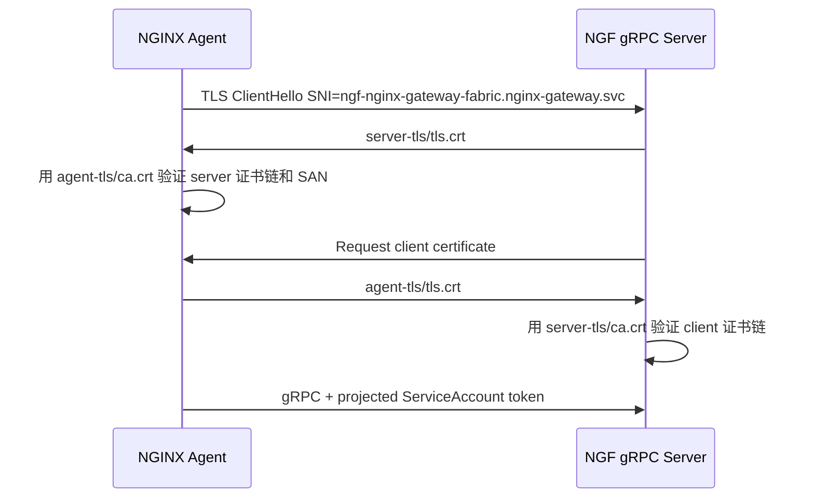

# kind 环境 mTLS 证书内容与代码对应

> [!summary]
> 当前 kind 上下文是 `kind-ngf-demo`。NGF 控制面和 NGINX Agent 之间的 gRPC 通道使用一套自签 CA 做 mTLS：`nginx-gateway/server-tls` 给控制面 gRPC server 使用，`nginx-gateway/agent-tls` 是 Agent 证书的 base Secret，随后被复制成数据面命名空间里的 `default/gateway-nginx-agent-tls`。

相关笔记：[[create-generate-certs-command-analysis-obsidian]]、[[generate-certificates-analysis-obsidian]]、[[ngf-agent-grpc-auth-analysis]]

## 当前 Secret

| Namespace | Secret | Type | 用途 |
| --- | --- | --- | --- |
| `nginx-gateway` | `server-tls` | `kubernetes.io/tls` | 控制面 gRPC server 使用的 `ca.crt`、`tls.crt`、`tls.key` |
| `nginx-gateway` | `agent-tls` | `kubernetes.io/tls` | Agent/client 证书的 base Secret |
| `default` | `gateway-nginx-agent-tls` | `kubernetes.io/tls` | 复制到数据面 Gateway 所在命名空间后的 Agent/client Secret |

> [!important]
> `server-tls` 和 `agent-tls` 的 `ca.crt` 是同一份证书；`agent-tls` 与 `default/gateway-nginx-agent-tls` 的三个字段 SHA256 完全一致。

## 证书与密钥摘要

| Secret | Key | 内容 | Bytes | SHA256 |
| --- | --- | --- | ---: | --- |
| `nginx-gateway/server-tls` | `ca.crt` | 自签 CA 证书 | 1253 | `eaca0b87f7dc61120947bb64937ba6fefd2d922ccffc345a7f7fbcb006abaea3` |
| `nginx-gateway/server-tls` | `tls.crt` | 控制面 server 证书 | 1306 | `530e560613ff3787322f9a7af5d4c39f2e6d34ae5b0cf64e8aad8986938ea5ad` |
| `nginx-gateway/server-tls` | `tls.key` | 控制面 server 私钥 | 1679 | `7d8e6aa448266795aeeb94143c5f8ee3feb650e00a14237da6bb565670fe413f` |
| `nginx-gateway/agent-tls` | `ca.crt` | 同一份自签 CA 证书 | 1253 | `eaca0b87f7dc61120947bb64937ba6fefd2d922ccffc345a7f7fbcb006abaea3` |
| `nginx-gateway/agent-tls` | `tls.crt` | Agent/client 证书 | 1269 | `2978a72bd535f3edb2b061f0b3bf5e23c45fd63cc93b070b335db9eac3098269` |
| `nginx-gateway/agent-tls` | `tls.key` | Agent/client 私钥 | 1675 | `1745e253f87db8f02c49c18566525b057d4c88a93acc7fadc78e14ebb84f3a16` |

> [!warning]
> 文档只记录私钥的存在位置、长度和 SHA256，不固化私钥 PEM 正文。需要排查时可在本地用下面的命令临时查看。

```bash
kubectl get secret -n nginx-gateway server-tls -o jsonpath="{.data['tls\.key']}" | base64 -d
kubectl get secret -n nginx-gateway agent-tls -o jsonpath="{.data['tls\.key']}" | base64 -d
```

## CA 证书内容

`nginx-gateway/server-tls ca.crt` 与 `nginx-gateway/agent-tls ca.crt` 相同。

| 字段 | 值 |
| --- | --- |
| Subject | `C=US, L=SEA, O=F5, OU=NGINX, CN=nginx-gateway` |
| Issuer | `C=US, L=SEA, O=F5, OU=NGINX, CN=nginx-gateway` |
| Serial | `6D34975AE5B236484085C7F2A9BA1137643453AA` |
| Not Before | `Jun 24 02:39:54 2026 GMT` |
| Not After | `Jun 23 02:39:54 2029 GMT` |
| Public Key | RSA 2048 bit |
| Key Usage | `Digital Signature, Key Encipherment, Certificate Sign` |
| Basic Constraints | `CA:TRUE` |
| Subject Key Identifier | `37:7E:C3:86:E1:13:3E:8F:F8:55:6B:53:D2:11:89:9C:DE:56:41:98` |
| SHA256 Fingerprint | `D0:BB:C5:3A:5C:77:6E:3F:50:29:15:80:6F:E8:79:16:E5:27:9F:68:E0:2C:C4:21:9D:D4:C4:CD:97:74:64:71` |

对应代码：

- `cmd/gateway/certs.go` 的 `generateCA()` 生成 RSA 2048 CA 私钥和自签 CA 证书。
- `subject` 固定为 `C=US, L=SEA, O=F5, OU=NGINX, CN=nginx-gateway`。
- `expiry = 365 * 3 * 24 * time.Hour`，所以有效期约 3 年。
- `generateCertificates()` 只把 `caCertificate` 返回给 Secret，CA 私钥不写入 Kubernetes Secret。

## server 证书内容

`nginx-gateway/server-tls tls.crt` 是控制面 gRPC server 对 Agent 出示的服务端证书。

| 字段 | 值 |
| --- | --- |
| Subject | `C=US, L=SEA, O=F5, OU=NGINX, CN=nginx-gateway` |
| Issuer | `C=US, L=SEA, O=F5, OU=NGINX, CN=nginx-gateway` |
| Serial | `3E7C7CB07070F8CE5F94FBDEE3EDE6D199D168BA` |
| Not Before | `Jun 24 02:39:55 2026 GMT` |
| Not After | `Jun 23 02:39:55 2029 GMT` |
| Public Key | RSA 2048 bit |
| Key Usage | `Digital Signature, Key Encipherment` |
| Subject Alternative Name | `DNS:ngf-nginx-gateway-fabric.nginx-gateway.svc` |
| Subject Key Identifier | `6D:33:03:19:1E:90:B9:27:84:2D:E7:D3:6C:0D:5B:54:34:96:FB:A5` |
| SHA256 Fingerprint | `37:89:B8:B5:7B:57:BC:14:3B:6D:32:E6:32:17:FD:FD:23:F6:BD:2C:A4:DC:CC:F3:DC:F4:9D:2A:0A:0D:7D:B4` |

对应代码：

- `cmd/gateway/certs.go` 的 `generateCertificates()` 调用 `generateCert(caKeyPair, serverDNSNames(...))`。
- `serverDNSNames(service, namespace, serverTLSDomain)` 生成 `service.namespace.serverTLSDomain`。
- Helm Job 传参来自 `charts/nginx-gateway-fabric/templates/certs-job.yaml`：

```yaml
- --service={{ include "nginx-gateway.fullname" . }}
- --server-tls-domain={{ .Values.serverTLSDomain }}
- --server-tls-secret={{ .Values.certGenerator.serverTLSSecretName }}
```

在当前 kind 环境中：

```text
service = ngf-nginx-gateway-fabric
namespace = nginx-gateway
serverTLSDomain = svc
server SAN = ngf-nginx-gateway-fabric.nginx-gateway.svc
```

## agent/client 证书内容

`nginx-gateway/agent-tls tls.crt` 是 Agent 连接控制面时出示的客户端证书。数据面实际使用的是复制后的 `default/gateway-nginx-agent-tls tls.crt`，内容相同。

| 字段 | 值 |
| --- | --- |
| Subject | `C=US, L=SEA, O=F5, OU=NGINX, CN=nginx-gateway` |
| Issuer | `C=US, L=SEA, O=F5, OU=NGINX, CN=nginx-gateway` |
| Serial | `5A33864124B6C6420EB1D6DA9AE4F59DD9933C6E` |
| Not Before | `Jun 24 02:39:55 2026 GMT` |
| Not After | `Jun 23 02:39:55 2029 GMT` |
| Public Key | RSA 2048 bit |
| Key Usage | `Digital Signature, Key Encipherment` |
| Subject Alternative Name | `DNS:*.cluster.local` |
| Subject Key Identifier | `5B:59:D6:54:47:D9:32:EF:11:33:7C:FA:9D:E2:36:9C:12:66:D9:DC` |
| SHA256 Fingerprint | `03:48:65:4D:AB:A0:29:F5:E5:65:9F:79:37:66:8B:42:16:66:FD:98:44:41:6E:8A:BE:00:A8:A4:C5:F1:FA:50` |

对应代码：

- `cmd/gateway/certs.go` 的 `generateCertificates()` 调用 `generateCert(caKeyPair, clientDNSNames(clientDNSDomain))`。
- `clientDNSNames(dnsDomain)` 固定生成 `*.cluster.local`。
- Helm Job 通过 `--cluster-domain={{ .Values.clusterDomain }}` 传入 `cluster.local`。

## Secret 写入对应关系

`cmd/gateway/certs.go` 的 `createSecrets()` 写入两个 `kubernetes.io/tls` Secret：

```go
serverSecret.Data = map[string][]byte{
    "ca.crt":  certConfig.caCertificate,
    "tls.crt": certConfig.serverCertificate,
    "tls.key": certConfig.serverKey,
}

clientSecret.Data = map[string][]byte{
    "ca.crt":  certConfig.caCertificate,
    "tls.crt": certConfig.clientCertificate,
    "tls.key": certConfig.clientKey,
}
```

所以映射关系是：

| Kubernetes Secret | `ca.crt` | `tls.crt` | `tls.key` |
| --- | --- | --- | --- |
| `server-tls` | 自签 CA 证书 | 控制面 server 证书 | 控制面 server 私钥 |
| `agent-tls` | 同一份自签 CA 证书 | Agent/client 证书 | Agent/client 私钥 |

## 控制面如何使用 server-tls

Helm 控制面 Deployment 把 `server-tls` 挂载到 `/var/run/secrets/ngf`：

```yaml
volumes:
- name: nginx-agent-tls
  secret:
    secretName: server-tls

volumeMounts:
- name: nginx-agent-tls
  mountPath: /var/run/secrets/ngf
```

`internal/controller/nginx/agent/grpc/grpc.go` 固定读取：

```go
caCertPath  = "/var/run/secrets/ngf/ca.crt"
tlsCertPath = "/var/run/secrets/ngf/tls.crt"
tlsKeyPath  = "/var/run/secrets/ngf/tls.key"
```

TLS 行为：

- `tls.LoadX509KeyPair(certPath, keyPath)` 加载 `server-tls/tls.crt` 和 `server-tls/tls.key`。
- `loadCACertPool(caPath)` 加载 `server-tls/ca.crt`。
- `ClientAuth: tls.RequireAndVerifyClientCert` 要求 Agent 必须出示客户端证书。
- `ClientCAs: certPool` 用同一 CA 验证 Agent/client 证书。
- `MinVersion: tls.VersionTLS13` 要求 TLS 1.3。

## 数据面如何使用 agent-tls

Provisioner 会把 Agent base Secret 复制/命名成 Gateway 数据面的 Secret。当前 kind 环境中是：

```text
default/gateway-nginx-agent-tls ca.crt  sha256=eaca0b87f7dc61120947bb64937ba6fefd2d922ccffc345a7f7fbcb006abaea3
default/gateway-nginx-agent-tls tls.crt sha256=2978a72bd535f3edb2b061f0b3bf5e23c45fd63cc93b070b335db9eac3098269
default/gateway-nginx-agent-tls tls.key sha256=1745e253f87db8f02c49c18566525b057d4c88a93acc7fadc78e14ebb84f3a16
```

数据面 Deployment `default/gateway-nginx` 的相关挂载：

```text
volume: nginx-agent-tls -> secret gateway-nginx-agent-tls
mount:  nginx-agent-tls -> /var/run/secrets/ngf
mount:  token -> /var/run/secrets/ngf/serviceaccount
```

`internal/controller/provisioner/templates.go` 生成 `nginx-agent.conf`：

```yaml
command:
    server:
        host: ngf-nginx-gateway-fabric.nginx-gateway.svc
        port: 443
    auth:
        tokenpath: /var/run/secrets/ngf/serviceaccount/token
    tls:
        cert: /var/run/secrets/ngf/tls.crt
        key: /var/run/secrets/ngf/tls.key
        ca: /var/run/secrets/ngf/ca.crt
        server_name: ngf-nginx-gateway-fabric.nginx-gateway.svc
```

这对应 mTLS 校验和业务身份传递：

1. Agent 用 `/var/run/secrets/ngf/ca.crt` 验证控制面 server 证书。
2. Agent 连接的 `server_name` 是 `ngf-nginx-gateway-fabric.nginx-gateway.svc`，与 server 证书 SAN 完全匹配。
3. 控制面用自己的 `server-tls/ca.crt` 验证 Agent 出示的 `agent-tls/tls.crt`。

## mTLS 握手视图



## 常用排查命令

查看证书摘要：

```bash
kubectl get secret -n nginx-gateway server-tls -o jsonpath="{.data['tls\.crt']}" \
  | base64 -d \
  | openssl x509 -noout -subject -issuer -serial -dates -fingerprint -sha256 -text
```

比较两个 CA 是否一致：

```bash
cmp -s \
  <(kubectl get secret -n nginx-gateway server-tls -o jsonpath="{.data['ca\.crt']}" | base64 -d) \
  <(kubectl get secret -n nginx-gateway agent-tls -o jsonpath="{.data['ca\.crt']}" | base64 -d) \
  && echo "same CA"
```

查看 Agent 当前连接目标：

```bash
kubectl get cm -n default gateway-nginx-agent-config \
  -o jsonpath="{.data.nginx-agent\\.conf}"
```

## 结论

当前 kind 环境的证书链路是：

```text
generate-certs Helm hook
  -> generateCA()
  -> generateCert(serverDNSNames(...))  -> nginx-gateway/server-tls
  -> generateCert(clientDNSNames(...))  -> nginx-gateway/agent-tls
  -> Provisioner 复制 agent-tls       -> default/gateway-nginx-agent-tls
  -> 控制面和 Agent 通过 /var/run/secrets/ngf 建立 TLS 1.3 mTLS
```

关键对应关系：

- `server-tls/tls.crt` 的 SAN 必须匹配 Agent 配置里的 `server_name`。
- `server-tls/ca.crt` 和 `agent-tls/ca.crt` 必须一致。
- `agent-tls/tls.crt` 不靠 SAN 绑定具体 Pod 身份；控制面 gRPC server 只校验它由同一 CA 签发。业务层身份还依赖 `/var/run/secrets/ngf/serviceaccount/token`。
