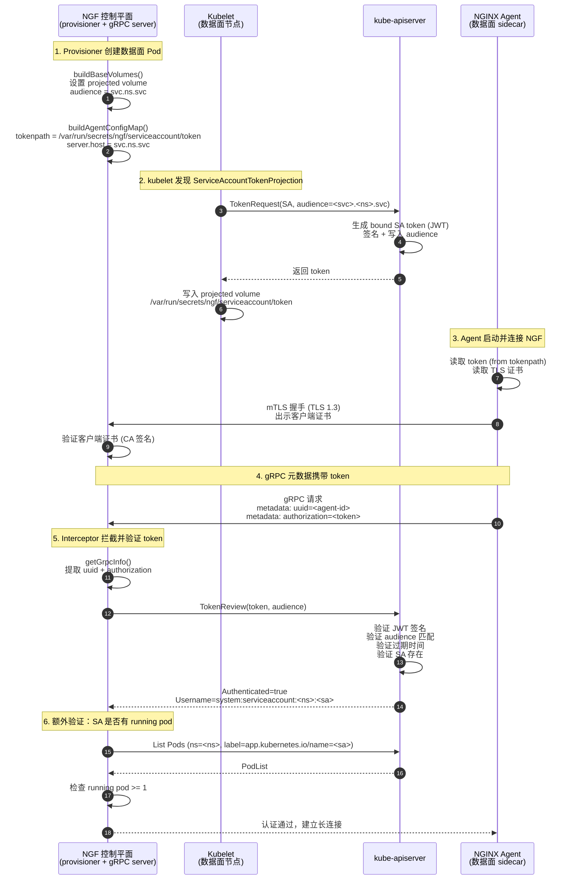

# NGF 与 Agent gRPC 通信认证机制深度分析

## 核心结论

> [!summary] 一句话结论
> NGF 与 NGINX Agent 之间的 gRPC 通信采用**双层认证**：传输层 mTLS（TLS 1.3 双向证书验证）+ 应用层 Kubernetes Bound ServiceAccount Token（通过 `TokenReview` API 经 kube-apiserver 验证）。Token 的 audience 为 NGF 控制平面 Service 的 DNS 名称 `<serviceName>.<namespace>.svc`，由 kubelet 根据 Pod spec 中的 `ServiceAccountTokenProjection` 向 kube-apiserver 申请生成。

---

## 完整认证流程



---

## 关键代码位置

| 阶段 | 文件 | 行号 | 说明 |
|------|------|------|------|
| **Audience 生成（验证侧）** | `internal/controller/manager.go` | 318-322 | NGF gRPC server 接收的 audience |
| **Audience 生成（签发侧）** | `internal/controller/provisioner/objects.go` | 1205 | 数据面 Pod 的 projected token audience |
| **gRPC Server 创建** | `internal/controller/nginx/agent/grpc/grpc.go` | 60-75 | `NewServer(tokenAudience)` 传入 audience |
| **mTLS 配置** | `internal/controller/nginx/agent/grpc/grpc.go` | 150-189 | TLS 1.3, `RequireAndVerifyClientCert` |
| **Interceptor（认证入口）** | `internal/controller/nginx/agent/grpc/interceptor/interceptor.go` | 50-82 | Stream/Unary 拦截器 |
| **提取 gRPC 元数据** | `internal/controller/nginx/agent/grpc/interceptor/interceptor.go` | 95-115 | 读取 `uuid` + `authorization` header |
| **TokenReview 验证** | `internal/controller/nginx/agent/grpc/interceptor/interceptor.go` | 117-134 | 向 kube-apiserver 发起 TokenReview |
| **Username 解析** | `internal/controller/nginx/agent/grpc/interceptor/interceptor.go` | 136-143 | 解析 `system:serviceaccount:NS:NAME` |
| **Pod 存在性验证** | `internal/controller/nginx/agent/grpc/interceptor/interceptor.go` | 145-170 | List pods by label, 检查 running |
| **Projected Volume 配置** | `internal/controller/provisioner/objects.go` | 1204-1222 | `ServiceAccountTokenProjection` |
| **数据面 SA 配置** | `internal/controller/provisioner/objects.go` | 319-335 | `AutomountServiceAccountToken: false` |
| **Volume 挂载路径** | `internal/controller/provisioner/objects.go` | 1188 | `/var/run/secrets/ngf/serviceaccount` |
| **Agent 配置模板** | `internal/controller/provisioner/templates.go` | 36-46 | `command.auth.tokenpath` + `server.host` |
| **Agent ConfigMap 构建** | `internal/controller/provisioner/objects.go` | 607-668 | `buildAgentConfigMap()` |
| **GrpcInfo 上下文** | `internal/controller/nginx/agent/grpc/context/context.go` | 8-11 | 存储 UUID + Token |

---

## 详细分析

### 1. Token 是如何生成的？

#### 1.1 数据面 Pod 的 ServiceAccount 配置

NGF Provisioner 在创建 NGINX 数据面 Pod（Deployment 或 DaemonSet）时，会创建一个专用的 ServiceAccount，并**显式禁用**默认的 SA token 自动挂载：

```go
// internal/controller/provisioner/objects.go:319-335
func (p *NginxProvisioner) buildServiceAccount(...) (*corev1.ServiceAccount, error) {
    serviceAccount := &corev1.ServiceAccount{
        ObjectMeta:                   objectMeta,
        AutomountServiceAccountToken: helpers.GetPointer(false), // ← 禁用默认 token
    }
    // ...
}
```

> [!info] 为什么禁用默认 token？
> 默认挂载的 SA token audience 是 `api://-default-`，无法用于 NGF 特定验证。NGF 需要一个 audience 绑定到 NGF 服务身份的 token，因此使用 `ProjectedVolume` 按需生成。

#### 1.2 Projected Volume with ServiceAccountTokenProjection

取而代之，NGF 使用 Kubernetes 的 **Projected Volume** 机制，通过 `ServiceAccountTokenProjection` 指定自定义 audience：

```go
// internal/controller/provisioner/objects.go:1204-1222
func (p *NginxProvisioner) buildBaseVolumes(names resourceNames) []corev1.Volume {
    tokenAudience := fmt.Sprintf("%s.%s.svc",
        p.cfg.GatewayPodConfig.ServiceName,
        p.cfg.GatewayPodConfig.Namespace,
    ) // 例如: "nginx-gateway.nginx-gateway.svc"

    return []corev1.Volume{
        {
            Name: "token",
            VolumeSource: corev1.VolumeSource{
                Projected: &corev1.ProjectedVolumeSource{
                    Sources: []corev1.VolumeProjection{
                        {
                            ServiceAccountToken: &corev1.ServiceAccountTokenProjection{
                                Path:     "token",
                                Audience: tokenAudience, // ← 自定义 audience
                            },
                        },
                    },
                },
            },
        },
        // ... 其他 volumes
    }
}
```

该 volume 挂载到数据面 Pod 的 `/var/run/secrets/ngf/serviceaccount` 路径（`objects.go:1188`），因此 token 文件实际路径为 `/var/run/secrets/ngf/serviceaccount/token`。

#### 1.3 kubelet 向 kube-apiserver 申请 Token

> [!important] 关键点：Token 的实际签发方是 kube-apiserver，kubelet 是请求方
> 
> 当数据面 Pod 调度到某节点后，该节点的 **kubelet** 会：
> 1. 解析 Pod spec 中的 `ServiceAccountTokenProjection`
> 2. 向 kube-apiserver 的 **TokenRequest API** (`/api/v1/serviceaccounts/<sa>/token`) 发起 POST 请求，携带：
>    - 目标 ServiceAccount
>    - 指定的 audience（`<serviceName>.<namespace>.svc`）
>    - 过期时间（默认 3600 秒 = 1 小时）
> 3. kube-apiserver 生成一个 **Bound ServiceAccount Token**（JWT 格式）：
>    - 用集群签名密钥（`--service-account-signing-key`）签名
>    - JWT payload 的 `aud` 字段包含指定的 audience
>    - JWT payload 的 `sub` 字段为 `system:serviceaccount:<namespace>:<name>`
>    - 绑定到该 Pod（`pod` 字段），不可跨 Pod 使用
> 4. kubelet 将 token 写入 projected volume 指定的路径
> 5. kubelet 在 token 达到 80% TTL 时自动向 kube-apiserver 重新申请并刷新文件

#### 1.4 Agent 配置：读取 Token

NGF Provisioner 通过 ConfigMap 向 NGINX Agent 注入配置（`templates.go:36-46`）：

```yaml
# internal/controller/provisioner/templates.go:36-46
command:
    server:
        host: {{ .ServiceName }}.{{ .Namespace }}.{{ .ServerTLSDomain }}  # = audience
        port: 443
    auth:
        tokenpath: /var/run/secrets/ngf/serviceaccount/token  # ← 读取 token
    tls:
        cert: /var/run/secrets/ngf/tls.crt
        key: /var/run/secrets/ngf/tls.key
        ca: /var/run/secrets/ngf/ca.crt
        server_name: {{ .ServiceName }}.{{ .Namespace }}.{{ .ServerTLSDomain }}
```

> [!tip] server.host == audience
> Agent 配置中的 `command.server.host` 与 projected token 的 `audience` 是**同一个值**（`<serviceName>.<namespace>.svc`）。这不是巧合——audience 代表的就是 NGF 控制平面 Service 的身份，Agent 正是要连接这个 Service。这确保 token 只能被 NGF 验证，不会被其他服务误用。

NGINX Agent（来自 `github.com/nginx/agent`，外部依赖）启动后：
1. 从 `tokenpath` 读取 SA token
2. 建立到 `server.host:443` 的 gRPC 连接（经过 mTLS 握手）
3. 在每个 gRPC 请求的 metadata 中携带：
   - `uuid`：Agent 的唯一标识符
   - `authorization`：读取到的 SA token

---

### 2. Token Audience 是什么？

> [!answer] Audience 格式
> ```
> <gatewayServiceName>.<gatewayNamespace>.svc
> ```
> 例如，若 NGF 控制平面 Service 名为 `nginx-gateway`，部署在 `nginx-gateway` namespace，则 audience 为：
> ```
> nginx-gateway.nginx-gateway.svc
> ```

**Audience 在两处生成，必须保持一致：**

| 位置 | 文件 | 用途 |
|------|------|------|
| 控制平面侧 | `internal/controller/manager.go:318` | 传给 gRPC server，用于 `TokenReview` 验证时指定期望 audience |
| 数据面侧 | `internal/controller/provisioner/objects.go:1205` | 写入 Pod spec 的 `ServiceAccountTokenProjection.Audience`，kubelet 据此向 apiserver 申请 token |

```go
// 两处代码完全相同：
tokenAudience := fmt.Sprintf("%s.%s.svc",
    cfg.GatewayPodConfig.ServiceName,  // NGF Service 名称
    cfg.GatewayPodConfig.Namespace,   // NGF 所在 namespace
)
```

> [!note] Audience 的语义
> Audience 是 token 的"预期接收方"。kube-apiserver 在签发 token 时将 audience 写入 JWT 的 `aud` 字段；在验证（TokenReview）时，如果请求方指定的 audience 与 JWT 中的 `aud` 不匹配，则认证失败。这确保了该 token**只能被 NGF 验证和使用**，即使其他组件截获了 token 也无法通过自己的 TokenReview（audience 不匹配）。

`ServerTLSDomain` 默认值为 `"svc"`（`cmd/gateway/commands.go:194-196`），可通过 `--server-tls-domain` flag 修改，但 audience 始终使用 `.svc` 后缀（硬编码在 `fmt.Sprintf` 中）。

---

### 3. NGF 如何验证 Agent 的 Token？

> [!answer] 通过 kube-apiserver 的 TokenReview API 验证
> NGF **不自行解析 JWT**，而是将 token 发送给 kube-apiserver 进行验证。kube-apiserver 是 token 验证的唯一权威。

#### 3.1 认证入口：gRPC Interceptor

NGF gRPC Server 在创建时注册了 Stream 和 Unary 拦截器（`grpc.go:128-129`）：

```go
// internal/controller/nginx/agent/grpc/grpc.go:114-137
server := grpc.NewServer(
    // ...
    grpc.ChainStreamInterceptor(g.interceptor.Stream(g.logger)),   // ← Stream 拦截
    grpc.ChainUnaryInterceptor(g.interceptor.Unary(g.logger)),    // ← Unary 拦截
    grpc.Creds(tlsCredentials),                                    // ← mTLS 传输层
    // ...
)
```

每个 gRPC 请求（无论是 Stream 还是 Unary）都会先经过 `validateConnection`：

```go
// internal/controller/nginx/agent/grpc/interceptor/interceptor.go:86-93
func (c ContextSetter) validateConnection(ctx context.Context) (context.Context, error) {
    grpcInfo, err := getGrpcInfo(ctx)  // 从 metadata 提取 uuid + authorization
    if err != nil {
        return nil, err
    }
    return c.validateToken(ctx, grpcInfo)  // 发起 TokenReview
}
```

#### 3.2 提取 gRPC 元数据

```go
// internal/controller/nginx/agent/grpc/interceptor/interceptor.go:95-115
func getGrpcInfo(ctx context.Context) (*grpcContext.GrpcInfo, error) {
    md, ok := metadata.FromIncomingContext(ctx)
    if !ok {
        return nil, status.Error(codes.InvalidArgument, "no metadata")
    }

    id := md.Get(headerUUID)         // "uuid" header
    if len(id) == 0 {
        return nil, status.Error(codes.Unauthenticated, "no identity")
    }

    auths := md.Get(headerAuth)      // "authorization" header
    if len(auths) == 0 {
        return nil, status.Error(codes.Unauthenticated, "no authorization")
    }

    return &grpcContext.GrpcInfo{
        UUID:  id[0],    // Agent 标识符
        Token: auths[0], // SA token
    }, nil
}
```

> [!info] gRPC Metadata Header
> - `uuid`：Agent 自生成的唯一 ID，用于在 `ConnectionsTracker` 中跟踪连接
> - `authorization`：SA token 字符串（从 `/var/run/secrets/ngf/serviceaccount/token` 读取）

#### 3.3 TokenReview：通过 kube-apiserver 验证

```go
// internal/controller/nginx/agent/grpc/interceptor/interceptor.go:117-134
func (c ContextSetter) validateToken(ctx context.Context, grpcInfo *grpcContext.GrpcInfo) (context.Context, error) {
    tokenReview := &authv1.TokenReview{
        Spec: authv1.TokenReviewSpec{
            Audiences: []string{c.audience},  // ← 期望的 audience
            Token:     grpcInfo.Token,        // ← Agent 发来的 token
        },
    }

    createCtx, createCancel := context.WithTimeout(ctx, 30*time.Second)
    defer createCancel()

    // 向 kube-apiserver 发起 TokenReview 请求
    if err := c.k8sClient.Create(createCtx, tokenReview); err != nil {
        return nil, status.Error(codes.Internal, fmt.Sprintf("error creating TokenReview: %v", err))
    }

    // 检查 kube-apiserver 返回的认证结果
    if !tokenReview.Status.Authenticated {
        return nil, status.Error(codes.Unauthenticated,
            fmt.Sprintf("invalid authorization: %s", tokenReview.Status.Error))
    }
    // ... 继续额外验证
}
```

> [!important] kube-apiserver 在 TokenReview 中做了什么？
> 1. **验证 JWT 签名**：用集群 `--service-account-signing-key` 验证
> 2. **验证 audience**：JWT 中的 `aud` 必须包含请求方指定的 `c.audience`
> 3. **验证过期时间**：检查 `exp` 字段
> 4. **验证 ServiceAccount 存在**：检查 `sub` 对应的 SA 是否存在
> 5. **验证 Pod 绑定**（bound token）：检查 token 是否绑定到有效 Pod
> 6. 返回 `Status.Authenticated` + `Status.User.Username`（格式：`system:serviceaccount:<ns>:<sa>`）

#### 3.4 额外验证：ServiceAccount 关联的 Pod 必须在运行

通过 TokenReview 后，NGF 还做了一层额外检查——确认该 ServiceAccount 确实有正在运行的 Pod：

```go
// internal/controller/nginx/agent/grpc/interceptor/interceptor.go:136-170
usernameItems := strings.Split(tokenReview.Status.User.Username, ":")
// 期望格式: system:serviceaccount:<namespace>:<sa-name>
if len(usernameItems) != 4 || usernameItems[0] != "system" || usernameItems[1] != "serviceaccount" {
    return nil, status.Error(codes.Unauthenticated, "token username format invalid")
}

var podList corev1.PodList
opts := &client.ListOptions{
    Namespace: usernameItems[2],  // namespace
    LabelSelector: labels.Set(map[string]string{
        controller.AppNameLabel: usernameItems[3],  // "app.kubernetes.io/name" = sa-name
    }).AsSelector(),
}

if err := c.k8sClient.List(getCtx, &podList, opts); err != nil {
    return nil, status.Error(codes.Internal, ...)
}

runningCount := 0
for _, pod := range podList.Items {
    if pod.Status.Phase == corev1.PodRunning {
        runningCount++
    }
}

if runningCount < 1 {
    return nil, status.Error(codes.Unauthenticated, "no running pods found for service account")
}
```

> [!warning] 为什么需要这层额外检查？
> Bound SA token 即使在 Pod 删除后仍可能未过期（TTL 默认 1 小时）。NGF 通过 List Pods 确认该 SA 当前确有运行中的 Pod，防止已删除 Pod 的 token 被复用。这依赖于 NGF Provisioner 在创建数据面 Pod 时为其打上 `app.kubernetes.io/name: <resourceName>` 标签（`objects.go:295`），且该标签值与 ServiceAccount 名称相同（`objects.go` 中 `buildServiceAccount` 与 Pod 共用同一 `objectMeta`）。

#### 3.5 验证通过后的上下文注入

全部验证通过后，`GrpcInfo`（UUID + Token）被注入到 gRPC 上下文中，供后续的 `CommandService` 和 `FileService` 使用：

```go
// internal/controller/nginx/agent/grpc/interceptor/interceptor.go:172
return grpcContext.NewGrpcContext(ctx, *grpcInfo), nil
```

后续 `commandService.Subscribe`（`command.go:130`）和 `CreateConnection`（`command.go:72`）通过 `grpcContext.FromContext(ctx)` 取出 `grpcInfo.UUID`，用于跟踪 Agent 连接。

---

### 4. 传输层安全：mTLS

> [!note] 双层认证架构
> NGF 的 gRPC 通信安全是**传输层 + 应用层**双层叠加：
> - **传输层（mTLS）**：双向证书验证，确保通信通道可信
> - **应用层（SA Token）**：身份认证 + 授权，确保调用方是预期的 NGINX Agent

#### mTLS 配置

```go
// internal/controller/nginx/agent/grpc/grpc.go:159-188
tlsConfig := &tls.Config{
    GetConfigForClient: buildConfigForClient(caPath, certPath, keyPath),
    MinVersion:         tls.VersionTLS13,  // ← 强制 TLS 1.3
}

// 每个连接动态读取证书（支持证书轮转）
return &tls.Config{
    GetCertificate: func(...) (*tls.Certificate, error) {
        serverCert, err := tls.LoadX509KeyPair(certPath, keyPath)
        // ...
    },
    ClientAuth: tls.RequireAndVerifyClientCert,  // ← 强制验证客户端证书
    ClientCAs:  certPool,                         // ← 信任的 CA
    MinVersion: tls.VersionTLS13,
}
```

TLS 证书路径：
- CA 证书：`/var/run/secrets/ngf/ca.crt`
- Server 证书：`/var/run/secrets/ngf/tls.crt`
- Server 私钥：`/var/run/secrets/ngf/tls.key`

Agent 侧同样配置了客户端证书（`templates.go:43-45`），在 mTLS 握手时出示。

> [!tip] 证书动态轮转
> `GetConfigForClient` 在每个新连接时从磁盘重新读取证书，配合 `filewatcher`（`grpc.go:96-102`）监控 TLS 文件变化，实现证书轮转时无需重启 NGF。

---

## 设计原因

### 为什么用 Bound SA Token 而不是静态 Token / 证书？

> [!faq]- 为什么不用静态 Secret 中的 token？
> 静态 token 不会过期，泄露后需手动轮转；Bound SA token 有 TTL（默认 1 小时），kubelet 自动刷新，泄露窗口小。

> [!faq]- 为什么不用 mTLS 客户端证书作为唯一认证？
> mTLS 证书的撤销（CRL/OCSP）在 Kubernetes 生态中支持有限；SA Token 通过 TokenReview 可由 kube-apiserver 实时校验 SA 是否被删除、Pod 是否存在。双层叠加提供了纵深防御。

> [!faq]- 为什么 Audience 设为 Service DNS 名称？
> 1. **身份绑定**：audience 就是 NGF 控制平面的网络身份（Service DNS），语义清晰
> 2. **天然防跨服务误用**：其他组件做 TokenReview 时指定的 audience 不同，无法验证此 token
> 3. **与 Agent 配置一致**：Agent 连接的 `server.host` 就是这个 DNS 名，无需额外配置

> [!faq]- 为什么 NGF 要额外做 "running pod" 检查？
> Bound SA token 的 TTL（1 小时）可能长于 Pod 生命周期。Pod 被删除后，其 token 在 TTL 内仍可通过 kube-apiserver 的 TokenReview（因为 SA 可能还在）。NGF 通过 List Pods 确保 token 来自一个**当前运行中**的 Pod，缩小攻击窗口。

---

## 总结

| 角色 | 职责 |
|------|------|
| **NGF Provisioner** | 创建数据面 Pod spec：禁用默认 SA token，配置 `ServiceAccountTokenProjection`（指定 audience），生成 Agent ConfigMap（配置 tokenpath + server host + TLS） |
| **kubelet** | 解析 Pod spec 中的 `ServiceAccountTokenProjection`，向 kube-apiserver 的 TokenRequest API 申请 bound SA token，写入 projected volume，定期刷新 |
| **kube-apiserver** | 签发 bound SA token（JWT，含 audience，集群密钥签名）；响应 NGF 的 TokenReview 请求，验证 token 签名/audience/过期/SA 存在性 |
| **NGINX Agent** | 从 `tokenpath` 读取 token，在 gRPC 请求的 `authorization` metadata header 中发送；同时发送 `uuid` header 作为 Agent 标识；出示 mTLS 客户端证书 |
| **NGF gRPC Server** | 1) mTLS 握手验证客户端证书；2) Interceptor 提取 `uuid`+`authorization`；3) 发起 TokenReview 给 kube-apiserver；4) 解析 username，List pods 验证 running pod 存在；5) 注入 GrpcInfo 到上下文 |

> [!quote] 一句话总结
> Agent 拿到的 token **是 kubelet 根据 Pod spec 中的 `ServiceAccountTokenProjection` 向 kube-apiserver 申请的 bound SA token**，audience 为 NGF Service 的 DNS 名。NGF 收到 token 后**通过 kube-apiserver 的 TokenReview API 验证**（不自行解析 JWT），并额外检查 SA 关联的 Pod 是否在运行。整个链路不涉及任何静态密钥，实现了短期、自动轮转、绑定 Pod 的安全认证。

---

## 相关文档

- [[ngf-grpc-control-plane-analysis]] - NGF gRPC 控制平面分析
- [[ngf-control-plane-architecture-obsidian]] - NGF 控制平面架构
- [[ngf-pod-startup-analysis]] - NGF Pod 启动流程分析

## 参考代码版本

- Repository: `nginx/nginx-gateway-fabric`
- Version: v2.6.5 / edge (main branch)
- NGINX Agent: v3.11.1
