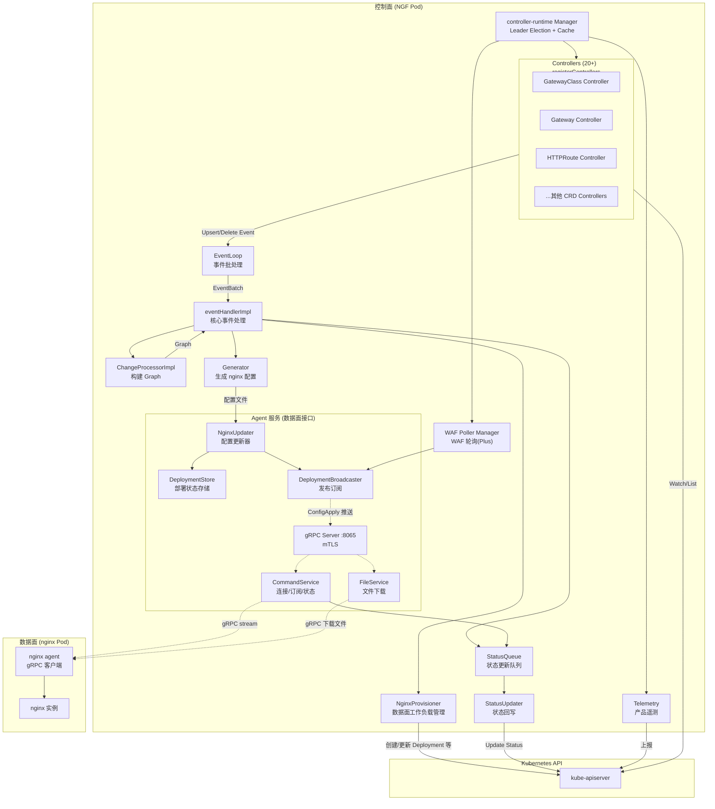
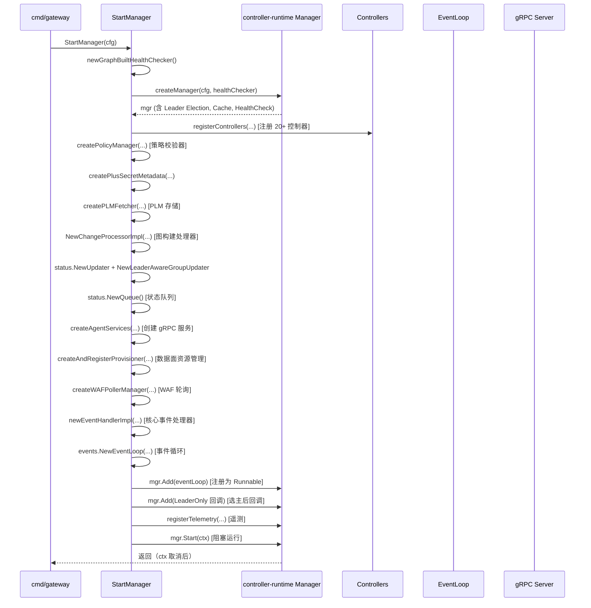
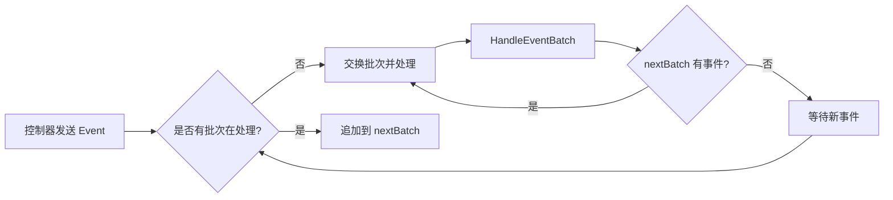
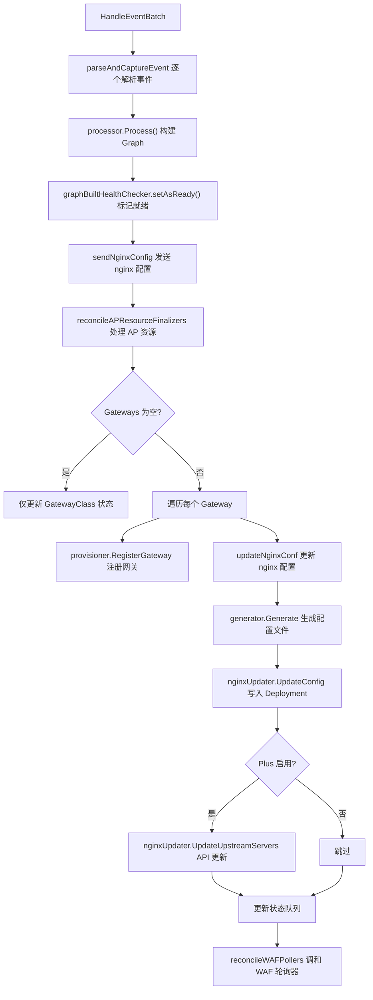
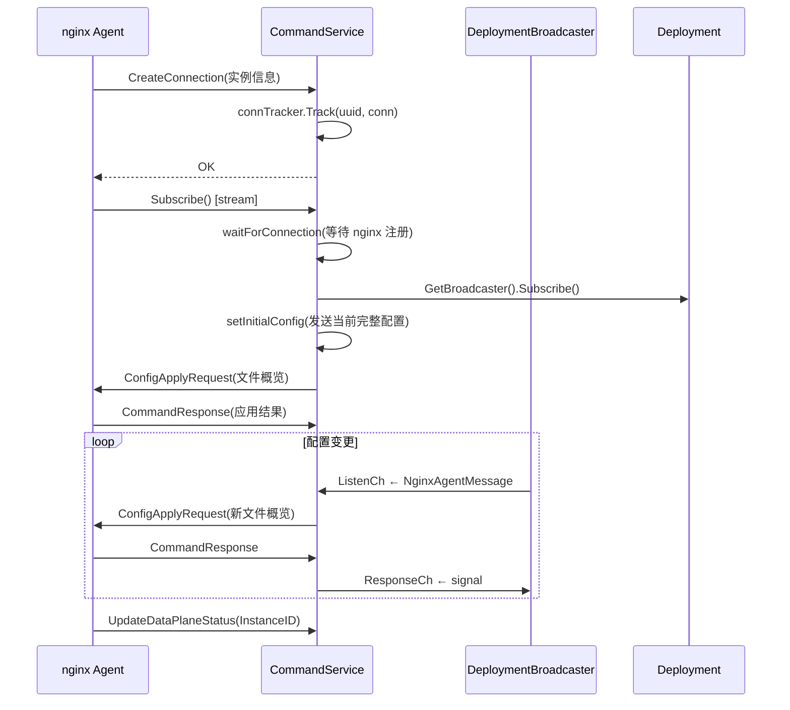
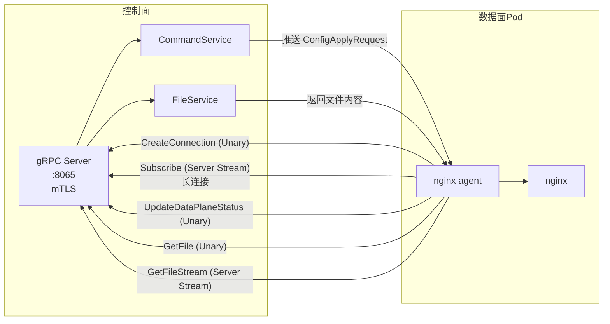
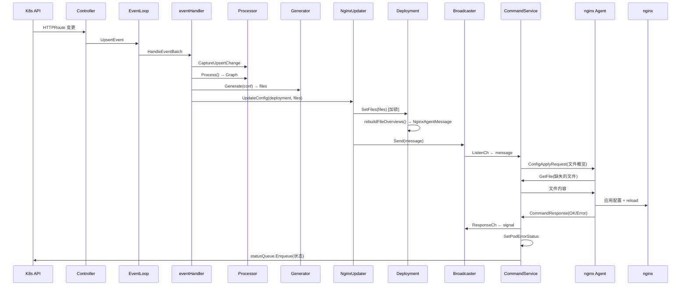

---
tags:
  - nginx-gateway-fabric
  - kubernetes
  - gateway-api
  - control-plane
  - architecture
  - obsidian
aliases:
  - NGF Control Plane
  - NGF 控制面
created: 2026-06-25
---

# NGF 控制面架构分析

> [!info] 文档定位
> 本文从 `internal/controller/manager.go:126` 的 `StartManager` 函数入手，梳理 NGF（NGINX Gateway Fabric）控制面启动后的运行架构、各模块职责与通信机制。
> 适合理解控制面整体脉络，不深入每个函数的细枝末节。

## 核心结论

NGF 控制面是一个基于 **controller-runtime** 的 Kubernetes 控制器，它：
1. **监听** 集群中的 Gateway API 资源（GatewayClass、Gateway、HTTPRoute 等）及 NGF 自定义资源
2. **构建图（Graph）** 表示期望的网关配置状态
3. **生成 NGINX 配置文件** 并通过 **gRPC 推送** 给数据面 Pod 中的 nginx agent
4. **管理 NGINX 数据面工作负载**（Deployment/DaemonSet、Service、ConfigMap 等）的生命周期
5. **回写状态** 到 Kubernetes 资源的 status 字段

数据面 agent 通过 **gRPC mTLS 长连接** 访问控制面的两个服务：`CommandService`（命令订阅）和 `FileService`（文件下载）。

---

## 整体架构图



---

## StartManager 启动流程

> [!note] 入口位置
> `internal/controller/manager.go:126` — `func StartManager(cfg config.Config) error`

### 启动步骤序列



### 关键启动组件

| 序号 | 组件 | 代码位置 | 职责 |
|------|------|----------|------|
| 1 | `createManager` | `manager.go:509` | 创建 controller-runtime Manager，配置 Leader Election、Cache、HealthCheck |
| 2 | `registerControllers` | `manager.go:789` | 注册所有 K8s/Gateway API 控制器 |
| 3 | `createPolicyManager` | `manager.go:467` | 创建 NGF 策略校验器（ClientSettings、Observability 等） |
| 4 | `NewChangeProcessorImpl` | `state/change_processor.go:115` | 图构建处理器 |
| 5 | `status.NewUpdater` | `status/updater.go:60` | K8s 状态回写器 |
| 6 | `status.NewQueue` | `status/queue.go:49` | 状态更新异步队列 |
| 7 | `createAgentServices` | `manager.go:304` | **数据面 gRPC 服务**（agent 通信接口） |
| 8 | `createAndRegisterProvisioner` | `manager.go:344` | 数据面工作负载管理器 |
| 9 | `createWAFPollerManager` | `manager.go:393` | WAF 策略轮询（仅 Plus） |
| 10 | `newEventHandlerImpl` | `handler.go` | 核心事件处理器 |
| 11 | `events.NewEventLoop` | `events/loop.go:43` | 事件循环 |
| 12 | `registerTelemetry` | `manager.go:430` | 产品遥测 |

---

## 模块详解

### 1. controller-runtime Manager

> [!important] 基础运行时
> 所有控制器、gRPC 服务、事件循环都作为 Manager 的 **Runnable** 注册，由 Manager 统一管理生命周期和 Leader Election。

**位置**: `manager.go:509` — `createManager`

**核心配置**:
- **Leader Election**: 启用，锁名 `cfg.LeaderElection.LockName`，在 Gateway Pod 所在 namespace
- **Cache**: 通过 `buildManagerCache(cfg)` 配置，只缓存关心的资源
- **HealthCheck**: `readyz` 检查由 `graphBuiltHealthChecker` 提供（首次 Graph 构建完成后才 Ready）
- **Pod IP Indexer**: 为 Pod 的 `status.podIP` 添加索引，用于验证 agent 连接来源

**关键设计**:
```go
Controller: ctrlcfg.Controller{
    NeedLeaderElection: helpers.GetPointer(false), // 所有控制器非 Leader-only
}
```
> [!warning] 设计要点
> 控制器设置为 **非 Leader-only**，意味着所有 Pod（包括非 Leader）都会运行控制器并缓存资源。只有特定的 Runnable（如 EventLoop、Provisioner）才需要 Leader 身份。

---

### 2. Controllers（控制器注册）

**位置**: `manager.go:789` — `registerControllers`

注册的控制器列表（约 20+ 个）：

| 资源类型 | 用途 | 谓词（Predicate） |
|----------|------|-------------------|
| `GatewayClass` | 网关类 | GenerationChanged + GatewayClassPredicate（按 controllerName 过滤） |
| `Gateway` | 网关实例 | GenerationChanged |
| `HTTPRoute` | HTTP 路由 | GenerationChanged |
| `GRPCRoute` | gRPC 路由 | GenerationChanged |
| `TLSRoute` | TLS 路由（条件注册） | GenerationChanged |
| `ReferenceGrant` | 跨命名空间引用授权 | GenerationChanged |
| `BackendTLSPolicy` | 后端 TLS 策略（条件注册） | GenerationChanged |
| `ListenerSet` | 监听器集合（条件注册） | GenerationChanged |
| `Service` (user-service) | 用户服务 | ServiceChangedPredicate |
| `Secret` | 密钥 | ResourceVersionChanged |
| `EndpointSlice` | 端点切片 | GenerationChanged + FieldIndices |
| `Namespace` | 命名空间 | LabelChanged |
| `ConfigMap` | 配置地图 | - |
| `NginxProxy` | NGF NginxProxy 配置 | GenerationChanged |
| `ClientSettingsPolicy` | 客户端设置策略 | GenerationChanged |
| `ObservabilityPolicy` | 可观测性策略 | GenerationChanged |
| `ProxySettingsPolicy` | 代理设置策略 | GenerationChanged |
| `UpstreamSettingsPolicy` | 上游设置策略 | GenerationChanged |
| `RateLimitPolicy` | 限速策略 | GenerationChanged |
| `WAFPolicy` | WAF 策略 | GenerationChanged |
| `AuthenticationFilter` | 认证过滤器 | GenerationChanged |
| `CRD` (metadata only) | CRD 元数据 | AnnotationPredicate(BundleVersion) |
| `NginxGateway` | 控制面配置 | 按资源名过滤 + GenerationChanged |

> [!tip] 条件注册
> `BackendTLSPolicy`、`TLSRoute`、`ListenerSet` 通过 `requireCRDCheck: true` 标记，只在对应 CRD 存在时注册。`ReferenceGrant` 若 v1 不存在则回退到 v1beta1。

**控制器工作原理**（`framework/controller/reconciler.go:84`）:
```
K8s Event → controller-runtime → Reconciler.Reconcile() → Getter.Get() → 
  存在: 发送 UpsertEvent 到 eventCh
  不存在: 发送 DeleteEvent 到 eventCh
```

每个 Reconciler 很轻量：只负责将资源变更转换为 `UpsertEvent` 或 `DeleteEvent`，发送到共享的 `eventCh` 通道，由 EventLoop 统一处理。

---

### 3. EventLoop（事件循环）

**位置**: `internal/framework/events/loop.go:25`

**核心机制**:
- **双缓冲批处理**（Double Buffering）: `currentBatch` 和 `nextBatch` 交替使用
- **首次批处理**: `FirstEventBatchPreparer` 从 Cache 中读取所有相关资源，构造完整的初始事件批
- **批处理目的**: 减少 NGINX reload 次数（reload 至少 200ms，且有副作用）

**工作流程**:


> [!note] 为什么需要首次批处理？
> 确保首次生成 NGINX 配置时基于完整的集群视图，避免客户端看到瞬态 404 错误。

---

### 4. eventHandlerImpl（核心事件处理器）

**位置**: `internal/controller/handler.go:189` — `HandleEventBatch`

这是控制面的**核心大脑**，处理流程：



**事件解析**（`parseAndCaptureEvent`）:
- `UpsertEvent`: 调用 `processor.CaptureUpsertChange(resource)`
- `DeleteEvent`: 调用 `processor.CaptureDeleteChange(type, nsname)`
- `WAFBundleReconcileEvent`: WAF bundle 可用时触发重建（`processor.ForceRebuild()`）

**Leader 感知**:
- `enable(ctx)`: Pod 成为 Leader 时调用，重新发送最新 Graph 的 nginx 配置
- 通过 `leaderLock` 保护 `leader` 标志

---

### 5. ChangeProcessorImpl（图构建处理器）

**位置**: `internal/controller/state/change_processor.go:98`

**职责**: 维护集群状态（`ClusterState`），当有变更时构建 `graph.Graph`（期望的网关配置）。

**ClusterState 维护的资源**:
```
GatewayClasses, Gateways, HTTPRoutes, Services, Namespaces,
ReferenceGrants, Secrets, CRDMetadata, BackendTLSPolicies, ConfigMaps,
NginxProxies, GRPCRoutes, TLSRoutes, TCPRoutes, UDRoutes,
NGFPolicies, SnippetsFilters, AuthenticationFilters,
InferencePools, ListenerSets, APPolicies, APLogConfs
```

**工作模式**:
1. `CaptureUpsertChange(obj)` / `CaptureDeleteChange(type, nsname)`: 记录变更到 clusterState
2. `Process(ctx)`: 若有变更，调用 `BuildGraph()` 重建 Graph；无变更返回 nil

> [!info] 变更追踪
> 使用 `changeTrackingUpdater` 按资源类型配置谓词（predicate），只在真正影响配置的变更时标记为"changed"。例如 Service 只在被 Graph 引用时才触发重建。

---

### 6. NGINX 配置生成（Generator）

**位置**: `internal/controller/nginx/config/`

**职责**: 将 `dataplane.Configuration`（Graph 的数据面视图）转换为 NGINX 配置文件。

**调用链**:
```
eventHandler.updateNginxConf() 
  → generator.Generate(conf) → 生成 []File（文件名+内容）
  → nginxUpdater.UpdateConfig(deployment, files, volumeMounts)
```

**策略生成器**（Policy Generator）:
- `CompositeGenerator` 聚合所有策略生成器
- 支持的生成上下文：`GenerateForMain`、`GenerateForHTTP`、`GenerateForServer`、`GenerateForLocation`、`GenerateForInternalLocation`
- 策略类型：`ClientSettings`、`Observability`、`ProxySettings`、`UpstreamSettings`、`RateLimit`、`WAF`、`Snippets`

---

### 7. Agent gRPC 服务（数据面通信接口）⭐

> [!important] 数据面访问入口
> 这是数据面 nginx agent **唯一访问控制面的接口**。通过 mTLS gRPC 通信。

**位置**: `manager.go:304` — `createAgentServices` → `internal/controller/nginx/agent/grpc/grpc.go`

#### 7.1 gRPC Server

**位置**: `internal/controller/nginx/agent/grpc/grpc.go:60` — `NewServer`

**配置**:
- **端口**: `grpcServerPort`（默认见配置）
- **mTLS**: TLS 1.3，证书路径 `/var/run/secrets/ngf/{ca.crt, tls.crt, tls.key}`
- **动态重载**: `buildTLSCredentials` 在每个新连接时从磁盘重新读取证书（支持证书轮转）
- **Keepalive**: 15s time, 10s timeout
- **消息大小**: 4MB
- **拦截器**: `interceptor.NewContextSetter` — 从 mTLS 客户端证书中提取 Pod 身份信息

**FileWatcher**（`grpc/filewatcher/filewatcher.go`）:
- 监控 TLS 证书文件变更
- 变更时通过 `resetConnChan` 通知 CommandService 断开所有连接，强制 agent 重连（使用新证书）

#### 7.2 CommandService

**位置**: `internal/controller/nginx/agent/command.go:35`

**gRPC 方法**:

| 方法 | 类型 | 用途 |
|------|------|------|
| `CreateConnection` | Unary | Agent 注册：建立连接，记录 Pod 身份 |
| `Subscribe` | Server Stream | **核心方法**：Agent 订阅配置更新，长连接 |
| `UpdateDataPlaneStatus` | Unary | Agent 上报 nginx InstanceID |

**Subscribe 工作流**（`command.go:130`）:


**关键锁机制**:
> [!warning] FileLock 事务保护
> `deployment.FileLock.RLock()` 在 `Subscribe` 和 `setInitialConfig` 期间持有，防止：
> 1. 新 agent 获取旧配置的同时，event handler 推送新配置
> 2. 配置漂移（config drift）
> 整个 ConfigApply 事务（从广播到收到 agent 响应）都在锁保护下进行。

#### 7.3 FileService

**位置**: `internal/controller/nginx/agent/file.go`

**gRPC 方法**:

| 方法 | 类型 | 用途 |
|------|------|------|
| `GetFile` | Unary | 下载单个配置文件内容 |
| `GetFileStream` | Server Stream | 流式下载文件（大文件分块） |

**工作原理**:
- Agent 收到 `ConfigApplyRequest` 中的文件概览（文件名+hash）
- 对比本地已有文件，对 hash 不匹配的文件调用 `GetFile`/`GetFileStream` 下载最新内容
- 文件内容存储在 `Deployment.files` 中，通过 `Deployment.GetFile(name, hash)` 获取

#### 7.4 NginxUpdater

**位置**: `internal/controller/nginx/agent/agent.go`

**职责**: 协调配置更新，作为 eventHandler 和 gRPC 服务之间的桥梁。

**核心方法**:
- `UpdateConfig(deployment, files, volumeMounts)`: 更新 Deployment 的文件，通过 Broadcaster 广播
- `UpdateUpstreamServers(deployment, conf)`: 更新上游服务器（NGINX Plus API）

#### 7.5 DeploymentStore 与 Deployment

**位置**: `internal/controller/nginx/agent/deployment.go`

**DeploymentStore**: `sync.Map` 维护所有 nginx Deployment 的状态

**Deployment** 结构（每个 nginx Deployment 对应一个）:
```go
type Deployment struct {
    podStatuses    map[string]error      // 每个 Pod 的配置应用状态
    broadcaster    broadcast.Broadcaster  // 配置广播器
    gatewayName    string                 // 关联的 Gateway 名
    imageVersion   string                 // nginx 镜像版本
    configVersion  string                 // 当前配置版本（hash）
    files          []File                 // 当前配置文件
    fileOverviews  []*pb.File             // 文件概览（含 hash）
    nginxPlusActions []*pb.NGINXPlusAction // Plus API 操作
    FileLock       sync.RWMutex           // 文件读写锁
}
```

#### 7.6 DeploymentBroadcaster（发布订阅）

**位置**: `internal/controller/nginx/agent/broadcast/broadcast.go:48`

**机制**: 每个 Deployment 有一个 Broadcaster，支持多个 agent 订阅。

**通信模型**:
```
eventHandler → broadcaster.Send(NginxAgentMessage) → 
  并行发送到所有订阅者的 ListenCh → 
  等待所有订阅者通过 ResponseCh 回复 → 返回
```

**NginxAgentMessage 类型**:
- `ConfigApplyRequest`: 配置文件更新（含文件概览和版本号）
- `APIRequest`: NGINX Plus API 操作（如上游服务器更新）

---

### 8. NginxProvisioner（数据面工作负载管理）

**位置**: `internal/controller/provisioner/provisioner.go:74`

**职责**: 为每个 Gateway 创建和管理 NGINX 数据面工作负载。

**管理的资源**:
- Deployment / DaemonSet（nginx 容器）
- Service（数据面服务暴露）
- ServiceAccount / Role / RoleBinding（RBAC）
- ConfigMap（nginx 引导配置、agent 配置）
- Secret（Agent TLS、Plus JWT、Plus CA、Plus Client SSL、Docker registry、Dataplane key）
- HorizontalPodAutoscaler
- PodDisruptionBudget

**工作流程**:
1. **注册网关** (`RegisterGateway`): eventHandler 在处理 Graph 时调用，将 Gateway 配置写入 store
2. **事件监听**: Provisioner 有自己的 EventLoop，监听其管理的资源变更
3. **调和**: 当用户直接修改数据面资源时，检测并恢复到期望状态
4. **垃圾回收**: Gateway 删除时，清理关联的 nginx 资源

**Leader 感知**:
- 非 Leader 时：记录待删除资源到 `resourcesToDeleteOnStartup`
- 成为 Leader 时（`Enable`）：处理待删除资源

**标签选择器**:
```go
MatchLabels: {
    "app.kubernetes.io/instance": <GatewayPodConfig.InstanceName>,
    "app.kubernetes.io/managed-by": <nginx-resource-name>,
}
```
通过标签关联 nginx 资源与 Gateway 实例。

---

### 9. StatusUpdater（状态回写）

**位置**: `internal/controller/status/updater.go:52`

**职责**: 将 Gateway、HTTPRoute、GatewayClass 等资源的 status 字段更新到 K8s。

**架构**:
```
StatusQueue (异步队列) → Updater (带重试) → K8s API Status.Update
```

**LeaderAwareGroupUpdater**（`status/leader_aware_group_updater.go`）:
- 非 Leader 时：暂存状态更新请求
- 成为 Leader 时：批量刷新暂存的请求
- 之后：立即处理

**重试策略**: 指数退避（200ms 起，2x 倍率，4 步，上限 3s），处理 K8s API 冲突。

**QueueObject 类型**（`status/queue.go`）:
- `UpdateAll`: 更新所有 Gateway API 资源状态
- `UpdateGateway`: 仅更新 Gateway 状态（如 Service 变更）
- 含 `Error`（配置应用错误）和 `NginxConfigPushed` 标志

---

### 10. Telemetry（产品遥测）

**位置**: `manager.go:430` — `registerTelemetry`

**职责**: 定期上报 NGF 使用数据到 NGINX。

**数据收集**（`DataCollectorImpl`）:
- K8s 集群信息（通过 APIReader）
- Graph 信息（通过 `processor.GetLatestGraph()`）
- 配置信息（通过 `eventHandler` 作为 `ConfigurationGetter`）
- Pod 信息、版本、镜像来源、启动参数

**调度**: 通过 `CronJob` Runnable 周期性运行，等待 `healthChecker.getReadyCh()` 后启动。

---

### 11. WAF Poller Manager（WAF 轮询）

**位置**: `manager.go:393` — `createWAFPollerManager`

> [!note] 仅 NGINX Plus 启用
> `if !cfg.Plus { return nil }`

**职责**: 定期从外部源（HTTP/NIM/N1C）轮询 WAF 策略 bundle，更新到 Deployment。

**工作流**:
1. 为每个 WAF Policy 创建 poller
2. 定期 fetch bundle
3. bundle 变更时：更新 `Deployment.UpdateWAFBundle()` → 触发 broadcaster 广播
4. 同时发送事件到 `eventCh`，触发 Graph 重建

---

## 数据面 Agent 通信详解

> [!important] 核心问题解答
> **数据面 agent 访问控制面的哪些服务？**

### 通信架构



### 通信协议细节

| 维度 | 说明 |
|------|------|
| **协议** | gRPC over mTLS (TLS 1.3) |
| **端口** | `grpcServerPort`（需在控制面 Service 中暴露） |
| **证书** | CA/Cert/Key 挂载在 `/var/run/secrets/ngf/` |
| **认证** | 客户端证书 → 提取 Pod 身份 → `connTracker.Track()` |
| **消息大小** | 4MB（发送和接收） |
| **Keepalive** | 15s time, 10s timeout, PermitWithoutStream=true |
| **重连** | TLS 证书变更 → FileWatcher → `resetConnChan` → 断开 → Agent 重连 |

### 配置下发完整流程



---

## Leader Election 与 Runnable 类型

### Manager Runnable 注册

| Runnable | 类型 | Leader 要求 | 说明 |
|----------|------|-------------|------|
| EventLoop (主) | `LeaderOrNonLeader` | 非 Leader 也能运行 | 核心 Gateway API 事件处理 |
| EventLoop (Provisioner) | `LeaderOrNonLeader` | 非 Leader 也能运行 | 数据面资源事件处理 |
| gRPC Server | `LeaderOrNonLeader` | 非 Leader 也能运行 | agent 通信，所有 Pod 都需服务 |
| Telemetry Job | `CronJob` | 默认 Leader-only | 产品遥测上报 |
| `CallFunctionsAfterBecameLeader` | Leader-only | 仅 Leader | 选主后回调 |

### 选主后回调（`CallFunctionsAfterBecameLeader`）

```go
[]func(context.Context){
    groupStatusUpdater.Enable,   // 启用状态回写
    nginxProvisioner.Enable,     // 启用资源管理
    eventHandler.enable,         // 重新发送最新配置
}
```

> [!warning] 设计权衡
> `LeaderElectionReleaseOnCancel: false` — Manager 优雅停止时会等待所有 Runnable（包括 Leader-only）完成，避免新 Leader 在旧 Leader 未完成时启动相同 Runnable 的竞态。

---

## 模块职责总结

| 模块 | 包路径 | 职责 | 数据面访问 |
|------|--------|------|------------|
| **Manager** | `internal/controller` | controller-runtime 运行时，Leader Election | - |
| **Controllers** | `internal/framework/controller` | 监听 K8s 资源变更，转为 Event | - |
| **EventLoop** | `internal/framework/events` | 事件批处理循环 | - |
| **eventHandler** | `internal/controller` | 核心事件处理，协调各模块 | - |
| **ChangeProcessor** | `internal/controller/state` | 维护集群状态，构建 Graph | - |
| **Generator** | `internal/controller/nginx/config` | 生成 NGINX 配置文件 | - |
| **gRPC Server** | `internal/controller/nginx/agent/grpc` | **数据面通信服务** | ✅ **agent 访问** |
| **CommandService** | `internal/controller/nginx/agent` | **连接管理、配置订阅** | ✅ **agent 访问** |
| **FileService** | `internal/controller/nginx/agent` | **配置文件下载** | ✅ **agent 访问** |
| **NginxUpdater** | `internal/controller/nginx/agent` | 配置更新协调器 | - |
| **DeploymentStore** | `internal/controller/nginx/agent` | nginx Deployment 状态存储 | - |
| **Broadcaster** | `internal/controller/nginx/agent/broadcast` | 配置变更发布订阅 | - |
| **Provisioner** | `internal/controller/provisioner` | 数据面工作负载生命周期管理 | - |
| **StatusUpdater** | `internal/controller/status` | K8s 资源 status 回写 | - |
| **Telemetry** | `internal/controller/telemetry` | 产品遥测上报 | - |
| **WAF Poller** | `internal/framework/waf/poller` | WAF bundle 轮询 | - |

---

## 关键设计决策

### 为什么用 gRPC 而不是 ConfigMap 挂载？

**约束**: NGINX 配置需要原子性更新、版本追踪、应用结果反馈。
**选择**: gRPC 提供双向通信，支持：
1. 配置版本号（hash）对比，只传输变更文件
2. 实时反馈配置应用结果（成功/失败）
3. 长连接订阅模式，减少轮询开销
4. mTLS 提供身份认证

### 为什么每个 Deployment 一个 Broadcaster？

**约束**: 不同 Gateway 对应不同 nginx Deployment，配置独立。
**选择**: 每个 Deployment 独立 Broadcaster，支持：
1. 隔离不同 Gateway 的配置推送
2. 并行推送，减少延迟
3. 单个 Deployment 的 agent 重连不影响其他

### 为什么状态回写用异步队列？

**约束**: K8s API 可能慢或超时，同步回写会阻塞事件循环。
**选择**: `StatusQueue` 异步处理，`LeaderAwareGroupUpdater` 在非 Leader 时暂存，选主后批量刷新。

---

## 相关文档

- [[ngf-pod-startup-analysis-obsidian|NGF Pod 启动分析]]
- [[ngf-latest-release-deployment-obsidian|NGF 部署示例]]
- [[ngf-official-deploy-demo-obsidian|NGF 官方部署演示]]
- [[nginx-gateway-fabric-source-research|NGF 源码研究]]

## 参考代码位置

| 关注点 | 文件 | 关键函数/行号 |
|--------|------|---------------|
| 控制面入口 | `internal/controller/manager.go` | `StartManager:126` |
| Manager 创建 | `internal/controller/manager.go` | `createManager:509` |
| 控制器注册 | `internal/controller/manager.go` | `registerControllers:789` |
| Agent 服务创建 | `internal/controller/manager.go` | `createAgentServices:304` |
| 事件处理核心 | `internal/controller/handler.go` | `HandleEventBatch:189`, `sendNginxConfig:226` |
| 事件循环 | `internal/framework/events/loop.go` | `Start:61` |
| 图构建 | `internal/controller/state/change_processor.go` | `Process:360` |
| gRPC 服务 | `internal/controller/nginx/agent/grpc/grpc.go` | `Start:78` |
| Command 服务 | `internal/controller/nginx/agent/command.go` | `Subscribe:130` |
| 广播器 | `internal/controller/nginx/agent/broadcast/broadcast.go` | `Send:120` |
| 部署存储 | `internal/controller/nginx/agent/deployment.go` | `Deployment:38` |
| Provisioner | `internal/controller/provisioner/provisioner.go` | `NginxProvisioner:75` |
| 状态回写 | `internal/controller/status/updater.go` | `Updater:52` |

---

> [!quote] 总结
> NGF 控制面采用**事件驱动 + 图构建 + 配置生成 + gRPC 推送**的架构模式。控制面监听 K8s 资源变更，构建期望状态的 Graph，生成 NGINX 配置，通过 gRPC 长连接推送给数据面 agent。数据面 agent 通过 `CommandService.Subscribe` 订阅配置更新，通过 `FileService.GetFile` 下载文件内容。Provisioner 负责数据面工作负载的生命周期管理。所有状态通过异步队列回写到 K8s。Leader Election 确保多副本下只有一个 Pod 执行写操作。
