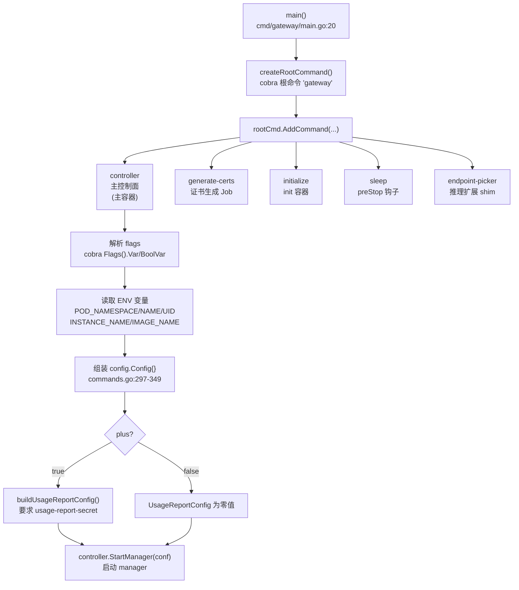

# NGF 控制面主容器启动参数与 config.Config 结构体分析

## 核心结论

> [!abstract] 核心结论
> NGF 控制面是**单一二进制** `gateway`，通过 cobra 子命令 `controller` 启动主控制面。**Plus 与 OSS 的区分是运行时 flag（`--nginx-plus`），不是 build tag**——同一个二进制同时服务 OSS 和 Plus。`--nginx-plus` 开启后，`usage-report-*` 系列 flag 才生效，并在 `config.Config` 中填充 `UsageReportConfig`。所有 flag 最终被组装进 `config.Config` 结构体（`internal/controller/config/config.go`），再传递给 `controller.StartManager(conf)`。

---

## 完整启动流程



---

## 子命令全景

> [!info] 二进制入口
> `cmd/gateway/main.go:20` — `main()` 创建根命令并注册 5 个子命令。

| 子命令 | 用途 | 容器角色 | 关键 flag |
|--------|------|----------|-----------|
| `controller` | 运行控制面主循环 | **主容器** `nginx-gateway` | 见下文全表 |
| `generate-certs` | 生成自签 TLS 证书 | cert-generator Job | `--service`, `--cluster-domain`, `--server-tls-secret`, `--agent-tls-secret`, `--server-tls-domain`, `--overwrite` |
| `initialize` | 写入初始配置文件 | init 容器 | `--source`, `--destination`, `--nginx-plus` |
| `sleep` | 休眠指定时长后退出 | preStop 钩子 | `--duration` (默认 `30s`) |
| `endpoint-picker` | NGINX ↔ 推理扩展 EndpointPicker 通信 shim | 独立容器 | `--endpoint-picker-disable-tls`, `--endpoint-picker-tls-skip-verify` |

---

## 主容器 `controller` 启动参数全表

> [!note] 参数来源
> flag 定义：`cmd/gateway/commands.go` `createControllerCommand()` (L85-L634)
> 实际部署参数：`deploy/default/deploy.yaml` (OSS) 与 `deploy/nginx-plus/deploy.yaml` (Plus)

### 1. 必填参数（Required）

| Flag | 类型 | 默认值 | Plus/OSS | 说明 |
|------|------|--------|----------|------|
| `--gateway-ctlr-name` | string | _(无)_ | **通用** | Gateway 控制器名，格式 `DOMAIN/PATH`，域名固定 `gateway.nginx.org`。如 `gateway.nginx.org/nginx-gateway-controller` |
| `--gatewayclass` | string | _(无)_ | **通用** | 对应的 GatewayClass 资源名。如 `nginx` |

> [!warning] 必填校验
> 两个必填 flag 通过 `cmd.MarkFlagRequired()` 标记，缺失时 cobra 直接报错退出。

### 2. 核心身份与通信参数

| Flag | 类型 | 默认值 | Plus/OSS | 说明 |
|------|------|--------|----------|------|
| `--config` / `-c` | string | `""` | **通用** | NginxGateway 资源名（动态配置），与控制器同 namespace |
| `--service` | string | `""` | **通用** | 前置 Service 名，与控制器同 namespace |
| `--agent-tls-secret` | string | `agent-tls` | **通用** | NGINX Agent 与控制面 gRPC 通信的 TLS CA/证书/密钥 Secret 名 |
| `--server-tls-domain` | string | `svc` | **通用** | server TLS 证书 SAN 的域名后缀，也用于 agent config host |

### 3. Metrics 参数

| Flag | 类型 | 默认值 | Plus/OSS | 说明 |
|------|------|--------|----------|------|
| `--metrics-disable` | bool | `false` | **通用** | 禁用 Prometheus 指标暴露 |
| `--metrics-port` | int | `9113` | **通用** | 指标暴露端口，范围 `[1024-65535]` |
| `--metrics-secure-serving` | bool | `false` | **通用** | 启用 HTTPS 提供指标（自签证书） |

### 4. Health Probe 参数

| Flag | 类型 | 默认值 | Plus/OSS | 说明 |
|------|------|--------|----------|------|
| `--health-disable` | bool | `false` | **通用** | 禁用健康探针服务器 |
| `--health-port` | int | `8081` | **通用** | 健康探针端口，范围 `[1024-65535]` |

### 5. Leader Election 参数

| Flag | 类型 | 默认值 | Plus/OSS | 说明 |
|------|------|--------|----------|------|
| `--leader-election-disable` | bool | `false` | **通用** | 禁用 leader election（禁用后所有副本都会写状态） |
| `--leader-election-lock-name` | string | `nginx-gateway-leader-election-lock` | **通用** | Lease 对象名，与控制器同 namespace |

### 6. Product Telemetry 参数

| Flag | 类型 | 默认值 | Plus/OSS | 说明 |
|------|------|--------|----------|------|
| `--product-telemetry-disable` | bool | `false` | **通用** | 禁用产品遥测收集 |

> [!tip] 构建时注入的遥测参数
> 以下变量通过 `-ldflags` 在构建时注入 `main` 包（`Makefile:22`），非命令行 flag：
> - `version` → `edge`（`Makefile:2`）
> - `telemetryReportPeriod` → `24h`（`Makefile:14`）
> - `telemetryEndpoint` → `""`（默认空；prod 镜像构建时设为 `oss.edge.df.f5.com:443`，`Makefile:12,93`）
> - `telemetryEndpointInsecure` → `false`（`Makefile:16`）

### 7. Feature Gate 参数

| Flag | 类型 | 默认值 | Plus/OSS | 说明 |
|------|------|--------|----------|------|
| `--gateway-api-experimental-features` | bool | `false` | **通用** | 启用 Gateway API experimental channel 特性 |
| `--gateway-api-inference-extension` | bool | `false` | **通用** | 启用 Gateway API 推理扩展（InferencePool 路由到 AI 工作负载） |
| `--snippets-filters` | bool | `false` | **通用** | ⚠️ **已废弃**，启用 SnippetsFilter（向 HTTPRoute/GRPCRoute 注入 NGINX 配置） |
| `--snippets` | bool | `false` | **通用** | 启用 Snippets（同时启用 SnippetsFilter + SnippetsPolicy） |

### 8. Endpoint Picker（推理扩展）参数

| Flag | 类型 | 默认值 | Plus/OSS | 说明 |
|------|------|--------|----------|------|
| `--endpoint-picker-disable-tls` | bool | `false` | **通用** | 禁用 EndpointPicker 通信 TLS（仅开发/测试或 service mesh 加密时用） |
| `--endpoint-picker-tls-skip-verify` | bool | `true` | **通用** | 跳过 EndpointPicker 服务端证书验证。**必须为 true** 直到 EndpointPicker 支持挂载证书 |

### 9. NGINX One Console 参数

| Flag | 类型 | 默认值 | Plus/OSS | 说明 |
|------|------|--------|----------|------|
| `--nginx-one-dataplane-key-secret` | string | `""` | **通用**（主要 Plus 场景） | NGINX One Console dataplane key Secret 名 |
| `--nginx-one-telemetry-endpoint-host` | string | `agent.connect.nginx.com` | **通用** | NGINX One Console 遥测端点主机 |
| `--nginx-one-telemetry-endpoint-port` | int | `443` | **通用** | NGINX One Console 遥测端点端口 |
| `--nginx-one-tls-skip-verify` | bool | `false` | **通用** | 跳过 NGINX One Console 端点 TLS 验证 |

### 10. NGINX Docker Registry 参数

| Flag | 类型 | 默认值 | Plus/OSS | 说明 |
|------|------|--------|----------|------|
| `--nginx-docker-secret` | stringSlice | `[]` | **通用**（Plus 私有仓库主要使用） | NGINX 容器拉取镜像的 Docker registry Secret 名，可多次指定 |

### 11. OpenShift / Namespace 参数

| Flag | 类型 | 默认值 | Plus/OSS | 说明 |
|------|------|--------|----------|------|
| `--nginx-scc` | string | `""` | **通用**（仅 OpenShift） | NGINX 数据面 Pod 的 SecurityContextConstraints 名 |
| `--watch-namespaces` | stringSlice | `[]` | **通用** | 逗号分隔的监听 namespace 列表；空则监听所有 namespace。控制器自身 namespace 始终被监听 |

### 12. PLM Storage（WAF Policy Lifecycle Manager）参数

| Flag | 类型 | 默认值 | Plus/OSS | 说明 |
|------|------|--------|----------|------|
| `--plm-storage-url` | string | `""` | **通用**（WAF PLM 场景） | PLM S3 兼容存储端点 URL。WAFPolicy 使用 `type: PLM` 时必填 |
| `--plm-storage-credentials-secret` | string | `""` | **通用** | PLM S3 凭证 Secret 名（`namespace/name` 或 `name`） |
| `--plm-storage-ca-secret` | string | `""` | **通用** | PLM 存储 TLS 验证 CA 证书 Secret 名 |
| `--plm-storage-client-ssl-secret` | string | `""` | **通用** | PLM 存储 mTLS 客户端证书/密钥 Secret 名 |
| `--plm-storage-skip-verify` | bool | `false` | **通用** | 跳过 PLM 存储 TLS 证书验证（不推荐生产使用） |

---

## ⭐ Plus 专属参数

> [!important] Plus 开关机制
> `--nginx-plus` 是 Plus 模式的**主开关**。当设为 `true` 时：
> 1. `config.Config.Plus = true`，传播到整个控制器
> 2. 调用 `buildUsageReportConfig()`（`commands.go:636`），**强制要求** `--usage-report-secret` 非空
> 3. Helm 模板中，所有 `usage-report-*` flag 嵌套在 `{{- if .Values.nginx.plus }}` 块内（`templates/deployment.yaml:61-84`）

| Flag | 类型 | 默认值 | Plus/OSS | 说明 |
|------|------|--------|----------|------|
| `--nginx-plus` | bool | `false` | **Plus 开关** | 启用 NGINX Plus 模式 |
| `--usage-report-secret` | string | `nplus-license` | **Plus 专属** | NGINX Plus usage 报告 JWT Secret 名。`--nginx-plus` 时**必填** |
| `--usage-report-endpoint` | string | `""` | **Plus 专属** | NGINX Plus usage 报告服务器端点 |
| `--usage-report-resolver` | string | `""` | **Plus 专属** | 解析 usage 报告端点的 nameserver（配合 NGINX Instance Manager） |
| `--usage-report-skip-verify` | bool | `false` | **Plus 专属** | 跳过 usage 报告服务器证书验证 |
| `--usage-report-client-ssl-secret` | string | `""` | **Plus 专属** | NGINX Instance Manager 客户端证书/密钥 Secret 名 |
| `--usage-report-ca-secret` | string | `""` | **Plus 专属** | NGINX Instance Manager CA 证书 Secret 名 |
| `--usage-report-enforce-initial-report` | bool | `true` | **Plus 专属** | 强制执行初始 NGINX Plus 许可报告 |

> [!warning] Plus 模式校验逻辑
> `buildUsageReportConfig()`（`commands.go:636-650`）：
> ```go
> if params.SecretName.value == "" {
>     return config.UsageReportConfig{}, errors.New("usage-report-secret is required when using NGINX Plus")
> }
> ```
> 即使 `--usage-report-secret` 有默认值 `nplus-license`，若用户显式设为空字符串仍会报错。

---

## Plus vs OSS 对比：实际部署参数

### OSS 默认部署（`deploy/default/deploy.yaml`）

```yaml
containers:
- args:
  - controller
  - --gateway-ctlr-name=gateway.nginx.org/nginx-gateway-controller
  - --gatewayclass=nginx
  - --config=nginx-gateway-config
  - --service=nginx-gateway
  - --agent-tls-secret=agent-tls
  - --server-tls-domain=svc
  - --metrics-port=9113
  - --health-port=8081
  - --leader-election-lock-name=nginx-gateway-leader-election
```

### Plus 默认部署（`deploy/nginx-plus/deploy.yaml`）

```yaml
containers:
- args:
  - controller
  - --gateway-ctlr-name=gateway.nginx.org/nginx-gateway-controller
  - --gatewayclass=nginx
  - --config=nginx-gateway-config
  - --service=nginx-gateway
  - --agent-tls-secret=agent-tls
  - --server-tls-domain=svc
  - --nginx-docker-secret=nginx-plus-registry-secret   # ← Plus 私有仓库
  - --nginx-plus                                         # ← Plus 开关
  - --usage-report-secret=nplus-license                  # ← Plus 专属
  - --usage-report-enforce-initial-report=true           # ← Plus 专属
  - --metrics-port=9113
  - --health-port=8081
  - --leader-election-lock-name=nginx-gateway-leader-election
```

> [!tip] 差异速览
> Plus 部署比 OSS 多了 4 行参数：`--nginx-docker-secret`、`--nginx-plus`、`--usage-report-secret`、`--usage-report-enforce-initial-report`。

### 其他变体部署

| 部署变体 | 额外参数 |
|----------|----------|
| `experimental/` | `--gateway-api-experimental-features` |
| `inference/` | `--gateway-api-inference-extension`、`--endpoint-picker-tls-skip-verify=true` |
| `snippets-nginx-plus/` | `--nginx-plus` + `--usage-report-*` + `--snippets` |

---

## 环境变量（非 flag，但注入 config.Config）

> [!note] 环境变量来源
> `createGatewayPodConfig()`（`commands.go:1035-1072`）从 ENV 读取 Pod 信息。这些不是命令行 flag，但是 config.Config 的数据来源。

| 环境变量 | 注入字段 | 来源 |
|----------|----------|------|
| `POD_NAMESPACE` | `GatewayPodConfig.Namespace` | downward API `metadata.namespace` |
| `POD_NAME` | `GatewayPodConfig.Name` | downward API `metadata.name` |
| `POD_UID` | `GatewayPodConfig.UID` | downward API `metadata.uid` |
| `INSTANCE_NAME` | `GatewayPodConfig.InstanceName` | downward API `metadata.labels['app.kubernetes.io/instance']` |
| `IMAGE_NAME` | `GatewayPodConfig.Image` | 静态 env，值为 `repository:tag` |
| `BUILD_AGENT` | `Config.ImageSource` | 构建环境；值为 `gha`/`local`/`unknown` |

---

## config.Config 结构体字段详解

> [!info] 定义位置
> `internal/controller/config/config.go:12-68`

```go
type Config struct {
    PLMStorageConfig              *PLMStorageConfig
    AtomicLevel                   zap.AtomicLevel
    GatewayPodConfig              GatewayPodConfig
    Logger                        logr.Logger
    GatewayClassName              string
    ConfigName                    string
    AgentTLSSecretName            string
    ServerTLSDomain               string
    ImageSource                   string
    GatewayCtlrName               string
    NGINXSCCName                  string
    UsageReportConfig             UsageReportConfig
    Flags                         Flags
    LeaderElection                LeaderElectionConfig
    NginxDockerSecretNames        []string
    WatchNamespaces               []string
    NginxOneConsoleTelemetryConfig NginxOneConsoleTelemetryConfig
    ProductTelemetryConfig        ProductTelemetryConfig
    HealthConfig                  HealthConfig
    MetricsConfig                 MetricsConfig
    Plus                          bool
    ExperimentalFeatures          bool
    InferenceExtension            bool
    SnippetsFilters               bool
    Snippets                      bool
    EndpointPickerDisableTLS      bool
    EndpointPickerTLSSkipVerify   bool
}
```

### 字段逐一解析

| 字段 | 类型 | 来源 flag / ENV | Plus/OSS | 含义与作用 |
|------|------|------------------|----------|-----------|
| `PLMStorageConfig` | `*PLMStorageConfig` | `--plm-storage-*` | 通用 | PLM S3 兼容存储配置。URL 为空时为 nil，表示未配置 PLM。用于 WAF Policy 生命周期管理 |
| `AtomicLevel` | `zap.AtomicLevel` | _(运行时创建)_ | 通用 | 原子可变的日志级别，支持运行时动态调整日志级别（通过 NginxGateway CR） |
| `GatewayPodConfig` | `GatewayPodConfig` | ENV + `--service` | 通用 | Pod 身份信息（name/namespace/uid/instance/version/image/serviceName），用于遥测和资源命名 |
| `Logger` | `logr.Logger` | _(运行时创建)_ | 通用 | Zap 日志器，所有组件共用。基于 `AtomicLevel` 创建 |
| `GatewayClassName` | `string` | `--gatewayclass` | 通用 | GatewayClass 资源名。NGF 只处理 `gatewayClassName` 等于此值的资源 |
| `ConfigName` | `string` | `--config` | 通用 | NginxGateway 资源名，控制面的动态配置来源（日志级别等） |
| `AgentTLSSecretName` | `string` | `--agent-tls-secret` | 通用 | NGINX Agent ↔ 控制面 gRPC 通信的 TLS Secret 名。默认 `agent-tls` |
| `ServerTLSDomain` | `string` | `--server-tls-domain` | 通用 | server TLS 证书 SAN 域名后缀 + agent config host。默认 `svc` |
| `ImageSource` | `string` | ENV `BUILD_AGENT` | 通用 | 镜像来源标识：`gha`(GitHub Actions)/`local`/`unknown`，用于遥测 |
| `GatewayCtlrName` | `string` | `--gateway-ctlr-name` | 通用 | Gateway 控制器名，格式 `DOMAIN/PATH`。用于 GatewayClass 的 `controllerName` 匹配 |
| `NGINXSCCName` | `string` | `--nginx-scc` | 通用(OpenShift) | NGINX 数据面 Pod 的 SecurityContextConstraints 名。仅 OpenShift 适用 |
| `UsageReportConfig` | `UsageReportConfig` | `--usage-report-*` | **Plus 专属** | NGINX Plus usage 报告配置。`--nginx-plus=false` 时为零值 |
| `Flags` | `Flags` | _(所有 flag 元数据)_ | 通用 | 所有命令行 flag 的名称和值的字符串形式，用于遥测上报"用户使用了哪些 flag 及其值是默认还是自定义" |
| `LeaderElection` | `LeaderElectionConfig` | `--leader-election-*` | 通用 | Leader election 配置：enabled/lockName/identity。避免多副本同时写状态 |
| `NginxDockerSecretNames` | `[]string` | `--nginx-docker-secret` | 通用(Plus主用) | NGINX 容器 Docker registry Secret 名列表。控制面会复制到 NGINX 部署的 namespace |
| `WatchNamespaces` | `[]string` | `--watch-namespaces` | 通用 | 监听的 namespace 列表。空 = 全集群监听。控制器自身 namespace 始终被监听 |
| `NginxOneConsoleTelemetryConfig` | `NginxOneConsoleTelemetryConfig` | `--nginx-one-*` | 通用 | NGINX One Console 遥测配置：dataplane key secret/endpoint host/port/TLS skip verify |
| `ProductTelemetryConfig` | `ProductTelemetryConfig` | `--product-telemetry-disable` + 构建时变量 | 通用 | 产品遥测配置：endpoint/period/insecure/enabled。Endpoint 由构建时 ldflags 注入 |
| `HealthConfig` | `HealthConfig` | `--health-*` | 通用 | 健康探针配置：enabled/port。`/readyz` 端点 |
| `MetricsConfig` | `MetricsConfig` | `--metrics-*` | 通用 | Prometheus 指标配置：enabled/port/secure |
| `Plus` | `bool` | `--nginx-plus` | **Plus 开关** | 是否使用 NGINX Plus。传播到整个控制器和数据面配置生成器，影响负载均衡方法、usage 报告等 |
| `ExperimentalFeatures` | `bool` | `--gateway-api-experimental-features` | 通用 | 启用 Gateway API experimental channel 特性 |
| `InferenceExtension` | `bool` | `--gateway-api-inference-extension` | 通用 | 启用 Gateway API 推理扩展支持 |
| `SnippetsFilters` | `bool` | `--snippets-filters` (废弃) | 通用 | 启用 SnippetsFilter（向 HTTPRoute/GRPCRoute 注入 NGINX 配置）。已被 `Snippets` 取代 |
| `Snippets` | `bool` | `--snippets` | 通用 | 启用 Snippets（SnippetsFilter + SnippetsPolicy） |
| `EndpointPickerDisableTLS` | `bool` | `--endpoint-picker-disable-tls` | 通用 | 禁用 EndpointPicker 通信 TLS |
| `EndpointPickerTLSSkipVerify` | `bool` | `--endpoint-picker-tls-skip-verify` | 通用 | 跳过 EndpointPicker 服务端证书验证。默认 `true`（临时方案） |

---

## config.Config 子结构体详解

### PLMStorageConfig

> [!info] 定义位置：`config.go:71-82`

| 字段 | 类型 | 来源 flag | 含义 |
|------|------|-----------|------|
| `URL` | `string` | `--plm-storage-url` | S3 兼容存储端点 URL（SeaweedFS filer S3 gateway） |
| `CredentialsSecretName` | `string` | `--plm-storage-credentials-secret` | S3 secret access key 的 Secret 名 |
| `CASecretName` | `string` | `--plm-storage-ca-secret` | TLS 验证 CA 证书 Secret 名 |
| `ClientSSLSecretName` | `string` | `--plm-storage-client-ssl-secret` | mTLS 客户端证书/密钥 Secret 名 |
| `SkipVerify` | `bool` | `--plm-storage-skip-verify` | 跳过 TLS 证书验证（仅 dev/test） |

> [!warning] PLM namespace 校验
> `validatePLMSecretNamespacesWatched()`（`commands.go:666`）在 PreRunE 阶段校验：当使用 `namespace/name` 格式的跨 namespace secret 引用时，该 namespace 必须在 `--watch-namespaces` 列表中（或为控制器自身 namespace）。

### GatewayPodConfig

> [!info] 定义位置：`config.go:85-101`

| 字段 | 类型 | 来源 | 含义 |
|------|------|------|------|
| `ServiceName` | `string` | `--service` | 前置 Service 名 |
| `Namespace` | `string` | ENV `POD_NAMESPACE` | Pod namespace |
| `Name` | `string` | ENV `POD_NAME` | Pod 名 |
| `UID` | `string` | ENV `POD_UID` | Pod UID |
| `InstanceName` | `string` | ENV `INSTANCE_NAME` | 实例标签名（通常是 Helm release 名） |
| `Version` | `string` | 构建时 `version` | NGF 版本 |
| `Image` | `string` | ENV `IMAGE_NAME` | Pod 镜像路径 |

### MetricsConfig

> [!info] 定义位置：`config.go:104-111`

| 字段 | 类型 | 来源 flag | 含义 |
|------|------|-----------|------|
| `Port` | `int` | `--metrics-port` | 指标端口，默认 `9113` |
| `Enabled` | `bool` | `--metrics-disable`（取反） | 是否启用指标 |
| `Secure` | `bool` | `--metrics-secure-serving` | 是否 HTTPS 提供指标 |

### HealthConfig

> [!info] 定义位置：`config.go:114-119`

| 字段 | 类型 | 来源 flag | 含义 |
|------|------|-----------|------|
| `Port` | `int` | `--health-port` | 健康探针端口，默认 `8081` |
| `Enabled` | `bool` | `--health-disable`（取反） | 是否启用健康探针 |

### LeaderElectionConfig

> [!info] 定义位置：`config.go:122-129`

| 字段 | 类型 | 来源 flag | 含义 |
|------|------|-----------|------|
| `LockName` | `string` | `--leader-election-lock-name` | Lease 对象名 |
| `Identity` | `string` | `GatewayPodConfig.Name` | Leader 身份标识（Pod 名） |
| `Enabled` | `bool` | `--leader-election-disable`（取反） | 是否启用 leader election |

### ProductTelemetryConfig

> [!info] 定义位置：`config.go:132-141`

| 字段 | 类型 | 来源 | 含义 |
|------|------|------|------|
| `Endpoint` | `string` | 构建时 `telemetryEndpoint` | 遥测服务 `host:port`。空时在日志 debug 级别输出 |
| `ReportPeriod` | `time.Duration` | 构建时 `telemetryReportPeriod` | 报告周期，默认 `24h` |
| `EndpointInsecure` | `bool` | 构建时 `telemetryEndpointInsecure` | 是否用非 TLS |
| `Enabled` | `bool` | `--product-telemetry-disable`（取反） | 是否启用遥测 |

### UsageReportConfig（Plus 专属）

> [!info] 定义位置：`config.go:144-159`

| 字段 | 类型 | 来源 flag | 含义 |
|------|------|-----------|------|
| `SecretName` | `string` | `--usage-report-secret` | JWT Secret 名。Plus 时必填，默认 `nplus-license` |
| `ClientSSLSecretName` | `string` | `--usage-report-client-ssl-secret` | NGINX Instance Manager 客户端证书 Secret |
| `CASecretName` | `string` | `--usage-report-ca-secret` | NGINX Instance Manager CA 证书 Secret |
| `Endpoint` | `string` | `--usage-report-endpoint` | 报告服务器端点 |
| `Resolver` | `string` | `--usage-report-resolver` | 解析端点的 nameserver |
| `SkipVerify` | `bool` | `--usage-report-skip-verify` | 跳过服务器证书验证 |
| `EnforceInitialReport` | `bool` | `--usage-report-enforce-initial-report` | 强制初始许可报告，默认 `true` |

### NginxOneConsoleTelemetryConfig

> [!info] 定义位置：`config.go:172-181`

| 字段 | 类型 | 来源 flag | 含义 |
|------|------|-----------|------|
| `DataplaneKeySecretName` | `string` | `--nginx-one-dataplane-key-secret` | dataplane key Secret 名 |
| `EndpointHost` | `string` | `--nginx-one-telemetry-endpoint-host` | 端点主机，默认 `agent.connect.nginx.com` |
| `EndpointPort` | `int` | `--nginx-one-telemetry-endpoint-port` | 端点端口，默认 `443` |
| `EndpointTLSSkipVerify` | `bool` | `--nginx-one-tls-skip-verify` | 跳过 TLS 验证 |

### Flags

> [!info] 定义位置：`config.go:163-169`
> 用于遥测：记录用户启用了哪些 flag、值是默认还是自定义。

| 字段 | 类型 | 含义 |
|------|------|------|
| `Names` | `[]string` | flag 名列表 |
| `Values` | `[]string` | flag 值列表（bool 为 `true`/`false`；非 bool 为 `default` 或 `user-defined`） |

> [!tip] parseFlags 逻辑
> `parseFlags()`（`commands.go:989-1010`）：遍历所有 flag，bool 类型记录 `flag.Value.String()`；非 bool 类型若值等于 `DefValue` 记录 `default`，否则记录 `user-defined`。**不记录实际值**（隐私保护）。

---

## 关键代码位置

| 阶段 | 文件 | 行号 | 说明 |
|------|------|------|------|
| 入口 | `cmd/gateway/main.go` | 20 | `main()` 创建根命令 |
| 根命令 | `cmd/gateway/commands.go` | 72 | `createRootCommand()` |
| controller 命令 | `cmd/gateway/commands.go` | 85 | `createControllerCommand()` |
| flag 常量定义 | `cmd/gateway/commands.go` | 29-50 | 共享 flag 名常量 |
| controller flag 名 | `cmd/gateway/commands.go` | 87-118 | controller 专属 flag 名常量 |
| flag 默认值 | `cmd/gateway/commands.go` | 121-231 | flag 变量声明与默认值 |
| Plus 校验 | `cmd/gateway/commands.go` | 281-286 | `if plus { buildUsageReportConfig() }` |
| Config 组装 | `cmd/gateway/commands.go` | 297-349 | `config.Config{...}` 字面量构造 |
| flag 注册 | `cmd/gateway/commands.go` | 359-631 | `cmd.Flags().Var/BoolVar` |
| UsageReport 构建 | `cmd/gateway/commands.go` | 636-650 | `buildUsageReportConfig()` |
| PLM 构建 | `cmd/gateway/commands.go` | 652-664 | `buildPLMStorageConfig()` |
| PLM namespace 校验 | `cmd/gateway/commands.go` | 666-717 | `validatePLMSecretNamespacesWatched()` |
| PodConfig 构建 | `cmd/gateway/commands.go` | 1035-1072 | `createGatewayPodConfig()` 从 ENV |
| Config 结构体 | `internal/controller/config/config.go` | 12-68 | `Config` 定义 |
| 启动 Manager | `internal/controller/manager.go` | — | `controller.StartManager(conf)` |
| Helm 模板 | `charts/.../templates/deployment.yaml` | 42-151 | flag 条件渲染 |
| 构建变量 | `Makefile` | 2,12-16,22 | ldflags 注入 |

---

## 设计原因分析

### 为什么 Plus/OSS 是运行时 flag 而非 build tag？

**约束**：
- 需要支持 OSS 和 Plus 两种数据面
- 控制面逻辑高度重叠，维护两套二进制成本高
- 部署时需要灵活切换

**选择**：单一二进制 + 运行时 `--nginx-plus` flag

**原因**：
1. **维护成本**：控制面 90%+ 逻辑共享，build tag 会产生两份编译产物
2. **部署灵活**：用户只需改 flag 即可切换，无需重新拉取镜像
3. **数据面分离**：Plus 的差异主要在 NGINX 数据面镜像（通过 NginxProxy CR 的 image 配置），控制面只需知道 `Plus=true` 来生成不同的 NGINX 配置（如负载均衡方法、usage 报告指令）
4. **`Plus` 字段传播**：`config.Config.Plus` 传播到 `ServerConfig.Plus`、`GeneratorImpl` 等数据面配置生成器，影响生成的 NGINX 配置内容

### 为什么遥测参数用构建时 ldflags 而非 flag？

**约束**：
- 遥测端点不应被用户随意修改（避免数据发到错误地方）
- 需要区分 dev/prod 构建的遥测目标

**选择**：`-ldflags -X main.telemetryEndpoint=...`

**原因**：
1. **不可篡改**：用户无法通过 flag 覆盖遥测端点，确保数据发送到正确服务器
2. **构建区分**：`Makefile:93` `build-prod-ngf-image` 时设 `TELEMETRY_ENDPOINT=$(PROD_TELEMETRY_ENDPOINT)`，本地构建为空（遥测仅输出到日志）
3. **安全**：防止误配置导致遥测数据泄露

### 为什么 `Flags` 字段只记录 default/user-defined 而非实际值？

**约束**：
- 遥测需要知道用户使用了哪些功能
- 不能泄露敏感配置（secret 名、端点等）

**选择**：`parseFlags()` 对非 bool flag 只记录 `default` 或 `user-defined`

**原因**：隐私保护——NGINX 可以知道"用户自定义了 usage-report-endpoint"但不知道端点是什么。

### 为什么 `endpoint-picker-tls-skip-verify` 默认为 `true`？

**约束**：Gateway API Inference Extension EndpointPicker 尚不支持挂载证书

**选择**：默认 `true`，代码注释明确标注为临时方案

**原因**：见 [gateway-api-inference-extension#1556](https://github.com/kubernetes-sigs/gateway-api-inference-extension/issues/1556)，在 EndpointPicker 支持证书挂载前必须跳过验证。

### 为什么 `--snippets-filters` 被废弃？

**选择**：新增 `--snippets` 同时启用 SnippetsFilter + SnippetsPolicy

**原因**：功能扩展——SnippetsPolicy 是新增的 Gateway 级别 snippet 注入 API，`--snippets` 统一控制两个 API。`--snippets-filters` 通过 `cmd.Flags().MarkDeprecated()` 标记废弃。

---

## 总结

| 角色 | 职责 |
|------|------|
| `main()` | 创建 cobra 根命令，注册 5 个子命令 |
| `createControllerCommand()` | 定义主控制面所有 flag，组装 `config.Config`，启动 Manager |
| `config.Config` | 控制面全量配置容器，传递给 `controller.StartManager()` |
| `--nginx-plus` | Plus 模式运行时开关，触发 `UsageReportConfig` 构建 |
| `--usage-report-*` (7个) | Plus 专属参数，仅在 `--nginx-plus=true` 时生效 |
| 构建时 ldflags | 注入 version + 遥测参数（不可被 flag 覆盖） |
| ENV 变量 | 注入 Pod 身份信息到 `GatewayPodConfig` |
| `Flags` 字段 | 遥测元数据：记录 flag 使用情况（不含实际值） |

> [!quote] 相关文档
> - [[ngf-architecture]] — NGF 整体架构
> - Gateway API 规范：https://gateway-api.sigs.k8s.io/
> - NGF 官方文档：https://docs.nginx.com/nginx-gateway-fabric/
