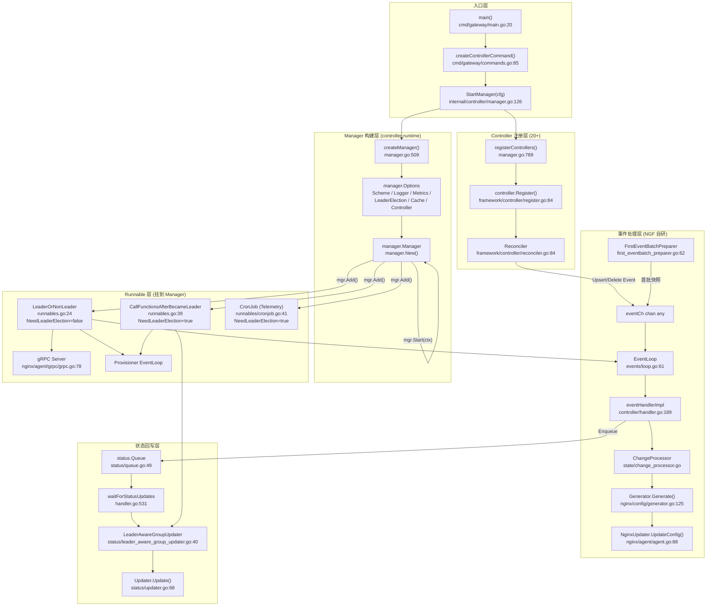
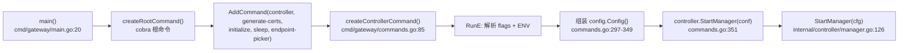
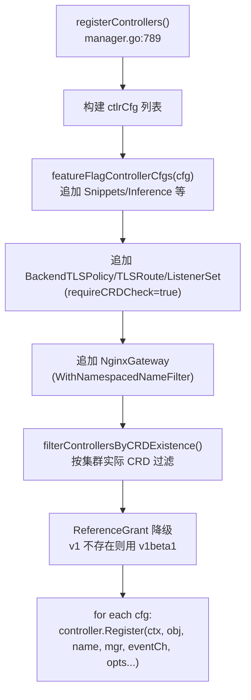
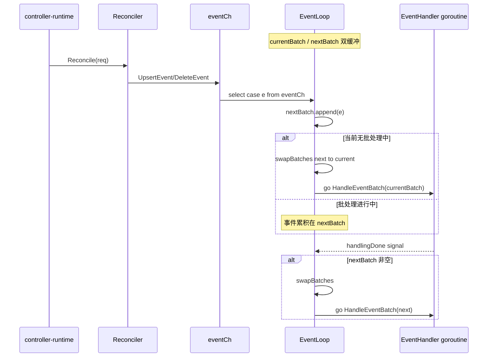
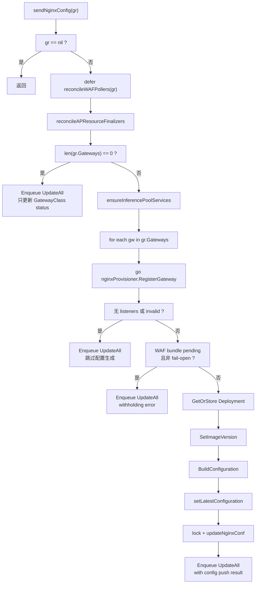
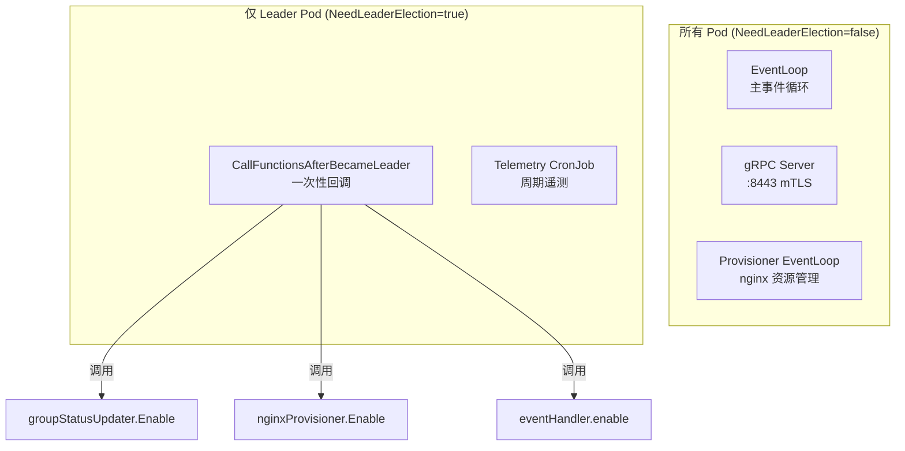
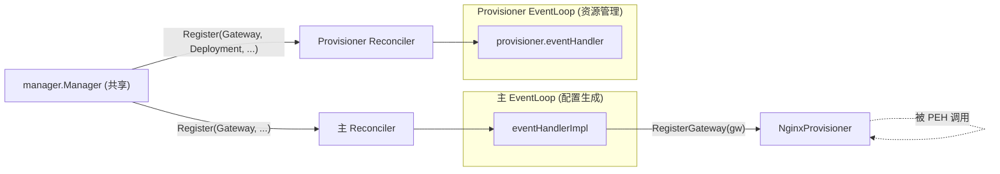
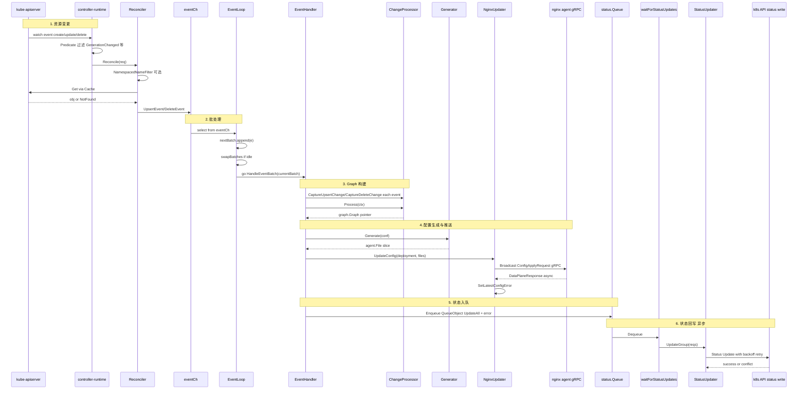

# NGF 基于 controller-runtime 的交互逻辑与工作原理

> [!abstract] 文档定位
> 本文聚焦 NGF（NGINX Gateway Fabric）与 [controller-runtime](https://pkg.go.dev/sigs.k8s.io/controller-runtime) 之间的**所有交互点**，基于源码事实逐一拆解：Manager 如何构建、20+ 个 Controller 如何注册、自定义 Reconciler 如何把 k8s 事件转换成 NGF 内部事件、双缓冲 EventLoop 如何批处理、Leader 选举 Runnable 如何工作、状态如何回写、Provisioner 子系统如何复用同一套机制。
> 如果你想理解 NGF 控制面"为何这样设计"，本文给出从入口到落地的完整链路。

## 核心结论

NGF 不是把 reconcile 逻辑写在 `Reconcile()` 里，而是把 controller-runtime 当作**事件源**：每一个 Controller 的 Reconciler 只做一件事——把 k8s 资源变更翻译成 `UpsertEvent`/`DeleteEvent` 推入一个 `chan any`。真正的业务逻辑在 EventLoop + EventHandler 中以**批处理**方式执行，这样能：

1. 把上千次 k8s watch 事件合并成一次 NGINX reload（reload ≥200ms，必须最小化）
2. 让图（Graph）构建和配置生成基于"批"而非"单事件"，保证一致性
3. 让 Provisioner 子系统、gRPC 数据面服务、Telemetry 等以 Runnable 形式挂到同一个 Manager 上，由 controller-runtime 统一调度生命周期与 leader 选举

---

## 整体交互架构



---

## 1. 入口流程：从 `main()` 到 `StartManager()`



> [!info] 关键事实
> - `main()` 只组装 cobra 命令树，**不直接调用** controller-runtime
> - `controller` 子命令的 `RunE` 把所有 flag + ENV 装入 `config.Config` 后调用 `controller.StartManager(conf)`
> - `StartManager` 是 controller-runtime 交互的**唯一入口**

**源码位置**：

| 阶段 | 文件 | 行号 |
|------|------|------|
| main | `cmd/gateway/main.go` | 20 |
| controller 子命令 | `cmd/gateway/commands.go` | 85 |
| Config 组装 | `cmd/gateway/commands.go` | 297-349 |
| StartManager 调用 | `cmd/gateway/commands.go` | 351 |
| StartManager 实现 | `internal/controller/manager.go` | 126 |

---

## 2. Manager 构建：`createManager()` 与 `manager.Options`

`internal/controller/manager.go:509` 的 `createManager` 是与 controller-runtime 最核心的接触点。

### 2.1 manager.Options 字段逐一拆解

```go
// internal/controller/manager.go:509-530
func createManager(cfg config.Config, healthChecker *graphBuiltHealthChecker) (manager.Manager, error) {
    options := manager.Options{
        Scheme:  scheme,                                       // ①
        Logger:  cfg.Logger.V(1),                              // ②
        Metrics: getMetricsOptions(cfg.MetricsConfig),         // ③
        LeaderElection:          cfg.LeaderElection.Enabled,   // ④
        LeaderElectionNamespace: cfg.GatewayPodConfig.Namespace,
        LeaderElectionID:        cfg.LeaderElection.LockName,
        LeaderElectionReleaseOnCancel: false,                  // ⑤
        Controller: ctrlconf.Controller{
            NeedLeaderElection: helpers.GetPointer(false),    // ⑥
        },
        Cache: buildManagerCache(cfg),                         // ⑦
    }
    if cfg.HealthConfig.Enabled {
        options.HealthProbeBindAddress = fmt.Sprintf(":%d", cfg.HealthConfig.Port)  // ⑧
    }
    // ...
    mgr, err := manager.New(clusterCfg, options)               // ⑨
    // ...
    if cfg.HealthConfig.Enabled {
        mgr.AddReadyzCheck("readyz", healthChecker.readyCheck) // ⑩
    }
    controller.AddIndex(ctx, mgr.GetFieldIndexer(), &apiv1.Pod{}, "status.podIP", ...) // ⑪
}
```

| # | 字段 | 含义 | NGF 设计意图 |
|---|------|------|-------------|
| ① | `Scheme` | 类型注册表，包含所有 Gateway API + NGF CRD + K8s core 类型 | 让 controller-runtime 知道如何序列化/反序列化所有受控资源 |
| ② | `Logger` | `cfg.Logger.V(1)`（verbosity 1） | controller-runtime 自身日志使用 NGF 的 zap logger |
| ③ | `Metrics` | `getMetricsOptions` 返回 `metricsserver.Options{BindAddress: ":port"}` 或 `0`（关闭） | Prometheus 抓取端点；`Secure=true` 时启用 HTTPS |
| ④ | `LeaderElection` | 由 `cfg.LeaderElection.Enabled` 控制 | 多副本部署时只有 leader 写状态、跑 Provisioner |
| ⑤ | `LeaderElectionReleaseOnCancel: false` | **故意设为 false** | 见下方设计原因 |
| ⑥ | `Controller.NeedLeaderElection: false` | **所有 Controller 在非 leader Pod 上也运行** | 见下方设计原因 |
| ⑦ | `Cache` | `buildManagerCache(cfg)` 自定义缓存 | 见 §2.2 |
| ⑧ | `HealthProbeBindAddress` | 仅 `HealthConfig.Enabled` 时设置 | 启用 readyz 探针 |
| ⑨ | `manager.New` | 真正创建 Manager | — |
| ⑩ | `AddReadyzCheck` | 注册 `readyz` 检查函数 `healthChecker.readyCheck` | 首次 Graph 构建后才 ready |
| ⑪ | `AddIndex` | 给 Pod 添加 `status.podIP` 字段索引 | 校验 agent gRPC 连接来源的合法性 |

> [!warning] LeaderElectionReleaseOnCancel=false 的原因
> 代码注释明确说明：Manager 优雅停止时会等待所有 Runnable（包括 Leader-only）完成。如果设 true，新 leader 可能在旧 leader 的 Runnable 还没结束时就开始跑 Leader-only Runnable，造成**双写冲突**。NGF 选择让旧 leader 持有锁直到 Runnable 完成，再释放。

> [!warning] Controller.NeedLeaderElection=false 的原因
> NGF 的 Reconciler 只做"事件翻译"——把 k8s 资源变更推入 `eventCh`。**所有 Pod 都需要维护本地 Cache**，否则非 leader Pod 切换为 leader 时没有完整视图。真正的写操作（写 status、provision nginx 资源）由 `CallFunctionsAfterBecameLeader` 在成为 leader 后才启用。

### 2.2 Cache 配置：`buildManagerCache()`

`internal/controller/manager.go:570` 构建 `cache.Options`：

```go
func buildManagerCache(cfg config.Config) cache.Options {
    var cacheOpts cache.Options
    // ① WatchNamespaces：限定命名空间范围
    if len(cfg.WatchNamespaces) > 0 {
        // 自动追加 controller 自己的 namespace
        if !slices.Contains(cfg.WatchNamespaces, cfg.GatewayPodConfig.Namespace) {
            cfg.WatchNamespaces = append(cfg.WatchNamespaces, cfg.GatewayPodConfig.Namespace)
        }
        namespaces := make(map[string]cache.Config)
        for _, ns := range cfg.WatchNamespaces {
            namespaces[ns] = cache.Config{}
        }
        cacheOpts.DefaultNamespaces = namespaces
    }
    // ② 全局默认 Transform：剥离 ManagedFields（NGF 不用）
    cacheOpts.DefaultTransform = cache.TransformStripManagedFields()
    // ③ 按对象类型的自定义 Transform
    cacheOpts.ByObject = map[client.Object]cache.ByObject{
        &gatewayv1.GatewayClass{}: {Transform: ctlrCache.TransformGatewayClass(cfg.GatewayCtlrName)},
        &apiv1.Secret{}:           {Transform: ctlrCache.TransformSecret()},
        &apiv1.ConfigMap{}:        {Transform: ctlrCache.TransformConfigMap()},
    }
    return cacheOpts
}
```

> [!note] 为什么需要 Transform？
> - `GatewayClass`：只缓存 `spec.controllerName == cfg.GatewayCtlrName` 的 GatewayClass，避免处理其他控制器的
> - `Secret`/`ConfigMap`：剥离大字段（data 之外的元数据），减少内存占用
> - `StripManagedFields`：`managedFields` 字段大且无用，全局剥离节省内存

### 2.3 Metrics 配置：`getMetricsOptions()`

```go
// internal/controller/manager.go:1405
func getMetricsOptions(cfg config.MetricsConfig) metricsserver.Options {
    metricsOptions := metricsserver.Options{BindAddress: "0"}  // 默认关闭
    if cfg.Enabled {
        if cfg.Secure {
            metricsOptions.SecureServing = true
        }
        metricsOptions.BindAddress = fmt.Sprintf(":%v", cfg.Port)
    }
    return metricsOptions
}
```

> [!tip] BindAddress="0"
> controller-runtime 约定 `BindAddress: "0"` 表示**不绑定**。NGF 默认关闭 metrics，只有 `--metrics-enabled` 时才开放。

### 2.4 Health 探针

```go
// internal/controller/manager.go:544-548
if cfg.HealthConfig.Enabled {
    if err := mgr.AddReadyzCheck("readyz", healthChecker.readyCheck); err != nil {
        return nil, fmt.Errorf("error adding ready check: %w", err)
    }
}
```

`graphBuiltHealthChecker` 的 `ready` 字段在 `eventHandlerImpl.HandleEventBatch` 首次处理完批次后被设为 true（`handler.go:209-211`）。**这意味着 Pod 启动后要等到首次 Graph 构建完成，readyz 才返回 200**，避免在配置未就绪时接收流量。

### 2.5 FieldIndex：Pod IP 索引

```go
// internal/controller/manager.go:552-561
var podIPIndexFunc client.IndexerFunc = index.PodIPIndexFunc
controller.AddIndex(ctx, mgr.GetFieldIndexer(), &apiv1.Pod{}, "status.podIP", podIPIndexFunc)
```

> [!info] 这个索引用在哪？
> 当 nginx agent 通过 gRPC 连接到控制面时，控制面需要校验连接来源。通过 Pod IP 反查 Pod 元数据，确认连接来自合法的 nginx 数据面 Pod（见 `internal/controller/nginx/agent/grpc/interceptor`）。

---

## 3. Controller 注册：`registerControllers()` 全景

`internal/controller/manager.go:789` 注册 **20+ 个 Controller**，全部通过同一个 `controller.Register()` 框架函数。

### 3.1 注册流程



### 3.2 完整 Controller 清单

| 资源类型 | Predicate | 特殊选项 | 备注 |
|---------|-----------|---------|------|
| `GatewayClass` | `GenerationChangedPredicate + GatewayClassPredicate{ControllerName}` | — | 只处理本控制器的 GatewayClass |
| `Gateway` | `GenerationChangedPredicate` | — | — |
| `HTTPRoute` | `GenerationChangedPredicate` | — | — |
| `ConfigMap` | 无 | — | 不过滤，所有变更都处理 |
| `Service` | `ServiceChangedPredicate` | name=`"user-service"` | 多个 Service controller 需要唯一名字 |
| `Secret` | `ResourceVersionChangedPredicate` | — | Secret 用 RV 而非 Generation 判断变更 |
| `EndpointSlice` | `GenerationChangedPredicate` | `WithFieldIndices(CreateEndpointSliceFieldIndices())` | 加字段索引，用于 Service→Endpoints 查询 |
| `Namespace` | `LabelChangedPredicate` | — | 只关心 label 变更（用于命名空间选择器） |
| `ReferenceGrant` | `GenerationChangedPredicate` | `requireCRDCheck=true` | v1 CRD 不存在则降级 v1beta1 |
| `CRD` (CustomResourceDefinition) | `AnnotationPredicate{Annotation: BundleVersionAnnotation}` | `WithOnlyMetadata()` | 只缓存 metadata；只关心带 bundle version 注解的 CRD |
| `NginxProxy` | `GenerationChangedPredicate` | — | NGF 自定义 CRD |
| `GRPCRoute` | `GenerationChangedPredicate` | — | — |
| `ClientSettingsPolicy` | `GenerationChangedPredicate` | — | NGF 扩展 CRD |
| `ObservabilityPolicy` | `GenerationChangedPredicate` | — | NGF 扩展 CRD |
| `ProxySettingsPolicy` | `GenerationChangedPredicate` | — | NGF 扩展 CRD |
| `UpstreamSettingsPolicy` | `GenerationChangedPredicate` | — | NGF 扩展 CRD |
| `AuthenticationFilter` | `GenerationChangedPredicate` | — | NGF 扩展 CRD |
| `RateLimitPolicy` | `GenerationChangedPredicate` | — | NGF 扩展 CRD |
| `WAFPolicy` | `GenerationChangedPredicate` | — | NGF 扩展 CRD（Plus） |
| `BackendTLSPolicy` | `GenerationChangedPredicate` | `requireCRDCheck=true` | 条件注册 |
| `TLSRoute` | `GenerationChangedPredicate` | `requireCRDCheck=true` | 条件注册 |
| `ListenerSet` | `GenerationChangedPredicate` | `requireCRDCheck=true` | 条件注册 |
| `SnippetsFilter` / `SnippetsPolicy` | — | feature flag | `--snippets` 启用 |
| `TCPRoute` / `UDPRoute` | — | feature flag + CRD check | `--experimental` 启用 |
| `InferencePool` | — | feature flag | `--inference-extension` 启用 |
| `NginxGateway` | `GenerationChangedPredicate` | `WithNamespacedNameFilter(单资源 filter)` | 只处理本 Pod 的 NginxGateway 配置 |

> [!note] `requireCRDCheck=true` 的作用
> 部分 Gateway API 资源（BackendTLSPolicy v1、TLSRoute v1、ListenerSet v1）在旧集群中可能只有 v1beta1。`filterControllersByCRDExistence` 在注册前先查集群中是否存在对应 CRD，不存在则**跳过该 Controller 注册**。`discoveredCRDs` 返回值被传给 `prepareFirstEventBatchPreparerArgs`，让首批快照也只 list 存在的资源类型。

> [!note] `WithOnlyMetadata()` 的特殊处理
> CRD controller 用 `WithOnlyMetadata()`——只缓存 `metav1.PartialObjectMetadata`，不缓存 spec/status 的完整内容。NGF 只关心 CRD 是否存在及版本注解，不需要完整定义。**使用此选项必须在 ObjectType 上设置 GVK**，否则 `Register` 会 panic。

### 3.3 `NginxGateway` 的单资源过滤

```go
// internal/controller/manager.go:980-988
ctlrCfg{
    objectType: &ngfAPIv1alpha1.NginxGateway{},
    options: []controller.Option{
        controller.WithNamespacedNameFilter(filter.CreateSingleResourceFilter(controlConfigNSName)),
        controller.WithK8sPredicate(k8spredicate.GenerationChangedPredicate{}),
    },
}
```

`CreateSingleResourceFilter` 返回一个 `NamespacedNameFilterFunc`，只接受 `{Namespace: cfg.GatewayPodConfig.Namespace, Name: cfg.ConfigName}` 的资源。其他 NginxGateway 资源的 reconcile 会在 Reconciler 内部直接 return（见 §4）。

### 3.4 注册前的初始配置

```go
// internal/controller/manager.go:989-997
if err := setInitialConfig(
    mgr.GetAPIReader(),  // 注意：用 APIReader（非缓存），避免首次读不到
    cfg.Logger,
    recorder,
    logLevelSetter,
    controlConfigNSName,
); err != nil {
    return nil, fmt.Errorf("error setting initial control plane configuration: %w", err)
}
```

> [!tip] 为什么用 `mgr.GetAPIReader()` 而非 `mgr.GetClient()`？
> `GetAPIReader()` 直连 API server，**不经过 Cache**。启动时 Cache 可能还未同步完成，用 APIReader 保证读到最新值。`GetClient()` 走 Cache，适合稳态读。

---

## 4. 框架层 Controller：`Register()` + `Reconciler`

### 4.1 `controller.Register()` —— Option 模式

`internal/framework/controller/register.go:84` 是所有 Controller 注册的统一入口：

```go
func Register(
    ctx context.Context,
    objectType ngftypes.ObjectType,
    name string,
    mgr manager.Manager,
    eventCh chan<- any,
    options ...Option,
) error {
    cfg := defaultConfig()
    for _, opt := range options { opt(&cfg) }   // ① 应用 Option 链

    // ② 注册 FieldIndex
    for field, indexerFunc := range cfg.fieldIndices {
        AddIndex(ctx, mgr.GetFieldIndexer(), objectType, field, indexerFunc)
    }

    // ③ 构建 ForOption
    var forOpts []ctlrBuilder.ForOption
    if cfg.onlyMetadata {
        if objectType.GetObjectKind().GroupVersionKind().Empty() {
            panic("the object must have its GVK set")
        }
        forOpts = append(forOpts, ctlrBuilder.OnlyMetadata)
    }

    // ④ 用 controller-runtime 的 Builder 构建 Controller
    builder := ctlr.NewControllerManagedBy(mgr).Named(name).For(objectType, forOpts...)
    if cfg.k8sPredicate != nil {
        builder = builder.WithEventFilter(cfg.k8sPredicate)
    }

    // ⑤ 创建 Reconciler 并 Complete
    recCfg := ReconcilerConfig{
        Getter:               mgr.GetClient(),   // 用 Cache client
        ObjectType:           objectType,
        EventCh:              eventCh,
        NamespacedNameFilter: cfg.namespacedNameFilter,
        OnlyMetadata:         cfg.onlyMetadata,
    }
    return builder.Complete(cfg.newReconciler(recCfg))
}
```

### 4.2 可用的 Option

| Option | 作用 | 典型用例 |
|--------|------|---------|
| `WithK8sPredicate(p)` | 在事件进入 Reconciler 前过滤 | `GenerationChangedPredicate`、`LabelChangedPredicate` 等 |
| `WithNamespacedNameFilter(f)` | 在 Reconciler 内部按 NamespacedName 过滤 | NginxGateway 单资源 |
| `WithFieldIndices(idx)` | 给 Cache 添加字段索引 | EndpointSlice 的 `kubernetes.io/service-name` 索引 |
| `WithOnlyMetadata()` | 只缓存 metadata | CRD controller |
| `WithNewReconciler(f)` | 注入 mock Reconciler（测试用） | 单元测试 |

> [!note] 两层过滤的区别
> - `WithK8sPredicate`：**在 controller-runtime 内部**过滤，不满足条件的事件**不会触发 Reconcile**，节省 Reconciler 调用
> - `WithNamespacedNameFilter`：事件**会触发 Reconcile**，但在 Reconciler 内部判断后直接 return，**仍占用一次 Reconcile 调用**
> 
> 能用 Predicate 就用 Predicate，性能更好；但有些过滤逻辑需要 Reconciler 内部信息时才用 NamespacedNameFilter。

### 4.3 自定义 `Reconciler` —— 事件翻译器

`internal/framework/controller/reconciler.go:84` 是 NGF 对 `reconcile.Reconciler` 接口的实现。**它不做任何业务逻辑，只做事件翻译**：

```go
func (r *Reconciler) Reconcile(ctx context.Context, req reconcile.Request) (reconcile.Result, error) {
    logger := log.FromContext(ctx)  // controller-runtime 已注入 group/kind/ns/name

    // ① NamespacedNameFilter（可选）
    if r.cfg.NamespacedNameFilter != nil {
        if shouldProcess, msg := r.cfg.NamespacedNameFilter(req.NamespacedName); !shouldProcess {
            logger.Info(msg)
            return reconcile.Result{}, nil
        }
    }

    // ② 创建目标对象（处理 OnlyMetadata）
    obj := r.mustCreateNewObject(r.cfg.ObjectType)

    // ③ 从 Cache 读取资源
    if err := r.cfg.Getter.Get(ctx, req.NamespacedName, obj); err != nil {
        if !apierrors.IsNotFound(err) {
            return reconcile.Result{}, err
        }
        obj = nil  // 资源不存在 = 已删除
    }

    // ④ 翻译成 NGF 内部事件
    var e any
    if obj == nil {
        e = &events.DeleteEvent{Type: r.cfg.ObjectType, NamespacedName: req.NamespacedName}
    } else {
        e = &events.UpsertEvent{Resource: obj}
    }

    // ⑤ 推入 eventCh（带 ctx cancel 保护）
    select {
    case <-ctx.Done():
        return reconcile.Result{}, nil
    case r.cfg.EventCh <- e:
    }

    return reconcile.Result{}, nil  // ⑥ 永不 requeue
}
```

> [!warning] 关键设计：永不 requeue
> `Reconcile` 总是返回 `reconcile.Result{}, nil`——不重试、不延迟。原因：
> 1. 真正的处理在 EventHandler 中，如果失败不会通过 requeue 自动重试
> 2. NGF 依赖 watch 事件的**再次到达**来重试（资源下次变更会重新触发 Reconcile）
> 3. 如果 Get 失败（非 NotFound），返回 error 让 controller-runtime 按 backoff 重试
> 
> 这意味着：**如果某个资源变更后一直没有新变更，处理失败不会被自动重试**。这是有意为之，因为 NGF 的全量重算（首批 + 后续 batch）能覆盖这种场景。

### 4.4 `mustCreateNewObject` 与 OnlyMetadata

```go
// internal/framework/controller/reconciler.go:57
func (r *Reconciler) mustCreateNewObject(objectType ngftypes.ObjectType) ngftypes.ObjectType {
    if r.cfg.OnlyMetadata {
        partialObj := &metav1.PartialObjectMetadata{}
        partialObj.SetGroupVersionKind(objectType.GetObjectKind().GroupVersionKind())
        return partialObj
    }
    // 用 reflect 创建零值实例（比 DeepCopyObject 快）
    t := reflect.TypeOf(objectType).Elem()
    obj, ok := reflect.New(t).Interface().(client.Object)
    // ...
    return obj
}
```

> [!note] 为什么不用 `DeepCopyObject()`？
> 注释说 benchmark 显示 `reflect.New` 比 `DeepCopyObject` 快。每个 Reconcile 调用都创建新对象，所以这里是热点路径。

---

## 5. EventLoop：双缓冲批处理

`internal/framework/events/loop.go:61` 是 NGF 自研的事件循环，**不是** controller-runtime 的一部分，但通过 `mgr.Add()` 作为 Runnable 挂到 Manager。

### 5.1 双缓冲机制



### 5.2 关键约束

```go
// internal/framework/events/loop.go:108
// Note: at any point of time, no more than one batch is currently being handled.
```

> [!warning] 同时只处理一个 batch
> 任意时刻**最多一个 batch 在处理中**。事件到来时：
> - 如果当前正在处理 batch → 累积到 `nextBatch`
> - 如果当前空闲 → 立即 swap 并处理
> - 处理完成后，如果 `nextBatch` 非空 → swap 并处理新 batch

> [!info] 为什么需要批处理
> 代码注释明确说明（loop.go:18-24）：
> - NGINX reload 至少 200ms，依赖配置大小、TLS 证书数量、CPU
> - reload 可能影响数据面流量
> - 100 个事件一次处理远优于逐个处理
> - 相关 issue: [#551](https://github.com/nginx/nginx-gateway-fabric/issues/551)

### 5.3 首批快照：`FirstEventBatchPreparer`

```go
// internal/framework/events/loop.go:98-106
el.currentBatch, err = el.preparer.Prepare(ctx)
if err != nil {
    return fmt.Errorf("failed to prepare the first batch: %w", err)
}
handleBatch()
handling = true
```

`FirstEventBatchPreparerImpl.Prepare` (`first_eventbatch_preparer.go:62`) 的逻辑：

```go
func (p *FirstEventBatchPreparerImpl) Prepare(ctx context.Context) (EventBatch, error) {
    // ① List 所有 objectLists（从 Cache 读）
    for _, list := range p.objectLists {
        if err := p.reader.List(ctx, list); err != nil {
            return nil, err
        }
        total += meta.LenList(list)
    }
    // ② Get 单个 objects（如 GatewayClass）
    for _, obj := range p.objects {
        if err := p.reader.Get(ctx, key, obj); err != nil {
            if !apierrors.IsNotFound(err) { return nil, err }
        } else {
            batch = append(batch, &UpsertEvent{Resource: obj})
        }
    }
    // ③ 把所有 list 中的 item 包装成 UpsertEvent
    for _, list := range p.objectLists {
        p.eachListItem(list, func(object runtime.Object) error {
            batch = append(batch, &UpsertEvent{Resource: clientObj})
            return nil
        })
    }
    return batch, nil
}
```

> [!warning] 为什么需要首批快照
> 注释（loop.go:88-96）说明：
> - 首次生成 NGINX 配置时，必须基于**完整的集群视图**
> - 否则配置不完整，客户端会看到瞬态 404 错误，资源状态也不正确
> - 首批处理完后，controller-runtime 的 watch 事件会到达——这些是**重复事件**，但 EventHandler 通过 `Generation` 比对会跳过重复 upsert

`prepareFirstEventBatchPreparerArgs` (`manager.go:1276`) 根据已发现的 CRD 动态构建 list 清单：
- 固定包含：ServiceList、SecretList、NamespaceList、EndpointSliceList、HTTPRouteList、ConfigMapList、NginxProxyList、GRPCRouteList、各 NGF PolicyList、CRD PartialObjectMetadataList、GatewayList
- 条件包含：APPolicy/APLogConfList（Plus WAF）、ReferenceGrantList（v1 或 v1beta1）、BackendTLSPolicyList、ListenerSetList、TLSRoute/TCPRoute/UDPRouteList（experimental）、InferencePoolList、SnippetsFilter/SnippetsPolicyList

> [!tip] GatewayList 放在最后
> 注释（`manager.go:1366`）：`objectLists = append(objectLists, &gatewayv1.GatewayList{})` 放在末尾。**虽然 batch 顺序不重要**，但这样在日志中 Gateway 的事件会最后出现，便于阅读。

---

## 6. EventHandler：核心业务逻辑

`internal/controller/handler.go:189` 的 `eventHandlerImpl.HandleEventBatch` 是 NGF 真正的"reconcile"逻辑所在。

### 6.1 HandleEventBatch 主流程

```go
// internal/controller/handler.go:189-214
func (h *eventHandlerImpl) HandleEventBatch(ctx context.Context, logger logr.Logger, batch events.EventBatch) {
    start := time.Now()
    defer func() {
        h.cfg.metricsCollector.ObserveLastEventBatchProcessTime(time.Since(start))
    }()

    // ① 把每个事件捕获到 ChangeProcessor
    for _, event := range batch {
        h.parseAndCaptureEvent(ctx, logger, event)
    }

    // ② 触发 Graph 构建
    gr := h.cfg.processor.Process(ctx)

    // ③ 首次构建完成后标记 ready
    if !h.cfg.graphBuiltHealthChecker.ready {
        h.cfg.graphBuiltHealthChecker.setAsReady()
    }

    // ④ 推送 NGINX 配置
    h.sendNginxConfig(ctx, logger, gr)
}
```

### 6.2 parseAndCaptureEvent —— 事件类型分发

```go
// internal/controller/handler.go:830-876
func (h *eventHandlerImpl) parseAndCaptureEvent(ctx context.Context, logger logr.Logger, event any) {
    switch e := event.(type) {
    case *events.UpsertEvent:
        // 可选的 objectFilter（如 NginxGateway 的特殊处理）
        if filter, ok := h.objectFilters[upFilterKey]; ok {
            filter.upsert(ctx, logger, e.Resource)
            if !filter.captureChangeInGraph { return }
        }
        h.cfg.processor.CaptureUpsertChange(e.Resource)

    case *events.DeleteEvent:
        if filter, ok := h.objectFilters[delFilterKey]; ok {
            filter.delete(ctx, logger, e.NamespacedName)
            if !filter.captureChangeInGraph { return }
        }
        h.cfg.processor.CaptureDeleteChange(e.Type, e.NamespacedName)

    case events.WAFBundleReconcileEvent:
        // WAF poller 注入的事件：bundle 从 pending 变为 available
        if h.cfg.wafPollerManager != nil && !h.cfg.wafPollerManager.HasPoller(e.PolicyNsName) {
            return  // 防止 stale 事件
        }
        h.cfg.processor.ForceRebuild()  // 强制重建 graph

    default:
        panic(fmt.Errorf("unknown event type %T", e))
    }
}
```

> [!note] WAFBundleReconcileEvent 的特殊性
> 这是**唯一不来自 k8s watch**的事件。WAF Poller Manager 在 bundle 首次拉取成功后，通过 `eventCh` 注入此事件，触发立即重新 reconcile。`ForceRebuild()` 而非 `CaptureUpsertChange` 是为了**不污染** cluster state（避免用 metadata-only stub 覆盖真实 policy 对象）。

### 6.3 sendNginxConfig —— 配置生成与推送



`updateNginxConf` 内部（`handler.go:879`）调用 `generator.Generate(conf)` 生成文件列表，再调用 `nginxUpdater.UpdateConfig(deployment, files, volumeMounts)`。

### 6.4 NginxUpdater.UpdateConfig —— 与数据面的交互

```go
// internal/controller/nginx/agent/agent.go:88-105
func (n *NginxUpdaterImpl) UpdateConfig(deployment *Deployment, files []File, volumeMounts []v1.VolumeMount) {
    msg := deployment.SetFiles(files, volumeMounts)  // ① 设置文件 + 生成 ConfigApplyRequest
    if msg == nil {
        return  // 文件无变化，跳过
    }
    applied := deployment.GetBroadcaster().Send(*msg)  // ② 广播给所有订阅的 agent pod
    if applied {
        n.logger.Info("Sent nginx configuration to agent")
    }
    deployment.SetLatestConfigError(deployment.GetConfigurationStatus())  // ③ 记录错误状态
}
```

> [!info] 这不是 controller-runtime 的交互
> `NginxUpdater` 通过 gRPC `Broadcaster` 与数据面 agent 通信，**不走 controller-runtime**。但配置推送结果通过 `statusQueue.Enqueue` 回流到状态层（见 §7）。

### 6.5 enable() —— 成为 leader 后的动作

```go
// internal/controller/handler.go:218-224
func (h *eventHandlerImpl) enable(ctx context.Context) {
    h.leaderLock.Lock()
    h.leader = true
    h.leaderLock.Unlock()
    h.sendNginxConfig(ctx, h.cfg.logger, h.cfg.processor.GetLatestGraph())
}
```

> [!warning] 为什么 enable 要重新 sendNginxConfig
> 当 Pod 从非 leader 切换为 leader 时，可能存在上次配置推送未完成的场景。`enable` 用最新的 Graph 重新推送一次，确保数据面配置一致。这也是 `Controller.NeedLeaderElection=false` 的配套设计：非 leader Pod 一直在维护 Graph（通过 EventLoop），切换 leader 时立即有最新 Graph 可用。

---

## 7. 状态回写层：Queue + LeaderAwareGroupUpdater

NGF 的状态回写是**异步的**，通过 `status.Queue` 解耦"配置推送"和"状态写入"。

### 7.1 status.Queue 数据结构

```go
// internal/controller/status/queue.go:40-54
type Queue struct {
    notifyCh chan struct{}
    items    []*QueueObject
    lock     sync.Mutex
}

type QueueObject struct {
    GatewayService    *corev1.Service  // 仅 UpdateGateway 时由 provisioner 设置
    Error             error            // 配置推送错误
    Deployment        Deployment       // 目标 Deployment + GatewayName
    UpdateType        UpdateType        // UpdateAll | UpdateGateway
    NginxConfigPushed bool             // 是否真的推送了配置（false = 纯状态更新）
}
```

`Enqueue` 非阻塞通知，`Dequeue` 阻塞等待：

```go
// internal/controller/status/queue.go:71-89
func (q *Queue) Dequeue(ctx context.Context) *QueueObject {
    q.lock.Lock()
    defer q.lock.Unlock()
    for len(q.items) == 0 {
        q.lock.Unlock()
        select {
        case <-ctx.Done():
            q.lock.Lock()
            return nil
        case <-q.notifyCh:
            q.lock.Lock()
        }
    }
    front := q.items[0]
    q.items = q.items[1:]
    return front
}
```

### 7.2 waitForStatusUpdates —— 独立消费 goroutine

```go
// internal/controller/handler.go:531-611
func (h *eventHandlerImpl) waitForStatusUpdates(ctx context.Context) {
    for {
        item := h.cfg.statusQueue.Dequeue(ctx)
        if item == nil { return }  // ctx canceled
        gr := h.cfg.processor.GetLatestGraph()
        if gr == nil { continue }

        // 根据 UpdateType 分发
        switch item.UpdateType {
        case status.UpdateAll:
            h.updateStatuses(ctx, gr, gw)
        case status.UpdateGateway:
            // 只更新单个 Gateway 的 status（Service IP 变更场景）
            gwAddresses, err := getGatewayAddresses(...)
            gatewayStatuses := status.PrepareGatewayRequests(gw, transitionTime, gwAddresses, gw.LatestReloadResult)
            h.cfg.statusUpdater.UpdateGroup(ctx, groupGateways, gatewayStatuses...)
        }
    }
}
```

> [!note] 为什么用 Queue 而非直接调用
> `sendNginxConfig` 在 EventLoop 的 goroutine 中执行，如果同步写 status 会阻塞下一个 batch 处理。Queue 让 status 写入在**另一个 goroutine** 中异步执行，EventLoop 可以继续处理新事件。

### 7.3 LeaderAwareGroupUpdater —— leader 选举感知

```go
// internal/controller/status/leader_aware_group_updater.go:40-55
func (u *LeaderAwareGroupUpdater) UpdateGroup(ctx context.Context, name string, reqs ...UpdateRequest) {
    u.lock.Lock()
    defer u.lock.Unlock()
    if !u.enabled {
        // 非 leader：保存请求，不写
        if len(reqs) == 0 {
            delete(u.groupReqs, name)
            return
        }
        u.groupReqs[name] = reqs
        return
    }
    // leader：立即写
    u.updater.Update(ctx, reqs...)
}

// internal/controller/status/leader_aware_group_updater.go:58-71
func (u *LeaderAwareGroupUpdater) Enable(ctx context.Context) {
    u.lock.Lock()
    defer u.lock.Unlock()
    if u.enabled { panic(...) }
    u.enabled = true
    // flush 所有保存的请求
    for name, reqs := range u.groupReqs {
        u.updater.Update(ctx, reqs...)
        delete(u.groupReqs, name)
    }
}
```

> [!warning] 非 leader Pod 的状态请求去哪了？
> **保存在内存里**（`groupReqs` map，按 group name 分组）。`Enable` 在 Pod 成为 leader 时被 `CallFunctionsAfterBecameLeader` 调用，此时 flush 所有保存的请求。
> 
> 这意味着：非 leader Pod 一直在构建 Graph 和准备 status 请求，只是不写。切换 leader 时立即 flush，**无需等待新事件**。

### 7.4 Updater.Update —— 带重试的状态写入

```go
// internal/controller/status/updater.go:87-119
func (u *Updater) writeStatuses(ctx, nsname, resourceType, statusSetter) {
    obj := resourceType.DeepCopyObject().(client.Object)
    err := wait.ExponentialBackoffWithContext(ctx,
        wait.Backoff{
            Duration: 200 * time.Millisecond,
            Factor:   2,
            Jitter:   0.5,
            Steps:    4,
            Cap:      3000 * time.Millisecond,
        },
        NewRetryUpdateFunc(u.client, u.client.Status(), nsname, obj, u.logger, statusSetter),
    )
}
```

`NewRetryUpdateFunc` (`updater.go:131`) 的逻辑：
1. `getter.Get(ctx, nsname, obj)` —— 从 Cache 读最新版本（避免 resourceVersion 冲突）
2. `statusSetter(obj)` —— 调用 setter 函数设置 status；返回 `false` 表示无变化，跳过
3. `updater.Update(ctx, obj)` —— 调用 `client.Status().Update()` 写入 status subresource
4. 任何错误返回 `(false, nil)`，触发 backoff 重试；NotFound 返回 `(true, nil)` 停止

> [!tip] ExponentialBackoff 语义
> `wait.ExponentialBackoffWithContext` 在函数返回 `(false, nil)` 时重试，返回 `(true, nil)` 时停止。NGF 利用这一点：所有错误都返回 `(false, nil)` 触发重试，直到成功或步数耗尽。

---

## 8. Runnable 体系：Leader 选举的桥梁

`internal/framework/runnables/runnables.go` 定义了三种 Runnable 包装器，是 NGF 与 controller-runtime leader 选举机制的核心交互。

### 8.1 三种 Runnable 类型

| 类型 | `NeedLeaderElection()` | 用途 | 注册方式 |
|------|----------------------|------|---------|
| `LeaderOrNonLeader` | `false` | 所有 Pod 都运行 | `mgr.Add(&LeaderOrNonLeader{Runnable: x})` |
| `Leader` | `true` | 仅 leader 运行 | `mgr.Add(&Leader{Runnable: x})` |
| `CallFunctionsAfterBecameLeader` | `true` | 成为 leader 时调用一次 | `mgr.Add(NewCallFunctionsAfterBecameLeader(fns))` |

### 8.2 实现细节

```go
// internal/framework/runnables/runnables.go:10-21
type Leader struct {
    manager.Runnable
}
func (r *Leader) NeedLeaderElection() bool { return true }

// internal/framework/runnables/runnables.go:24-35
type LeaderOrNonLeader struct {
    manager.Runnable
}
func (r *LeaderOrNonLeader) NeedLeaderElection() bool { return false }

// internal/framework/runnables/runnables.go:39-67
type CallFunctionsAfterBecameLeader struct {
    enableFunctions []func(context.Context)
}
func (j *CallFunctionsAfterBecameLeader) Start(ctx context.Context) error {
    for _, f := range j.enableFunctions {
        f(ctx)
    }
    return nil
}
func (j *CallFunctionsAfterBecameLeader) NeedLeaderElection() bool { return true }
```

> [!info] controller-runtime 如何使用 NeedLeaderElection
> `manager.Runnable` 接口有可选的 `NeedLeaderElection() bool` 方法（通过 `LeaderElectionRunnable` 接口）。Manager.Start 时：
> - `NeedLeaderElection() == true` 的 Runnable **只在 leader Pod 上启动**
> - `NeedLeaderElection() == false` 的 Runnable **在所有 Pod 上启动**
> 
> 当 leader 失去选举时，Manager 会取消 context，Leader-only Runnable 收到 ctx.Done 停止。

### 8.3 NGF 注册的 Runnable 全景

```go
// internal/controller/manager.go:264-274
// ① EventLoop：所有 Pod 都跑（NeedLeaderElection=false）
mgr.Add(&runnables.LeaderOrNonLeader{Runnable: eventLoop})

// ② 成为 leader 后的回调（NeedLeaderElection=true）
mgr.Add(runnables.NewCallFunctionsAfterBecameLeader([]func(context.Context){
    groupStatusUpdater.Enable,     // 启用 status 写入 + flush 保存的请求
    nginxProvisioner.Enable,       // 启用 nginx 资源 provision + 清理残留
    eventHandler.enable,           // 标记 leader=true + 重新 sendNginxConfig
}))

// ③ gRPC Server：所有 Pod 都跑（NeedLeaderElection=false）
// internal/controller/manager.go:336
mgr.Add(&runnables.LeaderOrNonLeader{Runnable: grpcServer})

// ④ Provisioner EventLoop：所有 Pod 都跑（NeedLeaderElection=false）
// internal/controller/manager.go:384
mgr.Add(&runnables.LeaderOrNonLeader{Runnable: provLoop})

// ⑤ Telemetry CronJob：仅 leader 跑（NeedLeaderElection=true）
// internal/controller/manager.go:460
mgr.Add(job)  // job 是 runnables.Leader 包装的 CronJob
```



> [!warning] 为什么 gRPC Server 在所有 Pod 上跑
> 数据面 nginx agent 通过 Service 连接控制面，Service 后面有多个控制面 Pod。如果 gRPC Server 只在 leader 上跑，非 leader Pod 的连接会被拒绝，agent 会反复重连。**所有 Pod 都接受连接，但只有 leader 写状态**——非 leader Pod 收到的 agent 数据只用于本地观察。

### 8.4 CronJob —— 周期性任务

`internal/framework/runnables/cronjob.go:41` 是 Telemetry 等周期任务的 Runnable：

```go
func (j *CronJob) Start(ctx context.Context) error {
    select {
    case <-j.cfg.ReadyCh:    // 等待 ready 信号
    case <-ctx.Done():
        return ctx.Err()
    }
    sliding := true
    wait.JitterUntilWithContext(ctx, j.cfg.Worker, j.cfg.Period, j.cfg.JitterFactor, sliding)
    return nil
}
```

> [!note] ReadyCh 的作用
> Telemetry CronJob 通过 `healthChecker.getReadyCh()` 等待首次 Graph 构建完成，避免在配置未就绪时收集不完整的遥测数据。

---

## 9. Provisioner 子系统：复用同一套机制

NGF 有一个**独立的 EventLoop**用于管理 nginx 数据面工作负载（Deployment/DaemonSet/Service 等），但它**复用同一个 Manager**。

### 9.1 架构



> [!warning] 两个 EventLoop 监听同一个 Gateway 类型
> 主 EventLoop 和 Provisioner EventLoop **都注册了 Gateway controller**，但它们写入**不同的 eventCh**。同一个 Gateway 变更会触发**两个 Reconcile 调用**（controller-runtime 为每个 controller 实例独立 watch），分别推入两个 EventLoop。这是有意为之：
> - 主 EventLoop 用 Gateway 触发配置生成
> - Provisioner EventLoop 用 Gateway 触发 nginx Deployment 的创建/更新

### 9.2 Provisioner 注册的 Controller

`internal/controller/provisioner/eventloop.go:67-161`：

| 资源类型 | Predicate | 备注 |
|---------|-----------|------|
| `Gateway` | 无 | 直接处理所有 Gateway |
| `Deployment` | `GenerationChanged + NginxLabelPredicate + RestartDeploymentAnnotationPredicate` | 只关心 nginx label 的 Deployment |
| `DaemonSet` | 同上 | — |
| `Service` | `NginxLabelPredicate` | — |
| `ServiceAccount` | `GenerationChanged + NginxLabelPredicate` | — |
| `ConfigMap` | `GenerationChanged + NginxLabelPredicate` | — |
| `Secret` | `ResourceVersionChanged + (NginxLabelPredicate OR SecretNamePredicate)` | 同时监听 nginx secrets 和命名 secret（如 Plus 凭证） |
| `HorizontalPodAutoscaler` | `NginxLabelPredicate` | — |
| `PodDisruptionBudget` | `NginxLabelPredicate` | — |
| `Role` / `RoleBinding` | `GenerationChanged + NginxLabelPredicate` | 仅 OpenShift |

### 9.3 Provisioner eventHandler.HandleEventBatch

`internal/controller/provisioner/handler.go:61`：

```go
func (h *eventHandler) HandleEventBatch(ctx context.Context, logger logr.Logger, batch events.EventBatch) {
    for _, event := range batch {
        switch e := event.(type) {
        case *events.UpsertEvent:
            h.handleUpsertEvent(ctx, e, logger)
        case *events.DeleteEvent:
            h.handleDeleteEvent(ctx, e)
        }
    }
}
```

`handleUpsertEvent` 按类型分发：
- **Gateway**：`store.updateGateway(obj)` —— 更新本地 store
- **Deployment/DaemonSet/Service/SA/ConfigMap/HPA/PDB**：`getGatewayForManagedResource`（匹配 label）→ `updateOrDeleteResources` —— 如果 Gateway 不存在则 GC，否则重新 provision
- **Service**（特殊）：除了 `updateOrDeleteResources`，还会 `statusQueue.Enqueue(UpdateGateway)` —— 因为 Service IP 变更需要更新 Gateway status 的 addresses
- **Secret**：如果是 user secret（如 Plus 凭证）→ `provisionResourceForAllGateways`（复制到所有 Gateway）；否则按 managed resource 处理

### 9.4 Provisioner 的 Leader 选举感知

```go
// internal/controller/provisioner/provisioner.go:193-213
func (p *NginxProvisioner) Enable(ctx context.Context) {
    p.lock.Lock()
    p.leader = true
    p.lock.Unlock()
    // 清理 startup 时发现的孤儿资源（Gateway 已删除但 nginx 资源还在）
    for _, gatewayNSName := range p.resourcesToDeleteOnStartup {
        if p.store.getGateway(gatewayNSName) != nil { continue }
        p.deprovisionNginxForInvalidGateway(ctx, gatewayNSName)
    }
    p.resourcesToDeleteOnStartup = []types.NamespacedName{}
}

// internal/controller/provisioner/handler.go:139-141
if !h.provisioner.isLeader() {
    h.provisioner.setResourceToDelete(e.NamespacedName)  // 非 leader 只记录，不删
}
```

> [!note] 非 leader Provisioner 的行为
> 非 leader Pod 发现需要删除的孤儿资源时，**只记录到 `resourcesToDeleteOnStartup`**，不实际删除。成为 leader 后在 `Enable` 中统一清理，避免多 Pod 同时删除造成冲突。

---

## 10. CRD 发现与动态适配

### 10.1 filterControllersByCRDExistence

```go
// internal/controller/manager.go:1000-1009
crdChecker := &crd.CheckerImpl{}
controllerRegCfgs, discoveredCRDs, err = filterControllersByCRDExistence(
    mgr,
    controllerRegCfgs,
    crdChecker,
)
```

- 遍历 `controllerRegCfgs`，对 `requireCRDCheck=true` 的项，用 `crdChecker.CheckCRDsExist(mgr, crdGVK)` 查询集群
- 不存在的 CRD 对应的 controller 从列表中移除
- 返回 `discoveredCRDs map[string]bool` 给后续逻辑使用

### 10.2 ReferenceGrant 降级

```go
// internal/controller/manager.go:1014-1024
if !discoveredCRDs[kinds.ReferenceGrant] {
    cfg.Logger.Info("ReferenceGrant v1 CRD not found, falling back to v1beta1")
    controllerRegCfgs = append(controllerRegCfgs, ctlrCfg{
        objectType: &gatewayv1beta1.ReferenceGrant{},
        options: []controller.Option{
            controller.WithK8sPredicate(k8spredicate.GenerationChangedPredicate{}),
        },
    })
}
```

> [!warning] ReferenceGrant 不能跳过
> 注释明确说明：与其他可选 CRD 不同，ReferenceGrant 是跨命名空间引用验证的**必需**资源。v1 不存在必须降级到 v1beta1，不能直接跳过。

### 10.3 首批快照的动态适配

`prepareFirstEventBatchPreparerArgs` (`manager.go:1276`) 根据 `discoveredCRDs` 决定哪些 `ObjectList` 加入首批：
- `discoveredCRDs["BackendTLSPolicy"]` → 加 `BackendTLSPolicyList`
- `discoveredCRDs["ListenerSet"]` → 加 `ListenerSetList`
- `cfg.ExperimentalFeatures && discoveredCRDs["TLSRoute"]` → 加 `TLSRouteList`
- 等等

> [!tip] 保持 controller 和首批快照同步
> 代码注释（`manager.go:803-804`）：
> > Note: for any new object type or a change to the existing one, make sure to also update prepareFirstEventBatchPreparerArgs()
> 
> 注册了 controller 但没加入首批快照（或反之）会导致首屏配置不完整或 watch 事件缺失。

---

## 11. 完整事件流转链路



---

## 12. 设计原因总结

### 为什么 Reconciler 不做业务逻辑？

**约束**：NGINX reload ≥200ms 且有副作用，必须最小化。
**选择**：把 Reconciler 退化成"事件翻译器"，业务逻辑集中到 EventLoop 做批处理。100 个事件一次处理只需一次 reload，而非 100 次。

### 为什么 Controller.NeedLeaderElection=false？

**约束**：非 leader Pod 切换为 leader 时需要立即有完整集群视图。
**选择**：所有 Pod 都运行 Controller 维护本地 Cache，切换 leader 时无需等待 Cache 同步。写操作通过 `CallFunctionsAfterBecameLeader` 延迟启用。

### 为什么 LeaderElectionReleaseOnCancel=false？

**约束**：Leader-only Runnable（如 status 写入）可能正在执行。
**选择**：不让 Manager 在 cancel 时立即释放锁，等待 Runnable 完成后再释放。新 leader 不会在旧 leader 的 Runnable 还在跑时启动自己的。

### 为什么有两个 EventLoop？

**约束**：配置生成（主循环）和 nginx 资源 provision（Provisioner 循环）关注不同的资源子集，且执行频率不同。
**选择**：主 EventLoop 关注 Gateway API 资源（生成 nginx 配置）；Provisioner EventLoop 关注 nginx 工作负载资源（Deployment/Service 等）。两者共享 Manager 但独立批处理，互不阻塞。

### 为什么 gRPC Server 在所有 Pod 上跑？

**约束**：nginx agent 通过 Service 连接控制面，Service 有多个后端 Pod。
**选择**：所有 Pod 都接受 gRPC 连接，避免 agent 反复重连。非 leader Pod 的 agent 数据只用于本地观察，不写状态。

### 为什么 status 写入是异步的？

**约束**：status 写入可能慢（k8s API 慢或超时），同步写会阻塞 EventLoop。
**选择**：通过 `status.Queue` 解耦，`waitForStatusUpdates` 在独立 goroutine 消费。`Updater` 带指数退避重试，`LeaderAwareGroupUpdater` 在非 leader 时只存不写。

### 为什么用 `GenerationChangedPredicate`？

**约束**：status 子资源更新也会触发 watch 事件，但 spec 没变不需要重新生成配置。
**选择**：`GenerationChangedPredicate` 只在 `metadata.generation` 变化时通过（generation 在 spec 变更时递增，status 变更不递增）。Secret 例外用 `ResourceVersionChangedPredicate`，因为 Secret 没有 generation 字段。

### 为什么需要首批快照？

**约束**：首次生成 NGINX 配置必须基于完整集群视图，否则客户端会看到瞬态 404。
**选择**：EventLoop 启动时先从 Cache List 所有相关资源作为首批，处理完才开始接收 watch 事件。watch 事件初期是首批的重复，但 EventHandler 通过 Generation 比对跳过重复处理。

---

## 13. 关键代码位置索引

| 组件 | 文件 | 行号 | 说明 |
|------|------|------|------|
| **入口** | | | |
| main | `cmd/gateway/main.go` | 20 | 程序入口 |
| controller 子命令 | `cmd/gateway/commands.go` | 85 | cobra 命令定义 |
| StartManager 调用 | `cmd/gateway/commands.go` | 351 | 调用 controller.StartManager |
| **Manager** | | | |
| StartManager | `internal/controller/manager.go` | 126 | 主启动函数 |
| createManager | `internal/controller/manager.go` | 509 | 构建 manager.Options |
| buildManagerCache | `internal/controller/manager.go` | 570 | Cache 配置 |
| getMetricsOptions | `internal/controller/manager.go` | 1405 | Metrics 配置 |
| **Controller 注册** | | | |
| registerControllers | `internal/controller/manager.go` | 789 | 注册 20+ Controller |
| controller.Register | `internal/framework/controller/register.go` | 84 | 框架层注册函数 |
| AddIndex | `internal/framework/controller/register.go` | 139 | 添加字段索引 |
| **Reconciler** | | | |
| Reconciler | `internal/framework/controller/reconciler.go` | 44 | 结构体定义 |
| Reconcile | `internal/framework/controller/reconciler.go` | 84 | 事件翻译逻辑 |
| mustCreateNewObject | `internal/framework/controller/reconciler.go` | 57 | 对象创建（含 OnlyMetadata） |
| **EventLoop** | | | |
| EventLoop | `internal/framework/events/loop.go` | 25 | 双缓冲结构体 |
| NewEventLoop | `internal/framework/events/loop.go` | 43 | 构造函数 |
| Start | `internal/framework/events/loop.go` | 61 | 事件循环主体 |
| swapBatches | `internal/framework/events/loop.go` | 145 | 批次切换 |
| **FirstEventBatchPreparer** | | | |
| FirstEventBatchPreparerImpl | `internal/framework/events/first_eventbatch_preparer.go` | 30 | 结构体 |
| Prepare | `internal/framework/events/first_eventbatch_preparer.go` | 62 | 首批快照逻辑 |
| prepareFirstEventBatchPreparerArgs | `internal/controller/manager.go` | 1276 | 构建首批 list |
| **EventHandler** | | | |
| eventHandlerImpl | `internal/controller/handler.go` | 156 | 结构体 |
| HandleEventBatch | `internal/controller/handler.go` | 189 | 批处理入口 |
| parseAndCaptureEvent | `internal/controller/handler.go` | 830 | 事件分发 |
| sendNginxConfig | `internal/controller/handler.go` | 226 | 配置推送 |
| enable | `internal/controller/handler.go` | 218 | 成为 leader 回调 |
| waitForStatusUpdates | `internal/controller/handler.go` | 531 | 状态消费循环 |
| updateStatuses | `internal/controller/handler.go` | 613 | 全量状态更新 |
| **Runnables** | | | |
| Leader | `internal/framework/runnables/runnables.go` | 10 | Leader-only Runnable |
| LeaderOrNonLeader | `internal/framework/runnables/runnables.go` | 24 | 所有 Pod Runnable |
| CallFunctionsAfterBecameLeader | `internal/framework/runnables/runnables.go` | 39 | 一次性 leader 回调 |
| CronJob | `internal/framework/runnables/cronjob.go` | 28 | 周期任务 |
| **Status** | | | |
| Queue | `internal/controller/status/queue.go` | 41 | 无界队列 |
| Enqueue | `internal/controller/status/queue.go` | 57 | 入队 |
| Dequeue | `internal/controller/status/queue.go` | 71 | 出队（阻塞） |
| Updater | `internal/controller/status/updater.go` | 52 | 状态写入器 |
| Update | `internal/controller/status/updater.go` | 68 | 带重试写入 |
| NewRetryUpdateFunc | `internal/controller/status/updater.go` | 131 | 重试函数 |
| LeaderAwareGroupUpdater | `internal/controller/status/leader_aware_group_updater.go` | 23 | leader 感知 |
| UpdateGroup | `internal/controller/status/leader_aware_group_updater.go` | 40 | 分组更新 |
| Enable | `internal/controller/status/leader_aware_group_updater.go` | 58 | flush 保存的请求 |
| **Provisioner** | | | |
| NewNginxProvisioner | `internal/controller/provisioner/provisioner.go` | 108 | 构造函数 |
| Enable | `internal/controller/provisioner/provisioner.go` | 193 | 成为 leader 回调 |
| newEventLoop | `internal/controller/provisioner/eventloop.go` | 27 | Provisioner EventLoop 创建 |
| eventHandler | `internal/controller/provisioner/handler.go` | 31 | Provisioner EventHandler |
| HandleEventBatch | `internal/controller/provisioner/handler.go` | 61 | 批处理入口 |
| **Agent gRPC** | | | |
| gRPC Server | `internal/controller/nginx/agent/grpc/grpc.go` | 44 | Server 结构体 |
| Start | `internal/controller/nginx/agent/grpc/grpc.go` | 78 | Runnable Start |
| NginxUpdater | `internal/controller/nginx/agent/agent.go` | 38 | 更新器 |
| UpdateConfig | `internal/controller/nginx/agent/agent.go` | 88 | 配置推送 |
| UpdateUpstreamServers | `internal/controller/nginx/agent/agent.go` | 109 | Plus API 更新 |
| **CRD 发现** | | | |
| filterControllersByCRDExistence | `internal/controller/manager.go` | 614 | CRD 检查过滤 |
| kinds | `internal/framework/kinds/kinds.go` | 14 | Kind 常量 |

---

## 14. 相关文档

- [[ngf-control-plane-architecture-obsidian]] — NGF 控制面整体架构
- [[ngf-control-plane-startup-params-analysis]] — 启动参数与 config.Config 详解
- [[ngf-pod-startup-analysis]] — Pod 启动流程分析
- [[tls-analysis-obsidian]] — TLS 证书管理分析
- [[ngf-agent-grpc-auth-analysis]] — Agent gRPC 认证分析

---

## 15. 总结

| 角色 | 职责 | 与 controller-runtime 的关系 |
|------|------|------------------------------|
| `manager.Manager` | 统一调度 Controller、Cache、Runnable、Leader Election、Metrics、Health | 由 `manager.New()` 创建，是所有交互的核心 |
| `Reconciler` | 把 k8s 资源变更翻译成 `UpsertEvent`/`DeleteEvent` 推入 `eventCh` | 实现 `reconcile.Reconciler`，被 controller-runtime 调度 |
| `EventLoop` | 双缓冲批处理 `eventCh` 中的事件 | 通过 `mgr.Add()` 作为 `LeaderOrNonLeader` Runnable |
| `eventHandlerImpl` | 批处理业务逻辑：Capture → Process → Generate → Push → Enqueue status | 不直接与 controller-runtime 交互，由 EventLoop 调用 |
| `status.Queue` | 解耦配置推送与状态写入 | 不与 controller-runtime 交互，纯 NGF 内部 |
| `LeaderAwareGroupUpdater` | 非 leader 时存不写，leader 时 flush + 直写 | 通过 `CallFunctionsAfterBecameLeader` 启用 |
| `Provisioner EventLoop` | 管理 nginx 数据面工作负载 | 复用同一 Manager，独立 EventLoop |
| `gRPC Server` | 与 nginx agent 通信 | `LeaderOrNonLeader` Runnable，所有 Pod 运行 |
| `CronJob` (Telemetry) | 周期遥测 | `Leader` Runnable，仅 leader 运行 |
| `CallFunctionsAfterBecameLeader` | leader 切换时的一次性回调 | `Leader` Runnable，触发 Enable 系列函数 |

> [!tip] 一句话总结
> NGF 把 controller-runtime 当作"事件源 + 生命周期管理器"：Controller 只负责把 k8s 事件推入 channel，真正的 reconcile 逻辑在 NGF 自研的 EventLoop 中以批处理方式执行，状态写入异步进行，leader 选举通过 Runnable 包装器精细控制每个组件的运行范围。
