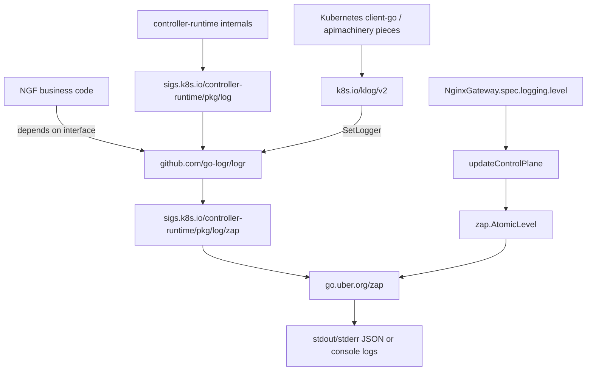
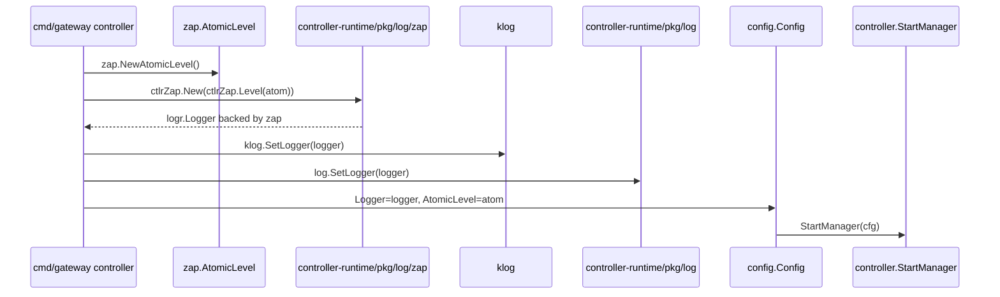
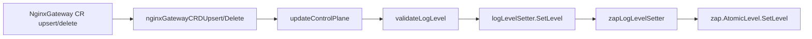

# NGF 日志包关系

> [!summary]
> NGF 的控制面日志统一使用 `logr.Logger` 这套接口；实际后端是 zap。`controller-runtime/pkg/log/zap` 是把 zap 包装成 `logr.Logger` 的适配器。`klog` 是 Kubernetes 生态里旧一些、但仍大量存在的日志入口，NGF 把同一个 `logr.Logger` 注册给它，目的是让 Kubernetes 依赖库的日志也进同一条输出链路。

## 先分清两类日志

NGF 代码里出现的 `logging` 不是一件事。

| 类别 | 位置 | 含义 | 相关包 |
|---|---|---|---|
| 控制面日志 | controller 自己运行时打印的日志 | Go 进程日志，例如启动、reconcile、事件处理、telemetry fallback | `logr`、zap、controller-runtime zap、klog |
| 数据面日志 | 生成给 NGINX 的日志配置 | NGINX access log、error log、WAF security log 等 | NGF 自己的 dataplane/config 类型，不是 Go logger |

控制面日志的入口是 [cmd/gateway/commands.go](/root/.workspace/middleware/nginx-k8s/nginx-gateway-fabric/cmd/gateway/commands.go:240)：

```go
atom := zap.NewAtomicLevel()
logger := ctlrZap.New(ctlrZap.Level(atom))
klog.SetLogger(logger)
log.SetLogger(logger)
```

数据面日志的例子是 [internal/controller/state/dataplane/types.go](/root/.workspace/middleware/nginx-k8s/nginx-gateway-fabric/internal/controller/state/dataplane/types.go:806)，这里的 `Logging` 是 NGINX 配置模型：

```go
type Logging struct {
    AccessLog *AccessLog
    ErrorLevel string
    ErrorLogFormat string
}
```

## 包之间的关系



## 每个包到底负责什么

### `github.com/go-logr/logr`

`logr` 是接口层，不负责真正写日志。NGF 绝大多数内部组件接收或保存的是 `logr.Logger`，例如：

- [internal/controller/config/config.go](/root/.workspace/middleware/nginx-k8s/nginx-gateway-fabric/internal/controller/config/config.go:20) 里 `Config.Logger logr.Logger`
- [internal/framework/events/loop.go](/root/.workspace/middleware/nginx-k8s/nginx-gateway-fabric/internal/framework/events/loop.go:70) 里通过 `WithName` 和 `WithValues` 给事件批次加上下文
- [internal/controller/telemetry/exporter.go](/root/.workspace/middleware/nginx-k8s/nginx-gateway-fabric/internal/controller/telemetry/exporter.go:31) 里 fallback telemetry exporter 直接 `logger.Info(...)`

可以把它理解成 Go 控制面代码里的标准日志门面：

```go
logger.Info("message", "key", value)
logger.Error(err, "message", "key", value)
logger.V(1).Info("debug message")
logger.WithName("component").WithValues("key", value)
```

`V(1)` 在 NGF 里基本就是 debug 语义。默认 `info` 级别不会输出 `V(1)`；当 `NginxGateway.spec.logging.level=debug` 时才会输出。

> [!note]
> 为什么 NGF 不直接用 zap，而要绕一层 logr？三个设计原因：
> 1. **解耦**：业务代码面向 `logr.Logger` 接口编程，测试时可以注入空 logger（`logr.Discard()`）或 fake logger，不依赖 zap 的具体实现类型。
> 2. **生态对齐**：controller-runtime 和 Kubernetes 生态以 `logr` 为标准日志接口。用 logr 才能无缝接入 controller-runtime 的日志体系，也让 `klog.SetLogger` 一行就能把 Kubernetes 底层日志接进来。
> 3. **可替换后端**：`logr.Logger` 是接口，理论上后端可以换成任何实现该接口的库（如 zerolog、logrus），虽然 NGF 实际只用 zap。
>
> 代价是多一层间接调用和 `V(n)` 语义的学习成本；换来的好处是业务代码与日志引擎解耦。

### `go.uber.org/zap`

zap 是实际日志引擎。它负责高性能结构化日志、日志级别判断、编码输出。

NGF 直接使用 zap 的地方不多，主要是需要 zap 特有能力时：

- [cmd/gateway/commands.go](/root/.workspace/middleware/nginx-k8s/nginx-gateway-fabric/cmd/gateway/commands.go:240) 创建 `zap.NewAtomicLevel()`
- [internal/controller/log_level_setters.go](/root/.workspace/middleware/nginx-k8s/nginx-gateway-fabric/internal/controller/log_level_setters.go:41) 保存 `zap.AtomicLevel`
- [internal/controller/log_level_setters.go](/root/.workspace/middleware/nginx-k8s/nginx-gateway-fabric/internal/controller/log_level_setters.go:52) 用 `zapcore.ParseLevel` 解析 `info/debug/error`

这里最关键的是 `zap.AtomicLevel`：它让日志级别可以在进程运行中动态修改，不需要重启 controller。

`zapLogLevelSetter` 除了 `SetLevel` 外还有一个 `Enabled(level) bool` 方法（[log_level_setters.go:63](/root/.workspace/middleware/nginx-k8s/nginx-gateway-fabric/internal/controller/log_level_setters.go:63)），用于查询某级别当前是否启用。它不属于 `logLevelSetter` 接口，是 `zapLogLevelSetter` 的附加能力——当业务需要提前判断"某个 V(1) 日志现在到底会不会输出"时可以调用它，避免构造开销大的日志参数。

### `sigs.k8s.io/controller-runtime/pkg/log/zap`

这个包容易让人误会，因为名字里也叫 `zap`。它不是 Uber 原生 zap 本体，而是 controller-runtime 提供的 zap 适配层。

NGF 在 [cmd/gateway/commands.go](/root/.workspace/middleware/nginx-k8s/nginx-gateway-fabric/cmd/gateway/commands.go:242) 这样创建 logger：

```go
logger := ctlrZap.New(ctlrZap.Level(atom))
```

含义是：

- 底层使用 zap。
- 对外返回 `logr.Logger`。
- 使用传入的 `zap.AtomicLevel` 控制日志级别。
- 和 controller-runtime 的日志风格兼容。

所以 `ctlrZap.New(...)` 是从“zap 后端”到“logr 接口”的桥。

### `sigs.k8s.io/controller-runtime/pkg/log`

这是 controller-runtime 的全局日志入口。NGF 在 [cmd/gateway/commands.go](/root/.workspace/middleware/nginx-k8s/nginx-gateway-fabric/cmd/gateway/commands.go:253) 调用：

```go
log.SetLogger(logger)
```

这样 controller-runtime 内部，以及依赖 controller-runtime 全局 logger 的代码，会使用 NGF 创建的同一个 logger。

注意：NGF 自己多数代码不需要从这个全局入口取 logger，而是显式把 `logger` 放进 `config.Config` 再传给各组件。这种显式传参更利于测试和组件隔离。

### `k8s.io/klog/v2`

`klog` 是 Kubernetes 生态的传统日志库。很多 Kubernetes 底层库仍可能通过 klog 打日志。

> [!note]
> 为什么 2024 年了还在用 klog？因为 `client-go`、`apimachinery` 等 Kubernetes 底层库内部直接调 `klog.*` 打日志，NGF 无法改这些上游库的行为。唯一能做的是用 `klog.SetLogger(logger)` 把 klog 桥接到自己的 `logr.Logger`，让所有日志走同一条输出链路，而不是让 Kubernetes 依赖库的日志另起一套格式、另写一个文件。

NGF 在 [cmd/gateway/commands.go](/root/.workspace/middleware/nginx-k8s/nginx-gateway-fabric/cmd/gateway/commands.go:243) 调用：

```go
klog.SetLogger(logger)
```

含义是把 klog 也接到同一个 `logr.Logger` 后端。这样 NGF 自己、controller-runtime、Kubernetes 底层库的日志不会各走各的输出格式。

## NGF 启动时的日志初始化



对应代码：

- 创建 `AtomicLevel` 和 logger：[cmd/gateway/commands.go](/root/.workspace/middleware/nginx-k8s/nginx-gateway-fabric/cmd/gateway/commands.go:240)
- 保存到 controller config：[cmd/gateway/commands.go](/root/.workspace/middleware/nginx-k8s/nginx-gateway-fabric/cmd/gateway/commands.go:297)
- `Config` 字段定义：[internal/controller/config/config.go](/root/.workspace/middleware/nginx-k8s/nginx-gateway-fabric/internal/controller/config/config.go:16)

## 动态修改日志级别

NGF 通过 `NginxGateway` CRD 调整控制面日志级别。

CRD 字段定义在 [apis/v1alpha1/nginxgateway_types.go](/root/.workspace/middleware/nginx-k8s/nginx-gateway-fabric/apis/v1alpha1/nginxgateway_types.go:33)：

```go
type NginxGatewaySpec struct {
    Logging *Logging `json:"logging,omitempty"`
}

type Logging struct {
    Level *ControllerLogLevel `json:"level,omitempty"`
}
```

支持值：

```go
info
debug
error
```

处理链路：



关键代码：

- 事件入口：[internal/controller/handler.go](/root/.workspace/middleware/nginx-k8s/nginx-gateway-fabric/internal/controller/handler.go:1343)
- 默认值和校验：[internal/controller/config_updater.go](/root/.workspace/middleware/nginx-k8s/nginx-gateway-fabric/internal/controller/config_updater.go:27)
- 实际设置级别：[internal/controller/config_updater.go](/root/.workspace/middleware/nginx-k8s/nginx-gateway-fabric/internal/controller/config_updater.go:69)
- zap setter：[internal/controller/log_level_setters.go](/root/.workspace/middleware/nginx-k8s/nginx-gateway-fabric/internal/controller/log_level_setters.go:52)

`StartManager` 里创建 setter：[internal/controller/manager.go](/root/.workspace/middleware/nginx-k8s/nginx-gateway-fabric/internal/controller/manager.go:136)

```go
logLevelSetter := newMultiLogLevelSetter(newZapLogLevelSetter(cfg.AtomicLevel))
```

现在只有一个 zap setter，但做成 `multiLogLevelSetter` 后，将来如果还有别的日志后端或独立日志系统，也可以一起设置级别。

`logLevelSetter` 从创建到最终被调用的完整传递路径：

```text
manager.go:136   newMultiLogLevelSetter(newZapLogLevelSetter(cfg.AtomicLevel))
       ↓
manager.go:146   registerControllers(ctx, cfg, mgr, recorder, logLevelSetter, ...)
       ↓
handler config   eventHandlerConfig.logLevelSetter = logLevelSetter  (构造 eventHandlerImpl 时传入)
       ↓
handler.go       nginxGatewayCRDUpsert → updateControlPlaneAndSetStatus → updateControlPlane(..., logLevelSetter)
       ↓
config_updater.go:69   logLevelSetter.SetLevel(string(level))
       ↓ (动态分发到 multiLogLevelSetter.SetLevel)
log_level_setters.go:28   遍历每个 setter，调 zapLogLevelSetter.SetLevel
       ↓
log_level_setters.go:57   z.atomicLevel.SetLevel(parsedLevel)  ← 真正改 zap 级别的地方
```

这样 `NginxGateway` CR 的级别变更就闭环到了 zap 的 `AtomicLevel`，无需重启 controller。

## 为什么看起来包很多

原因不是 NGF 同时用了很多套日志系统，而是 Kubernetes Go 生态天然分层：

| 你看到的包 | 实际角色 | 一句话理解 |
|---|---|---|
| `logr` | API/interface | NGF 代码面向它写日志 |
| Uber `zap` | backend/engine | 真正决定怎么编码、怎么过滤、怎么输出 |
| controller-runtime `log/zap` | adapter | 把 zap 包装成 `logr.Logger` |
| controller-runtime `log` | global registry | 给 controller-runtime 内部设置全局 logger |
| `klog` | Kubernetes legacy entrypoint | 给 Kubernetes 底层库接入同一个 logger |

最终只有一条主线：

```text
NGF code -> logr.Logger -> controller-runtime zap adapter -> Uber zap -> output
Kubernetes libs -> klog -> logr.Logger -> controller-runtime zap adapter -> Uber zap -> output
controller-runtime -> controller-runtime log -> logr.Logger -> controller-runtime zap adapter -> Uber zap -> output
```

## 日志级别语义

NGF 的 `NginxGateway.spec.logging.level` 和 zap/logr 的对应关系可以按下面理解：

| CRD 值 | zap level | NGF 中的效果 |
|---|---|---|
| `debug` | debug | 输出 `logger.V(1).Info(...)` 这类调试日志 |
| `info` | info | 输出普通 `logger.Info(...)` 和 error |
| `error` | error | 主要只输出 `logger.Error(...)` |

`logr` 的 `V(n)` 是 verbosity，不直接叫 debug；controller-runtime zap 适配器会把 verbosity 映射到底层 zap level。NGF 对用户暴露的是更常见的 `debug/info/error`。

> [!note]
> controller-runtime zap adapter 的 `V(n)` 映射规则（理解"为什么改 CRD 级别能控制 `V(1)` 输出"的关键）：
>
> | logr 调用 | 映射到的 zap level | 说明 |
> |---|---|---|
> | `logger.Info(...)` / `logger.V(0).Info(...)` | zap info | 常规信息日志 |
> | `logger.V(1).Info(...)` 及以上 | zap debug | 调试日志，需要 zap level ≤ debug 才输出 |
> | `logger.Error(err, ...)` | zap error | 错误日志，几乎总会输出 |
>
> 当 `NginxGateway.spec.logging.level=info` 时，`zap.AtomicLevel` 设为 info，zap 会过滤掉 debug 级别，于是所有 `V(1).Info(...)` 都不输出；改成 `debug` 后，`zap.AtomicLevel.SetLevel(debug)` 把级别降到 debug，`V(1).Info(...)` 才通过 zap 的级别判断被输出。这就是"改一行 CRD 字段就能动态开关调试日志"的底层原理。

## 控制面日志和 NGINX 日志不要混淆

### 控制面日志

控制面日志由 Go 进程打印，用来观察 controller 行为：

- manager 启停
- Kubernetes 事件处理
- 资源解析和配置生成
- NGINX agent 连接
- telemetry fallback 输出

这些日志受 `NginxGateway.spec.logging.level` 影响。

### NGINX 数据面日志

数据面日志是生成到 NGINX 配置里的日志行为。例如 [internal/controller/nginx/config/base_http_config.go](/root/.workspace/middleware/nginx-k8s/nginx-gateway-fabric/internal/controller/nginx/config/base_http_config.go:207) 的 `buildAccessLog` 会把 dataplane 的 `AccessLog` 转成 NGINX 配置模型。

这些日志不是通过 `logr`、zap、klog 打出来的。它们最终由 NGINX 进程按 NGINX 配置写入 stdout、stderr、文件或 syslog。

## 阅读代码时的判断规则

> [!tip]
> 看到 `logr.Logger`，先理解为“组件收到一个抽象 logger”。它不说明底层一定是 zap，但在 NGF 正常运行时底层就是 zap。

> [!tip]
> 看到 `ctlrZap.New(...)`，理解为“创建一个 zap-backed logr logger”。它是初始化点，不是业务代码里常用的 logger 类型。

> [!tip]
> 看到 `zap.AtomicLevel`，说明代码关心动态调级别。NGF 把它保存在 `config.Config.AtomicLevel`，由 `NginxGateway` CRD 更新。

> [!tip]
> 看到 `klog.SetLogger(logger)`，理解为“把 Kubernetes 底层日志桥接过来”。NGF 业务代码一般不直接用 klog。

> [!warning]
> 看到 `Logging` 类型时要看包路径。`apis/v1alpha1.Logging` 是控制面 CRD 日志级别；`internal/controller/state/dataplane.Logging` 是 NGINX 数据面日志配置。

> [!warning]
> [config.go:20](/root/.workspace/middleware/nginx-k8s/nginx-gateway-fabric/internal/controller/config/config.go:20) 的字段注释写的是 `// Logger is the Zap Logger used by all components.`，但实际类型是 `logr.Logger`，不是 zap 的 `*zap.Logger`。这个注释本身是不准确的——它描述的是底层实现，而非字段的声明类型。读代码时以类型签名为准：`Logger logr.Logger`。这也正是本文档反复强调"面向 `logr.Logger` 接口编程"的原因。

## 最小心智模型

如果只记一件事，记这条链：

```text
业务代码都用 logr.Logger；
NGF 启动时用 controller-runtime 的 zap adapter 创建 logr.Logger；
底层实际是 Uber zap；
klog 和 controller-runtime 全局 log 都被设置成同一个 logger；
NginxGateway.spec.logging.level 通过 zap.AtomicLevel 动态改变控制面日志级别。
```

