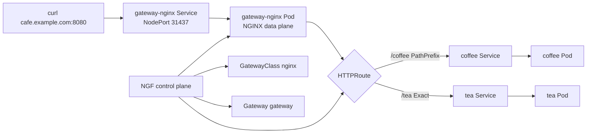
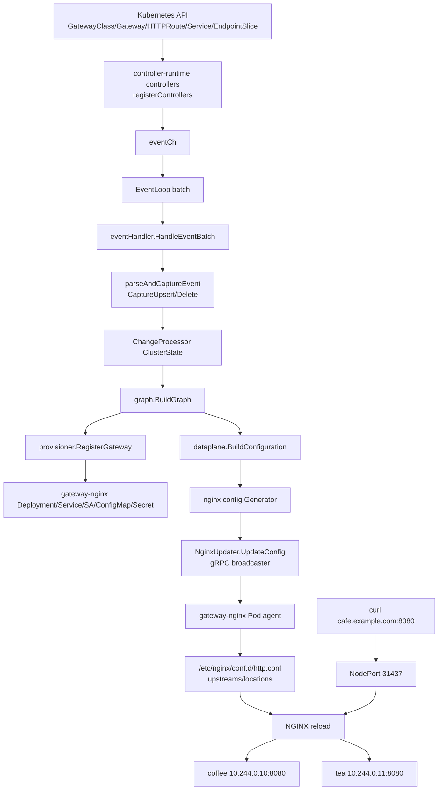

# NGINX Gateway Fabric 官方部署与 Cafe Demo

> [!info]
> 这份文档按 NGINX Gateway Fabric 官方 Get started / Helm 部署文档串起一次可复现 demo：创建 kind 集群、安装 Gateway API CRD、安装 NGF、部署 cafe 示例、验证 HTTPRoute。

## 参考资料

- 官方安装入口：[Install NGINX Gateway Fabric](https://docs.nginx.com/nginx-gateway-fabric/install/)
- 官方快速开始：[Get started](https://docs.nginx.com/nginx-gateway-fabric/get-started/)
- 官方 Helm 安装：[Install NGINX Gateway Fabric with Helm](https://docs.nginx.com/nginx-gateway-fabric/install/helm/)
- 官方数据面说明：[Deploy a Gateway for data plane instances](https://docs.nginx.com/nginx-gateway-fabric/install/deploy-data-plane/)
- 仓库示例：`examples/cafe-example/`

## 本次环境

```text
项目路径：/root/.workspace/middleware/nginx-k8s/nginx-gateway-fabric
NGINX Gateway Fabric：2.6.5
kind：v0.29.0
Kubernetes kind 节点镜像：kindest/node:v1.31.0
kind context：kind-ngf-demo
本机 HTTP 测试端口：8080 -> kind NodePort 31437
```

> [!warning]
> 当前宿主机已有 Kubernetes 集群是 v1.29.9，而仓库 chart `kubeVersion` 要求 `>= 1.31.0-0`。因此没有部署到现有集群，而是按官方 Get started 创建独立 kind 集群。

## 1. 创建 kind 集群

如果机器没有 `kind`，可临时安装到 `/tmp/ngf-demo-bin`：

```bash
mkdir -p /tmp/ngf-demo-bin
curl -fsSL -o /tmp/ngf-demo-bin/kind https://kind.sigs.k8s.io/dl/v0.29.0/kind-linux-amd64
chmod +x /tmp/ngf-demo-bin/kind
/tmp/ngf-demo-bin/kind version
```

创建 kind 配置，映射官方 demo 使用的 NodePort：

```bash
cat > /tmp/ngf-kind-cluster.yaml <<'EOF'
apiVersion: kind.x-k8s.io/v1alpha4
kind: Cluster
nodes:
  - role: control-plane
    extraPortMappings:
      - containerPort: 31437
        hostPort: 8080
        protocol: TCP
      - containerPort: 30478
        hostPort: 8443
        protocol: TCP
EOF

/tmp/ngf-demo-bin/kind create cluster \
  --name ngf-demo \
  --config /tmp/ngf-kind-cluster.yaml \
  --image kindest/node:v1.31.0
```

确认 context：

```bash
kubectl config current-context
kubectl get nodes -o wide
```

期望 context：

```text
kind-ngf-demo
```

## 2. 安装 Gateway API CRD

```bash
kubectl kustomize "https://github.com/nginx/nginx-gateway-fabric/config/crd/gateway-api/standard?ref=v2.6.5" \
  | kubectl apply -f -
```

## 3. 安装 NGINX Gateway Fabric

按官方 Helm 文档安装，并设置 NodePort 与 kind 端口映射一致：

```bash
helm install ngf oci://ghcr.io/nginx/charts/nginx-gateway-fabric \
  --create-namespace \
  -n nginx-gateway \
  --wait \
  --set nginx.service.type=NodePort \
  --set-json 'nginx.service.nodePorts=[{"port":31437,"listenerPort":80}, {"port":30478,"listenerPort":8443}]'
```

验证控制面：

```bash
helm status ngf -n nginx-gateway
kubectl -n nginx-gateway get pods,svc,gatewayclass -o wide
```

本次结果要点：

```text
Helm release: ngf
Status: deployed
Control plane pod: ngf-nginx-gateway-fabric-647df8fcfd-kffz4 1/1 Running
GatewayClass: nginx Accepted=True
```

## 4. 处理 kind 节点镜像拉取代理问题

本机环境里 kind 节点的 containerd 使用了不可达代理 `127.0.0.1:10808`，Pod 不能直接拉 GHCR / Docker Hub 镜像。解决方式是宿主 Docker 先拉镜像，再加载进 kind。

```bash
docker pull ghcr.io/nginx/nginx-gateway-fabric:2.6.5
/tmp/ngf-demo-bin/kind load docker-image ghcr.io/nginx/nginx-gateway-fabric:2.6.5 --name ngf-demo

docker pull ghcr.io/nginx/nginx-gateway-fabric/nginx:2.6.5
/tmp/ngf-demo-bin/kind load docker-image ghcr.io/nginx/nginx-gateway-fabric/nginx:2.6.5 --name ngf-demo

docker pull nginxdemos/nginx-hello:plain-text
/tmp/ngf-demo-bin/kind load docker-image nginxdemos/nginx-hello:plain-text --name ngf-demo
```

> [!tip]
> 如果你的 kind 节点能直接访问镜像仓库，可以跳过这一节。

## 5. 部署 Cafe Demo

使用仓库内官方示例：

```bash
kubectl apply -f examples/cafe-example/cafe.yaml
kubectl apply -f examples/cafe-example/gateway.yaml
kubectl apply -f examples/cafe-example/cafe-routes.yaml
```

如果 demo Pod 已经因镜像拉取失败进入 `ImagePullBackOff`，加载镜像后重建 Pod：

```bash
kubectl delete pod -l app=coffee
kubectl delete pod -l app=tea
```

等待就绪：

```bash
kubectl wait --for=condition=Ready pod -l app=coffee --timeout=180s
kubectl wait --for=condition=Ready pod -l app=tea --timeout=180s
kubectl get pods,svc,gateway,httproute -o wide
```

本次结果：

```text
pod/coffee-6db967495b-l8fs5          1/1 Running
pod/gateway-nginx-5f95f75958-tn9fw   1/1 Running
pod/tea-7b7d6c947d-f7jbm             1/1 Running

service/gateway-nginx NodePort 80:31437/TCP
gateway/gateway CLASS=nginx PROGRAMMED=True
httproute/coffee HOSTNAMES=["cafe.example.com"]
httproute/tea    HOSTNAMES=["cafe.example.com"]
```

## 6. 验证 Gateway 与 HTTPRoute 状态

```bash
kubectl describe gateway gateway
kubectl describe httproute coffee tea
```

关键状态：

```text
Gateway Accepted=True
Gateway Programmed=True
Listener Attached Routes=2
HTTPRoute coffee Accepted=True ResolvedRefs=True
HTTPRoute tea    Accepted=True ResolvedRefs=True
```

## 7. 访问 Demo

因为 kind 配置把宿主 `8080` 映射到集群 NodePort `31437`，可以直接从本机请求：

```bash
curl --noproxy '*' \
  --resolve cafe.example.com:8080:127.0.0.1 \
  http://cafe.example.com:8080/coffee

curl --noproxy '*' \
  --resolve cafe.example.com:8080:127.0.0.1 \
  http://cafe.example.com:8080/tea
```

本次验证输出：

```text
Server address: 10.244.0.10:8080
Server name: coffee-6db967495b-l8fs5
Date: 24/Jun/2026:02:43:11 +0000
URI: /coffee
Request ID: 17470fe27e653597cb025a356e99a869

Server address: 10.244.0.11:8080
Server name: tea-7b7d6c947d-f7jbm
Date: 24/Jun/2026:02:43:11 +0000
URI: /tea
Request ID: a8475845dc90c41bd7e0493c72bfd12a
```

> [!note]
> `--noproxy '*'` 是为了绕开本机代理环境变量。没有代理环境时可省略。

## 8. 这条链路串起来的资源关系



## 9. 源码实现视角：NGF 如何把 Gateway API 变成 NGINX 配置

> [!summary]
> 从源码看，NGF 的核心链路是：controller-runtime watch Kubernetes 对象 -> 事件批处理 -> 内存态 `ClusterState` -> Gateway API `Graph` -> data plane `Configuration` -> NGINX 配置文件 -> 通过内置 NGINX agent 下发到 `gateway-nginx` Pod 并 reload。

### 9.1 当前部署状态作为分析锚点

本次分析对照的实际集群状态：

```text
context: kind-ngf-demo
control plane:
  namespace: nginx-gateway
  deployment: ngf-nginx-gateway-fabric
  image: ghcr.io/nginx/nginx-gateway-fabric:2.6.5
  pod: ngf-nginx-gateway-fabric-647df8fcfd-kffz4

data plane:
  namespace: default
  deployment: gateway-nginx
  image: ghcr.io/nginx/nginx-gateway-fabric/nginx:2.6.5
  pod: gateway-nginx-5f95f75958-tn9fw
  service: gateway-nginx NodePort 80:31437/TCP

Gateway API:
  GatewayClass nginx: Accepted=True
  Gateway default/gateway: Accepted=True, Programmed=True
  Listener http: attachedRoutes=2
  HTTPRoute default/coffee: Accepted=True, ResolvedRefs=True
  HTTPRoute default/tea: Accepted=True, ResolvedRefs=True
```

当前 EndpointSlice 也能说明后端解析结果：

```text
coffee -> 10.244.0.10:8080
tea    -> 10.244.0.11:8080
```

### 9.2 控制面启动：`StartManager`

入口核心在 `internal/controller/manager.go:126` 的 `StartManager(cfg config.Config)`。

它做了几件关键事：

- 创建 controller-runtime `manager`，启用 health、metrics、leader election 等运行时能力：`internal/controller/manager.go:126-146`、`internal/controller/manager.go:509-564`。
- 注册所有需要 watch 的控制器：`registerControllers(...)`，事件统一写入 `eventCh`：`internal/controller/manager.go:146`、`internal/controller/manager.go:789-1053`。
- 创建 `ChangeProcessor`，它持有内存中的 `ClusterState`，后续所有 Kubernetes 对象变更都会先进入这里：`internal/controller/manager.go:166-194`。
- 创建 NGINX agent gRPC 服务和 `NginxUpdater`：`internal/controller/manager.go:210`、`internal/controller/manager.go:303-341`。
- 创建 provisioner，用来为每个 Gateway 生成/维护对应的数据面 Kubernetes 资源：`internal/controller/manager.go:215`、`internal/controller/manager.go:343-389`。
- 创建 `eventHandler` 和 `EventLoop`，并注册到 manager：`internal/controller/manager.go:222-264`。

控制面日志也印证了这条启动链：

```text
Starting the NGINX Gateway Fabric control plane
Starting manager
Attempting to acquire leader lease...
Successfully acquired lease
```

### 9.3 Kubernetes watch：哪些资源会触发重算

`registerControllers` 里把 Gateway API、Kubernetes Service/Secret/EndpointSlice，以及 NGF 自有策略对象都注册成 controller-runtime controller。当前 cafe demo 直接相关的是：

- `GatewayClass`：只接收 `controllerName == gateway.nginx.org/nginx-gateway-controller` 的对象，见 `GatewayClassPredicate`：`internal/controller/manager.go:806-816`、`internal/framework/controller/predicate/gatewayclass.go:9-61`。
- `Gateway`：generation 变化触发：`internal/controller/manager.go:817-825`。
- `HTTPRoute`：generation 变化触发：`internal/controller/manager.go:826-831`。
- `Service`：通过 `ServiceChangedPredicate` 过滤：`internal/controller/manager.go:835-841`。
- `EndpointSlice`：通过 generation 变化和 field index 触发：`internal/controller/manager.go:848-854`。
- `Namespace`、`Secret`、`ConfigMap` 等引用资源也会进入同一套事件流：`internal/controller/manager.go:832-860`。

这里的设计重点是：NGF 不只是监听 `Gateway` 和 `HTTPRoute`。后端 Service 或 EndpointSlice 变化也会导致 graph/config 重算，所以 Pod IP 改变后 NGINX upstream 能随之更新。

### 9.4 事件批处理：从事件到 `ClusterState`

事件进入 `EventLoop` 后，批量交给 `eventHandlerImpl.HandleEventBatch`：

```go
for _, event := range batch {
    h.parseAndCaptureEvent(ctx, logger, event)
}

gr := h.cfg.processor.Process(ctx)
h.sendNginxConfig(ctx, logger, gr)
```

对应源码在 `internal/controller/handler.go:189-214`。

`parseAndCaptureEvent` 会按事件类型写入 `ChangeProcessor`：

- `UpsertEvent` -> `CaptureUpsertChange(e.Resource)`：`internal/controller/handler.go:832-842`。
- `DeleteEvent` -> `CaptureDeleteChange(e.Type, e.NamespacedName)`：`internal/controller/handler.go:843-853`。
- WAF bundle 特殊事件会调用 `ForceRebuild()`，触发无资源变更的 graph rebuild：`internal/controller/handler.go:854-872`。

`ChangeProcessor` 内部维护一个 `ClusterState`，其中包括 `GatewayClasses`、`Gateways`、`HTTPRoutes`、`Services`、`EndpointSlices` 相关引用、`Secrets`、`ReferenceGrants`、NGF policy 等资源集合。初始化位置在 `internal/controller/state/change_processor.go:115-145`。

### 9.5 Graph 构建：Gateway API 语义校验和绑定

`ChangeProcessorImpl.Process` 只有在捕获到变更时才重建 graph：

```go
if !c.getAndResetClusterStateChanged() {
    return nil
}

c.latestGraph = graph.BuildGraph(...)
```

对应源码在 `internal/controller/state/change_processor.go:360-385`。

真正的 Gateway API 语义转换发生在 `graph.BuildGraph`：`internal/controller/state/graph/graph.go:255-440`。主要步骤是：

- 处理 GatewayClass，并确认当前控制器是否应该接管它：`internal/controller/state/graph/graph.go:269-289`。
- 处理 Gateway 和 NginxProxy，得到有效的数据面设置：`internal/controller/state/graph/graph.go:275-300`。
- 解析 ListenerSet、BackendTLSPolicy、SnippetsFilter、AuthenticationFilter：`internal/controller/state/graph/graph.go:302-320`。
- 构建 HTTPRoute/GRPCRoute，并把 route 绑定到 Gateway listener：`internal/controller/state/graph/graph.go:321-360`。
- 计算被引用的 Namespace、Service、Secret、ConfigMap 等：`internal/controller/state/graph/graph.go:362-367`。
- 最后处理 policy，因为 policy 依赖 route、gateway、service 的绑定结果：`internal/controller/state/graph/graph.go:383-397`。

在当前 demo 中，Graph 的关键结果可以对应到 Kubernetes 状态：

```text
GatewayClass nginx
  -> Gateway default/gateway
    -> Listener http, port 80, hostname *.example.com
      -> HTTPRoute coffee, hostname cafe.example.com, PathPrefix /coffee
      -> HTTPRoute tea, hostname cafe.example.com, Exact /tea
        -> Service coffee/tea
          -> EndpointSlice pod IP: 10.244.0.10 / 10.244.0.11
```

### 9.6 Provisioner：为 Gateway 创建数据面 Deployment/Service

`sendNginxConfig` 会先调用 provisioner 注册 Gateway：

```go
h.cfg.nginxProvisioner.RegisterGateway(ctx, gw, gw.DeploymentName.Name)
```

源码在 `internal/controller/handler.go:249-254`。

这一步创建或更新数据面所需的 Kubernetes 资源。当前集群日志中能看到：

```text
Creating/Updating nginx resources
resource names:
  gateway-nginx-agent-tls (Secret)
  gateway-nginx-includes-bootstrap (ConfigMap)
  gateway-nginx-agent-config (ConfigMap)
  gateway-nginx (ServiceAccount)
  gateway-nginx (Service)
  gateway-nginx (Deployment)
```

实际 `gateway-nginx` Deployment 的几个关键点：

- ownerReference 指向 `Gateway default/gateway`。
- 容器镜像是 `ghcr.io/nginx/nginx-gateway-fabric/nginx:2.6.5`。
- init container 使用 `ghcr.io/nginx/nginx-gateway-fabric:2.6.5` 执行 `/usr/bin/gateway initialize`，把 agent 配置和 bootstrap include 文件写入 emptyDir。
- NGINX 配置目录挂载为 emptyDir，例如 `/etc/nginx/conf.d`、`/etc/nginx/stream-conf.d`、`/etc/nginx/main-includes`、`/etc/nginx/events-includes`。
- Service `gateway-nginx` 是 NodePort，`80:31437/TCP`，selector 带有 `gateway.networking.k8s.io/gateway-name=gateway`。

### 9.7 从 Graph 到 data plane `Configuration`

当 Gateway 有有效 listener 时，`sendNginxConfig` 调用：

```go
cfg := dataplane.BuildConfiguration(ctx, logger, gr, gw, h.cfg.serviceResolver, h.cfg.plus)
```

源码在 `internal/controller/handler.go:297`。

`BuildConfiguration` 位于 `internal/controller/state/dataplane/configuration.go:65-172`，它把 graph 转成更接近 NGINX 的内部模型：

- `buildServers(...)` 根据 listener、hostname、route path 生成 HTTP/HTTPS virtual server：`internal/controller/state/dataplane/configuration.go:93-97`、`internal/controller/state/dataplane/configuration.go:1308-1363`。
- `buildUpstreams(...)` 遍历 listener 上绑定的 route/rule/backendRef，解析 Service endpoint 并去重生成 upstream：`internal/controller/state/dataplane/configuration.go:111-117`、`internal/controller/state/dataplane/configuration.go:1650-1711`。
- 同时生成 TLS、TCP/UDP、证书 bundle、认证、日志、policy、WAF 等配置片段：`internal/controller/state/dataplane/configuration.go:119-169`。

对 cafe demo 来说，最重要的是：

- HTTP listener `*.example.com:80` 产生 `server_name cafe.example.com`。
- `PathPrefix /coffee` 会变成两个 location：`/coffee/` 和 `= /coffee`，保证前缀路径和无尾斜杠路径都能命中。
- `Exact /tea` 会变成 `location = /tea`。
- Service backend 解析成 `default_coffee_80`、`default_tea_80` upstream。

### 9.8 从 `Configuration` 到 NGINX 文件

`eventHandlerImpl.updateNginxConf` 负责最后的配置生成和下发：

```go
files := h.cfg.generator.Generate(conf)
h.cfg.nginxUpdater.UpdateConfig(deployment, files, volumeMounts)
```

源码在 `internal/controller/handler.go:879-890`。

`GeneratorImpl.Generate` 做了两类输出：

- 证书、WAF bundle、认证 secret 等文件。
- 通过模板生成 NGINX 配置文件。

对应源码在 `internal/controller/nginx/config/generator.go:125-158`。

模板执行由 `executeConfigTemplates` 完成，它生成 main、events、base HTTP、server、upstream、map、telemetry、stream、Plus API 等文件：`internal/controller/nginx/config/generator.go:182-238`。

`NginxUpdaterImpl.UpdateConfig` 不直接写 Pod 文件，而是通过 agent 通信：

1. `deployment.SetFiles(files, volumeMounts)` 记录目标文件和 hash。
2. broadcaster 把文件 metadata 广播给该 Gateway 对应的 NGINX Pod 订阅者。
3. Pod 内 agent 收到 `ConfigApplyRequest`。
4. agent 再调用控制面 `GetFile` 拉取具体文件内容。
5. agent 写文件、测试/应用 NGINX 配置并返回状态。

这段流程直接写在 `internal/controller/nginx/agent/agent.go:78-105` 的注释和实现中。

控制面日志也能证明 agent 下发链路已经发生：

```text
Creating connection for nginx pod: gateway-nginx-5f95f75958-tn9fw
Successfully connected to nginx agent
Sending initial configuration to agent
Successfully configured nginx for new subscription
Sent nginx configuration to agent
NGINX configuration was successfully updated
```

### 9.9 当前 Pod 内实际生成的 NGINX 配置

在 `gateway-nginx` Pod 内执行 `nginx -T`，可以看到源码链路最终产物：

```nginx
server {
    listen 80;
    listen [::]:80;

    server_name cafe.example.com;

    location /coffee/ {
        proxy_pass http://default_coffee_80;
    }

    location = /coffee {
        proxy_pass http://default_coffee_80;
    }

    location = /tea {
        proxy_pass http://default_tea_80;
    }

    location = / {
        return 404 "";
    }
}

upstream default_coffee_80 {
    random two least_conn;
    zone default_coffee_80 512k;
    server 10.244.0.10:8080;
    keepalive 16;
}

upstream default_tea_80 {
    random two least_conn;
    zone default_tea_80 512k;
    server 10.244.0.11:8080;
    keepalive 16;
}
```

这和当前 Kubernetes 对象完全对上：

- `HTTPRoute coffee` 的 `PathPrefix /coffee` -> `/coffee/` 和 `= /coffee`。
- `HTTPRoute tea` 的 `Exact /tea` -> `= /tea`。
- `Service coffee` 的 EndpointSlice `10.244.0.10:8080` -> `upstream default_coffee_80`。
- `Service tea` 的 EndpointSlice `10.244.0.11:8080` -> `upstream default_tea_80`。
- Gateway listener `hostname: *.example.com` 和 route hostname `cafe.example.com` -> `server_name cafe.example.com`。

### 9.10 端到端工作流图



### 9.11 一句话总结

NGF 本质上是一个 Gateway API 到 NGINX 配置的持续编译器：Kubernetes 对象变化是输入，`Graph` 是语义绑定和校验后的中间表示，`dataplane.Configuration` 是面向 NGINX 的中间表示，最后通过 NGINX agent 把模板生成的配置文件推送到数据面 Pod。当前 cafe demo 的 `curl /coffee`、`curl /tea` 能通，是因为这条链路最终在 `gateway-nginx` Pod 里生成了 `server_name cafe.example.com`、对应 location 和指向 coffee/tea Pod IP 的 upstream。

## 10. 清理

只清理 demo 资源：

```bash
kubectl delete -f examples/cafe-example/cafe-routes.yaml
kubectl delete -f examples/cafe-example/gateway.yaml
kubectl delete -f examples/cafe-example/cafe.yaml
```

卸载 NGF：

```bash
helm uninstall ngf -n nginx-gateway
kubectl delete namespace nginx-gateway
```

删除整个 kind demo 集群：

```bash
/tmp/ngf-demo-bin/kind delete cluster --name ngf-demo
```
