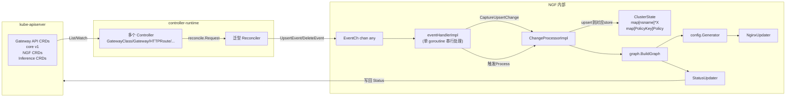

---
tags:
  - nginx-gateway-fabric
  - kubernetes
  - operator
  - controller-runtime
  - GVK
  - scheme
  - obsidian
aliases:
  - NGF Operator 开发指南
  - NGF GVK 实践
created: 2026-07-09
source_code:
  repo: /root/.workspace/middleware/nginx-k8s/nginx-gateway-fabric
  commit: main@HEAD
---

# NGF Operator 开发基础：GVK / Scheme / Client 实践

> [!info] 文档定位
> 本文从 NGINX Gateway Fabric（NGF）源码出发，提炼 K8s operator 开发中**最核心**的基础原语：GVK、GVR、Scheme、runtime.Object、client.Client、controller-runtime 注册模式、Reconciler 范式、OwnerReferences、GVK 派发等。
> 适合作为"如何写一个生产级 operator"的参考蓝本，所有结论均锚定到具体 `文件:行号`，可逐条溯源。

> [!tip] 阅读对象
> - 已熟悉 Go，但刚接触 K8s controller-runtime 的开发者
> - 想"抄"NGF 这类大厂 operator 的最佳实践到自己项目里
> - 准备 review 或贡献 NGF 代码的贡献者

## 核心结论（一句话）

NGF 呈现一种 **"薄 controller / 胖 graph"** 的 operator 风格：所有 controller 共享同一个泛型 `Reconciler`，每个 controller 只负责把 *一种* 资源的 Upsert/Delete 事件转成 `events.UpsertEvent`/`events.DeleteEvent` 投到全局事件队列；**GVK 是贯穿全局的路由键**——既是 cache/client 的类型选择器、又是 store map 的 key、又是 graph 处理时的派发键。**GVR 和 dynamic.Interface 在生产代码里完全缺席**，第三方 CRD（如 F5 App Protect）通过 `unstructured.Unstructured` + 显式 GVK 处理。

---

## 一、为什么要先搞懂 GVK / GVR？

### 1.1 一组概念关系

```
GroupVersionKind(GVK)    ──┐
                          │  共同描述一个 K8s "资源的种类"
GroupVersionResource(GVR)─┘

GVK  ↔ GVR  通过 etcd 的 RESTMapper 转换
       (GVK 是 controller 端的概念           — 我拿到一个对象，知道它是 v1.Gateway)
       (GVR 是 apiserver 端 / REST 路径的概念 — 我向 /apis/gateway.networking.k8s.io/v1/gateways 发请求)

runtime.Object           — 任何 Go 资源都实现此接口
schema.ObjectKind        — 只有 GroupVersionKind() / SetGroupVersionKind() 两方法
                             unstructured.Unstructured 的"伪装 GVK"就是靠它
Scheme                   — runtime.Scheme：注册表，记录 "GVK ↔ Go 类型" 的双向映射

client.Object             — controller-runtime 的最小客户端对象接口
                             = runtime.Object + metav1.Object
```

### 1.2 用 GVK 还是 GVR，取决于客户端类型

| 客户端                  | 用什么定位资源       | NGF 是否使用 |
| ----------------------- | -------------------- | ------------ |
| `client.Client` (sigs)  | `client.Object` + Scheme 推 GVK | ✅ 主力 |
| `dynamic.Interface`      | GVR                   | ❌ 全程缺席 |
| `typed clientset`        | generated xxxInterface | ❌ 不写     |
| `unstructured.Unstructured` | `SetGroupVersionKind(gvk)` 手动塞 | ✅ App Protect |

> [!important] NGF 的取舍
> GVR 是**动态客户端（dynamic.Interface）**的入口参数。NGF 全程不用 dynamic client，只使用 `controller-runtime` 提供的 typed `client.Client`。需要处理外部 CRD（F5 AppProtect 的 `APPolicy`、`APLogConf`）时，它选择把这两个 GVK **手动注册进 Scheme** + 用 `unstructured.Unstructured` 持有对象——比引入 dynamic client 路径短得多。源代码全仓搜索 `schema.GroupVersionResource{` 只在错误构造里出现一次（`internal/controller/handler_test.go:1349` 的 `v1.Resource("service")`），那其实是 `GroupResource` 而非 GVR。

---

## 二、GVK 的 NGF 实践范式

### 2.1 把 GVK 抽到中央常量库

NGF 集中维护所有 Kind 名和那些"无法用 typed struct 表达的"GVK 字面量：

`internal/framework/kinds/kinds.go:13-66`

```go
// Gateway API Kinds.
const (
    Gateway          = "Gateway"
    GatewayClass     = "GatewayClass"
    HTTPRoute        = "HTTPRoute"
    GRPCRoute        = "GRPCRoute"
    // ...
    BackendTLSPolicy = "BackendTLSPolicy"
)

// PLM (Policy Lifecycle Manager) kinds.
const (
    APPolicy  = "APPolicy"   // appprotect.f5.com/v1
    APLogConf = "APLogConf"
)

var (
    // APPolicyGVK is the GroupVersionKind for the APPolicy resource.
    APPolicyGVK = schema.GroupVersionKind{Group: "appprotect.f5.com", Version: "v1", Kind: APPolicy}
    APLogConfGVK = schema.GroupVersionKind{Group: "appprotect.f5.com", Version: "v1", Kind: APLogConf}
)
```

> [!note] 为什么单独定义 APPolicyGVK？
> 大部分 typed 资源的 GVK 可由 Scheme 推导（见 §3 的 `apiutil.GVKForObject`），但 `unstructured.Unstructured` 是空壳子，没有 Go 类型名作线索，**必须显式持有字面量**。这是 NGF 处理任意第三方 CRD 的统一姿势。

配套工厂构造（`kinds.go:68-102`）：

```go
func NewAPPolicyObject() *unstructured.Unstructured {
    obj := &unstructured.Unstructured{}
    obj.SetGroupVersionKind(APPolicyGVK)
    return obj
}
```

### 2.2 把"GVK 提取"做成可注入的函数类型

NGF 不直接调用 `apiutil.GVKForObject`，而是把它包装成一种**依赖类型**到处传：

`internal/framework/kinds/kinds.go:128-142`

```go
type MustExtractGVK func(object client.Object) schema.GroupVersionKind

func NewMustExtractGKV(scheme *runtime.Scheme) MustExtractGVK {
    return func(obj client.Object) schema.GroupVersionKind {
        gvk, err := apiutil.GVKForObject(obj, scheme)
        if err != nil {
            panic(fmt.Sprintf("could not extract GVK for object: %T", obj))
        }
        return gvk
    }
}
```

使用方只是 `mustExtractGVK := kinds.NewMustExtractGKV(scheme)`（`internal/controller/manager.go:151`），然后再塞进 ChangeProcessor 配置（`manager.go:177`）和 store（`state/store.go`）。**好处：**
- 测试时可注入一个返回固定 GVK 的 fake（见 `FakeObjectKind`，`internal/controller/nginx/config/policies/policiesfakes/fake_object_kind.go:30`）
- 业务包（graph/store/change_processor）不需要自己持有 Scheme，依赖更窄

### 2.3 把 GVK 当 map key 使用

GVK 在 NGF 里高频充当多类型 store 的 key：

`internal/controller/state/graph/policies.go:90-96`

```go
type PolicyKey struct {
    NsName types.NamespacedName
    GVK    schema.GroupVersionKind
}
```

`internal/controller/state/store.go:170-180`

```go
type gvkList []schema.GroupVersionKind

type multiObjectStore struct {
    stores        map[schema.GroupVersionKind]objectStore
    extractGVK    kinds.MustExtractGVK
    persistedGVKs gvkList
}
```

> [!important] 模式
> `map[GVK]XXX` 是 NGF 处理"多类型聚合"的标准手法——见后面 §6 的 `changeTrackingUpdaterObjectTypeCfg`。

### 2.4 派发时用 `runtime.Object.GetObjectKind().GroupVersionKind()`

当拿到的对象已是抽象 `client.Object`，但又想根据真实 GVK 分支，NGF 调 `GetObjectKind()`（实现 `schema.ObjectKind` 接口）取回 GVK：

`internal/controller/state/graph/policy_ancestor.go:100-107`

```go
func getPolicyKind(policy policies.Policy) string {
    policyKind := "Policy"
    if objKind := policy.GetObjectKind(); objKind != nil {
        policyKind = objKind.GroupVersionKind().Kind
    }
    return policyKind
}
```

冲突日志里也这么取 Kind（`policies.go:832`）：

```go
conflicted.Conditions = append(conflicted.Conditions,
    conditions.NewPolicyConflicted(
        fmt.Sprintf("Conflicts with another %s",
            conflicted.Source.GetObjectKind().GroupVersionKind().Kind)))
```

---

## 三、Scheme 注册的 NGF 模板

### 3.1 CRD 包的标准 `register.go`

每个 API 版本目录（`apis/v1alpha1`、`apis/v1alpha2`）都有同名 `register.go`，按本子写法照抄即可：

`apis/v1alpha1/register.go`

```go
const GroupName = "gateway.nginx.org"

// SchemeGroupVersion 是 group version，用于注册对象。
var SchemeGroupVersion = schema.GroupVersion{Group: GroupName, Version: "v1alpha1"}

// Resource 把不带 group 的资源名转成 GroupResource。
func Resource(resource string) schema.GroupResource {
    return SchemeGroupVersion.WithResource(resource).GroupResource()
}

var (
    SchemeBuilder = runtime.NewSchemeBuilder(addKnownTypes)
    AddToScheme   = SchemeBuilder.AddToScheme
)

func addKnownTypes(scheme *runtime.Scheme) error {
    scheme.AddKnownTypes(SchemeGroupVersion,
        &NginxGateway{}, &NginxGatewayList{},
        &AuthenticationFilter{}, &AuthenticationFilterList{},
        &ClientSettingsPolicy{}, &ClientSettingsPolicyList{},
        // ... 其他所有 CRD 的单数 + 列表类型
    )
    metav1.AddToGroupVersion(scheme, SchemeGroupVersion) // 注册 ListOptions 等内置类型
    return nil
}
```

> [!tip] 三件套
> 1. `GroupName` 常量
> 2. `SchemeGroupVersion` 常量
> 3. `SchemeBuilder` + `AddToScheme` 导出符号——下游用 `MyCRDv1.AddToScheme(scheme)` 一行注册全组

### 3.2 主入口一次性拼装全局 Scheme

`internal/controller/manager.go:94-124`

```go
var scheme = runtime.NewScheme()

func init() {
    utilruntime.Must(gatewayv1.Install(scheme))           // Gateway API v1
    utilruntime.Must(gatewayv1alpha2.Install(scheme))    // Gateway API v1alpha2
    utilruntime.Must(apiv1.AddToScheme(scheme))          // core v1
    utilruntime.Must(discoveryV1.AddToScheme(scheme))
    utilruntime.Must(ngfAPIv1alpha1.AddToScheme(scheme)) // NGF 自家 v1alpha1
    utilruntime.Must(ngfAPIv1alpha2.AddToScheme(scheme))
    utilruntime.Must(apiext.AddToScheme(scheme))         // apiextensions（用来读 CRD 对象）
    utilruntime.Must(appsv1.AddToScheme(scheme))
    utilruntime.Must(autoscalingv2.AddToScheme(scheme))
    utilruntime.Must(policyv1.AddToScheme(scheme))
    utilruntime.Must(authv1.AddToScheme(scheme))
    utilruntime.Must(rbacv1.AddToScheme(scheme))
    utilruntime.Must(gatewayv1beta1.Install(scheme))
    utilruntime.Must(inference.Install(scheme))          // gateway-addon-extension

    // 预注册 unstructured AP 类型及其 List 变种，
    // 以防并行测试时 fake client 懒注册会修改共享 scheme。
    scheme.AddKnownTypeWithName(kinds.APPolicyGVK, kinds.NewAPPolicyObject())
    scheme.AddKnownTypeWithName(kinds.APLogConfGVK, kinds.NewAPLogConfObject())
    scheme.AddKnownTypeWithName(
        kinds.APPolicyGVK.GroupVersion().WithKind(kinds.APPolicy+"List"),
        kinds.NewAPPolicyList(),
    )
    scheme.AddKnownTypeWithName(
        kinds.APLogConfGVK.GroupVersion().WithKind(kinds.APLogConf+"List"),
        kinds.NewAPLogConfList(),
    )
}
```

> [!important] 三个关键细节
> 1. **包级 `var scheme`**：所有 controller 共享一个 Scheme 实例，避免重复注册和版本不一致。
> 2. **`utilruntime.Must` 包裹**：注册失败意味着 controller 根本不能跑，直接 panic 合理。
> 3. **`AddKnownTypeWithName`**：用一个 unstructured 对象在指定 GVK 上注册占位——这是把 *没有 Go struct* 的第三方 CRD 塞进 typed scheme 的标准 hack。

### 3.3 CRD 发现与条件注册

NGF 在某些资源 CRD 可能不存在的环境下需要"有 CRD 才上 controller"：

`internal/controller/manager.go:940-977`

```go
ctlrCfg{
    objectType: &gatewayv1.BackendTLSPolicy{},
    options: []controller.Option{
        controller.WithK8sPredicate(k8spredicate.GenerationChangedPredicate{}),
    },
    requireCRDCheck: true,
    crdGVK: &schema.GroupVersionKind{
        Group:   "gateway.networking.k8s.io",
        Version: "v1",
        Kind:    "BackendTLSPolicy",
    },
},
```

注册循环里通过 Get CRD 探活来决定是否真正调 `controller.Register`。

---

## 四、client.Client 的获取与使用

### 4.1 三种创建方式

```go
// 1) CLI / 初始化命令里——不需要 manager，但要自己造 config
k8sClient, err := client.New(k8sConfig.GetConfigOrDie(), client.Options{})
//   ↑ cmd/gateway/commands.go:768

// 2) 集成测试里
cl, err := client.New(k8sConfig, client.Options{Scheme: scheme})
//   ↑ tests/suite/system_suite_test.go:128

// 3) 主控制器里——一定从 manager 拿（带 cache）
mgr.GetClient()        // 控制面首选，背后是 cache-backed client
mgr.GetAPIReader()      // 直读 apiserver，绕过 cache，用于一次性不可缓存场景
//   ↑ internal/controller/manager.go:197, 203, 229, 235
```

> [!tip] `mgr.GetClient()` vs `mgr.GetAPIReader()`
> - `GetClient()` 返回 cache 客户端：List/Get 不打 apiserver，但需要 controller 注册时填的 objectType 在 watch；适合热路径
> - `GetAPIReader()` 返回直读客户端：每次打 apiserver；适合部署上下文收集、Pod UID 这种一次性、强一致读
> NGF 两者都用，分场景挑选。

### 4.2 CRUD 操作范式

`internal/controller/handler.go:1200-1214`

```go
if err := h.cfg.k8sClient.Get(ctx, key.nsName, obj); err != nil {
    // ...
}
patch := client.MergeFrom(obj.DeepCopy())
// 修改 obj
if err := h.cfg.k8sClient.Patch(ctx, obj, patch); err != nil {
    // ...
}
```

`internal/controller/provisioner/provisioner.go:279`

```go
if err := p.k8sClient.Status().Patch(ctx, svc, client.MergeFrom(original)); err != nil {
```

> [!important] Status 写回的标准姿势
> `client.Status().Patch(...)` 而非 `Update`：Patch 只改了 status 子资源，避免与 spec 写竞争；`MergeFrom DeepCopy` 解决乐观锁基础。`Update` 也有但远少于 Patch。

### 4.3 列表遍历

`internal/controller/handler.go:671`

```go
err = h.cfg.k8sClient.List(ctx, ipList)
```

`internal/controller/telemetry/collector.go:506`

```go
if err := k8sClient.List(ctx, &nodes); err != nil { ... }
```

---

## 五、controller-runtime 注册模式：极简的 `For(Builder)`

### 5.1 全仓共用一个 `controller.Register` 助手

NGF 没有每个 controller 自己写 `SetupWithManager()` 的样板代码，而是统一抽到一个 helper：

`internal/framework/controller/register.go:84-137`

```go
func Register(
    ctx context.Context,
    objectType ngftypes.ObjectType,
    name string,
    mgr manager.Manager,
    eventCh chan<- any,
    options ...Option,
) error {
    cfg := defaultConfig()
    for _, opt := range options { opt(&cfg) }

    // (1) 注册 FieldIndexer（用于 List by 字段值）
    for field, indexerFunc := range cfg.fieldIndices {
        if err := AddIndex(ctx, mgr.GetFieldIndexer(), objectType, field, indexerFunc); err != nil {
            return err
        }
    }

    // (2) OnlyMetadata 时校验传入 objectType 已带 GVK
    var forOpts []ctlrBuilder.ForOption
    if cfg.onlyMetadata {
        if objectType.GetObjectKind().GroupVersionKind().Empty() {
            panic("the object must have its GVK set")
        }
        forOpts = append(forOpts, ctlrBuilder.OnlyMetadata)
    }

    // (3) 一行 For 完成"watch 单种资源"
    builder := ctlr.NewControllerManagedBy(mgr).Named(name).For(objectType, forOpts...)

    // (4) 可选事件过滤器
    if cfg.k8sPredicate != nil {
        builder = builder.WithEventFilter(cfg.k8sPredicate)
    }

    recCfg := ReconcilerConfig{
        Getter:               mgr.GetClient(),
        ObjectType:           objectType,
        EventCh:              eventCh,
        NamespacedNameFilter: cfg.namespacedNameFilter,
        OnlyMetadata:         cfg.onlyMetadata,
    }

    if err := builder.Complete(cfg.newReconciler(recCfg)); err != nil {
        return fmt.Errorf("cannot build a controller for %T: %w", objectType, err)
    }
    return nil
}
```

### 5.2 调用方批量注册

`internal/controller/manager.go:805-826`

```go
controllerRegCfgs := []ctlrCfg{
    {
        objectType: &gatewayv1.GatewayClass{},
        options: []controller.Option{
            controller.WithK8sPredicate(
                k8spredicate.And(
                    k8spredicate.GenerationChangedPredicate{},
                    predicate.GatewayClassPredicate{ControllerName: cfg.GatewayCtlrName},
                ),
            ),
        },
    },
    { objectType: &gatewayv1.Gateway{},  ... },
    { objectType: &gatewayv1.HTTPRoute{}, ... },
    // ... 完整列表
}
```

注册循环里 `name := regCfg.objectType.GetObjectKind().GroupVersionKind().Kind`，**用 Kind 名直接当 controller 名**。

> [!important] 为什么 NGF **不用** `Watches` / `Owns` / `EnqueueRequestsFromMapFunc`？
> 这是设计取舍——NGF 走"事件总线"路线：所有 controller 把事件塞进同一个 channel，下游 `ChangeProcessor` 一次性处理整批 ClusterState。这种模型下：
> - 不需要 `Watches` 旁路：所有相关资源都是各自独立注册的 controller，cache 自动 List/Watch
> - 不需要 `Owns`：NGF 不把生成的 Service / Deployment 反射回 owner 触发 reconcile（数据面工作负载由 provisioner 单独管理）
> - 不需要 `EnqueueRequestsFromMapFunc`：所有事件都是单资源粒度的 Upsert/Delete，reconcile Request 直接来自 controller-runtime 自己
>
> **如果你的 operator 是"主资源驱动 + 多从资源 join"型**，可能需要这些原语，NGF 这套范式不能照搬。

### 5.3 OnlyMetadata 模式

部分 controller 只关心 metadata（labels/annotations/ownerRefs）以省内存：

`internal/framework/controller/register.go:65-73`

> If watching a resource with OnlyMetadata, for example the v1.Pod, you must not Get and List using the v1.Pod type. Instead, you must use the special `metav1.PartialObjectMetadata` type.

实现要点在 Reconciler 里见 `mustCreateNewObject` 的第二个分支：

```go
if r.cfg.OnlyMetadata {
    partialObj := &metav1.PartialObjectMetadata{}
    partialObj.SetGroupVersionKind(objectType.GetObjectKind().GroupVersionKind())
    return partialObj
}
```

---

## 六、GVK 派发：从 `runtime.Object` 路由到具体处理逻辑

### 6.1 type switch + GVK 双层派发

`internal/controller/state/graph/graph.go:132-195`

```go
func (g *Graph) IsReferenced(resourceType ngftypes.ObjectType, nsname types.NamespacedName) bool {
    switch obj := resourceType.(type) {
    case *v1.Secret:
        _, exists := g.ReferencedSecrets[nsname]
        // ...
    case *v1.ConfigMap:
        _, exists := g.ReferencedCaCertConfigMaps[nsname]
        return exists
    case *v1.Service:
        _, exists := g.ReferencedServices[nsname]
        return exists
    case *inference.InferencePool:
        _, exists := g.ReferencedInferencePools[nsname]
        return exists
    case *discoveryV1.EndpointSlice:
        svcName := index.GetServiceNameFromEndpointSlice(obj)
        _, exists := g.ReferencedServices[types.NamespacedName{Namespace: nsname.Namespace, Name: svcName}]
        return exists
    case *ngfAPIv1alpha2.NginxProxy:
        _, exists := g.ReferencedNginxProxies[nsname]
        return exists
    case *unstructured.Unstructured:
        switch obj.GroupVersionKind() {       // ← 第二层：对 unstructured 用 GVK 再 dispatch
        case kinds.APPolicyGVK:
            _, exists := g.ReferencedAPPolicies[nsname]
            return exists
        case kinds.APLogConfGVK:
            _, exists := g.ReferencedAPLogConfs[nsname]
            return exists
        default:
            return false
        }
    default:
        return false
    }
}
```

> [!important] 双层派发的本质
> 对 `typed` 资源走 Go 类型断言（type switch）——零成本；对 `unstructured` 资源走 `GroupVersionKind()` 字符串对比——慢但通用。NGF 把这条边界划分得非常清晰，可作为通用模式。

### 6.2 GVK 表驱动的 cluster state 更新器

`internal/controller/state/change_processor.go:164-309`（节选）

```go
trackingUpdaterCfg := []changeTrackingUpdaterObjectTypeCfg{
    { gvk: cfg.MustExtractGVK(&v1.GatewayClass{}), store: newObjectStoreMapAdapter(clusterStore.GatewayClasses), predicate: nil },
    { gvk: cfg.MustExtractGVK(&v1.Gateway{}),     store: newObjectStoreMapAdapter(clusterStore.Gateways),     predicate: nil },
    { gvk: cfg.MustExtractGVK(&v1.HTTPRoute{}),   store: newObjectStoreMapAdapter(clusterStore.HTTPRoutes),   predicate: nil },
    // ...
}
```

`internal/controller/state/store.go:278-300`

```go
func (s *changeTrackingUpdater) assertSupportedGVK(gvk schema.GroupVersionKind) {
    if !s.supportedGVKs.contains(gvk) {
        panic(fmt.Errorf("unsupported GVK %v", gvk))
    }
}

func (s *changeTrackingUpdater) upsert(obj client.Object) (changed bool) {
    objTypeGVK := s.extractGVK(obj)
    var oldObj client.Object
    if s.store.persists(objTypeGVK) {
        oldObj = s.store.get(obj, client.ObjectKeyFromObject(obj))
        s.store.upsert(obj)
    }
    stateChanged, ok := s.stateChangedPredicates[objTypeGVK]
    // ...
}
```

> [!tip] 表驱动派发 vs switch
> 表驱动把"GVK → 处理器"做成配置项数组，新增/裁剪 K8s 资源类型只需改一个切片，不需要改代码骨架。这是 NGF 处理 20+ watch 类型的可维护性根基。

### 6.3 跨 API group 的 Kind 比对

策略 targetRefs 写的是 `(Group, Kind)` 字符串对，NGF 用一个 `refGroupKind` helper 格式化后 switch：

`internal/controller/state/graph/policies.go:841-848, 607-624`

```go
func refGroupKind(group v1.Group, kind v1.Kind) string {
    if group == "" {
        return fmt.Sprintf("core/%s", kind)
    }
    return fmt.Sprintf("%s/%s", group, kind)
}

// ...
switch refGroupKind(ref.Group, ref.Kind) {
case gatewayGroupKind:
    if !gatewayExists(refNsName, gws) { continue }
case hrGroupKind, grpcGroupKind:
    if route, exists := routes[routeKeyForKind(ref.Kind, refNsName)]; exists {
        targetedRoutes[client.ObjectKeyFromObject(route.Source)] = route
    }
case serviceGroupKind:
    if _, exists := services[refNsName]; !exists { continue }
}
```

> [!note] 与 `runtime.GetObjectKind().GroupVersionKind()` 的差异
> targetRefs 上的 `Group`/`Kind` 是 *Author 对象* 的字段，不带 Version；GVK 是带 Version 的——不能直接比。NGF 选了一套自己的 `"group/kind"` 字符串协议而非 GVK 字符串，因为 policy 跨版本兼容是它的语义目标。

---

## 七、OwnerReferences：标准 API + 手工写两种姿势

### 7.1 `controllerutil.SetControllerReference`（推荐）

`internal/controller/provisioner/objects.go:74-77`

```go
func (p *NginxProvisioner) setOwnerReference(obj client.Object, gateway *gatewayv1.Gateway) error {
    return controllerutil.SetControllerReference(gateway, obj, p.k8sClient.Scheme())
}
```

> [!important] 为什么必须传 Scheme？
> `SetControllerReference` 内部要调 `apiutil.GVKForObject(owner, scheme)` 拿 owner 的 GVK，填进 `OwnerReference.APIVersion` 和 `.Kind`。Scheme 里没注册过的 owner 类型会报错——这正是 §3.2 必须先全量注册 Scheme 的原因之一。

### 7.2 手工填 `OwnerReferences`（特殊场景）

为 InferencePool 创建伴生 Service 时直接手写结构体，因为 owner 是上游 CRD，跨域写 GC 行为更可预测：

`internal/controller/handler.go:1256-1268`

```go
svc := &v1.Service{
    ObjectMeta: metav1.ObjectMeta{
        Name:      controller.CreateInferencePoolServiceName(pool.Source.Name),
        Namespace: pool.Source.Namespace,
        Labels:    labels,
        OwnerReferences: []metav1.OwnerReference{
            {
                APIVersion: pool.Source.APIVersion,
                Kind:       pool.Source.Kind,
                Name:       pool.Source.Name,
                UID:        pool.Source.UID,
            },
        },
    },
    // ...
}
```

Provisioner 在批量更新 Deployment / HPA / PDB / DaemonSet 等八种工作负载时也是手工把上游 objectMeta 的 OwnerReferences 拷过去（`internal/controller/provisioner/setter.go:79-244`）。

> [!warning] 手写 vs `SetControllerReference`
> 手写不会设置 `Controller: true`，且不会校验 owner GVK 是否在 scheme 里——风险更大但灵活。在新 controller owner 类型还没注册进 scheme 时是兼容办法。生产中能走 `SetControllerReference` 就别手写。

### 7.3 OwnerRef 反向遍历（telemetry 用途）

`internal/controller/telemetry/collector.go:435-466`

```go
podOwnerRefs := pod.GetOwnerReferences()
// ...
replicaOwnerRefs := replicaSet.GetOwnerReferences()
```

> [!tip] OwnerRef 两面用途
> 1. **向下游**：你创建资源时 stamp 它的 OwnerReference 指向自己——启 K8s 原生级联 GC（除非加 `controller: true` 否则不会让 controller-runtime 反向 reconcile）
> 2. **向上溯源**：拿到一个 Pod，顺着 OwnerRefs 一步步找顶层 owner——监控/统计/事件溯源常用，因为 Deployment 名字不会出现在 Pod 自己 labels 之外

---

## 八、Reconciler 范式：泛型 + 事件转发

### 8.1 全仓共享一个 Reconciler 实现

`internal/framework/controller/reconciler.go:24-55`

```go
type ReconcilerConfig struct {
    Getter               Getter
    ObjectType           ngftypes.ObjectType
    EventCh              chan<- any
    NamespacedNameFilter NamespacedNameFilterFunc
    OnlyMetadata         bool
}

type Reconciler struct {
    cfg ReconcilerConfig
}

var _ reconcile.Reconciler = &Reconciler{}
```

### 8.2 主 Reconcile 方法

`internal/framework/controller/reconciler.go:84-135`

```go
func (r *Reconciler) Reconcile(ctx context.Context, req reconcile.Request) (reconcile.Result, error) {
    logger := log.FromContext(ctx)
    logger.Info("Reconciling the resource")

    if r.cfg.NamespacedNameFilter != nil {
        if shouldProcess, msg := r.cfg.NamespacedNameFilter(req.NamespacedName); !shouldProcess {
            logger.Info(msg)
            return reconcile.Result{}, nil
        }
    }

    obj := r.mustCreateNewObject(r.cfg.ObjectType)

    if err := r.cfg.Getter.Get(ctx, req.NamespacedName, obj); err != nil {
        if !apierrors.IsNotFound(err) {
            logger.Error(err, "Failed to get the resource")
            return reconcile.Result{}, err
        }
        // 资源已不存在 = 已删除
        obj = nil
    }

    var e any
    var op string
    if obj == nil {
        e = &events.DeleteEvent{ Type: r.cfg.ObjectType, NamespacedName: req.NamespacedName }
        op = "Deleted"
    } else {
        e = &events.UpsertEvent{ Resource: obj }
        op = "Upserted"
    }

    select {
    case <-ctx.Done():
        logger.Info("Did not process the resource because the context was canceled")
        return reconcile.Result{}, nil
    case r.cfg.EventCh <- e:
    }

    logger.Info(fmt.Sprintf("%s the resource", op))
    return reconcile.Result{}, nil
}
```

> [!important] NGF Reconciler 的三个签名特征
> 1. **Get 而非 List**——每次 reconcile 只关心一个对象，cache 直接命中即可
> 2. **NotFound 不算 error**——转变语义，转为 `DeleteEvent` 发出去
> 3. **Reconcile 自己不做 reconcile 业务**——只做事件转换，把"该谁干活"推到下游 bus。这是一个不太常见但很"轻"的 pattern：reconcile.Request → Internal Event Bus → 后端一次处理整批 ClusterState。

### 8.3 用反射造新对象

`internal/framework/controller/reconciler.go:57-81`

```go
func (r *Reconciler) mustCreateNewObject(objectType ngftypes.ObjectType) ngftypes.ObjectType {
    if r.cfg.OnlyMetadata {
        partialObj := &metav1.PartialObjectMetadata{}
        partialObj.SetGroupVersionKind(objectType.GetObjectKind().GroupVersionKind())
        return partialObj
    }

    // 没 Elem() 时 t 是 *v1.Gateway；要的是 v1.Gateway 才能再 New
    t := reflect.TypeOf(objectType).Elem()

    // 没用 objectType.DeepCopyObject()，benchmark 上慢一点
    obj, ok := reflect.New(t).Interface().(client.Object)
    if !ok {
        panic("failed to create a new object")
    }

    // reflect.New 出来的是零值，对 unstructured 来说 GVK 会丢（unstructured 把 GVK 存在运行时字段里）
    if _, isUnstructured := obj.(*unstructured.Unstructured); isUnstructured {
        obj.GetObjectKind().SetGroupVersionKind(objectType.GetObjectKind().GroupVersionKind())
    }

    return obj
}
```

> [!tip] 为什么必须 `reflect.New(t)` 而不能复用 `objectType` 自身？
> `objectType` 是 controller 注册时传入的一个**模板对象**，全局单例；如果直接拿来 Get，下一次 reconcile 会读到上次残留状态。每次 reconcile 必须造一个全新零值对象，reflect 是最便宜的造法。

---

## 九、Graph 构建管线：事件 → ClusterState → Graph

### 9.1 入口签名

`internal/controller/state/graph/graph.go:254-268`

```go
func BuildGraph(
    ctx context.Context,
    state ClusterState,
    controllerName string,
    gcName string,
    plusSecrets map[types.NamespacedName][]PlusSecretFile,
    wafFetcher fetch.Fetcher,
    plmFetcher *s3fetch.Fetcher,
    plmSecretNames map[types.NamespacedName][]PLMRole,
    previousWAFBundles map[WAFBundleKey]*WAFBundleData,
    validators validation.Validators,
    logger logr.Logger,
    featureFlags FeatureFlags,
) *Graph {
```

### 9.2 ChangeProcessor 是 orchestrator

`internal/controller/state/change_processor.go:38-58`

```go
type ChangeProcessor interface {
    CaptureUpsertChange(obj client.Object)
    CaptureDeleteChange(resourceType ngftypes.ObjectType, nsname types.NamespacedName)
    Process(ctx context.Context) (graphCfg *graph.Graph)
    GetLatestGraph() *graph.Graph
    ForceRebuild()
}
```

`internal/controller/state/change_processor.go:360-386`

```go
func (c *ChangeProcessorImpl) Process(ctx context.Context) *graph.Graph {
    c.lock.Lock()
    defer c.lock.Unlock()

    if !c.getAndResetClusterStateChanged() {
        return nil  // 无变化时不重建
    }

    previousWAFBundles := c.mergedWAFBundles()

    c.latestGraph = graph.BuildGraph(
        ctx,
        c.clusterState,
        c.cfg.GatewayCtlrName,
        c.cfg.GatewayClassName,
        // ...
    )

    return c.latestGraph
}
```

### 9.3 事件流向全景



> [!important] 这条管线的本质
> Reconciler 极简（§8），代价是把"什么时候 rebuild graph"的决策权上移到 `ChangeProcessor.Process`：只有 cluster state 真变了才重建，否则返回 nil，调用方按 nil 短路。这是 NGF 处理 *20+ watch 类型* 仍然轻量的关键——一次 rebuild 一次性消化所有 controller 的进度。

---

## 十、设计原因深度分析

### 10.1 为什么不用 dynamic client / GVR？

**约束：**
- 需要操作 F5 App Protect 的 `APPolicy` / `APLogConf` CRD
- 不能为了这两个 CRD 给 cluster 整套环境拉一个 dynamic client 模式

**可选方案：**

| 方案 | 需要的依赖 | 性能 | 复杂度 |
|------|----------|------|--------|
| A. 引入 `dynamic.Interface` + `schema.GroupVersionResource` 字面量 | scheme 不变，但需要构造 GVR mapping | 反射 unstructured 略慢 | 中 |
| B. 给 APPolicy 生成 typed clientset | 维护两套 clientset 生成 | 最快 | 高，需要上游维护 deepcopy/conv 函数 |
| C. NGF 实际选择：`unstructured.Unstructured` + 显式 GVK 注册进 scheme | scheme 加少量条目 | 与 A 接近 | **低** |

**理由：** 方案 C 把第三方 CRD 编程变成"加几行 `AddKnownTypeWithName`"，零额外维护、可读性最高，typical con for NGF 的取舍是把 GVK 字面量集中到 `kinds.go`。

### 10.2 为什么 Reconciler 不放业务逻辑？

**约束：**
- 监听 20+ 种资源，每种需要的处理逻辑大不相同
- 多个 controller 触发后要 rebuild graph（共享一次状态），不能各自为政

**选择：** 把 Reconciler 写成"事件转发器"，业务逻辑集中在 `eventHandlerImpl`（单 goroutine 串行处理 channel）和 `ChangeProcessorImpl`。优点：
- Reconciler 单元测试只需要造假 obj 和 channel
- 业务逻辑收口在 eventHandler，可单测，可加锁无 race 风险
- reconcile.Request 抽象为 event 后，eventHandler 可批量处理（first event batch preparer），减少 graph rebuild 次数

### 10.3 为什么用 `map[GVK]Foo` 而不是多份手写 store 字段？

**约束：**
- ClusterState 包含 20+ 类资源
- 需要让 store 灵活增加新类型

**选择：** 类型表 + 通用 store map（`changeTrackingUpdaterObjectTypeCfg` 切片）。新增 K8s 资源只需 1 行配置；删除资源只删一行。

### 10.4 为什么 ownerRefs 手写场景还存在？

**约束：**
- 为 InferencePool 创建伴生 Service 时，InferencePool 可能不是 controller 本身的 owner（跨 controller 边界）
- Provisioner 批量更新 8 种工作负载，要求所有者 refs 与目前已存在的完全一致，但又得在不经过 `SetControllerReference` 校验的前提下保留可能的外部 customizations

**选择：** 手写 `metav1.OwnerReference` 字段，绕开 `SetControllerReference` 的 controller flag 校验和 GVK scheme check。代价是失去 schema-level 验证，但保留了灵活性。

---

## 十一、对自研 operator 的可移植清单

> [!check] 直接抄的
> - [ ] 创建 `internal/framework/kinds/kinds.go`，集中放所有 Kind 字符串常量和 unstructured GVK 字面量
> - [ ] 每个 API version 目录写一个标准 `register.go`：`GroupName` / `SchemeGroupVersion` / `SchemeBuilder` / `AddToScheme`
> - [ ] 主入口 `init()` 用 `utilruntime.Must` 一次性 Install 所有外部 group + 自家 group
> - [ ] 封装 `MustExtractGVK` 类型作为可注入的依赖
> - [ ] 把 Reconciler 写薄，业务逻辑靠 eventBus / ChangeProcessor 收口
>
> [!check] 选择性抄
> - [ ] 用 `map[GVK]store` 表驱动 cluster cache（适合 watch 10+ 类型）
> - [ ] ownerRef 能走 `SetControllerReference` 就别手写
> - [ ] `unstructured.Unstructured` + AddKnownTypeWithName 处理第三方 CRD（仅当不能用 typed client 时）
>
> [!warning] 不能照抄的
> - 如果你做"CRUD own workload"型 operator（即 controller 自己创建 Deployment 并 watch），**不能省略** `Watches(...source.Kind(mgr, &appsv1.Deployment{}), handler.EnqueueRequestForOwner(...))` 或 `Owns(&appsv1.Deployment{})`——否则你的子资源不会触发 reconcile
> - 如果你的 owner 跨 namespace 跨 controller，仍需要传统的 ownerRef 反向 reconcile 拓扑，NGF 的 provisioner 是独立路径，不是 K8s GC 拓扑

---

## 十二、可溯源参考位置一览

| 主题 | 文件 | 行号 |
| --- | --- | --- |
| GVK 常量库 | `internal/framework/kinds/kinds.go` | 14-66 |
| 可注入 MustExtractGVK | `internal/framework/kinds/kinds.go` | 128-142 |
| 自家 CRD scheme 注册 | `apis/v1alpha1/register.go` | 9-56 |
| 全局 scheme 装配 | `internal/controller/manager.go` | 94-124 |
| controller 注册 helper | `internal/framework/controller/register.go` | 84-137 |
| controller 批量配置 | `internal/controller/manager.go` | 805-826 |
| 泛型 Reconciler 实现 | `internal/framework/controller/reconciler.go` | 84-135 |
| 反射造新对象 | `internal/framework/controller/reconciler.go` | 57-81 |
| GVK 双层派发 | `internal/controller/state/graph/graph.go` | 132-195 |
| GVK 表驱动更新器 | `internal/controller/state/change_processor.go` | 164-309 |
| GVK as map key（Policy） | `internal/controller/state/graph/policies.go` | 90-96 |
| GVK as map key（Store） | `internal/controller/state/store.go` | 170-228 |
| SetControllerReference 范式 | `internal/controller/provisioner/objects.go` | 74-77 |
| 手写 OwnerReference 范式 | `internal/controller/handler.go` | 1256-1268 |
| OwnerRef 反向溯源 | `internal/controller/telemetry/collector.go` | 435-466 |
| client.New 范式 | `cmd/gateway/commands.go` | 768 |
| mgr.GetClient / Status().Patch | `internal/controller/provisioner/provisioner.go` | 279 |
| ChangeProcessor 接口 | `internal/controller/state/change_processor.go` | 38-58 |
| BuildGraph 入口 | `internal/controller/state/graph/graph.go` | 254-268 |

---

## 总结

| 角色 | 职责 | NGF 实现位置 |
|------|------|-------------|
| **kinds 包** | GVK 字面量与 GVK 提取的中央仓库 | `internal/framework/kinds/kinds.go` |
| **Scheme** | 全仓共享、`init()` 装配、AddKnownTypeWithName 补 unstructured | `internal/controller/manager.go:94` + `apis/*/register.go` |
| **client.Client** | 自家命令用 `client.New`，主控用 `mgr.GetClient()`；Patch > Update | `cmd/gateway/commands.go:768` & `internal/controller/*` |
| **controller.Register** | 抽掉 `SetupWithManager` 的统一注册口 | `internal/framework/controller/register.go:84` |
| **Reconciler** | 极简的事件转发器，业务下沉至 eventHandler | `internal/framework/controller/reconciler.go:84` |
| **ChangeProcessor** | 把多 watch 状态聚合成一次 graph rebuild | `internal/controller/state/change_processor.go:360` |
| **Graph.IsReferenced / BuildGraph** | GVK 派发的总枢纽 | `internal/controller/state/graph/graph.go:132, 254` |
| **OwnerReferences** | `SetControllerReference`（主） + 手写（特殊跨域） | `provisioner/objects.go:74` & `handler.go:1256` |

> [!quote] 一句话结论
> NGF 的 operator 模式可概括为：**"GVK 是唯一的全局路由键；Scheme 是底层注册表；Reconciler 只做事件转发；map[GVK]store 是 cache 抽象；unstructured 兜底没 typed client 的 CRD。"** 任何中型 operator 都可以照这套打地基，再按需扩 Watches/Owns 等高级特性。