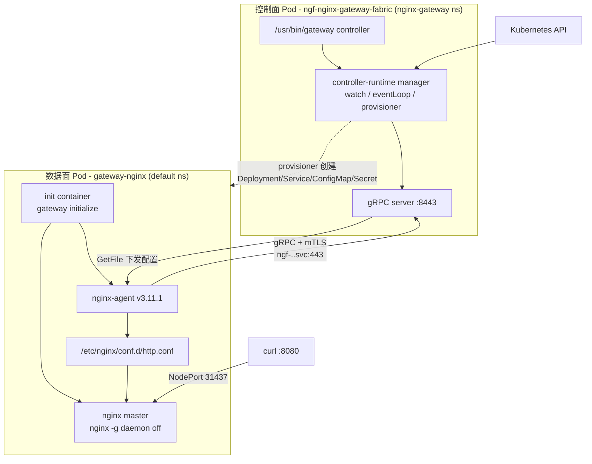
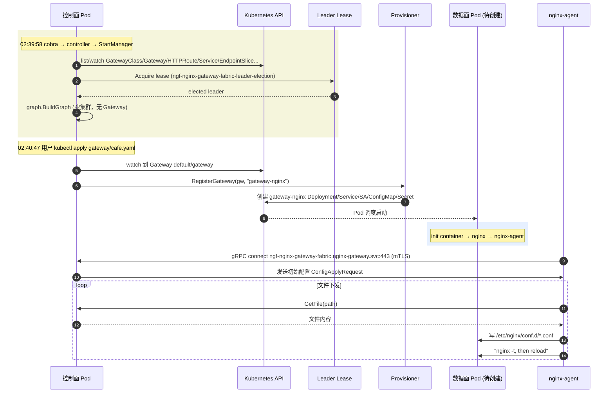

# NGF Pod 启动配置与启动流程分析

> [!info]
> 本文基于当前 kind 部署的 nginx-gateway-fabric 2.6.5，从 Pod 启动配置（Deployment manifest / ConfigMap / Secret / entrypoint）入手，结合源码逐层拆解控制面和数据面 Pod 的启动流程与工作原理。前置背景见 [[ngf-official-deploy-demo-obsidian]]。

## 0. 全景：两个 Pod，一条控制链路

NGF 在 Kubernetes 集群里运行的是**两个完全独立**的 Pod，它们通过 **gRPC over mTLS** 通信：



核心要点：
- **控制面 Pod** 在 `nginx-gateway` namespace，由 Helm 直接部署（`Deployment/ngf-nginx-gateway-fabric`）。
- **数据面 Pod** 在 `default` namespace，由**控制面动态创建**（ownerReference 指向 `Gateway/default/gateway`），不是 Helm 直接产物。
- 控制面是"控制者"，数据面是"被控者+真实流量入口"；两者通过 NGINX Agent 的 gRPC 通道耦合。

## 1. 控制面 Pod 启动配置（实际 manifest）

### 1.1 Deployment 关键字段

来源：`kubectl -n nginx-gateway get deployment ngf-nginx-gateway-fabric -o yaml`

```yaml
spec:
  replicas: 1
  template:
    spec:
      serviceAccount: ngf-nginx-gateway-fabric
      automountServiceAccountToken: true
      securityContext:
        runAsNonRoot: true
        fsGroup: 1001
      containers:
      - name: nginx-gateway
        image: ghcr.io/nginx/nginx-gateway-fabric:2.6.5
        imagePullPolicy: IfNotPresent
        args:
        - controller
        - --gateway-ctlr-name=gateway.nginx.org/nginx-gateway-controller
        - --gatewayclass=nginx
        - --config=ngf-config
        - --service=ngf-nginx-gateway-fabric
        - --agent-tls-secret=agent-tls
        - --metrics-port=9113
        - --health-port=8081
        - --leader-election-lock-name=ngf-nginx-gateway-fabric-leader-election
        ports:
        - {name: agent-grpc, containerPort: 8443, protocol: TCP}
        - {name: metrics,     containerPort: 9113, protocol: TCP}
        - {name: health,     containerPort: 8081, protocol: TCP}
        env:
        - {name: POD_NAMESPACE, valueFrom: {fieldRef: {fieldPath: metadata.namespace}}}
        - {name: POD_NAME,      valueFrom: {fieldRef: {fieldPath: metadata.name}}}
        - {name: POD_UID,       valueFrom: {fieldRef: {fieldPath: metadata.uid}}}
        - {name: INSTANCE_NAME, valueFrom: {fieldRef: {fieldPath: metadata.labels['app.kubernetes.io/instance']}}}
        - {name: IMAGE_NAME,    value: "ghcr.io/nginx/nginx-gateway-fabric:2.6.5"}
        readinessProbe:
          httpGet: {path: /readyz, port: health}
          initialDelaySeconds: 3
        securityContext:
          allowPrivilegeEscalation: false
          capabilities: {drop: [ALL]}
          readOnlyRootFilesystem: true
          runAsUser: 101
          runAsGroup: 1001
          seccompProfile: {type: RuntimeDefault}
        volumeMounts:
        - {name: nginx-agent-tls, mountPath: /var/run/secrets/ngf}
      volumes:
      - name: nginx-agent-tls
        secret: {secretName: server-tls, defaultMode: 420}
```

> [!note]
> 唯一容器 `nginx-gateway` 的镜像就是控制面 Go 二进制本身（`ghcr.io/nginx/nginx-gateway-fabric`）。它**不跑 NGINX**，只跑控制器。容器内端口 `8443/agent-grpc` 是给数据面 agent 反向连回来的 gRPC server。

### 1.2 启动参数到源码的映射

`args` 第一项 `controller` 是 cobra 子命令名，其余是 flag。源码入口 `cmd/gateway/main.go:20`：

```go
func main() {
    rootCmd := createRootCommand()
    rootCmd.AddCommand(
        createControllerCommand(),      // ← 控制面跑的就是这个
        createGenerateCertsCommand(),
        createInitializeCommand(),      // ← 数据面 init container 用这个
        createSleepCommand(),
        createEndpointPickerCommand(),
    )
    rootCmd.Execute()
}
```

`createControllerCommand`（`cmd/gateway/commands.go:85`）注册的 flag → `config.Config`（`internal/controller/config/config.go:12`）字段映射：

| Helm/启动参数 | flag 名 | 作用 | 本次值 |
|---|---|---|---|
| `--gateway-ctlr-name` | `gatewayCtlrNameFlag` | 控制器名，匹配 GatewayClass.spec.controllerName | `gateway.nginx.org/nginx-gateway-controller` |
| `--gatewayclass` | `gatewayClassFlag` | 接管哪个 GatewayClass | `nginx` |
| `--config` | `configFlag` | 动态配置 NginxGateway 资源名 | `ngf-config` |
| `--service` | `serviceFlag` | 前置该 Pod 的 Service 名（用于生成 agent 连接地址） | `ngf-nginx-gateway-fabric` |
| `--agent-tls-secret` | `agentTLSSecretFlag` | 控制面 gRPC server 用的 TLS Secret | `agent-tls` |
| `--metrics-port` | `metricsListenPort` | Prometheus metrics 端口 | `9113` |
| `--health-port` | `healthListenPort` | health probe 端口 | `8081` |
| `--leader-election-lock-name` | `leaderElectionLockNameFlag` | Lease 对象名 | `ngf-nginx-gateway-fabric-leader-election` |

env 变量则通过 `createGatewayPodConfig`（`cmd/gateway/commands.go:1035`）填进 `config.GatewayPodConfig`：

```go
c := config.GatewayPodConfig{
    ServiceName:  svcName,
    Namespace:    ns,                 // POD_NAMESPACE
    Name:         name,               // POD_NAME
    UID:          podUID,             // POD_UID
    InstanceName: instance,          // INSTANCE_NAME
    Version:      version,            // 构建期注入
    Image:        image,              // IMAGE_NAME
}
```

`POD_UID` 和 `POD_NAMESPACE`/`POD_NAME` 后续被用于 leader election identity、telemetry、agent 连接校验（按 Pod IP 反查 Pod）。

### 1.3 启动时序（来自实际日志）

```text
02:39:58  Starting the NGINX Gateway Fabric control plane  version=2.6.5 commit=0536fbe43...
02:39:58  Starting manager
02:39:58  controller-runtime.metrics  Serving metrics server  bindAddress=:9113
02:39:58  starting server  name=health probe  addr=[::]:8081
02:39:58  Attempting to acquire leader lease...  lock=nginx-gateway/ngf-nginx-gateway-fabric-leader-election
02:39:58  Successfully acquired lease
02:39:58  telemetryJob  Starting cronjob
02:39:59  eventLoop.eventHandler  Reconfigured control plane.  batchID=10
02:40:47  provisioner  Creating/Updating nginx resources  namespace=default  nginx resource name=gateway-nginx
02:40:47  eventHandler  NGINX configuration was successfully updated  (×5)
02:40:55  nginxUpdater.commandService  Creating connection for nginx pod: gateway-nginx-5f95f75958-tn9fw
02:40:56  Successfully connected to nginx agent
02:40:56  Sending initial configuration to agent
02:40:57  Successfully configured nginx for new subscription
02:40:57  eventHandler  NGINX configuration was successfully updated
```



## 2. 控制面启动：`StartManager` 源码拆解

入口 `internal/controller/manager.go:126`。它做的事按顺序如下：

### 2.1 构建 controller-runtime manager
`createManager`（`internal/controller/manager.go:509`）：
- `LeaderElection=true`、`LeaderElectionID=ngf-nginx-gateway-fabric-leader-election`，保证多副本只有一个能写状态。
- `HealthProbeBindAddress=:8081`，注册 `readyz` 探针（由 `graphBuiltHealthChecker` 决定 ready）。
- 给 `Pod` 加 `status.podIP` field index，用于 agent 接入时按 IP 反查 Pod 身份（防止伪造连接）。

### 2.2 注册所有 watch controllers
`registerControllers`（`internal/controller/manager.go:789-1053`）把以下资源注册成 controller-runtime controller，事件统一写进 `eventCh`：
- `GatewayClass`（按 `controllerName` 过滤）、`Gateway`、`HTTPRoute`、`GRPCRoute`
- `Service`、`EndpointSlice`、`Secret`、`ConfigMap`、`Namespace`
- NGF 自有 policy：`ClientSettingsPolicy`、`ObservabilityPolicy`、`ProxySettingsPolicy`、`UpstreamSettingsPolicy`、`RateLimitPolicy`、`WAFPolicy`、`SnippetsFilter`/`SnippetsPolicy`
- `ReferenceGrant`、`BackendTLSPolicy`、`NginxProxy` 等

这一步返回 `discoveredCRDs` map，告诉后续逻辑哪些可选 CRD 已安装。

> [!important]
> ==NGF 不只监听 Gateway/HTTPRoute==。Service/EndpointSlice 变化也会触发 graph 重算——这就是 Pod IP 漂移后 upstream 能自动更新的根因。

### 2.3 创建 `ChangeProcessor`（内存态 `ClusterState`）
`internal/controller/manager.go:166`：

```go
processor := state.NewChangeProcessorImpl(state.ChangeProcessorConfig{
    GatewayCtlrName:  cfg.GatewayCtlrName,
    GatewayClassName: cfg.GatewayClassName,
    Validators:       validation.Validators{...},
    MustExtractGVK:  mustExtractGVK,
    PlusSecrets:     plusSecrets,
    WAFFetcher:       wafFetcher,
    FeatureFlags:     graph.FeatureFlags{Plus: cfg.Plus, Experimental: cfg.ExperimentalFeatures},
    DiscoveredCRDs:   discoveredCRDs,
    ...
})
```

它内部持有 `ClusterState`（`internal/controller/state/change_processor.go:115-145`），承载 `GatewayClasses`、`Gateways`、`HTTPRoutes`、`Services`、`EndpointSlices`、`Secrets`、`ReferenceGrants`、policy 等集合。所有事件先 upsert/delete 到这里，再批量 `Process()` 触发 graph 重建。

### 2.4 创建 NGINX agent gRPC server 和 `NginxUpdater`
`createAgentServices`（`internal/controller/manager.go:303`）：

```go
nginxUpdater := agent.NewNginxUpdater(logger, mgr.GetAPIReader(), statusQueue, resetConnChan, cfg.Plus)
grpcServer := agentgrpc.NewServer(
    logger, grpcServerPort,
    []func(*grpc.Server){nginxUpdater.CommandService.Register, nginxUpdater.FileService.Register},
    mgr.GetClient(),
    tokenAudience,     // ngf-nginx-gateway-fabric.nginx-gateway.svc
    resetConnChan,
)
mgr.Add(&runnables.LeaderOrNonLeader{Runnable: grpcServer})
```

- gRPC server 监听 `:8443`（即 Deployment 里 `agent-grpc` 端口）。
- `tokenAudience` 用 `<ServiceName>.<Namespace>.svc`，对应数据面 Pod 里 projected serviceAccountToken 的 `audience` 字段——agent 拿这个 token 连控制面，控制面通过 token audience 校验来源。
- 两个 gRPC service：`CommandService`（订阅/下发）和 `FileService`（agent `GetFile` 拉文件内容）。

### 2.5 创建 Provisioner（数据面资源工厂）
`createAndRegisterProvisioner`（`internal/controller/manager.go:343`）：

```go
nginxProvisioner, provLoop, err := provisioner.NewNginxProvisioner(ctx, mgr, provisioner.Config{
    DeploymentStore:         nginxUpdater.NginxDeployments,
    StatusQueue:             statusQueue,
    GatewayPodConfig:        &cfg.GatewayPodConfig,
    GCName:                  cfg.GatewayClassName,
    AgentTLSSecretName:      cfg.AgentTLSSecretName,
    Plus:                    cfg.Plus,
    NginxDockerSecretNames:  cfg.NginxDockerSecretNames,
    ServerTLSDomain:         serverTLSDomain,   // 默认 "svc"
    ...
})
mgr.Add(&runnables.LeaderOrNonLeader{Runnable: provLoop})
```

Provisioner 是**每个 Gateway 对应一个数据面 Deployment** 的工厂，负责在 Gateway 被接受后创建 `gateway-nginx` 这一套资源（见 §4）。

### 2.6 创建 EventLoop 并注册
`internal/controller/manager.go:254-266`：

```go
firstBatchPreparer := events.NewFirstEventBatchPreparerImpl(mgr.GetCache(), objects, objectLists)
eventLoop := events.NewEventLoop(eventCh, logger, eventHandler, firstBatchPreparer)
mgr.Add(&runnables.LeaderOrNonLeader{Runnable: eventLoop})
```

`FirstEventBatchPreparer` 在 EventLoop 启动时把所有 watch 的资源**全量 list 一次**作为首批事件——这就是日志里的 `batchID=10`，冷启动一次把集群现状灌进 `ClusterState`。

### 2.7 Beacon：成为 leader 后才启用写操作
`internal/controller/manager.go:268`：

```go
mgr.Add(runnables.NewCallFunctionsAfterBecameLeader([]func(context.Context){
    groupStatusUpdater.Enable,   // 才开始回写 Gateway/Route status
    nginxProvisioner.Enable,     // 才开始创建数据面 Deployment
    eventHandler.enable,         // 才开始下发 NGINX 配置
}))
```

这解释了为什么非 leader Pod 即便收到事件也不会动数据面——status/provisioner/config 三个副作用都被门控在 leader 选举成功后才解锁。

### 2.8 `mgr.Start(ctx)` 启动所有 runnable
最后 `mgr.Start(ctx)` 阻塞运行：cache 同步、metrics server、health probe、所有 controller、gRPC server、eventLoop、provisioner loop、telemetry cronjob。`SetupSignalHandler` 让收到 SIGTERM 时优雅退出。

## 3. 数据面 Pod 启动配置（实际 manifest）

来源：`kubectl -n default get deployment gateway-nginx -o yaml`。注意它的 `ownerReferences` 指向 `Gateway default/gateway`，**不是** Helm release——是控制面动态创建的。

### 3.1 Pod 结构：1 init + 1 main

```yaml
spec:
  securityContext:
    runAsNonRoot: true
    fsGroup: 1001
    sysctls:
    - {name: net.ipv4.ip_unprivileged_port_start, value: "0"}   # 允许非特权绑定 80
  initContainers:
  - name: init
    image: ghcr.io/nginx/nginx-gateway-fabric:2.6.5     # ← 控制面同一个镜像
    command: [/usr/bin/gateway, initialize, ...]
  containers:
  - name: nginx
    image: ghcr.io/nginx/nginx-gateway-fabric/nginx:2.6.5   # ← 数据面专用镜像
    ports:
    - {name: port-80, containerPort: 80}
    - {name: metrics, containerPort: 9113}
    readinessProbe: {httpGet: {path: /readyz, port: 8081}}
```

> [!tip]
> 两个镜像不同：控制面用 `nginx-gateway-fabric:2.6.5`（含 Go 二进制 + agent 配置模板），数据面主容器用 `nginx-gateway-fabric/nginx:2.6.5`（含 nginx二进制 + nginx-agent）。==init 容器复用控制面镜像==，把镜像里自带的 `nginx-agent.conf` / nginx includes 模板拷到 emptyDir。

### 3.2 init 容器：`initialize` 子命令

实际命令：

```bash
/usr/bin/gateway initialize \
  --source /agent/nginx-agent.conf        --destination /etc/nginx-agent       \
  --source /includes/main.conf            --destination /etc/nginx/main-includes \
  --source /includes/events.conf          --destination /etc/nginx/events-includes
```

env：
```yaml
- {name: POD_UID,    valueFrom: {fieldRef: {fieldPath: metadata.uid}}}
- {name: CLUSTER_UID, value: 55d0f802-6c05-4c70-887a-775ccaf119f5}   # 控制面算出来下发
```

源码 `cmd/gateway/commands.go:834` 的 `createInitializeCommand` 把 `--source/--destination` 成对收进 `[]fileToCopy`，再调用 `initialize`（`cmd/gateway/initialize.go:34`）：

```go
func initialize(cfg initializeConfig) error {
    for _, f := range cfg.copy {
        if err := copyFile(cfg.fileManager, f.srcFileName, f.destDirName); err != nil {
            return err
        }
    }
    if !cfg.plus {
        cfg.logger.Info("Finished initializing configuration")
        return nil
    }
    // 仅 NGINX Plus：额外生成 deployment-context.json 用于 license
    depCtx := dataplane.DeploymentContext{InstallationID: &cfg.podUID, ClusterID: &cfg.clusterUID, Integration: integrationID}
    ...
}
```

本次是 OSS（无 `--nginx-plus`），所以 init 容器只做**文件拷贝**：
- `/agent/nginx-agent.conf`（来自 ConfigMap `gateway-nginx-agent-config` 挂载到 `/agent`）→ `/etc/nginx-agent/nginx-agent.conf`
- `/includes/main.conf`、`/includes/events.conf`（来自 ConfigMap `gateway-nginx-includes-bootstrap` 挂载到 `/includes`）→ `/etc/nginx/main-includes/`、`/etc/nginx/events-includes/`

实际 init 容器日志印证：

```text
Starting init container
source filenames to copy: [/agent/nginx-agent.conf /includes/main.conf /includes/events.conf]
destination directories:  [/etc/nginx-agent /etc/nginx/main-includes /etc/nginx/events-includes]
nginx-plus: false
Finished initializing configuration
```

`/agent/nginx-agent.conf` 内容（由控制面写进 ConfigMap，见 §4.3）：

```yaml
command:
  server:
    host: ngf-nginx-gateway-fabric.nginx-gateway.svc   # 控制面 Service FQDN
    port: 443
  auth:
    tokenpath: /var/run/secrets/ngf/serviceaccount/token
  tls:
    cert: /var/run/secrets/ngf/tls.crt
    key:  /var/run/secrets/ngf/tls.key
    ca:   /var/run/secrets/ngf/ca.crt
    server_name: ngf-nginx-gateway-fabric.nginx-gateway.svc
allowed_directories: [/etc/nginx, /usr/share/nginx, /var/run/nginx, /etc/app_protect/bundles/]
features: [configuration, certificates, metrics]
labels:
  cluster-id: 55d0f802-6c05-4c70-887a-775ccaf119f5
  control-id: 77889ff5-3dcd-4e41-aaa6-7b2bb8117006
  owner-name: default_gateway-nginx
  owner-type: Deployment
  product-type: ngf
  product-version: 2.6.5
collector:
  exporters:
    prometheus: {server: {host: 0.0.0.0, port: 9113}}
```

`/includes/main.conf` 和 `/includes/events.conf`（bootstrap 配置）：

```nginx
# main.conf
error_log stderr info;
# events.conf
worker_connections 1024;
```

这两个文件后续会被控制面通过 agent 下发的 `events.conf` / `main.conf` 覆盖（控制面会扩展 worker_connections、error_log 路径等）。

### 3.3 主容器 nginx：entrypoint（`/agent/entrypoint.sh`）

直接 `kubectl exec` 读出：

```bash
#!/bin/bash
set -euxo pipefail

handle_term() {
    kill -TERM "${agent_pid}" 2>/dev/null; wait -n ${agent_pid}
    kill -TERM "${nginx_pid}" 2>/dev/null; wait -n ${nginx_pid}
}
trap 'handle_term' TERM
trap 'handle_quit' QUIT

rm -rf /var/run/nginx/*.sock
[ "${USE_NAP_WAF:-false}" = "true" ] && touch /opt/app_protect/bd_config/policy_path.map

# 1. 先起 nginx
echo "starting nginx ..."
if [ "${1:-false}" = "debug" ]; then
    /usr/sbin/nginx-debug -g "daemon off;" &
else
    /usr/sbin/nginx -g "daemon off;" &
fi
nginx_pid=$!

# 2. 等 nginx master 起来（最多 30s）
SECONDS=0
while [[ ! -f /var/run/nginx.pid ]] && [[ ! -f /var/run/nginx/nginx.pid ]]; do
    (( SECONDS > 30 )) && { echo "couldn't find nginx master process"; exit 1; }
    sleep 1
done

# 3. 起 nginx-agent
echo "starting nginx-agent ..."
nginx-agent &
agent_pid=$!

# 4. 等 agent 退出，再优雅停 nginx
wait_term() {
    wait ${agent_pid}
    trap - TERM
    kill -QUIT "${nginx_pid}" 2>/dev/null
    wait ${nginx_pid}
}
wait_term
```

容器里 `ps -ef` 实际 PID 1 是这个脚本，PID 14 是 nginx master，PID 24 是 nginx-agent：

```text
PID  1  nginx  /bin/bash /agent/entrypoint.sh
PID 14  nginx  nginx: master process /usr/sbin/nginx -g daemon off;
PID 24  nginx  nginx-agent
PID 77~ nginx: worker process ×8
```

==关键设计==：nginx 先启动（保证数据面能立刻 accept 即使没配置），agent 紧随其后连控制面拉配置；容器生命周期绑定在 agent 上，agent 一旦退出会触发 nginx 优雅退出。

> [!warning]
> 这里有个细节：nginx 先裸跑（只有镜像内置的 `/etc/nginx/nginx.conf` 这个最小骨架），client 此刻连上来只会拿到默认 404。真正能路由 cafe.example.com 是因为 agent 随后从控制面拉到 `http.conf` 写进 `/etc/nginx/conf.d/`，触发 reload。从日志看这大约要 1 秒（`02:40:49 nginx start` → `02:40:55 agent applied config`）。

### 3.4 主容器 nginx 的 volumeMounts 与 emptyDir

```yaml
volumeMounts:
- /etc/nginx-agent                    # nginx-agent 配置（init 拷过来）
- /var/run/secrets/ngf               # mTLS 证书（Secret gateway-nginx-agent-tls）
- /var/run/secrets/ngf/serviceaccount # projected SA token (audience=ngf-nginx-gateway-fabric.nginx-gateway.svc)
- /var/log/nginx-agent
- /var/lib/nginx-agent
- /etc/nginx/conf.d                   # 控制面下发的 http.conf
- /etc/nginx/stream-conf.d
- /etc/nginx/main-includes           # events.conf / main.conf（init 拷 bootstrap，agent 再覆盖）
- /etc/nginx/events-includes
- /etc/nginx/secrets                 # TLS 证书等
- /var/run/nginx
- /var/cache/nginx
- /etc/nginx/includes
```

==全部 emptyDir==——除了 nginx-agent-config / nginx-includes-bootstrap（来自 ConfigMap）和 nginx-agent-tls（来自 Secret）和 token（projected SA）。这意味着 Pod 重启时配置会丢失，必须从控制面重新拉——这是设计上的"数据面无状态、控制面有状态"原则。

## 4. 控制面如何动态生成数据面 Deployment

### 4.1 触发点：Gateway 被 watch 到

用户 `kubectl apply -f examples/cafe-example/gateway.yaml` 后，控制面 controller 收到 `Gateway default/gateway`。事件进 `eventCh` → `EventLoop` → `eventHandler.HandleEventBatch` → `parseAndCaptureEvent` 写进 `ChangeProcessor.ClusterState` → `Process()` 调 `graph.BuildGraph`。

Graph 里 Gateway 被绑定到 `GatewayClass nginx`，并计算出有效 listener。

### 4.2 Provisioner 创建 Kubernetes 资源

`eventHandler` 在有有效 listener 时调（`internal/controller/handler.go:249`）：

```go
h.cfg.nginxProvisioner.RegisterGateway(ctx, gw, gw.DeploymentName.Name)
```

Provisioner 创建这一组资源（日志）：

```text
Creating/Updating nginx resources
resource names:
  gateway-nginx-agent-tls      (Secret)      ← 控制面 server-tls 拷过来的 mTLS 证书
  gateway-nginx-includes-bootstrap (ConfigMap) ← main.conf/events.conf bootstrap
  gateway-nginx-agent-config   (ConfigMap)    ← nginx-agent.conf（含 server host/labels）
  gateway-nginx                (ServiceAccount)
  gateway-nginx                (Service)      ← NodePort 80:31437
  gateway-nginx                (Deployment)   ← §3 那个 Pod 模板
```

ownerReference 全部指向 `Gateway default/gateway`——Gateway 删除时这一整套资源级联清理。

### 4.3 `nginx-agent.conf` 关键字段的来源

`command.server.host = ngf-nginx-gateway-fabric.nginx-gateway.svc`：由`--service=ngf-nginx-gateway-fabric` + `POD_NAMESPACE=nginx-gateway` + `--server-tls-domain=svc`(默认)拼成的 FQDN，即带控制面 Pod 的 Service FQDN。这就是数据面 agent 反向连接的地址。

`labels` 里的 `cluster-id` / `control-id` 是控制面通过 `kube-system` namespace UID / 自身 Deployment UID 算出的稳定标识，用于 agent 连上来后控制面识别归属。

### 4.4 gRPC token audience 一致性校验

控制面 Deployment 里 `ports.agent-grpc=8443`，对应 `tokenAudience=ngf-nginx-gateway-fabric.nginx-gateway.svc`（`createAgentServices`，`internal/controller/manager.go:318`）。

数据面 Pod `projected.serviceAccountToken`：

```yaml
- serviceAccountToken:
    audience: ngf-nginx-gateway-fabric.nginx-gateway.svc
    expirationSeconds: 3600
    path: token
```

两边 audience 严格一致——agent 拿这个 token 连控制面 gRPC，控制面用 token audience + Pod IP 反查（§2.1 的 field index）双重校验是不是合法的 `gateway-nginx` Pod，防止任何能访问到 `:8443` 的进程冒充数据面下发恶意配置。

## 5. agent ↔ 控制面：配置下发协议

源码注释（`internal/controller/nginx/agent/agent.go:78-105`）描述了完整流程：

```
1. deployment.SetFiles(files, volumeMounts)   # 控制面记录目标文件 + hash
2. broadcaster 广播文件 metadata 给订阅该 Gateway 的 agent
3. Pod 内 agent 收到 ConfigApplyRequest
4. agent 调控制面 GetFile 拉具体文件内容
5. agent 写文件、nginx -t、reload、回报状态
```

控制面侧 `NginxUpdaterImpl.UpdateConfig` 不直接 SSH/exec 进 Pod，而是把文件对象写进 `NginxDeployments` store，由 broadcaster 通过 gRPC stream 推 metadata；agent 再反客为主调 `FileService.GetFile` 拉内容。这样控制面**不需要任何写 Pod 文件的特权**，全部走 gRPC + mTLS + SA token 这条安全通道。

控制面日志：

```text
nginxUpdater.commandService  Creating connection for nginx pod: gateway-nginx-5f95f75958-tn9fw
Successfully connected to nginx agent
Sending initial configuration to agent  configVersion=oLfIsctELKieogxCGNBSboQJvG9gq+5hoLPbfOl+m44=
Successfully configured nginx for new subscription
eventHandler  NGINX configuration was successfully updated
```

`configVersion` 是配置内容 hash——agent 比对版本号判断是否需要 reload。

## 6. 端到端启动时序（综合日志）

```text
T+0.0s  控制面 Pod 启动，cobra → controller → StartManager
T+0.0s  metrics/health server、leader election、eventLoop 启动
T+0.1s  FirstEventBatchPreparer 全量 list 集群资源 → batchID=10
        （此时集群无 Gateway，graph 为空，不创建数据面）
T+49s   用户 apply gateway.yaml/cafe.yaml
T+49s   控制面 watch 到 Gateway/HTTPRoute，eventCh 触发
T+49s   graph.BuildGraph 产生有效 listener
T+49s   provisioner 创建 gateway-nginx Deployment/Service/ConfigMap/Secret
T+50s   数据面 Pod 调度，init container 运行：
        - 拷 nginx-agent.conf 到 /etc/nginx-agent
        - 拷 main.conf/events.conf 到 /etc/nginx/main-includes,/etc/nginx/events-includes
        - 日志："Finished initializing configuration"
T+50s   主容器 entrypoint.sh 启动：
        - rm nginx.sock
        - nginx -g "daemon off;" (用镜像内置 /etc/nginx/nginx.conf 最小骨架)
        - 等 nginx.pid 出现 (≤30s)
        - nginx-agent &
T+51s   nginx-agent 读 /etc/nginx-agent/nginx-agent.conf，连 ngf-nginx-gateway-fabric.nginx-gateway.svc:443
T+56s   控制面：Creating connection for nginx pod
T+57s   控制面：Successfully connected to nginx agent
        - 发送 configVersion，agent 调 GetFile 拉文件
        - 写 /etc/nginx/conf.d/http.conf（含 server_name cafe.example.com、upstream 指向 10.244.0.10/11）
        - nginx reload
T+57s   eventHandler：NGINX configuration was successfully updated
T+62s   curl /coffee → 命中 cafe.example.com location → upstream default_coffee_80 → 10.244.0.10:8080
        curl /tea    → location = /tea → upstream default_tea_80 → 10.244.0.11:8080
```

## 7. 安全/权限要点小结

| 维度 | 控制面 Pod | 数据面 Pod |
|---|---|---|
| 镜像 | nginx-gateway-fabric:2.6.5 (Go 控制器) | `gateway-fabric/nginx:2.6.5` (nginx+agent) |
| runAs | 101:1001, nonRoot, readOnlyRootFilesystem | 101:1001, nonRoot, readOnlyRootFilesystem |
| capabilities | drop ALL, no privilege escalation | drop ALL；`net.ipv4.ip_unprivileged_port_start=0` 让非特权能绑 80 |
| 数据面写档 | 不需要（不跑 nginx） | 全部 emptyDir，agent 写入；唯一持久来源是控制面 gRPC |
| 控制面写 Pod | 不直接 exec/SSH，只通过 gRPC + agent | 主动连控制面 gRPC，被动接收配置 |
| 身份校验 | SA token audience + Pod IP index 反查 | mTLS (`gateway-nginx-agent-tls`) + SA token |
| 关键 Secret | `server-tls`（gRPC server cert） | `gateway-nginx-agent-tls`（agent client cert，控制面 `server-tls` 拷贝） |

## 8. 一句话总结

NGF 的 Pod 启动是==**"控制面先行、数据面被生成、agent 回连"**==三段式：控制面 Go 二进制跑 controller watch + leader election + gRPC server；用户创建 Gateway 后，控制面 provisioner 动态生成带 init 容器（拷 agent 配置模板）和 nginx 容器（先裸跑 nginx，再起 nginx-agent）的数据面 Pod；agent 通过 mTLS+SA token 反向连控制面 gRPC，`GetFile` 拉取由 `graph.BuildGraph → dataplane.BuildConfiguration → generator.Generate` 产出的配置文件，写到 emptyDir 并 reload——整条链路的最终产物就是 [[ngf-official-deploy-demo-obsidian]] §9.9 里那张 `nginx -T` 的配置。

## 9. 源码索引（按启动顺序）

| 步骤 | 文件:行 | 符号 |
|---|---|---|
| 入口 | `cmd/gateway/main.go:20` | `main` |
| 控制面子命令 | `cmd/gateway/commands.go:85` | `createControllerCommand` |
| flag → Config | `cmd/gateway/commands.go:297` | (RunE 内构造 `config.Config`) |
| PodConfig 从 env | `cmd/gateway/commands.go:1035` | `createGatewayPodConfig` |
| Manager 入口 | `internal/controller/manager.go:126` | `StartManager` |
| 创建 controller-runtime manager | `internal/controller/manager.go:509` | `createManager` |
| 注册所有 controller | `internal/controller/manager.go:789` | `registerControllers` |
| ChangeProcessor | `internal/controller/manager.go:166` | `state.NewChangeProcessorImpl` |
| agent gRPC server | `internal/controller/manager.go:303` | `createAgentServices` |
| Provisioner | `internal/controller/manager.go:343` | `createAndRegisterProvisioner` |
| EventLoop | `internal/controller/manager.go:254` | `events.NewEventLoop` |
| Leader 门控 | `internal/controller/manager.go:268` | `NewCallFunctionsAfterBecameLeader` |
| 事件批处理 | `internal/controller/handler.go:189` | `eventHandlerImpl.HandleEventBatch` |
| 触发 provisioner | `internal/controller/handler.go:249` | `nginxProvisioner.RegisterGateway` |
| Graph 构建 | `internal/controller/state/graph/graph.go:255` | `graph.BuildGraph` |
| 数据面 Configuration | `internal/controller/state/dataplane/configuration.go:65` | `BuildConfiguration` |
| 配置模板生成 | `internal/controller/nginx/config/generator.go:125` | `GeneratorImpl.Generate` |
| agent 下发 | `internal/controller/nginx/agent/agent.go:78` | `NginxUpdaterImpl.UpdateConfig` |
| init 命令 | `cmd/gateway/commands.go:834` | `createInitializeCommand` |
| init 实现 | `cmd/gateway/initialize.go:34` | `initialize` |
| 数据面 entrypoint | `build/entrypoint.sh`（镜像内 `/agent/entrypoint.sh`） | bash 脚本 |