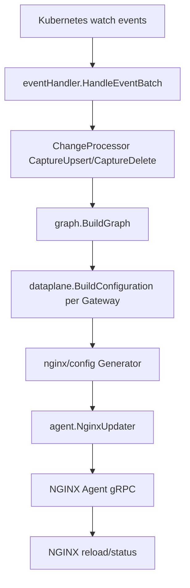

# NGINX Gateway Fabric 源码 Deep Research

> [!abstract]
> 本笔记从源码视角解释 NGINX Gateway Fabric 如何把 Kubernetes Gateway API 资源转换为 NGINX 数据面配置。建议配合 [[architecture/README|架构总览]]、[[architecture/configuration-flow|配置流]]、[[architecture/gateway-lifecycle|Gateway 生命周期]]、[[architecture/provisioning|Provisioning 说明]] 和 [[architecture/traffic-flow|流量路径]] 阅读。

## 结论速览

NGINX Gateway Fabric（下文简称 NGF）是一个典型的 Kubernetes control-plane/data-plane 分离系统。控制面运行 `cmd/gateway`，通过 controller-runtime 监听 Gateway API、NGF 自定义 CRD、Service、Secret、EndpointSlice 等资源；数据面是按 Gateway 动态创建的 NGINX Deployment 或 DaemonSet。控制面不直接把流量交给 Service 转发，而是根据 Service 与 EndpointSlice 信息生成 NGINX upstream，最终让 NGINX 直接代理到 Pod。

源码里的主线可以压缩成四步：

1. `cmd/gateway/main.go` 创建 Cobra root command，并挂载 `controller`、证书生成、初始化等子命令。
2. `internal/controller/manager.go` 创建 controller-runtime manager，注册资源控制器、agent gRPC 服务、provisioner、status queue 和 change processor。
3. `internal/controller/handler.go` 批量处理事件，驱动 `state.ChangeProcessor` 生成 `graph.Graph`，再为每个 Gateway 生成 dataplane `Configuration`。
4. `internal/controller/nginx/config` 把 dataplane 配置渲染为 NGINX 文件，`internal/controller/nginx/agent` 通过 gRPC 广播给 NGINX Agent，Agent 应用配置并回报状态。

## 源码地图

| 区域 | 作用 | 阅读入口 |
|---|---|---|
| `cmd/gateway/` | CLI、运行参数、controller 子命令 | `main.go`, `commands.go` |
| `internal/controller/manager.go` | manager 组装、controller 注册、依赖 wiring | `StartManager`, `createManager`, `registerControllers` |
| `internal/framework/` | 通用 controller/event/runnable 工具层 | `controller/register.go`, `events/loop.go` |
| `internal/controller/state/` | cluster state、变更跟踪、资源解析 | `change_processor.go`, `store.go`, `resolver/` |
| `internal/controller/state/graph/` | Gateway API 到内部图模型的转换 | `graph.go`, `gateway.go`, route/policy 文件 |
| `internal/controller/state/dataplane/` | 内部图到 dataplane 配置结构 | `configuration.go` |
| `internal/controller/nginx/config/` | dataplane 配置到 NGINX 文件/API 请求 | `generator.go`, `*_template.go` |
| `internal/controller/nginx/agent/` | NGINX Agent gRPC、文件广播、reload 状态 | `command.go`, `file.go`, `deployment.go` |
| `internal/controller/provisioner/` | 创建/更新/清理数据面 Kubernetes 对象 | `provisioner.go`, `objects.go` |
| `internal/controller/status/` | Gateway/Route/Policy 状态更新队列 | `queue.go`, `updater.go`, `status_setters.go` |
| `apis/` | NGF CRD 类型 | `v1alpha1/`, `v1alpha2/`, `waf/` |
| `tests/` | e2e、conformance、CEL 和系统测试 | `tests/README.md`, `tests/suite/` |

## 启动与控制器装配

`cmd/gateway/main.go` 只做命令装配：创建 root command，并添加 `createControllerCommand()` 等子命令。真正的运行参数集中在 `cmd/gateway/commands.go`，包括 GatewayClass 名称、leader election、metrics/health、Gateway API 实验特性、Inference Extension、snippets、NGINX Plus usage reporting、watch namespaces 等。

`internal/controller/manager.go` 是控制面 wiring 中心。`StartManager` 做了几件关键事：

- 创建 controller-runtime manager，配置 Scheme、cache、leader election、metrics、readyz。
- 注册 Pod IP indexer，用于校验 agent 连接来源。
- 根据已发现 CRD 注册对应 controller；可选 CRD 不存在时会禁用对应 controller，`ReferenceGrant` v1 不存在时回退到 v1beta1。
- 创建 `state.ChangeProcessorImpl`，注入 GatewayClass 名称、验证器、WAF/PLM fetcher、Plus secret 元数据和 feature flags。
- 创建 NGINX Agent gRPC server，并把 command/file service 注册进去。
- 创建 NGINX provisioner，并把其事件循环加入 manager。

> [!note]
> manager 的 controller 配置显式让各 controller 不要求 leader election；leader-aware 行为通过 runnable/provisioner/status 等组件内部控制。这使非 leader pod 仍可保持必要的 watch 和 agent 服务行为。

## 资源事件到 Graph

事件入口是 `internal/controller/handler.go` 的 `HandleEventBatch`。它逐个解析事件，调用 `parseAndCaptureEvent` 把 upsert/delete 写入 `ChangeProcessor`，随后执行 `processor.Process(ctx)`。

`ChangeProcessorImpl` 的职责是维护 cluster state，并只在 state predicate 判断有变化时重建图。变更存储在 `internal/controller/state/store.go` 的 `changeTrackingUpdater` 中：它会校验 GVK 是否受支持，按资源类型决定是否持久化对象，并通过 state changed predicate 避免无意义重建。

`Process` 最终调用 `graph.BuildGraph(...)`。Graph 是控制面最重要的中间模型，包含：

- `GatewayClass` 与属于当前 GatewayClass 的 `Gateway`。
- HTTP/GRPC/TLS/TCP/UDP route。
- Secret、ConfigMap、Service、EndpointSlice、Namespace、ReferenceGrant 等引用资源。
- NGF policy：ClientSettings、ProxySettings、Observability、RateLimit、UpstreamSettings、Snippets、WAF、Authentication 等。
- NGINX Plus、PLM、WAF bundle 相关状态。

Graph 构建时会做资源归属、引用解析、跨 namespace 授权、listener 与 route attach、backend 引用解析、policy attach 和有效性判断。`graph.Gateway` 不只是 Kubernetes Gateway 的包装；它还持有 `EffectiveNginxProxy`、listener、policy、deployment 名称、backend TLS secret ref、条件状态和上一次 reload 结果。

## Graph 到 Dataplane Configuration

`internal/controller/state/dataplane/configuration.go` 的 `BuildConfiguration` 把 Graph 中某个 Gateway 的视角转换为数据面配置。它先处理 GatewayClass/Gateway 无效的默认配置，再构建完整配置：

- HTTP 基础配置、stream 基础配置、server、SSL server、TLS passthrough/terminate server。
- HTTP upstream 与 stream upstream。
- backend group、certificate bundle、auth secret、OIDC provider、JWT remote CA bundle。
- telemetry、logging、worker connections、snippets、WAF、NGINX Plus API 配置。
- 与当前 Gateway 相关的 SnippetsFilter 和 route-targeted RateLimitPolicy。

这个层次是一个重要边界：`graph` 仍表达 Kubernetes/Gateway 语义，`dataplane.Configuration` 开始表达 NGINX 数据面语义。

## Provisioner 与数据面对象

`internal/controller/provisioner/provisioner.go` 管理每个 Gateway 对应的 Kubernetes 数据面资源。`RegisterGateway` 是入口：

- 如果 Gateway 有效且有 listener，则调用 `buildNginxResourceObjects` 生成对象，并用 `controllerutil.CreateOrUpdate` 创建或更新。
- 如果 Gateway 无效或没有可用 listener，则清理相关资源并从 store/remove deployment。
- 当 Deployment 与 DaemonSet 形态切换、HPA/PDB 禁用等场景出现时，会删除旧对象，避免资源残留。
- 如果 NGINX Agent ConfigMap 改变且数据面对象不是新建的，会给 Pod template 加 restart annotation，触发滚动重启。

[[architecture/provisioning|Provisioning 说明]]中的核心原则在源码里体现得很直接：NGF 自己的 API（尤其 `NginxProxy`）是数据面 Kubernetes 对象的事实来源。直接编辑已 provision 的 Deployment 或 Service 会被 reconcile 覆盖。

## NGINX 配置生成与 Agent 下发

`eventHandlerImpl.updateNginxConf` 调用 `cfg.generator.Generate(conf)` 生成文件集合，再通过 `nginxUpdater.UpdateConfig` 推给 deployment。若启用 NGINX Plus，还会调用 `UpdateUpstreamServers` 通过 Plus API 做 upstream server 更新。

`internal/controller/nginx/config/` 由多个模板化生成器组成：main config、base HTTP config、servers、upstreams、maps、split clients、stream servers、telemetry、Plus API 等。策略类 policy 的配置生成分散在 `internal/controller/nginx/config/policies/` 及其子目录。

agent 通信使用 gRPC。`createAgentServices` 创建 `NginxUpdaterImpl` 和 gRPC server，并注册：

- `CommandService`：订阅配置变更、发送 management plane command、接收 reload/apply 结果。
- `FileService`：处理 agent 拉取文件内容。

`internal/controller/nginx/agent/broadcast` 提供 deployment 级广播器。`commandService.Subscribe` 里有一个关键并发设计：新 agent 订阅 broadcaster 和首次应用当前配置时会持有 deployment `FileLock`，避免以下竞态：agent 刚连接时拿到旧配置，同时错过并发广播，导致配置漂移。

## Status 与错误传播

状态更新通过 `internal/controller/status.Queue` 解耦。handler 在几类场景入队：

- 没有 Gateway 时仍更新 GatewayClass。
- Gateway 无 listener、无效、WAF bundle pending 且 fail-closed 时，入队状态但不推配置。
- 配置推送后，把配置错误、upstream 错误、deployment 名称和 `NginxConfigPushed` 放入 queue。

`status.Updater` 当前是同步更新器，带指数退避。源码注释明确列出限制：大量资源状态更新会拖慢事件循环、不会清理不再被 Gateway 管理的旧 status、其他 controller 删除 status 后不会主动恢复，相关 FIXME 指向后续改进议题。

## API 与 Feature Surface

`apis/v1alpha1` 包含多数策略型 CRD：`ClientSettingsPolicy`、`ProxySettingsPolicy`、`UpstreamSettingsPolicy`、`RateLimitPolicy`、`SnippetsPolicy`、`SnippetsFilter`、`WAFPolicy`、`AuthenticationFilter`、`NginxGateway`。`apis/v1alpha2` 包含 `NginxProxy` 与 `ObservabilityPolicy`。`NginxProxy` 是数据面 Kubernetes 形态和 NGINX 行为的重要配置入口，覆盖 service、deployment/daemonset、autoscaling、PDB、pod/container、readiness、WAF、telemetry 等。

源码支持能力大致分三类：

- Gateway API 标准资源：GatewayClass、Gateway、HTTPRoute、GRPCRoute、TLSRoute、TCPRoute、UDPRoute、ReferenceGrant。
- NGF 策略扩展：认证、限流、上游、代理、客户端、可观测性、snippets、WAF。
- 运维能力：leader election、metrics、health、telemetry、NGINX Plus usage report、OpenShift SCC、Inference Extension、WAF/PLM bundle fetching。

## 流量路径

从 [[architecture/traffic-flow|流量路径]] 和源码结构看，用户请求路径不经过控制面：

1. 用户流量进入 Gateway 对应的 Service。
2. Service 暴露 NGINX Pod。
3. NGINX 根据生成的 server/location/upstream 配置匹配 hostname、path、headers、method 等规则。
4. upstream server 列表来自 Service/EndpointSlice 解析结果，因此 NGINX 可以直接代理到后端 Pod。

控制面只在配置变化、数据面连接、状态回报时参与；正常转发路径是数据面自治的。

## 测试体系

单元测试主要在对应 package 内，例如 `internal/controller/state/graph/*_test.go`、`internal/controller/state/dataplane/*_test.go`、`internal/controller/nginx/config/*_test.go`。项目约定使用 Ginkgo/Gomega 覆盖导出接口，同时用标准 Go table-driven tests 覆盖边界。`make unit-test` 对 `cmd/` 和 `internal/` 跑 race、shuffle 和 coverage。

`tests/` 是独立 Go module，包含：

- `tests/cel/`：CRD CEL 规则测试。
- `tests/conformance/`：Gateway API conformance。
- `tests/suite/`：系统/e2e 场景，例如 reconfig、scale、upgrade、WAF、rate limit、telemetry。
- `tests/framework/`：请求、证书、port-forward、Prometheus、资源管理等测试工具。

## 关键设计判断

> [!tip] 单一事实来源
> NGF 把 `NginxProxy` 等自有 CRD 作为数据面 Kubernetes 对象的事实来源。这样牺牲了直接编辑 Deployment/Service 的自由度，但换来 reconcile 的确定性。

> [!tip] Graph 作为语义边界
> `graph.Graph` 把 Kubernetes 原始对象、引用解析和 Gateway API attach 语义固化为内部模型。后续 dataplane 和 NGINX 层不需要重复理解全部 Kubernetes 规则。

> [!warning] Status 更新仍是潜在瓶颈
> `status.Updater` 注释已经指出同步更新可能拖慢事件循环。大规模 Gateway/Route 场景下，状态路径值得单独压测。

> [!warning] 配置一致性依赖锁与广播协议
> agent 首次配置、广播、文件锁、ResponseCh 协调共同保证配置不会漂移。修改 `agent/command.go`、`broadcast/`、`handler.updateNginxConf` 时要特别小心。

## 推荐阅读顺序

1. `cmd/gateway/main.go` 与 `cmd/gateway/commands.go`：理解入口和运行参数。
2. `internal/controller/manager.go`：理解 manager、controller、agent、provisioner、status queue 的装配。
3. `internal/framework/events/` 和 `internal/framework/controller/register.go`：理解事件如何进入 handler。
4. `internal/controller/handler.go`：理解事件批次如何驱动 graph/config/status。
5. `internal/controller/state/change_processor.go` 与 `internal/controller/state/store.go`：理解变更跟踪。
6. `internal/controller/state/graph/graph.go`、`gateway.go`、route/policy 文件：理解 Gateway API 语义模型。
7. `internal/controller/state/dataplane/configuration.go`：理解 NGINX 数据面配置模型。
8. `internal/controller/nginx/config/generator.go` 与模板文件：理解文件生成。
9. `internal/controller/nginx/agent/command.go`、`deployment.go`、`broadcast/`：理解配置下发与回报。
10. `internal/controller/provisioner/provisioner.go`、`objects.go`：理解数据面对象生命周期。

## 后续研究问题

- 大规模 Route/EndpointSlice 更新下，`ChangeProcessor` 重建 Graph 的实际成本如何？
- `status.Updater` 同步写 status 的 FIXME 是否会在高对象数场景下成为控制面瓶颈？
- NGINX Plus API 动态 upstream 更新与完整配置 reload 的边界在哪里？
- WAF bundle fail-open/fail-closed 策略如何影响 Gateway 状态与配置发布时机？
- Inference Extension 的 shadow Service 与普通 Service 解析路径有哪些差异？

## 关联笔记

- [[architecture/README|NGINX Gateway Fabric Architecture]]
- [[architecture/configuration-flow|Configuration Flow]]
- [[architecture/gateway-lifecycle|Gateway Lifecycle]]
- [[architecture/provisioning|Provisioning]]
- [[architecture/traffic-flow|Traffic Flow]]
- [[developer/testing|Testing]]
- [[developer/go-style-guide|Go Style Guide]]
- [[developer/quickstart|Developer Quickstart]]
