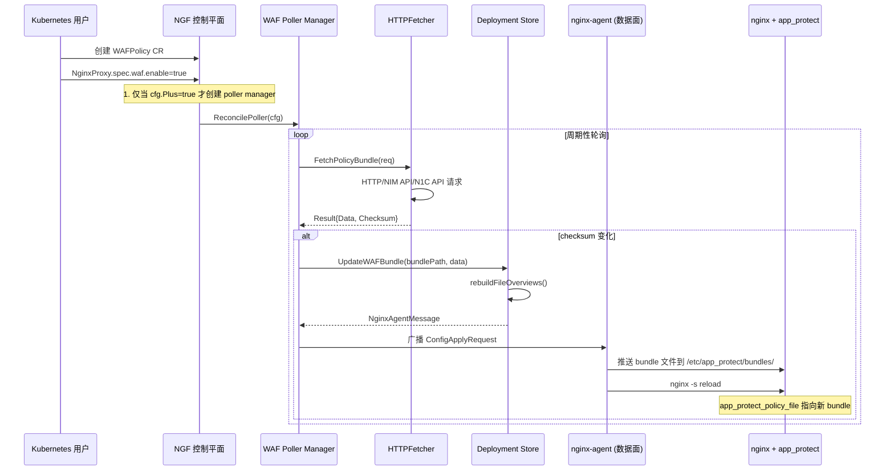

---
tags:
  - nginx-gateway-fabric
  - nginx-plus
  - nginx-oss
  - openresty
  - gateway-api
  - source-analysis
  - obsidian
aliases:
  - NGF Plus 功能分析
  - Nginx Plus Features in NGF
  - Plus vs OSS 差异
created: 2026-06-26
---

# Nginx Gateway Fabric 中 Nginx Plus 特有功能模块分析

> [!info] 文档定位
> 本文从源码角度系统梳理 NGINX Gateway Fabric（NGF）项目中 **NGINX Plus 特有** 的功能模块、使用场景、工作原理与关键资源，并进一步分析：
> 1. 这些功能对 OSS 用户而言的 **价值点**
> 2. 基于 OSS 二次开发复刻这些能力的 **实现路径与原理**
> 3. 对于我们基于 OpenResty 扩展 Nginx 内核、对标 Nginx Plus 的 **架构指导意义**
>
> 适合阅读对象：NGF 二次开发者、Nginx 控制平面工程师、OpenResty 扩展维护者。

## 核心结论

NGF 通过 **`--nginx-plus` 命令行 flag**（`cmd/gateway/commands.go:37` `plusFlag`）作为 Plus 与 OSS 的总开关，向下贯穿：

1. **配置生成层**（`GeneratorImpl.plus` 字段）：在模板执行路径上分支出 Plus-only 文件（mgmt block、Plus API server、state 文件、sticky cookie 等）
2. **Graph 验证层**（`processNginxProxies(..., plus bool)`）：对 Plus-only 字段做差异化校验（如 JSON error log、自定义 serverTokens、扩展的 LB 方法集）
3. **WAF 子系统**：整个 `wafpolling.Manager` 仅在 `cfg.Plus=true` 时才创建（`manager.go:401`）
4. **数据面镜像差异**：`build/Dockerfile.nginxplus` 安装 `nginx-plus`、`app-protect-module-plus`、`nginx-agent`，并启动 `entrypoint.sh` 同步拉起 nginx + nginx-agent

Plus 相对 OSS 的核心增量可归为 **四类能力**：

| 能力类别 | 代表模块 | OSS 是否可复刻 |
|---|---|---|
| **零 reload 动态配置** | Plus API、`state` 文件、`NGINXPlusAction` gRPC | 可（OpenResty `balancer_by_lua` + shared_dict） |
| **数据面高级特性** | Sticky Cookie、扩展 LB 算法、JSON error log、自定义 serverTokens | 部分可（Sticky 需 Lua 实现；JSON 日志可 Lua 拦截） |
| **商业生态集成** | F5 App Protect WAF、NGINX One Console 遥测、License 使用报告 | 需自建替代（开源 WAF + 自研遥测） |
| **可观测性 UI** | Live Activity Dashboard、Plus API 只读端点 | 可（Lua + 共享字典 + HTTP 端点） |

---

## Plus 功能模块全景图

```mermaid
flowchart TB
    subgraph CLI["命令行入口 cmd/gateway/commands.go"]
        PF["plusFlag = 'nginx-plus'<br/>--nginx-plus bool"]
        URP["usageReportParams<br/>Secret/CA/ClientSSL/Endpoint/Resolver"]
        PLM["plmStorageParams<br/>PLM S3 storage"]
    end

    subgraph CFG["配置结构 internal/controller/config/config.go"]
        CP["Config.Plus bool"]
        URC["UsageReportConfig"]
        N1C["NginxOneConsoleTelemetryConfig"]
    end

    subgraph GEN["配置生成层 internal/controller/nginx/config"]
        GI["GeneratorImpl.plus"]
        MGMT["generateMgmtFiles<br/>main_config.go:81"]
        PAPI["executePlusAPI<br/>plus_api.go:12"]
        UP["createUpstream<br/>upstreams.go:149<br/>zoneSize/state/sticky"]
        LB["OSSAllowedLBMethods<br/>PlusAllowedLBMethods"]
    end

    subgraph GRAPH["Graph 验证层 state/graph"]
        VNP["validateNginxPlus"]
        VLG["validateLogging<br/>JSON ErrorLog Plus-only"]
        VST["validateServerTokens<br/>自定义值 Plus-only"]
        VUS["upstreamsettings.Validator<br/>plusEnabled"]
        BN["buildNginxPlus<br/>configuration.go:2414"]
    end

    subgraph AGENT["Agent gRPC 数据面接口"]
        DPL["Deployment.nginxPlusActions"]
        BRD["Broadcaster.NginxAgentMessage.NGINXPlusAction"]
        CMD["command.go buildPlusAPIRequest"]
        ACT["action.go<br/>UpdateHttpUpstreamServers<br/>UpdateStreamServers"]
    end

    subgraph WAF["WAF 子系统 (Plus only)"]
        WPM["createWAFPollerManager<br/>manager.go:393"]
        PMG["pollerManager<br/>framework/waf/poller/manager.go"]
        FCH["HTTPFetcher<br/>framework/waf/fetch/fetch.go"]
        WGEN["waf.Generator<br/>app_protect_enable/policy_file"]
        LOAD["main_config_template<br/>load_module ngx_http_app_protect_module.so"]
    end

    subgraph LIC["License / Usage"]
        LC["licensing.Collector<br/>DeploymentContextCollector"]
        AUX["AuxiliarySecrets<br/>PlusReportJWTToken/CACert/ClientSSL"]
        MT["mgmtConfigTemplateText<br/>usage_report/license_token/deployment_context"]
    end

    subgraph IMG["数据面镜像"]
        OSS["Dockerfile (nginx OSS)"]
        PLUS["Dockerfile.nginxplus<br/>nginx-plus + app-protect-module-plus + nginx-agent"]
        ENT["entrypoint.sh<br/>nginx & nginx-agent"]
    end

    PF --> CP
    CP --> GI
    CP --> WPM
    CP --> VUS
    GI --> MGMT
    GI --> PAPI
    GI --> UP
    GI --> LB
    URP --> URC
    URC --> MGMT
    LC --> AUX
    AUX --> MGMT
    MGMT --> MT
    WPM --> PMG
    PMG --> FCH
    GI --> WGEN
    GI --> LOAD
    DPL --> BRD
    BRD --> CMD
    CMD --> ACT
    PLUS --> ENT
```



---

## 各功能模块详细分析

### 1. License 与使用报告 (Usage Reporting)

> [!example] 使用场景
> Nginx Plus 是商业授权产品，需要周期性向 F5 中心化端点 (`usage-rpt.nginx.com`) 上报部署上下文（Pod UID、Cluster ID、节点数），以完成许可合规。OSS 无需此能力。

#### 工作原理

```
启动 → Secret 挂载 → 控制平面读取 → 生成 deployment_ctx.json + license.jwt
       → 推送到 /etc/nginx/secrets/ 和 /etc/nginx/main-includes/
       → nginx 启动时通过 mgmt block 自动向 endpoint 上报
```

#### 关键源码定位

| 阶段 | 文件 | 行号 | 说明 |
|---|---|---|---|
| CLI flag | `cmd/gateway/commands.go` | 37 | `plusFlag = "nginx-plus"` |
| Usage 参数 | `cmd/gateway/commands.go` | 53-61 | `usageReportParams` 结构 |
| 配置定义 | `internal/controller/config/config.go` | 144-159 | `UsageReportConfig` |
| Plus 总开关 | `internal/controller/config/config.go` | 55 | `Config.Plus bool` |
| Secret 元数据 | `internal/controller/manager.go` | 1055-1124 | `createPlusSecretMetadata` |
| 部署上下文采集 | `internal/controller/licensing/collector.go` | 51-65 | `DeploymentContextCollector.Collect` |
| 配置生成 | `internal/controller/nginx/config/main_config.go` | 81-171 | `generateMgmtFiles` (Plus only) |
| mgmt 模板 | `internal/controller/nginx/config/main_config_template.go` | 23-47 | `mgmtConfigTemplateText` |
| Secret 类型枚举 | `internal/controller/state/graph/` | - | `PlusReportJWTToken`、`PlusReportCACertificate`、`PlusReportClientSSLCertificate`、`PlusReportClientSSLKey` |

#### 核心模板（`mgmtConfigTemplateText`）

```nginx
mgmt {
    usage_report endpoint=<endpoint>;
    resolver <resolver>;
    license_token /etc/nginx/secrets/license.jwt;
    deployment_context /etc/nginx/main-includes/deployment_ctx.json;
    ssl_verify off;                  # SkipVerify 时
    ssl_trusted_certificate <ca>;    # 自定义 CA 时
    ssl_certificate <crt>;           # mTLS 时
    ssl_certificate_key <key>;
    enforce_initial_report off;      # 非强制时
}
```

> [!note] 设计要点
> - `license_token` 是 JWT 文件，存放在 Secret 的 `license.jwt` key 中
> - `deployment_ctx.json` 序列化 `DeploymentContext{Integration, InstallationID, ClusterID, ClusterNodeCount}`（`dataplane/types.go`）
> - `enforce_initial_report` 控制首次启动是否强制等待上报响应（true 表示必须成功才提供服务）

---

### 2. NGINX Plus API —— 零 reload 动态配置

> [!example] 使用场景
> OSS 每次上游端点变更都需 `nginx -s reload`，大规模集群下 reload 频繁会引起瞬时连接抖动、长连接中断。Plus 通过 REST API（`/api/`) 动态修改 upstream server 列表，**无需 reload**。

#### 工作原理

```
控制平面 (NGF)                 Agent gRPC                 Nginx Plus
     │                            │                          │
     │ 1. 配置变更                  │                          │
     │   Generate() 生成全部文件     │                          │
     │ ──────────────────────────>│                          │
     │ 2. ConfigApplyRequest       │ nginx -s reload         │
     │   (全量文件)                  │ ────────────────────────>│
     │                            │                          │
     │ 3. 上游端点变化（增量）        │                          │
     │   NGINXPlusAction(           │                          │
     │     UpdateHttpUpstreamServers│                          │
     │     [{server, ...}]          │                          │
     │   )                          │                          │
     │ ──────────────────────────>│ POST /api/http/upstreams/│
     │                            │   <name>/servers          │
     │                            │ ────────────────────────>│
     │                            │                          │ 无 reload
     │                            │ <──── 200 OK ────────────│
```

#### 关键源码定位

| 阶段 | 文件 | 行号 | 说明 |
|---|---|---|---|
| Plus API server 配置 | `internal/controller/nginx/config/plus_api.go` | 12-25 | `executePlusAPI`（`AllowedAddresses != nil` 才生成） |
| Plus API 模板 | `internal/controller/nginx/config/plus_api_template.go` | 3-28 | unix socket `api write=on` + 8765 端口 `api write=off` |
| Plus Action 存储 | `internal/controller/nginx/agent/deployment.go` | 62, 214-216 | `Deployment.nginxPlusActions`、`SetNGINXPlusActions` |
| Action 广播 | `internal/controller/nginx/agent/broadcast/broadcast.go` | 246-255 | `NginxAgentMessage.NGINXPlusAction` |
| Action 序列化 | `internal/controller/nginx/agent/command.go` | 497-513 | `buildPlusAPIRequest` |
| Action 类型 | `internal/controller/nginx/agent/action.go` | 14-26 | `UpdateHttpUpstreamServers`、`UpdateStreamServers` |
| 初始 Action 应用 | `internal/controller/nginx/agent/command.go` | 358-396 | `setInitialConfig` 中应用 Plus Actions |

#### 生成的 nginx 配置

```nginx
# /etc/nginx/conf.d/plus-api.conf
server {
  listen unix:/var/lib/nginx/nginx-plus-api.sock;
  access_log off;
  location /api { api write=on; }   # 控制平面通过 unix socket 写 API
}

server {
  listen 8765;
  root /usr/share/nginx/html;
  access_log off;
  allow 127.0.0.1;                   # 来自 NginxProxy.NginxPlus.AllowedAddresses
  deny all;
  location = /dashboard.html {}
  location /api { api write=off; }   # 用户只读访问 dashboard
}
```

> [!tip] 关键设计点
> - **write API 走 unix socket**：避免外部网络访问，安全可控
> - **read API + dashboard 走 8765**：用户可配置 IP 白名单（`NginxProxy.spec.nginxPlus.allowedAddresses`）
> - NGF 不直接调 Plus API，而是通过 **gRPC 通知 nginx-agent**，由 agent 在数据面本地调 Plus API（`setInitialConfig` 中的 `wait.PollUntilContextCancel` 重试机制应对 nginx 重启时机）

---

### 3. Upstream Zone Size 与 State 持久化

> [!example] 使用场景
> Plus 通过 `state` 指令把 upstream server 列表持久化到磁盘，nginx 重启后能从 state 文件恢复（与 API 联动）。同时 Plus 支持更大 zone size 以容纳更多 upstream。

#### 关键源码

| 项 | 文件 | 行号 | 内容 |
|---|---|---|---|
| OSS zone size | `internal/controller/nginx/config/upstreams.go` | 27, 31 | `ossZoneSize = "512k"`、`ossZoneSizeStream = "512k"` |
| Plus zone size | `internal/controller/nginx/config/upstreams.go` | 29, 33 | `plusZoneSize = "1m"`、`plusZoneSizeStream = "1m"` |
| State 文件分配 | `internal/controller/nginx/config/upstreams.go` | 99-107, 158-168 | `if g.plus { stateFile = ... }` |
| State 指令模板 | `internal/controller/nginx/config/upstreams_template.go` | 26-27, 56-57 | `state {{ $u.StateFile }};` |
| 容量注释 | `internal/controller/nginx/config/upstreams_template.go` | 3-7 | 512k→648 servers, 1m→556 servers |

#### 工作原理

```go
// upstreams.go:158-168
if g.plus {
    zoneSize = plusZoneSize  // "1m"
    if !upstreamHasResolveServers(up) {
        // state 文件路径：/var/lib/nginx/state/<upstreamName>.conf
        // 注意：带 resolve 标志的 upstream 不能用 state，因为 Plus API 无法管理
        stateFile = fmt.Sprintf("%s/%s.conf", stateDir, base)
    }
    sp = getSessionPersistenceConfiguration(up.SessionPersistence)
}
```

> [!warning] 关键约束
> - **resolve server 不能用 state**：`upstreamHasResolveServers` 检查，存在 `endpoint.Resolve=true`（ExternalName 服务）则不分配 state 文件
> - state 文件由 **Plus API 写入**（动态修改 server 时持久化），OSS 没有 API，所以无法使用此模式

---

### 4. Session Persistence (Sticky Cookie)

> [!example] 使用场景
> Gateway API 标准 `HTTPRoute.rules.backendRefs.sessionPersistence` 字段。Plus 通过 `sticky cookie` 指令实现，OSS 无对应能力（NGF 在 OSS 模式下忽略此字段）。

#### 关键源码

| 阶段 | 文件 | 行号 | 说明 |
|---|---|---|---|
| Plus 守卫 | `internal/controller/nginx/config/upstreams.go` | 170 | `sp = getSessionPersistenceConfiguration(...)` 仅在 `if g.plus` 块内 |
| 配置提取 | `internal/controller/nginx/config/upstreams.go` | 273-285 | `getSessionPersistenceConfiguration` |
| 模板渲染 | `internal/controller/nginx/config/upstreams_template.go` | 20-24 | `sticky {{ SessionType }} {{ Name }} expires=... path=...;` |
| Dataplane 类型 | `internal/controller/state/dataplane/configuration.go` | 1759-1767 | `SessionPersistenceConfig{SessionType: CookieBasedSessionPersistence}` |

#### 生成的配置

```nginx
upstream my_backend {
    zone my_backend 1m;
    sticky cookie my_cookie_id expires=3600 path=/;   # Plus only
    server 10.0.0.1:8080;
    server 10.0.0.2:8080;
}
```

> [!note] OSS 缺失原因
> `sticky` 指令来自 `ngx_http_upstream_keepalive_module` 的商业扩展（实际是 `ngx_http_upstream_session_sticky_module`），OSS 标准模块不提供。

---

### 5. NGINX Plus Dashboard / Live Activity Monitoring

> [!example] 使用场景
> Plus 内置 Live Activity Dashboard（端口 8765），实时展示 upstream 连接数、响应时间、缓存命中率等。OSS 没有内置 dashboard。

#### 实现位置

- `internal/controller/nginx/config/plus_api_template.go:13-27`：第二个 server 块监听 8765，root 指向 `/usr/share/nginx/html`，提供 `dashboard.html` 与只读 `/api`
- `apis/v1alpha2/nginxproxy_types.go:529-534`：`NginxPlus.AllowedAddresses` 让用户自定义 allowlist
- `internal/controller/state/dataplane/configuration.go:2414-2434`：`buildNginxPlus` 默认 `127.0.0.1`，可被 `NginxProxy.spec.nginxPlus.allowedAddresses` 覆盖
- `internal/controller/state/graph/nginxproxy.go:602-640`：`validateNginxPlus` 校验 CIDR/IP 类型
- `build/Dockerfile.nginxplus`：`/usr/share/nginx/html/dashboard.html`（来自 nginx-plus 包）

---

### 6. NGINX App Protect WAF (F5 WAF)

> [!important] 这是 Plus 最重要的增值能力之一
> NAP WAF v5 是 F5 商业 Web Application Firewall，集成 OWASP Top 10 防护、Bot 防御、API 防护。**完全依赖 Plus 的 `app-protect-module-plus` 模块**。

#### 使用场景

- 保护 Gateway 后端应用免受 SQL 注入、XSS、CSRF 等攻击
- 通过编译后的策略 bundle（`.tgz`）灵活下发规则
- 支持多源获取 bundle：HTTP / NIM（NGINX Instance Manager）/ N1C（F5 NGINX One Console）/ PLM（Policy Lifecycle Manager）

#### 工作原理



#### 关键源码

| 阶段 | 文件 | 行号 | 说明 |
|---|---|---|---|
| WAF 开关 | `apis/v1alpha2/nginxproxy_types.go` | 170-195 | `WAFSpec{Enable, DisableCookieSeed, BundleFailOpen}` |
| WAFPolicy CRD | `apis/v1alpha1/wafpolicy_types.go` | 20-29, 50-87 | `WAFPolicy`、`WAFPolicySpec` |
| 源类型枚举 | `apis/v1alpha1/wafpolicy_types.go` | 89-111 | `PolicySourceTypeHTTP/NIM/N1C/PLM` |
| NAP 模块加载 | `internal/controller/nginx/config/main_config_template.go` | 8-10 | `load_module ngx_http_app_protect_module.so` |
| Enforcer 接入 | `internal/controller/nginx/config/base_http_config_template.go` | 14-19 | `app_protect_enforcer_address 127.0.0.1:50000;` |
| Cookie Seed | `internal/controller/nginx/config/base_http_config_template.go` | 16-18 | `app_protect_cookie_seed <gateway-uid>;` |
| Policy 启用 | `internal/controller/nginx/config/policies/waf/generator.go` | 20-35 | `app_protect_enable on; app_protect_policy_file "<bundle>";` |
| Security Log | `internal/controller/nginx/config/policies/waf/generator.go` | 26-34 | `app_protect_security_log_enable on; app_protect_security_log "<bundle>" <dest>;` |
| Bundle 路径约定 | `internal/controller/nginx/config/policies/waf/generator.go` | 16 | `appProtectBundleFolder = "/etc/app_protect/bundles"` |
| Bundle 文件生成 | `internal/controller/nginx/config/generator.go` | 311-325 | `generateWAFBundle`、`GenerateWAFBundleFileName` |
| Fetcher 接口 | `internal/framework/waf/fetch/fetch.go` | 163-188 | `Fetcher.FetchPolicyBundle/FetchLogProfileBundle` |
| HTTPFetcher 实现 | `internal/framework/waf/fetch/fetch.go` | 190-213 | 支持 HTTP / NIM API / N1C API |
| Poller Manager | `internal/framework/waf/poller/manager.go` | 64-89, 144-244 | `pollerManager.ReconcilePoller`、`startPoller` |
| Poller 创建 | `internal/controller/manager.go` | 391-427 | `createWAFPollerManager`（`if !cfg.Plus { return nil }`） |
| 镜像构建 | `build/Dockerfile.nginxplus` | 25-28 | `app-protect-module-plus~=${APP_PROTECT_VERSION}` |
| Sidecar 容器 | `apis/v1alpha2/nginxproxy_types.go` | 683-716 | `WAFContainers`（waf-enforcer + waf-config-mgr） |
| 入口脚本 | `build/entrypoint.sh` | 31-33 | `if [ "${USE_NAP_WAF}" = "true" ]; then touch .../policy_path.map; fi` |

#### 生成的 nginx 配置片段

```nginx
# main.conf (Plus only)
load_module modules/ngx_http_app_protect_module.so;

# http.conf
app_protect_enforcer_address 127.0.0.1:50000;
app_protect_cookie_seed <gateway-uid-derived>;

# WAFPolicy_<ns>_<name>.conf (location 级别)
app_protect_enable on;
app_protect_policy_file "/etc/app_protect/bundles/<ns>_<name>.tgz";
app_protect_security_log_enable on;
app_protect_security_log "/etc/app_protect/bundles/<log-bundle>.tgz" /var/log/app_protect/security.log;
```

> [!tip] Bundle Fetch 重试与条件请求
> `internal/framework/waf/fetch/fetch.go:35-39` 定义 `retryBaseDelay=1s`、`retryMaxDelay=30s`；支持 `If-None-Match` / `If-Modified-Since` 条件 GET，304 时 `Result.Unchanged=true` 避免无谓推送。

> [!warning] BundleFailOpen 语义
> `NginxProxy.spec.waf.bundleFailOpen`：
> - `true`：bundle 未就绪时，NGF 推送不含 `app_protect_policy_file` 的配置，nginx 正常启动但无 WAF 防护
> - `false`（默认）： withhold 配置直到 bundle 拉取成功，fail-closed 姿态

---

### 7. 高级负载均衡方法

> [!example] 使用场景
> Plus 提供基于响应时间的负载均衡算法 `least_time`，比 OSS 的 `least_conn` 更精细。`random two least_time` 是 Plus 独有的"两步随机 + 最小响应时间"算法。

#### 关键源码

```go
// internal/controller/nginx/config/http/config.go:271-301
OSSAllowedLBMethods = {
    RoundRobin, LeastConnection, IPHash, Random, Hash, HashConsistent,
    RandomTwo, RandomTwoLeastConnection,
    LeastTimeHeader, LeastTimeLastByte,                   // OSS 支持
    LeastTimeHeaderInflight, LeastTimeLastByteInflight,   // OSS 支持
}

PlusAllowedLBMethods = OSSAllowedLBMethods + {
    RandomTwoLeastTimeHeader,    // Plus 独有
    RandomTwoLeastTimeLastByte,  // Plus 独有
}
```

| 阶段 | 文件 | 行号 | 说明 |
|---|---|---|---|
| 方法集定义 | `internal/controller/nginx/config/http/config.go` | 271-301 | OSS / Plus 两张表 |
| 验证分支 | `internal/controller/nginx/config/policies/upstreamsettings/validator.go` | 170-175 | `if v.plusEnabled { allowedMethods = PlusAllowedLBMethods }` |
| Validator 注入 | `internal/controller/manager.go` | 487 | `upstreamsettings.NewValidator(validator, cfg.Plus)` |

---

### 8. JSON 错误日志格式

> [!example] 使用场景
> 容器化部署下，JSON 格式日志更易被 Loki/ELK 等日志系统解析。Plus 原生支持 `error_log <path> json;`，OSS 不支持。

#### 关键源码

```go
// internal/controller/state/graph/nginxproxy.go:426-435
if logging.ErrorLogFormat != nil && *logging.ErrorLogFormat == ngfAPIv1alpha2.NginxErrorLogFormatJSON && !plus {
    allErrs = append(allErrs, field.Invalid(
        ..., "JSON-formatted error logs are only supported with NGINX Plus",
    ))
}
```

```nginx
# internal/controller/nginx/config/main_config_template.go:12
error_log stderr {{ .Conf.Logging.ErrorLevel }}{{ if eq .Conf.Logging.ErrorLogFormat "json" }} json{{ end }};
```

> [!note] 联动效应
> 当 `ErrorLogFormat=json` 时，`buildAccessLog`（`configuration.go:2377-2382`）会自动用 `JSONAccessLogFormat` 模板生成 JSON 访问日志，escape=json。这是 OSS 也可以用的访问日志 JSON 化路径（不依赖 Plus）。

---

### 9. 自定义 ServerTokens 值

> [!example] 使用场景
> `server_tokens` 控制响应头 `Server` 字段是否暴露 nginx 版本。OSS 仅允许 `off`/`on`/`build` 三个关键字；Plus 允许任意字符串（例如 `"My Gateway"`）。

```go
// internal/controller/state/graph/nginxproxy.go:655-676
switch serverTokens {
case ServerTokenOff, ServerTokenOn, ServerTokenBuild:
    // 通用关键字，OSS/Plus 均可
default:
    if !plus {
        return field.Invalid(..., "custom string values for serverTokens are only allowed with NGINX Plus")
    } else if err := validator.ValidateServerTokensValue(serverTokens); err != nil {
        // Plus 下还需通过通用校验（防注入）
    }
}
```

---

### 10. NGINX One Console 集成

> [!example] 使用场景
> F5 NGINX One Console 是 SaaS 控制平面，集中监控多个集群的 nginx 实例。NGF 通过 nginx-agent 上报 dataplane key + 遥测数据到 `agent.connect.nginx.com`。

| 阶段 | 文件 | 行号 | 说明 |
|---|---|---|---|
| 端点常量 | `cmd/gateway/commands.go` | 41 | `nginxOneTelemetryEndpointHost = "agent.connect.nginx.com"` |
| 配置结构 | `internal/controller/config/config.go` | 171-181 | `NginxOneConsoleTelemetryConfig{DataplaneKeySecretName, EndpointHost, EndpointPort, EndpointTLSSkipVerify}` |
| 遥测采集 | `internal/controller/telemetry/collector.go` | - | `DataCollectorImpl` 集成 `NginxOneConsoleConnection` 字段 |

---

## Plus 检测机制总览

NGF 在多个层级传递 `plus` 布尔值，形成完整的差异化执行链路：

| 层级 | 传递路径 | 用途 |
|---|---|---|
| CLI | `--nginx-plus` → `Config.Plus` | 总开关 |
| Manager | `cfg.Plus` → `GeneratorImpl.plus` | 控制配置生成分支 |
| Manager | `cfg.Plus` → `BuildConfiguration(..., plus)` | 控制 Graph → Configuration 转换 |
| Manager | `cfg.Plus` → `processNginxProxies(..., plus)` | 控制 NginxProxy 验证 |
| Manager | `cfg.Plus` → `upstreamsettings.NewValidator(..., plus)` | 控制 LB 方法集 |
| Manager | `cfg.Plus` → `createWAFPollerManager` (返回 nil if !Plus) | 控制 WAF 子系统启用 |
| Manager | `cfg.Plus` → `createPlusSecretMetadata` | 控制 License Secret 读取 |
| Generator | `g.plus` → `generateMgmtFiles` (early return if !plus) | 控制文件生成 |

> [!tip] 二次开发启示
> 这种"单开关 → 多层级门控"模式非常清晰，二次开发时若要新增 Plus-only 能力，只需：
> 1. 在 `Config.Plus` 下游添加新字段
> 2. 在 Generator/Graph/Validator 中加 `if plus` 分支
> 3. 在 `Dockerfile.nginxplus` 中安装对应模块

---

## OSS 视角下的价值点分析

> [!question] 关键问题
> 如果我们只用 OSS，Plus 这些功能中哪些是 **真正有价值** 的？哪些是 **可替代** 的？哪些是 **不可替代** 的？

### 价值矩阵

| 功能 | 商业价值 | OSS 可替代性 | 替代成本 |
|---|---|---|---|
| **零 reload 动态 upstream** | ⭐⭐⭐⭐⭐ 高频 reload 影响生产稳定性 | ✅ OpenResty `balancer_by_lua` + shared_dict | 中（需重构 upstream 管理） |
| **Sticky Cookie** | ⭐⭐⭐⭐ 状态应用必需 | ✅ `lua-resty-session` + `balancer_by_lua` | 低（Lua 库成熟） |
| **F5 App Protect WAF** | ⭐⭐⭐⭐⭐ 企业安全合规 | ⚠️ Coraza/ModSecurity 可替代基础防护，但规则集与机器学习能力差距大 | 高（需自建规则生态） |
| **Live Activity Dashboard** | ⭐⭐⭐ 可观测性锦上添花 | ✅ Prometheus + Grafana + `lua-resty-prometheus` | 低（开源方案成熟） |
| **扩展 LB 算法 (least_time)** | ⭐⭐⭐ 长尾延迟优化 | ✅ `balancer_by_lua` 自实现 | 中（需采集响应时间） |
| **JSON 错误日志** | ⭐⭐ 容器化日志收集 | ✅ `log_by_lua` 拦截 + JSON 编码 | 低 |
| **State 持久化** | ⭐⭐ 重启后 upstream 恢复 | ✅ shared_dict + 文件持久化 | 低 |
| **自定义 ServerTokens** | ⭐ 品牌定制 | ✅ Lua 改写响应头 | 极低 |
| **NGINX One Console** | ⭐⭐⭐ 多集群统一监控 | ✅ 自建 Prometheus + 多集群 federation | 中 |
| **License 使用报告** | ⭐ 仅商业合规 | ➖ OSS 无需 | - |

### OSS 用户真正缺失的核心能力

1. **生产级零 reload 配置变更** —— 这是 OSS 最大痛点，频繁 reload 在大规模 upstream 场景下引起连接重置、长连接中断
2. **企业级 WAF** —— NAP 的规则集、机器学习、Bot 防御是 OSS WAF（Coraza/ModSecurity）难以全面对标的
3. **官方 dashboard 一站式可观测性** —— OSS 需要 DIY（Prometheus + Grafana + 自定义指标）

---

## 基于 OSS 二次开发的实现路径

> [!abstract] 实现思路
> 基于 OSS 进行二次开发复刻 Plus 能力，核心策略是：**保留 NGF 的控制平面架构，替换数据面执行机制** —— 把 Plus API 调用替换为 OpenResty Lua 动态执行，把商业模块替换为开源 Lua 库或开源 WAF 引擎。

### 1. 动态 Upstream（替代 Plus API）

#### 实现原理

```
┌───────────────────────────────────────────────────────────────┐
│ 控制平面 (NGF)                                                  │
│   EndpointSlice Watch → Graph → 生成 upstream 元数据             │
│   ↓ (不走 nginx.conf 重写)                                      │
│   通过 nginx-agent / 自研 sidecar 写入共享存储 (etcd / ConfigMap) │
└───────────────────────────────────────────────────────────────┘
                                ↓
┌───────────────────────────────────────────────────────────────┐
│ 数据平面 (OpenResty)                                            │
│   init_worker_by_lua_block:                                    │
│     启动定时器，定期从共享存储拉取 upstream 列表                  │
│     写入 ngx.shared.upstreams 字典                              │
│                                                                │
│   balancer_by_lua_block:                                       │
│     从 ngx.shared.upstreams 读取 peer 列表                      │
│     应用 LB 算法 (round_robin/least_conn/least_time/random_two) │
│     local peer = pick_peer(upstreams)                          │
│     local ok, err = balancer.set_current_peer(peer.host, port) │
└───────────────────────────────────────────────────────────────┘
```

#### 关键 Lua 库

- `lua-resty-upstream-healthcheck` —— 主动健康检查
- `lua-resty-balancer` —— `balancer.set_current_peer` API
- `lua-resty-core` —— `ngx.shared.DICT` 共享内存

#### 实现要点

```nginx
# nginx.conf
http {
    lua_shared_dict upstreams 10m;       # upstream 元数据缓存
    lua_shared_dict upstream_stats 10m;  # 响应时间/连接数统计（用于 least_time）

    init_worker_by_lua_block {
        require("upstream_sync").start_worker_timer()
    }

    upstream my_backend {
        server 0.0.0.1;  # 占位符，balancer_by_lua 接管
        balancer_by_lua_block {
            require("balancer").run()
        }
    }
}
```

> [!tip] state 持久化的替代方案
> `lua_shared_dict` 默认进程内内存，重启丢失。可：
> 1. 启动时从 ConfigMap/etcd 恢复
> 2. 使用 `lua-resty-shdict` 配合磁盘持久化
> 3. 用 `ngx.shared.DICT` + 定时器周期性 dump 到 `/var/lib/nginx/state/*.json`

---

### 2. Sticky Cookie / Session Persistence

#### 实现路径

```lua
-- balancer_by_lua_block
local session = require("resty.session")
local balancer = require("ngx.balancer")

-- 1. 解析请求中的 sticky cookie
local cookie_name = "srv_id"
local sticky_id = ngx.var["cookie_" .. cookie_name]

-- 2. 若已有 sticky_id，路由到对应 peer
if sticky_id then
    local peer = upstreams.lookup(sticky_id)
    if peer then
        balancer.set_current_peer(peer.host, peer.port)
        return
    end
end

-- 3. 否则选一个 peer，并通过 header_filter 设置 cookie
local peer = pick_peer(upstreams)
balancer.set_current_peer(peer.host, peer.port)

-- 在 header_filter_by_lua_block 中：
-- local session_id = compute_sticky_id(peer)
-- ngx.header["Set-Cookie"] = { cookie_name .. "=" .. session_id .. "; Path=/; HttpOnly" }
```

#### 推荐库

- `lua-resty-session` —— 完整的 session 管理（支持 HMAC、加密、滚动续期）
- 自实现简单版：直接 `md5(peer.host .. peer.port)` 作为 sticky_id

---

### 3. WAF 能力替代

#### 选项对比

| 方案 | 优点 | 缺点 |
|---|---|---|
| **Coraza** (ModSecurity 兼容，Go 实现) | 规则集兼容 ModSecurity SecLang；社区活跃 | 性能逊于 NAP；机器学习能力缺失 |
| **lua-resty-waf** | 纯 Lua，OpenResty 原生 | 维护停滞，规则集不如 ModSecurity 丰富 |
| **ModSecurity nginx 模块** | 老牌开源 WAF | 已停止维护；性能较差 |
| **自研 Lua WAF** | 完全可控 | 需投入大量研发 |

#### 推荐架构（Coraza + NGF 控制平面）

```
┌────────────────────────────────────────────────────┐
│ NGF 控制平面                                        │
│   WAFPolicy CR → 生成 Coraza 规则集文件              │
│   推送到 /etc/coraza/rules/*.conf                   │
└────────────────────────────────────────────────────┘
                       ↓
┌────────────────────────────────────────────────────┐
│ OpenResty + Coraza                                 │
│   access_by_lua_block:                             │
│     local coraza = require("coraza")               │
│     coraza.load_rules("/etc/coraza/rules/*.conf")  │
│     local tx = coraza.new_transaction()            │
│     tx:process_request_headers(ngx.req.get_headers)│
│     tx:process_request_body(ngx.req.get_body_data) │
│     if tx:intervention_required() then             │
│       ngx.exit(tx.status)                          │
│     end                                            │
└────────────────────────────────────────────────────┘
```

#### Bundle 分发机制（对标 NAP）

NGF 的 WAF bundle 机制（HTTP/NIM/N1C/PLM 拉取 .tgz → poller → agent 推送）可以原样复用：
- 把 .tgz 内的 NAP bundle 换成 Coraza SecLang 规则文件
- 保留 `internal/framework/waf/fetch` 的多源拉取与轮询机制
- 保留 `internal/framework/waf/poller` 的生命周期管理
- 替换 `internal/controller/nginx/config/policies/waf/generator.go` 中的 `app_protect_*` 指令为 Coraza Lua 调用

---

### 4. 实时监控 Dashboard

#### 实现路径

```
┌──────────────────────────────────────────────────┐
│ OpenResty 数据面                                  │
│   lua_shared_dict stats 10m;                     │
│                                                  │
│   log_by_lua_block:                              │
│     local stats = ngx.shared.stats               │
│     stats:incr("requests_total", 1)              │
│     stats:incr("upstream_" .. peer .. "_active", 1)│
│     -- 记录响应时间窗口                            │
│                                                  │
│   server {                                       │
│     listen 8765;                                 │
│     location /api/stats {                        │
│       content_by_lua_block {                     │
│         local stats = ngx.shared.stats           │
│         -- 输出 JSON 指标                          │
│       }                                          │
│     }                                            │
│     location /dashboard.html { ... }             │
│   }                                              │
└──────────────────────────────────────────────────┘
                       ↓
            Prometheus 抓取 + Grafana 展示
```

#### 推荐库

- `lua-resty-prometheus` —— 直接暴露 Prometheus 指标端点
- `lua-resty-stat` —— 轻量统计

---

### 5. 高级负载均衡算法（least_time / random two least_time）

```lua
-- balancer_by_lua_block
local stats = ngx.shared.upstream_stats

-- least_time 算法
local function least_time(upstream_name)
    local peers = upstreams.get_peers(upstream_name)
    local min_time = math.huge
    local selected = peers[1]
    for _, p in ipairs(peers) do
        local avg_time = stats:get(p.host .. ":avg_time") or 0
        if avg_time < min_time then
            min_time = avg_time
            selected = p
        end
    end
    return selected
end

-- random two least_time (Plus 独有算法复刻)
local function random_two_least_time(upstream_name)
    local peers = upstreams.get_peers(upstream_name)
    -- 1. 随机选两个 peer
    local i1, i2 = random_two_indices(#peers)
    -- 2. 从这两个中选响应时间更短的
    local t1 = stats:get(peers[i1].host .. ":avg_time") or 0
    local t2 = stats:get(peers[i2].host .. ":avg_time") or 0
    return (t1 < t2) and peers[i1] or peers[i2]
end
```

#### 响应时间采集

```lua
-- log_by_lua_block
local now = ngx.now()
local request_start = ngx.req.start_time()
local elapsed = now - request_start
local peer = ngx.var.upstream_addr
local stats = ngx.shared.upstream_stats
-- 滚动平均（窗口 60s）
local new_avg = update_rolling_avg(stats, peer, elapsed)
stats:set(peer .. ":avg_time", new_avg, 60)  -- TTL 60s
```

---

### 6. JSON 错误日志

```lua
-- init_worker_by_lua_block
local errlog = require("ngx.errlog")
errlog.set_filter_level(ngx.ERR)  -- 订阅 error 级别

-- 在定时器中读取 raw log 并 JSON 化
local function log_to_json()
    local entries = errlog.get_logs(10)
    for _, entry in ipairs(entries) do
        local json_entry = encode_to_json(entry)
        write_to_file("/var/log/nginx/error.json.log", json_entry .. "\n")
    end
end
```

> [!tip] 更简单的方案
> 直接 `error_log` 输出文本，通过 Fluentd/Filebeat 的 nginx error log filter 插件结构化为 JSON。无需 Lua 介入。

---

### 7. State 持久化

```lua
-- init_worker_by_lua_block
local function persist_upstreams()
    local upstreams_dict = ngx.shared.upstreams
    local all_keys = upstreams_dict:get_keys()
    local snapshot = {}
    for _, k in ipairs(all_keys) do
        snapshot[k] = upstreams_dict:get(k)
    end
    write_file("/var/lib/nginx/state/upstreams.json", cjson.encode(snapshot))
end

-- 启动时恢复
local function restore_upstreams()
    local data = read_file("/var/lib/nginx/state/upstreams.json")
    if data then
        local snapshot = cjson.decode(data)
        for k, v in pairs(snapshot) do
            ngx.shared.upstreams:set(k, v)
        end
    end
end
```

---

### 8. 使用报告与许可合规（OSS 无需，可改造为自研遥测）

OSS 无 license 强制要求，但可复用 NGF 的 `licensing.DeploymentContextCollector` 思路，向自建遥测端点上报：
- 集群规模（节点数、Pod 数）
- NGF 版本
- Gateway/Route 数量
- 用于产品改进决策

NGF 已有 `internal/controller/telemetry/collector.go` 的产品遥测机制，OSS 默认开启（用户可禁用）。

---

## 对 OpenResty 扩展 Nginx 内核的指导意义

> [!abstract] 总体原则
> 我们的目标是 **基于 OpenResty 扩展 Nginx 内核，对标 Nginx Plus 功能集**。NGF 的源码为我们提供了 **商业级 Plus 实现的完整参考** —— 不是抄代码，而是抄架构与设计模式。

### 1. 控制平面 / 数据平面分离架构

NGF 的核心架构是 **K8s 控制平面 + nginx-agent gRPC 数据面**：

```
控制平面 (Go)                    数据面 (nginx + agent)
  - 资源监听                       - 文件接收
  - Graph 构建                     - 配置应用
  - 配置生成                       - 状态回报
  - gRPC 服务端                    - gRPC 客户端
```

#### 指导意义

- **不要把控制逻辑塞进 nginx**：Lua 应专注于 **数据面执行**，控制决策应在控制平面完成
- **保留 gRPC 控制通道**：可复用 nginx-agent 协议，或自研 sidecar + gRPC
- **配置 vs 运行时状态分离**：NGF 把"全量配置"（`ConfigApplyRequest`）与"增量更新"（`NGINXPlusAction`）分两条路径，OpenResty 也应区分：
  - 全量配置：写 nginx.conf + reload（少量场景）
  - 增量更新：写 shared_dict + 无 reload（高频场景）

### 2. 单开关多层级门控模式

NGF 用一个 `cfg.Plus` bool 在 7+ 个层级做差异化分支，**干净、可测、可关闭**。

#### 应用到 OpenResty 扩展

```go
// 控制平面
type Config struct {
    OpenRestyExtensions bool  // 类似 Plus flag
}

// 在每个相关模块检查
if cfg.OpenRestyExtensions {
    // 启用 sticky cookie Lua 代码生成
    // 启用 least_time balancer
    // 启用 WAF 集成
    // 启用 dashboard
}
```

### 3. CRD 驱动的声明式配置

NGF 把每个 Plus 能力都抽象为 Kubernetes CRD：
- `NginxProxy`（全局配置，含 `spec.nginxPlus.allowedAddresses`、`spec.waf.enable`）
- `WAFPolicy`（WAF 策略绑定）
- `UpstreamSettingsPolicy`、`RateLimitPolicy`、`ClientSettingsPolicy`、`ProxySettingsPolicy`、`ObservabilityPolicy`、`SnippetsPolicy`

#### 指导意义

OpenResty 扩展项目也应设计 **声明式 CRD 而非注解**：
- CRD 有 schema 校验，注解易出错
- CRD 可版本化（`v1alpha1` → `v1`），平滑演进
- CRD 支持状态子资源（`status`），便于反馈
- 参考 NGF 的 `+kubebuilder:validation:XValidation` 做 CEL 校验

### 4. Bundle 拉取 + 轮询 + 增量推送模式

NGF 的 WAF 子系统设计非常优秀：
- **多源拉取**：HTTP / NIM / N1C / PLM 四种 bundle 来源，统一 `Fetcher` 接口
- **条件 GET**：`If-None-Match` / `If-Modified-Since` 减少带宽
- **Checksum 去重**：bundle 内容未变则不推送
- **失败重试**：指数退避（1s → 30s）
- **BundleFailOpen 语义**：fail-open vs fail-closed 可配置
- **Poller 生命周期管理**：`ReconcilePoller` 按 policy 增删

#### 可复用场景

- Lua 规则集下发（替代 WAF bundle）
- 路由配置热更新（替代 reload）
- 证书轮转
- 任何需要"控制平面拉取 → 数据面推送"的资源

### 5. NGINX Plus API 的"动态子集"策略

NGF 不是所有 upstream 都用 Plus API 动态管理：
- **带 resolve 的 upstream（ExternalName）**：不走 Plus API，因为 Plus API 不支持 DNS 动态解析
- **普通 upstream**：走 Plus API + state 文件

#### 指导意义

OpenResty 动态 upstream 也应分类：
- **静态 IP 上游（ClusterIP Service）**：用 shared_dict + balancer_by_lua，无 reload
- **DNS 动态解析上游（ExternalName）**：用 `resolver` 指令 + `resolve` 参数，nginx 原生支持

### 6. 失败容忍与降级策略

NGF 的失败处理模式值得借鉴：
- `BundleFailOpen=true`：WAF bundle 拉不到时，降级为无 WAF 但保持流量
- `BundleFailOpen=false`：fail-closed， withhold 配置直到 bundle 就绪
- `setInitialConfig` 中 Plus Action 失败时重试（`wait.PollUntilContextCancel`）
- `nginx-agent` 连接断开时自动重连

#### 应用到 OpenResty

- WAF 规则加载失败 → 降级为"只记录不阻断"或"完全跳过"
- 共享字典同步失败 → 退化到上次已知 good 状态
- 健康检查失败 → 主动剔除 peer，但保留最后一个 good peer 兜底

### 7. 配置生成模板化

NGF 全部用 Go `text/template` 生成 nginx 配置：
- `main_config_template.go`
- `base_http_config_template.go`
- `upstreams_template.go`
- `plus_api_template.go`
- `main_config_template.go`（mgmt block）
- 每个 Policy 一个 generator + template

#### 指导意义

OpenResty 扩展项目也应 **模板化 nginx.conf 生成**，而非字符串拼接：
- 易于审计与 diff
- 易于做单元测试（golden file）
- 易于支持多版本演进

### 8. 验证与守护机制

NGF 在多个层级做验证：
- CRD schema 校验（kubebuilder markers）
- CEL 表达式校验（`+kubebuilder:validation:XValidation`）
- 控制平面 `Validator` 接口（`policies.Validator`）
- 数据平面再校验（`validation.GenericValidator`）
- 防注入校验（`ValidateEscapedStringNoVarExpansion` 等）

#### 指导意义

OpenResty 扩展需特别注意：
- Lua 代码生成时，**所有用户输入必须转义**，防止代码注入
- 模板渲染时禁止变量展开（`ValidateEscapedStringNoVarExpansion`）
- WAF 规则文件需 checksum 校验（NGF 用 `expectedChecksum`）

### 9. 数据面镜像分层

NGF 的 Dockerfile 设计：
- `Dockerfile`（OSS）：`nginx` + `nginx-module-njs` + `nginx-module-otel`
- `Dockerfile.nginxplus`：`nginx-plus` + `nginx-plus-module-njs` + `nginx-plus-module-otel` + `nginx-agent` + 可选 `app-protect-module-plus`
- `build/entrypoint.sh` 通用启动脚本，通过 `USE_NAP_WAF` 环境变量分支

#### 指导意义

OpenResty 扩展项目应设计：
- 基础镜像：`openresty/openresty` + 必要 Lua 库
- 扩展镜像：叠加 WAF（Coraza）、监控（lua-resty-prometheus）、动态 upstream（lua-resty-balancer）
- 通过环境变量或 ConfigMap 控制启用的扩展子集

### 10. 可观测性分层

NGF 的可观测性：
- **控制平面**：zap logger + 产品遥测（向 nginx.com 上报）+ NGINX One Console 集成
- **数据面**：`error_log` + `access_log`（支持 JSON）+ OpenTelemetry module + Plus Dashboard

#### 指导意义

OpenResty 扩展应建立三层可观测：
- **业务层**：访问日志、错误日志（JSON 化）
- **指标层**：Prometheus 指标（`lua-resty-prometheus`）+ Grafana Dashboard
- **追踪层**：OpenTelemetry（OpenResty 已有 `opentelemetry-nginx` 模块）

---

## 总结

### NGF Plus 功能的实现哲学

NGF 的 Plus 实现遵循 **"商业模块 + 控制平面集成 + 数据面模板分支"** 三层模式：

1. **商业模块**：nginx-plus 二进制 + app-protect-module-plus + nginx-agent
2. **控制平面集成**：CLI flag → Config → Generator/Validator 分支 → Secret 管理 → gRPC Action
3. **数据面模板分支**：`if g.plus` 控制是否生成 mgmt block、Plus API server、sticky cookie、state 文件、WAF 模块加载

### OpenResty 对标 Plus 的可行性结论

| 能力 | 可行性 | 推荐方案 | 工作量 |
|---|---|---|---|
| 零 reload 动态 upstream | ✅ 完全可行 | `balancer_by_lua` + shared_dict | 2-3 人月 |
| Sticky Cookie | ✅ 完全可行 | `lua-resty-session` + `balancer_by_lua` | 0.5 人月 |
| 企业级 WAF | ⚠️ 部分可行 | Coraza + 自研规则生态 | 6+ 人月 |
| 实时 Dashboard | ✅ 完全可行 | `lua-resty-prometheus` + Grafana | 1 人月 |
| least_time LB | ✅ 完全可行 | `balancer_by_lua` 自实现 | 1 人月 |
| JSON 日志 | ✅ 完全可行 | `log_by_lua` 或 Fluentd filter | 0.2 人月 |
| State 持久化 | ✅ 完全可行 | shared_dict + 文件 dump | 0.5 人月 |
| NGINX One Console 替代 | ✅ 完全可行 | 自建多集群 Prometheus federation | 2 人月 |

> [!success] 核心建议
> 1. **优先实现零 reload 动态 upstream** —— 这是 OSS 用户的最大痛点，价值最高
> 2. **复用 NGF 的控制平面架构** —— Graph / Generator / Validator / Agent gRPC 模式经过生产验证
> 3. **WAF 走 Coraza 路线** —— 不要自研规则引擎，复用 ModSecurity SecLang 生态
> 4. **保留声明式 CRD** —— 不要退化为注解配置
> 5. **Bundle 拉取 + 轮询机制直接复用** —— NGF 的 `framework/waf/fetch` 与 `framework/waf/poller` 设计精良，可移植

---

## 附录：关键源码定位索引

### Plus 检测与传递
- `cmd/gateway/commands.go:37` — `plusFlag` 常量
- `internal/controller/config/config.go:55` — `Config.Plus` 字段
- `internal/controller/manager.go:189,231,246,315,370,401,487,1060` — `cfg.Plus` 全链路传递

### License 与 Usage Report
- `cmd/gateway/commands.go:53-61` — `usageReportParams`
- `internal/controller/config/config.go:144-159` — `UsageReportConfig`
- `internal/controller/manager.go:1055-1124` — `createPlusSecretMetadata`
- `internal/controller/licensing/collector.go` — `DeploymentContextCollector`
- `internal/controller/nginx/config/main_config.go:81-171` — `generateMgmtFiles`
- `internal/controller/nginx/config/main_config_template.go:23-47` — `mgmtConfigTemplateText`

### Plus API 动态配置
- `internal/controller/nginx/config/plus_api.go` — `executePlusAPI`
- `internal/controller/nginx/config/plus_api_template.go` — `plusAPITemplateText`
- `internal/controller/nginx/agent/deployment.go:62,214-216` — `nginxPlusActions`
- `internal/controller/nginx/agent/broadcast/broadcast.go:246-255` — `NginxAgentMessage.NGINXPlusAction`
- `internal/controller/nginx/agent/command.go:358-396,497-513` — `setInitialConfig`、`buildPlusAPIRequest`
- `internal/controller/nginx/agent/action.go` — `UpdateHttpUpstreamServers`、`UpdateStreamServers`

### Upstream 差异化
- `internal/controller/nginx/config/upstreams.go:27-33` — zone size 常量
- `internal/controller/nginx/config/upstreams.go:97-131,149-230` — `createStreamUpstream`、`createUpstream` Plus 分支
- `internal/controller/nginx/config/upstreams_template.go:20-24` — `sticky` 指令
- `internal/controller/nginx/config/upstreams_template.go:26-27,56-57` — `state` 指令
- `internal/controller/nginx/config/http/config.go:271-301` — `OSSAllowedLBMethods` / `PlusAllowedLBMethods`
- `internal/controller/nginx/config/policies/upstreamsettings/validator.go:170-175` — LB 方法集差异化校验

### WAF 子系统
- `apis/v1alpha2/nginxproxy_types.go:170-195` — `WAFSpec`
- `apis/v1alpha1/wafpolicy_types.go` — `WAFPolicy` 完整定义
- `internal/controller/nginx/config/policies/waf/generator.go` — WAF 指令生成
- `internal/controller/nginx/config/main_config_template.go:8-10` — `load_module ngx_http_app_protect_module.so`
- `internal/controller/nginx/config/base_http_config_template.go:14-19` — `app_protect_enforcer_address` / `app_protect_cookie_seed`
- `internal/framework/waf/fetch/fetch.go` — `Fetcher` 接口与 `HTTPFetcher` 实现
- `internal/framework/waf/poller/manager.go` — `pollerManager` 生命周期
- `internal/controller/manager.go:391-427` — `createWAFPollerManager`

### 验证层
- `internal/controller/state/graph/nginxproxy.go:426-435` — JSON ErrorLog Plus-only
- `internal/controller/state/graph/nginxproxy.go:602-640` — `validateNginxPlus`
- `internal/controller/state/graph/nginxproxy.go:655-676` — `validateServerTokens` Plus-only

### 数据面镜像
- `build/Dockerfile.nginxplus` — Plus 镜像构建
- `build/entrypoint.sh` — nginx + nginx-agent 启动脚本
- `build/Dockerfile` — OSS 镜像构建（对比参考）

### 相关文档
- `docs/proposals/nap-waf.md` — WAF 设计提案（详细设计文档）
- `docs/ngf-control-plane-architecture-obsidian.md` — 控制平面架构分析
- `docs/ngf-pod-startup-analysis-obsidian.md` — Pod 启动流程分析

---

> [!quote] 结语
> Nginx Plus 的真正护城河不是单个功能，而是 **零 reload 动态配置 + 企业级 WAF + 商业支持** 的组合。基于 OpenResty 复刻前两者技术上完全可行，但需要正视：
> - **工程复杂度**：动态 upstream 的健康检查、状态同步、失败降级是深坑
> - **规则生态**：NAP 的规则集与机器学习无法直接复刻，需依赖 Coraza/ModSecurity 社区
> - **长期维护**：NGF 的代码量告诉我们，这是一个持续投入的项目，不是一次性工程
>
> 建议从 **零 reload 动态 upstream + Sticky Cookie + Prometheus 监控** 三个高价值低难度能力切入，逐步扩展。
