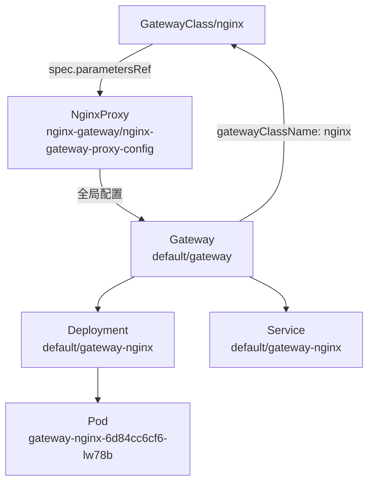
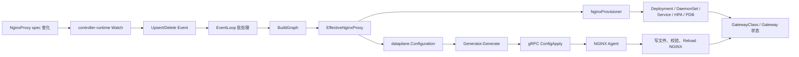

# NginxProxy CR 作用与工作原理

> [!abstract] 核心结论
> `NginxProxy` 是 NGF 的**数据平面实例配置 CR**，不是一个直接处理流量的代理 Pod。它同时描述数据平面的 Kubernetes 形态与 NGINX 全局行为。NGF 将 GatewayClass 和 Gateway 两层配置合并成每个 Gateway 独有的 `EffectiveNginxProxy`，再分别驱动 Kubernetes 资源调谐和 NGINX 配置生成/下发。

## 读者、范围与职责边界

本文适合希望理解以下问题的读者：

- `NginxProxy` 与 `GatewayClass`、`Gateway` 的关系是什么；
- 修改 `NginxProxy` 后，为什么有些字段触发 Pod rollout，有些字段只触发 NGINX reload；
- 配置如何从 CR 进入 Graph、Provisioner、配置生成器和 NGINX Agent；
- 配置缺失或无效时，状态和 fallback 行为是什么。

本文基于两类证据：

1. **源码事实**：工作区 revision `b5cebe6f`，分析时工作树无未提交修改；
2. **运行时观察**：2026-07-14 17:01:10 +08:00 对当前 Kubernetes 环境执行只读 `kubectl get/describe/logs`。

> [!warning] 版本边界
> 当前集群控制器日志报告的运行镜像 commit 为 `c26e5365d9b024cd016254451a4cf31cb35f5a66`，且 `dirty=true`，与工作区 `b5cebe6f` 并非完全相同。本文的机制结论以当前工作区源码为准，当前实例字段映射则已通过运行时资源验证；edge 版本新增字段的细节仍可能存在差异。

本文不展开 Route 到 upstream/location 的完整翻译过程，也不把 `NginxProxy` 当作面向应用开发者的逐路由 Policy；HTTPRoute 数据面生成可继续阅读 [[cafe-example-data-plane-trace-obsidian]]。

## 1. `NginxProxy` 到底负责什么

`NginxProxy` 的 Go API 定义位于 `apis/v1alpha2/nginxproxy_types.go:20`。源码明确规定它可以被：

- `GatewayClass.spec.parametersRef` 引用：作为该 Class 下所有 Gateway 的全局配置；
- `Gateway.spec.infrastructure.parametersRef` 引用：只作用于当前 Gateway；
- 两层同时引用：合并配置，Gateway 层覆盖 GatewayClass 层。

它包含两组职责。

### 1.1 Kubernetes 数据平面形态

`spec.kubernetes` 可以控制：

- Deployment 或 DaemonSet；
- 副本数、HPA、PDB；
- NGINX 镜像、拉取策略、资源限制；
- affinity、nodeSelector、tolerations、volume/volumeMount、hostPort；
- Service 类型、`externalTrafficPolicy`、LoadBalancer 参数和 NodePort；
- 自定义 Deployment、DaemonSet、Service patch；
- WAF 辅助容器及相关 Pod 配置。

结构定义见：

- `apis/v1alpha2/nginxproxy_types.go:617`：`KubernetesSpec`；
- `apis/v1alpha2/nginxproxy_types.go:666`：`DeploymentSpec`；
- `apis/v1alpha2/nginxproxy_types.go:706`：`DaemonSetSpec`；
- `apis/v1alpha2/nginxproxy_types.go:992`：`ServiceSpec`。

### 1.2 NGINX 全局行为

`NginxProxySpec` 还可以控制：

- IP family；
- OpenTelemetry exporter、service name 和 span attributes；
- Prometheus metrics；
- Real IP、PROXY Protocol 与可信代理地址；
- error/access/agent 日志；
- HTTP/2、SNI Host 校验；
- `worker_connections`；
- DNS resolver；
- `server_tokens`；
- gzip/compression；
- 默认代理 Header；
- NGINX Plus API allowlist；
- NGINX App Protect WAF。

> [!important] 非职责
> `NginxProxy` 不创建业务 Service/Deployment，不定义 HTTPRoute 的 path/backend，也不直接接收网络请求。真正接收流量的是 NGF 为 Gateway provision 的 NGINX 数据平面 Pod。

## 2. 当前环境中的资源关系

当前环境的引用链为：



当前 `NginxProxy` 的有效输入是：

```yaml
apiVersion: gateway.nginx.org/v1alpha2
kind: NginxProxy
metadata:
  name: nginx-gateway-proxy-config
  namespace: nginx-gateway
spec:
  ipFamily: dual
  kubernetes:
    deployment:
      replicas: 1
      container:
        image:
          repository: nginx-gateway-fabric/nginx
          tag: edge
          pullPolicy: Never
    service:
      type: NodePort
      externalTrafficPolicy: Local
```

运行时映射如下：

| NginxProxy 输入 | 实际对象结果 | 证据等级 |
|---|---|---|
| `ipFamily: dual` | Service `ipFamilyPolicy: PreferDualStack`，同时分配 IPv4/IPv6 ClusterIP | 运行时观察 |
| `deployment.replicas: 1` | `Deployment/default/gateway-nginx` 为 1 个副本 | 运行时观察 |
| 镜像 repository/tag | 数据面镜像为 `nginx-gateway-fabric/nginx:edge` | 运行时观察 |
| `pullPolicy: Never` | 数据面容器 `imagePullPolicy: Never` | 运行时观察 |
| `service.type: NodePort` | Service 类型为 NodePort，自动分配 `30883` | 运行时观察 |
| `externalTrafficPolicy: Local` | Service 中对应值为 `Local` | 运行时观察 |

当前 Gateway 没有设置 `spec.infrastructure.parametersRef`，因此其有效配置完全继承 GatewayClass 引用的 `NginxProxy`。

## 3. 构造与注册

### 3.1 Watch 注册

控制器启动时把 `NginxProxy` 注册为独立的 controller-runtime Watch：

```text
internal/controller/manager.go:883-887
NginxProxy + GenerationChangedPredicate
```

`GenerationChangedPredicate` 表明这条业务链主要响应导致 `metadata.generation` 变化的 spec 更新。单纯修改 label、annotation 或 status 通常不会触发 `NginxProxy` 的重新处理。

关于 NGF 如何把 controller-runtime 降格为事件入口、再交给内部 EventLoop 批处理，参见 [[ngf-controller-runtime-interactions-obsidian]]。

### 3.2 初始快照与增量事件

Reconciler 将 Kubernetes 变更转成 `UpsertEvent` 或 `DeleteEvent`。`eventHandlerImpl.HandleEventBatch` 依次捕获一批事件，然后调用 `ChangeProcessor.Process()`：

```text
internal/controller/handler.go:189-214
internal/controller/state/change_processor.go:338-385
```

ChangeProcessor 使用互斥锁串行保护集群内存状态和 Graph 构建。没有新变化时，`Process()` 返回 `nil`，避免无意义重建。

### 3.3 只处理被引用的资源

Graph 构建在 `internal/controller/state/graph/graph.go:255-300` 调用 `processNginxProxies()`。该函数不会把所有 CR 都无条件带进有效模型，而是收集：

- 当前受管 GatewayClass 引用的 `NginxProxy`；
- 当前受管 Gateway 引用的 `NginxProxy`。

GatewayClass 引用使用 `parametersRef.namespace`；Gateway 引用固定在 Gateway 自己的 namespace 中查找，见 `internal/controller/state/graph/nginxproxy.go:224-267`。

## 4. `EffectiveNginxProxy` 合并机制

每个 `graph.Gateway` 都保存一份 `EffectiveNginxProxy`。构造点位于：

```text
internal/controller/state/graph/gateway.go:87-105
internal/controller/state/graph/nginxproxy.go:42-103
```

合并规则可以表示为：

```text
EffectiveNginxProxy = GatewayClass NginxProxy + Gateway NginxProxy 覆盖项
```

具体状态转换如下：

| GatewayClass 层 | Gateway 层 | 有效结果 |
|---|---|---|
| 有效 | 未配置或无效 | 深拷贝 Class spec |
| 未配置或无效 | 有效 | 深拷贝 Gateway spec |
| 有效 | 有效 | 先复制 Class，再用 Gateway 的已设置字段覆盖 |
| 均未配置或无效 | 均未配置或无效 | `nil`，下游采用默认值 |

实现先把 Gateway 层配置 JSON marshal，再 unmarshal 到 GatewayClass 副本之上，使未设置字段自然继承。之后还必须执行额外清理：

- 显式空 slice 应能清除 Class 层已有列表；
- Deployment 和 DaemonSet 必须互斥；
- Gateway 只覆盖部分 WAF 子字段时，其余字段继续继承 Class；
- compression、telemetry、trustedAddresses 的空列表语义需要保留。

> [!warning] 常见误区
> 这不是 Kubernetes Strategic Merge Patch。它是 NGF 内部的“JSON 覆盖 + 专项清理”算法；新增 slice、互斥字段或嵌套对象时，通常不能只修改 API 类型，还要同步检查 `cleanupEffectiveNginxProxy()`。

## 5. 一次 CR 更新如何影响数据面



### 5.1 静态资源链：Provisioner

Provisioner 在 `internal/controller/provisioner/store.go:299-318` 比较新旧 `graph.Gateway`。只要 `EffectiveNginxProxy` 发生深度变化，就把该 Gateway 视为需要重新调谐。

`NginxProvisioner.RegisterGateway()` 随后构建或更新数据平面对象：

```text
internal/controller/provisioner/provisioner.go:730-775
internal/controller/provisioner/objects.go:92-228
```

PodTemplate 的用户配置应用点位于 `internal/controller/provisioner/objects.go:1360-1414`，负责 affinity、nodeSelector、tolerations、resources、volumeMount、hostPort 和 debug 等字段。

Deployment/DaemonSet 类型切换时，Provisioner 会删除旧类型；关闭 HPA/PDB 时也会删除不再需要的对象，见 `internal/controller/provisioner/provisioner.go:758-798`。

> [!important] Source of Truth
> NGF 把 `NginxProxy` 视为数据平面 Kubernetes 对象的事实来源。直接修改生成的 Deployment 或 Service 不是稳定配置方式：下次 Graph 调谐或控制器重启后，这些手工变化可能被覆盖。设计说明也可参见 `docs/architecture/provisioning.md`。

### 5.2 动态配置链：Generator 与 NGINX Agent

事件处理器把 Graph 和当前 Gateway 转换为 `dataplane.Configuration`：

```text
internal/controller/handler.go:285-320
internal/controller/state/dataplane/configuration.go
```

例如 `workerConnections` 的默认值和覆盖逻辑位于 `internal/controller/state/dataplane/configuration.go:2387-2397`。

随后 `updateNginxConf()`：

1. 调用 Generator 渲染 `nginx.conf` 及 include 文件；
2. `NginxUpdaterImpl.UpdateConfig()` 更新 Deployment 的文件快照；
3. 配置 hash 未改变时跳过发送；
4. 有变化时通过 broadcaster/gRPC 向该 Deployment 的所有 Agent 广播文件元数据；
5. Agent 拉取变化文件、应用配置并返回 `DataPlaneResponse`；
6. NGINX Plus 模式还会通过 API 增量更新 upstream servers。

关键实现：

```text
internal/controller/handler.go:878-890
internal/controller/nginx/agent/agent.go:78-105
internal/controller/nginx/agent/deployment.go:202-317
```

## 6. 字段变化为何产生不同效果

| 字段类型 | 主要消费者 | 常见结果 |
|---|---|---|
| 镜像、副本、resources、调度、volume、hostPort | Provisioner | 更新 Deployment/DaemonSet，PodTemplate 变化时触发 rollout |
| Service type、NodePort、LB 参数、流量策略 | Provisioner | 更新 Service；部分不可变字段需要特殊处理或重建 |
| HPA、PDB | Provisioner | 创建、更新或删除附属对象 |
| workerConnections、日志、DNS、压缩、serverTokens | dataplane builder + Generator | 生成新配置并通过 Agent reload |
| metrics、IP family、WAF | 两条链路 | 可能同时影响 Pod/Service 和 NGINX 配置 |
| Plus upstream server 变化 | NGINX Plus API | 在适用条件下进行 API 增量更新 |

因此，不能简单地把整个 CR 理解为“修改后一定重启 Pod”或“修改后只 reload NGINX”。实际行为由字段的下游消费者决定。

## 7. 校验、状态与失败路径

### 7.1 两层校验

第一层由 CRD OpenAPI/CEL 完成，包括枚举、数值范围、字段互斥等。第二层由 Graph 构建期校验补充 NGINX 特有语义，例如：

- duration 和 endpoint 格式；
- IP、CIDR、hostname；
- access log、span attribute 转义；
- OSS/Plus 功能差异；
- OSS 下 `serverTokens` 只允许 `on/off/build`；
- JSON error log 只适用于 NGINX Plus。

源码入口是 `internal/controller/state/graph/nginxproxy.go:307-740`。

### 7.2 状态不写在 `NginxProxy` 自身

当前 CRD 没有 status subresource，`NginxProxy` 自身不保存调谐结果。反馈写到引用者：

- GatewayClass：`Accepted`、`ResolvedRefs`；
- Gateway：`Accepted`、`ResolvedRefs`、`Programmed`；
- Kubernetes Event；
- 控制器和 NGINX Agent 日志。

GatewayClass 引用不存在或无效时的条件构建位于 `internal/controller/state/graph/gatewayclass.go:151-195`；Gateway 层引用校验位于 `internal/controller/state/graph/gateway.go:147-214`。

### 7.3 失败语义

| 场景 | 行为 |
|---|---|
| 未找到引用资源 | 引用者获得 `ResolvedRefs=False`/`InvalidParameters` 类条件 |
| CR 内容无效 | 不把无效层带入 `EffectiveNginxProxy`；可使用另一有效层或默认值 |
| Kubernetes 对象创建/更新失败 | 记录 Event 和日志，Provisioner 返回错误 |
| NGINX 文件内容无变化 | hash 去重，不发送 ConfigApply |
| Agent 应用配置失败 | 错误记录到 Deployment 内存状态，随后影响 Gateway `Programmed` 状态 |
| 上下文取消 | 状态更新和后台处理停止，避免退出期间继续写入 |
| WAF bundle 未就绪且 fail-open=false | 暂缓配置下发并写入未编程状态 |

状态更新器采用有限指数退避处理 Kubernetes API 冲突或短暂失败，见 `internal/controller/status/updater.go:67-187`。

## 8. 当前环境的运行时结论

### 8.1 已确认生效

- `GatewayClass/nginx` 的 `ResolvedRefs=True`，消息为 `The ParametersRef resource is resolved`；
- `Gateway/default/gateway` 为 `Accepted=True`、`Programmed=True`；
- 数据面 `Deployment/default/gateway-nginx` 为 `1/1`；
- 数据面 Pod 为 `1/1 Running`；
- 控制器日志显示已连接 NGINX Agent，并成功发送初始配置；
- 日志包含 `NGINX configuration was successfully updated`。

### 8.2 尚未解决的环境异常

控制面 Pod 当前为 `0/1 Ready`，readiness 请求持续超时；该 Pod 同时存在一个 attach 到主进程的 `dlv` ephemeral container。数据面仍然健康，已有 Gateway 也保持 `Programmed=True`，但控制面未就绪可能影响后续 CR 变化的及时处理。

> [!warning] 推断边界
> Delve 与 readiness 超时具有时间和进程上的相关性，但当前证据不足以证明 Delve 就是唯一根因。应通过暂停/移除调试会话、检查主进程调度状态和再次访问 `/readyz` 完成验证。

## 9. 调试检查点

按以下顺序检查，可以快速判断问题位于引用、Provisioner 还是配置下发链：

1. 检查引用是否正确：

   ```bash
   kubectl get gatewayclass nginx -o yaml
   kubectl get nginxproxy -A -o yaml
   kubectl get gateway -A -o yaml
   ```

2. 检查引用条件：

   ```bash
   kubectl describe gatewayclass nginx
   kubectl describe gateway -n <namespace> <name>
   ```

3. 检查生成的 Kubernetes 对象：

   ```bash
   kubectl get deploy,ds,svc,hpa,pdb,pod -n <gateway-namespace> \
     -l gateway.networking.k8s.io/gateway-name=<gateway-name> -o wide
   ```

4. 检查 Provisioner 与 Agent 日志：

   ```bash
   kubectl logs -n <control-plane-namespace> deploy/<ngf-controller> --tail=300
   kubectl logs -n <gateway-namespace> deploy/<gateway-data-plane> --tail=300
   ```

5. 对照有效结果，而不是只看原始 CR：

   - PodTemplate 是否已经更新；
   - Service 不可变字段是否阻止更新；
   - Gateway `Programmed` 是否变化；
   - 是否出现 `No changes to nginx configuration files`；
   - Agent 是否返回配置应用错误。

## 10. 二开风险与同步修改清单

新增或修改 `NginxProxy` 字段时，至少检查以下位置：

- `apis/v1alpha2/nginxproxy_types.go`：API 类型与 kubebuilder 校验；
- `config/crd/bases/gateway.nginx.org_nginxproxies.yaml`：生成后的 CRD，不应手工作为唯一修改点；
- `internal/controller/state/graph/nginxproxy.go`：运行期校验和合并清理；
- `internal/controller/state/dataplane/configuration.go`：动态 NGINX 配置映射；
- `internal/controller/provisioner/objects.go`：Kubernetes 对象映射；
- `internal/controller/provisioner/setter.go`：更新已有对象时的字段同步；
- NGINX config templates/generator：最终指令渲染；
- API、Graph、Provisioner、dataplane 和 generator 对应单元测试；
- Helm values/schema/template：如果字段也通过 Chart 暴露。

> [!danger] 易漏点
> 只在 `buildNginxResourceObjects()` 中生成新字段，却没有同步 setter，会导致“首次创建正确、后续更新不生效”。只新增嵌套字段而不更新 `cleanupEffectiveNginxProxy()`，则可能破坏 Gateway 对 GatewayClass 的继承语义。

## 11. 最小心智模型

记住下面四句话即可：

1. `NginxProxy` 是数据平面的声明式配置，不是流量代理实例；
2. GatewayClass 提供全局默认，Gateway 提供同 namespace 的局部覆盖；
3. 两层配置先合成 `EffectiveNginxProxy`，所有下游都消费这份结果；
4. Provisioner 管 Kubernetes 外壳，Generator + Agent 管 NGINX 运行时配置。

## 12. 源码与证据索引

| 主题 | 证据 | 等级 |
|---|---|---|
| API 职责和覆盖规则 | `apis/v1alpha2/nginxproxy_types.go:20-146` | 源码事实 |
| Watch 注册 | `internal/controller/manager.go:883-887` | 源码事实 |
| 事件批处理入口 | `internal/controller/handler.go:189-214` | 源码事实 |
| Graph 构建 | `internal/controller/state/graph/graph.go:255-300` | 源码事实 |
| 引用筛选与校验 | `internal/controller/state/graph/nginxproxy.go:224-386` | 源码事实 |
| Effective 配置合并 | `internal/controller/state/graph/nginxproxy.go:42-178` | 源码事实、测试覆盖存在 |
| Gateway 持有有效配置 | `internal/controller/state/graph/gateway.go:74-140` | 源码事实 |
| Kubernetes 对象调谐 | `internal/controller/provisioner/provisioner.go:730-798` | 源码事实、测试覆盖存在 |
| Kubernetes 对象构造 | `internal/controller/provisioner/objects.go:92-228` | 源码事实、测试覆盖存在 |
| 配置生成与 Agent 下发 | `internal/controller/handler.go:285-320,878-890`；`internal/controller/nginx/agent/agent.go:78-105` | 源码事实、测试覆盖存在 |
| GatewayClass 失败条件 | `internal/controller/state/graph/gatewayclass.go:151-195` | 源码事实、测试覆盖存在 |
| 当前 CR 到数据面的字段映射 | `kubectl get nginxproxy/gatewayclass/gateway/deploy/svc/pod`，观察时间见 frontmatter | 运行时观察 |
| 控制器与 Agent 成功下发 | 控制器日志中的连接、初始配置和成功更新消息 | 运行时观察 |
| 控制面 readiness 与 Delve 关系 | Pod describe、ephemeral container、readiness event | 未证实推断 |

## 关联笔记

- [[ngf-controller-runtime-interactions-obsidian|NGF 与 controller-runtime 的完整交互机制]]
- [[cafe-example-data-plane-trace-obsidian|Cafe Example 数据面生成与 gRPC 下发链]]
- [[ngf-control-plane-architecture-obsidian|NGF 控制面架构]]
- [[nginx-gateway-fabric-source-research|NGF 全仓源码研究]]
- [[go-reflect-patterns-obsidian|EffectiveNginxProxy 变更检测中的反射比较]]

