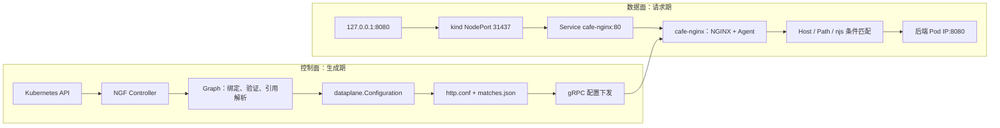

# Advanced Routing 示例源码与运行实证学习路线

> [!abstract] 核心结论
> `examples/advanced-routing` 展示的是一个 Gateway、一套独立 NGINX 数据面和三条 HTTPRoute。NGF 控制器不承载业务流量，而是把 Gateway API 对象转换为 `graph.Graph`、`dataplane.Configuration`、`http.conf` 和 `matches.json`，再通过 NGINX Agent 下发；真正的请求由 `cafe-nginx` 根据 Host、Path、Header、Query 和 Method 转发到五个后端。

## 这组笔记回答什么

这组笔记面向不熟悉 NGINX、但希望从 Kubernetes YAML 一直看到实际请求结果的读者。它负责回答：

- 示例目录中的每个资源承担什么职责；
- 当前 kind、Helm、GatewayClass、NginxProxy 和数据面实际是什么状态；
- HTTPRoute 如何进入 NGF 源码并最终生成 NGINX 配置；
- NGINX 的 `server`、`location`、`upstream` 和 njs 各自做什么；
- 为什么正则路径能压过 `/coffee` 的 Header 条件；
- 如何用最短命令复现和排查这套链路。

它不展开 Agent gRPC 协议、TLS 证书轮换和 `dataplane.Configuration` 全字段。相关专题见：

- [[ngf-agent-control-plane/08-订阅长流-Subscribe与配置下发]]
- [[ngf-agent-control-plane/10-配置应用-ACK-状态回传]]
- [[ngf-agent-control-plane/23-BuildConfiguration字段到OSS-NGINX配置映射]]

## 最小心智模型

**结构图（源码事实 + 运行观察）：**

一句话记忆：==NGF 管配置，NGINX 跑流量，Service/EndpointSlice 提供后端地址。==

## 阅读路线

### 15 分钟快速理解

1. [[01-当前kind环境与资源拓扑]]：先确认“现场里到底有什么”。
2. [[03-NGINX高级路由匹配机制]]：理解请求为什么去 v1、v2、v3、tea 或 tea-post。
3. [[04-kind验证与排障手册]]：直接复现请求矩阵。

### 源码深挖

1. [[02-GatewayAPI到NGINX配置生成链路]]：沿 Watch → Graph → IR → 文件 → Agent ACK 逐跳阅读。
2. [[regex-route-yaml|regex-route.yaml 静态源码分析]]：回看 2026-07-14 的逐文件静态分析及其证据边界。
3. [[99-Advanced-Routing源码索引与术语表]]：按主题定位符号、运行产物和术语。

### 二次开发

- 改 Route 验证：从 `graph/httproute.go` 和负例测试开始。
- 改规则优先级：从 `state/dataplane/sort.go` 开始，同时检查 `matches.json` 顺序。
- 改 NGINX 输出：从 `nginx/config/servers.go` 和模板测试开始。
- 改配置交付：转到 [[ngf-agent-control-plane/22-DeploymentBroadcaster广播器机制与全链路]]。

## 版本与证据边界

> [!info] 两个源码修订必须分开
> 当前工作区是干净提交 `3a30b346...`；kind 中运行的是 NGF `2.6.5`，对应标签提交 `b6eb18e9...`。两者相关目录已有明显差异，因此本专题使用当前源码帮助定位，用 `v2.6.5` 标签源码解释运行版本，并以 Pod 内 `nginx -T` 和真实请求作为最终运行事实。

本专题已核对：

- `GatewayClass`、`Gateway`、`HTTPRoute`、`NginxProxy`、Service、Deployment、Pod 和 EndpointSlice；
- Helm computed values 与 live `NginxGateway`；
- kind 节点 Docker 端口映射；
- 数据面进程、NGINX 版本、`http.conf`、`matches.json`；
- 控制面/Agent 日志和 12 组请求结果。

原始 kind 创建 YAML 的保存位置未定位，但 Docker 的有效端口绑定已直接观察，不影响请求链结论。

## 语料导航

- 上级入口：[[examples-source-analysis/00-首页-学习路线|NGF examples 二八源码学习路线]]
- 本专题索引：[[99-Advanced-Routing源码索引与术语表]]
