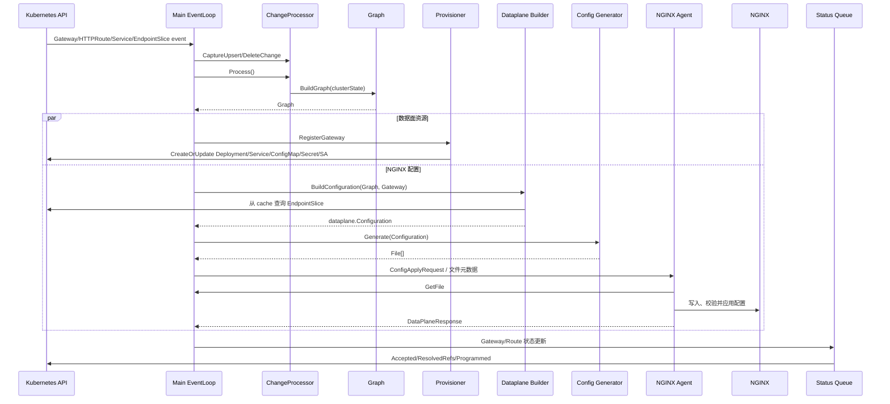

# Advanced Routing 从 Gateway API 到 NGINX 配置生成链路

> [!abstract] Trigger → Effect
> 触发点是 Gateway、HTTPRoute、Service 或 EndpointSlice 的新增/变更；终点是 `cafe-nginx` 中 `/etc/nginx/conf.d/http.conf` 与 `matches.json` 被 Agent 成功应用、NGINX 用新配置处理请求，并由 NGF 回写 Gateway/Route 状态。Provisioner 的“创建数据面 Kubernetes 对象”和主 EventLoop 的“生成并下发 NGINX 配置”是两条并行但协作的链路，不应混为一次 Reconcile。

## 1. 注册期与运行期必须分开

### 注册期

`ngf:internal/controller/manager.go:registerControllers` 为以下资源注册 controller-runtime Watch：

- GatewayClass、Gateway、HTTPRoute；
- Service、Secret、ConfigMap；
- EndpointSlice，并为 Service 名建立 field index；
- NginxProxy、NginxGateway 及其他可选 CRD。

Provisioner 另有自己的 EventLoop，主要 Watch Gateway 以及 NGF 管理的 Deployment、Service、ConfigMap、Secret、ServiceAccount 等资源。

注册只建立“事件将来如何进入系统”的关系，并不会在注册时生成配置。

### 运行期

`eventHandlerImpl.HandleEventBatch` 才是真正处理一批资源变化的入口。它先捕获所有事件，再调用一次 `ChangeProcessorImpl.Process` 重建 Graph，然后为每个有效 Gateway 构建和下发配置。

## 2. 完整因果链

**时序图（源码事实 + 运行日志佐证）：**



## 3. 编号跳点

| # | Actor / 符号 | 输入 → 输出 | 边界与门禁 | 失败语义 |
|---:|---|---|---|---|
| 1 | `controller.Register` | Kubernetes 对象变化 → `UpsertEvent/DeleteEvent` | Predicate 过滤 generation、resourceVersion、label 等 | 被过滤的状态型变化不触发业务重建 |
| 2 | `eventHandlerImpl.HandleEventBatch` | `EventBatch` → 捕获到 clusterState | 一批事件统一处理；事件可重复 | 未知事件类型触发 panic，属于内部不变量 |
| 3 | `ChangeProcessorImpl.Process` | clusterState → `graph.Graph` | mutex 串行保护；无有效变化返回 nil | Graph 构建失败体现在对象条件与有效性，而不是静默引用 |
| 4 | `graph.BuildGraph` | API 对象 → Gateway、Listener、L7Route、BackendRef 语义图 | GatewayClass、parentRef、hostname、allowedRoutes、引用授权、字段校验 | 无效 Route/引用不进入预期有效配置 |
| 5 | `NginxProvisioner.RegisterGateway` | `graph.Gateway` → 数据面 Kubernetes 对象 | 仅 leader；Gateway 必须有效且有 listener | 无效 Gateway 触发数据面资源回收 |
| 6 | `dataplane.BuildConfiguration` | Graph + 单个 Gateway → `dataplane.Configuration` | 只处理当前 Gateway 可达的有效 Listener/Route | 无效 match/filter 不生成相应 upstream |
| 7 | `ServiceResolverImpl.Resolve` | ServicePort → `[]resolver.Endpoint` | EndpointSlice 端口、地址族、`Ready=True` | 无 endpoint 时 upstream 使用内部 503 socket |
| 8 | `sortPathRules/sortMatchRules` | PathRule/MatchRule → 有序规则 | 路径长度、Method、Header 数、Query 数、Route 年龄/名称、稳定顺序 | 顺序错误会改变首个胜出规则 |
| 9 | `GeneratorImpl.Generate` | Configuration → `[]agent.File` | 模板要求 IR 已通过验证 | 模板构造错误是内部开发错误；生成文件仍需 Agent 应用验证 |
| 10 | `NginxUpdaterImpl.UpdateConfig` | File[] → ConfigApply 广播 | 文件 hash/version 去重；每 Deployment 有 FileLock | 无变化不重复发送；应用错误汇总到 Deployment |
| 11 | Agent → NGINX | 文件元数据 → 拉取文件 → 应用 → ACK | gRPC、TLS、投射 Token、Pod subscription | 连接错误重连；配置错误返回 DataPlaneResponse |
| 12 | Status Queue | Graph + 配置结果 → status.conditions | 聚合所有数据面 Pod 的最近错误 | 失败进入 Programmed/ResolvedRefs 等状态 |

## 4. 字段与产物谱系

| 声明字段 | Graph / IR | 生成产物 | 当前运行观察 |
|---|---|---|---|
| Gateway listener `80/HTTP` | Listener、VirtualServer.Port=80 | `listen 80`、数据面 Service port 80 | `cafe-nginx` 监听 IPv4/IPv6 80 |
| Route hostname `cafe.example.com` | accepted hostname、VirtualServer.Hostname | `server_name cafe.example.com` | 正确 Host 进入业务 server，错误 Host 404 |
| PathPrefix `/coffee` | PathRule(prefix) | `location /coffee/` + `location = /coffee` | `/coffee` 与 `/coffee/x` 匹配，`/coffeeabc` 404 |
| Header/Query/Method | MatchRule | `matches.json` + `js_content httpmatches.redirect` | v2/v3/tea 分流已通过请求验证 |
| RegularExpression path | PathRule(regularExpression) | `location ~ ^/coffee/[a-z]+` | `/coffee/latte` 直接到 v1 |
| backendRef Service:80 | BackendRef、Upstream | `upstream default_<svc>_80` | 写入 Ready Pod IP:8080 |
| NginxProxy NodePort | EffectiveNginxProxy | Service `nodePort:31437` | Docker host 8080 → node 31437 |

## 5. Provisioner 为什么是另一条 EventLoop

Provisioner 关注的是 Kubernetes 数据面对象是否存在且符合期望：Deployment、Service、ConfigMap、Secret、ServiceAccount 等。主配置链关注的是 Gateway API 语义和 NGINX 文件内容。

这种分离带来两个结果：

1. Gateway 有效后，数据面 Pod 可以先被创建，再由 Agent 建立 subscription 获取当前配置。
2. 用户手工修改或删除受管 Deployment/Service 时，Provisioner 能独立恢复它，不需要伪造一次 HTTPRoute 变化。

**源码事实**：`RegisterGateway` 只在 leader 上执行；`provisionNginx` 使用 `CreateOrUpdate`，并给资源设置 Gateway OwnerReference。

## 6. 配置文件如何送到 Agent

`GeneratorImpl.Generate` 生成的不是单个 `nginx.conf`，而是一组文件。当前专题最关键的是：

- `/etc/nginx/conf.d/http.conf`
- `/etc/nginx/conf.d/matches.json`
- `/etc/nginx/main-includes/main.conf`
- `/etc/nginx/events-includes/events.conf`

`NginxUpdaterImpl.UpdateConfig` 的 v2.6.5 源码注释给出了协议：

1. 在 Deployment 状态中设置文件和版本；
2. 向该 Deployment 的所有 Pod subscription 广播文件元数据；
3. Agent 为每个文件调用 GetFile；
4. Agent 更新 NGINX 并返回 DataPlaneResponse；
5. Controller 汇总结果并更新状态。

更深的协议细节由 [[ngf-agent-control-plane/08-订阅长流-Subscribe与配置下发]]、[[ngf-agent-control-plane/09-文件拉取-FileService与配置文件交付]] 和 [[ngf-agent-control-plane/10-配置应用-ACK-状态回传]] 维护。

## 7. 状态、并发、失败与恢复

- **事件批处理**：先捕获整批事件，再重建一次 Graph，减少每个对象事件都生成一次配置的抖动。
- **状态锁**：`ChangeProcessorImpl.Process` 使用 mutex；Deployment 配置更新由 FileLock 包围。
- **Leader**：仅 leader 负责 Provisioner 的资源创建/删除；当前环境只有一个控制面副本。
- **有效 Service、无 Ready Pod**：Route 结构仍可存在，但 upstream 指向 `/var/run/nginx/nginx-503-server.sock`，请求返回 503。
- **非法 BackendRef**：生成 `invalid-backend-ref`，指向内部 500 socket，并由 Route 状态暴露引用错误。
- **njs 没有候选命中**：返回 404。
- **Agent 凭据轮换**：当前日志约每 49 分钟出现一次连接 reset 和 `context canceled`，随后重新连接并收到 `Config apply successful, no files to change`；这是已恢复的连接生命周期，不是业务路由失败。

> [!warning] 尚未证明的边界
> 本次没有故意下发一份语法错误的 NGINX 配置，因此没有把“失败应用后旧配置是否保留”标成运行观察。源码和 Agent 设计指向校验/ACK 机制，但若要给出故障恢复的强保证，需要单独做受控失败实验。

## 8. 运行日志证据

当前日志按时间出现：

```text
successfully resolved endpoints
Creating/Updating nginx resources
Sent nginx configuration to agent
Received management plane config apply request
Config apply successful
Successfully configured nginx for new subscription
```

这组日志证明 Watch/Graph、Endpoint 解析、Provisioner、文件下发和 Agent ACK 的两端已经会合。

## 9. 关联笔记

- 上一篇：[[01-当前kind环境与资源拓扑]]
- 下一篇：[[03-NGINX高级路由匹配机制]]
- 详细索引：[[99-Advanced-Routing源码索引与术语表]]
