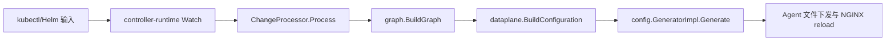

# examples/waf-policy/wafpolicy-http-route.yaml 源码分析

> [!abstract] 核心结论
> 该文件声明 1 个对象（WAFPolicy）。它的核心价值不是展示 YAML 语法，而是提供一段可追踪输入：受管对象经过 Graph 验证与引用解析，普通工作负载则只通过 Service/Secret 等边界间接影响 NGF。

## 为什么选它

此文件属于二八抽样中的代表输入：它覆盖 **WAFPolicy** 的关键处理面，并能与同目录文件组成完整或近完整的因果链。重复的 Deployment/Service 变体、只改变名称的 Route 和操作型 README 不再逐篇展开。

## 文件现场与职责边界

| 文档 | API 版本 | Kind | Namespace | Name |
|---:|---|---|---|---|
| 1 | `gateway.nginx.org/v1alpha1` | `WAFPolicy` | `default/继承 kubectl 上下文` | `customers-strict-protection` |

**源码事实**：文件指纹为 `5da00838d6c6`，分析基于 revision `87e0580143fc`。本文没有把案例实际部署到集群，因此“生成了某条 NGINX 指令”属于源码可推导的预期，不是运行观察。

本文件中的对象处于 NGF 直接 watch、引用或配置生成边界内；其是否生效仍取决于完整引用链。

## 字段到行为的精确映射

| 对象 | 字段 | 案例值 | 进入系统后的含义 |
|---:|---|---|---|
| 1 | `metadata.name` | `customers-strict-protection` | 组成 NamespacedName，是 Graph、引用解析与生成文件命名的稳定身份。 |
| 1 | `spec.targetRefs[0].group` | `gateway.networking.k8s.io` | Policy attachment 入口；目标类型与作用域决定策略进入 server、location 或 upstream。 |
| 1 | `spec.targetRefs[0].kind` | `HTTPRoute` | Policy attachment 入口；目标类型与作用域决定策略进入 server、location 或 upstream。 |
| 1 | `spec.targetRefs[0].name` | `customers` | Policy attachment 入口；目标类型与作用域决定策略进入 server、location 或 upstream。 |
| 1 | `spec.type` | `HTTP` | 由该资源所属 API/外部控制器消费；是否影响 NGF 取决于它是否处于 Gateway 可达引用链。 |
| 1 | `spec.policySource.httpSource.url` | `http://bundle-server.default.svc.cluster.local/dataguard-blocking.tgz` | 由该资源所属 API/外部控制器消费；是否影响 NGF 取决于它是否处于 Gateway 可达引用链。 |
| 1 | `spec.securityLogs[0].destination.type` | `stderr` | 转成 App Protect security log bundle/profile 与 destination。 |
| 1 | `spec.securityLogs[0].logSource.defaultProfile` | `log_all` | 转成 App Protect security log bundle/profile 与 destination。 |

> [!note] 阅读边界
> 表中“含义”描述字段进入控制器后的职责，不承诺所有字段都由 NGF 自己实现。例如 cert-manager 的 `Certificate` 最终产出 Secret，NGF 从 Secret 边界开始消费。

## 从案例到 NGINX 的源码链

构造期由 `internal/controller/manager.go` 注册 Watch；运行期由
`internal/controller/handler.go:eventHandlerImpl.HandleEventBatch` 批处理事件。只有受管 Gateway 可达、引用有效的对象才会进入
`internal/controller/state/dataplane/configuration.go:BuildConfiguration`。最终
`internal/controller/nginx/config/generator.go:GeneratorImpl.Generate` 生成 HTTP/stream/include/证书等文件，再由
`internal/controller/nginx/agent/deployment.go:Deployment.SetFiles` 交给数据面。

本文件涉及的专用落点：

| Kind | Graph/生成入口 | 终端效果 | 测试佐证 |
|---|---|---|---|
| `WAFPolicy` | `internal/controller/state/graph/policies.go:processWAFPolicies` | 解析策略/日志 bundle 来源并附着到 Gateway 或 Route，最终生成 App Protect include | `internal/controller/nginx/config/policies/waf/validator_test.go` 与 `generator_test.go` |

## 状态、失败与恢复

- 对象通过 API Server 校验，不代表它一定被当前 GatewayClass 管理；Graph 还会检查引用、作用域和支持能力。
- 引用的对象缺失、端口不匹配或跨 namespace 未获授权时，相关 Route/Policy 会带失败条件且不会产生预期配置。
- Policy/ExtensionRef 的 target 不存在、类型不支持或策略冲突时，不能把 YAML 字段直接等同于 NGINX 指令已生效。

恢复路径是修正声明式对象后重新提交；controller-runtime 会产生新事件，`ChangeProcessorImpl.Process` 重建 Graph，并为受影响 Gateway 重新生成配置。NGF 的关键安全属性是：无效引用应留在状态条件中，而不是悄悄生成指向错误对象的配置。

## 如何验证这篇笔记

1. 静态校验：`kubectl apply --dry-run=server -f examples/waf-policy/wafpolicy-http-route.yaml`。
2. 状态校验：查看相关 Gateway/Route/Policy 的 `status.conditions`，不要只看对象是否存在。
3. 数据面校验：对照 `internal/controller/state/dataplane/configuration.go:BuildConfiguration` 与生成器测试；若有运行环境，再检查 agent 下发后的 `http.conf`/`stream.conf`。
4. 回归测试入口：`internal/controller/nginx/config/policies/waf/validator_test.go` 与 `generator_test.go`。

## 二开提示

- 改 API 支持面时，通常要同步 Graph 验证、dataplane 中间表示、NGINX 生成器、状态条件和测试。
- 不要直接编辑生成文件或把示例中的外部控制器对象误归给 NGF。
- 修改 Route/filter/policy 时优先增加 Graph 负例，再增加生成器的精确字符串/结构断言。

## 最小心智模型

`示例文件` 只是期望状态；`Graph` 决定引用是否合法；`dataplane.Configuration` 决定哪些语义能进入生成器；NGINX 配置和资源状态才是可观察效果。中间任一门禁失败，都不能用“YAML 已创建”推断功能已生效。

## 关联笔记

- [[00-首页-学习路线]]
- [[99-源码索引与术语表]]
