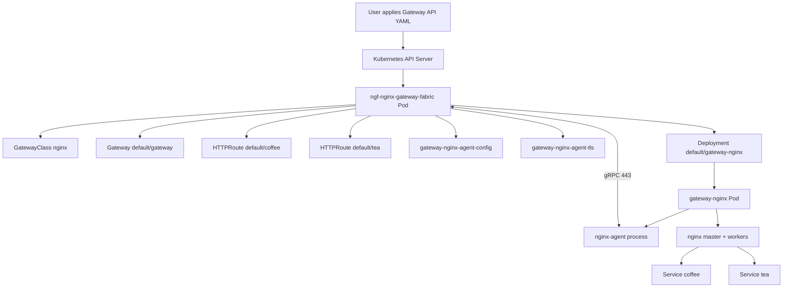

# 当前实验环境与资源拓扑

本篇固定当前实验现场。后续所有源码讲解都以这个环境为参照，避免只看源码而不知道运行时对象在哪里。

## 环境事实

当前 kubectl context：

```text
kind-ngf-demo
```

主要 namespace：

```text
default
nginx-gateway
kube-system
local-path-storage
```

NGF 控制面：

```text
namespace: nginx-gateway
deployment: ngf-nginx-gateway-fabric
pod: ngf-nginx-gateway-fabric-647df8fcfd-kffz4
image: ghcr.io/nginx/nginx-gateway-fabric:2.6.5
service: ngf-nginx-gateway-fabric
service port: 443/TCP
```

数据面：

```text
namespace: default
deployment: gateway-nginx
pod: gateway-nginx-5f95f75958-tn9fw
image: ghcr.io/nginx/nginx-gateway-fabric/nginx:2.6.5
service: gateway-nginx
service type: NodePort
service port: 80:31437/TCP
```

Gateway API 资源：

```text
GatewayClass: nginx
Gateway: default/gateway
HTTPRoute: default/coffee
HTTPRoute: default/tea
```

业务后端：

```text
Service: default/coffee -> Pod coffee-6db967495b-l8fs5
Service: default/tea -> Pod tea-7b7d6c947d-f7jbm
```

## 控制面启动参数

控制面 Deployment 中容器启动参数为：

```text
controller
--gateway-ctlr-name=gateway.nginx.org/nginx-gateway-controller
--gatewayclass=nginx
--config=ngf-config
--service=ngf-nginx-gateway-fabric
--agent-tls-secret=agent-tls
--metrics-port=9113
--health-port=8081
--leader-election-lock-name=ngf-nginx-gateway-fabric-leader-election
```

这些参数会进入 NGF 配置对象，最终驱动 [[03-NGF控制面启动流程]] 中的 `StartManager`。

> [!note] 关键映射
> `--service=ngf-nginx-gateway-fabric` 会影响 Agent 配置里的 gRPC server host，`--agent-tls-secret=agent-tls` 会影响 Provisioner 给数据面生成的 TLS secret。

## 数据面 Agent 配置

数据面 ConfigMap `default/gateway-nginx-agent-config` 中的核心配置：

```yaml
command:
  server:
    host: ngf-nginx-gateway-fabric.nginx-gateway.svc
    port: 443
  auth:
    tokenpath: /var/run/secrets/ngf/serviceaccount/token
  tls:
    cert: /var/run/secrets/ngf/tls.crt
    key: /var/run/secrets/ngf/tls.key
    ca: /var/run/secrets/ngf/ca.crt
    server_name: ngf-nginx-gateway-fabric.nginx-gateway.svc
allowed_directories:
  - /etc/nginx
  - /usr/share/nginx
  - /var/run/nginx
  - /etc/app_protect/bundles/
features:
  - configuration
  - certificates
  - metrics
labels:
  cluster-id: 55d0f802-6c05-4c70-887a-775ccaf119f5
  control-id: 77889ff5-3dcd-4e41-aaa6-7b2bb8117006
  control-name: ngf-nginx-gateway-fabric
  control-namespace: nginx-gateway
  owner-name: default_gateway-nginx
  owner-type: Deployment
  product-type: ngf
  product-version: 2.6.5
```

这段配置是 Agent 连接 NGF 的入口：

- `command.server.host` 指向 NGF 控制面 Service。
- `command.auth.tokenpath` 指向 projected service account token。
- `command.tls.*` 指向数据面挂载的 TLS 文件。
- `labels.owner-name` 和 `labels.owner-type` 帮助 NGF 判断这个 Agent 属于哪个数据面 Deployment。

## 数据面 Pod 进程

数据面 Pod 中实际运行两个核心进程：

```text
nginx: master process /usr/sbin/nginx -g daemon off;
nginx-agent
```

这说明 `gateway-nginx` 不是单纯的 NGINX 容器。它同时承载：

- NGINX 数据面进程。
- Agent 控制通道进程。

## 资源拓扑图



## 推荐现场命令

```bash
kubectl config current-context
kubectl get pods,svc,gatewayclass,gateway,httproute -A -o wide
kubectl get deploy,cm,secret -n nginx-gateway -o wide
kubectl get cm gateway-nginx-agent-config -n default -o yaml
kubectl get deploy gateway-nginx -n default -o yaml
kubectl exec -n default gateway-nginx-5f95f75958-tn9fw -- ps -ef
kubectl logs -n nginx-gateway deploy/ngf-nginx-gateway-fabric --tail=80
```

## 和后续章节的关系

- 数据面配置来源：[[04-数据面Pod是如何被Provisioner创建的]]
- Agent 如何读取配置：[[05-Agent启动与插件总线机制]]
- gRPC 如何连接：[[07-连接建立-CreateConnection全链路]]
- Cafe demo 如何变成 NGINX 配置：[[12-Cafe示例端到端溯源]]

