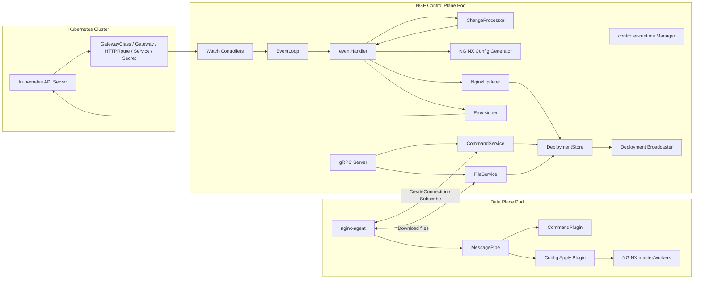
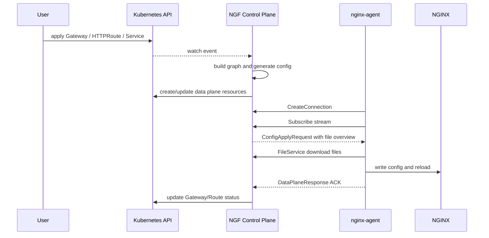

# NGF 与 Agent 整体架构图

NGF 与 Agent 的交互可以理解成三层：

1. Kubernetes 资源层：用户提交 Gateway API 资源。
2. NGF 控制面层：监听资源、构建 graph、生成 NGINX 配置、维护数据面连接。
3. 数据面 Agent 层：连接控制面、接收配置、拉取文件、应用到 NGINX。

## 总体组件图

## 一句话理解每个核心对象

| 对象 | 所在项目 | 职责 |
|---|---|---|
| `StartManager` | NGF | 控制面总装配入口，创建 manager、controllers、processor、updater、provisioner、event loop |
| `ChangeProcessor` | NGF | 把 Kubernetes 资源状态构建成内部 graph |
| `eventHandler` | NGF | 处理事件批次，触发配置生成、状态更新和数据面更新 |
| `NginxUpdater` | NGF | 保存每个数据面 Deployment 的配置与广播器，对连接中的 Agent 下发更新 |
| `DeploymentStore` | NGF | 按 `namespace/name` 保存数据面 Deployment 的运行态信息 |
| `Broadcaster` | NGF | 把某个 Deployment 的配置更新广播给已订阅的 Agent 连接 |
| `CommandService` | 两边都有 | gRPC 命令服务；NGF 是 server，Agent 是 client |
| `FileService` | 两边都有 | gRPC 文件服务；Agent 根据文件摘要向 NGF 拉文件 |
| `MessagePipe` | Agent | Agent 内部消息总线，插件之间不直接互调 |
| `CommandPlugin` | Agent | 维护控制面连接，把 gRPC 请求转成内部消息，把执行结果回传 |

## 控制面与数据面分工

NGF 控制面负责：

- 监听 Gateway API 和相关 Kubernetes 资源。
- 计算期望状态。
- 生成 NGINX 配置文件。
- 创建数据面 Deployment、Service、ConfigMap、Secret。
- 维护 gRPC server。
- 向连接中的 Agent 下发配置摘要。
- 根据 Agent ACK 更新状态。

Agent 数据面负责：

- 从配置文件读取控制面地址、TLS、token、labels。
- 建立 gRPC 连接。
- 订阅控制面配置。
- 拉取实际配置文件。
- 写入 NGINX 配置目录。
- 测试、reload 或回滚配置。
- 把执行结果回传控制面。

> [!warning] 关键边界
> NGF 不直接进入数据面 Pod 写文件。它通过 gRPC 协议把期望配置交给 Agent，由 Agent 在本 Pod 内完成文件落盘和 NGINX 操作。

## 主交互时序

## 读源码的正确方向

不要先从 proto 或某个 handler 孤立看起。推荐顺序：

1. NGF `internal/controller/manager.go`，建立控制面启动图。
2. NGF `internal/controller/nginx/agent/`，理解 gRPC server、DeploymentStore、Broadcaster。
3. Agent `cmd/agent/main.go` 和 `internal` 应用启动，理解插件和消息总线。
4. Agent `internal/command/`，理解 gRPC client 和 Subscribe。
5. Agent 配置应用相关包，理解请求如何落到 NGINX。

## 下一步

继续读 [[03-NGF控制面启动流程]]，从 NGF 控制面的实际入口开始。

