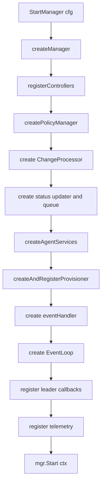

# NGF 控制面启动流程

NGF 控制面启动的核心入口是 `StartManager`。理解这个函数，基本就理解了 NGF 控制面进程里有哪些长期运行组件，以及它们之间怎么连接。

## 源码入口

重点文件：

```text
nginx-gateway-fabric/internal/controller/manager.go
```

重点函数：

```text
StartManager
createAgentServices
createAndRegisterProvisioner
createWAFPollerManager
registerTelemetry
createManager
```

## 当前环境对应关系

控制面 Pod 启动参数：

```text
controller
--gateway-ctlr-name=gateway.nginx.org/nginx-gateway-controller
--gatewayclass=nginx
--config=ngf-config
--service=ngf-nginx-gateway-fabric
--agent-tls-secret=agent-tls
--metrics-port=9113
--health-port=8081
--leader-election-lock-name=ngf-nginx-gateway-fabric-leader-election
```

这些参数最终进入 `config.Config`，再传给 `StartManager(cfg)`。当前日志中能看到：

```text
Starting the NGINX Gateway Fabric control plane
Starting manager
Attempting to acquire leader lease...
Successfully acquired lease
```

这对应 `StartManager` 创建 manager、注册 runnable、启动 leader election 的过程。

## StartManager 主流程



## createManager 做什么

`createManager` 基于 controller-runtime 创建 manager。它负责：

- 注入 scheme。
- 配置 metrics、health probe。
- 配置 leader election。
- 配置 cache 范围。
- 添加 Pod IP indexer。

Pod IP indexer 很重要。NGF 后续要校验 Agent 连接来自正确的数据面 Pod，必须能按 Pod IP 快速查到 Pod。

> [!tip] 读代码时关注
> `createManager` 不是业务逻辑核心，但它决定了控制器缓存、健康检查、leader election 和连接校验的基础能力。

## registerControllers 做什么

`registerControllers` 会把 Gateway API、NGF 自定义资源、Secret、Service、Endpoint 等 watch controller 注册到 manager，并把资源变化投递到 `eventCh`。

后续 `EventLoop` 从 `eventCh` 读事件，再交给 `eventHandler`。

这体现了 NGF 的控制面风格：

```text
Kubernetes watch event
  -> eventCh
  -> EventLoop
  -> eventHandler
  -> ChangeProcessor / NginxUpdater / Provisioner / Status
```

## ChangeProcessor 的位置

`ChangeProcessor` 不是直接 watch Kubernetes 的组件。它的职责是把一批资源快照转换成 NGF 内部 graph。

输入：

- GatewayClass
- Gateway
- HTTPRoute
- Service
- Secret
- NGF Policy
- 其他相关资源

输出：

- graph
- validation result
- status 需要的信息
- 生成 NGINX 配置所需的数据结构

它位于 watch 层和配置生成层之间，是“资源语义解释器”。

## createAgentServices 做什么

这是 NGF 与 Agent 交互的关键装配点：

```text
resetConnChan := make(chan struct{})
nginxUpdater := agent.NewNginxUpdater(...)
grpcServer := agentgrpc.NewServer(...)
grpcServer registers:
  nginxUpdater.CommandService.Register
  nginxUpdater.FileService.Register
mgr.Add(grpcServer)
```

它创建：

- `NginxUpdater`
- gRPC server
- `CommandService`
- `FileService`
- `resetConnChan`

并把 gRPC server 作为 runnable 注册到 manager。

当前环境里，Agent 配置的目标就是这个 server：

```text
ngf-nginx-gateway-fabric.nginx-gateway.svc:443
```

## createAndRegisterProvisioner 做什么

Provisioner 负责创建和维护数据面 Kubernetes 对象：

- Deployment
- Service
- ServiceAccount
- ConfigMap
- Secret
- TLS 相关资源
- NGINX includes bootstrap 配置

它和 `NginxUpdater` 共享 `DeploymentStore`：

```text
provisioner.Config{
  DeploymentStore: nginxUpdater.NginxDeployments
}
```

这个共享点非常重要：

- Provisioner 知道哪些 Gateway 需要哪些数据面 Deployment。
- NginxUpdater 知道每个 Deployment 当前应下发哪些 NGINX 文件。
- CommandService 在 Agent 连接时也通过这个 store 找回所属 Deployment。

## EventHandler 的职责

`eventHandler` 是控制面变化处理的汇聚点。它拿到：

- `nginxUpdater`
- `nginxProvisioner`
- `processor`
- `generator`
- `statusUpdater`
- `serviceResolver`
- `deployCtxCollector`

因此它能完成完整闭环：

```text
资源变化
  -> 重新计算 graph
  -> 生成 NGINX 配置
  -> 创建或更新数据面资源
  -> 向已连接 Agent 下发配置
  -> 更新 Kubernetes status
```

## Leader election 的影响

NGF 使用 leader election，但一些 controller 仍然在非 leader Pod 上工作。真正需要 leader 后执行的函数通过：

```text
runnables.NewCallFunctionsAfterBecameLeader
```

启用：

- group status updater
- nginx provisioner
- event handler

这意味着多副本控制面中，只有 leader 执行会改变外部状态的关键操作。

## 本篇结论

`StartManager` 是 NGF 控制面总装配器。它不直接处理 Gateway API 业务细节，而是把这些模块接起来：

- watch controller 负责收事件。
- EventLoop 负责事件循环。
- ChangeProcessor 负责资源语义。
- eventHandler 负责业务编排。
- NginxUpdater 负责数据面配置状态与下发。
- Provisioner 负责数据面 Kubernetes 对象。
- gRPC server 负责和 Agent 通信。

下一篇 [[04-数据面Pod是如何被Provisioner创建的]] 会深入数据面对象是怎样生成的。

