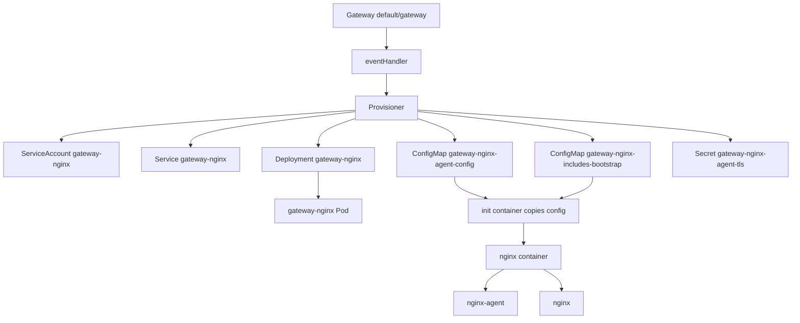

# 数据面 Pod 是如何被 Provisioner 创建的

NGF 的数据面 Pod 不是用户手工创建的普通 NGINX Deployment，而是控制面根据 Gateway 资源通过 Provisioner 生成的 Kubernetes 对象。

## 当前环境中的数据面对象

Gateway：

```text
default/gateway
```

对应数据面：

```text
Deployment: default/gateway-nginx
Service: default/gateway-nginx
ConfigMap: default/gateway-nginx-agent-config
Secret: default/gateway-nginx-agent-tls
ConfigMap: default/gateway-nginx-includes-bootstrap
ServiceAccount: default/gateway-nginx
```

控制面日志中也能看到 Provisioner 的动作：

```text
Creating/Updating nginx resources
namespace="default"
nginx resource name="gateway-nginx"
resource names=[
  "gateway-nginx-agent-tls (Secret)",
  "gateway-nginx-includes-bootstrap (ConfigMap)",
  "gateway-nginx-agent-config (ConfigMap)",
  "gateway-nginx (ServiceAccount)",
  "gateway-nginx (Service)",
  "gateway-nginx (Deployment)"
]
```

## 数据面 Deployment 的关键设计

数据面 Deployment 中只有一个业务容器 `nginx`，但容器内实际运行：

```text
nginx master process
nginx-agent
```

这通过镜像 entrypoint 完成。Pod 里还有一个 init container：

```text
/usr/bin/gateway initialize
  --source /agent/nginx-agent.conf
  --destination /etc/nginx-agent
  --source /includes/main.conf
  --destination /etc/nginx/main-includes
  --source /includes/events.conf
  --destination /etc/nginx/events-includes
```

init container 的职责是把控制面生成的 bootstrap 文件复制到可写 emptyDir 中。这样主容器可以使用只读 root filesystem，同时仍能让 Agent 更新 NGINX 配置目录。

## 挂载目录的意义

数据面 Pod 中的关键 volume：

| volume | mountPath | 用途 |
|---|---|---|
| `nginx-agent` | `/etc/nginx-agent` | Agent 配置文件落盘位置 |
| `nginx-agent-config` | `/agent` | init container 读取的 ConfigMap |
| `nginx-agent-tls` | `/var/run/secrets/ngf` | Agent mTLS 证书、key、CA |
| `token` | `/var/run/secrets/ngf/serviceaccount` | audience 指向 NGF Service 的 projected token |
| `nginx-conf` | `/etc/nginx/conf.d` | Agent 写入 HTTP 配置 |
| `nginx-stream-conf` | `/etc/nginx/stream-conf.d` | Agent 写入 stream 配置 |
| `nginx-secrets` | `/etc/nginx/secrets` | TLS 或认证相关 secret 文件 |
| `nginx-run` | `/var/run/nginx` | NGINX runtime 文件 |
| `nginx-cache` | `/var/cache/nginx` | NGINX cache |
| `nginx-includes` | `/etc/nginx/includes` | include 文件 |

这些目录必须和 Agent 配置里的 `allowed_directories` 对齐。否则 Agent 拉到文件后也不应该写入不允许的路径。

## Agent 配置是 Provisioner 生成的

`gateway-nginx-agent-config` 的核心字段：

```yaml
command:
  server:
    host: ngf-nginx-gateway-fabric.nginx-gateway.svc
    port: 443
  auth:
    tokenpath: /var/run/secrets/ngf/serviceaccount/token
  tls:
    cert: /var/run/secrets/ngf/tls.crt
    key: /var/run/secrets/ngf/tls.key
    ca: /var/run/secrets/ngf/ca.crt
    server_name: ngf-nginx-gateway-fabric.nginx-gateway.svc
labels:
  owner-name: default_gateway-nginx
  owner-type: Deployment
  product-type: ngf
  product-version: 2.6.5
```

这说明 Provisioner 不只是创建 NGINX Pod，还把 Agent 连接控制面的必要材料一起生成。

## 从 Gateway 到数据面资源



## 为什么这样设计

这种设计把职责拆开：

- NGF 控制面负责生成 Kubernetes 对象和期望配置。
- init container 负责初始化只读文件系统下需要的可写配置目录。
- Agent 负责后续动态配置更新。
- NGINX 只负责处理流量。

好处：

- 数据面不需要 Kubernetes API 权限去 watch Gateway API。
- 控制面不需要进入 Pod 写文件。
- 配置更新走稳定的 gRPC 通道。
- TLS、token、owner labels 都由控制面统一生成，减少人工配置。

## 二开提示

如果你要改数据面 Pod 形态，通常看这些方向：

- 新增 Agent 配置字段：改 Provisioner 生成 `gateway-nginx-agent-config` 的逻辑，同时确认 Agent 配置结构支持。
- 新增挂载目录：同时改 Deployment volume、volumeMount、Agent `allowed_directories`。
- 新增数据面 sidecar：检查安全上下文、只读文件系统、ServiceAccount、资源限制。
- 改 TLS 或 token：同时看 [[13-TLS-Token-鉴权与连接重置]]。

下一篇 [[05-Agent启动与插件总线机制]] 解释数据面 Pod 里的 Agent 如何启动。

