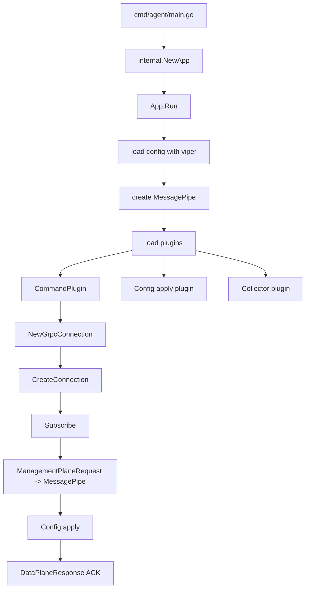
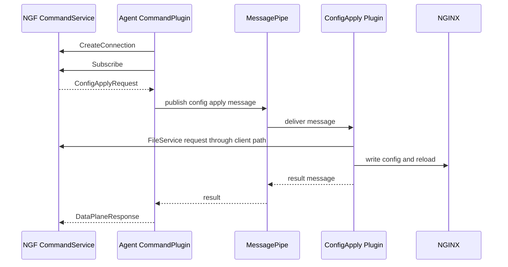

# Agent 启动与插件总线机制

NGINX Agent v3 不是一个单体式流程，而是“配置加载 + 消息总线 + 插件”的结构。它通过 CommandPlugin 与 NGF 控制面建立连接，再把收到的管理面请求转换成内部消息。

## 源码入口

重点入口：

```text
agent/cmd/agent/main.go
agent/internal.NewApp()
agent/internal.App.Run()
agent/internal/bus
agent/internal/plugin
agent/internal/command
```

已有详细材料：

- `agent/docs/nginx-agent-startup-and-architecture-analysis.md`
- `agent/docs/nginx-agent-startup-and-control-plane-analysis.md`
- `agent/docs/architecture/startup-flow-and-communication.md`

## 当前数据面中的 Agent

在 `default/gateway-nginx-5f95f75958-tn9fw` 中可以看到：

```text
nginx-agent
nginx: master process /usr/sbin/nginx -g daemon off;
```

Agent 配置文件来自：

```text
/etc/nginx-agent/nginx-agent.conf
```

它由 init container 从 ConfigMap 复制过来。

## 启动流程总览



## 配置加载

Agent 配置加载使用 Viper。关键设计：

- YAML 文件提供基础配置。
- 环境变量可覆盖配置。
- flag 名称会做归一化。
- 严格校验配置结构，避免拼错字段静默失效。
- 一些默认值依赖运行上下文。

当前 NGF 生成的配置里，最关键的是 `command` 部分：

```yaml
command:
  server:
    host: ngf-nginx-gateway-fabric.nginx-gateway.svc
    port: 443
  auth:
    tokenpath: /var/run/secrets/ngf/serviceaccount/token
  tls:
    cert: /var/run/secrets/ngf/tls.crt
    key: /var/run/secrets/ngf/tls.key
    ca: /var/run/secrets/ngf/ca.crt
    server_name: ngf-nginx-gateway-fabric.nginx-gateway.svc
```

这决定了 Agent 连接哪个管理面、使用什么证书和 token。

## MessagePipe 是什么

MessagePipe 是 Agent 内部消息总线。它解决的问题是：CommandPlugin 收到 gRPC 请求后，不应该直接 import 并调用所有业务模块。

因此内部通信变成：

```text
CommandPlugin
  -> publish message
  -> MessagePipe
  -> config apply plugin / health plugin / resource plugin
  -> response message
  -> CommandPlugin
  -> DataPlaneResponse
```

好处：

- 插件之间低耦合。
- 控制面协议和本地执行逻辑分离。
- 插件可以独立测试。
- 后续增加新功能时，不必把 CommandPlugin 改成巨型调度器。

## CommandPlugin 的职责

CommandPlugin 是 Agent 和 NGF 的边界插件。它负责：

- 创建 gRPC client。
- 调用 `CreateConnection`。
- 启动 `Subscribe` 长流。
- 接收 `ManagementPlaneRequest`。
- 把 config apply、API action 等请求转换成内部消息。
- 收集内部执行结果。
- 通过 gRPC stream 发送 `DataPlaneResponse`。

它不应该负责具体如何写 NGINX 文件，也不应该负责 NGINX reload 的细节。

## Agent 插件协作时序



## 二开提示

如果你要扩展 Agent：

- 新增控制面下发命令：先看 [[15-二次开发指南-改协议]]。
- 新增本地执行能力：优先做成独立插件，通过 MessagePipe 通信。
- 不要让 CommandPlugin 直接依赖太多业务包。
- 如果改配置字段，要同时看 Agent Viper 配置和 NGF Provisioner 生成配置。

下一篇 [[06-gRPC-MPI协议与pb生成代码]] 解释 Agent 与 NGF 之间的协议层。

