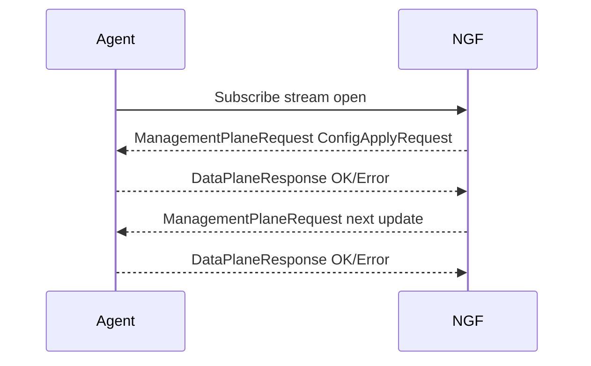
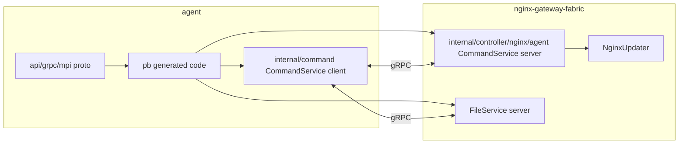

# gRPC MPI 协议与 pb 生成代码

NGF 与 Agent 之间的协议叫 Management Plane Interface，简称 MPI。它用 Protocol Buffers 定义消息，用 gRPC 承载调用。

## 关键结论

- NGF 在这条链路中是 gRPC server。
- Agent 在这条链路中是 gRPC client。
- `CommandService` 负责连接、状态上报和订阅长流。
- `FileService` 负责按需拉取配置文件内容。
- 生成的 `*.pb.go` 和 `*_grpc.pb.go` 不应该手改。
- 协议变化要从 `.proto` 开始，再用 buf 生成代码。

## 核心服务

### CommandService

CommandService 的关键 RPC：

```text
CreateConnection
UpdateDataPlaneStatus
UpdateDataPlaneHealth
Subscribe
```

其中：

- `CreateConnection` 是 Agent 注册连接。
- `Subscribe` 是 Agent 和控制面之间的双向流。
- `UpdateDataPlaneStatus` 用于上报实例和配置状态。
- `UpdateDataPlaneHealth` 用于上报健康状态。

### FileService

FileService 的职责是让 Agent 根据控制面发来的文件摘要拉取文件内容。

这样配置下发不必把所有文件都直接塞进 `Subscribe` 消息中。

## 为什么 Subscribe 是双向流

`Subscribe` 不是普通 unary RPC，因为配置下发需要长期保持：

- 控制面随时可以推送配置更新。
- Agent 随时可以回 ACK 或错误。
- 连接断开后 Agent 可以重连并重新订阅。
- 控制面可以区分初始配置和后续广播配置。



## 关键消息类型

| 类型 | 方向 | 作用 |
|---|---|---|
| `CreateConnectionRequest` | Agent -> NGF | 携带 Agent resource、labels、实例信息 |
| `CreateConnectionResponse` | NGF -> Agent | 告诉 Agent 连接注册是否成功 |
| `ManagementPlaneRequest` | NGF -> Agent | 控制面下发命令，常见是 `ConfigApplyRequest` |
| `DataPlaneResponse` | Agent -> NGF | 数据面对命令的响应 |
| `CommandResponse` | Agent -> NGF | 表示命令执行 OK 或 ERROR |
| `File` / file overview | NGF -> Agent | 描述文件路径、权限、摘要等元信息 |

## 生成代码边界

Agent 仓库的相关文档：

- `agent/docs/buf-grpc-tutorial.md`
- `agent/docs/grpc-proto-pb-analysis.md`

常见生成流程：

```bash
cd agent
make generate
```

其中会包括：

```text
cd api/grpc && buf generate
go generate ./...
```

> [!warning] 不要手改生成代码
> `*.pb.go`、`*.pb.validate.go`、`*_grpc.pb.go`、fakes 都应由生成器维护。手改会在下次生成时丢失，也容易破坏协议一致性。

## NGF 与 Agent 如何共用协议

Agent 仓库拥有 proto 和生成代码。NGF 引入对应的 Go package 后实现 server 侧逻辑：

```text
nginx-gateway-fabric/internal/controller/nginx/agent/command.go
nginx-gateway-fabric/internal/controller/nginx/agent/file.go
```

Agent 实现 client 侧逻辑：

```text
agent/internal/command/command_service.go
agent/internal/command/command_plugin.go
agent/internal/grpc/grpc.go
```

这意味着改协议时通常要同时改两个仓库：

- Agent：proto、生成代码、client 处理逻辑、测试。
- NGF：server 实现、配置生成或状态处理逻辑、测试。

## 协议调用图



## 下一步

协议层理解后，继续读 [[07-连接建立-CreateConnection全链路]]，看 Agent 首次连接如何被 NGF 登记。

