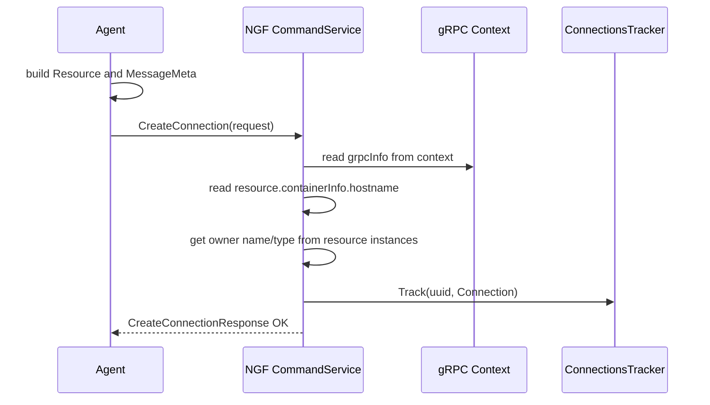

# 连接建立 CreateConnection 全链路

`CreateConnection` 是 Agent 与 NGF 建立控制通道时的第一步。它的目的不是下发配置，而是让 NGF 知道“这个 gRPC 连接属于哪个数据面 Pod、哪个 Deployment、哪个 NGINX instance”。

## 当前环境中的证据

控制面日志中能看到：

```text
Creating connection for nginx pod: gateway-nginx-5f95f75958-tn9fw
Successfully connected to nginx agent
Deployment={"name":"gateway-nginx","namespace":"default"}
uuid="3f3ffa23-b871-3816-a2ac-f1235b9a788d"
```

这说明：

- Agent 已经连到 NGF gRPC server。
- NGF 从请求中识别出了 Pod 名。
- NGF 将连接绑定到 `default/gateway-nginx`。
- gRPC 连接上下文中有一个 UUID，用于后续追踪连接和 pod status。

## 两边源码入口

NGF server 侧：

```text
nginx-gateway-fabric/internal/controller/nginx/agent/command.go
commandService.CreateConnection
```

Agent client 侧：

```text
agent/internal/command/command_service.go
CommandService.CreateConnection
CommandService.createConnectionCall
```

连接创建依赖的 Agent 信息：

```text
agent/pkg/host/info.go
ResourceID
```

## 时序图



## Agent 发送什么

Agent 侧会构造 `CreateConnectionRequest`，核心包含：

- `MessageMeta`：correlation id 等元信息。
- `Resource`：数据面资源身份。
- `ContainerInfo`：包括 hostname，当前环境中就是 Pod 名。
- `Instances`：包括 NGINX instance 信息和 labels。

当前 Agent 配置里的 labels 很关键：

```yaml
labels:
  owner-name: default_gateway-nginx
  owner-type: Deployment
  product-type: ngf
  product-version: 2.6.5
```

NGF 会依赖这些信息把 Agent 连接映射回数据面 Deployment。

## NGF 如何处理

`commandService.CreateConnection` 的核心动作：

1. 检查请求是否为空。
2. 从 gRPC context 读取 `grpcInfo`。
3. 从 `req.Resource.ContainerInfo.Hostname` 读取 Pod 名。
4. 从 resource instances 中解析 owner name 和 owner type。
5. 从 instances 中解析 NGINX instance ID。
6. 构造 `agentgrpc.Connection`。
7. 用连接 UUID 调用 `connTracker.Track`。
8. 返回 `CommandResponse_COMMAND_STATUS_OK`。

抽象后就是：

```text
request resource
  -> pod hostname
  -> owner labels
  -> Deployment identity
  -> connection tracker
```

## ConnectionsTracker 的作用

`ConnectionsTracker` 是后续 `Subscribe` 的前置依赖。`CreateConnection` 只登记连接，但真正配置下发发生在 `Subscribe`。

因此 NGF 需要在 `Subscribe` 中能回答：

```text
这个 stream 的 UUID 对应哪个 Deployment？
这个 Deployment 在 DeploymentStore 中有没有配置？
这个 Agent 应该拿哪一份初始配置？
```

`CreateConnection` 就是为这些问题建立索引。

## 为什么不在 Subscribe 里直接注册

理论上 Agent 可以打开 Subscribe 后第一条消息发身份信息。但 NGF 选择先做 `CreateConnection` 有几个好处：

- 连接注册是 unary RPC，错误处理更简单。
- Subscribe 专注于长流消息，不混入初始化语义。
- 控制面可以在 Subscribe 前校验身份和 owner labels。
- 重连时可以复用相同的连接建立流程。

## 失败路径

常见失败点：

- gRPC context 中没有连接信息：返回 invalid connection。
- Agent labels 缺失：NGF 无法判断 owner，返回 InvalidArgument。
- token 或 TLS 鉴权失败：请求到不了 `CreateConnection` 业务逻辑。
- Agent 配置的 server host 或 server_name 错误：连接建立失败。

排查优先级：

```bash
kubectl get cm gateway-nginx-agent-config -n default -o yaml
kubectl get secret gateway-nginx-agent-tls -n default
kubectl logs -n nginx-gateway deploy/ngf-nginx-gateway-fabric | rg 'Creating connection|Successfully connected|error getting pod owner'
kubectl exec -n default gateway-nginx-5f95f75958-tn9fw -- ps -ef
```

## 和下一步的关系

`CreateConnection` 成功后，Agent 会打开 `Subscribe` 长流。真正的初始配置下发发生在 [[08-订阅长流-Subscribe与配置下发]]。

