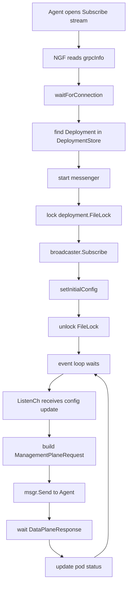
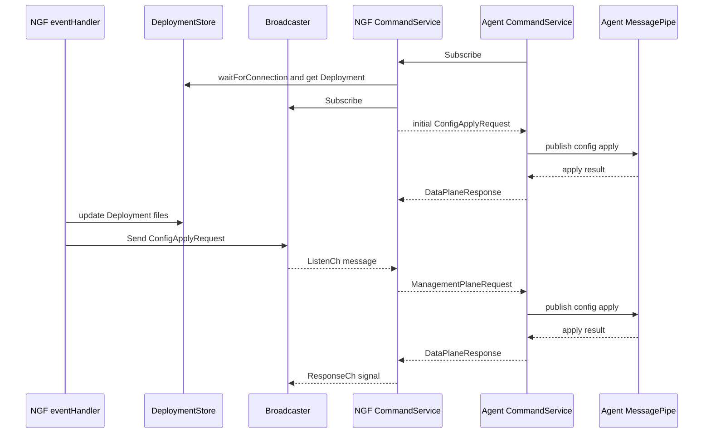

# 订阅长流 Subscribe 与配置下发

`Subscribe` 是 NGF 与 Agent 控制面交互的核心。`CreateConnection` 只登记连接，`Subscribe` 才负责初始配置下发、后续配置广播、ACK 接收和连接错误处理。

## 当前环境中的证据

控制面日志中：

```text
Sending initial configuration to agent
configVersion="fJGQEn5PSaPZcL1LMytMZMUCsKvhm/LCugbaeDSc360="
Successfully configured nginx for new subscription
NGINX configuration was successfully updated
```

这表示 Agent 打开 Subscribe 后，NGF 立即给它发送了一份当前 Deployment 的最新配置。

## NGF server 侧入口

```text
nginx-gateway-fabric/internal/controller/nginx/agent/command.go
commandService.Subscribe
```

相关对象：

```text
DeploymentStore
Deployment
DeploymentBroadcaster
messenger
resetConnChan
```

## Agent client 侧入口

```text
agent/internal/command/command_service.go
CommandService.Subscribe
receiveCallback
queueConfigApplyRequests
```

Agent 会循环保持订阅。如果 stream 断开，会触发重试和重新 `CreateConnection`。

## NGF Subscribe 主流程



## 为什么要先 Subscribe 再 setInitialConfig

NGF 的代码中特别强调了这个顺序：

```text
lock deployment.FileLock
  -> broadcaster.Subscribe()
  -> setInitialConfig()
unlock deployment.FileLock
```

原因是防止新 Agent 连接时漏掉并发配置更新。

假设不加锁或顺序错误，可能发生：

1. 新 Agent 开始读取当前配置。
2. 同时 eventHandler 生成新配置并广播。
3. 新 Agent 还没有订阅广播器。
4. 新 Agent 拿到旧配置，并漏掉新广播。
5. 数据面产生配置漂移。

当前设计保证：

- 要么 Agent 先订阅并拿最新初始配置。
- 要么并发更新先完成，Agent 随后拿到更新后的初始配置。
- 不会出现“初始配置旧、后续广播又错过”的窗口。

> [!warning] 这是二开高风险点
> 如果修改 `Subscribe`、`Deployment.FileLock`、`Broadcaster` 或 `setInitialConfig`，必须重新验证新连接和并发配置更新的场景。

## Broadcaster 的角色

每个数据面 Deployment 有自己的 broadcaster：

```text
Deployment
  -> broadcaster
  -> subscribers
  -> ListenCh / ResponseCh
```

当 eventHandler 生成新配置后，`NginxUpdater` 会更新 Deployment 中的 files 和 fileOverviews，然后通过 broadcaster 发送消息给所有已订阅 Agent。

Broadcaster 消息分两类：

- `ConfigApplyRequest`：下发 NGINX 文件更新。
- `APIRequest`：Plus API 相关动态动作。

## pendingBroadcastRequest 的意义

`Subscribe` 中有一个 `pendingBroadcastRequest`。它用于区分：

- 初始配置响应。
- 后续广播配置响应。

只有后续广播配置需要通过 `ResponseCh` 通知发送方“这轮广播完成”。初始配置是新连接自带流程，不应该误触发广播完成信号。

这能避免 eventHandler 误以为某次并发广播已经完成。

## Agent receiveCallback 做什么

Agent 侧 `receiveCallback` 会：

1. 如果没有 subscribe client，就创建 stream。
2. 调用 `Recv()` 接收 `ManagementPlaneRequest`。
3. 如果 stream 出错，就清空 client 并触发重连。
4. 如果请求有效，根据类型处理。
5. 如果是 `ConfigApplyRequest`，进入 config apply queue。
6. 其他请求进入 `subscribeChannel`。

配置请求为什么要 queue？因为配置应用需要按 instance 和 config version 保持顺序，避免旧配置覆盖新配置。

## 双向流交互图



## 连接断开和重置

`Subscribe` 会在这些情况下退出：

- context done。
- `resetConnChan` 收到 TLS 文件更新信号。
- messenger 发送失败。
- stream 收到 EOF 或其他错误。

Agent 侧看到错误后会重新进入连接流程：

```text
CreateConnection
Subscribe
receive loop
```

这就是日志中多次看到 `Creating connection` 和 `Sending initial configuration` 的原因之一。

## 下一步

`Subscribe` 消息里通常只带文件摘要。Agent 要拿到真正的文件内容，需要看 [[09-文件拉取-FileService与配置文件交付]]。

