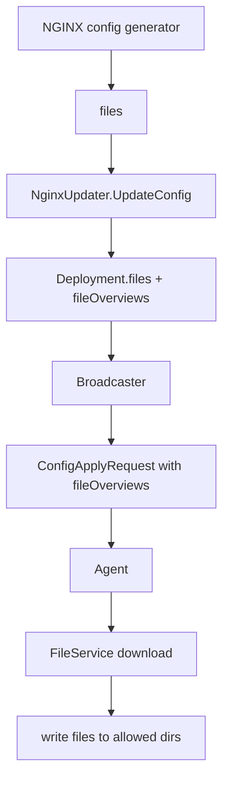

# 文件拉取 FileService 与配置文件交付

NGF 下发配置时，不把所有文件内容都塞进 `Subscribe` 的 `ConfigApplyRequest`。它先发送文件摘要，Agent 再通过 `FileService` 按需拉取文件内容。

## 为什么要拆成两步

如果直接把所有文件内容放在 Subscribe 消息中，会有几个问题：

- stream 消息变大。
- 文件内容和命令控制耦合。
- 重试时可能重复传大量内容。
- 权限、路径、校验不容易分层。

拆成两步后：

```text
Subscribe: 控制命令 + file overview
FileService: 实际文件内容
```

控制面可以先告诉 Agent：

- 有哪些文件。
- 文件路径是什么。
- 文件权限是什么。
- 文件属于哪个 config version。
- 文件摘要或标识是什么。

Agent 再根据需要拉取并校验。

## NGF 侧文件存储位置

NGF 在 `Deployment` 运行态对象中保存当前数据面配置：

```text
Deployment.files
Deployment.fileOverviews
Deployment.latestFileNames
Deployment.volumeMounts
```

这些字段由 `NginxUpdater` 更新，`CommandService` 用 `fileOverviews` 构造 `ConfigApplyRequest`，`FileService` 根据 Agent 请求返回实际 `files` 内容。

## 配置下发结构



## allowed_directories 的安全边界

当前 Agent 配置：

```yaml
allowed_directories:
  - /etc/nginx
  - /usr/share/nginx
  - /var/run/nginx
  - /etc/app_protect/bundles/
```

这表示 Agent 只应该写入这些路径下的文件。这个边界很重要：

- 防止控制面或协议 bug 导致 Agent 写任意路径。
- 限制配置更新影响范围。
- 让数据面只暴露 NGINX 所需目录。

如果二开时新增配置文件路径，必须同步更新：

1. NGF 生成的文件路径。
2. 数据面 Deployment 的 volumeMount。
3. Agent `allowed_directories`。
4. Agent 配置应用逻辑。

## 当前数据面挂载与文件写入

当前数据面 Pod 中和 NGINX 配置相关的挂载：

```text
/etc/nginx/conf.d
/etc/nginx/stream-conf.d
/etc/nginx/main-includes
/etc/nginx/events-includes
/etc/nginx/secrets
/var/run/nginx
/var/cache/nginx
/etc/nginx/includes
```

这些目录多为 emptyDir，原因是主容器使用只读 root filesystem。Agent 需要在可写 volume 中更新配置，然后触发 NGINX reload。

## FileService 调试思路

如果 Agent 收到配置但 NGINX 文件没有更新，按这个顺序查：

```bash
kubectl logs -n nginx-gateway deploy/ngf-nginx-gateway-fabric | rg 'Sending initial configuration|Sending configuration|FileService|error'
kubectl exec -n default gateway-nginx-5f95f75958-tn9fw -- find /etc/nginx -maxdepth 3 -type f -print
kubectl exec -n default gateway-nginx-5f95f75958-tn9fw -- nginx -T
kubectl get cm gateway-nginx-agent-config -n default -o yaml
```

重点判断：

- NGF 有没有生成 file overview。
- Agent 有没有发起文件拉取。
- 文件路径是否在 allowed directories 内。
- volumeMount 是否可写。
- NGINX reload 是否失败。

## 二开提示

改 FileService 或文件模型时要非常保守：

- 不要绕过 allowed directories。
- 不要让路径拼接依赖未校验的用户输入。
- 如果新增文件元数据，要考虑旧 Agent 兼容性。
- 如果改变文件摘要或版本语义，要同步改 ACK 和重试逻辑。

下一篇 [[10-配置应用-ACK-状态回传]] 解释 Agent 拿到文件后如何应用并回传结果。

