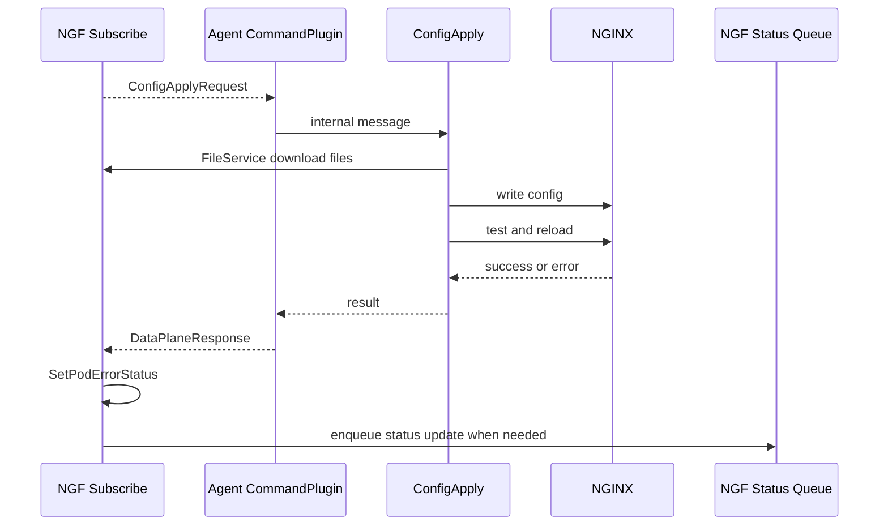

# 配置应用 ACK 状态回传

配置下发不是以“NGF 发出消息”为结束，而是以“Agent 应用配置并回 ACK，NGF 更新状态”为闭环。

## 配置应用闭环

```text
NGF 生成配置
  -> Subscribe 下发 ConfigApplyRequest
  -> Agent 拉取文件
  -> Agent 写入 NGINX 配置目录
  -> Agent 测试或 reload NGINX
  -> Agent 返回 DataPlaneResponse
  -> NGF 记录 Pod 状态
  -> NGF 更新 Gateway/Route status
```

## Agent 侧处理

Agent 收到 `ConfigApplyRequest` 后，流程大致是：

1. 解析 config version 和 instance id。
2. 将请求放入 config apply queue。
3. 拉取文件内容。
4. 写入目标目录。
5. 执行 NGINX 配置测试。
6. reload NGINX。
7. 如果失败，尝试回滚。
8. 构造 `DataPlaneResponse`。
9. 通过 Subscribe stream 发回 NGF。

已有详细材料：

- `agent/docs/architecture/config_apply.md`
- `agent/docs/architecture/config_apply_rollback.md`
- `agent/docs/architecture/config_apply_state.md`

## NGF 侧接收响应

NGF `commandService.Subscribe` 通过 messenger 接收 Agent 发回的消息：

```text
case msg := <-msgr.Messages():
  res := msg.GetCommandResponse()
  if res status != OK:
    deployment.SetPodErrorStatus(uuid, err)
  else:
    deployment.SetPodErrorStatus(uuid, nil)
```

如果这是一次广播配置的响应，NGF 还会通过 `ResponseCh` 通知广播发送方：

```text
channels.ResponseCh <- struct{}{}
```

这让 eventHandler 可以知道某次数据面更新是否完成。

## 状态为什么存在 Deployment 中

NGF 的 `Deployment` 运行态对象保存：

```text
podStatuses
latestConfigError
latestUpstreamError
```

原因是一个 Gateway 对应的数据面可能有多个 Pod。控制面需要知道：

- 每个 Pod 配置是否成功。
- 有没有最近一次 config apply error。
- 有没有 NGINX Plus upstream API error。
- 汇总后 Gateway status 应该怎么写。

这不是 Kubernetes Deployment 自身 status 能表达的，因此 NGF 维护了自己的运行态状态。

## ACK 时序图



## 成功和失败的差异

成功：

```text
CommandResponse_COMMAND_STATUS_OK
deployment.SetPodErrorStatus(uuid, nil)
Gateway/Route status 可以继续保持 Ready/Programmed
```

失败：

```text
CommandResponse_COMMAND_STATUS_ERROR
deployment.SetPodErrorStatus(uuid, err)
status queue 后续写入错误状态
```

如果错误消息是 rollback 相关，NGF 可能会忽略某些中间消息，因为真正关心的是最终配置是否成功。

## 调试关键日志

控制面：

```bash
kubectl logs -n nginx-gateway deploy/ngf-nginx-gateway-fabric | rg 'configuration|connected|error|status'
```

数据面：

```bash
kubectl exec -n default gateway-nginx-5f95f75958-tn9fw -- nginx -T
kubectl exec -n default gateway-nginx-5f95f75958-tn9fw -- ps -ef
```

Kubernetes status：

```bash
kubectl describe gateway gateway -n default
kubectl describe httproute coffee -n default
kubectl describe httproute tea -n default
```

## 二开提示

如果你要改配置应用语义：

- 保持 config version 单调或可比较，避免旧配置覆盖新配置。
- 失败路径必须能返回明确错误，不能只打日志。
- 回滚消息和最终失败消息要区分。
- NGF 侧 status 更新要能从 `Deployment.GetConfigurationStatus()` 读到准确结果。

下一篇 [[11-GatewayAPI到NGINX配置生成链路]] 把上游 Gateway API 资源如何触发配置下发串起来。

