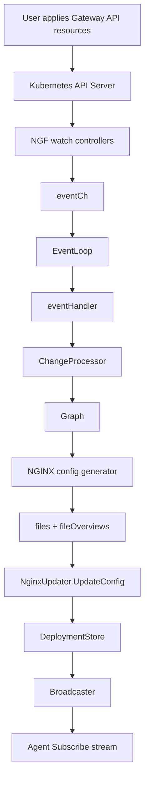

# Gateway API 到 NGINX 配置生成链路

本篇解释用户提交的 Gateway API 资源如何变成数据面 NGINX 配置，并最终触发 [[08-订阅长流-Subscribe与配置下发]]。

## 总流程



## 输入资源

当前 Cafe demo 的核心输入：

```text
GatewayClass nginx
Gateway default/gateway
HTTPRoute default/coffee
HTTPRoute default/tea
Service default/coffee
Service default/tea
EndpointSlice for coffee and tea pods
```

这些资源不是简单拼模板。NGF 会先做语义校验和 graph 构建。

## ChangeProcessor 的价值

`ChangeProcessor` 负责把 Kubernetes 原始资源转换成 NGF 内部 graph。它处理：

- GatewayClass 是否被当前 controller 接受。
- Gateway listener 是否有效。
- HTTPRoute 是否能 attach 到 Gateway。
- hostnames、path matches、backendRefs 是否有效。
- Service 是否存在。
- Secret、Policy、Plus/WAF 特性是否可用。

输出 graph 后，后续生成器不需要直接面对 Kubernetes 原始对象的全部复杂性。

## eventHandler 的编排位置

eventHandler 拿到 graph 后，会同时处理几件事：

- 调用 generator 生成 NGINX 配置。
- 调用 Provisioner 创建或更新数据面资源。
- 调用 NginxUpdater 更新运行态配置并广播。
- 触发 status 更新。
- 更新 metrics 和健康状态。

所以 eventHandler 是资源变化的业务编排中心。

## 配置生成结果

生成结果通常包括：

- NGINX 主配置 include。
- HTTP server/location 配置。
- upstream 配置。
- stream 配置。
- TLS secret 文件。
- auth、rate limit、WAF、Plus 相关配置。

在当前 Cafe demo 中，核心是：

```text
host: cafe.example.com
path: /coffee -> Service coffee:80
path: /tea -> Service tea:80
```

最终会变成 NGINX server、location、upstream。

## NginxUpdater 如何接住配置

生成器产出文件后，`NginxUpdater` 会把它们保存到对应的 `Deployment` 中：

```text
Deployment.files
Deployment.fileOverviews
Deployment.configVersion
```

然后通过该 Deployment 的 broadcaster 通知已连接 Agent。

如果 Agent 尚未连接，配置也不会丢。后续 Agent `Subscribe` 时会通过 `setInitialConfig` 拿到当前 Deployment 的最新配置。

## 设计原则

这条链路体现了 Kubernetes controller 的典型设计：

```text
实际资源状态 + 用户期望资源
  -> 内部期望状态
  -> 生成数据面配置
  -> 尽力收敛
  -> 通过 status 暴露结果
```

NGF 不把一次事件当成命令式操作，而是持续把世界收敛到期望状态。

## 二开提示

如果你要新增 Gateway API 到 NGINX 配置的能力，通常路径是：

1. API 或 policy 层新增字段。
2. validation 层校验字段。
3. graph 层表达新语义。
4. generator 层输出 NGINX 配置。
5. NginxUpdater 下发文件。
6. status 层反馈成功或失败。
7. tests 覆盖有效、无效、冲突、缺失依赖等场景。

不要直接在 generator 中读取 Kubernetes 原始对象绕过 graph，这会让验证、状态和配置生成分叉。

下一篇 [[12-Cafe示例端到端溯源]] 用当前运行环境把这条链路完整跑一遍。

