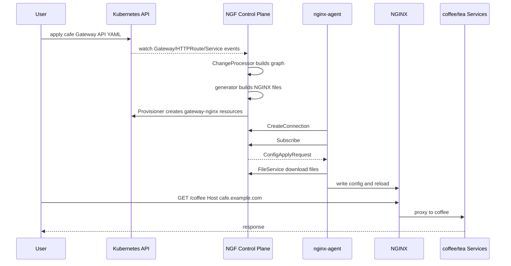

# Cafe 示例端到端溯源

本篇用当前环境中的 Cafe demo 串起完整链路：用户资源、NGF 控制面、Agent、NGINX 数据面和实际流量。

## 当前资源

```text
GatewayClass: nginx
Gateway: default/gateway
HTTPRoute: default/coffee
HTTPRoute: default/tea
Service: default/coffee
Service: default/tea
Pod: default/coffee-6db967495b-l8fs5
Pod: default/tea-7b7d6c947d-f7jbm
Data plane Service: default/gateway-nginx
Data plane Pod: default/gateway-nginx-5f95f75958-tn9fw
```

HTTPRoute 语义：

```text
host cafe.example.com + PathPrefix /coffee -> Service coffee:80
host cafe.example.com + Exact /tea -> Service tea:80
```

## 端到端链路图



## 观察点 1：Kubernetes 资源

```bash
kubectl get gatewayclass
kubectl get gateway -n default
kubectl get httproute -n default
kubectl get svc coffee tea gateway-nginx -n default
kubectl get pods -n default -o wide
```

关注：

- `GatewayClass nginx` 是否 `ACCEPTED=True`。
- `Gateway default/gateway` 是否 `PROGRAMMED=True`。
- `gateway-nginx` 是否有 NodePort。
- coffee 和 tea backend Pod 是否 Running。

## 观察点 2：控制面日志

```bash
kubectl logs -n nginx-gateway deploy/ngf-nginx-gateway-fabric | rg 'Reconfigured|Creating/Updating nginx resources|Creating connection|Sending initial configuration|Successfully configured'
```

你应该能把日志映射到这些阶段：

| 日志关键词 | 阶段 |
|---|---|
| `Reconfigured control plane` | EventLoop/eventHandler 完成一批资源处理 |
| `Creating/Updating nginx resources` | Provisioner 创建或更新数据面对象 |
| `Creating connection for nginx pod` | Agent 调用 CreateConnection |
| `Sending initial configuration to agent` | Subscribe 初始配置下发 |
| `Successfully configured nginx for new subscription` | Agent 应用初始配置并 ACK |

## 观察点 3：数据面配置

```bash
kubectl exec -n default gateway-nginx-5f95f75958-tn9fw -- nginx -T
```

重点找：

```text
cafe.example.com
/coffee
/tea
coffee
tea
```

如果这些内容存在，说明 Gateway API 已经被转换成 NGINX server/location/upstream 配置。

## 观察点 4：流量路径

数据面 Service：

```text
default/gateway-nginx
NodePort: 31437
```

请求路径：

```text
client
  -> kind node NodePort 31437
  -> Service gateway-nginx
  -> Pod gateway-nginx
  -> NGINX location /coffee or /tea
  -> Service coffee or tea
  -> backend Pod
```

示例命令：

```bash
curl -H 'Host: cafe.example.com' http://127.0.0.1:31437/coffee
curl -H 'Host: cafe.example.com' http://127.0.0.1:31437/tea
```

如果本机没有直接映射 NodePort，需要根据 kind 节点网络方式调整访问地址。

## 从二开角度看 Cafe 示例

Cafe 示例是最适合做二开回归的最小场景，因为它覆盖：

- GatewayClass 接受。
- Gateway listener。
- HTTPRoute attach。
- backend Service 解析。
- NGINX upstream 和 location 生成。
- Agent 配置下发。
- NGINX reload。
- 实际流量代理。

新增路由、filter、policy 时，可以先问自己：

```text
我新增的语义能否在 Cafe 示例上构造一个最小变体？
它影响 graph、generator、Agent 下发，还是只影响其中一层？
失败时 status 应该怎么显示？
```

## 关联章节

- [[11-GatewayAPI到NGINX配置生成链路]]
- [[23-BuildConfiguration字段到OSS-NGINX配置映射]]
- [[08-订阅长流-Subscribe与配置下发]]
- [[10-配置应用-ACK-状态回传]]
- [[18-调试手册-日志-断点-常用命令]]
