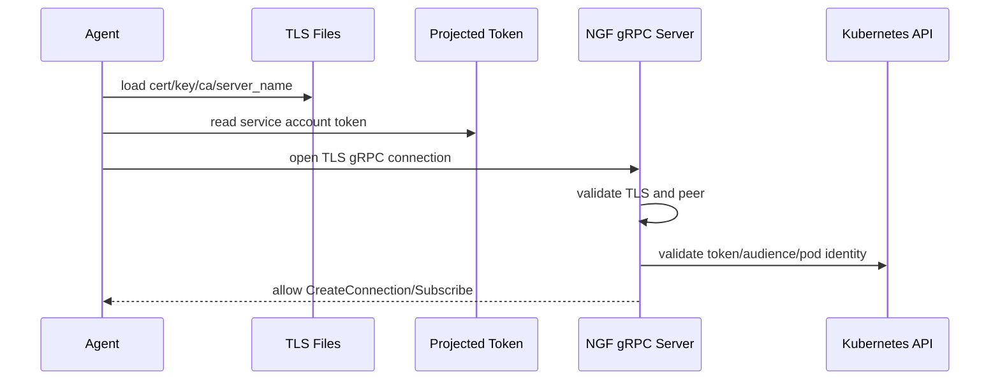

# TLS Token 鉴权与连接重置

NGF 与 Agent 的 gRPC 连接不是裸连接。它依赖 TLS 文件和 projected service account token 来确认“谁在连、连到谁、是否允许连”。

## 当前环境中的安全材料

控制面 namespace：

```text
nginx-gateway
```

控制面 secret：

```text
secret/agent-tls
secret/server-tls
```

数据面 namespace：

```text
default
```

数据面 secret 和 token：

```text
secret/gateway-nginx-agent-tls
projected serviceAccountToken audience=ngf-nginx-gateway-fabric.nginx-gateway.svc
```

Agent 配置：

```yaml
command:
  server:
    host: ngf-nginx-gateway-fabric.nginx-gateway.svc
    port: 443
  auth:
    tokenpath: /var/run/secrets/ngf/serviceaccount/token
  tls:
    cert: /var/run/secrets/ngf/tls.crt
    key: /var/run/secrets/ngf/tls.key
    ca: /var/run/secrets/ngf/ca.crt
    server_name: ngf-nginx-gateway-fabric.nginx-gateway.svc
```

## token audience 为什么重要

数据面 Pod 的 projected token 指定：

```text
audience: ngf-nginx-gateway-fabric.nginx-gateway.svc
```

NGF gRPC server 侧也用相同 service DNS 构造 token audience。

这能避免一个普通 Kubernetes service account token 被拿去访问错误的服务。token 必须是面向这个 NGF Service 的。

## 连接安全链路



## gRPC interceptor 的位置

NGF 的 gRPC server 在业务 service 之前会执行鉴权逻辑。业务代码如 `commandService.CreateConnection` 通常假设：

- 连接上下文里已经有 `grpcInfo`。
- 连接来源已被基本校验。
- 后续可以根据 `grpcInfo.UUID` 追踪连接。

如果鉴权失败，请求不会进入业务 handler。

## TLS 文件热更新与 resetConnChan

`createAgentServices` 中创建：

```text
resetConnChan := make(chan struct{})
```

这个 channel 会传给：

- `NginxUpdater`
- gRPC server
- `CommandService`

当 TLS 文件更新时，NGF 会让现有 Subscribe 返回错误：

```text
codes.Unavailable, "TLS files updated"
```

Agent 收到连接错误后重新建连：

```text
CreateConnection
Subscribe
setInitialConfig
```

这解释了为什么控制面日志中可能周期性出现重新连接和重新发送初始配置。

## 排查命令

```bash
kubectl get secret agent-tls server-tls -n nginx-gateway
kubectl get secret gateway-nginx-agent-tls -n default
kubectl get pod gateway-nginx-5f95f75958-tn9fw -n default -o yaml | rg -n 'audience|serviceAccountToken|nginx-agent-tls|server_name'
kubectl get cm gateway-nginx-agent-config -n default -o yaml
kubectl logs -n nginx-gateway deploy/ngf-nginx-gateway-fabric | rg 'TLS|token|Unauthenticated|Unavailable|connection'
```

## 二开风险点

- 改 Service 名称时，要同步 server host、server_name、token audience。
- 改 TLS secret 名称时，要同步控制面参数、Provisioner 生成逻辑和数据面挂载。
- 改鉴权 interceptor 时，要确认业务层仍能拿到 `grpcInfo`。
- 不要为了调试长期关闭 TLS 或 token 校验，否则二开后的行为和真实部署不一致。

关联：

- [[07-连接建立-CreateConnection全链路]]
- [[08-订阅长流-Subscribe与配置下发]]

