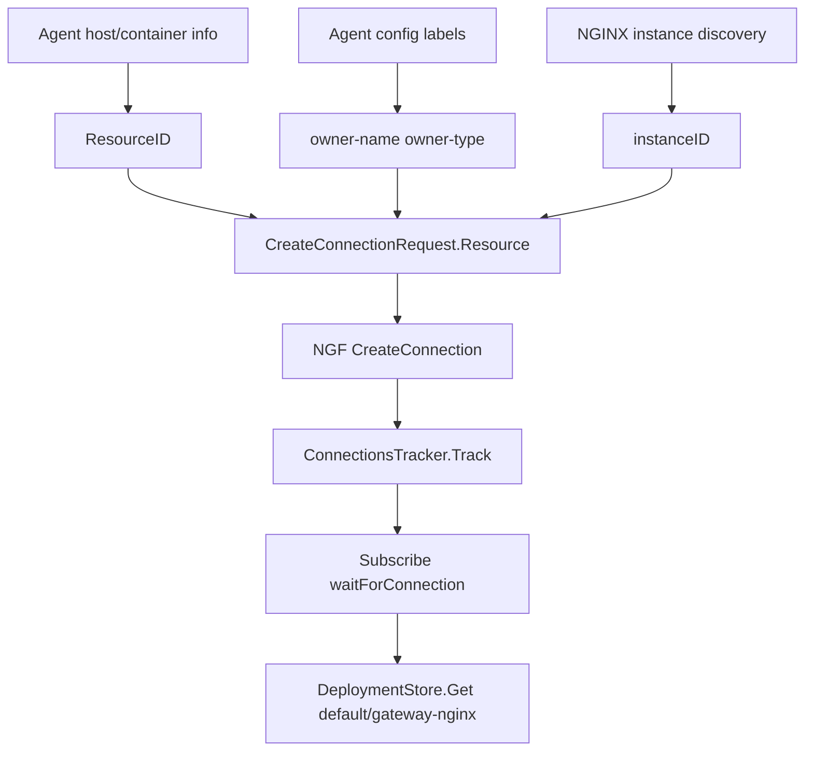

# ResourceID 与数据面身份识别

Agent 连接管理面时，需要告诉控制面“我是谁”。这个身份不仅是 Pod 名，还包括容器信息、NGINX instance、owner labels 和 ResourceID。

## 为什么需要 ResourceID

管理面需要区分：

- 哪个 Agent 连接。
- Agent 运行在哪个 Pod。
- Pod 属于哪个 Deployment。
- Pod 内有哪些 NGINX instance。
- 临时断线重连时是不是同一个数据面身份。

如果只靠连接地址或 Pod IP，不够稳定，也不够语义化。

## Agent 侧生成逻辑

已有详细材料：

```text
agent/docs/resource-id-analysis.md
```

核心入口：

```text
agent/pkg/host/info.go
ResourceID
```

ResourceID 会根据运行环境选择不同证据：

- 容器环境信息。
- container ID。
- hostname。
- 物理主机 ID。
- UUID 包装。

在当前 kind 环境中，hostname 对应数据面 Pod：

```text
gateway-nginx-5f95f75958-tn9fw
```

控制面日志中连接 UUID：

```text
3f3ffa23-b871-3816-a2ac-f1235b9a788d
```

## owner labels 的作用

Agent 配置中的 labels：

```yaml
owner-name: default_gateway-nginx
owner-type: Deployment
```

NGF 在 `CreateConnection` 中会从 Agent 上报的 resource instances 解析 owner 信息，然后建立：

```text
gRPC connection UUID
  -> ParentName: default/gateway-nginx
  -> ParentType: Deployment
  -> InstanceID
```

这就是后续 `Subscribe` 能找到正确 Deployment 的原因。

## 身份识别链路



## 常见误解

> [!warning] Pod 名不等于完整身份
> Pod 名能帮助定位连接来源，但 NGF 真正需要的是 owner Deployment 和 instance 信息。否则滚动更新、多副本和重连场景都不好处理。

> [!warning] ResourceID 不等于 Kubernetes UID
> ResourceID 是 Agent 侧抽象身份。Kubernetes UID 是 K8s 对象身份。两者可能同时参与排查，但不是同一层概念。

## 二开提示

如果你要改数据面身份：

- 确认 Agent 上报字段是否需要改 proto。
- 确认 NGF `getAgentDeploymentNameAndType` 之类解析逻辑是否需要改。
- 确认多 Pod、多 instance、重连场景是否仍能唯一定位。
- 确认日志字段能让你从控制面日志反查数据面 Pod。

关联：

- [[07-连接建立-CreateConnection全链路]]
- [[13-TLS-Token-鉴权与连接重置]]

