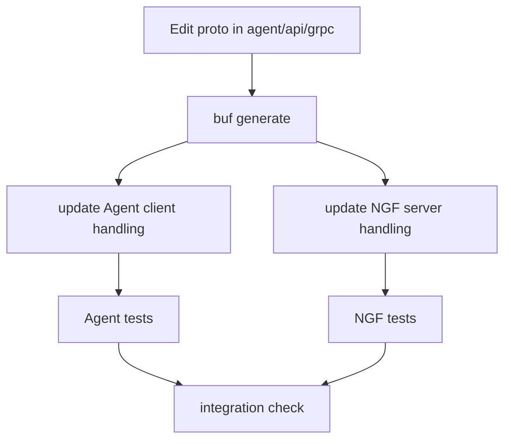

# 二次开发指南 改协议

改 NGF 与 Agent 的交互协议时，必须从 proto 开始，而不是从生成代码开始。

## 适用场景

你需要改协议，通常是因为：

- 新增一种管理面命令。
- `ConfigApplyRequest` 需要携带新字段。
- `DataPlaneResponse` 需要返回更详细结果。
- 新增一个 gRPC RPC。
- FileService 文件元数据需要扩展。

## 改动顺序



## Agent 仓库步骤

1. 修改 proto。
2. 运行生成。
3. 更新 CommandPlugin 或相关业务插件。
4. 更新 fakes。
5. 更新单测。

常用命令：

```bash
cd agent
make generate
make unit-test
make lint
```

Agent 仓库规则：

- 不手改 `*.pb.go`。
- 不手改 `*.pb.validate.go`。
- 不手改生成的 fakes。
- proto 变化后生成物必须一起提交。

## NGF 仓库步骤

NGF 需要消费新的协议字段或 RPC：

- server 侧实现：`internal/controller/nginx/agent/command.go`
- file service 实现：`internal/controller/nginx/agent/file.go`
- updater 或 deployment 运行态：`internal/controller/nginx/agent/`
- eventHandler/generator，如果新字段来自 Gateway API 语义。

常用命令：

```bash
cd nginx-gateway-fabric
make unit-test
make lint
```

## 新增字段的兼容性

新增字段优先遵守：

- 使用新 field number，不能复用旧 number。
- 不改变旧字段语义。
- Agent 和 NGF 版本不一致时，要有默认行为。
- 如果字段是必需语义，要在 server/client 显式校验并返回清楚错误。

## 新增 RPC 的判断标准

不要因为“想让代码干净”就新增 RPC。优先判断：

- 这个动作是否需要独立生命周期？
- 是否不是 Subscribe 长流的一种命令？
- 是否需要独立权限或不同超时？
- 是否需要独立错误模型？

如果只是控制面下发一种新动作，通常更适合扩展 `ManagementPlaneRequest`。

## 验证清单

```bash
cd agent
make generate
make unit-test

cd ../nginx-gateway-fabric
make unit-test
```

人工验证：

- Agent 能成功 `CreateConnection`。
- Agent 能成功 `Subscribe`。
- 旧配置下发不受影响。
- 新字段在 NGF 和 Agent 两侧都能被日志或测试观察到。
- 错误路径有明确 `DataPlaneResponse`。

关联：

- [[06-gRPC-MPI协议与pb生成代码]]
- [[08-订阅长流-Subscribe与配置下发]]

