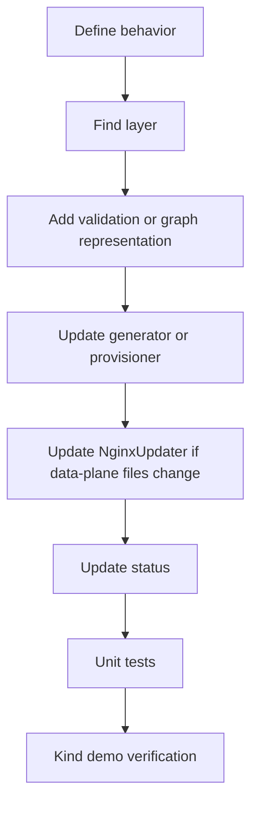

# 二次开发指南 改 NGF 控制面

改 NGF 控制面时，先判断改动属于哪一层。不同层的测试和风险完全不同。

## 控制面分层

```text
Kubernetes API watch
  -> event handling
  -> graph / validation
  -> NGINX config generation
  -> Provisioner Kubernetes objects
  -> NginxUpdater gRPC downlink
  -> status update
```

## 常见改动类型

| 目标 | 主要入口 |
|---|---|
| 新增 Gateway API 或 Policy 语义 | graph、validation、generator、status |
| 改 NGINX 配置输出 | generator、template/config structs、tests |
| 改数据面 Pod 形态 | provisioner objects |
| 改 Agent 配置 | provisioner config map、Agent config schema |
| 改配置下发行为 | NginxUpdater、DeploymentStore、Broadcaster、CommandService |
| 改 status | status updater、eventHandler、graph validation result |

## 不建议的捷径

> [!warning] 不要在 generator 中绕过 graph 直接读 Kubernetes 对象
> 这样会让 validation、status 和配置生成出现三套语义，后期很难维护。

> [!warning] 不要在 Provisioner 里塞路由语义
> Provisioner 应该负责 Kubernetes 对象，不应该理解 HTTPRoute 的路由细节。

> [!warning] 不要绕过 NginxUpdater 直接向 Agent stream 写配置
> DeploymentStore、Broadcaster、FileService 和 status 都依赖这层运行态。

## 推荐开发路径



## 示例：新增一个影响 NGINX 配置的 Policy 字段

通常需要：

1. API 类型增加字段。
2. CRD/schema 生成。
3. validation 检查非法值。
4. graph 保存合法语义。
5. generator 输出 NGINX directive。
6. e2e 或 unit fixture 验证生成结果。
7. status 表达 attach 成功或失败。

如果生成的 NGINX 文件变化，会自然进入：

```text
NginxUpdater.UpdateConfig
  -> Deployment.SetFiles
  -> Broadcaster.Send
  -> Agent ConfigApply
```

## 示例：改数据面 Deployment

通常需要：

1. 找到 provisioner object 构造逻辑。
2. 修改 Deployment/Service/ConfigMap/Secret。
3. 更新 Helm 或 manifest 输出，如果相关。
4. 在 kind 中安装或重建。
5. 检查数据面 Pod YAML。
6. 检查 Agent 是否仍能连接。

验证命令：

```bash
kubectl get deploy gateway-nginx -n default -o yaml
kubectl get cm gateway-nginx-agent-config -n default -o yaml
kubectl logs -n nginx-gateway deploy/ngf-nginx-gateway-fabric | rg 'Creating connection|Successfully connected|error'
```

## 本地测试

```bash
cd nginx-gateway-fabric
make unit-test
make lint
```

如果涉及生成文件、CRD、Helm 或 manifests，要使用项目 Makefile 中对应目标，不要手改生成产物。

关联：

- [[03-NGF控制面启动流程]]
- [[04-数据面Pod是如何被Provisioner创建的]]
- [[11-GatewayAPI到NGINX配置生成链路]]

