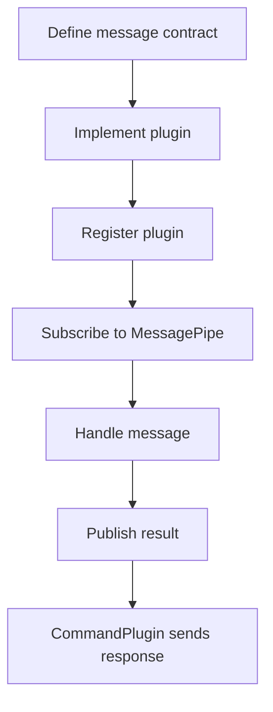

# 二次开发指南 改 Agent 插件

Agent 的二开重点是保持插件边界清晰。CommandPlugin 负责控制面连接，不应该变成所有业务逻辑的集中实现。

## 插件架构原则

```text
gRPC CommandPlugin
  -> MessagePipe
  -> business plugin
  -> MessagePipe
  -> CommandPlugin
  -> gRPC DataPlaneResponse
```

核心原则：

- 插件通过消息通信。
- 插件不要互相直接 import 形成强耦合。
- 控制面协议和本地执行逻辑分离。
- 每个插件负责一个清晰领域。

## 什么时候改 CommandPlugin

适合改 CommandPlugin 的情况：

- 新增 ManagementPlaneRequest 类型分发。
- 改 Subscribe 重连逻辑。
- 改 DataPlaneResponse 构造。
- 改 CreateConnection 或状态上报。

不适合放进 CommandPlugin 的内容：

- NGINX 文件写入细节。
- 复杂业务校验。
- 长时间运行的本地任务。
- Collector、metrics、日志处理细节。

## 新增插件的基本步骤

1. 定义消息类型和 topic。
2. 在插件加载流程中注册插件。
3. 插件订阅需要的消息。
4. 插件处理后发布结果消息。
5. CommandPlugin 或调用方消费结果。
6. 添加单元测试。



## 改配置字段

如果 Agent 插件需要新配置字段，要同步：

- Agent config struct。
- Viper unmarshal / defaults / validation。
- NGF Provisioner 生成的 `nginx-agent.conf`。
- 文档和示例。

当前 NGF 生成的 Agent 配置在：

```text
ConfigMap default/gateway-nginx-agent-config
```

所以仅改 Agent 默认值不一定生效，因为运行时配置来自 NGF。

## 改配置应用逻辑

如果改 config apply：

- 确认 config version 顺序。
- 确认文件拉取失败可返回错误。
- 确认写文件失败不会留下半更新状态。
- 确认 NGINX reload 失败能回滚或返回明确错误。
- 确认 ACK 能被 NGF 正确解析。

验证：

```bash
cd agent
make unit-test
make race-condition-test
```

如果改并发队列或重连逻辑，额外跑 race 测试。

## 与 NGF 联调

Agent 改完后要看 NGF 侧是否能识别结果：

```bash
kubectl logs -n nginx-gateway deploy/ngf-nginx-gateway-fabric | rg 'Successfully connected|configuration|error'
kubectl describe gateway gateway -n default
kubectl exec -n default gateway-nginx-5f95f75958-tn9fw -- nginx -T
```

关联：

- [[05-Agent启动与插件总线机制]]
- [[10-配置应用-ACK-状态回传]]
- [[15-二次开发指南-改协议]]

