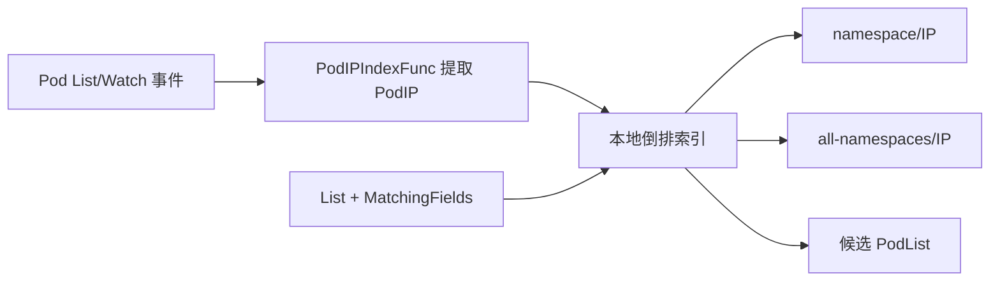
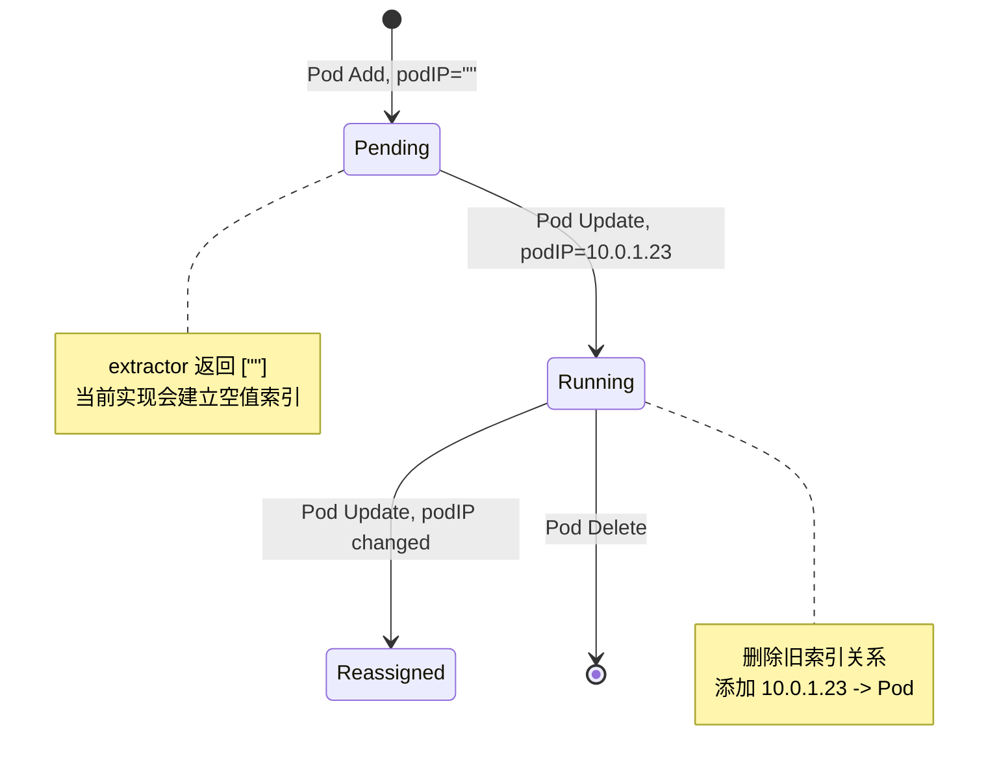
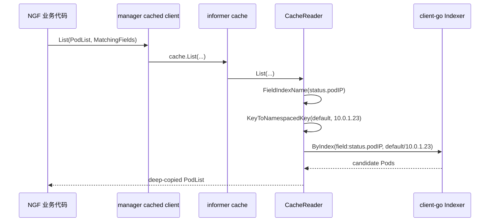
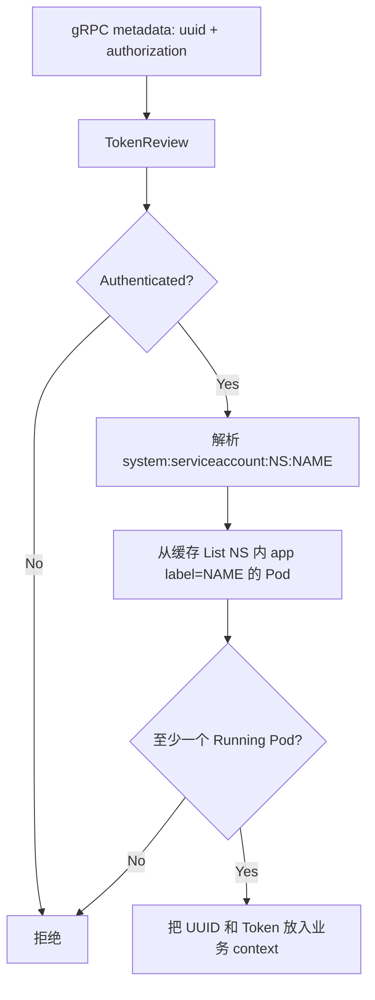

<!-- markdownlint-disable MD025 -->

# PodIP 字段索引与 controller-runtime 缓存机制

> [!abstract] 核心结论
> `createManager` 中的代码在 manager 的 **本地 Pod informer cache** 上注册了一个名为 `status.podIP` 的倒排索引，索引值由 `PodIPIndexFunc` 从 `Pod.Status.PodIP` 提取。它不修改 Kubernetes API、Pod 或 etcd；只有通过 cached client 执行精确字段查询时才会被消费。
>
> 在当前 NGF 源码中，没有生产代码使用 `status.podIP` 字段选择器。Git 历史表明，提交 `3424d94d` 将 Agent 追踪从 IP 改为 UUID，并删除了 gRPC 鉴权中的 PodIP 查询，但没有删除该索引注册。因此，==当前索引是仍被维护但不影响业务结果的历史遗留逻辑==。

## 1. 分析范围与事实版本

本文以两个本地仓库为事实来源：

| 项目 | 版本事实 | 主要源码 |
| --- | --- | --- |
| NGINX Gateway Fabric | 当前工作树 `35b60ca1` | `internal/controller/manager.go`、`internal/framework/controller/index/pod.go`、gRPC interceptor |
| controller-runtime | NGF `go.mod` 固定为 `v0.24.1`，本地源码为 release-0.24 对应代码 | `pkg/cache`、`pkg/client`、`pkg/cluster` |

NGF 中待解释的代码是：

```go
var podIPIndexFunc client.IndexerFunc = index.PodIPIndexFunc
if err := controller.AddIndex(
    context.Background(),
    mgr.GetFieldIndexer(),
    &apiv1.Pod{},
    "status.podIP",
    podIPIndexFunc,
); err != nil {
    return nil, fmt.Errorf("error adding pod IP indexer: %w", err)
}
```

源码位置：

- `internal/controller/manager.go:createManager`
- `internal/framework/controller/register.go:AddIndex`
- `internal/framework/controller/index/pod.go:PodIPIndexFunc`

---

## 2. 第一性原理：为什么缓存还需要索引

Kubernetes controller 要不断回答两类问题：

1. 某个确定身份的对象是什么，例如 `Get(namespace/name)`；
2. 哪些对象满足某个关系，例如“哪个 Pod 的 IP 是 `10.0.1.23`”。

informer cache 天然按对象主键保存数据：

```text
namespace/name -> object
```

所以第一类查询很便宜。但 `PodIP` 不是对象主键。没有额外数据结构时，只能遍历 Pod：

```go
for _, pod := range pods {
    if pod.Status.PodIP == wantedIP {
        // found
    }
}
```

若缓存中有 $N$ 个 Pod，一次查找成本是 $O(N)$。建立倒排索引后：

```text
PodIP -> []Pod
```

查询变成一次 map 索引再返回命中集合，平均成本可近似写成：

$$
O(1) + O(K)
$$

其中 $K$ 是同一 IP 索引值下的候选 Pod 数量。这里不能假设 $K=1$：IP 可能复用，`hostNetwork` Pod 也可能共享 Node IP。

代价是 informer 每次 Add、Update、Delete Pod 时都要同步维护这张索引。这是典型的空间与写入成本换读取速度。



---

## 3. 逐行理解 NGF 的注册代码

### 3.1 显式转换为 `client.IndexerFunc`

```go
var podIPIndexFunc client.IndexerFunc = index.PodIPIndexFunc
```

controller-runtime 定义：

```go
type IndexerFunc func(Object) []string
```

这行代码主要是一次编译期签名校验和显式类型转换，确认 NGF 函数满足：

```go
func(client.Object) []string
```

它不创建闭包，也不增加运行时逻辑。直接传 `index.PodIPIndexFunc` 在这里通常等价。

### 3.2 获取 manager 的 FieldIndexer

```go
mgr.GetFieldIndexer()
```

controller-runtime 在 `pkg/cluster/cluster.go` 创建 cluster 时，将同一个 cache 同时保存为：

```go
cache:        cache,
fieldIndexes: cache,
```

因此 manager 暴露的 `FieldIndexer` 实际指向 informer cache，而不是 API Server 的某种数据库管理接口。

> [!important] 边界
> `IndexField` 只给当前 NGF 进程内的缓存增加索引。它不会修改 Pod schema、不会向 etcd 建索引、不会创建 Kubernetes 资源，也不会改变 API Server 的 field-selector 能力。

### 3.3 指定对象类型

```go
&apiv1.Pod{}
```

它告诉 Scheme 和 cache：索引属于 Pod GVK。controller-runtime 会据此找到或创建 Pod informer，并保证传给 extractor 的对象是相应类型。

这不是“只索引这个空 Pod”。空对象只是类型标记。

### 3.4 指定逻辑字段名

```go
"status.podIP"
```

这个字符串是本地索引的逻辑名称。controller-runtime 不会反射解析它，也不会自动执行 `pod.Status.PodIP`。

真正定义取值规则的是 `PodIPIndexFunc`。理论上下面的命名也能工作：

```go
IndexField(ctx, &corev1.Pod{}, "ngf.example/pod-ip", PodIPIndexFunc)
```

前提是查询使用完全相同的名称：

```go
client.MatchingFields{"ngf.example/pod-ip": "10.0.1.23"}
```

采用 `status.podIP` 是为了使名称与真实字段语义一致。

### 3.5 注册 extractor

NGF 的 extractor 是：

```go
func PodIPIndexFunc(obj client.Object) []string {
    pod, ok := obj.(*corev1.Pod)
    if !ok {
        panic(fmt.Sprintf("expected an Pod; got %T", obj))
    }

    return []string{pod.Status.PodIP}
}
```

输入：一个 Pod。

输出：该 Pod 应该落入的原始索引值集合。

例如：

```yaml
metadata:
  namespace: default
  name: gateway-nginx-abc
status:
  podIP: 10.0.1.23
```

extractor 返回：

```go
[]string{"10.0.1.23"}
```

返回 `[]string` 而非 `string`，是因为通用字段索引允许一个对象属于多个索引值。例如“Pod 引用了哪些 Secret”天然是一对多提取。

---

## 4. `controller.AddIndex` 只是带超时的薄封装

NGF 的实现为：

```go
func AddIndex(
    ctx context.Context,
    indexer client.FieldIndexer,
    objectType ngftypes.ObjectType,
    field string,
    indexerFunc client.IndexerFunc,
) error {
    c, cancel := context.WithTimeout(ctx, 2*time.Minute)
    defer cancel()

    if err := indexer.IndexField(c, objectType, field, indexerFunc); err != nil {
        return fmt.Errorf("failed to add index for %T for field %s: %w", objectType, field, err)
    }

    return nil
}
```

它只增加两件事：

- 最长两分钟的注册超时；
- 带对象类型和字段名的错误上下文。

当前 `createManager` 传入的是 `context.Background()`，真正有界的是 `AddIndex` 派生出的两分钟 context。

如果注册失败，`createManager` 直接失败，manager 不会返回给 `StartManager`。这说明它在装配层面被当作必要初始化步骤，尽管当前业务代码已经不再消费该索引。

---

## 5. controller-runtime 注册链路

### 5.1 `IndexField` 会先取得 Pod informer

`pkg/cache/informer_cache.go` 的核心实现：

```go
func (ic *informerCache) IndexField(
    ctx context.Context,
    obj client.Object,
    field string,
    extractValue client.IndexerFunc,
) error {
    informer, err := ic.GetInformer(ctx, obj, BlockUntilSynced(false))
    if err != nil {
        return err
    }
    return indexByField(informer, field, extractValue)
}
```

这有两个直接结果：

1. 注册索引会要求 cache 为 Pod 准备 informer；
2. `BlockUntilSynced(false)` 表示注册阶段不等待 informer 完成首次同步。

`createManager` 此时还没有执行 `mgr.Start(ctx)`。所以这里主要完成“创建 informer + 安装 indexer”；manager 启动后，cache 才正式运行 List/Watch 并等待同步。

### 5.2 内部索引名增加 `field:` 前缀

controller-runtime 使用：

```go
func FieldIndexName(field string) string {
    return "field:" + field
}
```

所以逻辑名：

```text
status.podIP
```

在 client-go indexer 中实际注册为：

```text
field:status.podIP
```

前缀将字段索引与 client-go 的其他内部索引区分开。

### 5.3 namespaced 对象会生成两套 key

`indexByField` 先调用 NGF extractor 获得：

```text
10.0.1.23
```

然后读取对象 namespace，并包装为：

```text
default/10.0.1.23
__all_namespaces/10.0.1.23
```

第一项支持限定 namespace 查询，第二项支持跨 namespace 查询。

因此可以把内存结构近似理解为：

```text
field:status.podIP
├── default/10.0.1.23
│   └── default/gateway-nginx-abc
├── team-a/10.0.1.23
│   └── team-a/gateway-nginx-def
└── __all_namespaces/10.0.1.23
    ├── default/gateway-nginx-abc
    └── team-a/gateway-nginx-def
```

> [!note]
> `IndexerFunc` 的返回值不应自行拼 namespace。controller-runtime 会自动建立 namespace 内和跨 namespace 两种 key。

### 5.4 multi-namespace cache 的行为

若 NGF 配置了 `--watch-namespaces`，`buildManagerCache` 会构造 multi-namespace cache。对 namespaced 的 Pod 调用 `IndexField` 时，controller-runtime 会遍历每个 namespace cache 分别注册索引。

所以索引的可见范围严格受 cache 边界约束：

```text
本地 PodIP 索引范围 ⊆ buildManagerCache 监听的 namespace
```

未被 watch 的 namespace 中即使存在匹配 Pod，也不会出现在该索引里。

---

## 6. 索引如何随 Pod 生命周期维护

注册到 informer 后，具体的 Add、Update、Delete 索引维护由 client-go `SharedIndexInformer`/`Indexer` 完成。



应用代码不需要手工更新索引：

- Pod Add：调用 extractor 并添加索引关系；
- Pod Update：移除旧关系，按新对象重新提取；
- Pod Delete：移除对象及索引关系。

### 空 PodIP 的精确行为

当前 `PodIPIndexFunc` 对 Pending Pod 返回：

```go
[]string{""}
```

项目单元测试明确要求这一结果。因此 controller-runtime 会为它生成类似：

```text
default/
__all_namespaces/
```

这不会影响非空 IP 查询，但会占用一个空值索引桶。若设计目标是不索引尚未分配 IP 的 Pod，更常见的 extractor 是：

```go
if pod.Status.PodIP == "" {
    return nil
}
return []string{pod.Status.PodIP}
```

当前代码并非如此，文档不能把 `nil` 行为当成现状。

---

## 7. 真正消费索引的查询应该长什么样

注册索引本身不会自动过滤任何 `List`。必须显式提交字段选择器：

```go
var pods corev1.PodList

err := mgr.GetClient().List(
    ctx,
    &pods,
    client.InNamespace("default"),
    client.MatchingFields{
        "status.podIP": "10.0.1.23",
    },
)
```

等价的底层 `ListOptions` 字段选择器是精确等值条件：

```text
status.podIP=10.0.1.23
```

查询调用链为：



### `CacheReader.List` 的关键约束

controller-runtime v0.24.1 的 `CacheReader.List`：

1. 只支持可解析为精确匹配的 field selector；
2. 用第一个字段条件执行 `ByIndex`；
3. 多个字段条件时，再用其他已注册索引过滤候选集合；
4. label selector 在字段候选集合之上继续过滤；
5. 默认对返回对象做 DeepCopy，避免调用者修改缓存本体。

若字段索引未注册，`ByIndex` 会返回索引不存在错误，而不是自动扫描所有对象。

### 与 label selector 组合

可以组合：

```go
err := mgr.GetClient().List(
    ctx,
    &pods,
    client.InNamespace("default"),
    client.MatchingFields{"status.podIP": "10.0.1.23"},
    client.MatchingLabels{controller.AppNameLabel: "gateway-nginx"},
)
```

字段索引先缩小候选集合，随后 label selector 检查候选对象 metadata。

---

## 8. cached client 与 APIReader 不是同一条路径

controller-runtime 创建 manager client 时，将 cache reader 注入 client。`pkg/client/client.go` 的 `List` 对可缓存对象执行：

```go
return c.cache.List(ctx, obj, opts...)
```

因此：

```go
mgr.GetClient().List(...)
```

可以消费本地自定义索引。

而：

```go
mgr.GetAPIReader().List(...)
```

直接请求 API Server，不知道这个进程内的 `IndexField`。此时字段选择器能否工作，只取决于 Kubernetes API Server 是否为该资源支持相应字段。

| 读取方式 | 数据来源 | 是否使用 `IndexField` 本地索引 | 一致性特征 |
| --- | --- | --- | --- |
| `mgr.GetClient().List` | informer cache | 是 | 最终一致，可能短暂落后于 API Server |
| `mgr.GetAPIReader().List` | API Server | 否 | live read，受 API Server field selector 支持范围约束 |

> [!warning] 常见误区
> 注册本地索引不等于让 API Server 支持一个新字段选择器。相同的 `MatchingFields` 写法走 cached client 和 APIReader 时，执行位置与能力边界不同。

---

## 9. 当前 NGF 实际业务链路：索引没有被使用

代码库中 `status.podIP` 的生产引用只有 manager 注册处，没有如下查询：

```go
client.MatchingFields{"status.podIP": someIP}
```

当前 gRPC `ContextSetter.validateToken` 的 Pod 查询是：

```go
opts := &client.ListOptions{
    Namespace: usernameItems[2],
    LabelSelector: labels.Set(map[string]string{
        controller.AppNameLabel: usernameItems[3],
    }).AsSelector(),
}

if err := c.k8sClient.List(getCtx, &podList, opts); err != nil {
    // ...
}
```

然后只统计：

```go
pod.Status.Phase == corev1.PodRunning
```

当前鉴权事实是：



它当前没有：

- 从 `peer.FromContext` 读取 TCP 源 IP；
- 用 `status.podIP=<peer IP>` 查询 Pod；
- 比较连接来源 IP 与 Pod IP；
- 用 PodIP 索引决定认证结果。

当前 `List` 只有 namespace 和 label selector。对 cached client 而言，它会先通过 namespace index 获得该 namespace 的 Pod，再逐个检查 label；`status.podIP` 索引不参与这次查询。

---

## 10. Git 历史给出的确定解释

不能只根据当前注释猜测设计意图。相关提交提供了完整因果链。

### 10.1 旧实现确实使用过 PodIP 索引

提交 `1dd73816`：

```text
Validate agent token for duplicate IP addresses (#3673)
```

旧版 `validateToken` 使用：

```go
FieldSelector: fields.SelectorFromSet(
    fields.Set{"status.podIP": gi.IPAddress},
),
```

并组合：

- token 中的 ServiceAccount namespace；
- `app.kubernetes.io/name` label；
- Pod Running 状态；
- gRPC TCP peer IP。

此时 manager 中的 `status.podIP` 索引有真实消费者，是连接来源验证链的一部分。

### 10.2 UUID 重构删除了消费者

提交 `3424d94d`：

```text
Use UUID instead of IP address for tracking agent (#4470)
```

提交说明给出的原因是：某些环境中 Pod 连接使用的地址可能是 Node IP，例如 `hostNetwork` 场景，导致基于 PodIP 的验证和追踪困难甚至不可行。

该提交明确删除：

- `peer.FromContext(ctx)`；
- `net.TCPAddr` 解析；
- `GrpcInfo.IPAddress`；
- `FieldSelector status.podIP=gi.IPAddress`；
- “必须恰好一个 IP 匹配 Running Pod”的判断。

并改为：

- metadata 中读取 UUID；
- 至少存在一个符合 ServiceAccount namespace、app label 且 Running 的 Pod；
- 使用 UUID 追踪 Agent。

但是该提交没有删除：

- `createManager` 中的 PodIP index 注册；
- `PodIPIndexFunc`；
- 对应单元测试；
- interceptor fake client 中的 `WithIndex("status.podIP", ...)` 测试配置。

因此目前最准确的结论不是“索引可能用于 gRPC 校验”，而是：

> [!bug] 当前源码与注释发生漂移
> PodIP 索引曾经用于 gRPC token/来源校验；UUID 重构删除了唯一生产查询，但遗漏了索引注册、extractor、测试配置以及描述旧用途的注释。当前它仍随 Pod 事件被维护，却不参与任何生产决策。

---

## 11. 完整示例：旧设计如何消费索引

假设缓存中有：

| Namespace | Pod | PodIP | app label | Phase |
| --- | --- | --- | --- | --- |
| `default` | `nginx-a` | `10.0.1.23` | `gateway-nginx` | Running |
| `default` | `old-job` | `10.0.1.23` | `other` | Succeeded |
| `team-a` | `nginx-b` | `10.0.1.23` | `gateway-nginx` | Running |

连接 token 解析为：

```text
system:serviceaccount:default:gateway-nginx
```

连接源 IP 为：

```text
10.0.1.23
```

旧查询条件相当于：

```text
namespace = default
AND status.podIP = 10.0.1.23
AND app label = gateway-nginx
```

执行步骤：

1. 字段索引查 `default/10.0.1.23`，得到 `nginx-a` 和 `old-job`；
2. label selector 排除 `old-job`；
3. namespace 已由 namespaced index key 限定；
4. Running 判断保留 `nginx-a`；
5. 最终恰好一个候选，验证成功。

现在的实现不再执行第 1 步。它直接获取 `default` namespace 下的 Pod，再按 label 和 Running 状态判断“至少存在一个”。

---

## 12. 性能、安全与一致性边界

### 性能

若真正按 IP 查询，索引可以避免扫描 namespace 或整个 watch 范围内的 Pod。但当前没有这种查询，因此现状只有成本：

- Pod informer 的索引内存；
- 每次 Pod Add/Update/Delete 的索引维护；
- manager 初始化时的注册复杂度；
- 死代码给维护者造成的认知负担。

### 安全

字段索引本身不是安全机制。安全性来自谁使用查询结果、如何组合 token、namespace、label、状态与连接身份。

当前 UUID 用于连接追踪，但 `validateToken` 并没有证明 metadata 中的 UUID 属于某个特定 Pod；它验证的是 token 和“对应 ServiceAccount/label 下至少存在一个 Running Pod”。这是当前源码事实，不应继续描述成“peer IP 与 PodIP 严格绑定”。

### 一致性

当前 Pod `List` 走 manager cached client，因此具有 informer cache 的最终一致性：API Server 刚发生变化时，本地 cache 可能尚未收到 Watch 事件。

索引不会比它所依附的缓存更新得更快：

```text
索引一致性 = informer cache 一致性
```

---

## 13. 工程判断与后续方向

基于当前事实，有两个逻辑方向。

### 方向 A：删除未使用索引

如果产品明确延续 UUID 方案，应考虑删除：

- `createManager` 中的 PodIP `AddIndex`；
- `PodIPIndexFunc` 及测试；
- interceptor fake client 中无效的 `WithIndex`；
- 描述旧 IP 校验用途的注释。

这样代码与当前身份模型一致，也避免无效索引维护。

### 方向 B：重新引入某种来源绑定

如果安全模型要求把连接绑定到具体 Pod，需要先重新定义可靠身份，而不应直接恢复旧 PodIP 方案。提交 `3424d94d` 已指出：`hostNetwork`、NAT 或其他网络路径下，TCP peer IP 不一定等于 PodIP。

可能需要综合：

- TokenReview 返回的 ServiceAccount 身份；
- Pod-bound ServiceAccount token 的额外信息；
- UUID 的可信产生与验证；
- mTLS 客户端证书身份；
- 数据面 Deployment/Pod UID；
- 网络拓扑是否保证源地址不被改写。

这是安全协议设计问题，而不是简单恢复一个缓存索引即可解决的问题。

---

## 14. 阅读源码时应保留的心智模型

```text
IndexField
不是“查询”
而是“声明如何维护一张本地倒排表”

IndexerFunc
不是“过滤器”
而是“对象 -> 索引值集合”的投影函数

MatchingFields
才是索引的消费者

GetClient
通常读取本地 cache

GetAPIReader
绕过本地 cache，IndexField 对它无效
```

最终判断一段索引代码是否真的有业务价值，必须同时找到：

1. 注册点；
2. extractor；
3. informer/cache 边界；
4. 使用相同字段名的 `List` 查询；
5. 查询结果参与的业务决策。

本例中前 3 项存在，第 4、5 项已经被 UUID 重构删除。这正是只读局部注释容易得出错误结论的原因。

## 关联笔记

- [[03-NGF控制面启动流程]]
- [[13-TLS-Token-鉴权与连接重置]]
- [[14-ResourceID与数据面身份识别]]
- [[99-源码索引与术语表]]
