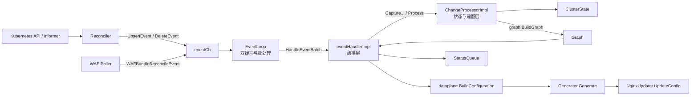
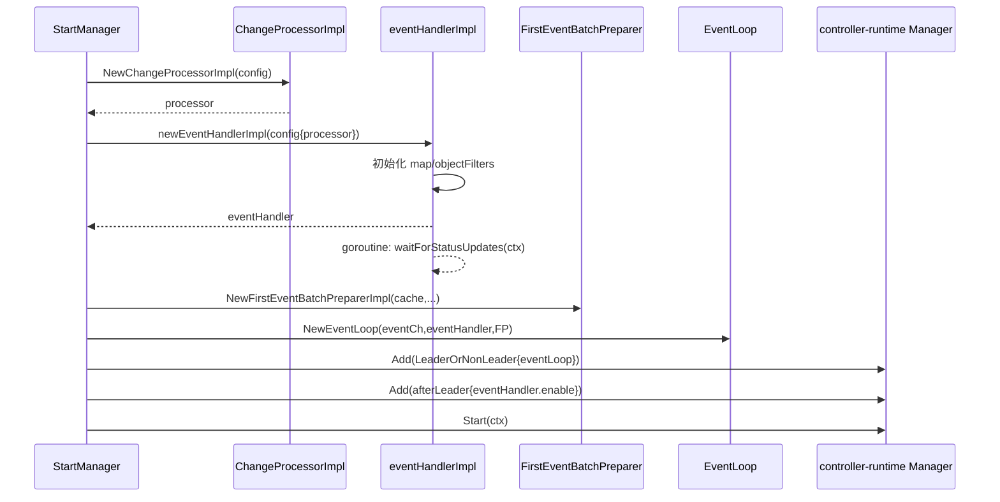
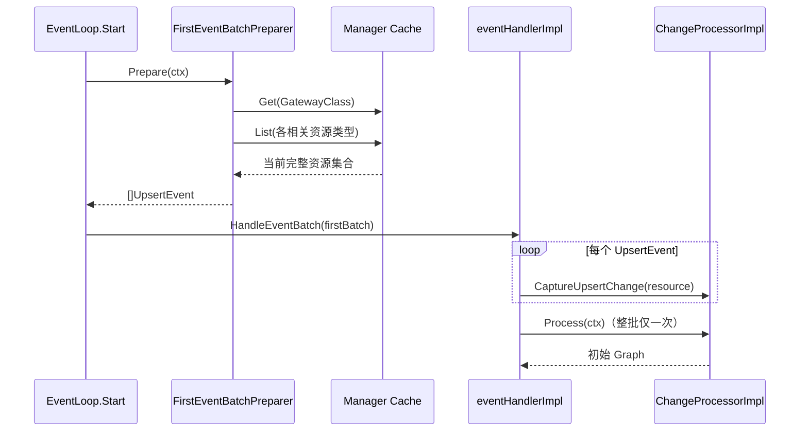
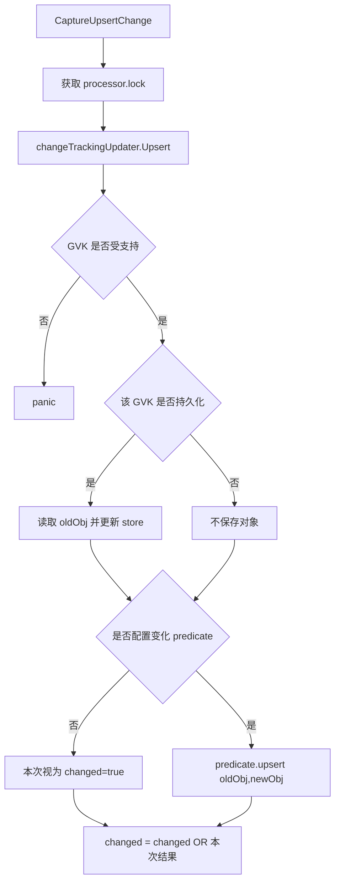
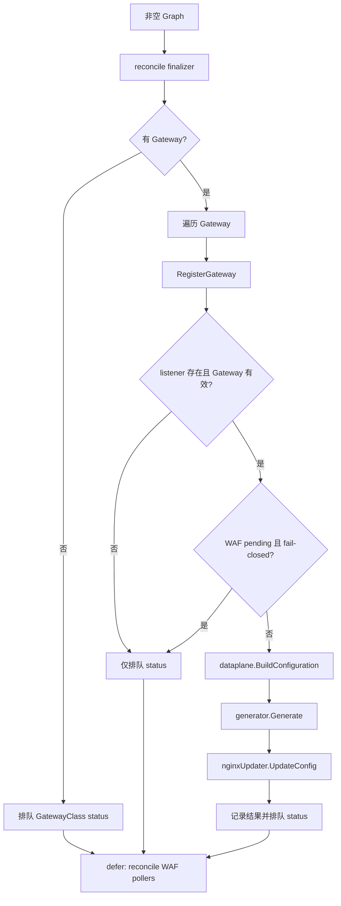
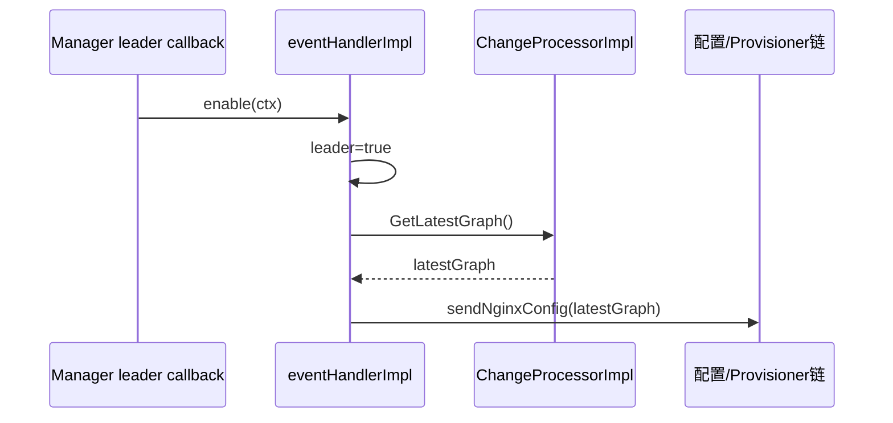

<!-- markdownlint-disable MD025 MD013 -->

# Processor 与 EventHandler 调用链分析

> [!abstract] 核心结论
> `processor` 与 `eventHandler` 不是两个并列的事件消费者。它们是明确的上下层关系：
>
> - `eventHandlerImpl` 是**批次级业务编排器**，接收 EventLoop 交付的一批事件，触发状态维护、Graph 构建、数据面配置生成和下发。
> - `ChangeProcessorImpl` 是 `eventHandlerImpl` 内部依赖的**状态归并器与 Graph 构建器**，维护 Kubernetes 资源的内存快照，判断本批变化是否真的需要重建，并调用 `graph.BuildGraph`。
> - 一批事件中可以有多次 `CaptureUpsertChange`/`CaptureDeleteChange`，但只调用一次 `Process`。这正是 NGF 合并事件、减少重复建图和 NGINX reload 的关键。

本文从 `internal/controller/manager.go:126` 的 `StartManager` 开始，重点分析 `processor` 和 `eventHandler` 从初始化、注入到运行时调用的完整链路。

## 1. 先建立心智模型



可以把二者的边界概括为：

| 对象 | 输入 | 内部状态 | 输出/副作用 | 不负责什么 |
| --- | --- | --- | --- | --- |
| `ChangeProcessorImpl` | 单个资源变化、强制重建信号 | `ClusterState`、`changed` 标志、`latestGraph` | 新的 `*graph.Graph` | 不生成 NGINX 文件，不操作 Deployment，不写 status |
| `eventHandlerImpl` | `events.EventBatch` | 最近的 dataplane 配置、leader 状态、finalizer 状态 | 调用 processor、生成并推送配置、排队 status、协调 provisioner/WAF poller | 不直接实现 Kubernetes watch，不负责 EventLoop 的合批 |

> [!warning] 名称辨析
> 本文中的 `processor` 是 `state.ChangeProcessorImpl`，不是 `internal/controller/nginx/config/policies/upstreamsettings.Processor`。本文中的 `eventHandler` 是 `internal/controller/handler.go` 的 `eventHandlerImpl`，不是 `internal/controller/provisioner/handler.go` 中 provisioner 自己的同名 handler。

## 2. 初始化阶段：`StartManager` 如何把对象接起来

### 2.1 创建共享事件通道并注册控制器

入口位于 `internal/controller/manager.go:126`：

```go
func StartManager(cfg config.Config) error {
    // ...
    eventCh := make(chan any)
    // ...
    discoveredCRDs, err := registerControllers(
        ctx, cfg, mgr, recorder, logLevelSetter, eventCh, controlConfigNSName,
    )
```

`registerControllers` 为 GatewayClass、Gateway、HTTPRoute、Service、Secret、EndpointSlice、各类 Policy 等对象注册 controller，并把同一个 `eventCh` 交给每个 controller 的 `Reconciler`。

运行时 `internal/framework/controller/reconciler.go:84` 的 `Reconcile` 会：

1. 根据 reconcile request 从缓存读取对象；
2. 对象存在时构造 `*events.UpsertEvent`；
3. 对象不存在时构造 `*events.DeleteEvent`；
4. 将事件写入 `eventCh`。

因此 controller/reconciler 只完成“观察事实并投递事件”，并不在 reconcile goroutine 中直接建图或重载 NGINX。

### 2.2 初始化 `processor`

`internal/controller/manager.go:166` 创建 processor：

```go
processor := state.NewChangeProcessorImpl(state.ChangeProcessorConfig{
    GatewayCtlrName:  cfg.GatewayCtlrName,
    GatewayClassName: cfg.GatewayClassName,
    Logger:           cfg.Logger.WithName("changeProcessor"),
    Validators:       /* HTTP、通用字段、认证、Policy 校验器 */,
    EventRecorder:    recorder,
    MustExtractGVK:   mustExtractGVK,
    PlusSecrets:      plusSecrets,
    WAFFetcher:       wafFetcher,
    PLMFetcher:       plmFetcher,
    PolledWAFBundles: /* 从 WAF poller 取得最新 bundle 的闭包 */,
    FeatureFlags:     /* Plus、Experimental */,
    DiscoveredCRDs:   discoveredCRDs,
    Snippets:         cfg.Snippets,
})
```

构造函数 `internal/controller/state/change_processor.go:115` 做了三件关键事情。

#### 2.2.1 建立空的 `ClusterState`

它为 GatewayClass、Gateway、Route、Service、Secret、Policy、NginxProxy、InferencePool 等支持对象分别创建 map。这个 `ClusterState` 是 processor 对当前集群相关资源的内存快照。

#### 2.2.2 为每种 GVK 配置 store 和变化判定 predicate

`trackingUpdaterCfg` 描述每种资源：

- 是否要持久化进 `ClusterState`；
- 用哪个 object store；
- 是否要通过 predicate 判断变化是否与当前 Graph 相关。

例如 Gateway、HTTPRoute 等没有 predicate，合法的 upsert/delete 通常直接将 `changed` 置为 `true`；Service、Secret、Namespace 等使用 `latestGraph.IsReferenced`，只有被当前 Graph 引用时才认为需要重建；EndpointSlice 不直接持久化，但其变化仍可通过引用关系触发重建。

#### 2.2.3 组装 `changeTrackingUpdater`

```go
processor.getAndResetClusterStateChanged = trackingUpdater.getAndResetChangedStatus
processor.forceClusterStateRebuild = trackingUpdater.forceRebuild
processor.updater = trackingUpdater
```

这三个函数/接口分别对应：

- 普通 upsert/delete 后读取并重置 dirty 标志；
- 不修改资源快照、只把 dirty 标志置为 `true`；
- 真正更新各 GVK 的 store。

> [!note] 为什么 processor 持有函数而不是直接暴露 updater 细节
> `ChangeProcessorImpl` 只需要知道“如何更新状态、是否有有效变化、如何强制重建”，而不必理解各 GVK 的 store/predicate 组合。这把 Graph 构建入口与资源变化追踪策略隔开了。

### 2.3 初始化 `eventHandler`

`internal/controller/manager.go:222` 创建 handler，并把刚才的 processor 注入 `eventHandlerConfig.processor`：

```go
eventHandler := newEventHandlerImpl(eventHandlerConfig{
    processor:        processor,
    nginxUpdater:     nginxUpdater,
    nginxProvisioner: nginxProvisioner,
    generator:        ngxcfg.NewGeneratorImpl(...),
    serviceResolver:  resolver.NewServiceResolverImpl(mgr.GetClient()),
    statusQueue:      statusQueue,
    // metrics、client、health checker、WAF poller 等其他依赖
})
```

这里的依赖方向非常重要：

```text
eventHandlerImpl.cfg.processor  -->  state.ChangeProcessor interface
实际对象                         -->  *state.ChangeProcessorImpl
```

handler 依赖接口，`StartManager` 注入实现，因此 handler 单测可以替换为 `FakeChangeProcessor`。

`newEventHandlerImpl`（`internal/controller/handler.go:169`）随后：

1. 保存全部依赖；
2. 初始化 `latestConfigurations` 和 `finalizedAPResources`；
3. 注册 `NginxGateway` 控制面 CR 的特殊 `objectFilter`；
4. 启动 `waitForStatusUpdates` goroutine，持续消费 `statusQueue`。

`NginxGateway` 的 filter 没有把 `captureChangeInGraph` 设为 `true`，其零值为 `false`。所以这个控制面配置对象会调用专用 callback 更新控制面配置和 status，但不会进入 processor 的 `ClusterState`，也不会因此构建数据面 Graph。

### 2.4 创建 EventLoop 并注册到 manager

`internal/controller/manager.go:254-272` 完成最后的布线：

```go
firstBatchPreparer := events.NewFirstEventBatchPreparerImpl(
    mgr.GetCache(), objects, objectLists,
)
eventLoop := events.NewEventLoop(eventCh, logger, eventHandler, firstBatchPreparer)

mgr.Add(&runnables.LeaderOrNonLeader{Runnable: eventLoop})
mgr.Add(runnables.NewCallFunctionsAfterBecameLeader([]func(context.Context){
    groupStatusUpdater.Enable,
    nginxProvisioner.Enable,
    eventHandler.enable,
}))
```

至此调用关系为：



## 3. 首次启动：为什么先做一次全量事件批次

EventLoop 启动后不会立刻消费 controller 投来的增量事件。`internal/framework/events/loop.go:98` 先调用：

```go
el.currentBatch, err = el.preparer.Prepare(ctx)
handleBatch()
```

`FirstEventBatchPreparerImpl.Prepare` 使用 manager cache：

- `Get` 当前配置指定的 GatewayClass；
- `List` 所有相关资源类型；
- 把每个已存在对象包装为 `UpsertEvent`；
- 组成第一次完整的 `EventBatch`。

这样第一次建图面对的是一致、完整的相关资源视图，而不是“先看到 HTTPRoute、稍后才看到 Service”的随机 informer 到达顺序，避免生成短暂的不完整配置和错误 status。



controller 自身在启动时仍可能产生与首次批次重复的 UpsertEvent。processor 的 store 和 predicate 会过滤一部分没有实际影响的重复变化；即使事件重复，EventLoop 的批处理也保证不会为同一批中的每个事件分别建图。

## 4. 增量运行：一条 Kubernetes 变化的完整调用链

以更新一个 HTTPRoute 为例，主调用链如下：

```text
controller-runtime watch
  -> Reconciler.Reconcile
  -> eventCh <- &events.UpsertEvent{Resource: httpRoute}
  -> EventLoop.Start 接收事件
  -> EventLoop.nextBatch append
  -> EventLoop.swapAndHandleBatch
  -> eventHandlerImpl.HandleEventBatch
  -> eventHandlerImpl.parseAndCaptureEvent
  -> ChangeProcessorImpl.CaptureUpsertChange
  -> changeTrackingUpdater.Upsert
  -> object store upsert + changed=true
  -> ChangeProcessorImpl.Process
  -> graph.BuildGraph
  -> eventHandlerImpl.sendNginxConfig
  -> dataplane.BuildConfiguration
  -> generator.Generate
  -> nginxUpdater.UpdateConfig
  -> statusQueue.Enqueue
  -> eventHandlerImpl.waitForStatusUpdates
  -> status updater
```

### 4.1 EventLoop 如何合批且保证单批串行

`EventLoop` 使用 `currentBatch` 和 `nextBatch` 双缓冲：

- handler 正在处理 `currentBatch` 时，新事件继续写入 `nextBatch`；
- 当前批处理结束后交换两个 slice；
- 任意时刻最多只有一个 handler batch goroutine 在处理；
- 同一批内部保持 slice 顺序，但首次全量批次明确不依赖事件顺序。

这使 controller 可以继续收事件，又不会并发调用同一个 `eventHandlerImpl.HandleEventBatch`。

> [!important] 合批的收益
> 假设当前建图/下发期间又到达 100 个资源事件，它们会进入下一批：processor 先采集 100 次变化，最后只执行一次 `Process` 和至多一轮配置下发，而不是触发 100 次 NGINX reload。

### 4.2 `HandleEventBatch`：先采集，后统一处理

`internal/controller/handler.go:189` 的主干非常短：

```go
for _, event := range batch {
    h.parseAndCaptureEvent(ctx, logger, event)
}

gr := h.cfg.processor.Process(ctx)

if !h.cfg.graphBuiltHealthChecker.ready {
    h.cfg.graphBuiltHealthChecker.setAsReady()
}

h.sendNginxConfig(ctx, logger, gr)
```

这里刻意分成两个阶段：

1. **Capture 阶段**：逐个事件修改 processor 的 `ClusterState` 与 dirty 标志；
2. **Process/Apply 阶段**：批次结束后建一次 Graph，再由 handler 将 Graph 应用到其他子系统。

### 4.3 `parseAndCaptureEvent` 的三条分支

#### UpsertEvent

```text
objectFilter 命中?
  ├─ 是：先执行 filter.upsert
  │      └─ captureChangeInGraph=false -> 提前返回
  └─ 否/允许 capture：processor.CaptureUpsertChange(resource)
```

普通资源最终调用 `ChangeProcessorImpl.CaptureUpsertChange`，它在互斥锁内执行 `updater.Upsert`。

#### DeleteEvent

与 upsert 对称。普通资源调用 `CaptureDeleteChange(type, namespacedName)`，store 删除已保存对象，并由 predicate 决定是否把本批标记为 dirty。删除一个 store 中本来就不存在的对象会返回 `false`，避免无意义重建。

#### WAFBundleReconcileEvent

这类事件不代表 Kubernetes 对象本身发生变化，而是外部 WAF bundle 从不可用变为可用：

1. 先检查对应 poller 是否仍存在，丢弃已删除 policy 对应的陈旧事件；
2. 调用 `processor.ForceRebuild()`；
3. 只把 dirty 标志设为 `true`，不向 store 写入一个不完整的伪 Policy 对象。

这是“事实快照未变，但建图的外部输入变了”的特殊路径。

## 5. Processor 内部：Capture 到 Process 到底发生了什么

### 5.1 CaptureUpsertChange



这里使用 OR 累积非常关键：一批中前面的事件只要有一个有效变化，后面的无效/重复事件不能把 `changed` 改回 `false`。

### 5.2 Process

`internal/controller/state/change_processor.go:360`：

```go
func (c *ChangeProcessorImpl) Process(ctx context.Context) *graph.Graph {
    c.lock.Lock()
    defer c.lock.Unlock()

    if !c.getAndResetClusterStateChanged() {
        return nil
    }

    previousWAFBundles := c.mergedWAFBundles()
    c.latestGraph = graph.BuildGraph(/* ClusterState、校验器、特性开关等 */)
    return c.latestGraph
}
```

行为可归纳为：

| dirty 状态 | `Process` 返回 | `latestGraph` | handler 后续行为 |
| --- | --- | --- | --- |
| `false` | `nil` | 保持原值 | `sendNginxConfig` 立即返回，不重复下发 |
| `true` | 新 Graph | 替换为新 Graph | reconcile finalizer/WAF poller，处理 Gateway，生成并下发配置，排队 status |

`getAndResetClusterStateChanged` 在读出 dirty 状态的同时重置为 `false`。因此一次有效变化默认只消费一次；下一批如果没有新变化，`Process` 返回 `nil`。

构建前还会合并 WAF bundle：旧 Graph 缓存的 bundle 作为基线，poller 获取的更新 bundle 后覆盖前者，避免重建时用旧缓存反向覆盖新轮询结果。

### 5.3 锁与并发语义

`CaptureUpsertChange`、`CaptureDeleteChange`、`ForceRebuild`、`Process`、`GetLatestGraph` 都使用同一个 `ChangeProcessorImpl.lock`。

这保证：

- status goroutine 调用 `GetLatestGraph` 时不会读到正在替换的 Graph；
- WAF 事件与普通资源变化不会并发破坏 store/dirty 标志；
- `Process` 建图期间 processor 的 `ClusterState` 不会被另一个调用修改。

EventLoop 已保证批次之间不并发调用 handler；processor 的锁进一步保护来自 status、telemetry、leader callback 等其他调用方的访问。

## 6. Graph 返回 Handler 后如何继续

### 6.1 `nil` Graph 是“无需工作”，不是错误

`sendNginxConfig` 第一条判断是：

```go
if gr == nil {
    return
}
```

所以重复事件或与当前 Graph 无关的资源变化不会进入配置生成阶段，也不会触发 NGINX reload。

### 6.2 非空 Graph 的处理顺序

`internal/controller/handler.go:226` 的顺序是：

1. 注册 defer，在本轮结束时 reconcile WAF poller；
2. reconcile AP resource finalizer（内部仅 leader 执行）；
3. 没有 Gateway 时只排队更新 GatewayClass status，然后返回；
4. 为引用的 InferencePool 确保 shadow Service；
5. 对每个 Gateway 异步调用 provisioner 的 `RegisterGateway`；
6. 无 listener、Gateway 无效或 WAF fail-closed pending 时，仅排队 status 并跳过配置下发；
7. 获取/创建内部 `agent.Deployment` 并设置数据面镜像版本；
8. `dataplane.BuildConfiguration` 把 Graph 转成中间配置；
9. 保存 `latestConfigurations`，供 telemetry 等读取；
10. `generator.Generate` 生成文件；
11. `nginxUpdater.UpdateConfig` 推送配置，Plus 模式再更新 upstream server；
12. 汇总配置/上游错误并写入 `statusQueue`。



### 6.3 status 是另一条异步消费链

`newEventHandlerImpl` 启动的 `waitForStatusUpdates` goroutine 持续：

```text
statusQueue.Dequeue
  -> processor.GetLatestGraph
  -> 将 NGINX reload 结果写回当前 Gateway Graph 节点
  -> updateStatuses / UpdateGateway
  -> LeaderAwareGroupUpdater
```

这里再次体现职责分工：processor 保存和提供最新 Graph，handler 解释下发结果并组织 Kubernetes status 更新。

## 7. Leader 切换时的补偿调用

EventLoop 被包装为 `LeaderOrNonLeader` runnable，因此副本即使尚未成为 leader，也会建立自己的资源视图和最新 Graph。成为 leader 后，manager 调用：

```go
func (h *eventHandlerImpl) enable(ctx context.Context) {
    h.leader = true
    h.sendNginxConfig(ctx, h.cfg.logger, h.cfg.processor.GetLatestGraph())
}
```

这条调用不是重新 Capture/Process，而是直接读取 processor 已保存的 `latestGraph` 并重放 `sendNginxConfig`。意义是新 leader 不必等待下一次 Kubernetes 资源变化，就能立即让 provisioner 和配置下发状态向其当前视图收敛。



## 8. 四条典型路径对照

| 场景 | Capture 动作 | `Process` 是否建图 | 是否可能下发配置 |
| --- | --- | --- | --- |
| 首次启动全量同步 | 多个 `CaptureUpsertChange` | 是，构建初始 Graph | 是 |
| 普通 Gateway API/Kubernetes 增量 | Upsert 或 Delete | predicate 判定为相关变化时是 | Graph 有有效 Gateway 时是 |
| 重复或无关变化 | Capture 后 dirty 仍为 false | 否，返回 `nil` | 否 |
| WAF bundle 外部状态变化 | `ForceRebuild`，不改 store | 是 | 视 WAF/Gateway 状态而定 |
| 成为 leader | 不 Capture、不调用 `Process` | 否，读取 `latestGraph` | 直接重放当前 Graph |
| `NginxGateway` 控制面 CR 变化 | 走 objectFilter callback | 否 | 不触发数据面 Graph 下发 |

## 9. 关键设计点与容易误读之处

> [!tip] 1. Event 不是最终业务命令
> 一个 `UpsertEvent` 的含义是“请把内存事实更新到这个版本”，不是“必须 reload 一次 NGINX”。是否重建由 processor 的 store/predicate/dirty 标志决定。

> [!tip] 2. `latestGraph` 与本轮 `Process` 返回值语义不同
> `Process` 返回 `nil` 表示本轮没有新 Graph；`GetLatestGraph` 仍可能返回上一次的有效 Graph。Leader enable 和 status 消费用的是后者。

> [!tip] 3. Handler 的批处理边界就是重建边界
> handler 先消费完整批次，再调用一次 `Process`。如果把 `Process` 移到逐事件循环里，会破坏合批设计并放大建图与 reload 次数。

> [!tip] 4. 特殊对象不一定进入 Graph
> `objectFilters` 允许对象先执行专用 callback，并通过 `captureChangeInGraph` 决定是否继续交给 processor。当前 `NginxGateway` 就只更新控制面。

> [!tip] 5. Graph 是状态与配置链路的共同事实来源
> `sendNginxConfig` 使用本轮 Graph 生成配置，status goroutine 和 telemetry 则通过 `GetLatestGraph` 获取最近一次 Graph。修改 Graph 字段语义时必须同时检查配置生成、status 和 telemetry 消费方。

## 10. 调试建议

排查“资源改了但 NGINX 没更新”时，按以下断点/日志顺序定位：

1. `internal/framework/controller/reconciler.go:84`：是否产生正确的 Upsert/Delete event；
2. `internal/framework/events/loop.go:119`：事件是否进入 `nextBatch`；
3. `internal/controller/handler.go:830`：是否被特殊 filter 提前返回；
4. `internal/controller/state/store.go:303` 或 `:330`：predicate 最终是否把 `changed` 置为 true；
5. `internal/controller/state/change_processor.go:360`：`Process` 是否返回 `nil`；
6. `internal/controller/state/change_processor.go:370`：`graph.BuildGraph` 产物中 Gateway/Route 是否有效；
7. `internal/controller/handler.go:226`：是否在无 Gateway、无 listener、invalid、WAF pending 分支提前结束；
8. `internal/controller/handler.go:297`：dataplane 配置是否正确；
9. `internal/controller/handler.go:884`：generator 和 `UpdateConfig` 是否被调用；
10. `internal/controller/handler.go:531`：statusQueue 中是否返回配置应用错误。

常用 CodeGraph 查询：

```bash
codegraph explore "StartManager NewChangeProcessorImpl newEventHandlerImpl NewEventLoop"
codegraph explore "HandleEventBatch parseAndCaptureEvent CaptureUpsertChange Process sendNginxConfig"
codegraph explore "Reconciler eventCh UpsertEvent DeleteEvent EventLoop"
```

## 11. 源码索引

| 关注点 | 源码 |
| --- | --- |
| 总装配入口 | `internal/controller/manager.go:126` `StartManager` |
| processor 创建 | `internal/controller/manager.go:166` |
| handler 创建与 processor 注入 | `internal/controller/manager.go:222` |
| FirstEventBatchPreparer/EventLoop 创建 | `internal/controller/manager.go:254` |
| controller 注册与共享 eventCh | `internal/controller/manager.go:789` `registerControllers` |
| 首批资源类型清单 | `internal/controller/manager.go:1276` `prepareFirstEventBatchPreparerArgs` |
| Reconciler 生成事件 | `internal/framework/controller/reconciler.go:84` |
| EventLoop 双缓冲与串行批处理 | `internal/framework/events/loop.go:61` |
| 首批全量事件准备 | `internal/framework/events/first_eventbatch_preparer.go:62` |
| handler 配置与构造 | `internal/controller/handler.go:50`、`:169` |
| 批次入口 | `internal/controller/handler.go:189` `HandleEventBatch` |
| Graph 到 NGINX 配置 | `internal/controller/handler.go:226` `sendNginxConfig` |
| 事件分类与 Capture | `internal/controller/handler.go:830` `parseAndCaptureEvent` |
| processor 构造与 GVK 策略 | `internal/controller/state/change_processor.go:115` |
| Capture/Process/GetLatestGraph | `internal/controller/state/change_processor.go:338-422` |
| store、predicate 与 dirty 标志 | `internal/controller/state/store.go:303-351` |

## 12. 一句话收束

`EventLoop` 决定**什么时候形成一个批次**，`eventHandlerImpl` 决定**一个批次要协调哪些业务动作**，`ChangeProcessorImpl` 决定**这些资源变化是否足以构建一个新的期望状态 Graph**；三者组合后，NGF 才能在高频 Kubernetes 事件下保持状态一致，同时避免不必要的 NGINX 配置重载。

