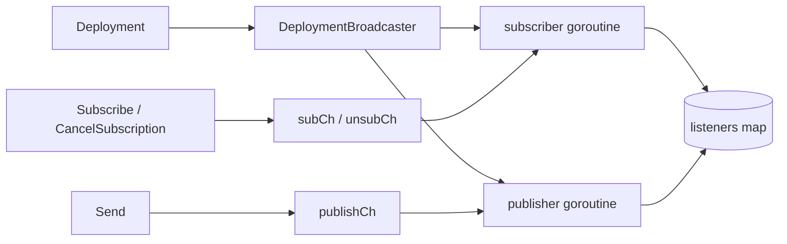
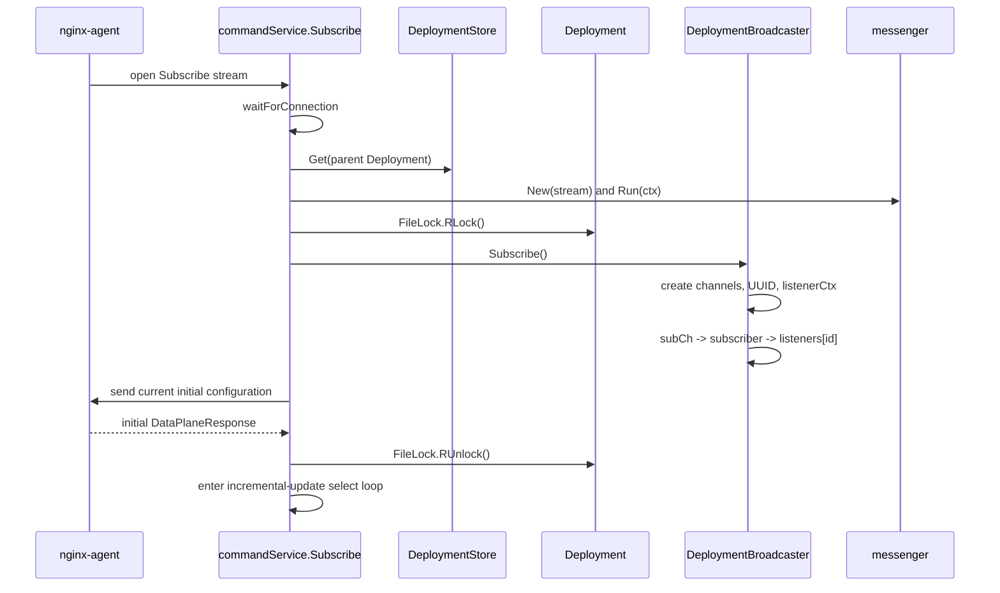
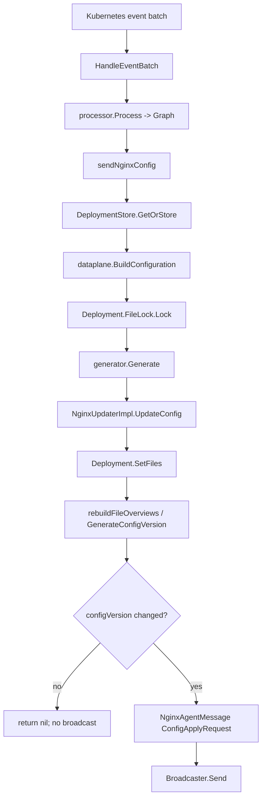
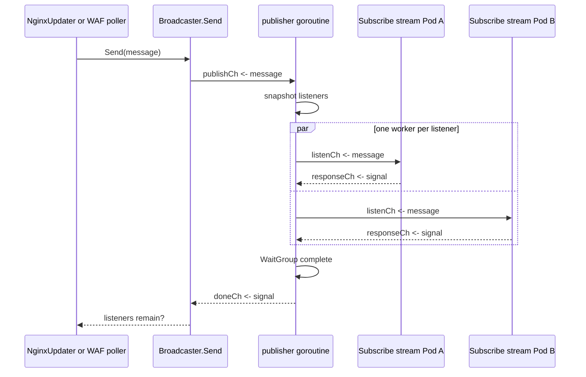

# DeploymentBroadcaster 广播器机制与全链路

> [!abstract] 核心结论
> `internal/controller/nginx/agent/broadcast/broadcast.go` 是 NGF 控制面内部、按数据面
> `Deployment` 隔离的“多订阅者广播 + 完成屏障”。它把一次配置文件更新或 NGINX Plus API
> 动作同时交给该 Deployment 的所有在线 Agent 订阅流，并阻塞发送方，直到每个订阅者回传
> `ResponseCh`、取消订阅，或整个广播器关闭。它不保存配置、不直接调用 gRPC，也不判断配置是否成功；
> 真正的成功/失败由 `commandService.Subscribe` 从 Agent 的 `DataPlaneResponse` 解析并写入
> `Deployment.podStatuses`，`ResponseCh` 只是“该订阅者已结束本轮处理”的屏障信号。

## 1. 读者、范围与证据边界

本文适合需要理解或修改以下代码的开发者：

- `internal/controller/nginx/agent/broadcast/broadcast.go`
- `internal/controller/nginx/agent/command.go:commandService.Subscribe`
- `internal/controller/nginx/agent/agent.go:NginxUpdaterImpl`
- `internal/controller/nginx/agent/deployment.go:Deployment`
- `internal/controller/handler.go:eventHandlerImpl.sendNginxConfig`

分析范围从 Kubernetes 事件批次触发开始，追到 Agent 返回应用结果、NGF 释放广播屏障并入队状态更新为止。
文件下载只追到 NGF `FileService` 边界；Agent 仓库内部如何落盘、`nginx -t`、reload 和回滚不在本文证明范围内，
参见 [[09-文件拉取-FileService与配置文件交付]] 与 [[10-配置应用-ACK-状态回传]]。

> [!info] 证据等级
> - **源码事实**：基于 revision `bdc4a5e5cd87d340fdf752811107d608342d13e0`，分支 `main`，工作区分析前为 clean。
> - **测试支持**：已检查广播、订阅、Deployment 与 updater 的相关测试，并在 2026-07-15 运行
>   `go test ./internal/controller/nginx/agent/broadcast ./internal/controller/nginx/agent/...`，全部通过。
> - **运行时观察**：本文没有连接实时 Kubernetes 集群，不把已有笔记中的历史日志当作当前运行证据。
> - **推断**：设计动机或未被测试直接断言的边界会明确标记为“推断”。

## 2. 它负责什么，不负责什么

| 事项 | 所属组件 | `broadcast.go` 是否负责 |
| --- | --- | --- |
| 保存最新文件、hash、`configVersion` | `Deployment` | 否 |
| 判断配置是否发生变化 | `Deployment.rebuildFileOverviews` | 否 |
| 按 Deployment 维护订阅者集合 | `DeploymentBroadcaster.listeners` | 是 |
| 把同一条消息 fan-out 给当前订阅者 | `DeploymentBroadcaster.publisher` | 是 |
| 等待所有订阅者结束本轮处理 | `ResponseCh` + `WaitGroup` + `doneCh` | 是 |
| 把内部消息转换成 MPI protobuf | `commandService.Subscribe` | 否 |
| 在 gRPC stream 上发送/接收 | `messenger.NginxAgentMessenger` | 否 |
| 让 Agent 拉取真实文件内容 | `fileService.GetFile/GetFileStream` | 否 |
| 判断 Agent 应用成功或失败 | `commandService.Subscribe` | 否 |
| 汇总 Pod 错误并更新 Gateway/Route status | `Deployment` + status queue | 否 |

一句话边界：**Broadcaster 负责“交付协调”，业务层负责“消息含义与结果”。**

## 3. 对象是怎样构造和归属的

### 3.1 装配阶段

控制面启动时，`NewNginxUpdater` 先构造共享的 `DeploymentStore`、`commandService` 和 `fileService`：

```text
NewNginxUpdater
  ├─ NewConnectionsTracker
  ├─ NewDeploymentStore
  ├─ newCommandService(..., DeploymentStore, ...)
  └─ newFileService(..., DeploymentStore, ...)
```

此时并不会提前为所有数据面创建 Broadcaster。真正的创建是惰性的：

```text
eventHandlerImpl.sendNginxConfig
  -> DeploymentStore.GetOrStore(ctx, deploymentName, gatewayName)
     -> newDeployment(NewDeploymentBroadcaster(ctx), gatewayName)
```

因此，生产代码中是 **一个 NGF 内部 `Deployment` 对象拥有一个 `DeploymentBroadcaster`**；
不同 Gateway 数据面 Deployment 的 listener map、消息顺序和阻塞互不共享。

### 3.2 `NewDeploymentBroadcaster` 启动了什么

构造函数创建：

- `publishCh`：生产者提交 `NginxAgentMessage`。
- `subCh`：提交新订阅者的内部通道组。
- `unsubCh`：提交要移除的订阅 ID。
- `doneCh`：publisher 告知某次全量广播已经结束。
- `listeners`：`map[string]storedChannels`，当前订阅者的唯一注册表。
- `broadcasterCtx`：父 context 的 child，作为整个广播器和所有 listener context 的关闭根。
- 两个长生命周期 goroutine：`subscriber()` 与 `publisher()`。



### 3.3 生命周期边界

广播器跟随传入 `NewDeploymentBroadcaster(ctx)` 的 context 关闭。关闭时：

1. `subscriber()` 和 `publisher()` 都能从 `broadcasterCtx.Done()` 退出。
2. `subscriber()` 的 deferred `broadcasterCancel()` 会取消所有 child listener context。
3. 正在等待消息交付或 `ResponseCh` 的 publisher worker 因 context 取消而退出。
4. 正在 `Send`、`Subscribe`、`CancelSubscription` 的调用也都有 shutdown 分支，不必永远阻塞在内部通道上。

> [!warning] Store 删除不等于广播器关闭
> **源码事实**：`DeploymentStore.Remove` 只从 `sync.Map` 删除 `Deployment`，`Broadcaster` 接口没有 `Close`，
> 删除路径也没有显式 cancel。因而广播器是否结束取决于最初传入的父 context，而不是 store entry 是否还存在。
> 修改 Deployment 生命周期时必须把这一点纳入资源回收设计。

## 4. 核心数据结构

### 4.1 对外和对内通道方向相反

`Subscribe()` 创建同一对无缓冲通道，但分别以不同方向暴露：

| 结构 | 字段 | 谁操作 | 方向 |
| --- | --- | --- | --- |
| `SubscriberChannels` | `ListenCh` | `commandService.Subscribe` | 只接收 `<-chan NginxAgentMessage` |
| `SubscriberChannels` | `ResponseCh` | `commandService.Subscribe` | 只发送 `chan<- struct{}` |
| `storedChannels` | `listenCh` | broadcaster publisher | 只发送 `chan<- NginxAgentMessage` |
| `storedChannels` | `responseCh` | broadcaster publisher | 只接收 `<-chan struct{}` |
| 两者 | `ID/id` | 订阅者取消、map 定位 | UUID 字符串 |
| `storedChannels` | `listenerCtx/cancel` | broadcaster | 单订阅者中断与清理 |

这种方向约束让编译器直接阻止订阅者向 `ListenCh` 写消息，或从 `ResponseCh` 读取消息。

### 4.2 广播消息只是内部信封

| `MessageType` | 有效字段 | 后续 protobuf | 用途 |
| --- | --- | --- | --- |
| `ConfigApplyRequest` | `FileOverviews`、`ConfigVersion` | `pb.ConfigApplyRequest` | OSS/Plus 的完整配置更新、WAF bundle 文件更新 |
| `APIRequest` | `NGINXPlusAction` | `pb.APIActionRequest` | NGINX Plus upstream 动态更新 |

`NginxAgentMessage` 不带目标 Pod：目标集合由当前 `listeners` 决定；也不带成功状态，成功状态来自稍后的
`DataPlaneResponse`。

## 5. 订阅链路：Agent 如何进入 listener map

具体触发是 Agent 打开 MPI `CommandService.Subscribe` 双向流。



关键顺序是：

```text
Deployment.FileLock.RLock
  -> Broadcaster.Subscribe
  -> setInitialConfig
Deployment.FileLock.RUnlock
```

这是 `command.go` 注释明确记录、并由锁顺序强制的正确性约束：

- 若新订阅先获得读锁，它会先注册并读取当前最新配置；并发更新只能等读锁释放后再广播给它。
- 若配置更新先获得写锁，新订阅必须等更新完整结束，随后读取更新后的配置。
- 因而不会出现“初始配置读旧值，同时又错过增量广播”的窗口。

> [!note] `Subscribe()` 本身不是完整的初始快照协议
> `subCh` 是无缓冲通道，send/receive 建立同步点，但 map 写入发生在 subscriber goroutine 接收后的 case 内。
> 广播器单测甚至用短暂等待来让异步注册完成。生产正确性不是只靠 `Subscribe()`，还依赖外层
> `Deployment.FileLock` 和“先订阅、再发初始配置”的组合协议。

## 6. 增量配置更新的完整因果链

### 6.1 从 Kubernetes 事件到内部广播消息



`Deployment.rebuildFileOverviews` 会把受 NGF 管理的文件元数据、静态 ignore 文件和 volume mount
覆盖的 unmanaged 文件组合起来，生成新的 `configVersion`。若版本未变就返回 `nil`，从源头去重，不进入广播器。

### 6.2 `Send` 与 `publisher` 怎样 fan-out

一次 `Send(message)` 的内部步骤：

1. 将消息写入无缓冲 `publishCh`；shutdown 时返回 `false`。
2. `publisher()` 在 `listeners` 的读锁下复制当前 map，形成稳定快照，然后立即释放锁。
3. 对快照中的每个 listener 启动一个 WaitGroup worker，因此各 Pod 并行接收同一条消息。
4. 每个 worker 先尝试写 `listenCh`，再等待对应 `responseCh`。
5. listener cancel 或 broadcaster shutdown 可以在这两个等待点解除阻塞。
6. `wg.Wait()` 等所有快照 listener 都响应或被取消。
7. publisher 向 `doneCh` 发信号，原始 `Send` 才继续。
8. `Send` 查看当前 `listeners` map 是否非空，并以此返回 `bool`。



快照的意义是订阅增删不必在整个网络往返期间持有 `listeners` map 锁。删除某 listener 时，
`subscriber()` 先 cancel 它的 `listenerCtx` 再从 map 删除，因此旧快照中的 worker 也能及时退出。

### 6.3 从内部消息到 gRPC，再回到屏障

`commandService.Subscribe` 从 `ListenCh` 收到消息后：

1. `ConfigApplyRequest` 调 `buildRequest`，将文件摘要、instance ID、config version 包装为
   `pb.ManagementPlaneRequest`。
2. `APIRequest` 调 `buildPlusAPIRequest`，包装 NGINX Plus action。
3. `messenger.Send` 把请求交给 gRPC stream 的发送循环。
4. 对配置文件请求，Agent 随后按 file meta 调 `FileService.GetFile` 或 `GetFileStream` 拉内容。
5. Agent 完成应用后经 Subscribe stream 返回 `pb.DataPlaneResponse`。
6. NGF 将非 OK 响应写成该 UUID 对应的 `podStatuses` error，OK 则写 `nil`。
7. 只有 `pendingBroadcastRequest != nil` 时才写 `channels.ResponseCh`，释放这一 listener 的 publisher worker。
8. 所有 listener 完成后，原始生产者从 `Broadcaster.Send` 返回，读取聚合错误并最终释放 `FileLock`。

> [!important] 为什么 FileService 可以无锁读取
> `fileService.GetFile` 自己没有获取 `Deployment.FileLock`。它依赖配置生产者在
> “更新 Deployment 文件 → 广播 → Agent 拉文件 → Agent ACK → Send 返回”的整个事务中一直持有写锁。
> 这样 Agent 根据某个 hash 拉文件时，`Deployment.files` 不会被下一轮配置替换。

### 6.4 最终状态落点

常规配置更新结束后：

```text
commandService.Subscribe
  -> Deployment.SetPodErrorStatus(uuid, applyErrorOrNil)
  -> ResponseCh
  -> Broadcaster.Send returns
  -> NginxUpdaterImpl.UpdateConfig
       -> SetLatestConfigError(GetConfigurationStatus())
  -> eventHandlerImpl.updateNginxConf returns
  -> FileLock.Unlock
  -> status.Queue.Enqueue(UpdateAll, NginxConfigPushed=true, Error=...)
```

所以广播器只是让生产者能够在读取 `GetConfigurationStatus()` 之前确认所有在线订阅者都结束了这一轮。

## 7. 必须区分的四个“完成”信号

| 层次 | 信号 | 它证明了什么 | 它没有证明什么 |
| --- | --- | --- | --- |
| messenger 入队 | `messenger.Send` 返回 `nil` | 请求已交给本地发送 goroutine | Agent 已收到或已应用 |
| 数据面业务 ACK | `DataPlaneResponse.CommandResponse` | Agent 报告本次操作 OK/ERROR | 所有 Pod 都完成 |
| 单订阅者屏障 | `ResponseCh <- struct{}{}` | 该 Subscribe handler 已处理完本轮结果或错误 | 应用一定成功；通道不携带结果 |
| 全广播屏障 | `doneCh <- struct{}{}` | 快照中的所有 listener 都响应、取消或随 shutdown 退出 | 每个 listener 都成功应用 |

`Send` 返回值也不是成功 ACK。实现实际返回 `len(b.listeners) > 0`：表示广播完成时 map 中仍有订阅者。
Agent 应用失败时，只要订阅仍存在，它仍可能返回 `true`；真正的失败必须读取 `Deployment.GetConfigurationStatus()`。

> [!warning] 命名误区
> `UpdateConfig` 中变量名 `applied` 和 `Send` 注释容易让人以为返回值代表“成功应用”。当前实现并非如此。
> 修改调用方时不要用这个 bool 决定 Gateway 成功状态。

## 8. 并发模型与必须保持的不变量

| 不变量 | 由什么保证 | 破坏后的后果 |
| --- | --- | --- |
| 每个 Deployment 的广播按条串行 | 单个无缓冲 `publishCh` + 单个 publisher | 同一 Pod 可能并行处理两版配置 |
| 同一条消息对多个 Pod 并行 | 每 listener 一个 WaitGroup worker | 慢 Pod 会串行拖慢其他 Pod 的交付 |
| listener map 并发安全 | `mu` + 发布前快照 | data race、map panic、漏发/重复发 |
| 新订阅不会漏过初始快照与并发更新 | 外层 `FileLock` + subscribe-before-initial-config | 新 Pod 配置漂移 |
| 文件摘要与可下载内容属于同一版本 | 更新方持有 `FileLock` 直到 Agent ACK | hash 对应内容被下一轮覆盖，GetFile 404 |
| publisher 一定有退出等待的路径 | listener/broadcaster context + CancelSubscription | goroutine 和事件处理永久阻塞 |
| 状态先落盘，屏障后释放 | Subscribe 先 `SetPodErrorStatus`，再写 `ResponseCh` | producer 读到上一轮状态 |
| 初始配置 ACK 不误释放广播 | `pendingBroadcastRequest` gate | 未完成的增量广播被误判完成 |

### 为什么复制 listener map

这是代码可见的并发策略：map 锁只保护注册表，不跨越 gRPC/Agent 往返。快照中的 `storedChannels`
带独立 context，既让 publish fan-out 无需长期占锁，也让 unsubscribe 能解除旧快照 worker 的阻塞。

### `Send` 的串行化为什么没有“done 信号串台”

`publisher` 在完成当前消息并成功写入 `doneCh` 之前不会回到 `publishCh` 接收下一条消息。
因此同一 Broadcaster 上最多只有一个已经成功提交 `publishCh`、正在等待 `doneCh` 的 `Send`；其他发送者仍阻塞在
`publishCh`，不会提前消费当前消息的 done 信号。

## 9. 重要分支与失败路径

### 9.1 没有订阅者

publisher 得到空快照，WaitGroup 立即完成，`Send` 返回 `false`。但 `Deployment.SetFiles` 已保存新文件和
`configVersion`；未来新 Agent 订阅时，`setInitialConfig` 会读取并发送这份最新状态。因此“无人在线”不是数据丢失，
而是跳过即时推送、依靠初始快照修复。

### 9.2 Agent 报应用失败

`commandService.Subscribe` 将错误写入 `podStatuses`，随后仍发送 `ResponseCh`。广播屏障正常释放，
`Send` 的 bool 仍可能为 `true`，上层通过 `GetConfigurationStatus()` 读取真正错误并写状态。

### 9.3 gRPC 发送或连接失败

- `msgr.Send` 失败：记录 Pod error，写 `ResponseCh`，Subscribe 返回 gRPC Internal。
- `msgr.Errors()` 收到 EOF：尽力非阻塞写 `ResponseCh`，Subscribe 返回 Aborted。
- 其他 stream error：记录 Pod error、释放屏障并返回 Internal。
- Subscribe 返回时 deferred `CancelSubscription` 删除 listener，并取消其 listener context。

### 9.4 Agent 回滚中间消息

消息文本包含 `rollback successful` 或 `rollback failed` 时，Subscribe 会忽略该中间消息并继续等待，
`pendingBroadcastRequest` 不清空，也不发送 `ResponseCh`。设计期待后续最终响应结束本轮广播。

### 9.5 取消订阅或控制面 shutdown

`CancelSubscription(id)` 让 subscriber goroutine cancel 单 listener context 并删 map；publisher 无论正在等
`listenCh` 发送还是 `responseCh` 接收，都会退出该 worker。广播器父 context 取消则解除所有内部阻塞，
正在 `Send` 的调用返回 `false`。

### 9.6 活连接永远不回业务响应

> [!danger] 无单次 ConfigApply 超时
> **源码事实**：Broadcaster 等待 `ResponseCh` 没有 timer；常规 `UpdateConfig` 也没有为一次 `Send` 设置超时。
> 如果订阅 stream 仍存活、listener 没有取消，但 Agent 永远不回最终响应，`Send` 会一直阻塞，外层
> `Deployment.FileLock` 也一直被持有。

NGINX Plus `sendRequest` 虽然建立了 5 秒 retry context，但 callback 内调用的 `broadcaster.Send(msg)` 本身不接收
这个 context；若单次 `Send` 卡住，外层 polling timeout 无法中断正在执行的 callback。若要补超时，需要让
Broadcaster API 或 listener 等待显式接收 context，而不是只在调用方再包一层 timer。

### 9.7 未知消息类型

Broadcaster 对 `MessageType` 不做校验；`commandService.Subscribe` 的 switch 遇到未知值会 panic。
这是一个封闭内部协议的 fail-fast 行为。新增类型必须同时修改生产者、Subscribe 转换逻辑和测试。

## 10. NGINX Plus 与 WAF 如何复用同一机制

### 10.1 NGINX Plus upstream APIRequest

`UpdateUpstreamServers` 将 HTTP/stream upstream 转换成一个或多个 `pb.NGINXPlusAction`，逐条构造
`NginxAgentMessage{Type: APIRequest}` 并调用同一个 Broadcaster。Subscribe 侧改用
`buildPlusAPIRequest`，但 listener fan-out、Agent 响应、`podStatuses` 与 `ResponseCh` 屏障完全复用。

新订阅者不会依赖历史广播重放；`Deployment.nginxPlusActions` 保存最近动作，`setInitialConfig` 在初始文件配置后
逐条补发，从最新状态恢复。

### 10.2 WAF bundle

WAF poller 下载到新 bundle 后：

```text
poller.pushBundleToDeployments
  -> Deployment.FileLock.Lock
  -> Deployment.UpdateWAFBundle
  -> rebuildFileOverviews
  -> Broadcaster.Send(ConfigApplyRequest)
  -> Deployment.FileLock.Unlock
```

它仍然发送完整的新 file overview/config version，而不是发一种专属 WAF 消息，因此 Agent 文件拉取与 ACK 流程不变。
`RemoveWAFBundle` 当前只有单测调用，没有生产调用方；不能据此宣称运行时会自动广播 bundle 删除。

## 11. 设计理由：事实与推断分开看

### 有代码注释支持的意图

- subscribe-before-initial-config 与 `FileLock` 用来避免新连接漏掉并发配置更新。
- listener context 用来在 unsubscribe 或 shutdown 时解除 publisher 阻塞。
- `pendingBroadcastRequest` 用来阻止初始配置 ACK 误触发增量广播完成。
- 配置文件只发 overview，Agent 再通过 FileService 拉取内容。

### 由实现强制的不变量

- publisher 按 Deployment 串行处理消息，对订阅者并行 fan-out。
- 一轮广播必须等快照内每个 listener 响应、取消或 shutdown 才结束。
- 结果先写 `podStatuses`，然后再释放 producer 屏障。

### 合理推断

- **高置信度**：把 Broadcaster 放在 `Deployment` 内，是为了让订阅集合、配置状态和消息顺序拥有相同的隔离键。
- **高置信度**：`ResponseCh` 只传空结构体，是刻意把“协调完成”与“业务结果”分开；业务结果已有
  `podStatuses` 这个共享落点。
- **中置信度**：使用快照而不是长期持有 map 锁，是为了让订阅管理不被慢 Agent 的网络/应用时间锁住。

以上推断来自结构与调用关系，不代表仓库作者在 issue 或设计文档中明确写过这些原话。

## 12. 测试证据与可观测性

### 12.1 关键测试

| 测试 | 证明的行为 |
| --- | --- |
| `broadcast_test.go:TestSubscribe` | 单 listener 收消息、回屏障后 `Send=true` |
| `TestSubscribe_MultipleListeners` | 一轮广播等待两个 listener 都响应 |
| `TestSubscribe_NoListeners` | 空 listener 集合时 `Send=false` |
| `TestCancelSubscription` | 已取消 listener 不再接收消息 |
| `TestShutdown_MessagesIgnoredAfterContextCancel` | shutdown 后消息被拒绝 |
| `TestShutdown_ContextCancelAfterListenerReceivedMessage` | 等响应期间 shutdown 能解除阻塞 |
| 两个 `TestCancelSubscription_UnblocksPublisher...` | 交付前或交付后取消都能解除 publisher |
| `command_test.go:TestSubscribe*` | 内部广播消息被转换、发送、响应和错误路径被处理 |
| `agent_test.go:TestUpdateConfig*` | 配置变化触发 Send，无变化不触发 |
| `deployment_test.go:TestUpdateWAFBundle` | WAF bundle 变化重建版本消息 |

当前广播器测试覆盖了取消和 shutdown，但没有直接覆盖：

- 多个并发 producer 调 `Send` 的顺序。
- listener 永久不响应时的超时，因为当前没有超时语义。
- subscription 与空快照完成之间并发变化时，`Send` bool 的精确定义。
- `DeploymentStore.Remove` 后 Broadcaster goroutine 的生命周期。

### 12.2 日志与调试断点

Broadcaster 自身没有 logger、metric 或 trace。主要观察点在调用方：

| 阶段 | 日志/状态 | 建议断点 |
| --- | --- | --- |
| 去重 | `No changes to nginx configuration files...` | `Deployment.rebuildFileOverviews` |
| 广播提交 | `Sent nginx configuration to agent` | `DeploymentBroadcaster.Send` |
| 单订阅交付 | `Sending configuration to agent` | `commandService.Subscribe` 的 `ListenCh` case |
| Agent 返回 | Pod error 被设为 nil/error | `msgr.Messages()` case |
| 文件拉取 | `Getting file for agent` / wrong hash | `fileService.getFileContents` |
| 状态闭环 | status queue object | `eventHandlerImpl.sendNginxConfig` 的 Enqueue |

建议按以下 hop 排查卡住位置：

1. `rebuildFileOverviews` 是否返回非 nil，config version 是否变化。
2. `Send` 是否成功写入 `publishCh`。
3. publisher 快照里是否存在目标 listener UUID。
4. Subscribe 是否从 `ListenCh` 收到消息。
5. messenger/gRPC 是否发送成功。
6. Agent 是否调用 FileService，hash 是否匹配。
7. NGF 是否收到最终 `DataPlaneResponse`。
8. `SetPodErrorStatus` 后是否写入 `ResponseCh`。
9. publisher WaitGroup 与 `doneCh` 是否完成。
10. handler 是否释放 `FileLock` 并 Enqueue status。

## 13. 二次开发与改动爆炸半径

### 新增一种广播消息

至少同步修改：

1. `broadcast.MessageType` 与 `NginxAgentMessage` 字段。
2. 所有生产者的消息构造。
3. `commandService.Subscribe` 的 switch 和 protobuf 构造函数。
4. nginx-agent 对应 MPI 消息的处理能力；若协议变更，还要更新 pinned Agent protobuf 依赖。
5. broadcast fake（通过 `go generate`/counterfeiter 生成，不手改生成文件）。
6. broadcaster、commandService、updater 的正向、错误和未知类型测试。

### 增加超时或 context-aware Send

推荐从接口层定义清楚语义，例如让 `Send` 接受 context 或返回结构化结果。改动会影响：

- `Broadcaster` 接口与 `DeploymentBroadcaster.Send`。
- `broadcastfakes.FakeBroadcaster` 生成代码。
- `NginxUpdaterImpl.UpdateConfig/sendRequest`。
- WAF poller。
- command Subscribe 如何区分 timeout、unsubscribe、shutdown 和 Agent ERROR。
- 外层 `FileLock` 的释放时机与 status 映射。

不要仅在 `Send` 外包 `context.WithTimeout`；当前阻塞发生在不接收该 context 的内部等待上。

### 修改锁或订阅顺序

必须至少复测四个并发场景：

- 新 Agent 与配置更新同时发生。
- Agent 拉文件时下一版配置到达。
- listener 收到消息后断线。
- listener 尚未收到消息就取消。

`Deployment` 中标注“UNLOCKED”的 `SetFiles/GetFile/GetFileOverviews/GetNGINXPlusActions` 等方法不是可随意调用的
无锁 API；它们依赖调用方持有整个事务锁。

## 14. 最小心智模型

把每个 `DeploymentBroadcaster` 想成一个按 Deployment 隔离的会议主持人：

1. `Deployment` 保存最新议题，即配置状态。
2. 每个 Agent Subscribe stream 领一对“收消息/举手完成”的通道。
3. producer 在持有 `FileLock` 时发起议题。
4. 主持人把议题同时发给当前所有参会者。
5. 每个参会者先把结果写进 `podStatuses`，再举手。
6. 所有人举手、退出或全局散会后，producer 才继续汇总状态并释放锁。

最重要的三句话：

- **Broadcaster 是 barrier，不是消息队列，也不是配置数据库。**
- **`ResponseCh` 表示处理结束，不表示处理成功。**
- **正确性来自 Broadcaster 与 `Deployment.FileLock`、Subscribe 初始快照、gRPC ACK 状态的组合。**

## 15. 源码与证据索引

| 主题 | 证据位置 |
| --- | --- |
| 广播器接口、通道、goroutine、消息类型 | `nginx-gateway-fabric:internal/controller/nginx/agent/broadcast/broadcast.go` |
| 广播器并发/取消/shutdown 测试 | `nginx-gateway-fabric:internal/controller/nginx/agent/broadcast/broadcast_test.go` |
| Deployment 状态、文件版本与 broadcaster 所有权 | `nginx-gateway-fabric:internal/controller/nginx/agent/deployment.go` |
| NginxUpdater 构造、Config/APIRequest 生产者 | `nginx-gateway-fabric:internal/controller/nginx/agent/agent.go` |
| Subscribe、初始配置、protobuf 转换、ACK 与状态 | `nginx-gateway-fabric:internal/controller/nginx/agent/command.go` |
| gRPC stream 收发适配器 | `nginx-gateway-fabric:internal/controller/nginx/agent/grpc/messenger/messenger.go` |
| Agent 文件拉取的 NGF 服务端 | `nginx-gateway-fabric:internal/controller/nginx/agent/file.go` |
| Kubernetes 事件、事务锁、最终状态入队 | `nginx-gateway-fabric:internal/controller/handler.go` |
| WAF bundle 复用广播路径 | `nginx-gateway-fabric:internal/framework/waf/poller/poller.go` |
| Subscribe 集成式单测 | `nginx-gateway-fabric:internal/controller/nginx/agent/command_test.go` |
| updater 与版本去重测试 | `nginx-gateway-fabric:internal/controller/nginx/agent/agent_test.go`、`deployment_test.go` |

## 16. 关联笔记

- 上游触发：[[11-GatewayAPI到NGINX配置生成链路]]
- 长流总览：[[08-订阅长流-Subscribe与配置下发]]
- 文件内容交付：[[09-文件拉取-FileService与配置文件交付]]
- Agent ACK 与状态：[[10-配置应用-ACK-状态回传]]
- 返回目录：[[00-首页-学习路线]]

