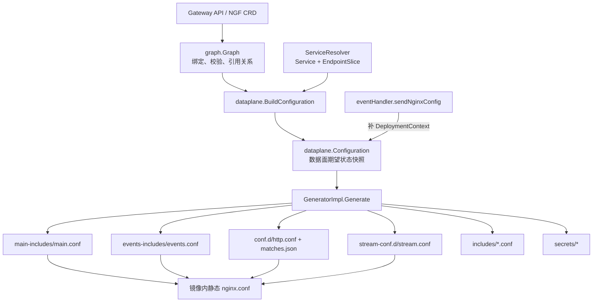

# BuildConfiguration 字段到 OSS NGINX 配置映射

> [!abstract] 核心结论
> `dataplane.Configuration` 不是可直接序列化的 `nginx.conf`，而是 Graph 与 NGINX 配置生成器之间的一份期望状态快照。它按 HTTP、HTTPS、四层代理、上游、证书、认证、策略和全局参数拆分语义；`GeneratorImpl.Generate` 再把这些字段多对一地汇聚到少数配置文件中。理解这些字段时，首先判断它属于“生成 NGINX 指令”“生成被指令引用的数据文件”“只参与生成决策”还是“OSS 不消费”，比逐层展开所有结构体更有效。

## 1. 读者、范围与证据边界

本文适合需要阅读或修改以下机制的开发者：

- `internal/controller/state/dataplane/configuration.go:BuildConfiguration`
- `internal/controller/state/dataplane/types.go:Configuration`
- `internal/controller/nginx/config/generator.go:GeneratorImpl.Generate`
- `internal/controller/nginx/config/` 下的 HTTP、stream、policy 和文件模板

本文负责解释：

- `BuildConfiguration` 构建的 24 个顶层字段分别表达什么语义；
- 每个字段被哪个生成阶段消费；
- OSS 数据面最终出现哪些文件和 NGINX 指令；
- 当前 kind 环境中哪些配置已经真实落盘；
- 当前 `coffee`、`tea` Route 被控制面处理后，按源码应生成什么配置形态。

本文不负责：

- 从 informer 事件完整追踪到 Graph 的所有构建细节，参见 [[21-Processor与EventHandler调用链分析]]；
- Agent 如何下载、落盘、校验、reload 和回 ACK，参见 [[09-文件拉取-FileService与配置文件交付]] 与 [[10-配置应用-ACK-状态回传]]；
- 详细解释每一种 Policy CRD 的完整语义；
- 把 NGINX Plus、OIDC、JWT 和 NGINX App Protect 当作当前 OSS 环境的可运行功能。

> [!info] 证据等级
> - **源码事实**：工作区 revision 为 `6169757fc0fb1d8057d92ee2c8d0eeba0e3de027`，分析和写入前工作区干净。
> - **测试支持**：2026-07-15 运行 `go test ./internal/controller/state/dataplane ./internal/controller/nginx/config`，全部通过。
> - **运行时观察**：读取了 `kind-kind` 中的 Gateway API 对象、NginxProxy、Pod、Service、EndpointSlice、控制面日志、数据面目录和 `nginx -T`。
> - **运行镜像边界**：镜像报告 revision `c26e5365...`、`dirty=true`；该 revision 到工作区 HEAD 之间，本文涉及目录没有 committed diff，但无法从 Git 证明镜像构建时的 dirty 内容。因此当前磁盘配置以 `nginx -T` 为最终事实，尚未落盘的 coffee/tea 配置明确标记为源码推导。

## 2. 职责边界：Configuration 是 IR，不是 nginx.conf

NGF 的实际分层是：



这里有三个必须分开的对象：

| 对象 | 所有者与生命周期 | 是否是源事实 |
| --- | --- | --- |
| `graph.Graph` | ChangeProcessor 根据 Kubernetes 缓存持续重建 | Kubernetes 资源的语义化派生状态 |
| `dataplane.Configuration` | 每次 `sendNginxConfig` 为一个 Gateway 构建的新值 | 数据面期望状态，不持久化，不代表已成功 reload |
| `/etc/nginx/**` | Generator 生成、Agent 应用到数据面 Pod | 当前 NGINX 文件事实；是否生效还需结合 `nginx -T`、reload 结果和 status |

> [!warning] 常见误区：Configuration 字段和文件不是一一对应
> 多个字段会追加到同一个 `http.conf`；一个字段也可能同时影响 `http.conf`、`stream.conf` 和 `secrets/*`。反过来，即使业务字段全部为空，生成器仍会输出健康检查、默认 404 server、内部 500/503 socket 和基础 map。

## 3. 构造与消费路径

### 3.1 BuildConfiguration 做什么

`ngf:internal/controller/state/dataplane/configuration.go:BuildConfiguration` 的主要阶段是：

1. GatewayClass 无效或 Gateway 为空时，返回最小默认配置。
2. 收集当前 Gateway 实际引用的 SnippetsFilter 和 RateLimitPolicy。
3. 构建 HTTP/stream 全局设置。
4. 从 Listener 和 Route 构建 `HTTPServers`、`SSLServers`、`TLSServers`、`TCPServers`、`UDPServers`。
5. 通过 `ServiceResolver` 把 backend Service 解析为 endpoint，构建 `Upstreams` 和 `StreamUpstreams`。
6. 从 Secret、ConfigMap 和认证资源构建密钥对、CA/CRL bundle 和 auth 文件。
7. 收集 Policy、Telemetry、Logging、Snippet、Plus/WAF 等横切配置。

函数返回 `Configuration`，不执行模板、不写文件，也不 reload NGINX。

### 3.2 DeploymentContext 为什么不在 BuildConfiguration 中赋值

`Configuration` 类型包含 `DeploymentContext`，但 `BuildConfiguration` 的复合字面量没有设置它。调用方随后补值：

```go
cfg := dataplane.BuildConfiguration(ctx, logger, gr, gw, h.cfg.serviceResolver, h.cfg.plus)
depCtx, getErr := h.getDeploymentContext(ctx)
cfg.DeploymentContext = depCtx
```

原因可以从职责边界直接读出：Graph/Gateway 可以构造路由期望状态，但安装 ID、集群 ID 和节点数属于控制面部署环境，不属于某个 Gateway API Graph 的路由语义。

### 3.3 Generator 如何汇聚字段

`ngf:internal/controller/nginx/config/generator.go:GeneratorImpl.Generate` 分两层处理：

- 先直接生成 `SSLKeyPairs`、`CertBundles`、`AuthSecrets`、WAF bundle 等数据文件；
- 再调用一组 execute 函数，把不同字段追加到 main、events、http、stream 和 include 文件。

execute 顺序如下：

```text
main config
events config
base HTTP config
HTTP/HTTPS servers
HTTP upstreams
HTTP split_clients
HTTP maps
telemetry
stream servers
stream upstreams
stream maps
NGINX Plus API
```

顺序不仅用于组织代码，也决定同一个目标文件中各段配置的排列。

## 4. 生成文件总览

镜像内静态 `/etc/nginx/nginx.conf` 不由 `Configuration` 生成。它负责 include 下列动态文件：

| 生成目标 | 主要字段 | NGINX context |
| --- | --- | --- |
| `/etc/nginx/main-includes/main.conf` | `Logging`、`Telemetry`、`WAF`、`MainSnippets`、`Policies` | main |
| `/etc/nginx/events-includes/events.conf` | `WorkerConnections` | events |
| `/etc/nginx/conf.d/http.conf` | `BaseHTTPConfig`、HTTP/SSL server、HTTP upstream、map、Telemetry、HTTP Policy | http |
| `/etc/nginx/conf.d/matches.json` | `HTTPServers`、`SSLServers` 中 method/header/query match | njs 预加载对象 |
| `/etc/nginx/stream-conf.d/stream.conf` | `BaseStreamConfig`、TCP/UDP/TLS server、stream upstream、SNI map | stream |
| `/etc/nginx/includes/*.conf` | Policy、Snippet、JWT authorization map | 被 main/http/server/location include |
| `/etc/nginx/secrets/*` | `SSLKeyPairs`、`CertBundles`、`AuthSecrets` | 被证书和认证指令引用 |
| `/etc/app_protect/bundles/*.tgz` | `WAF.WAFBundles` | NGINX App Protect，非当前 OSS 环境 |

## 5. 24 个顶层字段的精确映射

### 5.1 文件、证书和商业能力

| 字段 | 构建来源 | 最终输出或作用 | 当前 OSS kind |
| --- | --- | --- | --- |
| `CertBundles` | BackendTLSPolicy、前端客户端证书校验、OIDC/JWT remote CA、CRL、external auth TLS | CA 写为 `/etc/nginx/secrets/<id>.crt`，CRL 写为 `.pem`；由 `ssl_client_certificate`、`proxy_ssl_trusted_certificate`、`grpc_ssl_trusted_certificate`、`ssl_crl` 等引用 | 空，`secrets/` 无文件 |
| `SSLKeyPairs` | HTTPS/TLS Listener 的 certificateRef；Gateway backend 客户端证书 Secret | 证书和私钥合并写入 `/etc/nginx/secrets/ssl_keypair_<ns>_<secret>.pem`；HTTP/stream 中的 `ssl_certificate` 与 `ssl_certificate_key` 都引用该 PEM | 空，当前只有 HTTP Listener |
| `AuthSecrets` | AuthenticationFilter 引用的 basic/JWT Secret | 写入 `basic_auth_<ns>_<secret>` 或 `jwt_auth_<ns>_<secret>`；location 通过 `auth_basic_user_file` 或 `auth_jwt_key_file` 引用 | 空；Basic Auth 可用于 OSS，JWT 指令属于 Plus |
| `AuxiliarySecrets` | `Graph.PlusSecrets` 中 usage-report JWT、CA、客户端证书/私钥 | 仅 Plus 生成 `license.jwt`、`mgmt-ca.crt`、`mgmt-tls.crt/key` | OSS 不消费 |
| `OIDCProviders` | 有效 AuthenticationFilter OIDC 配置 | 在 `http.conf` 生成 `oidc_provider name { ... }`，location 生成 `auth_oidc name;` | 空；OIDC 属于 Plus 能力 |
| `DeploymentContext` | `eventHandler.getDeploymentContext`，不是 `BuildConfiguration` | Plus 写成 `/etc/nginx/main-includes/deployment_ctx.json`，供 `mgmt` block 的 `deployment_context` 使用 | OSS 不落盘 |
| `NginxPlus` | `plus=true` 与 NginxProxy Plus API allowlist | `AllowedAddresses != nil` 时生成 `/etc/nginx/conf.d/plus-api.conf`，包括 unix API socket 和 8765 dashboard/API server | 零值，文件不存在 |
| `WAF` | NginxProxy WAF 开关、Gateway/Route WAFPolicy bundle | main 加载 App Protect 模块；http 生成 enforcer/cookie seed；bundle 写入 `/etc/app_protect/bundles/*.tgz`；策略 include 生成 `app_protect_*` | 禁用；bundle 目录不存在 |

证书类配置的典型结果：

```nginx
ssl_certificate /etc/nginx/secrets/ssl_keypair_default_gateway-cert.pem;
ssl_certificate_key /etc/nginx/secrets/ssl_keypair_default_gateway-cert.pem;

proxy_ssl_server_name on;
proxy_ssl_verify on;
proxy_ssl_verify_depth 4;
proxy_ssl_name backend.example.com;
proxy_ssl_trusted_certificate /etc/nginx/secrets/cert_bundle_default_backend-ca.crt;
```

### 5.2 HTTP server、路由和 upstream

| 字段 | 它真正表示什么 | 最终输出 | 当前 OSS kind |
| --- | --- | --- | --- |
| `HTTPServers` | 非 TLS HTTP Listener 按端口、已接受 hostname、path 归并后的虚拟服务器 | `server { listen; server_name; location; }`、默认 404 server、`matches.json` | 只有一个 80 端口 default server，因为运行态尚未处理 Route |
| `SSLServers` | HTTPS Listener 对应的 HTTP 虚拟服务器 | `listen ... ssl`、证书/TLS 参数、location、前端 mTLS、421 检查 | 空 |
| `Upstreams` | HTTP/GRPC backend ServicePort 到 endpoint 池的去重结果 | `upstream <ns>_<svc>_<port> { random two least_conn; zone ...; server ...; keepalive ...; }` | 业务 upstream 为空；生成器仍固定加入 `invalid-backend-ref` |
| `BackendGroups` | 一条 Route rule 的 BackendRef 组合，不是 endpoint 池 | 多 backend 生成 `split_clients`；inference backend 还生成变量和 map；单 backend 通常不单独落配置 | 空 |
| `SSLListenerHostnames` | HTTPS 端口到原始 Listener hostname 列表 | 每端口生成 `$ssl_server_name` 和 `$host` 两个 `map`，HTTPS server 比较 listener ID，不同则 `return 421` | 空 |

> [!important] Upstream 与 BackendGroup 不可混用
> `Upstream` 回答“这个 ServicePort 当前有哪些 endpoint”；`BackendGroup` 回答“这条 Route rule 应在一个或多个 upstream 间如何选择”。一个 upstream 可被多个 backend group 引用；单 backend group 不需要 `split_clients`。

OSS HTTP upstream 的默认模板形态：

```nginx
upstream default_coffee_80 {
    random two least_conn;
    zone default_coffee_80 512k;
    server 10.244.0.4:8080;
    keepalive 16;
}
```

多 BackendRef 时，`BackendGroups` 额外生成：

```nginx
split_clients $request_id $group_default__route_rule0_pathRule0 {
    80.00% default_primary_80;
    20.00% default_canary_80;
}
```

location 再使用变量：

```nginx
proxy_pass http://$group_default__route_rule0_pathRule0;
```

### 5.3 四层流量

| 字段 | 它真正表示什么 | 最终输出 | 当前 OSS kind |
| --- | --- | --- | --- |
| `TCPServers` | TCPRoute 按 Listener 端口形成的四层虚拟服务器 | `server { listen <port>; proxy_pass <upstream-or-variable>; }` | 空 |
| `UDPServers` | UDPRoute 按 Listener 端口形成的四层虚拟服务器 | `server { listen <port> udp; proxy_pass ...; }` | 空 |
| `TLSServers` | TLSRoute 的 SNI 路由；`SSL=nil` 表示 passthrough，非 nil 表示 terminate | 前置 `ssl_preread` server、SNI map、unix socket server；Terminate socket 还生成证书和 backend TLS 校验 | 空 |
| `StreamUpstreams` | TLS/TCP/UDP backend 的 ServicePort endpoint 池 | `stream` context 的 `upstream`，OSS zone 默认 `512k`，多 backend endpoint 可带 weight | 空 |
| `BaseStreamConfig` | 所有 stream server 共用的全局设置，目前主要是 ExternalName DNS resolver | `resolver ...; resolver_timeout ...;` | 空；只保留固定 connection-closed socket server |

TCP 的简单形态：

```nginx
upstream default_database_5432 {
    random two least_conn;
    zone default_database_5432 512k;
    server 10.244.0.20:5432;
}

server {
    listen 5432;
    listen [::]:5432;
    proxy_pass default_database_5432;
}
```

TLS passthrough 的核心结构不是 HTTP `server_name`，而是：

```nginx
map $ssl_preread_server_name $dest443 {
    hostnames;
    api.example.com unix:/var/run/nginx/api.example.com-443.sock;
    default unix:/var/run/nginx/connection-closed-server.sock;
}

server {
    listen 443;
    pass $dest443;
    ssl_preread on;
}
```

### 5.4 全局设置和横切能力

| 字段 | 主要子字段 | 最终输出 | 当前 OSS kind |
| --- | --- | --- | --- |
| `BaseHTTPConfig` | HTTP2、IPFamily、readiness、DNS、gzip、real IP、server tokens、Gateway backend cert、Policy、Snippet、JWT AuthZ | 主要进入 `http.conf`，部分设置还影响所有 HTTP/HTTPS/stream server 的 listen 和 proxy headers | 见 [[#6. 当前 kind 中已真实落盘的配置]] |
| `Logging` | `ErrorLevel`、`ErrorLogFormat`、`AccessLog` | main 中 `error_log stderr ...`；http 中可生成 `log_format`、`access_log` 或 `access_log off` | `error_log stderr info;`；没有自定义 HTTP access log 指令 |
| `Policies` | Gateway 上有效且适用于当前 Gateway 的 Policy | 传入 main-context policy generator；具体策略生成 `/etc/nginx/includes/*.conf` 并被 include | 空 |
| `MainSnippets` | 当前 Gateway 实际引用的 main-context SnippetsFilter | 写为 `/etc/nginx/includes/SnippetsFilter_main_<ns>_<name>.conf`，由 `main.conf` include | 空 |
| `Telemetry` | OTLP endpoint、service name、batch、ratio、span attributes | main 加载 `ngx_otel_module.so`；http 生成 `otel_exporter`、`otel_service_name`、采样 `split_clients`；ObservabilityPolicy 在 location 生成 tracing 指令 | 空 |
| `WorkerConnections` | 每 worker 最大并发连接数 | `/etc/nginx/events-includes/events.conf` 中的 `worker_connections N;` | 默认 `1024` |

`Policies` 只是 Gateway main-context 的入口。完整策略放置分散在多层：

| 策略目标 | IR 中的位置 | 典型 NGINX context |
| --- | --- | --- |
| Gateway main | `Configuration.Policies` | main |
| Gateway HTTP 全局 | `BaseHTTPConfig.Policies` | http |
| Gateway/Listener server | `VirtualServer.Policies` | server |
| Route rule/path | `PathRule.Policies` | location |
| Service | `Upstream.Policies` | upstream |

策略生成器不会把所有内容直接塞入 `http.conf`。它通常写成 `/etc/nginx/includes/<PolicyKind>_<namespace>_<name>*.conf`，然后在正确 context 生成一行 `include`，避免同一策略被多个 server/location 引用时重复写文件。

## 6. 当前 kind 中已真实落盘的配置

### 6.1 Kubernetes 输入事实

2026-07-15 观察到：

```text
context: kind-kind
GatewayClass: nginx, Accepted=True
Gateway: default/gateway, Programmed=True
Listener: HTTP :80, hostname=*.example.com, IP family=dual
NginxProxy: nginx-gateway/nginx-gateway-proxy-config
Data plane: default/gateway-nginx
NGINX: OSS 1.31.2
```

NginxProxy 只显式配置了双栈和 Kubernetes Deployment/Service 形态，没有设置 DNS resolver、gzip、real IP、logging、workerConnections、TLS、Policy、Telemetry 或 WAF。

因此当前 `BaseHTTPConfig` 的有效默认值是：

```yaml
HTTP2: true
IPFamily: dual
NginxReadinessProbePort: 8081
NginxReadinessProbePath: /readyz
ServerTokens: off
```

### 6.2 调试现场导致配置快照滞后

> [!warning] 当前 nginx -T 不包含 coffee/tea Route
> 控制面 Pod 挂载了 `dlv` 临时容器，readiness 持续超时。控制面最后一次成功配置日志停在 `09:53:32`，而 `coffee`、`tea` HTTPRoute 创建于 `09:53:55`。两条 Route 没有 status，Gateway 仍为 `attachedRoutes: 0`。所以当前磁盘配置是“Gateway 已处理、Route 尚未处理”的旧快照，不能拿它证明 coffee/tea 已经渲染。

### 6.3 nginx -T 的真实关键输出

```nginx
# /etc/nginx/main-includes/main.conf
error_log stderr info;

# /etc/nginx/events-includes/events.conf
worker_connections 1024;

# /etc/nginx/conf.d/http.conf
http2 on;

server {
    listen 8081;
    listen [::]:8081;

    location = /readyz {
        access_log off;
        return 200;
    }
}

server_tokens off;

server {
    listen 80 default_server;
    listen [::]:80 default_server;
    default_type text/html;
    return 404;
}

upstream invalid-backend-ref {
    server unix:/var/run/nginx/nginx-500-server.sock;
}

# /etc/nginx/stream-conf.d/stream.conf
server {
    listen unix:/var/run/nginx/connection-closed-server.sock;
    return "";
}
```

同时观察到：

```text
/etc/nginx/conf.d/matches.json = {}
/etc/nginx/secrets/             为空
/etc/nginx/includes/            为空
/etc/app_protect/bundles        不存在
```

这些输出与字段的对应关系：

| 真实指令/文件 | Configuration 来源 | 备注 |
| --- | --- | --- |
| `error_log stderr info` | `Logging` | 默认 error level 是 `info` |
| `worker_connections 1024` | `WorkerConnections` | 默认值 1024 |
| `http2 on` | `BaseHTTPConfig.HTTP2` | 默认启用，属于 http 全局设置 |
| 双栈 readiness server | `BaseHTTPConfig.IPFamily` 与 readiness 字段 | 默认端口 8081、路径 `/readyz` |
| `server_tokens off` | `BaseHTTPConfig.ServerTokens` | 未配置时默认 off |
| 80 端口 default 404 | `HTTPServers` | Listener 存在但无已处理 Route 时的默认 server |
| `invalid-backend-ref` | 生成器固定脚手架 | 不表示集群当前存在无效 BackendRef |
| connection-closed socket | stream 生成器固定脚手架 | 即使没有四层 Route 也会生成 |
| `{}` matches 文件 | `HTTPServers`/`SSLServers` 的匹配派生结果 | 当前无业务 route match |

## 7. coffee/tea 被处理后的源码推导

> [!example] 证据等级：源码 + Kubernetes 输入推导，尚非当前磁盘事实
> 本节使用当前 HTTPRoute、Service、EndpointSlice 和工作区源码推导目标配置。只有控制面恢复处理、Agent 成功应用并由 `nginx -T` 观察到后，才能升级为运行时事实。

当前 Kubernetes 输入是：

```text
default/coffee HTTPRoute:
  host cafe.example.com
  PathPrefix /coffee
  backend default/coffee:80

default/tea HTTPRoute:
  host cafe.example.com
  Exact /tea
  backend default/tea:80

default/coffee:80 -> 10.244.0.4:8080
default/tea:80    -> 10.244.0.7:8080
```

### 7.1 Upstreams

`Upstreams` 应包含两个去重后的 endpoint 池：

```nginx
upstream default_coffee_80 {
    random two least_conn;
    zone default_coffee_80 512k;
    server 10.244.0.4:8080;
    keepalive 16;
}

upstream default_tea_80 {
    random two least_conn;
    zone default_tea_80 512k;
    server 10.244.0.7:8080;
    keepalive 16;
}
```

这里使用 Pod IP 和目标端口，而不是 Service ClusterIP 和 Service port。`ServiceResolver` 从 EndpointSlice 得到 `10.244.0.x:8080`，upstream 名称仍来自 BackendRef 的 `<namespace>_<service>_<servicePort>`。

### 7.2 HTTPServers

通配 Listener `*.example.com` 接受 `cafe.example.com` 后，生成的是具体 route hostname 的 server：

```nginx
server {
    listen 80;
    listen [::]:80;
    server_name cafe.example.com;

    location /coffee/ {
        proxy_set_header Host "$gw_api_compliant_host";
        proxy_set_header X-Forwarded-For "$proxy_add_x_forwarded_for";
        proxy_set_header X-Real-IP "$remote_addr";
        proxy_set_header X-Forwarded-Proto "$scheme";
        proxy_set_header X-Forwarded-Host "$host";
        proxy_set_header X-Forwarded-Port "$server_port";
        proxy_set_header Upgrade "$http_upgrade";
        proxy_set_header Connection "$connection_keepalive";
        proxy_pass http://default_coffee_80;
    }

    location = /coffee {
        # 与 /coffee/ 使用相同的 proxy headers
        proxy_pass http://default_coffee_80;
    }

    location = /tea {
        # 使用相同的默认 proxy headers
        proxy_pass http://default_tea_80;
    }

    location = / {
        return 404;
    }
}
```

这里有三个容易忽略的生成规则：

1. `PathPrefix /coffee` 末尾没有 `/`，NGF 会生成 `location /coffee/` 和 `location = /coffee`，保证前缀根本身也匹配。
2. `Exact /tea` 生成 `location = /tea`。
3. 没有 Route 覆盖 `/` 时，具体 hostname server 自动补 `location = / { return 404; }`。

### 7.3 matches.json 为什么仍然应为 `{}`

两条 Route 都只有 path match，没有 method、header 或 query parameter 条件。path 由原生 NGINX location 选择，不需要 NJS 二次判断，所以 `matches.json` 仍应为空对象。

如果加入复杂匹配，外部 location 才会变成：

```nginx
location /coffee {
    set $match_key 0_0;
    js_content httpmatches.redirect;
}
```

`matches.json` 同时保存 `$match_key` 对应的 method/header/query 条件以及内部 location 目标。

## 8. BaseHTTPConfig 的子字段怎么落地

`BaseHTTPConfig` 是最容易产生“结构体套结构体”阅读压力的字段。可以按五组理解。

### 8.1 监听和基础行为

| 子字段 | NGINX 结果 |
| --- | --- |
| `HTTP2` | `http2 on;`；false 时省略 |
| `IPFamily` | 控制所有普通 server 是否生成 IPv4、IPv6 或双栈 `listen` |
| `NginxReadinessProbePort` | readiness server 的 `listen` 端口 |
| `NginxReadinessProbePath` | `location = /readyz` |
| `ServerTokens` | `server_tokens off/on/build/"custom";` |
| `DisableSNIHostValidation` | true 时不生成 HTTPS 421 检测 map 和 server `if` |

### 8.2 DNS 和压缩

```nginx
resolver 10.96.0.10 valid=30s ipv6=off;
resolver_timeout 5s;

gzip on;
gzip_comp_level 5;
gzip_min_length 1024;
gzip_buffers 16 8k;
gzip_http_version 1.1;
gzip_types "text/plain" "application/json";
gzip_proxied any;
gzip_vary on;
```

`DNSResolver` 主要服务 ExternalName backend；`Compression != nil` 才生成 `gzip on`，各可选字段只在有值时输出。

### 8.3 原始客户端 IP

Proxy Protocol 模式：

```nginx
listen 80 proxy_protocol;
set_real_ip_from 10.0.0.0/8;
real_ip_header proxy_protocol;
real_ip_recursive on;
```

X-Forwarded-For 模式：

```nginx
set_real_ip_from 10.0.0.0/8;
real_ip_header X-Forwarded-For;
real_ip_recursive on;
```

`RewriteClientIPSettings` 还会影响共享 socket 形式的 TLS stream server；普通 TCP/UDP server 不复用 HTTP 的 real-IP 配置。

### 8.4 Gateway backend 客户端证书

`GatewaySecretID` 不是 Listener 用来终止前端 TLS 的服务端证书，而是 Gateway 访问 TLS backend 时使用的客户端证书：

```nginx
proxy_ssl_certificate /etc/nginx/secrets/ssl_keypair_default_gateway-client.pem;
proxy_ssl_certificate_key /etc/nginx/secrets/ssl_keypair_default_gateway-client.pem;
```

相同设置也会进入 stream context，以支持 TLSRoute Terminate 后继续通过 TLS 连接 backend。

### 8.5 Policy、Snippet 和 JWT AuthZ

这些配置先生成独立文件，再 include 到 HTTP context：

```nginx
include /etc/nginx/includes/SnippetsFilter_http_default_example.conf;
include /etc/nginx/includes/RateLimitPolicy_default_rate_internal_http.conf;
include /etc/nginx/includes/default_auth_rule_0_require_all.conf;
include /etc/nginx/includes/default_auth_authz_require_all.conf;
```

JWT authorization 的 claim 提取本身会在 http context 生成：

```nginx
auth_jwt_claim_set $default_auth_claim_realm_access_roles realm_access roles;
```

location 再使用最终聚合变量：

```nginx
auth_jwt_require $default_auth_authz_require_all;
```

JWT/OIDC 指令属于 Plus；当前 OSS 环境不会合法地产生这些配置。

## 9. 失败路径与降级行为

| 情况 | IR/生成器行为 | 可观察结果 |
| --- | --- | --- |
| GatewayClass 无效或 Gateway 为空 | `GetDefaultConfiguration`，不构建业务 server/upstream | 只保留最小基础配置 |
| Gateway 无 Listener 或 Gateway 无效 | handler 跳过 config generation | status 入队更新，不推业务配置 |
| HTTP backend 暂时没有 endpoint | `Upstream.ErrorMsg` 记录解析错误或空 endpoint；HTTP upstream 指向内部 503 socket | 请求得到 503；控制面日志记录 endpoint 解析问题 |
| BackendRef 无效、无 backend 或总 weight 为 0 | location/backend group 使用 `invalid-backend-ref` | 请求通过内部 socket 得到 500 |
| stream upstream 无 endpoint | 对应 TCP/UDP/TLS stream server 被跳过 | 端口可能不监听，日志可见跳过原因 |
| HTTPS/TLS 默认流量无匹配 | 默认 TLS server 或 socket 生成 `ssl_reject_handshake on`，或 SNI map 指向 connection-closed socket | TLS 握手被拒绝或连接关闭 |
| WAF bundle pending 且 fail-open 未启用 | handler 在 `BuildConfiguration` 前 withholding config push | status 暴露 pending，不下发不完整配置 |
| 模板输入绕过验证 | Generator 不重新做完整安全校验 | `nginx -t` 失败，Agent/reload 状态返回控制面 |

> [!note] ErrorMsg 不直接渲染成注释
> `Upstream.ErrorMsg` 是控制面状态/诊断数据。HTTP 生成器根据 endpoint 是否为空选择 503 socket；它不会把 Go error 字符串直接拼入 NGINX 配置。

## 10. 为什么 Configuration 看起来“字段过多”

以下是根据代码边界作出的高置信度设计推断，不是项目作者的显式历史说明：

1. **把 Kubernetes API 与 NGINX 模板解耦**：模板不需要理解 `HTTPRoute`、`Service`、`ReferenceGrant` 或 condition。
2. **把 L7 与 L4 明确分开**：HTTP server/upstream 和 stream server/upstream 的 NGINX 语义不同，强行复用会产生大量条件分支。
3. **把敏感字节与配置文本分开**：证书、auth 文件和 WAF bundle 通过文件 metadata 下发，不嵌进 `nginx.conf`。
4. **让 Policy 按 context 扩展**：同一个 Policy 接口可以选择生成 main/http/server/location 中的一部分，而不扩大一个巨型模板。
5. **支持 OSS 与 Plus 共用大部分控制面**：Plus 专用字段在 OSS 中保持零值，生成器通过 `plus` 或 nil 判断不落盘。

代价是 `Configuration` 顶层字段很多，而且部分字段只是生成决策输入。这个代价换来了清晰的消费边界和可独立测试的模板阶段。

## 11. 二开与调试提示

### 11.1 新增 Configuration 字段时要同步什么

至少检查以下位置：

1. `internal/controller/state/dataplane/types.go`：IR 类型和字段注释。
2. `internal/controller/state/dataplane/configuration.go`：Graph/API 到 IR 的构造、默认值、排序和去重。
3. `internal/controller/nginx/config/*.go`：转换为模板专用结构的 adapter。
4. `internal/controller/nginx/config/*_template.go`：最终指令与条件。
5. `internal/controller/state/validation`：进入 IR 前的字段安全校验。
6. `configuration_test.go` 与相应 config generator/template test。
7. NginxProxy/API schema、CRD、文档和示例，如果字段来自用户 API。
8. OSS/Plus/WAF 能力门控，避免 OSS 收到未知商业指令。

不要直接修改镜像中的静态 `/etc/nginx/nginx.conf` 来实现某个 Gateway API 字段；正常扩展点是动态 include 的生成阶段。

### 11.2 建议的字段调试顺序

```text
1. kubectl get <resource> -o yaml
2. 检查 Gateway/Route/Policy status 与 observedGeneration
3. 控制面断点查看 graph.Gateway / graph.Route
4. 在 BuildConfiguration 返回处查看 Configuration 对应字段
5. 在 GeneratorImpl.Generate 查看 agent.File 的路径、hash、内容
6. 检查控制面是否广播新 configVersion
7. 数据面 find /etc/nginx + nginx -T
8. 检查 reload result、Agent ACK 和 Gateway Programmed status
```

如果 `Configuration` 已正确而 `nginx -T` 仍旧，问题通常位于生成器之后：文件 hash 去重、Broadcaster、Agent 下载/应用或当前调试进程停住。参见 [[22-DeploymentBroadcaster广播器机制与全链路]]。

### 11.3 当前 kind 现场的验证命令

```bash
kubectl config current-context
kubectl get gatewayclass,gateway,httproute -A -o wide
kubectl get nginxproxy.gateway.nginx.org -A -o yaml
kubectl get svc,endpointslice -A -o wide
kubectl logs -n nginx-gateway deploy/nginx-gateway-nginx-gateway-fabric --tail=300
kubectl exec -n default deploy/gateway-nginx -c nginx -- nginx -T
kubectl exec -n default deploy/gateway-nginx -c nginx -- \
  sh -c 'find /etc/nginx -maxdepth 3 -type f -print | sort'
```

运行现场可能变化，Pod 名称尽量使用 `deploy/<name>`，不要把本文记录的 Pod IP 当作稳定配置。

## 12. 最小心智模型

记住四句话即可：

1. `*Servers` 决定“监听在哪里，有哪些 server/location”。
2. `*Upstreams` 决定“proxy_pass 后面有哪些 endpoint”。
3. `SSLKeyPairs`、`CertBundles`、`AuthSecrets` 决定“额外写哪些敏感数据文件”。
4. `Base*Config`、`Logging`、`Telemetry`、`Policies`、`Snippets` 决定“在 main/http/stream/server/location 周围增加哪些横切指令”。

再补一个最重要的例外：`BackendGroups` 不是 upstream，它描述一条 Route rule 如何在一个或多个 upstream 之间选择。

## 13. 源码、测试与运行时证据索引

### 13.1 源码入口

| 主题 | 证据 |
| --- | --- |
| `Configuration` 24 个字段 | `ngf:internal/controller/state/dataplane/types.go:Configuration` |
| IR 构建入口 | `ngf:internal/controller/state/dataplane/configuration.go:BuildConfiguration` |
| 默认 HTTP/stream/logging/worker 设置 | `ngf:internal/controller/state/dataplane/configuration.go:buildBaseHTTPConfig`、`buildBaseStreamConfig`、`buildLogging`、`buildWorkerConnections` |
| server 与 upstream 构造 | `ngf:internal/controller/state/dataplane/configuration.go:buildServers`、`buildUpstreams`、`buildStreamUpstreams` |
| Configuration 调用与 DeploymentContext 补值 | `ngf:internal/controller/handler.go:eventHandlerImpl.sendNginxConfig` |
| 文件生成总入口 | `ngf:internal/controller/nginx/config/generator.go:GeneratorImpl.Generate` |
| main/events 模板 | `ngf:internal/controller/nginx/config/main_config_template.go` |
| HTTP 全局模板 | `ngf:internal/controller/nginx/config/base_http_config_template.go` |
| HTTP/HTTPS server 与 location | `ngf:internal/controller/nginx/config/servers.go`、`servers_template.go` |
| HTTP/stream upstream | `ngf:internal/controller/nginx/config/upstreams.go`、`upstreams_template.go` |
| TCP/UDP/TLS server | `ngf:internal/controller/nginx/config/stream_servers.go`、`stream_servers_template.go` |
| weighted backend 和 request mirror | `ngf:internal/controller/nginx/config/split_clients.go` |
| HTTPS 421、CORS、inference、TLS SNI map | `ngf:internal/controller/nginx/config/maps.go` |
| Policy/Snippet/AuthZ include | `ngf:internal/controller/nginx/config/includes.go`、`policies/` |
| Plus API 与 mgmt | `ngf:internal/controller/nginx/config/plus_api.go`、`main_config.go:generateMgmtFiles` |

### 13.2 测试证据

```bash
go test ./internal/controller/state/dataplane ./internal/controller/nginx/config
```

重点测试文件：

- `ngf:internal/controller/state/dataplane/configuration_test.go`
- `ngf:internal/controller/nginx/config/generator_test.go`
- `ngf:internal/controller/nginx/config/base_http_config_test.go`
- `ngf:internal/controller/nginx/config/main_config_test.go`
- `ngf:internal/controller/nginx/config/servers_test.go`
- `ngf:internal/controller/nginx/config/upstreams_test.go`
- `ngf:internal/controller/nginx/config/stream_servers_test.go`
- `ngf:internal/controller/nginx/config/maps_test.go`

### 13.3 运行时证据

本次观察包括：

- `GatewayClass nginx`、`Gateway default/gateway`、`HTTPRoute coffee/tea` 的 YAML 和 status；
- `NginxProxy nginx-gateway-proxy-config` 的 YAML；
- data-plane Deployment 的镜像、volume mount 和 readiness；
- coffee/tea Service 与 EndpointSlice；
- 控制面日志时间线与 Delve 临时容器状态；
- `nginx -v`、`nginx -V`、`nginx -T`；
- `/etc/nginx` 动态目录和 `/etc/app_protect/bundles` 是否存在。

没有记录 kubeconfig、Secret 内容、service-account token 或任何私钥。

## 14. 关联笔记

- 上游总览：[[11-GatewayAPI到NGINX配置生成链路]]
- Cafe 输入和流量路径：[[12-Cafe示例端到端溯源]]
- 配置生成后的广播：[[22-DeploymentBroadcaster广播器机制与全链路]]
- 数据面文件下载：[[09-文件拉取-FileService与配置文件交付]]
- Agent 应用与 ACK：[[10-配置应用-ACK-状态回传]]
- 调试命令与断点：[[18-调试手册-日志-断点-常用命令]]
- Go 模板机制：[[53-text-template与配置生成]]
- Graph 到 Dataplane 分层转换：[[65-Graph到Dataplane再到NGINX]]
