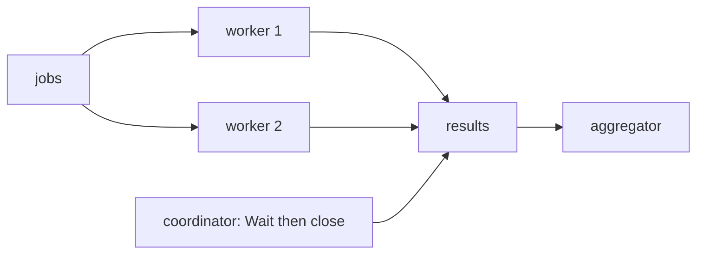

# 47 WaitGroup 与并发 fan-out/fan-in

> [!abstract]
> WaitGroup 只证明“一组任务已经返回”，不传结果、不聚合错误、不取消任务。Go 1.25 引入 `WaitGroup.Go`，把计数与 goroutine 启动绑定；完整 fan-out/fan-in 仍要单独设计并发上限、结果关闭者、错误和取消。

## 学习目标与前置

- 掌握 `Go`、`Add/Done`、`Wait`、复用与内存同步；
- 理解 Go 1.25+ `WaitGroup.Go` 的前置与 panic 限制；
- 构建有界 fan-out、fan-in、错误取消和 coordinator close；
- 追踪 NGF Broadcaster 对 listener 的并发握手。

前置：[[40-goroutine启动与退出责任]]、[[41-channel方向与所有权]]、[[44-context传递与取消]]。

## 1. 从零语法

Go 1.25+ 首选：

**说明性示例：**

```go
var wg sync.WaitGroup
wg.Go(func() {
	doWork()
})
wg.Wait()
```

`Go` 先把任务加入 WaitGroup，再在新 goroutine 调 f；f 返回时自动移除。`f` 必须不 panic。WaitGroup 为空时，`Go` 必须发生在 `Wait` 之前；非空时，任务内部可继续 `wg.Go` 子任务。

兼容旧 Go/跟踪非 goroutine 任务：

**说明性示例：**

```go
wg.Add(1) // 必须在启动前
go func() {
	defer wg.Done()
	doWork()
}()
```

先 go 再 Add 有竞态：子任务可能 Done 使计数为负，或 Wait 看到零提前返回。

## 2. 精确合同

- counter 变成负数会 panic；
- Wait 阻塞到 counter 为零；
- `Done`/f 返回 synchronizes-before 它解除的 `Wait` 返回；
- 首次使用后不可复制；通常传 `*sync.WaitGroup`；
- 可复用，但下一批 `Go/Add` 必须在上一批所有 Wait 返回后；
- Wait 不知道任务为何返回，也不会主动停止任务；
- `WaitGroup.Go` 不回收 panic，文档要求 f 不 panic。

> [!warning]
> WaitGroup 不是 goroutine 池。循环 100 万次 `wg.Go` 仍可能创建 100 万 goroutine；并发上限需 worker pool、semaphore 或分批。

## 3. fan-out 与 fan-in

fan-out：把独立任务分给多个并发执行单元。fan-in：把多个结果流合成一个结果流/汇合点。

关键关闭关系：workers 是 results 的发送者；只有 coordinator 在 `wg.Wait()` 后能证明所有发送完成，因此由它 close(results)。consumer 不能 close。



## 4. 可独立运行 demo：有界 workers + 首错取消

```go
package main

import (
	"context"
	"errors"
	"fmt"
	"sync"
)

type result struct {
	value int
	err   error
}

func worker(ctx context.Context, jobs <-chan int, out chan<- result) {
	for job := range jobs {
		var r result
		if job < 0 {
			r.err = errors.New("negative job")
		} else {
			r.value = job * job
		}
		select {
		case out <- r:
		case <-ctx.Done():
			return
		}
	}
}

func run(parent context.Context, input []int, workers int) error {
	ctx, cancel := context.WithCancel(parent)
	defer cancel()
	jobs := make(chan int)
	results := make(chan result)

	var wg sync.WaitGroup
	for range workers {
		wg.Go(func() { worker(ctx, jobs, results) })
	}
	go func() {
		defer close(jobs)
		for _, job := range input {
			select {
			case jobs <- job:
			case <-ctx.Done():
				return
			}
		}
	}()
	go func() {
		wg.Wait()
		close(results)
	}()

	for r := range results {
		if r.err != nil {
			cancel()
			return r.err
		}
		fmt.Println(r.value)
	}
	return nil
}

func main() {
	fmt.Println("error:", run(context.Background(), []int{2, -1, 3}, 2))
}
```

```bash
gofmt -w main.go && go run main.go
# 可能先打印 4 或 9；最后 error: negative job
```

结果顺序不确定。首错后 cancel 解除 feeder/worker 的潜在发送阻塞；函数返回时 defer cancel 再保证释放。demo 不等待 coordinator 后才返回，但所有任务都能观察取消；若 API 要严格 shutdown，应在返回前额外 Wait。

## 5. 常用模式

### 模式一：独立任务全部完成

循环 `wg.Go`，任务写各自预分配索引，Wait 后统一读取。不同 goroutine 写不同元素可行，但 slice header 不得并发 append。

### 模式二：结果 channel + coordinator close

workers 发，单独 goroutine Wait 后 close，consumer range。避免 consumer 一边消费一边同步 Wait 形成满 results buffer 死锁。

### 模式三：固定 worker pool

worker 数决定并发，jobs channel 决定等待容量。适合大量任务；关闭 jobs 使 workers range 退出。

### 模式四：首错取消

第一个错误记录后 cancel siblings；需防止多个错误发送阻塞。可用容量 1 error channel、`sync.Once`，或标准 `errgroup`（项目依赖允许时）。

### 模式五：全错聚合

任务必须全部尝试时，不在首错取消；每任务写独立槽或由单一 collector append，最后 `errors.Join`。不要多 goroutine 并发 append 同一 slice。

## 6. WaitGroup.Go 的 panic 边界

文档明确 `f must not panic`。需要把不可信插件 panic 转 error 时，应在 f 内部同一 goroutine defer recover，并定义错误传递；外层 goroutine 无法 recover 另一个 goroutine 的 panic。

不要仅因 `wg.Go` 会在 wrapper defer 中减少计数就认为 panic 被支持：进程仍会因未恢复 panic 终止，API 合同也明确禁止。

## 7. NGF：Broadcaster fan-out/fan-in

`DeploymentBroadcaster.publisher` 在 RLock 下复制 listener snapshot，解锁后：

**NGF 缩写源码：**

```go
var wg sync.WaitGroup
for _, channels := range currentListeners {
	wg.Go(func() {
		// send message or listener/global cancel
		// wait response or listener/global cancel
	})
}
wg.Wait()
```

fan-out 单元不是计算，而是“一位 listener 的发送 + ACK 握手”。fan-in 没有 results channel；每个 worker 无返回值，`wg.Wait` 是屏障，之后 publisher 给 `doneCh` 发一个批次完成信号。

### 正确性路径

1. snapshot 固定当前批次参与者，锁外启动；
2. `wg.Go` 避免 Add 与 go 分离；
3. 每 worker 两个阻塞阶段都监听 listener/global context；
4. listener 不 ACK 时，退订或 shutdown 仍使 worker 返回；
5. Wait 解除后 publisher 才发送 `doneCh`，从而允许 `Send` 进入最后采样；
6. `Send` 最后返回的是 live listener map 的 `len>0`，不是 snapshot/ACK 结果：空 snapshot 后并发 subscribe 可得 true，已 ACK snapshot 后并发 unsubscribe 可得 false。

### 错误与状态边界

ACK channel 类型是 `struct{}`，只表达完成，不携带成功/错误；worker 还可能因取消而返回。`Send` 的 bool 只是完成屏障后的 live registry 采样，不能证明本批交付或 ACK。源码注释称其表示 listener received/responded，与实现存在语义漂移风险。若新项目需要每 listener 结果，必须定义 result 类型、聚合规则和取消策略，不能只复制 WaitGroup。

`broadcast_test.go` 的 multiple listeners 证明正常路径在各测试 listener ACK 后完成；cancel/shutdown 测试证明 worker 也可不经 ACK 返回，使 Wait 不被失联 listener 永久卡住。它们不能把 `Send` bool 提升为本批交付证明。

## 8. 失败与误区

- goroutine 内 Add：Wait 可能提前返回；
- 忘 Done：Wait 永久阻塞；
- 重用时上一轮 Wait 未返回就 Add 新批次；
- 复制 WaitGroup；
- workers 发 results，但无人并发消费，buffer 满后 Wait 死锁；
- coordinator 以外 close results，撞并发 send；
- 无界 `wg.Go` 当 worker pool；
- 首错返回却不 cancel，发送者泄漏；
- 期待 WaitGroup 返回 error 或恢复 panic。

## 9. 迁移边界

可直接迁移：Go 1.25+ `wg.Go`、snapshot fan-out、Wait 后单一 close、每个 worker 可取消。

有条件迁移：Broadcaster 的“每个 snapshot worker 经 ACK 或取消后返回”屏障适合该生命周期合同；若要求全部成功、quorum 或逐 listener 结果，需显式结果类型与策略。

不要照搬：任务量大时一任务一 goroutine；需要错误语义时裸 WaitGroup 不够。

## 10. 练习与答案

1. 为什么 Add 要在 go 前？——防 Done 负数和 Wait 提前返回；`wg.Go` 绑定了两步。
2. 谁 close results？——能在 Wait 后证明无发送者的 coordinator。
3. Wait 会 cancel worker 吗？——不会，只等待。
4. Broadcaster 的 worker 返回什么？——无值；完成由 Wait 汇合，取消只解除阻塞。
5. `wg.Go` 中 f 能 panic 吗？——合同要求不能；需要在同 goroutine 内恢复并转 error。

## 源码证据索引

- **版本事实** Go 1.26.0 `sync.WaitGroup` 文档；`WaitGroup.Go` 自 Go 1.25
- **源码事实** `ngf:internal/controller/nginx/agent/broadcast/broadcast.go:publisher`
- **测试佐证** `ngf:internal/controller/nginx/agent/broadcast/broadcast_test.go`
- **关联机制** [[41-channel方向与所有权]]、[[44-context传递与取消]]

下一步：[[48-atomic-race-detector与并发测试]]、[[49-EventLoop批处理与状态所有权]]。
