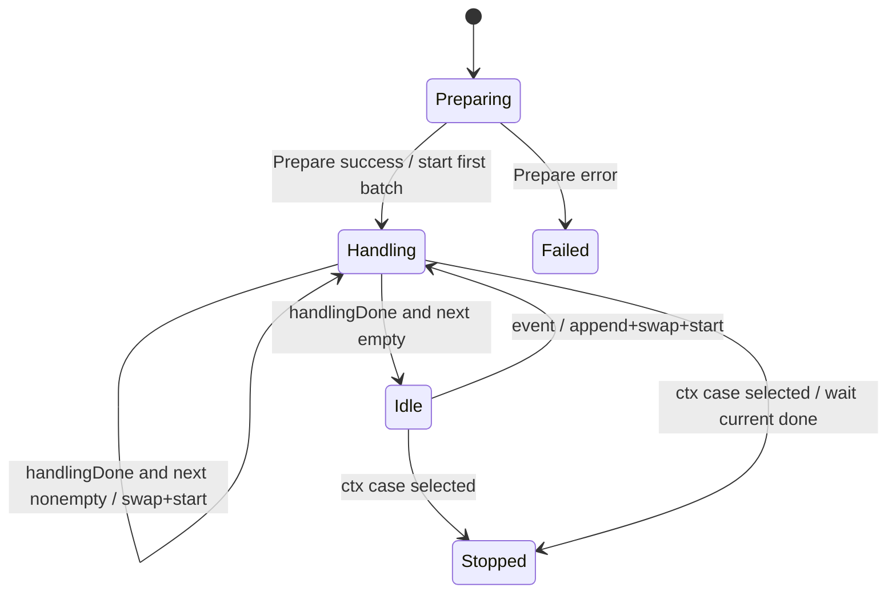

# 49 EventLoop、批处理与状态所有权

> [!abstract]
> EventLoop 让一个 goroutine 独占可变调度状态，通过消息串行决定批次边界；慢 handler 在另一 goroutine 只读 currentBatch，同时新事件写入 nextBatch。双缓冲不是“两批并行处理”：NGF 明确保证任一时刻最多一个 handler batch。

## 学习目标与前置

- 从零建立单 goroutine 状态所有权模型；
- 理解双缓冲 slice 的交换、别名与“最多一批处理中”不变量；
- 追踪初始全量批次、增量合批、shutdown 等待和 prepare 失败；
- 判断何时迁移 event loop、何时使用 Mutex/worker pool。

前置：[[12-切片共享与防御性复制]]、[[43-select多路复用]]、[[47-WaitGroup与fan-out-fan-in]]。

## 1. EventLoop 是什么

一个 goroutine循环接收事件并独占状态：

**说明性示例：**

```go
for {
	select {
	case event := <-events:
		state = reduce(state, event)
	case <-ctx.Done():
		return
	}
}
```

只要其他 goroutine 不直接读写 `state`，就无需为每次转换加 mutex。顺序由 channel 接收确定；复杂不变量集中在一个 switch/select 中。

EventLoop 不自动带来并行吞吐。慢操作若直接在 loop 内执行，会阻止接收新事件；NGF 把当前 batch 交给一个 handler goroutine，loop 继续收集 nextBatch，但用 `handling` 保证不启动第二个 handler。

## 2. 双缓冲心智模型

```go
currentBatch EventBatch // handler 只读
nextBatch    EventBatch // event loop 独占 append

currentBatch, nextBatch = nextBatch, currentBatch
nextBatch = nextBatch[:0]
```

两个 slice header 轮换指向两块 backing array：handler 读取 current 的数组时，loop append 到另一块 next 数组。只有 handler 完成后才再次交换，因此不会在仍被读取的 backing array 上重用。

必要不变量：

1. 只有 event loop goroutine 调 `swapBatches`、append next、改 `handling`；
2. handler 只读传入 batch，不保留并在返回后异步访问；
3. 同一时刻最多一个 handler；
4. `handlingDone` 只对应当前 handler；
5. 交换后立即把新 next 长度归零，但保留容量复用。

如果 handler 把 batch 存起来返回后再读，下一轮 `nextBatch[:0]` append 会覆盖其 backing array，产生 data race/数据变化。接口契约虽未用类型系统强制，但实现依赖同步调用期间只读。

## 3. 可独立运行 demo：单 handler 双缓冲

```go
package main

import (
	"context"
	"fmt"
	"time"
)

func run(ctx context.Context, events <-chan int) {
	current := make([]int, 0)
	next := make([]int, 0)
	done := make(chan struct{})
	handling := false

	start := func() {
		current, next = next, current
		next = next[:0]
		batch := current
		handling = true
		go func() {
			fmt.Println("batch:", batch)
			time.Sleep(5 * time.Millisecond)
			done <- struct{}{}
		}()
	}

	for {
		select {
		case <-ctx.Done():
			if handling {
				<-done
			}
			return
		case event := <-events:
			next = append(next, event)
			if !handling {
				start()
			}
		case <-done:
			handling = false
			if len(next) > 0 {
				start()
			}
		}
	}
}

func main() {
	ctx, cancel := context.WithCancel(context.Background())
	events := make(chan int)
	exited := make(chan struct{})
	go func() { run(ctx, events); close(exited) }()
	for _, event := range []int{1, 2, 3} {
		events <- event
	}
	time.Sleep(20 * time.Millisecond)
	cancel()
	<-exited
}
```

```bash
gofmt -w main.go && go run main.go
# 第一批通常 [1]，处理期间到达的事件形成后续批；批内不丢值
```

demo 为教学缩写，不处理 events channel 关闭；生产 API 应明确“只由 context shutdown”或使用 comma-ok。

## 4. 常用模式

| 模式 | 可迁移规则 |
|---|---|
| 单 owner reducer | mutation 全经 event；适合顺序敏感状态机 |
| 双缓冲批处理 | 繁忙时收 next；空闲首事件立即触发，不是 debounce |
| actor request/response | event 带 reply channel；请求端必须可取消 |
| tick flush | 数量/时间阈值触发；定义最大延迟、批量、shutdown flush |
| immutable snapshot | 发布后只读，避免查询全进 loop；见 [[48-atomic-race-detector与并发测试]] |

## 5. NGF 构造期：事件输入与初始视图

`internal/controller/provisioner/eventloop.go:newEventLoop` 创建无缓冲 `eventCh := make(chan any)`，将同一发送端注册给多种 Kubernetes controller，再构造 `FirstEventBatchPreparer` 与 `events.NewEventLoop`。注册只建立 producers；`EventLoop.Start` 才进入运行循环。

`FirstEventBatchPreparer.Prepare(ctx)`：

1. List 配置的所有 resource lists；任一 List error 立即返回；
2. 为指定 singleton objects 做 Get；NotFound 被忽略，其他 error 返回；
3. 把对象转为 `client.Object`，失败返回 type error；
4. 为每个当前存在资源生成 `*UpsertEvent`；顺序声明为不重要；
5. 返回初始 `EventBatch`。

这给第一次配置生成完整 cluster view，避免只按 controller 增量事件先后构建出暂时不完整配置，源码注释具体提到 transient 404 与错误 status。

## 6. NGF 运行期完整状态机

`EventLoop.Start(ctx)` 的触发是 manager 启动 runnable；终端效果是各批交给 `EventHandler.HandleEventBatch`。取消不具 select 优先级；只有 `ctx.Done()` case 被选中后，loop 才停止派发、等待当时的 current batch 并返回 nil。



逐跳路径：

| 阶段 | 状态变化 | 异步边界 | 失败/取消 |
|---|---|---|---|
| Prepare | `currentBatch = preparer.Prepare` | 同步调用 | error 包装 `failed to prepare the first batch` |
| first handle | 启动 handler(currentBatch)，`handling=true` | 新 goroutine | handler 无 error 返回值 |
| receive | event append `nextBatch` | controller→channel | eventCh 背压到 loop 接收 |
| idle dispatch | swap，启动 handler | 新 goroutine | 保证只有一个 |
| busy receive | 只 append next | loop owner | 自然合并突发 |
| done | `handling=false`；next 非空则 swap/start | handler→doneCh | done send 与 loop receive 配对 |
| shutdown | ctx case 被选中；若 handling 则等 done | ctx→loop | 同时 ready 的 event/done 可能先被选；handler 必须最终返回 |

`currentBatchID` 也只由 event loop 发起的 handler closure递增。因为最多一个 handler，当前实现无并发递增；logger 携带 batchID 与 total 作为观测点。

## 7. 初始批次与增量重复

first batch 处理后，controller 启动阶段还会发送相同资源的 Upsert 增量事件。源码明确接受重复，依赖 EventHandler 对同 Generation 的已有资源不触发重配置。也就是说，正确性来自：初始完整视图 + 下游去重/幂等，而不是假设 watch 起点与 List 原子一致。

迁移时若 handler 非幂等，重复初始事件会产生副作用；需要 resource version/generation 去重或 List-Watch 一致性协议。

## 8. shutdown 与失败链

### Prepare 失败

`Start` 在启动任何 batch handler 前返回包装 error；测试用 fake preparer 验证不阻塞且 `MatchError` 能匹配原 error 链。

### handler 失败

`EventHandler.HandleEventBatch` 没有 error 返回值；EventLoop 不能聚合或终止于 handler error。错误处理/状态记录属于 handler 内部责任。迁移到需要 fail-fast 的系统时要修改接口和 done result，而不是假设 Start 会看见错误。

### shutdown 正在处理

ctx Done 只让取消 case ready，不让它优先。若 event 或 `handlingDone` 同时 ready，select 可能先接事件、append next，或先处理 done 并因 next 非空再启动一批；下一轮才可能选择取消。**一旦 ctx case 真正被选中**，若 `handling=true`，loop 阻塞 `<-handlingDone>` 等待当时批次完成，然后返回；它不再回到主循环派发 nextBatch。handler 接收相同 ctx，应协作退出；若它忽略 ctx 且永久阻塞，shutdown 也永久阻塞。

### eventCh 关闭

当前 receive 是 `e := <-el.eventCh`，未检查 ok。若 producer close channel，loop 会持续收到 nil 并追加，形成热循环/错误批。源码合同事实上使用 context shutdown且不 close eventCh；迁移时应明确这个非责任，或添加 comma-ok 分支。

### `handlingDone` 发送

handler 完成后无取消 select 地发送。shutdown 分支正在等待该 channel，因此可配对；正常循环也接收。若未来在不等待 handler 的路径提前 return，需要同步修改为 buffered done 或 send-or-cancel，避免 goroutine 泄漏。

## 9. 测试证据

`internal/framework/events/loop_test.go` 使用 fake handler 和相位 channel，而非 sleep 猜顺序：

- first batch 必须先处理；
- 单事件形成下一批；
- 暂停 e1 handler，期间发送 e2/e3，恢复后断言第二增量批恰为 `[e2,e3]`；
- preparer error 立即返回；

- 启动时 context 已取消的测试证明 Start 最终返回 nil且不阻塞；源码仍先 Prepare 并启动 first batch，测试不证明取消优先于其他 ready case。

白盒 `internal/framework/events/events_test.go:TestEventLoop_SwapBatches` 直接验证交换后 current 等于旧 next、next 为空且容量复用为旧 current 的容量；Ginkgo `loop_test.go` 的 multiple-events 场景再间接约束运行期批内容 `[e1]`、`[e2,e3]`。这些测试没有直接证明 handler 返回后异步保留 slice 的别名安全，也不证明负载下延迟/吞吐。

## 10. 失败与误区

- 把双缓冲理解为两批并行 handler；
- handler 保留 batch slice 返回后使用；
- 多 goroutine直接 append nextBatch，破坏单 owner；
- 关闭 eventCh 却不处理 ok；
- shutdown 只 cancel 不等待当前 handler；
- handler 忽略 ctx 导致 Start 无法返回；
- 认为 batching 自动提供容量上限；nextBatch slice 仍可无界增长；
- 认为初始 List 与 watch 无重复，忽略幂等需求；
- batch handler error 无返回却期望 Start fail-fast。

## 11. 迁移边界

可直接迁移：单 owner 调度状态、current/next 双缓冲、空闲立即处理、繁忙期间合批、相位 channel 测试。

有条件迁移：适合固定处理成本高且批处理可合并的控制面；要设置队列/批次内存上限、幂等和观测。

不要照搬：每事件必须低延迟、严格逐项确认、handler 可无限阻塞或需要多批并行时，应选 worker pool/有界队列/分区所有者。

## 12. 练习与答案

1. 为什么 `nextBatch = nextBatch[:0]` 不清空 current？——交换后它们指向不同 backing array；只改 next slice 长度。
2. 第一批为何不是等 controller 增量？——需完整 cluster view，避免暂时不完整配置。
3. ctx cancel 时 nextBatch 一定不处理吗？——不一定；取消与 event/done 同时 ready 时可能先派发一批。只有 ctx case 被选中后才不再派发，并等待当时 handling batch。
4. eventCh 可否 close？——当前实现未处理 ok，合同应使用 context shutdown。
5. handler error 如何到 Start？——当前接口不能；handler 内部处理，若要传播需改接口/完成消息。
6. 双缓冲是否限制内存？——否，繁忙期间 next 可持续 append。

## 源码证据索引

- **源码事实** `ngf:internal/framework/events/loop.go:EventLoop,NewEventLoop,Start,swapBatches`
- **源码事实** `ngf:internal/framework/events/event.go:EventBatch,UpsertEvent,DeleteEvent,WAFBundleReconcileEvent`
- **源码事实** `ngf:internal/framework/events/first_eventbatch_preparer.go:Prepare`
- **构造证据** `ngf:internal/controller/provisioner/eventloop.go:newEventLoop`
- **测试佐证** `ngf:internal/framework/events/events_test.go:TestEventLoop_SwapBatches`
- **测试佐证** `ngf:internal/framework/events/loop_test.go`（first/single/multiple batch、prepare error、canceled context）
- **版本基线** `918d0fa7`，Go 1.26.0

下一步：[[46-Mutex-RWMutex与临界区]]、[[47-WaitGroup与fan-out-fan-in]]、[[48-atomic-race-detector与并发测试]]。
