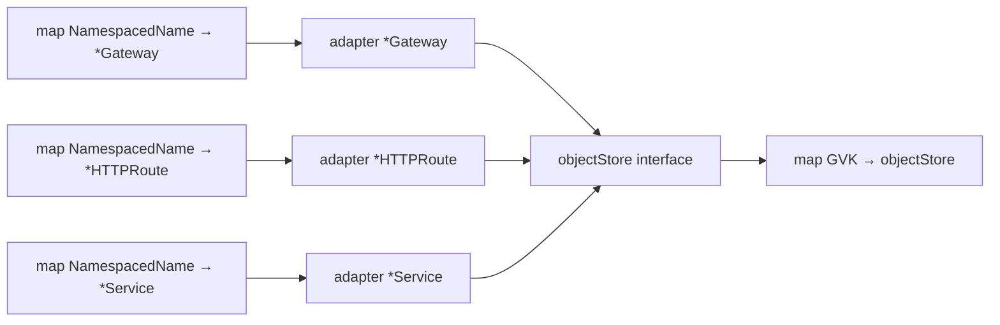
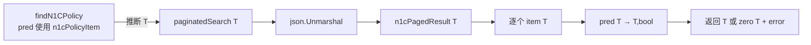
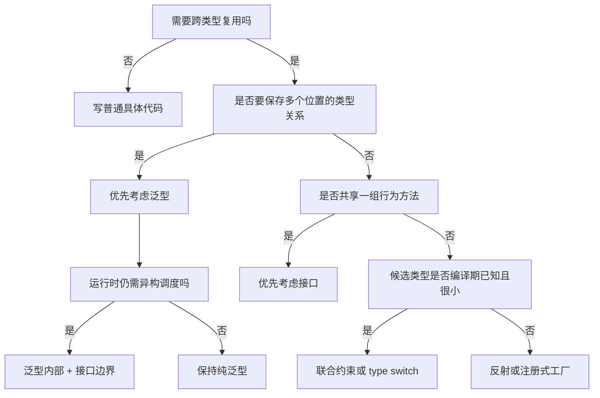

<!-- markdownlint-disable MD013 MD025 -->

# Go 泛型从入门到精通——基于 NGF 源码实战

> [!abstract] 核心结论
> 当前 NGF 源码并不是“到处声明泛型”，而是形成了一个很有代表性的结构：**少量通用声明，被大量具体类型实例化**。全仓库共有 **26 个项目自定义泛型声明**，分布在 9 个 Go 文件中；Go 类型检查器识别出 **2,831 个泛型实例化点**，其中 **2,476 个来自 `helpers.GetPointer`**。
>
> NGF 覆盖了 Go 泛型最值得掌握的知识：`any`、`comparable`、方法约束、联合类型集 `|`、底层类型近似 `~`、泛型函数、泛型结构体、泛型函数类型、多类型参数、类型推断、零值、泛型与 JSON、泛型与高阶函数、泛型类型的方法、泛型与非泛型接口的组合，以及泛型和运行时类型断言、类型分支、反射之间的边界。
>
> 真正精通泛型，不是会写 `[T any]`，而是能回答三个问题：**T 的类型集合是什么？函数体对 T 允许做哪些操作？类型关系应该在编译期保证到什么程度？**

相关笔记：[[go-reflect-patterns-obsidian]]、[[ngf-operator-gvk-fundamentals-obsidian]]、[[ngf-controller-runtime-interactions-obsidian]]

---

## 0. 阅读目标、范围与事实版本

本文适合已经熟悉 Go 函数、接口、指针、map、类型断言，希望系统掌握 Go 泛型的读者。读完后，你应该能够：

1. 从类型集合角度理解 `any`、`comparable`、接口约束、`|` 与 `~`；
2. 判断一个抽象应该使用泛型、普通接口、类型分支还是反射；
3. 理解类型推断、显式实例化、泛型零值和泛型方法接收者；
4. 看懂 NGF 中所有项目自定义泛型声明；
5. 识别“写了泛型但仍然可能在运行时 panic”的边界；
6. 设计既保持具体类型、又能接入异构运行时注册表的工程结构。

### 0.1 事实来源

| 项目 | 事实版本 |
| --- | --- |
| NGF | `cbb082a6614af388215937386506ee3dc7fd0221` |
| Go | `go1.26.0 linux/amd64` |
| 根模块 | `github.com/nginx/nginx-gateway-fabric/v2` |
| 独立测试模块 | `github.com/nginx/nginx-gateway-fabric/v2/tests` |

分析开始时工作树干净。本文只统计仓库中的 Go 源文件；不递归统计 Go 标准库和第三方依赖源码内部的声明。

### 0.2 明确不负责的内容

- 不展开 Go 编译器当前如何在机器码层面实现泛型；这是实现细节，不能仅从 NGF 源码推断。
- 不把“用了泛型”等同于“性能更高”。本文没有为泛型与非泛型版本做基准测试。
- 不把依赖通过类型别名隐藏的所有泛型都计入直接语法统计。
- 不把名字中含 `Generic` 的普通类型或方法算作泛型。例如 `GenericEvent`、`FakeGenericValidator` 都不是 Go 泛型。

---

## 1. 全库普查：NGF 到底用了多少泛型

### 1.1 自定义泛型声明

| 范围 | 泛型函数 | 泛型类型 | 合计 |
| --- | ---: | ---: | ---: |
| 生产代码 | 11 | 2 | 13 |
| 根模块测试辅助代码 | 8 | 4 | 12 |
| `tests` 独立模块 | 1 | 0 | 1 |
| **合计** | **20** | **6** | **26** |

这 26 个声明分布在 9 个文件中，没有出现在生成代码中。当前仓库还没有：

- 泛型类型别名；
- 自己引入新类型参数的泛型方法；
- 泛型声明生成代码。

> [!note] “没有泛型方法”应该如何理解
> Go 的方法不能额外声明一组新的方法级类型参数。泛型类型的方法只能复用接收者已有的类型参数。NGF 的 `objectStoreMapAdapter[T]` 正好展示了这种形式，后文会详细分析。

### 1.2 实例化点统计

这里的“实例化点”来自 Go 类型检查结果 `types.Info.Instances`，既包括泛型函数调用，也包括泛型类型的使用。它不是简单的文本命中次数。

| 范围 | NGF 自定义泛型 | 标准库/依赖泛型 | 合计 |
| --- | ---: | ---: | ---: |
| 生产代码 | 158 | 125 | 283 |
| 根模块测试代码 | 2,469 | 9 | 2,478 |
| `tests` 独立模块 | 68 | 2 | 70 |
| **合计** | **2,695** | **136** | **2,831** |

最重要的分布特征是：

| 泛型符号 | 生产实例化点 | 测试实例化点 | 合计 | 主要用途 |
| --- | ---: | ---: | ---: | --- |
| `GetPointer` | 62 | 2,414 | 2,476 | 构造 Kubernetes API 指针字段与测试夹具 |
| `MustCastObject` | 33 | 2 | 35 | 从 `client.Object` 恢复具体对象类型 |
| `EqualPointers` | 15 | 1 | 16 | 比较可比较类型的可选字段 |
| `newObjectStoreMapAdapter` | 22 | 0 | 22 | 将 20 余种强类型资源 map 接入统一 store |
| `paginatedSearch` | 3 | 0 | 3 | 复用三种 N1C 列表分页搜索 |
| `convertMatchType` | 2 | 4 | 6 | 统一两种底层为 string 的 Gateway API 类型 |
| `processSessionPersistenceConfig` | 2 | 2 | 4 | 复用 HTTP/GRPC Route 会话保持处理 |
| `CheckFilterAccepted` | 0 | 2 | 2 | 统一两个 Filter 的 conformance 检查 |

> [!important] 正确解读“大量使用泛型”
> `GetPointer` 一项占所有实例化点约 87.5%。所以准确结论不是“NGF 有几千套复杂泛型算法”，而是“NGF 有一组小而稳定的泛型抽象，其中指针构造器被测试夹具极高频复用”。

### 1.3 外部泛型 API 的直接使用

| 来源 | 实例化点 | NGF 中的代表 |
| --- | ---: | --- |
| `slices` | 50 | `Contains`、`ContainsFunc`、`EqualFunc`、`SortFunc` |
| `k8s.io/.../field` | 48 | `field.NotSupported` |
| `maps` | 24 | `Clone`、`Copy`、`Equal` |
| controller-runtime `predicate` | 12 | `predicate.And`、`predicate.Or` |
| gRPC | 2 | `ServerStreamingServer[T]`、`ClientStreamingServer[Req, Resp]` |

### 1.4 语义模式全景

图示性质：概念关系图。

```mermaid
flowchart TD
    G[NGF 泛型模式] --> A[值级小工具]
    G --> B[约束驱动算法]
    G --> C[强类型容器]
    G --> D[高阶算法]
    G --> E[测试抽象]
    G --> F[第三方泛型 API]

    A --> A1[GetPointer: any]
    A --> A2[bothSet: any]
    A --> A3[EqualPointers: comparable]
    B --> B1[configValue: int 或 int32 或 string]
    B --> B2[convertMatchType: ~string]
    B --> B3[MustCastObject: client.Object]
    C --> C1[objectStoreMapAdapter T]
    C --> C2[n1cPagedResult T]
    D --> D1[paginatedSearch + callbacks]
    D --> D2[processSessionPersistenceConfig + type switch]
    E --> E1[泛型函数类型]
    E --> E2[多类型参数 T 和 R]
    E --> E3[Filter 闭集约束]
    F --> F1[maps 和 slices]
    F --> F2[controller-runtime predicate]
    F --> F3[gRPC typed stream]
```



---

## 2. 第一性原理：泛型究竟解决什么问题

先看一个最小问题：很多 Kubernetes API 字段是指针，而调用者手里通常是值。

代码性质：NGF 原样摘录，来源 `internal/framework/helpers/helpers.go:GetPointer`。

```go
// GetPointer takes a value of any type and returns a pointer to it.
func GetPointer[T any](v T) *T {
    return &v
}
```

使用时通常不写类型实参：

代码性质：基于 NGF 调用方式的教学示意。

```go
enabled := helpers.GetPointer(true)                  // T 推断为 bool
name := helpers.GetPointer("gateway")               // T 推断为 string
port := helpers.GetPointer(v1.PortNumber(443))       // T 推断为 v1.PortNumber
```

如果不用泛型，有三种常见替代方案：

1. 为每种类型写 `boolPtr`、`stringPtr`、`portPtr`，逻辑重复；
2. 接收 `any` 并返回 `any`，调用者丢失 `*T` 的静态类型；
3. 使用反射，增加运行时分支和失败面。

泛型保留的是一个关键关系：

$$
\text{输入类型 } T \Longrightarrow \text{输出类型 } *T
$$

接口只能表达“这个值具有什么行为”，而这里需要表达的是“输入和输出是同一个未知类型的不同形态”。这正是类型参数最擅长的事。

> [!tip] 最小心智模型
> 泛型不是“让所有类型都能进来”。泛型是：先声明一个类型变量 `T`，再用约束定义 `T` 的候选集合，并在函数签名中保存多个位置之间的类型关系。

### 2.1 编译器看泛型的三个步骤

面对 `F[T Constraint]`，可以按下面顺序思考：

1. **类型集合**：`Constraint` 允许哪些具体类型？
2. **可用操作**：集合中的每一种类型都支持哪些共同操作？
3. **实例化**：调用处最终为 `T` 选择了哪个具体类型？

后文所有 NGF 代码都可以还原成这三步。

---

## 3. 第一层：`any`——只保存类型关系，不要求类型能力

`any` 等价于空接口 `interface{}`。约束为 `any` 时，`T` 可以是任意非接口或接口类型，但函数体不能假定它支持 `+`、`<`、`==` 或特定方法。

### 3.1 `GetPointer[T any]`

`GetPointer` 对 `T` 只做两件所有类型都允许的事：接收一个值、取得局部变量 `v` 的地址。

> [!warning] 返回的是参数副本的地址
> `GetPointer(x)` 不会返回原变量 `x` 的地址。参数传递先复制 `x` 到 `v`，返回的是 `&v`。

代码性质：教学示意，未写入 NGF 生产代码。

```go
x := 1
p := helpers.GetPointer(x)
*p = 2

// x 仍然是 1；p 指向 GetPointer 内部参数副本。
```

返回局部变量地址是安全的。Go 的逃逸分析会在需要时延长它的生命周期；但是否分配到堆上应由编译器分析和基准测试确认，不能仅凭源码一概而论。

### 3.2 `bothSet[T any]`

代码性质：NGF 原样摘录，来源 `internal/controller/nginx/config/policies/proxysettings/validator.go:bothSet`。

```go
func bothSet[T any](a, b *T) bool {
    return a != nil && b != nil
}
```

它被 4 种具体类型实例化：`bool`、`v1alpha1.Duration`、`v1alpha1.ProxyBuffers`、`v1alpha1.Size`。函数只比较指针是否为 nil，完全不读取 `T` 的值，所以 `any` 已经足够。

> [!tip] 约束最小化
> 不要为了显得“严格”而给 `T` 添加函数体不需要的约束。约束越窄，可复用范围越小，调用者承担的耦合越大。

### 3.3 `processSessionPersistenceConfig[T any]` 的另一面

`any` 也可能过宽。NGF 用同一个函数处理两种 route match 切片：

代码性质：NGF 缩略摘录，省略与类型分支无关的校验和赋值逻辑。

```go
func processSessionPersistenceConfig[T any](
    sp *v1.SessionPersistence,
    routeMatches []T,
    rulePath *field.Path,
    validator validation.HTTPFieldsValidator,
) (*SessionPersistenceConfig, routeRuleErrors) {
    // ...
    switch rm := any(routeMatches).(type) {
    case []v1.HTTPRouteMatch:
        path = deriveCookiePathForHTTPMatches(rm)
    case []v1.GRPCRouteMatch:
        path = ""
    default:
        panic("unsupported route match type")
    }
    // ...
}
```

调用处由参数推断出两种实例：

- `T = v1.HTTPRouteMatch`；
- `T = v1.GRPCRouteMatch`。

泛型保证 `routeMatches` 内部元素类型一致，却没有把候选类型限制为这两个。理论上，同包代码可以传入 `[]int` 并通过编译，随后落入 `default` panic。

> [!warning] 泛型不自动等于编译期完备
> 如果约束写成 `any`，又在函数体里靠类型分支恢复具体类型，那么一部分正确性仍然留在运行时。

一种更封闭的设计是：

代码性质：改进方向示意，当前 NGF 未采用。

```go
type routeMatch interface {
    v1.HTTPRouteMatch | v1.GRPCRouteMatch
}

func processSessionPersistenceConfig[T routeMatch](
    sp *v1.SessionPersistence,
    routeMatches []T,
    rulePath *field.Path,
    validator validation.HTTPFieldsValidator,
) (*SessionPersistenceConfig, routeRuleErrors) {
    switch rm := any(routeMatches).(type) {
    case []v1.HTTPRouteMatch:
        // ...
    case []v1.GRPCRouteMatch:
        // ...
    }
}
```

这是本文的改进建议，不是作者意图的历史结论。收益是把“只支持两种 match”前移到编译期；代价是多维护一个约束声明。

---

## 4. 第二层：`comparable`——让 `==` 成为合法操作

代码性质：NGF 原样摘录，来源 `internal/framework/helpers/helpers.go:EqualPointers`。

```go
func EqualPointers[T comparable](p1, p2 *T) bool {
    if p1 == nil && p2 == nil {
        return true
    }

    var p1Val, p2Val T

    if p1 != nil {
        p1Val = *p1
    }
    if p2 != nil {
        p2Val = *p2
    }

    return p1Val == p2Val
}
```

这里最后一行要求 `T` 支持 `==`。如果约束仍是 `any`，编译器会拒绝 `p1Val == p2Val`，因为切片、map、函数等类型不可比较。

`comparable` 让类型参数可以使用 `==`/`!=`。常见成员包括：

- 布尔、整数、浮点、复数、字符串；
- 指针、channel；
- 元素可比较的数组；
- 所有字段都可比较的 struct；
- 满足可比较要求的已定义类型。

它不表示“可排序”。`<` 需要更窄的有序类型约束。

> [!warning] 接口类型的特殊规则
> 现代 Go 允许某些接口类型满足 `comparable` 约束，但接口值比较仍可能因动态值不可比较而 panic。例如动态值为 slice 时不能执行接口相等比较。NGF 当前 `EqualPointers` 的实例都是具体可比较类型，没有使用 `T=any`，但设计公共库时要记住这层区别。

### 4.1 NGF 赋予它的业务语义

`EqualPointers` 不只是比较两个指针是否指向同一地址。它把 nil 当成 `T` 的零值：

| `p1` | `p2` | 结果 |
| --- | --- | --- |
| nil | nil | true |
| nil | 指向零值 | true |
| 指向相同值 | 指向相同值 | true |
| 指向不同值 | 指向不同值 | false |

因此 `nil string` 与 `""` 被视为相等。这个语义由 `helpers_test.go:TestEqualPointers` 明确验证。

> [!warning] 约束只保证操作合法，不保证业务语义正确
> `float64` 满足 `comparable`，但 `NaN != NaN`。如果未来把浮点类型用于 `EqualPointers`，必须重新审视“相同值”的业务含义。

### 4.2 `T` 自身也可以是指针

当前实例化中包含 `T = *v1.Group`。此时参数类型是 `**v1.Group`。这提醒我们：`*T` 不意味着“只有一层指针”，它是在调用者选择的 `T` 外再包一层。

---

## 5. 第三层：接口约束与方法集合——`T client.Object`

接口约束不只可以列底层类型，也可以要求方法。controller-runtime 的 `client.Object` 组合了 Kubernetes 对象所需的方法。

### 5.1 `MustCastObject`：静态约束 + 运行时断言

代码性质：NGF 原样摘录，来源 `internal/framework/helpers/helpers.go:MustCastObject`。

```go
func MustCastObject[T client.Object](object client.Object) T {
    if obj, ok := object.(T); ok {
        return obj
    }

    panic(fmt.Errorf("unexpected object type %T", object))
}
```

典型调用：

代码性质：NGF 原样摘录，来源 `internal/controller/nginx/config/policies/proxysettings/validator.go`。

```go
psp := helpers.MustCastObject[*ngfAPI.ProxySettingsPolicy](policy)
```

这里必须显式写出 `*ngfAPI.ProxySettingsPolicy`，因为 `T` 只出现在返回类型和类型断言中，输入参数 `object client.Object` 无法为编译器提供 T。

这个函数提供两层保证：

1. 编译期：调用者指定的 T 必须实现 `client.Object`；
2. 运行时：传入接口值的动态类型必须真的是 T，否则 panic。

> [!important] 泛型没有消除运行时类型错误
> 它消除了“目标类型根本不是 Kubernetes 对象”的错误，却无法在编译期证明一个 `client.Object` 接口值当前装着哪种具体对象。

`helpers_test.go:TestMustCastObject` 同时验证成功转换和错误类型 panic。

### 5.2 typed nil 边界

如果 `object` 接口中装的是 `(*v1.Gateway)(nil)`，接口本身并不为 nil，断言为 `*v1.Gateway` 可以成功，返回值仍是 nil。泛型约束不会自动阻止后续 nil 解引用。

---

## 6. 第四层：联合类型集 `|`——精确声明一个闭集

### 6.1 `configValue`

代码性质：NGF 原样摘录，来源 `internal/controller/nginx/config/validation/framework.go`。

```go
type configValue interface {
    int | int32 | string
}

func validateInSupportedValues[T configValue](
    value T,
    supportedValues map[T]struct{},
) (valid bool, supportedValuesAsStrings []string) {
    if _, exist := supportedValues[value]; exist {
        return true, nil
    }

    return false, getSortedKeysAsString(supportedValues)
}
```

`configValue` 的类型集合是三个**精确类型**：`int`、`int32`、`string`。它不是普通业务接口，而是仅用于约束类型参数的非基本接口。

由于集合中的每个类型都可比较，`T` 可以作为 map key。函数体不需要单独再写 `comparable`。

### 6.2 没有 `~` 意味着什么

代码性质：教学示意。

```go
type Port int32

// validateInSupportedValues(Port(80), map[Port]struct{}{80: {}})
// 不能满足当前 configValue，因为 Port 不是精确的 int32。
```

如果希望所有底层类型为这三种类型的已定义类型也能加入集合，可以写：

代码性质：教学示意，当前 NGF 未采用。

```go
type configValue interface {
    ~int | ~int32 | ~string
}
```

当前生产调用只实例化为 `string`，所以现有精确约束已经满足需求。是否放宽应由真实调用场景决定，而不是为了追求形式上的“通用”。

### 6.3 `Filter`：用闭集保护测试适配器

代码性质：NGF 原样摘录，来源 `tests/framework/filter.go`。

```go
type Filter interface {
    ngfAPI.SnippetsFilter | ngfAPI.AuthenticationFilter
}

func CheckFilterAccepted[T Filter](
    filter T,
    getControllers func(T) []ControllerStatusView,
    expectedCondType string,
    expectedCondReason string,
) error {
    controllers := getControllers(filter)
    // ...统一检查 controller name、condition type/status/reason...
    return nil
}
```

这里的闭集表达了一个明确边界：通用检查器只支持两类 NGF Filter。两个具体类型的内部状态结构通过 `getControllers func(T)` 适配成统一视图。

这是一种很成熟的组合：

$$
\text{闭集约束} + \text{类型安全适配函数} + \text{通用算法}
$$

独立 tests 模块分别以 `SnippetsFilter` 和 `AuthenticationFilter` 实例化该函数。

---

## 7. 第五层：底层类型近似 `~`——统一多个已定义类型

Gateway API 定义了两个不同的命名类型：

- `v1.HeaderMatchType`；
- `v1.QueryParamMatchType`。

它们的底层类型都是 `string`。NGF 用 `~string` 同时接纳它们：

代码性质：NGF 原样摘录，来源 `internal/controller/state/dataplane/convert.go:convertMatchType`。

```go
func convertMatchType[T ~string](matchType *T) MatchType {
    switch *matchType {
    case T(v1.HeaderMatchExact), T(v1.QueryParamMatchExact):
        return MatchTypeExact
    case T(v1.HeaderMatchRegularExpression), T(v1.QueryParamMatchRegularExpression):
        return MatchTypeRegularExpression
    default:
        panic(fmt.Sprintf("unsupported match type: %v", *matchType))
    }
}
```

`~string` 表示：所有底层类型为 `string` 的类型。它包括 `string` 本身，也包括 `type HeaderMatchType string` 这样的已定义类型。

调用处无需显式类型实参：

代码性质：NGF 原样摘录，来源 `internal/controller/state/dataplane/convert.go:convertMatch`。

```go
Type: convertMatchType(h.Type),
// h.Type 是 *v1.HeaderMatchType，故推断 T = v1.HeaderMatchType。

Type: convertMatchType(q.Type),
// q.Type 是 *v1.QueryParamMatchType，故推断 T = v1.QueryParamMatchType。
```

### 7.1 为什么不能写 `T string`

`string` 作为单个精确类型项只接纳预声明类型 `string`，不接纳底层为 string 的命名类型。这里正需要跨两个命名类型复用，所以 `~` 是关键。

### 7.2 失败路径

- `matchType == nil` 会在解引用时 panic；调用链依赖上游校验/默认值保证非 nil。
- 值不属于 Exact 或 RegularExpression 时会进入显式 panic。
- `convert_test.go:TestConvertMatchType` 覆盖两类成功值和不支持值的 panic。

---

## 8. 泛型类型：让容器保存精确元素类型

NGF 有两个生产级泛型结构体：

1. `objectStoreMapAdapter[T client.Object]`；
2. `n1cPagedResult[T any]`。

### 8.1 为什么 `map[K]*Gateway` 不能直接当成 `map[K]client.Object`

Go 的 map 是不变的。即使 `*Gateway` 实现 `client.Object`，下面的赋值仍不成立：

代码性质：教学示意。

```go
var gateways map[types.NamespacedName]*v1.Gateway
var objects map[types.NamespacedName]client.Object

// objects = gateways // 编译失败
```

如果允许这种赋值，调用者就可能通过 `objects` 放入 `*Service`，破坏原 map 只能保存 `*Gateway` 的不变量。

### 8.2 `objectStoreMapAdapter[T]`

代码性质：NGF 原样摘录，来源 `internal/controller/state/store.go`。

```go
type objectStoreMapAdapter[T client.Object] struct {
    objects map[types.NamespacedName]T
}

func newObjectStoreMapAdapter[T client.Object](
    objects map[types.NamespacedName]T,
) *objectStoreMapAdapter[T] {
    return &objectStoreMapAdapter[T]{objects: objects}
}

func (m *objectStoreMapAdapter[T]) upsert(obj client.Object) {
    t, ok := obj.(T)
    if !ok {
        panic(fmt.Errorf("obj type mismatch: got %T, expected %T", obj, t))
    }
    m.objects[client.ObjectKeyFromObject(obj)] = t
}
```

这段代码包含五个高级知识点。

#### 知识点一：构造函数通过 map 参数推断 T

代码性质：NGF 原样摘录，来源 `internal/controller/state/change_processor.go`。

```go
store: newObjectStoreMapAdapter(clusterStore.Gateways),
store: newObjectStoreMapAdapter(clusterStore.HTTPRoutes),
store: newObjectStoreMapAdapter(clusterStore.Services),
```

编译器分别从 map 的 value 类型推断出 `*v1.Gateway`、`*v1.HTTPRoute`、`*corev1.Service`。生产代码共有 22 个构造实例化点。

#### 知识点二：方法复用接收者的 T

代码性质：NGF 方法签名缩略摘录。

```go
func (m *objectStoreMapAdapter[T]) upsert(...)
```

方括号中的 `T` 不是方法新声明的类型参数，而是接收者类型已有参数在方法体中的名字。

#### 知识点三：强类型容器接入非泛型接口

代码性质：NGF 原样摘录，来源 `internal/controller/state/store.go`。

```go
type objectStore interface {
    get(objType ngftypes.ObjectType, nsname types.NamespacedName) client.Object
    upsert(obj client.Object)
    delete(objType ngftypes.ObjectType, nsname types.NamespacedName)
}

type multiObjectStore struct {
    stores map[schema.GroupVersionKind]objectStore
    // ...
}
```

每个 adapter 内部保持一种精确 T；外部通过普通 `objectStore` 接口统一放入按 GVK 索引的异构 registry。

图示性质：类型边界图。



这是 NGF 最值得迁移的泛型设计：

- **同构内部**用泛型保存精确类型；
- **异构边界**用接口统一调度；
- 在边界处用类型断言恢复并验证 T。

#### 知识点四：泛型仍有运行时失败面

`upsert` 接收的是 `client.Object`，所以错误 GVK 路由或错误对象仍可能导致断言失败并 panic。泛型保护的是 adapter 内部 map，不是整个动态调度链。

#### 知识点五：零值也能携带类型信息

断言失败时 `t` 是 T 的零值。即使 T 是指针、值为 nil，`fmt` 的 `%T` 仍能打印它的静态动态类型，用于错误信息。

> [!warning] 测试边界
> `internal/controller/state` 包测试已通过，但当前没有找到专门直接调用 adapter、断言错误类型 panic 的聚焦测试。修改这段边界代码时，建议补充 `get/upsert/delete` 和 wrong-type panic 的表驱动测试。

---

## 9. 泛型 + JSON + 零值：`n1cPagedResult[T]`

代码性质：NGF 原样摘录，来源 `internal/framework/waf/fetch/fetch.go`。

```go
type n1cPagedResult[T any] struct {
    Items []T `json:"items"`
    Total int `json:"total"`
}
```

同一种 JSON envelope 可以装不同 item：

- `n1cLogProfileItem`；
- `n1cPolicyItem`；
- `n1cVersionItem`。

如果不用泛型，常见方案是复制三份 envelope，或把 `Items` 写成 `[]json.RawMessage`/`[]any` 再二次解析。泛型让 `json.Unmarshal` 直接得到 `[]T`，保持字段访问的静态类型。

### 9.1 泛型高阶函数 `paginatedSearch`

代码性质：NGF 缩略摘录，只保留泛型机制主干。

```go
func paginatedSearch[T any](
    ctx context.Context,
    client *http.Client,
    auth *BundleAuth,
    buildURL func(offset, limit int) (string, error),
    pred func(item T) (result T, found bool),
    errMsg string,
) (T, error) {
    const pageSize = 100

    for offset := 1; ; offset += pageSize {
        listURL, err := buildURL(offset, pageSize)
        if err != nil {
            var zero T
            return zero, fmt.Errorf("failed to build %s URL: %w", errMsg, err)
        }

        body, err := doGet(ctx, client, listURL, auth)
        if err != nil {
            var zero T
            return zero, fmt.Errorf("failed to list %s: %w", errMsg, err)
        }

        var resp n1cPagedResult[T]
        if err := json.Unmarshal(body, &resp); err != nil {
            var zero T
            return zero, fmt.Errorf("failed to parse %s response: %w", errMsg, err)
        }

        for _, item := range resp.Items {
            if result, found := pred(item); found {
                return result, nil
            }
        }

        if offset+pageSize-1 >= resp.Total {
            break
        }
    }

    var zero T
    return zero, fmt.Errorf("%s not found", errMsg)
}
```

### 9.2 为什么要写 `var zero T`

T 可能是 struct、指针、string、slice 或其他任意类型，不能统一写 `T{}`，也不能统一返回 nil。声明：

代码性质：NGF 原样摘录中的零值写法。

```go
var zero T
```

总能得到 T 的零值：数值为 0、字符串为 `""`、指针/slice/map/interface 为 nil、struct 为字段零值。

> [!tip] 泛型错误返回的通用模式
> 对无约束或宽约束的 T，优先用 `var zero T; return zero, err`。这是比反射创建零值更简单、更安全的写法。

### 9.3 类型推断来自回调

代码性质：NGF 缩略摘录，来源 `findN1CPolicy`。

```go
result, err := paginatedSearch(
    ctx, client, auth,
    func(offset, limit int) (string, error) {
        return buildN1CPoliciesURL(baseURL, namespace, offset, limit)
    },
    func(item n1cPolicyItem) (n1cPolicyItem, bool) {
        return item, item.Name == policyName
    },
    errMsg,
)
```

调用没有写 `[n1cPolicyItem]`。`pred` 参数和返回值已经足够让编译器推断 T。

图示性质：运行结构图。



### 9.4 高阶函数为什么比接口更合适

`buildURL` 和 `pred` 是两个很小的策略点，没有共享状态，也不值得分别定义接口和实现类型。函数参数既保留 T，又让三个调用者只注入差异。

高层分页测试 `TestN1CFetchPolicyByNamePagination` 验证目标在第 2 页时，offset 从 1 推进到 101 并最终找到目标。WAF fetch 包测试已通过；当前未找到直接以 `paginatedSearch` 为入口覆盖每个错误分支的独立单元测试。

---

## 10. 泛型函数类型与多类型参数：测试代码也是好教材

### 10.1 泛型函数类型

代码性质：NGF 原样摘录，来源 `internal/controller/nginx/config/validation/framework_test.go`。

```go
type simpleValidatorFunc[T configValue] func(v T) error

type supportedValuesValidatorFunc[T configValue] func(v T) (bool, []string)
```

它们不是“带泛型方法的接口”，而是参数化的函数类型。实例化后：

代码性质：教学等价形状示意。

```go
simpleValidatorFunc[string] // 等价形状：func(string) error
simpleValidatorFunc[int32]  // 等价形状：func(int32) error
```

这让测试 helper 能在保持完整签名检查的同时接收多种 validator。

### 10.2 多类型参数 `T, R`

代码性质：NGF 原样摘录，来源同上。

```go
type resultValidatorFunc[T configValue, R any] func(v T) (R, error)

type resultTestCase[T configValue, R any] struct {
    input    T
    expected R
}
```

这里保存了两条独立关系：

- validator 输入必须与 test case 的 `input` 同为 T；
- validator 返回值必须与 `expected` 同为 R。

如果改成 `any` 字段，这两条关系要到运行时才能检查。

### 10.3 泛型与可变参数、闭包、子测试

代码性质：NGF 原样摘录。

```go
func runValidatorTests[T configValue](
    t *testing.T,
    run func(g *WithT, v T),
    caseNamePrefix string,
    values ...T,
) {
    t.Helper()
    for i, v := range values {
        t.Run(fmt.Sprintf("%s_case_#%d", caseNamePrefix, i), func(t *testing.T) {
            g := NewWithT(t)
            run(g, v)
        })
    }
}
```

泛型与普通语言能力可以自然组合：可变参数仍是 `[]T`，闭包捕获的 `v` 保持 T，调用 `run` 时无需断言。

---

## 11. 类型推断：什么时候省略 `[T]`，什么时候不能

| 场景 | NGF 例子 | 是否显式写类型实参 | 原因 |
| --- | --- | --- | --- |
| T 出现在普通参数中 | `GetPointer(true)` | 否 | 从 `true` 推断 `T=bool` |
| T 出现在指针参数中 | `convertMatchType(h.Type)` | 否 | 从 `*HeaderMatchType` 反推 T |
| T 出现在 map value 中 | `newObjectStoreMapAdapter(clusterStore.Gateways)` | 否 | 从 `map[K]*Gateway` 推断 T |
| T 出现在回调签名中 | `paginatedSearch(... pred func(n1cPolicyItem) ...)` | 否 | 从回调参数/返回值推断 T |
| T 只出现在返回值/断言目标中 | `MustCastObject[*Gateway](obj)` | **是** | 输入 `client.Object` 不携带目标 T |
| 泛型类型独立出现 | `resultTestCase[string, string]{...}` | 通常是 | 必须确定完整实例类型 |

> [!tip] 调试推断失败
> 从函数签名里找 T 出现在哪些输入位置。如果调用实参无法唯一反推出 T，就显式写类型实参；不要先怀疑编译器。

---

## 12. 约束决定函数体可以做什么

这是掌握泛型最核心的一张表。

| 约束 | 候选类型集合 | NGF 函数体获得的能力 |
| --- | --- | --- |
| `any` | 所有类型 | 传递、取地址、装入 interface；不能假定可比较或有方法 |
| `comparable` | 所有可比较类型 | 可使用 `==`、`!=`，可作为 map key |
| `client.Object` | 实现该接口方法集的类型 | 可调用接口方法；可从接口断言到 T |
| `int | int32 | string` | 三个精确类型 | 可比较、可作 map key、可格式化；不接纳命名派生类型 |
| `~string` | 所有底层类型为 string 的类型 | 可使用 string 共同操作，并在允许时转换相关常量/值 |
| `SnippetsFilter | AuthenticationFilter` | 两个精确 struct 类型 | 只允许这个闭集；若没有共同字段/方法，仍需适配器或类型分支 |

可以把泛型函数体理解为对类型集合求“共同能力的交集”：

$$
\operatorname{Ops}(T) = \bigcap_{X \in \operatorname{TypeSet}(Constraint)} \operatorname{Ops}(X)
$$

如果某个操作不是集合中每个候选类型都支持，编译器就不允许在泛型函数体中使用它。

---

## 13. 第三方泛型：NGF 不只定义泛型，也消费泛型

### 13.1 `maps` 与 `slices`

NGF 直接使用标准库泛型完成集合操作：

代码性质：NGF 代表性缩略摘录。

```go
maps.Copy(bundles, policy.WAFState.Bundles)
slices.Contains(list, gvk)
slices.EqualFunc(oldStatus, newStatus, equalStatus)
slices.SortFunc(entries, compareEntry)
```

这些函数通常通过参数完整推断类型。它们展示了一个设计原则：算法只依赖容器元素的少量能力时，泛型比 `[]any` 更安全，也避免调用者手写循环。

### 13.2 controller-runtime 的 typed predicate 组合

NGF 直接调用 `predicate.And`/`predicate.Or`。类型检查结果显示它们实例化为 `client.Object` 的 typed predicate。项目源码常通过 `predicate.Predicate` 这个便捷类型使用它们，因此部分泛型细节被依赖别名隐藏。

### 13.3 gRPC typed streaming

代码性质：NGF 原样摘录，来源 `internal/controller/nginx/agent/file.go`。

```go
func (fs *fileService) GetFileStream(
    req *pb.GetFileRequest,
    server grpc.ServerStreamingServer[pb.FileDataChunk],
) error {
    // server.Send 只接受 *pb.FileDataChunk
}

func (*fileService) UpdateFileStream(
    grpc.ClientStreamingServer[pb.FileDataChunk, pb.UpdateFileResponse],
) error {
    return nil
}
```

类型参数把 RPC 的请求、响应消息类型编码进 stream 接口，调用 `Send`/`Recv` 时不需要 `any` 和类型断言。

> [!note] 当前 Reconciler 不是项目自定义泛型
> 当前 `internal/framework/controller/reconciler.go:Reconciler` 是普通 struct，通过 `client.Object`、运行时 GVK 和 `reflect.New` 处理不同资源。旧文档或口语中称它为“泛型 Reconciler”时，容易把“通用”与 Go 语言的“泛型”混为一谈。可结合 [[go-reflect-patterns-obsidian]] 阅读两种机制的边界。

---

## 14. 泛型、接口、类型分支、反射：如何选择

| 问题 | 首选机制 | NGF 例子 |
| --- | --- | --- |
| 同一算法适用于多种类型，且要保存输入/输出类型关系 | 泛型 | `GetPointer[T]`、`paginatedSearch[T]` |
| 多种运行时对象具有相同行为 | 普通接口 | `objectStore`、`client.Object` |
| 候选类型是一个已知小闭集，行为按具体类型不同 | 联合约束 + 适配器/类型分支 | `Filter`、session persistence |
| 具体类型直到运行时才知道，需要动态构造 | 反射或显式工厂 | `Reconciler.mustCreateNewObject` |
| 只有一两个具体类型、逻辑很短且未来不会扩展 | 普通函数/少量重复可能更清晰 | 视上下文决定 |

决策顺序可以写成：

图示性质：设计决策树。



`objectStoreMapAdapter` 就是 `GI`：内部泛型，外部接口。

---

## 15. 常见误区与 NGF 现场对应

### 15.1 把 `any` 当成“万能操作权限”

`T any` 只表示候选集合最大，不表示能对 T 做任何运算。需要 `==` 就收窄到 `comparable`；需要方法就写方法约束。

### 15.2 混淆 `string` 与 `~string`

- `string`：精确的预声明 string 类型；
- `~string`：所有底层类型为 string 的类型。

`convertMatchType` 必须使用后者，`configValue` 则有意使用精确联合。

### 15.3 认为泛型会消除所有类型断言

`MustCastObject` 和 `objectStoreMapAdapter.upsert` 都包含运行时断言。原因是它们接入了普通接口边界，接口值的动态类型无法仅靠 T 静态得知。

### 15.4 认为 `map[K]Concrete` 是 `map[K]Interface` 的子类型

Go 容器不协变。NGF 因此需要 `objectStoreMapAdapter[T]`，而不是直接转换 map。

### 15.5 忘记零值语义属于业务设计

`var zero T` 是语言机制；`EqualPointers` 把 nil 等同于零值是业务语义。两者不能混为一谈。

### 15.6 泛化过度

`processSessionPersistenceConfig[T any]` 已经说明：如果最终仍需要类型分支，应该检查约束能否写成真实闭集。泛型的目标是让错误更早暴露，不是单纯减少函数数量。

### 15.7 假设泛型必然零成本

NGF 没有为这些抽象提供“泛型一定更快”的基准证据。应关注：

- 编译器能否内联；
- 值是否逃逸；
- 实例化数量是否影响二进制体积；
- 真正热点是否在网络、JSON、Kubernetes API 或 NGINX 配置生成。

在当前场景，泛型的主要收益是**类型安全、减少重复和表达不变量**。

---

## 16. 从初学到精通的五级训练路线

### Level 1：读懂 T 从哪里来

逐个判断：

代码性质：阅读练习，取自 NGF 的三类调用形态。

```go
helpers.GetPointer(true)              // T = ?
convertMatchType(header.Type)         // T = ?
newObjectStoreMapAdapter(gateways)    // T = ?
```

答案分别来自值、指针参数、map value。

### Level 2：从函数体反推最小约束

给定操作选择约束：

| 函数体操作 | 最小方向 |
| --- | --- |
| 只传递值、返回 `*T` | `any` |
| 比较 `a == b` | `comparable` |
| 调用 `GetName()` | 包含 `GetName() string` 的接口约束 |
| 接受所有底层 string 类型 | `~string` |
| 只接受两个确定 struct | `A | B` |

### Level 3：理解编译期与运行时边界

沿 `MustCastObject[*Gateway](obj)` 标出：

1. 编译器保证 `*Gateway` 实现 `client.Object`；
2. 运行时断言 `obj` 的动态类型；
3. 调用者仍要处理返回 typed nil 的可能性。

### Level 4：设计“泛型内部 + 接口边界”

以 `objectStoreMapAdapter` 为模板，尝试设计：

- `typedCache[T client.Object]` 保持强类型 map；
- `cache` 普通接口供 registry 调度；
- registry key 明确对应的 T；
- 边界断言失败时提供可诊断错误。

### Level 5：收紧不变量

把 `processSessionPersistenceConfig[T any]` 的 T 收紧为 HTTP/GRPC match 闭集，并补充一个编译失败示例或编译期断言。重点不是改动行数，而是回答：

- 新类型未来如何加入？
- 是否仍需 type switch？
- default 分支能否删除？
- 测试如何证明两个实例行为一致、差异明确？

---

## 17. 修改泛型代码时的验证矩阵

| 修改点 | 最小验证 | 重要失败路径 |
| --- | --- | --- |
| `GetPointer` | helpers 测试 + 代表性调用包编译 | 值副本语义、逃逸变化 |
| `EqualPointers` | `TestEqualPointers` | nil/零值、命名类型、浮点 NaN 若引入 |
| `MustCastObject` | `TestMustCastObject` | 错误动态类型 panic、typed nil |
| `configValue` | validation 测试 | 精确类型与 `~` 的兼容性变化 |
| `convertMatchType` | `TestConvertMatchType` | nil、未知字符串 panic |
| `objectStoreMapAdapter` | state 包测试，建议新增聚焦测试 | wrong-type panic、GVK 路由错误 |
| `paginatedSearch` | WAF fetch 测试 | URL 构建、GET、JSON、not found、跨页停止 |
| `processSessionPersistenceConfig` | graph route common 测试 | 非支持 T、HTTP path 推导、GRPC 空 path |
| `CheckFilterAccepted` | tests framework 编译 + 对应 suite | adapter 映射错误、condition 顺序 |
| gRPC stream 类型 | agent 文件服务测试/编译 | Req/Resp 类型方向写反 |

### 17.1 本文实际执行的验证

命令性质：已在上述 revision 的本地工作树执行并通过。

```bash
go test ./internal/framework/helpers \
  ./internal/controller/nginx/config/validation \
  ./internal/controller/nginx/config/policies/proxysettings \
  ./internal/controller/state/dataplane \
  ./internal/controller/state/graph \
  ./internal/controller/state \
  ./internal/framework/waf/fetch
```

结果：7 组包全部 `ok`。

命令性质：已在 `tests/` 独立模块执行并通过编译。

```bash
go test ./framework
```

结果：包编译成功，输出 `[no test files]`。这不等于运行了完整 conformance suite。

---

## 18. 速查表：看到代码就知道它在表达什么

| 语法 | 含义 | NGF 例子 |
| --- | --- | --- |
| `[T any]` | T 任意，只保存类型关系 | `GetPointer`、`bothSet` |
| `[T comparable]` | T 可用 `==`/`!=` | `EqualPointers` |
| `[T client.Object]` | T 必须实现对象方法集 | `MustCastObject`、store adapter |
| `A | B` | T 属于精确闭集 | `Filter`、`configValue` |
| `~string` | T 的底层类型是 string | `convertMatchType` |
| `type Box[T any] struct` | 每个实例保存一种精确 T | `n1cPagedResult` |
| `func (x *Box[T]) M()` | 方法复用接收者 T | `objectStoreMapAdapter` methods |
| `var zero T` | 构造任意 T 的零值 | `paginatedSearch` |
| `any(v).(type)` | 从泛型值进入运行时类型分支 | session persistence |
| `obj.(T)` | 从接口断言为当前实例 T | `MustCastObject`、adapter |
| `func(T) (T, bool)` | 类型安全策略回调 | `paginatedSearch.pred` |
| `[T, R ...]` | 保存输入与输出的独立类型关系 | validation 测试 helper |

> [!quote] 一句话记住
> 约束定义 T 的世界边界，函数签名保存类型关系，函数体只能使用整个类型集合的共同能力，实例化则把抽象关系落到一个具体类型上。

---

## 19. 可复现普查方法

### 19.1 当前 revision 的声明查询

命令性质：已执行；当前输出恰好为 26 个声明、9 个文件。

```bash
rg -n --pcre2 --glob '*.go' \
  '^(?:type|func)\s+[A-Za-z_][A-Za-z0-9_]*\[[A-Za-z_]' .
```

生产/测试分组：

命令性质：已执行。

```bash
rg -n --pcre2 --glob '*.go' \
  '^(?:type|func)\s+[A-Za-z_][A-Za-z0-9_]*\[[A-Za-z_]' . \
  | awk -F: '
      BEGIN { prod=0; test=0 }
      /_test\.go:|^\.\/tests\// { test++ }
      !/_test\.go:/ && !/^\.\/tests\// { prod++ }
      END { print "production=" prod, "test=" test, "total=" prod+test }
    '
```

当前结果：`production=13 test=13 total=26`。

### 19.2 为什么实例化统计不能只用 rg

下面两种调用都实例化了泛型：

代码性质：NGF 调用形态的教学示意。

```go
helpers.GetPointer(true)                  // 类型实参由编译器推断
helpers.MustCastObject[*v1.Gateway](obj)  // 类型实参显式出现
```

仅搜索 `[` 会漏掉第一种，也会把数组索引、slice、map 误算为泛型。因此本文用 `golang.org/x/tools/go/packages` 加载根模块和 `tests` 模块，并读取每个 package 的 `types.Info.Instances`；再按源码位置、符号和类型实参去重，按声明来源区分 NGF 与标准库/依赖。

### 19.3 盲点

- 依赖类型别名可能隐藏底层泛型实例；
- 本统计不递归进入依赖仓库；
- 生成的 protobuf/API 代码内部泛型不在自定义声明清单；
- 反射动态构造不是泛型实例化；
- revision 变化后数字必须重新计算。

---

## 20. 源码与测试证据索引

| 主题 | 生产源码 | 测试/验证 |
| --- | --- | --- |
| `GetPointer` / `MustCastObject` / `EqualPointers` | `ngf:internal/framework/helpers/helpers.go` | `ngf:internal/framework/helpers/helpers_test.go` |
| `configValue` 与 validation 泛型 | `ngf:internal/controller/nginx/config/validation/framework.go` | `ngf:internal/controller/nginx/config/validation/framework_test.go` |
| 泛型 validation test helpers | 测试辅助实现同右 | `ngf:internal/controller/nginx/config/validation/framework_test.go`、`common_test.go` |
| `bothSet` | `ngf:internal/controller/nginx/config/policies/proxysettings/validator.go` | proxysettings 包测试 |
| `convertMatchType` | `ngf:internal/controller/state/dataplane/convert.go` | `ngf:internal/controller/state/dataplane/convert_test.go:TestConvertMatchType` |
| `processSessionPersistenceConfig` | `ngf:internal/controller/state/graph/route_common.go` | `ngf:internal/controller/state/graph/route_common_test.go` |
| `objectStoreMapAdapter` | `ngf:internal/controller/state/store.go` | state 包测试；缺少 adapter 聚焦测试 |
| adapter 构造与注册 | `ngf:internal/controller/state/change_processor.go:NewChangeProcessorImpl` | `ngf:internal/controller/state/change_processor_test.go` |
| `n1cPagedResult` / `paginatedSearch` | `ngf:internal/framework/waf/fetch/fetch.go` | `ngf:internal/framework/waf/fetch/fetch_test.go:TestN1CFetchPolicyByNamePagination` |
| `Filter` / `CheckFilterAccepted` | `ngf:tests/framework/filter.go` | `ngf:tests/suite/snippets_filter_test.go`、`authentication_filter_test.go` |
| typed gRPC stream | `ngf:internal/controller/nginx/agent/file.go` | agent/file 相关测试与编译 |
| controller-runtime typed predicates | `ngf:internal/controller/manager.go`、`internal/controller/provisioner/eventloop.go` | manager/provisioner 测试 |
| 非泛型 Reconciler 对照 | `ngf:internal/framework/controller/reconciler.go` | `ngf:internal/framework/controller/reconciler_test.go` |

---

## 21. 最终心智模型

看到一个泛型设计时，按下面七问审查：

1. T 的真实候选集合是什么？
2. 约束是否比函数体需要的能力更宽或更窄？
3. 输入、输出、字段、回调之间保存了什么类型关系？
4. T 能否由输入推断，还是必须显式实例化？
5. 零值、nil、命名类型、底层类型的语义是否明确？
6. 是否在某个接口、type switch 或反射边界重新引入运行时失败？
7. 泛型是否让不变量更清晰，还是只把少量重复变成了更难读的抽象？

NGF 给出的最佳答案不是“全部泛型化”，而是分层：

- `GetPointer` 用最宽的 `any` 保存值到指针的关系；
- `EqualPointers` 用 `comparable` 获取比较能力；
- `convertMatchType` 用 `~string` 跨越命名类型；
- `configValue` 和 `Filter` 用联合类型集声明闭集；
- `paginatedSearch` 用泛型类型、高阶函数和零值复用完整算法；
- `objectStoreMapAdapter` 在内部保持强类型，在外部接入普通接口；
- Reconciler 在运行时类型未知时仍使用接口与反射。

掌握这些边界后，泛型就不再是方括号语法，而是一套精确设计类型关系、前移错误并控制运行时动态性的工具。
