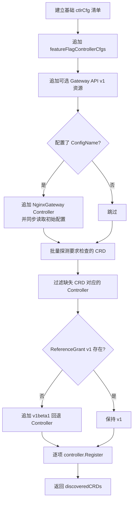
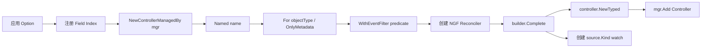
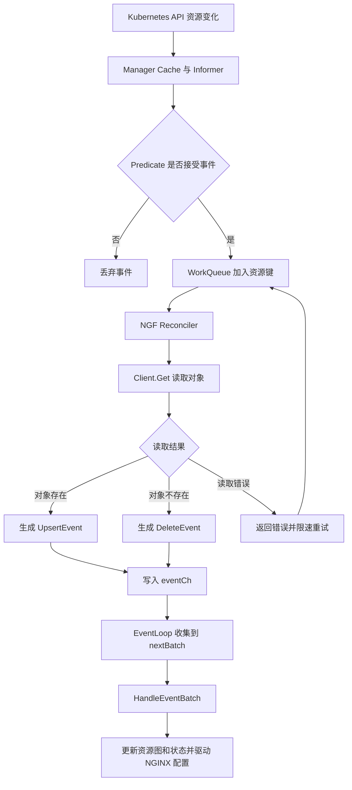

# registerControllers 工作原理与 controller-runtime 调用链

> [!abstract] 核心结论
> `registerControllers` 并不启动控制器，也不直接处理 NGINX 配置。它先根据静态资源清单、功能开关和集群中 CRD 的实际存在情况，构造一组“每种资源一个 Controller”的注册项；随后通过 NGF 的 `controller.Register` 将这些注册项转换为 controller-runtime 的 `Controller + Kind Source + Reconciler`，加入同一个 `Manager`。真正的 Informer、队列和 worker 直到 `mgr.Start(ctx)` 才启动。

相关背景可参阅 [[ngf-controller-runtime-interactions-obsidian]] 与 [[ngf-control-plane-startup-params-analysis]]。

## 入口与职责边界

调用入口位于 `internal/controller/manager.go:146`：

```go
discoveredCRDs, err := registerControllers(
    ctx, cfg, mgr, recorder, logLevelSetter, eventCh, controlConfigNSName,
)
```

函数位于 `internal/controller/manager.go:789`，输入可以分为四类：

| 输入 | 作用 |
|---|---|
| `cfg` | 决定 ControllerName、功能开关、控制面配置名等 |
| `mgr` | 提供 Scheme、Cache、Client、FieldIndexer 与 Runnable 注册能力 |
| `eventCh` | 所有资源 Reconciler 的统一输出通道 |
| `recorder`、`logLevelSetter` | 读取并应用初始 `NginxGateway` 控制面配置 |

返回的 `discoveredCRDs map[string]bool` 不只是日志信息，还会传给状态处理器和首次事件批次准备器，使后续图构建与注册结果保持一致。

## 注册过程



### 1. 构造基础清单

`ctlrCfg` 保存 `objectType`、可选自定义名称、注册选项以及 CRD 探测信息。基础清单覆盖以下资源：

| 分类 | 资源 | 主要过滤策略 |
|---|---|---|
| Gateway API | `GatewayClass` | generation 变化，并且 ControllerName 匹配 |
| Gateway API | `Gateway`、`HTTPRoute`、`GRPCRoute` | generation 变化 |
| 核心资源 | `ConfigMap` | 无全局 predicate，相关事件均可入队 |
| 核心资源 | `Service` | `ServiceChangedPredicate`；名称固定为 `user-service` 以避免重名 |
| 核心资源 | `Secret` | resourceVersion 变化 |
| 核心资源 | `EndpointSlice` | generation 变化，并创建字段索引 |
| 核心资源 | `Namespace` | label 变化 |
| NGF API | `NginxProxy` 及多种 Policy/Filter | generation 变化 |
| CRD 元数据 | `CustomResourceDefinition` | 只缓存 metadata，仅关注 bundle version 注解 |

CRD Controller 显式设置 GVK，是因为 `OnlyMetadata` 最终使用 `PartialObjectMetadata`；缺少 GVK 会在 `controller.Register` 中触发 panic。`EndpointSlice` 的字段索引在 Controller 构建前写入 Manager 的 `FieldIndexer`，单项注册超时为 2 分钟。

### 2. 按功能开关追加资源

`featureFlagControllerCfgs` 把编译期支持与运行时启用分离：

- 配置 `PLMStorageConfig` 时追加非结构化 `APPolicy`、`APLogConf`，同时要求对应 CRD 存在。
- 开启 `ExperimentalFeatures` 时追加 `TCPRoute`、`UDPRoute`，并探测 CRD。
- 开启 `InferenceExtension` 时追加 `InferencePool`；代码刻意跳过 CRD discovery，由功能开关承担启用责任。
- 开启 `SnippetsFilters` 或 `Snippets` 时追加 `SnippetsFilter`；开启 `Snippets` 时再追加 `SnippetsPolicy`。

此外，`BackendTLSPolicy`、`TLSRoute`、`ListenerSet` 总会成为候选项，但只有集群中存在相应 v1 CRD 才实际注册。

### 3. CRD 探测与版本回退

`filterControllersByCRDExistence` 只检查 `requireCRDCheck=true` 的配置，使用 Manager 的 REST Config 批量 discovery，然后：

1. 普通配置始终保留；
2. 可选 CRD 存在才保留；
3. 将每个被探测 Kind 的结果写入 `discoveredCRDs`；
4. 如果 `ReferenceGrant` v1 缺失，额外注册 v1beta1 版本。

> [!important] ReferenceGrant 的特殊性
> 其他可选 CRD 可以直接禁用对应 Controller；`ReferenceGrant` 用于跨 namespace 引用校验，不能整体缺席，因此代码提供 v1 → v1beta1 回退。

### 4. 控制面配置的特殊处理

当 `cfg.ConfigName != ""` 时，函数追加 `NginxGateway` Controller，并同时使用两层过滤：

- `GenerationChangedPredicate` 在进入 workqueue 前过滤无关更新；
- `NamespacedNameFilter` 在 `Reconcile` 内只接受指定的 `namespace/name`。

注册前，`setInitialConfig` 使用不经过缓存的 `mgr.GetAPIReader()` 轮询目标对象，最长 10 秒，并立即应用日志级别等控制面设置。这发生在 `mgr.Start` 之前，因此不能依赖尚未启动的 Manager Cache。

## `controller.Register` 如何接入 controller-runtime

NGF 封装位于 `internal/framework/controller/register.go:84`。每个 `ctlrCfg` 依次执行：



关键装配结果如下：

- `Getter = mgr.GetClient()`：Reconcile 读取默认走 Cache，写操作才直连 API Server。
- `ObjectType`：决定每个 Controller 处理的资源类型。
- `EventCh = eventCh`：把所有资源变化汇聚到同一个 NGF 事件循环。
- `For(objectType)`：controller-runtime 自动使用 `EnqueueRequestForObject`，把对象事件转换为 `namespace/name` 请求。
- `WithEventFilter`：predicate 在事件进入队列前执行，减少无效 Reconcile。
- `Complete`：先创建 Controller 并通过 `mgr.Add` 注册，再挂载 `source.Kind` watch；此时仍未启动。

Controller 名默认取对象 GVK 的 Kind；`Service` 使用 `user-service` 覆盖默认名，以满足 Manager 内 Controller 名称唯一的要求。

> [!warning] 失败是 fail-fast，但没有逐项回滚
> Field Index、Controller 构建、Watch 创建任一步失败都会包装错误并立即返回。循环中此前成功的 Controller 仍留在 Manager 中；不过 `StartManager` 会直接返回错误，不再调用 `mgr.Start`，所以这些部分注册项不会运行。

## Manager 启动后的运行链

`createManager` 将全局 `Controller.NeedLeaderElection` 设置为 `false`，因此这些资源 Controller 在所有副本上运行，而不是只在 leader 上运行。`mgr.Start(ctx)` 的关键顺序为：启动 HTTP/Webhook → 启动并同步 Cache → 启动非 leader-election Runnables。



每个 Controller 默认只有 1 个 worker，队列会按 key 合并重复请求；Reconcile 返回错误时 controller-runtime 使用指数退避重新入队。NGF Reconciler 成功发送事件后返回空 `Result`，因此不会主动 requeue。

### Reconciler 的语义转换

`internal/framework/controller/reconciler.go:84` 将 controller-runtime 的“期望状态协调”模型简化为事件适配器：

1. 执行可选的 `NamespacedNameFilter`；
2. 按资源类型创建新对象，metadata-only 类型创建 `PartialObjectMetadata`；
3. 使用 `Getter.Get` 获取当前状态；
4. `NotFound` 转成 `DeleteEvent`，存在则转成 `UpsertEvent`；
5. 将事件写入 `eventCh`，除 API 读取错误外不返回错误。

`eventCh` 是无缓冲通道。当 EventLoop 尚未接收时，Reconciler 会阻塞在发送处；这提供天然背压，避免 Controller 无限快地产生应用层事件。Context 取消会使发送退出，不会遗留永久阻塞的 worker。

### 首批事件与后续批处理

EventLoop 启动时先从已同步的 Manager Cache 构造包含所有相关资源的首批 `UpsertEvent`，保证第一次生成 NGINX 配置时拥有完整集群视图。Controller Informer 随后产生的初始 Upsert 可能与首批事件重复；状态处理器依赖 generation/现有状态消除无效重配置。

首批之后，EventLoop 使用双缓冲：当前批次由独立 goroutine 串行处理，新事件进入 `nextBatch`；当前批次完成后一次性交换并处理积累事件。这样既保证同一时间只有一个批次修改状态，又减少连续资源变化导致的 NGINX reload 次数。

## Predicate 与 Filter 的区别

| 机制 | 执行位置 | 是否访问对象 | 主要价值 |
|---|---|---|---|
| `WithK8sPredicate` | Informer 事件到 workqueue 之前 | 使用事件携带的旧/新对象 | 尽早过滤 generation、label、annotation 等无关变化 |
| `WithNamespacedNameFilter` | NGF `Reconcile` 开始处 | 只检查请求 key | 将某一资源类型限制为单个配置对象 |
| 状态处理器去重 | `eventCh` 下游 | 使用完整资源与内部图状态 | 合并跨资源变化，避免无效 NGINX 重载 |

## 维护注意事项

> [!danger] 两份资源清单必须同步
> `registerControllers` 的注释明确要求：增加或修改对象类型时，同时更新 `prepareFirstEventBatchPreparerArgs()`。否则可能出现“Controller 正在监听，但首次全量快照缺少该资源”，或“首批准备了资源，却没有后续增量事件”的不一致。

- 新资源必须先加入全局 `scheme`，否则 `For()` 无法解析 GVK，Kind Source 启动也会报未注册类型。
- metadata-only 资源必须显式设置 GVK，并在 Reconciler 中使用 `PartialObjectMetadata` 读取，不能混用完整类型 Cache。
- 新增同 Kind 的第二个 Controller 时必须设置唯一 `name`，否则日志、指标及 Manager 注册会冲突。
- 需要字段查询的资源应在 Manager 启动前通过 `WithFieldIndices` 建索引。
- 可选 API 应同时考虑功能开关、RBAC 和 CRD discovery；仅检查 CRD 存在并不能保证具备 List/Watch 权限。
- 修改 predicate 时要分别验证 Create、Update、Delete 行为，避免只关注 Update 导致删除事件无法驱动图清理。

## 源码索引

- `internal/controller/manager.go:124-286`：`StartManager` 总体装配与 `mgr.Start`
- `internal/controller/manager.go:600-787`：`ctlrCfg`、CRD 过滤、功能开关
- `internal/controller/manager.go:789-1053`：`registerControllers`
- `internal/framework/controller/register.go:84-154`：NGF 注册封装与字段索引
- `internal/framework/controller/reconciler.go:84-139`：Upsert/Delete 事件适配
- `internal/framework/events/loop.go:59-148`：首批快照和双缓冲事件循环
- `../controller-runtime/pkg/builder/controller.go:260-464`：Builder 的 Build、Watch 与 Controller 创建
- `../controller-runtime/pkg/controller/controller.go:190-278`：Controller 默认值及 Manager 注册
- `../controller-runtime/pkg/internal/controller/controller.go:274-515`：Source 同步、worker、重试
- `../controller-runtime/pkg/internal/source/kind.go:42-130`：Informer handler 注册与同步
- `../controller-runtime/pkg/manager/internal.go:347-442`：Manager 启动顺序
