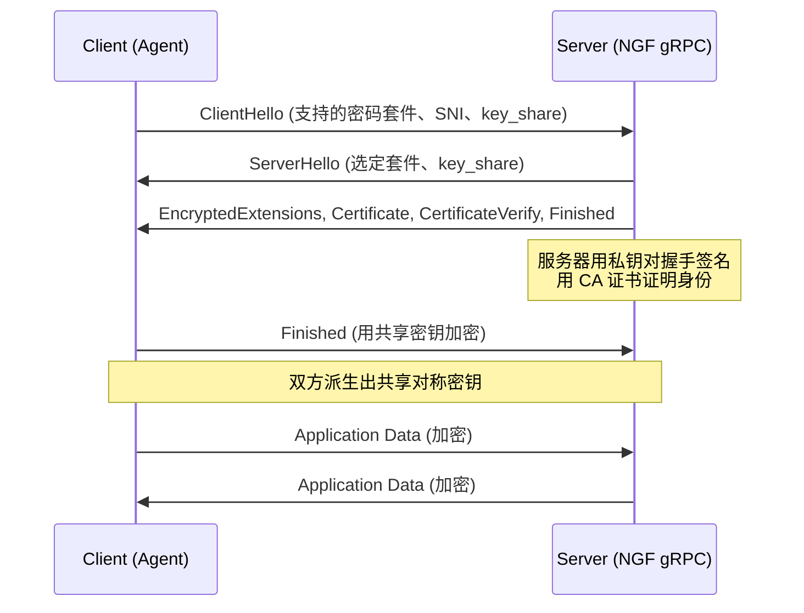
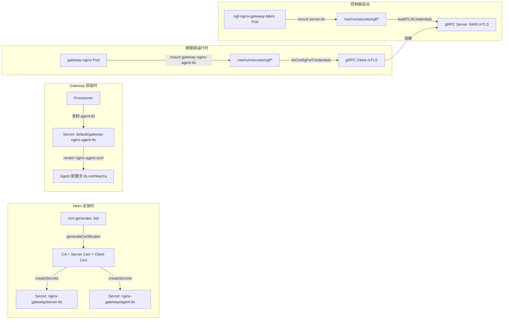
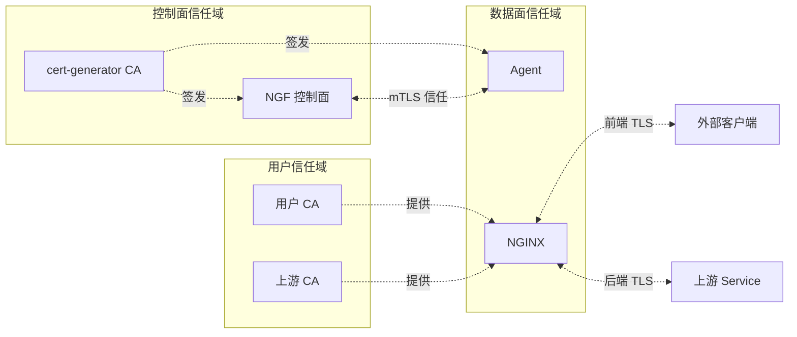

---
tags:
  - tls
  - security
  - nginx-gateway-fabric
  - nginx-agent
  - kubernetes
  - gateway-api
  - mTLS
  - obsidian
aliases:
  - NGF TLS 分析
  - NGINX Gateway Fabric TLS
created: 2026-07-06
updated: 2026-07-06
source-projects:
  - nginx-gateway-fabric@v2.6.5
  - agent@v3.11.1
---

# TLS 在 NGINX Gateway Fabric 与 NGINX Agent 中的应用分析

> [!abstract] 核心结论
> **NGINX Gateway Fabric (NGF) 与 NGINX Agent 之间存在三个相互独立、各司其职的 TLS 域**：(1) 控制面 ↔ 数据面 Agent 之间的 **gRPC mTLS 通道**，由 Helm cert-generator Job 用一个自签 CA 同时签发服务器/客户端证书，是当前 kind 部署中**唯一真正在线运行的 TLS**；(2) 数据面 NGINX 对外部客户端的 **前端 TLS 终止**（Gateway API HTTPS/TLS Listener），由用户提供的 `tls.certificateRefs` Secret 驱动，代码完整支持但本环境未启用；(3) NGINX 反向代理到上游 Service 的 **后端 TLS 验证**（Gateway API `BackendTLSPolicy`），用 CA 证书或系统信任库验证上游证书。三者密码学原理相同，但**密钥来源、握手角色、配置路径完全分离**，理解这一点是理解整个 TLS 体系的关键。

相关文档：[[ngf-control-plane-architecture-obsidian]]、[[ngf-agent-grpc-auth-analysis]]、[[cafe-example-data-plane-trace-obsidian]]

---

## 1. TLS 理论基础（第一性原理）

### 1.1 TLS 解决的本质问题

在一个不可信的网络（如 Kubernetes 集群内、公网）上，两个端点通信面临三类威胁：

| 威胁 | TLS 对策 | 密码学原语 |
|------|---------|-----------|
| **窃听** | 加密 | 对称加密（AES-GCM、ChaCha20-Poly1305） |
| **篡改** | 完整性 | AEAD（加密同时带 MAC） |
| **冒充** | 身份认证 | 非对称签名（RSA-PSS、ECDSA、Ed25519） + PKI 信任链 |

TLS 1.3（NGF 控制面 gRPC 强制使用的版本）将握手压缩为 1-RTT，并强制使用前向安全（ECDHE），即**即使服务器长期私钥泄露，过去抓到的流量也无法被解密**。

### 1.2 握手流程（TLS 1.3 简化版）



### 1.3 mTLS（双向 TLS）的关键差异

普通 TLS 只验证**服务器**身份（浏览器验证 `https://example.com` 的证书）。mTLS 额外要求**服务器也验证客户端**：

- 服务器在 `ClientHello` 阶段发送 `CertificateRequest`
- 客户端必须回送一张由**服务器信任的 CA** 签发的客户端证书
- 服务器配置 `ClientAuth: RequireAndVerifyClientCert` + `ClientCAs: <CA 证书池>`

> [!important] mTLS 的对称性
> mTLS 不是"两次 TLS"，而是**一次握手中双方互递证书**。CA 是对称性的支点：服务器证书和客户端证书必须由**同一个 CA**（或服务器 `ClientCAs` 池中信任的 CA）签发，否则握手在 `CertificateVerify` 阶段失败。这正是 NGF cert-generator 用**单一 CA** 同时签发两套证书的设计依据。

### 1.4 证书链验证的三个判定

Go 的 `crypto/tls` 在验证一张证书时检查：

1. **签名链可追溯**到 `RootCAs`/`ClientCAs` 池中的某张 CA 证书
2. **主机名匹配**：证书 SAN（Subject Alternative Name）中存在 `ServerName` 对应的 DNS 条目
3. **时效与用途**：`NotBefore ≤ now ≤ NotAfter`，且 `KeyUsage` 允许当前用途

`InsecureSkipVerify: true` 会跳过前两项——agent 代码中保留这个开关是为了开发/测试，**生产 NGF 部署绝不会用它**。

---

## 2. 架构总览：三个 TLS 域

```mermaid
graph TB
    subgraph "域① 控制面 ↔ 数据面 Agent mTLS"
        NGF["NGF 控制面<br/>gRPC Server :8443<br/>server-tls Secret"]
        AGENT["NGINX Agent<br/>gRPC Client<br/>agent-tls Secret"]
        NGF <-.mTLS.- AGENT
    end

    subgraph "域② 前端 TLS 终止"
        CLIENT["外部客户端<br/>浏览器/curl"]
        NGINX["NGINX 数据面<br/>HTTPS Listener<br/>ssl_certificate"]
        CLIENT <-.TLS.- NGINX
    end

    subgraph "域③ 后端 TLS 验证"
        NGINX2["NGINX 数据面<br/>proxy_ssl_verify"]
        UPSTREAM["上游 Service<br/>(HTTPS)"]
        NGINX2 <-.TLS.- UPSTREAM
    end

    CA1["cert-generator<br/>自签 CA<br/>(域①专用)"] -.签发.-> NGF
    CA1 -.签发.-> AGENT
    USER_SECRET["用户提供的 Secret<br/>tls.certificateRefs<br/>(域②)"] -.提供.-> NGINX
    BTP_CA["BackendTLSPolicy<br/>caCertificateRefs /<br/>wellKnownCACertificates:System<br/>(域③)"] -.提供.-> NGINX2
```

| 域 | 握手角色 | 密钥来源 | 强制 TLS 版本 | 本环境是否启用 |
|----|---------|---------|--------------|--------------|
| ① 控制面 ↔ Agent | mTLS（双向） | cert-generator 自签 CA | TLS 1.3 | ✅ 是（运行中） |
| ② 前端 TLS 终止 | 单向（服务器认证） | 用户 Secret（`tls.certificateRefs`） | 用户配置（默认 TLS 1.2+） | ❌ 否（kind 仅 HTTP listener） |
| ③ 后端 TLS 验证 | 单向（客户端=NGINX 验证上游） | BackendTLSPolicy CA 或系统信任库 | NGINX 默认 | ❌ 否（无 BTP 资源） |

---

## 3. 域① 控制面 ↔ 数据面 Agent mTLS（核心域）

这是 NGF 2.x 架构的**安全基石**：NGF 控制面不再直接写 NGINX 配置文件，而是通过 gRPC 长连接把配置推给每个 NGINX Pod 内的 Agent。这条通道承载：

- 控制面 → 数据面：NGINX 配置文件、NGINX Plus API 操作
- 数据面 → 控制面：配置应用结果、健康状态、指标

> [!warning] 为什么这条通道必须用 mTLS 而非普通 TLS
> 这条 gRPC 接口允许**写入任意文件到 NGINX Pod 的 `/etc/nginx`**（配置下发）并触发 reload。如果只做服务器认证，任何能访问 `ngf-nginx-gateway-fabric:443` 的 Pod 都能冒充一个合法数据面注册并注入恶意配置。mTLS 让控制面**只接受持有由本 CA 签发的客户端证书的 Agent**，把攻击面收窄到"CA 私钥泄露"这一极小概率事件。

### 3.1 密钥与证书的生成（cert-generator Job）

**触发点**：Helm `pre-install, pre-upgrade` hook（`charts/nginx-gateway-fabric/templates/certs-job.yaml:116`）

```yaml
# charts/nginx-gateway-fabric/templates/certs-job.yaml:127-133
- args:
  - generate-certs
  - --service={{ include "nginx-gateway.fullname" . }}
  - --cluster-domain={{ .Values.clusterDomain }}
  - --server-tls-domain={{ .Values.serverTLSDomain }}   # 默认 "svc"
  - --server-tls-secret={{ .Values.certGenerator.serverTLSSecretName }}  # "server-tls"
  - --agent-tls-secret={{ .Values.certGenerator.agentTLSSecretName }}     # "agent-tls"
```

**核心实现**：`cmd/gateway/certs.go`

```go
// cmd/gateway/certs.go:48
func generateCertificates(service, namespace, clientDNSDomain, serverTLSDomain string) (*certificateConfig, error) {
    caCertPEM, caKeyPEM, err := generateCA()              // ① 自签 CA（RSA 2048）
    // ...
    serverCert, serverKey, err := generateCert(caKeyPair, serverDNSNames(service, namespace, serverTLSDomain))
    //                                                // ② 服务器证书 SAN:
    //                                                //   ngf-nginx-gateway-fabric.nginx-gateway.svc
    clientCert, clientKey, err := generateCert(caKeyPair, clientDNSNames(clientDNSDomain))
    //                                                // ③ 客户端证书 SAN: *.cluster.local
}
```

> [!note] SAN 设计的精妙之处
> - **服务器证书**的 SAN 是 `ngf-nginx-gateway-fabric.nginx-gateway.svc`——这是控制面 Service 的集群内 DNS 名。Agent 连这个名，Go 的 `tls.Config.ServerName` 用它做主机名校验。
> - **客户端证书**的 SAN 是 `*.cluster.local`——一个通配名，因为 Agent Pod 名是动态的，无法预先写入。**控制面验证客户端证书时只校验 CA 签名链，不校验客户端主机名**（Go 默认行为），所以通配 SAN 足够。

**CA 证书属性**（`cmd/gateway/certs.go:84`）：

```go
ca := &x509.Certificate{
    Subject:               subject,                              // O=NGINX, OU=NGINX
    NotBefore:             time.Now(),
    NotAfter:              time.Now().Add(expiry),               // 1 年
    KeyUsage:              x509.KeyUsageCertSign | x509.KeyUsageDigitalSignature | x509.KeyUsageKeyEncipherment,
    IsCA:                  true,
    BasicConstraintsValid: true,
}
```

**产出两个 Secret**（`cmd/gateway/certs.go:178-202`）：

| Secret 名 | Namespace | 内容 | 用途 |
|-----------|-----------|------|------|
| `server-tls` | `nginx-gateway` | `ca.crt` + `tls.crt`(服务器) + `tls.key`(服务器) | 挂载到**控制面** Pod，作为 gRPC 服务器证书 + 验证 Agent 的 CA |
| `agent-tls` | `nginx-gateway` | `ca.crt` + `tls.crt`(客户端) + `tls.key`(客户端) | 被 provisioner **复制**到数据面 namespace，挂载到 Agent 容器 |

两个 Secret 的 `ca.crt` 是**同一份 CA**——这就是 mTLS 对称性的支点。

### 3.2 控制面：gRPC 服务器端 mTLS 实现

**文件**：`internal/controller/nginx/agent/grpc/grpc.go`

```go
// internal/controller/nginx/agent/grpc/grpc.go:30-32
const (
    caCertPath  = "/var/run/secrets/ngf/" + secrets.CAKey      // /var/run/secrets/ngf/ca.crt
    tlsCertPath = "/var/run/secrets/ngf/" + secrets.TLSCertKey  // /var/run/secrets/ngf/tls.crt
    tlsKeyPath  = "/var/run/secrets/ngf/" + secrets.TLSKeyKey   // /var/run/secrets/ngf/tls.key
)
```

这些路径来自 Deployment 的 volumeMount（`server-tls` Secret 挂载到 `/var/run/secrets/ngf`）：

```yaml
# nginx-gateway ns 中 ngf-nginx-gateway-fabric Deployment
volumeMounts:
- mountPath: /var/run/secrets/ngf
  name: nginx-agent-tls
volumes:
- name: nginx-agent-tls
  secret:
    secretName: server-tls   # nginx-gateway/server-tls
```

**mTLS 配置的核心**（`grpc.go:150-189`）：

```go
func buildTLSCredentials(caPath, certPath, keyPath string) (credentials.TransportCredentials, error) {
    // 启动时校验初始文件可解析（fail-fast）
    if _, err := loadCACertPool(caPath); err != nil { return nil, err }
    if _, err := tls.LoadX509KeyPair(certPath, keyPath); err != nil { return nil, err }

    tlsConfig := &tls.Config{
        GetConfigForClient: buildConfigForClient(caPath, certPath, keyPath),
        MinVersion:         tls.VersionTLS13,   // 强制 TLS 1.3
    }
    return credentials.NewTLS(tlsConfig), nil
}

func buildConfigForClient(caPath, certPath, keyPath string) func(*tls.ClientHelloInfo) (*tls.Config, error) {
    return func(_ *tls.ClientHelloInfo) (*tls.Config, error) {
        certPool, err := loadCACertPool(caPath)        // 每次握手重新读 CA
        // ...
        return &tls.Config{
            GetCertificate: func(_ *tls.ClientHelloInfo) (*tls.Certificate, error) {
                serverCert, err := tls.LoadX509KeyPair(certPath, keyPath)  // 每次握手重新读证书
                // ...
                return &serverCert, nil
            },
            ClientAuth: tls.RequireAndVerifyClientCert,  // ← mTLS 的关键：强制并验证客户端证书
            ClientCAs:  certPool,                        // ← 用 CA 池验证 Agent 证书
            MinVersion: tls.VersionTLS13,
        }, nil
    }
}
```

> [!tip] 设计亮点：动态重载
> `GetConfigForClient` + `GetCertificate` 两个回调让**每次新连接握手时都从磁盘重新读 CA 和服务器证书**。这意味着 cert-generator Job 在 `pre-upgrade` hook 重新签发证书后，**控制面无需重启即可应用新证书**——下一条进来的连接就会用新证书。
>
> 配合 `filewatcher`（`grpc.go:96-102`）监控这三个文件变更，一旦文件变化就通过 `resetConnChan` 让 `commandService.Subscribe` 返回 `codes.Unavailable`（`command.go:207`），强制 Agent 重连，重连时拿到新证书。

**gRPC 服务器创建**（`grpc.go:114-137`）：

```go
func (g *Server) createServer(tlsCredentials credentials.TransportCredentials) *grpc.Server {
    return grpc.NewServer(
        grpc.KeepaliveParams(keepalive.ServerParameters{Time: 15s, Timeout: 10s}),
        grpc.KeepaliveEnforcementPolicy(keepalive.EnforcementPolicy{
            MinTime: 15s, PermitWithoutStream: true,
        }),
        grpc.ChainStreamInterceptor(g.interceptor.Stream(g.logger)),
        grpc.ChainUnaryInterceptor(g.interceptor.Unary(g.logger)),
        grpc.Creds(tlsCredentials),                         // ← TLS 凭证
        grpc.MaxSendMsgSize(4MB), grpc.MaxRecvMsgSize(4MB), // 与 Agent 端对齐
    )
}
```

监听端口 **8443**（容器内），通过 Service `ngf-nginx-gateway-fabric:443` 对集群暴露。

### 3.3 数据面：Agent gRPC 客户端 mTLS 实现

**Agent 项目文件**：`internal/grpc/grpc.go`（agent 仓库）

Agent 的 `nginx-agent.conf`（运行时实证，来自 kind Pod `/etc/nginx-agent/nginx-agent.conf`）：

```yaml
command:
  server:
    host: ngf-nginx-gateway-fabric.nginx-gateway.svc    # 控制面 Service DNS
    port: 443                                            # Service 端口
  auth:
    tokenpath: /var/run/secrets/ngf/serviceaccount/token
  tls:
    cert: /var/run/secrets/ngf/tls.crt                   # 客户端证书
    key:  /var/run/secrets/ngf/tls.key                   # 客户端私钥
    ca:   /var/run/secrets/ngf/ca.crt                    # 验证服务器用的 CA
    server_name: ngf-nginx-gateway-fabric.nginx-gateway.svc  # SNI / 主机名校验
```

**配置类型定义**（agent 仓库 `internal/config/types.go:321`）：

```go
TLSConfig struct {
    Cert       string `yaml:"cert"`
    Key        string `yaml:"key"`
    Ca         string `yaml:"ca"`
    ServerName string `yaml:"server_name"`
    SkipVerify bool   `yaml:"skip_verify"`   // ⚠️ 生产必须 false
}
```

**构建 TLS 凭证**（agent 仓库 `internal/grpc/grpc.go:388`）：

```go
func tlsConfigForCredentials(c *config.TLSConfig) (*tls.Config, error) {
    if c.SkipVerify {
        slog.Warn("Verification of the server's certificate chain and host name is disabled")
    }
    tlsConfig := &tls.Config{
        MinVersion:         tls.VersionTLS12,   // Agent 端允许 1.2，但服务器强制 1.3 → 实际协商 1.3
        ServerName:         c.ServerName,       // ← 服务器主机名校验
        InsecureSkipVerify: c.SkipVerify,       // false 时启用完整校验
    }
    if err := appendRootCAs(tlsConfig, c.Ca); err != nil { ... }      // 加载 CA 验证服务器
    if err := appendCertKeyPair(tlsConfig, c.Cert, c.Key); err != nil { ... }  // 客户端证书
    return tlsConfig, nil
}
```

**Dial 装配**（agent 仓库 `internal/grpc/grpc.go:239`）：

```go
func addTransportCredentials(commandConfig *config.Command, opts []grpc.DialOption) []grpc.DialOption {
    transportCredentials, err := transportCredentials(commandConfig)
    // ...
    opts = append(opts, grpc.WithTransportCredentials(transportCredentials))
    return opts
}
```

### 3.4 Secret 的跨命名空间复制

控制面 ns（`nginx-gateway`）的 `agent-tls` 必须出现在数据面 ns（`default`）才能被 Agent Pod 挂载。这是 **Provisioner** 的职责：

**文件**：`internal/controller/provisioner/objects.go`

```go
// objects.go:259
agentTLS: controller.CreateNginxResourceName(resourceName, p.cfg.AgentTLSSecretName)

// objects.go:458 - 把 nginx-gateway/agent-tls 复制为 default/<gateway-nginx-agent-tls>
if secret := addSecret(p.cfg.AgentTLSSecretName, names.agentTLS, corev1.SecretTypeTLS); secret != nil {
    secretsList = append(secretsList, secret)
}
```

复制后的 Secret 名为 `gateway-nginx-agent-tls`，ownerReference 指向 Gateway 资源，随 Gateway 删除而清理。

**挂载到数据面 Pod**（`objects.go:1187, 1235-1238`）：

```go
{MountPath: "/var/run/secrets/ngf", Name: "nginx-agent-tls"},
// ...
{Name: "nginx-agent-tls", Secret: &corev1.SecretVolumeSource{
    SecretName: names.agentTLS,   // gateway-nginx-agent-tls
}}
```

> [!example] kind 环境实证
> ```bash
> $ kubectl get secrets -A | grep -iE "tls|cert"
> default         gateway-nginx-agent-tls     kubernetes.io/tls    3      12d   # ← 复制到数据面 ns
> nginx-gateway   agent-tls                   kubernetes.io/tls    3      3   # ← cert-generator 产出
> nginx-gateway   server-tls                  kubernetes.io/tls    3      3   # ← cert-generator 产出
> ```
> 三个 Secret 都含 `ca.crt`/`tls.crt`/`tls.key` 三个 key。`gateway-nginx-agent-tls` 的 `ca.crt` 与 `server-tls` 的 `ca.crt` 完全相同（base64 解码后字节一致）——证明它们同源。

### 3.5 Agent 侧的凭证热重载

Agent 还有一个独立的**凭证文件监控器**（agent 仓库 `internal/watcher/credentials/credential_watcher_service.go`）：

```go
// credential_watcher_service.go:197
func credentialPaths(agentConfig *config.Command) []string {
    var paths []string
    if agentConfig.TLS != nil {
        if agentConfig.TLS.Ca != ""    { paths = append(paths, agentConfig.TLS.Ca) }
        if agentConfig.TLS.Cert != ""  { paths = append(paths, agentConfig.TLS.Cert) }
        if agentConfig.TLS.Key != ""   { paths = append(paths, agentConfig.TLS.Key) }
    }
    return paths
}
```

fsnotify 监控这三个文件，一旦变化就重建 `GrpcConnection` 并通过 `CredentialUpdateMessage` 通知插件层。这与控制面侧的 `filewatcher` 形成**双向热重载闭环**——证书轮换无需重启任何一端。

### 3.6 mTLS 完整调用链



---

## 4. 域② 前端 TLS 终止（Gateway API Listener）

这是 Gateway API 标准定义的 TLS：用户在 `Gateway` 资源的 listener 中声明 `protocol: HTTPS` 或 `protocol: TLS`，并通过 `tls.certificateRefs` 指向一个 `kubernetes.io/tls` Secret。NGF 把它翻译成 NGINX 的 `ssl_certificate`/`ssl_certificate_key` 指令。

### 4.1 Gateway API 资源模型

```yaml
apiVersion: gateway.networking.k8s.io/v1
kind: Gateway
spec:
  listeners:
  - name: https
    protocol: HTTPS        # 或 TLS（TCP 透传 + SNI 路由）
    port: 443
    hostname: cafe.example.com
    tls:
      mode: Terminate      # 或 Passthrough
      certificateRefs:
      - kind: Secret
        name: cafe-tls     # ← 用户的 kubernetes.io/tls Secret
      options:
        ssl-protocols: "TLSv1.2 TLSv1.3"   # NGF 特定扩展
        ssl-ciphers: "..."
```

### 4.2 NGF 对 Listener TLS 的校验

**文件**：`internal/controller/state/graph/gateway_listener.go`

```go
// gateway_listener.go:154-173 - HTTPS listener configurator
https: &listenerConfigurator{
    validators: []listenerValidator{
        validateListenerAllowedRouteKind,
        validateListenerLabelSelector,
        validateListenerHostname,
        createHTTPSListenerValidator(protectedPorts),
        validateListenerTLSTerminateFields,   // ← 校验 TLS 字段
    },
    externalReferenceResolvers: []listenerExternalReferenceResolver{
        createExternalReferencesForTLSSecretsResolver(...),  // ← 解析 certificateRefs 指向的 Secret
    },
    frontendTLSCaCertReferenceResolvers: []listenerFrontendTLSCaCertReferenceResolver{
        createFrontendTLSCaCertReferenceResolver(...),       // ← 解析前端 mTLS 的 CA（可选）
    },
}
```

**校验逻辑**（`gateway_listener.go:548-577`）：

```go
func validateTLSTerminateConfig(listener v1.Listener, tlsPath *field.Path) []conditions.Condition {
    if len(listener.TLS.CertificateRefs) == 0 {
        // certificateRefs must be defined for TLS mode terminate
        return conds  // → Listener 不被 Accepted
    }
    for i, certRef := range listener.TLS.CertificateRefs {
        if certRef.Kind != nil && *certRef.Kind != "Secret" {
            // 只支持 Secret kind
        }
        if certRef.Group != nil && *certRef.Group != "" {
            // Secret 的 group 必须为空（core API）
        }
    }
}
```

### 4.3 从 Secret 到 NGINX 配置的转换链

```mermaid
flowchart TD
    A[Gateway Listener<br/>tls.certificateRefs] --> B[graph.Listener<br/>ResolvedSecrets]
    B --> C[dataplane.SSLKeyPairs<br/>map[SSLKeyPairID]SSLKeyPair]
    C --> D[generatePEM<br/>写入 /etc/nginx/secrets/ssl_keypair_ns_name.pem]
    D --> E[http.Server.SSL<br/>Certificates: [pem 路径]]
    E --> F[NGINX 模板<br/>ssl_certificate / ssl_certificate_key]
```

**关键转换函数**（`internal/controller/state/dataplane/configuration.go`）：

```go
// configuration.go:1616
func buildSSL(listener *graph.Listener) *SSL {
    keyPairIDs := make([]SSLKeyPairID, 0, len(listener.ResolvedSecrets))
    for _, secretNsName := range listener.ResolvedSecrets {
        keyPairIDs = append(keyPairIDs, generateSSLKeyPairID(secretNsName))
        // → "ssl_keypair_<ns>_<name>"
    }
    ssl := &SSL{KeyPairIDs: keyPairIDs}
    // 解析 tls.options: ssl-protocols, ssl-ciphers, ssl-prefer-server-ciphers
    if listener.Source.TLS != nil && listener.Source.TLS.Options != nil {
        if protocols, ok := listener.Source.TLS.Options[graph.SSLProtocolsKey]; ok {
            ssl.Protocols = string(protocols)
        }
        // ...
    }
    return ssl
}
```

**SSL 数据结构**（`internal/controller/state/dataplane/types.go:212`）：

```go
type SSL struct {
    Protocols           string
    Ciphers             string
    ClientCertBundleID CertBundleID           // 前端 mTLS：验证客户端证书的 CA
    VerifyClient        SSLVerifyClientMode    // "on" | "optional_no_ca"
    KeyPairIDs          []SSLKeyPairID         // 多证书支持 SNI
    RequireVerifiedCert bool
    PreferServerCiphers bool
}
```

> [!note] SNI 多证书
> `KeyPairIDs` 是**切片**——一个 listener 可以引用多张证书，NGINX 在 TLS 握手时根据 ClientHello 的 SNI 字段选择匹配的证书。这是 Gateway API 支持同端口多主机名 HTTPS 的机制。

### 4.4 NGINX 模板渲染

**文件**：`internal/controller/nginx/config/servers_template.go`

```go
// servers_template.go:7-46（default SSL server）
{{- range $s := .Servers -}}
    {{ if $s.IsDefaultSSL -}}
server {
    listen {{ $s.Listen }} ssl default_server;
    {{- if $s.SSL }}
        {{- range $cert := $s.SSL.Certificates }}
    ssl_certificate {{ $cert }};                    # ← 每张证书
        {{- end }}
        {{- range $key := $s.SSL.CertificateKeys }}
    ssl_certificate_key {{ $key }};                 # ← 对应私钥
        {{- end }}
        {{- if $s.SSL.Protocols }}
    ssl_protocols {{ $s.SSL.Protocols }};           # ← TLS 版本
        {{- end }}
        {{- if $s.SSL.Ciphers }}
    ssl_ciphers {{ $s.SSL.Ciphers }};               # ← 密码套件
        {{- end }}
        {{- if $s.SSL.ClientCertificate }}
    ssl_client_certificate {{ $s.SSL.ClientCertificate }};  # ← 前端 mTLS CA
        {{- end }}
        {{- if $s.SSL.VerifyClient }}
    ssl_verify_client {{ $s.SSL.VerifyClient }};    # ← 客户端证书验证模式
        {{- end }}
    {{- else }}
    ssl_reject_handshake on;                        # 无证书时拒绝握手
    {{- end }}
}
```

**生成 PEM 文件**（`internal/controller/nginx/config/generator.go:241`）：

```go
func generatePEM(id dataplane.SSLKeyPairID, cert []byte, key []byte) agent.File {
    c := make([]byte, 0, len(cert)+len(key)+1)
    c = append(c, cert...)
    c = append(c, '\n')
    c = append(c, key...)
    return agent.File{
        Meta: &pb.FileMeta{Name: generatePEMFileName(id), ...},  // /etc/nginx/secrets/ssl_keypair_<ns>_<name>.pem
        Contents: c,
    }
}
```

NGINX 的 `ssl_certificate` 指令支持 PEM 文件中**同时包含证书和私钥**——NGF 利用这一点把两者写入同一文件，简化下发。

### 4.5 TLS Passthrough 模式

`tls.mode: Passthrough` 时不终止 TLS，而是用 NGINX **stream 模块的 ssl_preread** 按 SNI 路由到上游，让上游自己终止 TLS：

**文件**：`internal/controller/nginx/config/stream_servers.go`

```go
// stream_servers.go:267
func createTLSTerminateSocketServer(server dataplane.Layer4VirtualServer, ...) []stream.Server {
    // Passthrough 模式下，stream server 用 ssl_preread 读取 SNI 后 proxy_pass 到上游
    // 上游自己终止 TLS
}
```

### 4.6 前端 mTLS（可选高级特性）

Gateway API v1 支持在 listener 上配置 `tls.frontendValidation.certificateRefs`，要求**客户端也提供证书**。NGF 翻译为：

- `ssl_client_certificate <ca bundle>` —— 信任的客户端 CA
- `ssl_verify_client on` —— 强制验证
- `ssl_verify_depth 4` —— 证书链深度
- `error_page 495 496 = @frontend_tls_verify_failed` —— 验证失败返回 444（关闭连接）

这与域①的 mTLS **密码学完全相同**，区别仅在：CA 是用户提供的（而非 cert-generator 自签），且发生在 NGINX 数据面而非控制面 gRPC。

---

## 5. 域③ 后端 TLS 验证（BackendTLSPolicy）

当上游 Service 是 HTTPS 时，NGINX 作为客户端连接上游，需要验证上游证书。Gateway API 用 `BackendTLSPolicy` 声明如何验证。

### 5.1 资源模型

```yaml
apiVersion: gateway.networking.k8s.io/v1
kind: BackendTLSPolicy
spec:
  targetRefs:
  - group: ""
    kind: Service
    name: my-https-app
  validation:
    hostname: my-https-app.default.svc.cluster.local   # 上游证书应包含的 SAN
    caCertificateRefs:
    - kind: ConfigMap          # 或 Secret
      name: upstream-ca
    # 或：
    # wellKnownCACertificates: System   # 用 /etc/ssl/cert.pem（Alpine 系统信任库）
```

### 5.2 NGF 校验实现

**文件**：`internal/controller/state/graph/backend_tls_policy.go`

```go
// backend_tls_policy.go:18
type BackendTLSPolicy struct {
    Source     *v1.BackendTLSPolicy
    CaCertRef  types.NamespacedName
    Gateways   []types.NamespacedName
    Conditions []conditions.Condition
    Valid      bool
    // ...
}

// backend_tls_policy.go:68-115 - 校验逻辑
func validateBackendTLSPolicy(btp *v1.BackendTLSPolicy, resourceResolver resolver.Resolver) (...) {
    // 1. 校验 hostname 格式
    if err := validateBackendTLSHostname(btp); err != nil { valid = false }
    
    // 2. caCertificateRefs 与 wellKnownCACertificates 互斥
    switch {
    case len(caCertRefs) > 0 && wellKnownCerts != nil:
        valid = false  // "mutually exclusive"
    case len(caCertRefs) > 0:
        // 校验 caCertRefs：必须恰好 1 个，kind ∈ {ConfigMap, Secret}，group ∈ {"", "core"}
        certConds := validateBackendTLSCACertRef(btp, resourceResolver)
    case wellKnownCerts != nil:
        // 必须是 System
        if *wellKnownCerts != v1.WellKnownCACertificatesSystem { valid = false }
    default:
        valid = false  // 至少要有一个
    }
}
```

### 5.3 NGINX 翻译

后端 TLS 验证翻译为 NGINX 的 `proxy_ssl_*` 指令：

**HTTP 上游**（`servers_template.go:297-305`）：

```nginx
proxy_ssl_server_name on;                          # 启用 SNI 发送
proxy_ssl_verify on;                               # 验证上游证书
proxy_ssl_verify_depth 4;                          # 证书链深度
proxy_ssl_name {{ $l.ProxySSLVerify.Name }};       # 校验主机名（来自 BTP.hostname）
proxy_ssl_trusted_certificate {{ $l.ProxySSLVerify.TrustedCertificate }};  # CA 路径
```

**Stream/TLS 上游**（`stream_servers.go:316`）：

```go
type ProxySSLVerify struct {
    TrustedCertificate string   // → proxy_ssl_trusted_certificate / ssl_trusted_certificate
    Name               string   // → proxy_ssl_name / ssl_name
}
```

### 5.4 系统信任库路径

`wellKnownCACertificates: System` 时，NGF 用 Alpine 的系统 CA 包：

```go
// internal/controller/state/dataplane/configuration.go:33
const AlpineSSLRootCAPath = "/etc/ssl/cert.pem"
```

NGINX 容器基于 Alpine，这个文件包含 Mozilla 维护的根 CA 列表。

---

## 6. Agent 项目中的其他 TLS 应用

除域①（控制面 gRPC mTLS）外，Agent 项目还有几处 TLS 应用，它们与 NGF 无关但值得关注：

### 6.1 HTTP CONNECT 代理的 TLS

**文件**：agent 仓库 `internal/grpc/proxy_dialer.go`

当 Agent 通过 HTTP 代理连接控制面时，Agent 到**代理服务器**这段连接也可以用 TLS：

```go
// proxy_dialer.go:57
func buildProxyTLSConfig(proxyConf *config.Proxy) (*tls.Config, error) {
    tlsConf := &tls.Config{}
    if err := addRootCAs(tlsConf, proxyConf.TLS.Ca); err != nil { return nil, err }
    if err := addCertKeyPair(tlsConf, proxyConf.TLS.Cert, proxyConf.TLS.Key); err != nil { return nil, err }
    setServerName(tlsConf, proxyConf.TLS.ServerName)
    tlsConf.InsecureSkipVerify = proxyConf.TLS.SkipVerify
    return tlsConf, nil
}
```

这是**两层 TLS**：Agent ↔ 代理（本节配置）+ Agent ↔ 控制面（域①配置，通过 CONNECT 隧道透传）。

### 6.2 Prometheus exporter 的 TLS

Agent 内嵌的 OTel Collector Prometheus exporter 可以配置 TLS（`internal/config/types.go:185`）：

```go
PrometheusExporter struct {
    Server *ServerConfig `yaml:"server"`
    TLS    *TLSConfig    `yaml:"tls"`
}
```

在当前 kind 环境的 `nginx-agent.conf` 中，Prometheus exporter 监听 `0.0.0.0:9113` 且未配置 TLS——因为指标端点在集群内，由网络策略保护。

### 6.3 gRPC PerRPCCredentials（Token 认证）

**文件**：agent 仓库 `internal/grpc/credentials.go`

```go
type PerRPCCredentials struct {
    Token string
    ID    string
}

func (t *PerRPCCredentials) GetRequestMetadata(ctx context.Context, uri ...string) (map[string]string, error) {
    return map[string]string{
        TokenKey: t.Token,   // "authorization" header
        UUID:     t.ID,       // "uuid" header
    }, nil
}

func (t *PerRPCCredentials) RequireTransportSecurity() bool {
    return true   // ← 强制要求 TLS：Token 不会在明文信道上发送
}
```

> [!important] TLS 与 Token 的关系
> Agent 在 mTLS **之上**还叠加了一层**Bearer Token + UUID** 的应用层认证（来自 `nginx-agent.conf` 的 `auth.tokenpath`，指向 ServiceAccount token）。`RequireTransportSecurity() == true` 保证 Token 永远不会在非 TLS 连接上发送。这是**纵深防御**：即使 CA 泄露导致非法 Agent 能完成 TLS 握手，没有合法 ServiceAccount Token 仍无法通过应用层认证。详见 [[ngf-agent-grpc-auth-analysis]]。

### 6.4 自签证书工具

**文件**：agent 仓库 `pkg/tls/self_signed_cert.go`

Agent 提供 `CertReq` 类型用于 OTLP receiver 等场景的自签证书生成，逻辑与 NGF 的 `generateCertificates` 类似但更通用。这是 Agent 作为通用数据面组件的产物——它不只为 NGF 服务。

---

## 7. kind 部署环境实证

### 7.1 运行中的资源清单

```
NAMESPACE       NAME                                 TYPE           PORT(S)
nginx-gateway   service/ngf-nginx-gateway-fabric     ClusterIP      443/TCP   ← 控制面 gRPC（域①）
default         service/gateway-nginx                NodePort       80:31437  ← 数据面（仅 HTTP，域②未启用）
```

```
NAMESPACE       SECRET                          TYPE                DATA
nginx-gateway   server-tls                      kubernetes.io/tls   3   ← 控制面服务器证书（域①）
nginx-gateway   agent-tls                       kubernetes.io/tls   3   ← Agent 客户端证书模板（域①）
default         gateway-nginx-agent-tls         kubernetes.io/tls   3   ← 复制到数据面 ns（域①）
```

### 7.2 控制面 Deployment 关键 TLS 配置

```yaml
# nginx-gateway/ngf-nginx-gateway-fabric
spec:
  containers:
  - name: nginx-gateway
    args:
    - --agent-tls-secret=agent-tls          # 指定 agent-tls Secret 名
    ports:
    - containerPort: 8443                   # gRPC mTLS 端口
      name: agent-grpc
    volumeMounts:
    - mountPath: /var/run/secrets/ngf       # server-tls 挂载点
      name: nginx-agent-tls
  volumes:
  - name: nginx-agent-tls
    secret:
      secretName: server-tls                # nginx-gateway/server-tls
```

### 7.3 数据面 Pod 关键 TLS 配置

```yaml
# default/gateway-nginx-<pod>
spec:
  initContainers:
  - name: init
    command: [/usr/bin/gateway, initialize, --source, /agent/nginx-agent.conf, --destination, ...]
  containers:
  - name: nginx
    volumeMounts:
    - mountPath: /etc/nginx-agent
      name: nginx-agent                     # nginx-agent.conf 挂载
    - mountPath: /var/run/secrets/ngf       # agent-tls 挂载点
      name: nginx-agent-tls
    - mountPath: /var/run/secrets/ngf/serviceaccount
      name: token                           # ServiceAccount token（PerRPCCredentials 用）
  volumes:
  - name: nginx-agent-tls
    secret:
      secretName: gateway-nginx-agent-tls   # default/gateway-nginx-agent-tls
```

### 7.4 运行中的 nginx-agent.conf（从 Pod 内读取）

```yaml
command:
  server:
    host: ngf-nginx-gateway-fabric.nginx-gateway.svc   # 控制面 Service DNS
    port: 443
  auth:
    tokenpath: /var/run/secrets/ngf/serviceaccount/token
  tls:
    cert: /var/run/secrets/ngf/tls.crt
    key: /var/run/secrets/ngf/tls.key
    ca: /var/run/secrets/ngf/ca.crt
    server_name: ngf-nginx-gateway-fabric.nginx-gateway.svc
```

> [!success] 证据闭环
> `server-tls` 的 `ca.crt` 与 `gateway-nginx-agent-tls` 的 `ca.crt`（base64 解码后）字节一致 → 同一 CA → mTLS 握手能成功。
> `server-tls` 的 `tls.crt` 的 SAN 包含 `ngf-nginx-gateway-fabric.nginx-gateway.svc`（与 `nginx-agent.conf` 的 `server_name` 一致）→ 主机名校验通过。

### 7.5 当前 Gateway 资源（证明域②未启用）

```yaml
# default/gateway
spec:
  listeners:
  - name: http
    protocol: HTTP          # ← 不是 HTTPS，所以域②未启用
    port: 80
    hostname: "*.example.com"
```

如果改成 HTTPS，NGF 会要求 `tls.certificateRefs`，否则 listener 状态为 `Accepted=False`。

---

## 8. 设计原因分析

### 8.1 为什么控制面 ↔ Agent 用自签 CA 而非 cert-manager？

**约束**：NGF 必须能在没有 cert-manager 的集群开箱即用；这条通道是内部通道，不面向公网，无需公网信任的 CA。

**选择**：Helm pre-install Job 用 Go 标准库 `crypto/x509` 自签 CA，1 年有效，pre-upgrade 自动轮换。

**优缺点**：
- ✅ 零外部依赖，开箱即用
- ✅ CA 私钥只存在于 Job 内存中，Job 结束即销毁（除非显式持久化）
- ✅ SAN 精确匹配 Service DNS，无通配证书风险
- ⚠️ 用户必须信任 Helm 安装时的节点（Job 在节点上运行）
- ⚠️ 轮换依赖 `pre-upgrade` hook，用户必须 `helm upgrade`

Helm chart 同时支持 `certGenerator.enable: false`，让用户用 cert-manager 自行管理 `server-tls`/`agent-tls`。

### 8.2 为什么强制 TLS 1.3？

```go
// 控制面：grpc.go:161, 187
MinVersion: tls.VersionTLS13,
// Agent：grpc.go:394
MinVersion: tls.VersionTLS12,   // Agent 兼容到 1.2，但服务器强制 1.3 → 实际 1.3
```

**原因**：
- TLS 1.3 强制前向安全（ECDHE），即使长期私钥泄露也无法解密历史流量
- 握手 1-RTT，比 1.2 的 2-RTT 减少延迟（对 Agent 频繁重连场景重要）
- 移除了不安全的密码套件（RSA key exchange、CBC 模式、SHA-1）
- Kubernetes 1.31+ 的 Go 版本原生支持，无兼容性顾虑

### 8.3 为什么用 `GetConfigForClient` 而非启动时一次性加载？

**约束**：证书需要轮换（cert-generator pre-upgrade 会更新 Secret，kubelet 会把新内容刷到 volume）。

**方案对比**：
1. **启动时加载** → 轮换需重启控制面，所有 Agent 连接中断
2. **`GetConfigForClient` 每次握手读盘** → 新连接自动用新证书，旧连接不受影响
3. **`filewatcher` + `resetConnChan`** → 主动断开旧连接，触发 Agent 重连

NGF 选 ②+③ 组合：被动（新连接）+ 主动（旧连接）双重保证。代价是每次握手多两次磁盘读（CA + 证书），但 `os.ReadFile` 在 tmpfs/overlayfs 上是微秒级。

### 8.4 为什么 Secret 跨 ns 复制而非用ProjectedVolume？

**约束**：数据面 Pod 在用户 namespace（如 `default`），而 `agent-tls` 在控制面 ns（`nginx-gateway`）；跨 ns Secret 引用需要 ReferenceGrant 或控制器复制。

**选择**：Provisioner 主动复制 Secret 到数据面 ns，ownerReference 指向 Gateway。

**原因**：
- ReferenceGrant 是 Gateway API 标准，但要求用户额外创建资源，增加心智负担
- 主动复制让数据面 ns 自包含，删除 Gateway 时 Secret 随之清理
- 复制的 Secret 名字带 Gateway 前缀，避免命名冲突（多 Gateway 场景）

### 8.5 为什么 PerRPCCredentials 强制 `RequireTransportSecurity: true`？

```go
func (t *PerRPCCredentials) RequireTransportSecurity() bool {
    return true
}
```

**原因**：Bearer Token 在明文信道上会被中间人窃取。强制 TLS 保证 Token 只在加密信道传输。这是 gRPC 的标准安全约定——即使配置错误（误把 `skip_verify: true`），Token 也不会在明文上发送。

### 8.6 三个 TLS 域为什么用不同的 CA？

| 域 | CA | 理由 |
|----|----|----|
| ① 控制面 ↔ Agent | cert-generator 自签 | 内部通道，无需公网信任，开箱即用 |
| ② 前端 TLS 终止 | 用户提供的 Secret | 面向公网/客户端，必须用用户信任的 CA（如 Let's Encrypt、企业 PKI） |
| ③ 后端 TLS 验证 | 用户提供的 CA 或系统信任库 | 上游证书可能由内部 CA 或公网 CA 签发，取决于上游 |

**隔离原则**：一个域的 CA 泄露不应影响其他域。如果 cert-generator CA 泄露，攻击者只能冒充 Agent/控制面，不能伪造前端证书；反之亦然。

---

## 9. 关键代码位置速查表

| 阶段 | 域 | 文件 | 行号 | 说明 |
|------|----|------|------|------|
| CA + 证书生成 | ① | `cmd/gateway/certs.go` | 48-76 | `generateCertificates` |
| CA 自签 | ① | `cmd/gateway/certs.go` | 78-110 | `generateCA`（RSA 2048） |
| 服务器 SAN | ① | `cmd/gateway/certs.go` | 157-161 | `serverDNSNames` |
| 客户端 SAN | ① | `cmd/gateway/certs.go` | 163-167 | `clientDNSNames` |
| Secret 写入 | ① | `cmd/gateway/certs.go` | 169-232 | `createSecrets` |
| Helm Job 模板 | ① | `charts/.../certs-job.yaml` | 116-184 | `pre-install, pre-upgrade` hook |
| 控制面 gRPC 服务器 | ① | `internal/controller/nginx/agent/grpc/grpc.go` | 44-206 | `Server`, `Start`, `buildTLSCredentials` |
| mTLS 强制客户端验证 | ① | `internal/controller/nginx/agent/grpc/grpc.go` | 184 | `ClientAuth: RequireAndVerifyClientCert` |
| 动态证书重载 | ① | `internal/controller/nginx/agent/grpc/grpc.go` | 169-189 | `buildConfigForClient` |
| 文件监控触发重连 | ① | `internal/controller/nginx/agent/grpc/grpc.go` | 96-102 | `filewatcher` |
| Agent TLS 配置类型 | ① | agent `internal/config/types.go` | 321-327 | `TLSConfig` struct |
| Agent gRPC 客户端 TLS | ① | agent `internal/grpc/grpc.go` | 388-408 | `tlsConfigForCredentials` |
| Agent Dial 装配 | ① | agent `internal/grpc/grpc.go` | 239-252 | `addTransportCredentials` |
| Agent 凭证热重载 | ① | agent `internal/watcher/credentials/credential_watcher_service.go` | 197-220 | `credentialPaths` |
| Agent PerRPCCredentials | ① | agent `internal/grpc/credentials.go` | 22-38 | `RequireTransportSecurity: true` |
| Secret 跨 ns 复制 | ① | `internal/controller/provisioner/objects.go` | 458 | `addSecret(agentTLS)` |
| 数据面 volume 挂载 | ① | `internal/controller/provisioner/objects.go` | 1187, 1235-1238 | mountPath + secretName |
| Listener TLS 校验 | ② | `internal/controller/state/graph/gateway_listener.go` | 154-191 | HTTPS/TLS configurator |
| TLS Terminate 字段校验 | ② | `internal/controller/state/graph/gateway_listener.go` | 548-577 | `validateTLSTerminateConfig` |
| TLS Secret 解析 | ② | `internal/controller/state/graph/gateway_listener.go` | 168 | `createExternalReferencesForTLSSecretsResolver` |
| SSL 构建 | ② | `internal/controller/state/dataplane/configuration.go` | 1616-1639 | `buildSSL` |
| SSL 数据结构 | ② | `internal/controller/state/dataplane/types.go` | 212-230 | `SSL` struct（含 SNI 多证书） |
| PEM 文件生成 | ② | `internal/controller/nginx/config/generator.go` | 241-260 | `generatePEM` |
| NGINX http server 模板 | ② | `internal/controller/nginx/config/servers_template.go` | 7-46 | `ssl_certificate` 等 |
| NGINX stream SSL 模板 | ② | `internal/controller/nginx/config/stream_servers.go` | 267-355 | `createTLSTerminateSocketServer`, `buildStreamSSL` |
| BackendTLSPolicy 结构 | ③ | `internal/controller/state/graph/backend_tls_policy.go` | 18-34 | `BackendTLSPolicy` struct |
| BTP 校验 | ③ | `internal/controller/state/graph/backend_tls_policy.go` | 68-116 | `validateBackendTLSPolicy` |
| BTP CA ref 校验 | ③ | `internal/controller/state/graph/backend_tls_policy.go` | 129-174 | `validateBackendTLSCACertRef` |
| proxy_ssl_verify 模板 | ③ | `internal/controller/nginx/config/servers_template.go` | 297-305 | `proxy_ssl_*` 指令 |
| Stream ProxySSLVerify | ③ | `internal/controller/nginx/config/stream/config.go` | 22-25 | `ProxySSLVerify` struct |
| Alpine 系统 CA 路径 | ③ | `internal/controller/state/dataplane/configuration.go` | 33 | `AlpineSSLRootCAPath` |

---

## 10. 总结

### 10.1 角色职责矩阵

| 角色 | 域①职责 | 域②职责 | 域③职责 |
|------|---------|---------|---------|
| **cert-generator Job** | 签发 CA + 服务器/客户端证书 | — | — |
| **NGF 控制面 gRPC Server** | 用 server-tls 做 mTLS 服务器 | — | — |
| **Provisioner** | 复制 agent-tls 到数据面 ns | — | — |
| **NGINX Agent** | 用 agent-tls 做 mTLS 客户端 | — | — |
| **graph 包** | — | 校验 Listener TLS 字段、解析 Secret | 校验 BackendTLSPolicy |
| **dataplane 包** | — | 构建 `SSL` 结构 | 构建 `VerifyTLS` 结构 |
| **config 包（模板）** | — | 渲染 `ssl_certificate` | 渲染 `proxy_ssl_verify` |
| **NGINX 数据面** | — | 终止前端 TLS | 验证后端 TLS |
| **用户** | — | 提供 `tls.certificateRefs` Secret | 提供 BackendTLSPolicy + CA |

### 10.2 安全边界



**信任域隔离**：
- 控制面信任域（CA1）只覆盖 NGF ↔ Agent 通道
- 用户信任域（USER_CA）只覆盖前端 TLS
- 上游信任域（UPSTREAM_CA）只覆盖后端 TLS
- 一个域的 CA 泄露**不**自动授予其他域的访问权

### 10.3 一句话总结

> [!quote] 
> NGF 的 TLS 体系是**一套密码学原理、三套独立实现**：自签 CA 驱动的控制面 mTLS 是开箱即用的安全底座，用户 Secret 驱动的前端 TLS 终止是面向客户端的标准能力，BackendTLSPolicy 驱动的后端 TLS 验证是面向上游的合规要求。三者通过 Provisioner、graph、dataplane、config 四层管线解耦，每一层都只关心自己域内的密钥与协议，实现了**关注点分离**的安全工程典范。

---

## 附录 A：术语表

| 术语 | 含义 |
|------|------|
| TLS | Transport Layer Security，传输层安全协议 |
| mTLS | Mutual TLS，双向 TLS（双方互递证书） |
| CA | Certificate Authority，证书颁发机构 |
| SAN | Subject Alternative Name，证书主题备用名（DNS/IP） |
| SNI | Server Name Indication，TLS 扩展，握手时声明目标主机名 |
| PEM | Privacy Enhanced Mail，Base64 编码的证书/私钥格式 |
| PKI | Public Key Infrastructure，公钥基础设施 |
| ECDHE | Elliptic Curve Diffie-Hellman Ephemeral，前向安全密钥交换 |
| AEAD | Authenticated Encryption with Associated Data，认证加密 |
| BackendTLSPolicy | Gateway API 资源，声明后端 TLS 验证方式 |
| cert-generator | NGF Helm chart 中的 Job，生成控制面 mTLS 证书 |
| Provisioner | NGF 控制面组件，为每个 Gateway 创建数据面 Deployment 及相关 Secret |

## 附录 B：调试命令

```bash
# 查看 TLS Secret 内容（base64 解码后看 PEM）
kubectl get secret -n nginx-gateway server-tls -o jsonpath='{.data.tls\.crt}' | base64 -d | openssl x509 -text -noout

# 验证 CA 一致性（两个 Secret 的 ca.crt 应相同）
diff <(kubectl get secret -n nginx-gateway server-tls -o jsonpath='{.data.ca\.crt}' | base64 -d) \
     <(kubectl get secret -n default gateway-nginx-agent-tls -o jsonpath='{.data.ca\.crt}' | base64 -d)

# 查看服务器证书 SAN（应含 ngf-nginx-gateway-fabric.nginx-gateway.svc）
kubectl get secret -n nginx-gateway server-tls -o jsonpath='{.data.tls\.crt}' | base64 -d | openssl x509 -text -noout | grep -A1 "Subject Alternative Name"

# 查看数据面 Agent 配置
kubectl exec -n default deploy/gateway-nginx -- cat /etc/nginx-agent/nginx-agent.conf

# 抓包验证 mTLS 握手（需要在节点上）
# kubectl exec -n nginx-gateway deploy/ngf-nginx-gateway-fabric -- ls /var/run/secrets/ngf/
```

---

*本文档基于 nginx-gateway-fabric@v2.6.5 与 agent@v3.11.1 源码分析，结合 kind 部署环境实证。所有代码引用均来自当前仓库，可按 文件:行号 定位。*
